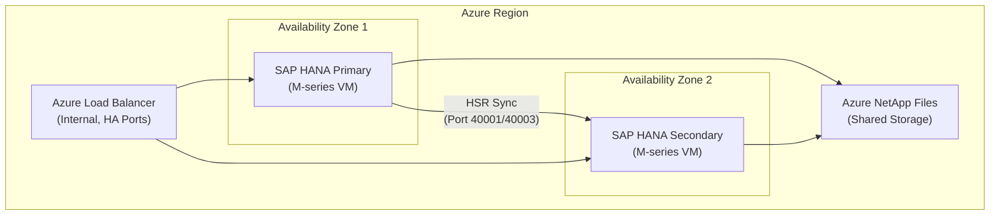

# ADR-NNNN: [Short Title of the Architecture Decision]

<!-- ADR Number: Assign sequentially. Format: ADR-NNNN (e.g., ADR-0001) -->
<!-- Title: Concise, imperative phrase. Example: "Use Azure Availability Zones for HANA HA" -->

## Status

<!-- Choose one: Proposed | Accepted | Deprecated | Superseded -->

**Status:** Proposed

<!-- If Superseded, add: Superseded by [ADR-NNNN](../adr-NNNN.md) -->
<!-- If Deprecated, add reason. -->

---

## Metadata

| Field | Value |
|---|---|
| **ADR Number** | ADR-NNNN |
| **Date** | YYYY-MM-DD |
| **Deciders** | [Name, Role], [Name, Role] |
| **Consulted** | [Name, Role] (SAP Basis), [Name, Role] (Azure Architect) |
| **Informed** | [Name, Role] (Security), [Name, Role] (Operations) |
| **Chapter** | [e.g., chapters/hana.md, chapters/networking.md] |
| **Domain** | [e.g., Compute, Networking, Storage, Security, Operations] |
| **SAP Workload** | [e.g., SAP HANA, SAP NetWeaver, SAP S/4HANA] |

---

## Context and Problem Statement

<!--
Describe the architectural context, the business or technical constraint, and the specific problem
this decision addresses. Be factual and precise. Avoid solution language in this section.

Include:
- SAP workload context (version, sizing class, tier)
- Azure environment context (region, landing zone tier, compliance scope)
- The specific problem or trade-off requiring a formal decision
- Any time or compliance constraints driving urgency
-->

[Describe the architectural situation and the problem that requires a decision. Reference the SAP
workload type, scale, and the Azure landing zone context. State what must be decided and why a
decision is needed now.]

---

## Decision Drivers

<!--
List the forces shaping this decision. Each driver should be a concrete architectural, operational,
or compliance requirement — not a preference.
-->

- **DR-1:** [e.g., RPO must be ≤ 15 minutes and RTO ≤ 4 hours per DR policy]
- **DR-2:** [e.g., SAP HANA must run on certified Azure VM SKUs per SAP Note 1928533]
- **DR-3:** [e.g., All data at rest must be encrypted with customer-managed keys per ISO 27001 scope]
- **DR-4:** [e.g., Solution must remain within Azure commercial regions; no sovereign cloud]
- **DR-5:** [e.g., Cost envelope for compute must not exceed approved CapEx/OpEx budget]
- **DR-6:** [e.g., Architecture must align with CAF Landing Zone enterprise scale design]
- **DR-7:** [Add additional drivers as required]

---

## Considered Options

| Option | Description | Decision |
|---|---|---|
| **Option A** | [Brief description of first option] | Selected |
| **Option B** | [Brief description of second option] | Rejected |
| **Option C** | [Brief description of third option] | Rejected |

---

## Decision Outcome

**Chosen option:** Option A — [Brief restatement of choice]

**Rationale summary:** [One to three sentences explaining why Option A was selected over the
alternatives. Reference the specific decision drivers it satisfies.]

### Consequences

**Positive consequences:**

- [Concrete benefit, e.g., "Availability Zones provide physical redundancy across independent
  power, cooling, and networking within the Azure region."]
- [Additional positive consequence]

**Negative consequences / trade-offs:**

- [Concrete trade-off, e.g., "Cross-zone latency for HANA synchronous replication adds ~1–2 ms
  compared to same-zone placement; acceptable given RPO requirement."]
- [Additional negative consequence or accepted risk]

**Risks accepted:**

- [e.g., "Single-region deployment accepted; mitigated by async replication to DR region per
  ADR-NNNN."]

---

## Pros and Cons of the Options

### Option A: [Full Option Name]

**Description:** [Detailed description of the option, including how it would be implemented in the
SAP on Azure context.]

| Criterion | Assessment |
|---|---|
| SAP Certification | [Supported / Not supported / Conditional] |
| Azure Native | [Yes / Partial / No] |
| HA Coverage | [Describes coverage] |
| DR Coverage | [Describes coverage] |
| Operational Complexity | [Low / Medium / High] |
| Cost Impact | [Low / Medium / High — brief note] |
| Landing Zone Alignment | [Aligned / Partially aligned / Misaligned] |

**Pros:**

- [Specific architectural advantage]
- [Specific operational advantage]
- [Specific compliance or security advantage]

**Cons:**

- [Specific limitation or trade-off]
- [Specific operational overhead]

---

### Option B: [Full Option Name]

**Description:** [Detailed description of the option.]

| Criterion | Assessment |
|---|---|
| SAP Certification | [Supported / Not supported / Conditional] |
| Azure Native | [Yes / Partial / No] |
| HA Coverage | [Describes coverage] |
| DR Coverage | [Describes coverage] |
| Operational Complexity | [Low / Medium / High] |
| Cost Impact | [Low / Medium / High — brief note] |
| Landing Zone Alignment | [Aligned / Partially aligned / Misaligned] |

**Pros:**

- [Specific architectural advantage]

**Cons:**

- [Specific reason this option was rejected]
- [Additional limitation]

---

### Option C: [Full Option Name]

**Description:** [Detailed description of the option.]

| Criterion | Assessment |
|---|---|
| SAP Certification | [Supported / Not supported / Conditional] |
| Azure Native | [Yes / Partial / No] |
| HA Coverage | [Describes coverage] |
| DR Coverage | [Describes coverage] |
| Operational Complexity | [Low / Medium / High] |
| Cost Impact | [Low / Medium / High — brief note] |
| Landing Zone Alignment | [Aligned / Partially aligned / Misaligned] |

**Pros:**

- [Specific architectural advantage]

**Cons:**

- [Specific reason this option was rejected]
- [Additional limitation]

---

## Architecture Diagram

<!--
Include a Mermaid diagram illustrating the chosen architecture. Use flowchart or C4 context style
appropriate to the decision scope.
-->

<!-- Replace the above with a diagram appropriate to your ADR. Remove placeholder nodes. -->

---

## SAP Notes Impacted

<!-- Reference all SAP Notes that apply to or constrain this decision. -->

| SAP Note ID | Title / Purpose | Architecture Impact | Where Applied |
|---|---|---|---|
| [e.g., 1928533] | [e.g., SAP Applications on Microsoft Azure: Supported Products and Azure VM types] | [e.g., Constrains VM SKU selection to certified types] | [e.g., Compute sizing, VM SKU selection] |
| [e.g., 2015553] | [e.g., SAP on Microsoft Azure: Support prerequisites] | [e.g., Defines supportability conditions for Azure deployments] | [e.g., All Azure-hosted SAP workloads] |
| [e.g., 2178632] | [e.g., Key Monitoring Metrics for SAP on Microsoft Azure] | [e.g., Defines required monitoring metrics and Azure Monitor integration] | [e.g., Operations, Azure Monitor configuration] |
| [e.g., 2191498] | [e.g., SAP on Linux in Azure: Enhanced Monitoring] | [e.g., Requires Azure Enhanced Monitoring Extension] | [e.g., All Linux-based SAP VMs] |
| [Add rows as required] | | | |

---

## Azure Services Impacted

<!-- List all Azure services introduced, modified, or constrained by this decision. -->

| Azure Service | Role in Decision | Configuration Notes |
|---|---|---|
| [e.g., Azure Virtual Machines (M-series)] | [e.g., SAP HANA primary compute] | [e.g., Must use certified SKUs per SAP Note 1928533] |
| [e.g., Azure Availability Zones] | [e.g., Physical redundancy for HA] | [e.g., Zones 1 and 2 in selected region] |
| [e.g., Azure Load Balancer (Internal)] | [e.g., Virtual IP for HANA HA] | [e.g., HA Ports rule, Floating IP enabled, TCP Reset on idle] |
| [e.g., Azure NetApp Files] | [e.g., Shared NFS for /hana/shared] | [e.g., Ultra performance tier, NFS v4.1] |
| [e.g., Azure Monitor] | [e.g., Infrastructure and HANA metrics] | [e.g., Azure Enhanced Monitoring Extension required] |
| [e.g., Azure Key Vault] | [e.g., CMK for disk encryption] | [e.g., Premium SKU, soft delete enabled, RBAC model] |
| [Add rows as required] | | |

---

## Azure Well-Architected Framework Impact

<!--
Assess the impact of this decision across all five WAF pillars. Be specific — reference the
decision and its direct effect on each pillar.
-->

### Reliability

| Aspect | Impact |
|---|---|
| **Availability target** | [e.g., AZ deployment supports 99.99% SLA for VMs] |
| **Failure mode addressed** | [e.g., Single AZ outage — secondary in AZ2 takes over via HSR + LB failover] |
| **RPO / RTO impact** | [e.g., Synchronous HSR achieves RPO = 0; automated HANA failover targets RTO < 120 seconds] |
| **Backup impact** | [e.g., Decision does not alter backup strategy; see ADR-NNNN] |

### Security

| Aspect | Impact |
|---|---|
| **Network isolation** | [e.g., HANA VMs placed in dedicated subnet with NSG; no public endpoints] |
| **Identity and access** | [e.g., Azure RBAC for VM management; SAP HANA DB users managed separately] |
| **Data protection** | [e.g., Azure Disk Encryption with CMK; ANF encryption at rest enabled] |
| **Compliance alignment** | [e.g., Decision supports ISO 27001, SOC 2 controls for data residency] |

### Cost Optimization

| Aspect | Impact |
|---|---|
| **Compute cost** | [e.g., M-series Reserved Instances (3-year) reduce cost by ~60% vs. pay-as-you-go] |
| **Storage cost** | [e.g., ANF Ultra tier required; evaluate data tiering after initial deployment] |
| **Cross-zone data transfer** | [e.g., AZ-to-AZ HSR replication incurs inter-zone egress charges; estimated at $X/month] |
| **Optimization path** | [e.g., Review M-series SKU sizing after 90-day performance baseline] |

### Operational Excellence

| Aspect | Impact |
|---|---|
| **Automation** | [e.g., Pacemaker cluster managed via Azure Fence Agent; automated failover] |
| **Monitoring** | [e.g., Azure Monitor + HANA cockpit required per SAP Note 2178632] |
| **Patching** | [e.g., OS and HANA patching must be coordinated with cluster; rolling update procedure required] |
| **Runbook requirement** | [e.g., Failover and failback runbooks required before go-live] |

### Performance Efficiency

| Aspect | Impact |
|---|---|
| **Latency impact** | [e.g., Cross-AZ HSR sync adds ~1–2 ms; within SAP-documented acceptable range] |
| **Throughput** | [e.g., M-series NVMe local storage for /hana/data and /hana/log; ANF for shared] |
| **Scaling path** | [e.g., Vertical scale-up within M-series family; scale-out HANA considered in ADR-NNNN] |
| **Performance baseline** | [e.g., KPIs per SAP Note 2178632 must be established within 30 days of production cutover] |

---

## Landing Zone Alignment

| Landing Zone Aspect | Alignment |
|---|---|
| **Management group scope** | [e.g., SAP Production subscription under Corp/SAP/Prod management group] |
| **Hub-spoke network** | [e.g., SAP spoke VNet peered to regional hub; no direct internet egress from SAP VNet] |
| **Private networking** | [e.g., All Azure PaaS services accessed via Private Endpoints; no public endpoints] |
| **Azure Policy** | [e.g., Deny public IP on SAP VMs; enforce disk encryption; enforce diagnostic settings] |
| **RBAC model** | [e.g., SAP-Contributor role scoped to SAP resource group; no Owner-level standing access] |
| **Entra ID integration** | [e.g., VM managed identities for Key Vault access; no service principal secrets] |
| **Logging and diagnostics** | [e.g., All Azure resources send diagnostic logs to central Log Analytics workspace] |
| **Tagging** | [e.g., Mandatory tags: Environment, SAP-SID, CostCenter, Owner, DataClassification] |

---

## Security Considerations

<!--
Document security requirements, controls, and residual risks specific to this decision.
-->

- **Network controls:** [e.g., NSG on SAP subnet allows inbound on ports 40001, 40003, 3200–3299
  only from SAP application tier subnet and management subnet. Deny all other inbound.]
- **Identity controls:** [e.g., No local admin accounts on HANA VMs in production. All
  administrative access via Azure Bastion and Entra ID-joined jump hosts.]
- **Key management:** [e.g., Disk encryption keys stored in Key Vault with RBAC access model.
  Key rotation policy set to 365 days.]
- **Audit logging:** [e.g., Azure Activity Log, VM diagnostic logs, and HANA audit log forwarded
  to Log Analytics workspace. Retention set to 90 days hot, 365 days archive.]
- **Residual risk:** [e.g., HANA DB-level encryption (TDE/SSFS) configuration is outside scope of
  this ADR. Tracked in security backlog item #XXXX.]

---

## Operations Considerations

<!--
Document operational requirements introduced or affected by this decision.
-->

- **Runbooks required:** [e.g., HANA HA failover procedure, HANA cluster maintenance mode,
  Azure Fence Agent reconfiguration after VM resize]
- **Monitoring configuration:** [e.g., Azure Monitor alert rules for HANA memory utilization
  >85%, cluster split-brain detection, HSR replication lag >30 seconds]
- **Backup impact:** [e.g., Backup schedule must account for HA cluster state; backups taken from
  secondary node to avoid production impact]
- **Change management:** [e.g., AZ-based HA requires coordinated change window for any VM
  maintenance that affects both zones]
- **SLA obligations:** [e.g., Architecture supports internal SLA of 99.9% availability for
  HANA production system]

---

## Cost Considerations

<!--
Document cost implications with enough specificity to inform budget planning.
-->

- **Primary cost drivers:** [e.g., M128s Reserved Instances (x2), ANF Ultra capacity, cross-zone
  egress for HSR replication traffic]
- **Reserved Instance recommendation:** [e.g., Purchase 3-year RIs for M-series VMs after
  90-day sizing validation in production]
- **Cost optimization opportunities:** [e.g., Evaluate M64s vs. M128s based on actual HANA
  memory footprint; defer ANF capacity increase until measured]
- **Chargeback:** [e.g., All resources tagged CostCenter=SAP-PROD for chargeback reporting]

---

## Validation Checklist

<!--
These items must be completed before this ADR is marked Accepted and before production deployment.
-->

### Architecture Validation

- [ ] SAP Note 1928533 reviewed; selected VM SKU confirmed on current certified list
- [ ] SAP Note 2015553 supportability prerequisites documented and satisfied
- [ ] Azure region supports Availability Zones for required VM SKU family
- [ ] ANF availability confirmed in target Azure region
- [ ] Network design reviewed against SAP on Azure network reference architecture
- [ ] Hub-spoke peering and route tables validated with network team

### Security Validation

- [ ] NSG rules reviewed and approved by security team
- [ ] Azure Disk Encryption with CMK configured and tested
- [ ] Key Vault access policies / RBAC assignments reviewed
- [ ] No public endpoints on any SAP-related Azure resource
- [ ] Bastion host in place for administrative access

### Operations Validation

- [ ] Azure Enhanced Monitoring Extension deployed and validated (SAP Note 2191498)
- [ ] Azure Monitor alert rules configured for all SAP Note 2178632 KPIs
- [ ] HANA HA failover runbook written and tested in non-production
- [ ] HANA backup and restore tested from secondary node
- [ ] Cluster fencing mechanism tested (Azure Fence Agent stonith)

### Cost Validation

- [ ] Cost estimate reviewed and approved by finance
- [ ] Reserved Instance procurement initiated or completed
- [ ] Resource tagging policy applied and validated

### Compliance Validation

- [ ] Data residency requirements satisfied (region selection confirmed)
- [ ] Applicable Azure Policies assigned and compliant
- [ ] RBAC model reviewed and approved

### Go-Live Gate

- [ ] ADR reviewed and approved by all deciders listed in Metadata
- [ ] ADR status updated to Accepted
- [ ] ADR linked from chapters/adr-index.md
- [ ] Related chapter updated to reference this ADR

---

## Links and References

### SAP Documentation

| Reference | URL / Location |
|---|---|
| SAP Note 1928533 — Supported Azure VM types | SAP Support Portal |
| SAP Note 2015553 — Azure support prerequisites | SAP Support Portal |
| SAP Note 2178632 — Monitoring metrics for SAP on Azure | SAP Support Portal |
| SAP Note 2191498 — Enhanced monitoring on Linux/Azure | SAP Support Portal |
| [Additional SAP Note or PAM reference] | [Location] |

### Microsoft Documentation

| Reference | URL |
|---|---|
| SAP workloads on Azure — Planning and deployment checklist | https://learn.microsoft.com/azure/sap/workloads/sap-deployment-checklist |
| SAP HANA infrastructure configurations on Azure | https://learn.microsoft.com/azure/sap/workloads/hana-vm-operations |
| Azure Well-Architected Framework | https://learn.microsoft.com/azure/well-architected/ |
| Azure landing zones — Enterprise-scale architecture | https://learn.microsoft.com/azure/cloud-adoption-framework/ready/landing-zone/ |
| SAP on Azure Architecture Center | https://learn.microsoft.com/azure/architecture/reference-architectures/sap/ |
| [Additional Microsoft reference] | [URL] |

### Related ADRs

| ADR | Title | Relationship |
|---|---|---|
| [ADR-NNNN](../adr-NNNN.md) | [Related ADR title] | [e.g., Supersedes / Related to / Depends on] |

### Related Handbook Chapters

| Chapter | Relationship |
|---|---|
| [chapters/hana.md](../../chapters/hana.md) | [e.g., Primary chapter this ADR supports] |
| [chapters/networking.md](../../chapters/networking.md) | [e.g., Network design constraints referenced here] |
| [chapters/security.md](../../chapters/security.md) | [e.g., Security controls context] |
| [chapters/adr-index.md](../../chapters/adr-index.md) | ADR index — must be updated when this ADR is Accepted |

---

## Revision History

| Version | Date | Author | Change |
|---|---|---|---|
| 0.1 | YYYY-MM-DD | [Name] | Initial draft — Proposed |
| 1.0 | YYYY-MM-DD | [Name] | Accepted after review |
| [x.x] | YYYY-MM-DD | [Name] | [Description of change] |

---

<!-- END OF ADR TEMPLATE -->
<!--
USAGE NOTES (remove this section before filing the ADR):

1. Copy this file to adr/adr-NNNN-short-title.md where NNNN is the next sequential number.
2. Remove all HTML comment blocks (<!-- ... -->) after completing the relevant sections.
3. Remove usage notes, placeholder rows, and example values that do not apply.
4. Diagrams: Replace the placeholder Mermaid diagram with one appropriate to the decision.
   Use flowchart TD for deployment topologies, sequenceDiagram for flow decisions.
5. SAP Notes: Add only notes directly relevant to this ADR. Do not copy notes from other ADRs
   unless they directly constrain this decision.
6. Status lifecycle:
   - Proposed: Draft under review, not yet authoritative.
   - Accepted: Approved by all deciders; implementation may proceed.
   - Deprecated: Superseded by a newer approach; kept for historical traceability.
   - Superseded: Explicitly replaced by a specific newer ADR.
7. Update chapters/adr-index.md when status changes to Accepted.
8. All dates in ISO 8601 format: YYYY-MM-DD.
-->
