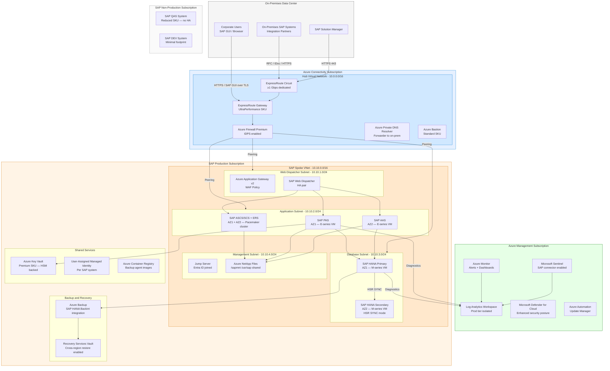
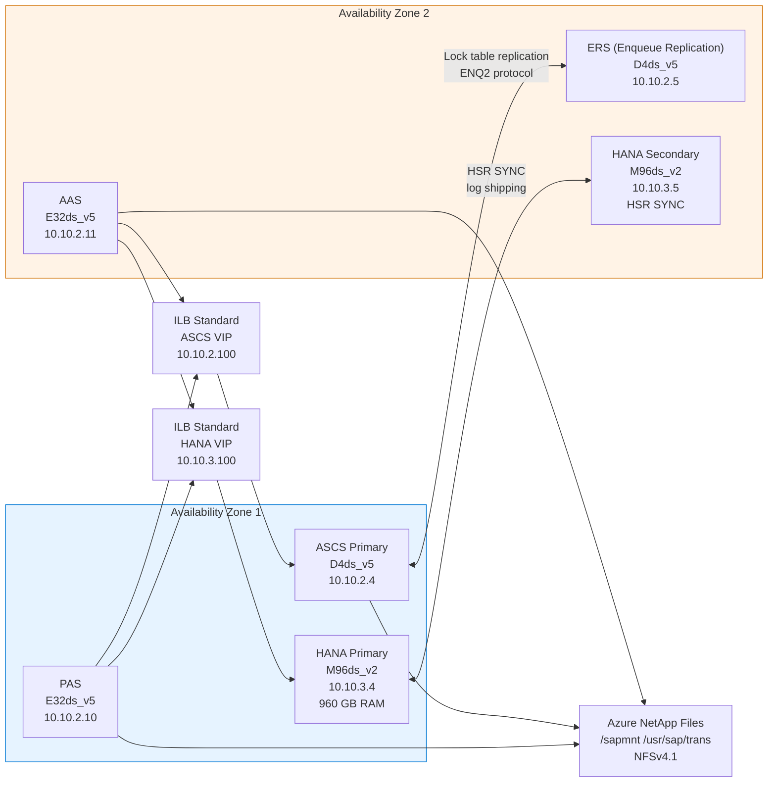

# SAP on Azure Architecture Principles

## Overview

This chapter defines the foundational architecture principles governing all SAP workloads deployed on Microsoft Azure within this enterprise. It establishes the non-negotiable design constraints, the mapping between SAP technical requirements and Azure service capabilities, and the governance framework that all subsequent architecture chapters inherit. Every design decision in later chapters — compute, storage, networking, security, and operations — traces back to the principles documented here, making this the authoritative reference for architecture reviews, change advisory board submissions, and new workload onboarding.

The scope covers SAP S/4HANA, SAP ECC 6.0, SAP BW/4HANA, SAP NetWeaver Application Server (ABAP and Java), and SAP HANA database deployments on Azure. It excludes SAP Business Technology Platform (BTP) services hosted in SAP's own data centers, though integration patterns between BTP and Azure-hosted SAP systems are addressed in the networking chapter. The principles apply equally to greenfield Azure deployments, lift-and-shift migrations from on-premises, and hybrid landscapes where SAP systems span both on-premises data centers and Azure regions.

Architecture decisions in this chapter are grounded in three authoritative frameworks: the SAP on Azure architecture guidance published by Microsoft at the Azure Architecture Center, the Azure Well-Architected Framework five-pillar model, and the SAP Infrastructure Certification requirements that constrain which Azure VM families, storage configurations, and network topologies are permitted for production SAP workloads. Where these frameworks conflict, SAP certification requirements take precedence, followed by Azure Well-Architected Framework guidance, followed by enterprise-specific standards.

---

## Architecture Overview

SAP on Azure architecture follows a layered model in which the SAP application stack is decomposed into discrete tiers — presentation, application, and database — each mapped to Azure infrastructure services that meet SAP's certification and sizing requirements. The presentation tier is served by SAP Fiori front-end servers or SAP Web Dispatcher instances placed in application subnets with controlled ingress from Azure Application Gateway. The application tier hosts SAP Central Services (ASCS/SCS), Enqueue Replication Server (ERS), and Primary Application Server (PAS) and Additional Application Server (AAS) instances on Azure Virtual Machines. The database tier runs SAP HANA, IBM Db2, Microsoft SQL Server, or Oracle on Azure VMs with Premium SSD or Ultra Disk storage meeting SAP IOPS and throughput certification thresholds.

All SAP workloads are deployed into an Azure Landing Zone that separates production and non-production environments into distinct Azure subscriptions under a dedicated SAP management group hierarchy. The Landing Zone provides pre-configured networking through a hub-spoke virtual network topology, centralized DNS resolution, shared Azure Firewall for egress inspection, and ExpressRoute connectivity back to on-premises SAP landscapes. Shared services — Microsoft Entra ID, Azure Key Vault, Azure Monitor, and Log Analytics — are consumed from the platform subscription rather than provisioned per SAP system, reducing operational overhead and ensuring consistent security posture across the SAP estate.

High availability is achieved through Azure Availability Zones for all production-tier workloads, using zone-redundant deployments for SAP ASCS/ERS and database layer with synchronous replication (HANA System Replication in SYNC mode with HANA Fast Restart, or Always On Availability Groups for SQL Server). Disaster recovery uses asynchronous replication to a paired Azure region — HANA System Replication in ASYNC mode, Azure Site Recovery for stateless application servers, and Azure Backup with cross-region restore for supporting infrastructure. The target RPO for Tier-1 SAP production systems is less than 15 minutes; the target RTO is less than 4 hours.

### Architecture Diagram



---

## SAP Architecture

### SAP Component Mapping

| SAP Component | Role in Architecture | Azure Placement | Certification Requirement | SAP Reference |
|---|---|---|---|---|
| SAP HANA 2.0 SPS07+ | Primary OLTP and OLAP database for S/4HANA and BW/4HANA | M-series VMs (M32ts through M832ixs) in DB subnet, AZ-aware | Azure VM must appear in SAP HANA Hardware Directory; TDI certification applies | SAP Note 2235581, SAP Note 1928533 |
| SAP NetWeaver ABAP 7.52+ | Application server runtime for SAP ECC and S/4HANA application layer | E-series or D-series VMs; PAS in AZ1, AAS in AZ2 | Must use SAP-certified VM families; Accelerated Networking mandatory | SAP Note 1928533, SAP Note 2015553 |
| SAP ASCS / SCS | Central Services instance hosting Enqueue Server 2 (ENQ2) and Message Server | Two VMs in separate AZs, clustered with Pacemaker on RHEL/SLES or WSFC on Windows | ENQ2 mandatory for AZ-spanning HA clusters (standalone enqueue replication) | SAP Note 2630416, SAP Note 0953653 |
| SAP ERS (Enqueue Replication Server) | Replicates enqueue lock table from ASCS to standby node | Co-located on second AZ VM in ASCS cluster, offset installation | Required for ENQ2 HA; ERS2 replaces ERS1 for S/4HANA | SAP Note 2630416 |
| SAP Web Dispatcher 7.77+ | HTTP/HTTPS load balancing and routing for Fiori and web services | Dedicated VMs or Azure Application Gateway WAF v2 integration | Must be SAP-certified version; Azure Load Balancer for HA | SAP Note 908144 |
| SAP Fiori Front-End Server | SAPUI5 application serving and OData gateway | Embedded in S/4HANA or standalone FES on application-tier VMs | Requires SAP-certified ABAP stack | SAP Note 2099847 |
| SAP Transport Management System | Controls landscape-wide ABAP transport routing | Configured on domain controller system (typically production) | TMS domain controller must have persistent hostname/IP | SAP Note 0013355 |
| SAP Host Agent 7.22+ | Provides OS-level monitoring and SAPControl interface to Azure monitoring | Installed on all SAP VMs; communicates with Azure Monitor SAP solutions | Mandatory for Microsoft Azure Monitor for SAP solutions | SAP Note 1031096 |

### SAP Sizing Principles

Sizing for SAP on Azure follows the SAP Quick Sizer methodology for new implementations and the SAP EarlyWatch Alert sizing recommendation for migrations from existing on-premises systems. SAPS (SAP Application Performance Standard) is the primary compute sizing metric for application-tier VMs. SAP HANA memory sizing is driven by the working set — the sum of all table data loaded into HANA column store memory plus row store plus internal HANA overhead, with a mandatory 50% free memory buffer for HANA operations.

For SAP S/4HANA migrations, the migration assessment tool produces a HANA memory estimate based on actual table sizes in the source system after running HANA migration checks (report /SDF/HDB_SIZING). This number must be rounded up to the next certified HANA VM SKU available in the target Azure region. M-series VM memory sizes are fixed — there is no fractional sizing — so the HANA VM selection is the first and most constrained infrastructure decision in the architecture.

Application server SAPS requirements are derived from the SAP Quick Sizer output or from the on-premises SAPS benchmark for the equivalent hardware. Azure E-series VMs (E4ds_v5 through E96ds_v5) provide the highest SAPS-per-core ratio for SAP NetWeaver workloads among general-purpose VM families. D-series VMs are acceptable for development and QA tiers where SAPS targets are 30-50% of production.

### SAP Integration Dependencies

SAP landscapes on Azure maintain integration dependencies with on-premises systems during and after migration. RFC connections between SAP systems require low-latency, high-bandwidth connectivity — ExpressRoute with a minimum 1 Gbps dedicated circuit is mandatory for production landscapes. RFC connection timeouts must be tuned (SAP profile parameter `rdisp/max_wprun_time`) to account for WAN latency between on-premises and Azure if hybrid RFC flows are retained.

SAP Transport Management System domain controller placement affects all transport routes. If the TMS domain controller remains on-premises during a phased migration, Azure-hosted SAP systems require persistent ExpressRoute connectivity to import transports. The preferred architecture moves the TMS domain controller to the first Azure-hosted production system to eliminate this dependency.

SAP Solution Manager integration requires HTTPS connectivity from Azure-hosted SAP managed systems to Solution Manager (on-premises or Azure-hosted). The SAP Host Agent on each VM reports availability and configuration data to Solution Manager via SAPControl web services on port 5XX13/5XX14 (XX = SAP instance number).

---

## Azure Architecture

### Azure Service Mapping

| SAP Layer | Azure Service | SKU / Configuration | Availability Model | Notes |
|---|---|---|---|---|
| SAP HANA Database | Azure Virtual Machine — M-series | M32ts (192 GB RAM) to M832ixs (11.4 TB RAM); Premium SSD P30–P80 or Ultra Disk | Zonal (AZ1 + AZ2 active/passive HSR) | Must appear in HANA Hardware Directory; Write Accelerator on log volumes |
| SAP App Server (PAS/AAS) | Azure Virtual Machine — E-series v5 | E4ds_v5 to E96ds_v5; OS disk Premium SSD P10, data disks per sizing | Zonal (spread across AZ1 and AZ2) | Accelerated Networking mandatory; Proximity Placement Group within zone optional |
| SAP ASCS/SCS Cluster | Azure Virtual Machine + Azure Load Balancer Standard | D4ds_v5 × 2; ILB Standard SKU with HA ports | Zonal (AZ1 + AZ2) | Floating IP (Direct Server Return) enabled on ILB; Pacemaker on RHEL/SLES |
| SAP Shared File System (/sapmnt) | Azure NetApp Files | Standard or Premium service level; minimum 4 TiB capacity pool | Regional (ANF is zone-redundant within region) | NFSv4.1 required for SAP; ANF volumes in delegated subnet |
| SAP Web Dispatcher / Fiori Gateway | Azure Application Gateway v2 | WAF_v2 SKU; zone-redundant deployment | Zone-redundant | SSL termination at AppGW; re-encryption to Web Dispatcher optional |
| Hub Network | Azure Virtual Network + ExpressRoute Gateway | /16 address space; UltraPerformance GW SKU for SAP | Regional | FastPath enabled for ExpressRoute to bypass gateway for data plane |
| DNS Resolution | Azure Private DNS Resolver | Inbound + outbound endpoints in hub VNet | Regional | Forwards corporate DNS queries; resolves privatelink.* zones |
| Secret Management | Azure Key Vault | Premium SKU (HSM-backed keys) | Zone-redundant | Soft delete + purge protection enabled; HANA DB credentials, certificates |
| Monitoring | Azure Monitor + Log Analytics Workspace | Dedicated workspace per environment tier (Prod/QAS/Dev) | Regional | SAP workload-specific tables: SapHana_*, SapNetweaver_* |
| Backup | Azure Recovery Services Vault + Azure Backup | GRS with cross-region restore; HANA Backint agent | Regional + cross-region | Backint plugin version must match HANA SPS level |
| Patch Management | Azure Update Manager | Maintenance schedules per SAP tier | Regional | Integrates with SAP patching sequence runbooks |
| Security Posture | Microsoft Defender for Cloud | Defender for Servers P2; Defender for Storage | Regional | JIT VM access mandatory for all SAP VMs |

### Azure Landing Zone Integration

SAP workloads are deployed into the **SAP** child management group under the **Landing Zones** management group in the standard Azure Landing Zone hierarchy. This placement inherits platform-level policies from the root and Landing Zones management groups while allowing SAP-specific policy overrides at the SAP management group scope. Two subscriptions are provisioned under the SAP management group: **SAP-Production** and **SAP-NonProduction**. A third subscription, **SAP-Connectivity**, is used when SAP requires a dedicated ExpressRoute circuit separate from the enterprise-wide connectivity subscription, which is required when SAP bandwidth SLAs cannot be shared with general enterprise workloads.

The SAP production subscription uses the **corp** archetype from the Azure Landing Zone accelerator, which provides pre-configured policy assignments for resource locking, diagnostic settings, and audit log forwarding to the central Log Analytics workspace. Custom policy assignments specific to SAP are applied at the SAP management group scope and cover: enforcement of Accelerated Networking on all VMs, enforcement of Premium SSD (no Standard HDD) on SAP database VMs, and enforcement of Azure Backup enrollment for all production VMs.

### Hub-Spoke Network Integration

The SAP Spoke VNet is peered to the Hub VNet in the connectivity subscription using standard VNet peering (not gateway transit for data paths, but gateway transit is enabled for ExpressRoute route propagation). User-Defined Routes (UDRs) on all SAP subnets force all inter-subnet and internet-bound traffic through the Azure Firewall in the hub. The Azure Firewall application rules permit SAP-specific outbound connections: SAP software download servers (softwaredownloads.sap.com), SAP Support Portal (support.sap.com), and Azure service endpoints for Azure Backup, Azure Monitor, and Azure Key Vault via Private Link.

Private Endpoints are deployed for Azure Key Vault, Azure Storage (used by Azure Backup staging), Azure Container Registry, and Azure Monitor data collection endpoints. All Private Endpoints are placed in a dedicated `privateendpoint-subnet` within the SAP Spoke VNet. DNS A records for Private Endpoints are registered in Azure Private DNS zones hosted in the hub subscription, ensuring all SAP VMs resolve service FQDNs to private IP addresses without traversing the public internet.

### Azure Architecture Diagram — Availability Zone Detail



---

## Design Decisions

| Decision | Options Considered | Choice | Rationale | SAP / Azure Reference |
|---|---|---|---|---|
| Availability Zone vs. Availability Set for SAP HA | Option A: Availability Zones (AZ-spanning cluster); Option B: Availability Sets (single-zone cluster); Option C: No HA (single VM) | **Availability Zones** for all production Tier-1 and Tier-2 systems | AZs provide physical isolation across separate power, cooling, and networking — protecting against data center-level failure. SAP ENQ2 (Enqueue Server 2) enables AZ-spanning ASCS clusters without data loss. AZs also qualify for 99.99% VM SLA versus 99.95% for Availability Sets. Note: AZ latency between zones must be verified to be ≤1 ms RTT for HANA HSR SYNC mode. | SAP Note 2630416; [Azure AZ guidance](https://learn.microsoft.com/azure/sap/workloads/high-availability-zones) |
| SAP HANA Scale-Up vs. Scale-Out | Option A: Scale-up (single large M-series VM); Option B: Scale-out (multiple nodes with shared storage); Option C: HANA on Azure Large Instances | **Scale-up on M-series Azure VMs** for systems up to 11.4 TB HANA memory | Azure M-series VMs now cover the vast majority of S/4HANA and BW/4HANA sizing requirements without requiring HANA Large Instances (HLI). Scale-up is operationally simpler and benefits from standard Azure VM tooling (Azure Backup, Azure Monitor, Defender for Cloud). HLI is only justified for SAP HANA databases exceeding 12 TB RAM, which represents fewer than 2% of enterprise deployments. | SAP Note 2235581; [HANA Azure VMs](https://learn.microsoft.com/azure/sap/workloads/hana-vm-operations) |
| Shared File System for /sapmnt | Option A: Azure NetApp Files (ANF) NFSv4.1; Option B: Azure Files NFS; Option C: NFS on a dedicated Linux VM | **Azure NetApp Files** Premium or Ultra service level | ANF delivers the sub-millisecond latency required for SAP shared directory access at scale. Azure Files NFS does not guarantee the latency profile required for large-scale SAP deployments. A dedicated NFS VM introduces a single point of failure that requires its own HA cluster, increasing operational complexity without performance advantage over ANF. ANF is the Microsoft-recommended solution for SAP shared file systems. | SAP Note 2600631; [ANF for SAP](https://learn.microsoft.com/azure/sap/workloads/hana-vm-operations-storage) |
| ExpressRoute Circuit Redundancy Model | Option A: Single ExpressRoute circuit, dual paths to two Microsoft Enterprise Edge (MSEE) routers; Option B: Dual ExpressRoute circuits from two different providers to two different peering locations; Option C: ExpressRoute + VPN failover | **Dual ExpressRoute circuits from two providers** for production SAP | Single circuit with dual paths (Option A) still has a single provider SLA dependency. For SAP production workloads requiring 99.95%+ connectivity SLA, dual circuits from separate providers to different peering locations eliminates provider-level and peering-location single points of failure. VPN fallback (Option C) is retained as emergency break-glass connectivity but not as primary failover due to bandwidth limitations. | [ExpressRoute design](https://learn.microsoft.com/azure/expressroute/designing-for-high-availability-with-expressroute) |
| SAP Transport System Host Placement | Option A: TMS domain controller on-premises (existing); Option B: TMS domain controller migrated to Azure SAP production system; Option C: TMS managed via SAP Cloud ALM | **Migrate TMS domain controller to Azure SAP production** | Retaining TMS on-premises creates a permanent ExpressRoute dependency for all transport imports to Azure-hosted systems. During ExpressRoute maintenance or outages, transport imports to SAP Azure systems are blocked, impeding emergency change deployment. Moving TMS domain controller to Azure eliminates this dependency. SAP Cloud ALM (Option C) replaces Solution Manager for cloud-native deployments but requires SAP BTP subscription and is not yet viable for all customers. | SAP Note 0013355 |
| Azure Load Balancer vs. Azure Application Gateway for SAP ASCS | Option A: Azure Internal Load Balancer (ILB) Standard with HA ports; Option B: Azure Application Gateway; Option C: Third-party NVA load balancer | **Azure ILB Standard with HA ports and Floating IP** | SAP ASCS uses proprietary SAP protocols (SAPMS, ENQ2) that are not HTTP-based and cannot be load-balanced by Application Gateway. ILB Standard with HA ports and Floating IP (Direct Server Return) is the SAP-certified and Microsoft-documented approach for SAP ASCS/SCS HA. Floating IP is required so the cluster VIP IP address is not consumed by the ILB frontend, enabling direct SAP connection semantics. | SAP Note 2630416; [SAP ASCS ILB](https://learn.microsoft.com/azure/sap/workloads/high-availability-guide-rhel) |
| OS Platform for SAP Production Workloads | Option A: Red Hat Enterprise Linux (RHEL) for SAP Solutions; Option B: SUSE Linux Enterprise Server for SAP Applications (SLES for SAP); Option C: Windows Server | **RHEL for SAP Solutions** as primary OS; **SLES for SAP** as secondary supported OS | Both RHEL and SLES for SAP are certified for SAP HANA and SAP NetWeaver on Azure. Windows Server is certified for SAP NetWeaver but not for SAP HANA production workloads at scale. Enterprise OS selection aligns with existing Linux operations capability. RHEL for SAP Solutions includes the High Availability Add-On (Pacemaker) required for ASCS and HANA clustering without additional licensing. | SAP Note 2235581, SAP Note 1928533 |
| Backup Solution for SAP HANA | Option A: Azure Backup with Backint agent (snapshot + streaming); Option B: HANA native backup to Azure Blob Storage via Backint; Option C: Azure NetApp Files snapshots + ANF Cross-Region Replication | **Azure Backup with HANA Backint integration** as primary; **ANF snapshots** as secondary for rapid restore | Azure Backup with Backint provides application-consistent HANA backups with centralized management via Recovery Services Vault, integrated with Azure RBAC and cross-region restore. ANF snapshots complement this by enabling near-instantaneous volume-level restores for operational recovery scenarios (accidental deletion, data corruption). Native HANA backup to Blob without Azure Backup loses centralized monitoring and policy enforcement. | SAP Note 2039883; [Azure Backup for HANA](https://learn.microsoft.com/azure/backup/sap-hana-db-about) |

---

## SAP Notes Reference

!!! warning "SAP Notes Access"
    SAP Notes require an active SAP Support Portal account (S-user ID). Verify note applicability against your specific SAP product version, Support Package stack, and database version before implementing any guidance. Notes are updated by SAP; always retrieve the current version from the SAP Support Portal rather than relying on cached copies.

| SAP Note ID | Title / Purpose | Architecture Impact | Where Applied | Last Verified |
|---|---|---|---|---|
| 1928533 | SAP Applications on Microsoft Azure: Supported Products and Azure VM Types | Defines the authoritative list of SAP products and Azure VM families certified for production use. Any VM family not listed is not supported by SAP for production. | VM SKU selection for all SAP tiers; blocks use of Lsv2, NV, or GPU VM families for SAP | 2025-06 |
| 2235581 | SAP HANA: Supported Operating Systems | Lists OS versions certified for SAP HANA on Azure. RHEL 8.4+, RHEL 9.0+, SLES 15 SP3+ are current. | OS selection for HANA DB VMs; subscription-included RHEL for SAP vs. BYOS | 2025-06 |
| 2630416 | Support for High Availability of SAP ASCS/SCS with Enqueue Server 2 | Defines ENQ2 requirements for AZ-spanning ASCS/ERS HA clusters. ENQ2 replaces ENQ1 and must be active for lock table survival during ASCS failover. | ASCS/ERS cluster design; Pacemaker configuration; ILB floating IP | 2025-06 |
| 2015553 | SAP on Microsoft Azure: Support Prerequisites | Lists Azure subscription, VM, and network prerequisites that must be met before SAP Support cases will be accepted for Azure-hosted systems. | Pre-deployment checklist; Azure subscription setup; Accelerated Networking | 2025-06 |
| 2384350 | Azure Premium Storage: Backup Agent for SAP HANA | Defines Backint interface requirements for Azure Backup integration with SAP HANA. Agent version must match HANA SPS. | HANA backup configuration; Recovery Services Vault; Backint agent installation | 2025-06 |
| 2039883 | FAQ: SAP HANA Database and Data Backup, Data Restore | Comprehensive HANA backup FAQ covering backup types (complete, differential, incremental, log), retention requirements, and catalog management. | HANA backup schedule design; log backup frequency; backup catalog in Azure Blob | 2025-06 |
| 2600631 | SAP HANA on Azure NetApp Files | Specific ANF configuration requirements for HANA: volume sizes, throughput, NFS mount options, and service level recommendations per HANA database size. | ANF volume provisioning; NFS mount options in /etc/fstab; service level selection | 2025-06 |
| 0953653 | HA and DR for SAP NetWeaver on Microsoft Azure: Architecture Concepts | Architecture-level guidance for SAP NetWeaver HA and DR on Azure, covering ASCS, database, and application server availability patterns. | HA cluster design; DR replication strategy; failover procedures | 2025-06 |
| 2593824 | Linux: Running SAP applications compiled with GCC 7.x | Affects ABAP runtime compatibility for RHEL 8 and SLES 15 — confirms GCC 7.x compiled kernels are supported. | OS package selection; SAP kernel selection for RHEL 8 and SLES 15 | 2025-06 |
| 0500235 | SAP on Microsoft Azure Deployment Guide | The primary SAP-authored deployment guide for Azure, covering VM selection, storage configuration, and network topology requirements from SAP's perspective. | Azure VM configuration; storage stripe size; network configuration | 2025-06 |
| 2382421 | Optimizing the Network Configuration on HANA- and OS-Level | Defines OS-level network tuning required for SAP HANA on Azure: TCP keepalive intervals, jumbo frames, IRQ affinity settings for HANA performance. | HANA VM OS configuration; network tuning runbook | 2025-06 |
| 1999930 | FAQ: SAP HANA IO Analysis and I/O Performance | Defines HANA I/O performance requirements and diagnostic approach. Minimum 400 MB/s sequential read/write throughput for HANA data volumes; minimum 250 MB/s for log volumes. | Storage tier selection; Ultra Disk vs. Premium SSD configuration; I/O benchmarking | 2025-06 |
| 2731110 | SAP HANA 2.0 SPS 04: What's New | Introduces HANA features relevant to Azure: HANA Fast Restart (in-memory persistence through VM restart), multi-tier HSR, and column store delta merge improvements. | HANA Fast Restart enablement; HSR topology selection | 2025-06 |
| 0001275 | Linux: SAP Host Agent for Microsoft Windows and Linux | Host Agent installation and configuration requirements. Version 7.22 patch 10 or above required for Azure Monitor for SAP solutions integration. | SAP Host Agent deployment automation; monitoring integration | 2025-06 |

---

## Azure Well-Architected Alignment

| Pillar | Requirement | Implementation | Azure Service / Feature | Reference |
|---|---|---|---|---|
| **Reliability** | SAP ASCS/SCS must survive a single AZ failure without data loss | ENQ2-based Pacemaker cluster spanning AZ1 and AZ2; ILB Standard with Floating IP directs traffic to surviving node; Azure Fence Agent for STONITH | Azure ILB Standard, Pacemaker RA azure-lb, Azure Fence Agent | SAP Note 2630416; [HA guide RHEL](https://learn.microsoft.com/azure/sap/workloads/high-availability-guide-rhel) |
| **Reliability** | SAP HANA database must survive a single AZ failure with RPO = 0 (zero data loss) | HANA System Replication in SYNC mode with HANA Fast Restart; HSR preload_column_tables=true minimizes failover RTO; Pacemaker SAPHanaSR resource agent manages automatic takeover | M-series Azure VMs, HANA System Replication, Pacemaker SAPHanaSR | SAP Note 2039883; [HANA HA Azure](https://learn.microsoft.com/azure/sap/workloads/sap-hana-high-availability) |
| **Reliability** | SAP application servers must recover from VM failure within RTO target | Azure VM auto-restart is enabled; AAS instances in AZ2 continue processing during AZ1 failure; SAP logon groups distribute users across PAS and AAS instances | Azure VM availability (platform SLA), SAP logon groups | SAP Note 0953653 |
| **Security** | All SAP VM management access must be authenticated, authorized, and audited | Azure Bastion Standard SKU for browser-based SSH/RDP; JIT VM Access via Microsoft Defender for Cloud blocks persistent management port exposure; all Bastion sessions logged to Log Analytics | Azure Bastion, Microsoft Defender for Cloud JIT, Log Analytics | [Azure Bastion](https://learn.microsoft.com/azure/bastion/bastion-overview) |
| **Security** | SAP secrets (HANA system user credentials, SNC certificates, RFC passwords) must not be stored in config files or environment variables | All SAP secrets provisioned to Azure Key Vault; SAP VMs use User-Assigned Managed Identity to retrieve secrets at runtime via Key Vault SDK; secret rotation automated via Key Vault rotation policy | Azure Key Vault Premium, User-Assigned Managed Identity, Key Vault rotation | [Key Vault for SAP](https://learn.microsoft.com/azure/key-vault/general/overview) |
| **Security** | Network traffic to SAP systems must be inspected and filtered | Azure Firewall Premium with IDPS signatures deployed in hub VNet; all SAP subnet traffic routed through Firewall via UDR; Application Gateway WAF v2 for Fiori HTTPS traffic | Azure Firewall Premium, Azure Application Gateway WAF v2, UDR | [Azure Firewall SAP](https://learn.microsoft.com/azure/architecture/example-scenario/sap/sap-s4hana-on-hana) |
| **Cost Optimization** | SAP compute costs must be reduced through Azure commitment-based discounts | 3-year Reserved Instances for all production M-series and E-series VMs (60-72% discount vs. pay-as-you-go); 1-year Reserved Instances for non-production; Azure Hybrid Benefit for Windows and RHEL where applicable | Azure Reservations, Azure Hybrid Benefit | [SAP cost optimization](https://learn.microsoft.com/azure/cost-management-billing/reservations/save-compute-costs-reservations) |
| **Cost Optimization** | Non-production SAP environments must not run full-time at production scale | Auto-shutdown schedule for DEV and sandbox systems via Azure Automation runbooks (off: 19:00, on: 07:00 weekdays); QAS systems scaled down to minimum VM SKU during non-peak hours | Azure Automation, Azure VM start/stop, Azure Cost Management | [SAP cost governance](https://learn.microsoft.com/azure/cost-management-billing/costs/cost-mgt-best-practices) |
| **Operational Excellence** | All SAP infrastructure must be deployed via infrastructure-as-code with no manual portal changes | Terraform modules for all SAP infrastructure components; Bicep for Azure Landing Zone policy assignments; GitHub Actions CI/CD pipeline with required reviewers gate for production deployments | Azure DevOps / GitHub Actions, Terraform, Bicep | [IaC SAP](https://learn.microsoft.com/azure/sap/automation/deployment-framework) |
| **Operational Excellence** | SAP system health must be continuously monitored with automated alerting | Azure Monitor for SAP solutions (AMS) deployed per SAP SID; provider configuration for HANA, NetWeaver, OS, and HA cluster; alert rules with PagerDuty/ServiceNow integration via action groups | Azure Monitor for SAP solutions, Log Analytics, Action Groups | [AMS overview](https://learn.microsoft.com/azure/sap/monitor/about-azure-monitor-sap-solutions) |
| **Performance Efficiency** | SAP HANA I/O must meet minimum certified throughput thresholds | Premium SSD v2 or Ultra Disk for HANA data and log volumes; Write Accelerator enabled on HANA log volumes (M-series mandatory); volume stripe size = 256 KB for data, 64 KB for log | Azure Premium SSD v2, Azure Ultra Disk, Azure Write Accelerator | SAP Note 1999930; [HANA storage](https://learn.microsoft.com/azure/sap/workloads/hana-vm-operations-storage) |
| **Performance Efficiency** | SAP NetWeaver application servers must achieve certified SAPS throughput | Accelerated Networking enabled on all SAP VMs (mandatory per SAP Note 2015553); E-series v5 VMs for maximum SAPS-per-core; Proximity Placement Groups within each AZ to minimize intra-zone latency | Accelerated Networking, E-series v5, Proximity Placement Groups | SAP Note 2015553; [VM performance](https://learn.microsoft.com/azure/virtual-machines/premium-storage-performance) |

---

## Security Architecture

### Identity and Access Management

All SAP on Azure workloads use Microsoft Entra ID as the authoritative identity provider. SAP Fiori and SAP Web GUI access is federated to Entra ID via SAML 2.0 for SSO, eliminating separate SAP user passwords for browser-based access. SAP Secure Network Communications (SNC) is configured with Kerberos-based authentication for SAP GUI desktop clients using the Microsoft Kerberos SSP library (gsskrb5.dll), enabling ticket-based authentication without SAP password prompts.

Service-to-service authentication (backup agents, monitoring agents, Key Vault access) uses User-Assigned Managed Identities assigned to each SAP VM at the resource group level. Managed identities eliminate all stored credentials from SAP VM operating system configuration files. Azure RBAC assignments follow least-privilege: the HANA backup managed identity has `Storage Blob Data Contributor` only on the backup storage account; the monitoring managed identity has `Monitoring Metrics Publisher` only on the Log Analytics workspace.

Privileged access to SAP VMs is managed through Azure Privileged Identity Management (PIM) for time-bound role activation. The `Virtual Machine Contributor` role on SAP production VMs requires PIM activation with a business justification and manager approval, with a maximum 4-hour activation window. Emergency break-glass accounts are stored in Azure Key Vault with access restricted to the SAP Security team and audited via Key Vault diagnostic logs.

!!! danger "Privileged Access Warning"
    Direct SSH access to SAP HANA primary VMs using root or the `<sid>adm` OS user from non-bastion paths is prohibited in production. All SAP VM OS access must route through Azure Bastion. The `hdbsql` command-line tool for HANA system user access must not be used with inline passwords (`-p` flag); use HANA wallet (secure user store) entries exclusively. SAP HANA system user (`SYSTEM`) password must be rotated immediately after initial system setup and managed in Azure Key Vault.

### Network Security

Network security for SAP workloads is implemented in defense-in-depth layers: Azure Firewall in the hub VNet as the perimeter control, NSGs on each subnet as the micro-segmentation control, and Private Endpoints eliminating public internet exposure for PaaS services.

#### Required NSG Rules — SAP Application Subnet

| Direction | Source | Destination | Port / Protocol | Purpose | SAP Reference |
|---|---|---|---|---|---|
| Inbound | SAP Web Dispatcher subnet (10.10.1.0/24) | App subnet (10.10.2.0/24) | TCP 80xx, 443x (xx = instance number) | HTTP/HTTPS from Web Dispatcher to ICM | SAP Note 908144 |
| Inbound | App subnet (10.10.2.0/24) | App subnet (10.10.2.0/24) | TCP 32xx, 36xx, 39xx, 81xx | SAP internal inter-process communication (RFC, enqueue, message server) | SAP Note 1928533 |
| Inbound | Azure Bastion subnet (10.0.10.0/27) | App subnet (10.10.2.0/24) | TCP 22 (SSH), TCP 3389 (RDP) | Bastion SSH/RDP management access | Azure Bastion docs |
| Inbound | AzureLoadBalancer | App subnet (10.10.2.0/24) | TCP 62500 (ILB health probe) | Azure ILB health probe for ASCS/ERS cluster | [ILB for SAP HA](https://learn.microsoft.com/azure/sap/workloads/high-availability-guide-rhel) |
| Outbound | App subnet (10.10.2.0/24) | DB subnet (10.10.3.0/24) | TCP 3xx13, 3xx15, 3xx41 (xx = HANA instance) | HANA SQL/MDX from app servers to HANA | SAP HANA admin guide |
| Outbound | App subnet (10.10.2.0/24) | Internet via Azure Firewall | TCP 443 | Azure service endpoints (Key Vault, Monitor, Backup) via Private Link | Azure Private Link |
| Deny | Any | App subnet (10.10.2.0/24) | Any | Default deny all other inbound | NSG default rule |

#### Required NSG Rules — SAP Database Subnet

| Direction | Source | Destination | Port / Protocol | Purpose | SAP Reference |
|---|---|---|---|---|---|
| Inbound | App subnet (10.10.2.0/24) | DB subnet (10.10.3.0/24) | TCP 3xx13, 3xx15, 3xx41 | HANA SQL from SAP application servers | HANA admin guide |
| Inbound | DB subnet (10.10.3.0/24) | DB subnet (10.10.3.0/24) | TCP 40001–40010, 50001–50010 | HANA System Replication traffic (inter-node) | SAP Note 2731110 |
| Inbound | Azure Bastion subnet | DB subnet (10.10.3.0/24) | TCP 22 | Bastion SSH for HANA DBA access | Azure Bastion |
| Inbound | AzureLoadBalancer | DB subnet (10.10.3.0/24) | TCP 62503 | ILB health probe for HANA cluster VIP | [HANA HA ILB](https://learn.microsoft.com/azure/sap/workloads/sap-hana-high-availability) |
| Outbound | DB subnet (10.10.3.0/24) | Azure Backup endpoints | TCP 443 | HANA Backint backup via Private Endpoint | Azure Backup |
| Deny | Any | DB subnet (10.10.3.0/24) | Any | Default deny all other inbound | NSG default |

### Data Protection

All SAP data at rest is encrypted using Azure Storage Service Encryption (SSE) with Customer-Managed Keys (CMK) stored in Azure Key Vault Premium (HSM-backed). Key rotation is automated via Key Vault rotation policy on a 12-month schedule with a 30-day overlap window. Azure Disk Encryption (ADE) using the DM-Crypt/BitLocker integration is evaluated per compliance requirement; for SAP HANA VMs, SSE with CMK is preferred over ADE because ADE introduces I/O path overhead that can degrade HANA performance below certification thresholds.

SAP HANA native data volume encryption (HANA Data Volume Encryption, DVE) using HANA's internal key store is enabled for HANA systems subject to data residency regulations. When DVE is active, keys are managed in HANA's own key management, not in Azure Key Vault; for consistency, SAP HANA External Key Management (EKM) using the Azure Key Vault HANA EKM extension is preferred to centralize key management.

TLS 1.2 is the minimum enforced TLS version for all SAP-to-Azure service communications. SAP Kernel patch level must support OpenSSL 1.1.1 or above for TLS 1.2/1.3 compatibility. SAP SNC encryption with AES-256 is required for all SAP GUI and RFC connections carrying sensitive data.

### Microsoft Entra ID Integration

SAP Fiori single sign-on is configured using the **SAP Principal Propagation** pattern: users authenticate to Entra ID via SAML 2.0, Entra ID issues a SAML assertion to SAP NetWeaver (SP), SAP NetWeaver maps the Entra user principal to a SAP user account via the system user alias table (SU01). This configuration requires the enterprise application **SAP Fiori** registered in Entra ID with the SAP system's reply URL and signing certificate.

Conditional Access policies applied to the SAP Fiori enterprise application require: MFA for all users accessing Fiori from outside corporate network IP ranges; compliant device for access from unmanaged devices; and block access from countries not in the approved list. Sign-in risk policy (Entra ID Identity Protection) blocks high-risk sign-ins automatically.

### Security Monitoring

Microsoft Defender for Cloud is configured with Defender for Servers Plan 2 on all SAP VMs, providing vulnerability assessment (Qualys built-in), File Integrity Monitoring, and adaptive application control. Defender for Storage is enabled on all storage accounts used by SAP (backup staging, ANF, diagnostic storage) to detect anomalous access patterns.

The Microsoft Sentinel SAP solution is deployed with the SAP audit log connector, which streams the SAP Security Audit Log (SM20), the SAP Change Document Log, and the SAP User and Authorization Change Log to Microsoft Sentinel via the SAP data connector (Docker-based agent running on a dedicated Linux VM in the management subnet). SAP Sentinel analytics rules detect: mass download of sensitive data, privilege escalation via debug mode, SAP_ALL profile assignment, and unauthorized RFC function module calls.

---

## Reliability and High Availability

### High Availability Architecture

The SAP on Azure HA architecture targets 99.99% availability for Tier-1 production SAP systems through multi-layer redundancy: zone-redundant compute, zone-redundant storage replication, and automated cluster failover with no manual intervention required for AZ-level failures.

**ASCS/ERS Cluster Failover Sequence:**
1. AZ1 fails (or ASCS VM fails); Azure Fence Agent marks the AZ1 node as fenced (STONITH via Azure API)
2. Pacemaker promotes ERS (running on AZ2) — lock table already replicated via ENQ2 to ERS
3. Azure ILB health probe detects ASCS resource failure; stops routing to AZ1 VIP
4. ASCS resource starts on AZ2 node; ILB health probe succeeds on AZ2
5. SAP message server and enqueue server operational on AZ2 within 60–120 seconds
6. No enqueue lock loss because ENQ2 replicates lock table synchronously to ERS

**HANA HSR Failover Sequence:**
1. HANA primary VM fails or AZ1 fails; Pacemaker SAPHanaSR resource agent detects failure
2. Azure Fence Agent fences the failed node (prevents split-brain)
3. Pacemaker promotes HANA secondary (AZ2) to primary — no redo log replay required (HSR SYNC)
4. Azure ILB HANA VIP redirects to AZ2 HANA primary
5. SAP application servers reconnect to HANA via ILB VIP automatically (SAP reconnect logic)
6. Total failover time: 2–5 minutes (HANA Fast Restart accelerates this to sub-2 minutes if enabled)

### RPO and RTO Targets

| System Tier | Scenario | RPO Target | RTO Target | HA Mechanism | DR Mechanism |
|---|---|---|---|---|---|
| Tier-1 SAP Production (S/4HANA, ECC PRD) | Single AZ failure (VM or zone) | 0 (zero data loss) | ≤ 4 hours (target ≤ 30 min) | HANA HSR SYNC + Pacemaker; ASCS ENQ2 cluster | HANA HSR ASYNC to DR region; Azure Site Recovery for app servers |
| Tier-1 SAP Production | Full Azure region failure | ≤ 15 minutes | ≤ 4 hours | N/A (region-level event) | HANA HSR ASYNC (RPO = replication lag); manual failover to DR region |
| Tier-2 SAP Production (BW/4HANA, GRC, PI) | Single AZ failure | 0 | ≤ 2 hours | HANA HSR SYNC + Pacemaker | HANA HSR ASYNC; Azure Backup cross-region restore |
| Tier-2 SAP Production | Full Azure region failure | ≤ 30 minutes | ≤ 8 hours | N/A | HANA HSR ASYNC; ASR for app servers |
| Tier-3 Non-Production (QAS, SBX) | VM failure | ≤ 1 hour | ≤ 4 hours | Azure VM restart (platform SLA only) | Azure Backup restore from latest backup |
| Tier-3 Non-Production | AZ failure | ≤ 24 hours | ≤ 8 hours | No HA cluster | Azure Backup cross-zone restore |
| Tier-4 Development (DEV, TST) | VM failure | ≤ 24 hours | ≤ 24 hours | No HA | Azure Backup daily restore point |

### Backup and Recovery

| Component | Backup Solution | Frequency | Retention | Cross-Region | RTO | Test Frequency |
|---|---|---|---|---|---|---|
| SAP HANA data volumes | Azure Backup + Backint agent | Full: weekly; Differential: daily; Log: every 15 min | Full: 35 days; Differential: 14 days; Log: 35 days | Yes (GRS vault with cross-region restore) | ≤ 4 hours for daily; ≤ 8 hours for full | Quarterly |
| SAP ASCS/ERS VMs | Azure Backup VM snapshot | Daily | 35 days (prod); 14 days (non-prod) | Yes | ≤ 2 hours | Quarterly |
| SAP App Server VMs | Azure Backup VM snapshot | Daily | 35 days (prod); 14 days (non-prod) | Yes | ≤ 2 hours | Quarterly |
| ANF volumes (/sapmnt) | ANF snapshot policy | Hourly (keep 6); Daily (keep 30) | 30 days daily | Via ANF CRR (Cross-Region Replication) | ≤ 30 minutes (snapshot revert) | Monthly |
| Azure Key Vault | Soft delete (90 days) + purge protection | Continuous (versioned) | 90 days + permanent for purge-protected | Geo-redundant by default | N/A (secrets survive vault deletion) | N/A |
| Log Analytics workspace | Workspace data retention | Continuous ingestion | 90 days hot; 2 years archive | Log Analytics cross-workspace query | N/A | N/A |

---

## Cost Optimization

### Cost Architecture

SAP on Azure total cost of ownership is dominated by four categories: compute (M-series VMs for HANA), storage (Premium SSD, Ultra Disk, ANF), networking (ExpressRoute circuits, data transfer), and Azure platform services (Azure Backup, Azure Monitor, Defender for Cloud). Compute accounts for 55–65% of monthly Azure spend for a typical S/4HANA production landscape.

### Cost Component Analysis

| Cost Component | Estimated Monthly Range (USD) | Optimization Lever | Savings Potential | Notes |
|---|---|---|---|---|
| HANA M-series VMs (production — M96ds_v2 × 2) | $35,000–$45,000 (pay-as-you-go) | 3-year Reserved Instances | 60–67% reduction (~$22,000–$30,000/month savings) | Largest single cost driver; reservation required |
| SAP App Server VMs (E32ds_v5 × 4) | $5,000–$8,000 (pay-as-you-go) | 3-year Reserved Instances + Azure Hybrid Benefit | 65–72% reduction | AHB requires RHEL or Windows Server SA licensing |
| Azure NetApp Files (/sapmnt, 4 TiB Premium) | $800–$1,200/month | Right-size capacity pool; use auto QoS | 20–30% reduction by avoiding over-provisioning | ANF billed on provisioned capacity, not used |
| Azure Premium SSD v2 (HANA data + log volumes) | $1,500–$3,000/month | Right-size disk tier after baseline; switch from P80 to P60 if IOPS allow | 15–25% reduction | Review after 90-day IOPS baseline |
| ExpressRoute circuits (2 × 1 Gbps) | $3,500–$5,500/month | Consolidate circuits where bandwidth SLA allows; use Metered vs. Unlimited based on data transfer volume | 10–20% | Unlimited billing is more predictable for high-transfer landscapes |
| Azure Backup (HANA GRS + VM) | $800–$1,500/month | Reduce retention for non-prod; use LRS for non-prod vaults | 30–40% for non-prod | Prod retention cannot be reduced below compliance minimum |
| Microsoft Defender for Cloud (Servers P2) | $600–$900/month | Apply Servers P1 for DEV/SBX; P2 only for production | 40% for non-prod | P2 required for prod (JIT, FIM, vulnerability assessment) |
| Azure Monitor for SAP solutions | $200–$600/month | Log ingestion filtering — exclude DEBUG-level logs from production workspace | 15–25% reduction | Review high-volume log sources monthly |
| Non-production VMs (QAS/DEV auto-shutdown) | $2,000–$4,000/month baseline | Auto-shutdown 19:00–07:00 + weekends | 50–65% reduction for DEV/SBX | QAS requires longer windows for transport testing |

### Azure Reservations Strategy

3-year Reserved Instances are purchased for all M-series and E-series VMs in production. Reservations are purchased at the subscription scope (not resource group scope) to allow RI benefit transfer if VM SKUs change during the reservation period. The reservation purchase cycle is aligned with the Azure cost review cadence (annually in Q1) so that new reservations reflect the current production footprint.

Azure Hybrid Benefit (AHB) is applied for Windows Server VMs in the SAP landscape where enterprise licensing includes Software Assurance. For RHEL, Red Hat Cloud Access (BYOS) is used where the enterprise has existing RHEL subscriptions, converting VMs from Pay-As-You-Go RHEL marketplace images to BYOS to eliminate the RHEL premium.

### Cost Governance

Azure Cost Management budgets are configured at three scopes: SAP production subscription (monthly alert at 90% and 100% of budget), SAP non-production subscription (monthly alert at 80%), and SAP management group (quarterly aggregate). Budget alerts trigger PagerDuty notifications to the FinOps team and the SAP infrastructure lead.

#### Mandatory Resource Tagging

| Tag Key | Required | Example Values | Purpose |
|---|---|---|---|
| `sap-sid` | Required | `PRD`, `QAS`, `DEV`, `BWP` | Identifies SAP System ID for per-SID cost reporting |
| `sap-component` | Required | `hana-db`, `app-server`, `ascs-ers`, `web-dispatcher` | Identifies SAP component layer for cost allocation |
| `environment` | Required | `production`, `quality`, `development`, `sandbox` | Environment classification for policy and budget |
| `cost-center` | Required | `CC-10234`, `CC-20891` | Finance cost allocation to business unit |
| `managed-by` | Required | `terraform`, `bicep`, `manual` | Tracks IaC compliance; manual resources require review |
| `backup-policy` | Required | `daily-35d`, `daily-14d`, `none` | Drives Azure Policy backup enforcement |
| `patch-group` | Required | `sap-prod-sat`, `sap-nonprod-sun` | Drives Azure Update Manager maintenance schedule |
| `data-classification` | Required | `confidential`, `internal`, `public` | Data classification for security policy enforcement |

---

## Operations and Monitoring

### Monitoring Architecture

The monitoring architecture for SAP on Azure uses Azure Monitor as the central telemetry platform, with a dedicated Azure Log Analytics workspace per SAP environment tier (production, quality assurance, development). Separating workspaces by tier enforces data isolation, simplifies role-based access control, and prevents high-volume development log ingestion from increasing query costs in the production workspace.

**Log Analytics Workspace Configuration:**

| Workspace | Environment Scope | Retention (Hot) | Archive | Daily Ingestion Cap | Commitment Tier |
|---|---|---|---|---|---|
| `law-sap-prod-eus2` | Production SAP systems | 90 days | 2 years | No cap (alert at 50 GB/day) | 100 GB/day commitment |
| `law-sap-nonprod-eus2` | QAS + DEV SAP systems | 30 days | 90 days archive | 10 GB/day hard cap | Pay-as-you-go |
| `law-platform-eus2` | Azure platform logs (Activity, Policy, Defender) | 90 days | 1 year | No cap | 50 GB/day commitment |

### Azure Monitor for SAP Solutions (AMS)

Azure Monitor for SAP solutions is deployed for each production SAP SID. Provider types configured per SAP system:

| AMS Provider Type | Data Collected | Alert Threshold | Workspace |
|---|---|---|---|
| SAP HANA provider | HANA memory usage, CPU, disk I/O, replication status, alert log | Memory > 85% utilized — Critical; HSR replication lag > 30s — Critical | `law-sap-prod-eus2` |
| SAP NetWeaver provider | ABAP work process utilization, dialog response time, RFC queue depth, short dumps | Work process utilization > 80% — High; dialog response time > 10s avg — High | `law-sap-prod-eus2` |
| OS provider (Linux) | CPU, memory, disk utilization, swap usage, network throughput via SAP Host Agent | CPU > 90% sustained 5 min — High; swap usage > 0 — Medium | `law-sap-prod-eus2` |
| HA cluster provider | Pacemaker cluster status, resource health, STONITH events, node status | Any resource in FAILED state — Critical; STONITH event — Critical | `law-sap-prod-eus2` |
| Azure Load Balancer provider | ILB health probe failures, SNAT exhaustion, connection count | Health probe failure rate > 0 — Critical | `law-sap-prod-eus2` |

### Alert Rules

| Alert Rule | Metric / Log Source | Condition | Severity | Action Group | Response Runbook |
|---|---|---|---|---|---|
| HANA HSR Replication Status | AMS HANA provider / `SapHana_SystemReplication` table | Replication mode != SYNC or replication status != ACTIVE | Sev 0 — Critical | `ag-sap-oncall-pagerduty` | `RB-HANA-HSR-Recovery` |
| SAP ASCS Cluster Resource Failed | AMS HA cluster provider / `SapHanaCluster` table | Any Pacemaker resource state = FAILED | Sev 0 — Critical | `ag-sap-oncall-pagerduty` | `RB-ASCS-Cluster-Recovery` |
| HANA Memory Usage Critical | AMS HANA provider | Used memory / total memory > 90% | Sev 1 — High | `ag-sap-oncall-email` | `RB-HANA-Memory-Investigation` |
| SAP Work Process Saturation | AMS NetWeaver provider | Free dialog work processes < 5% of total | Sev 1 — High | `ag-sap-oncall-email` | `RB-SAP-WP-Saturation` |
| HANA Backup Missed | Azure Backup alert | No successful HANA log backup in last 30 min | Sev 1 — High | `ag-sap-backup-email` | `RB-HANA-Backup-Recovery` |
| VM OS Disk IOPS Throttling | Azure Monitor VM metrics | `Disk IOPS Consumed Percentage` > 95% sustained 10 min | Sev 2 — Medium | `ag-sap-infra-email` | `RB-Disk-IOPS-Investigation` |
| ExpressRoute Circuit Egress Drop | Azure Monitor ExpressRoute metrics | `BgpAvailability` < 100% | Sev 1 — High | `ag-sap-network-oncall` | `RB-ExpressRoute-Failover` |
| Azure Key Vault Throttling | Key Vault diagnostic logs | `ServiceApiResult` = 429 for SAP managed identity | Sev 2 — Medium | `ag-sap-infra-email` | `RB-KeyVault-Throttle` |
| Microsoft Sentinel SAP — Mass Data Export | Sentinel analytics rule | SAP RFC function module `RFC_READ_TABLE` called > 1000 times in 1 hour by single user | Sev 1 — High | `ag-sap-security-soc` | `RB-Security-Incident-Response` |
| ANF Volume Capacity > 80% | Azure Monitor ANF metrics | `VolumeConsumedSizePercentage` > 80% | Sev 2 — Medium | `ag-sap-infra-email` | `RB-ANF-Capacity-Expansion` |

### Patch Management

SAP patching follows a strict sequencing requirement: the HANA database layer must be patched and validated before any application-layer patching. Patch execution uses Azure Update Manager with maintenance schedules configured per SAP tier and layer.

**SAP Patching Sequence:**
1. Patch HANA secondary node (AZ2) while primary remains active
2. Perform HSR takeover to AZ2 (now patched); verify HANA on AZ2 starts successfully with new kernel
3. Patch former HANA primary (AZ1); register as new secondary to AZ2
4. HSR takeover back to AZ1 if preferred primary; or leave AZ2 as primary until next cycle
5. Patch ERS (ASCS secondary) node first; verify Pacemaker cluster status
6. Migrate ASCS resource to AZ2; patch ASCS primary node (AZ1); migrate back
7. Patch AAS instances one at a time; PAS last (PAS restart causes brief user interruption)

---

## Landing Zone Mapping

### Management Group Hierarchy

SAP workloads are placed under a dedicated **SAP** management group within the Azure Landing Zone hierarchy. This provides inheritance of platform-level security and compliance policies while enabling SAP-specific policy overrides.

```
Tenant Root Group
└── [Enterprise Root MG]
    ├── Platform
    │   ├── Management          ← Log Analytics, Automation, Defender for Cloud
    │   ├── Connectivity        ← Hub VNet, ExpressRoute, Azure Firewall, DNS
    │   └── Identity            ← Microsoft Entra ID, Entra Domain Services
    └── Landing Zones
        └── SAP                 ← SAP-specific management group (custom)
            ├── SAP-Production  ← PRD subscription: S/4HANA, ECC, BW/4HANA production
            ├── SAP-NonProd     ← QAS/DEV/SBX subscription: all non-production SAP
            └── SAP-DR          ← DR subscription: DR region failover resources (optional)
```

### Policy Assignments

| Policy / Initiative | Assignment Scope | Effect | SAP Rationale |
|---|---|---|---|
| Require Accelerated Networking on SAP VMs | SAP management group | Deny (creation blocked if AN not enabled) | SAP Note 2015553 mandates AN for all production SAP VMs; blocking non-compliant VMs prevents performance issues |
| Enforce Premium SSD minimum for DB tier VMs | SAP-Production subscription | Deny | Standard HDD and Standard SSD do not meet SAP HANA IOPS/throughput certification minimums; prevents accidental misconfiguration |
| Enforce Azure Backup enrollment for all VMs | SAP-Production subscription | DeployIfNotExists | Ensures no SAP VM escapes backup policy; backup policy tags drive which policy applies |
| Require resource tagging (sap-sid, environment, cost-center) | SAP management group | Deny | Without consistent tagging, cost allocation to SAP business units is impossible; enforced at creation time |
| Configure Microsoft Defender for Servers Plan 2 | SAP-Production subscription | DeployIfNotExists | Ensures JIT VM access and vulnerability assessment are active on all production SAP VMs |
| Restrict allowed VM SKU families | SAP management group | Deny | Limits VM families to certified SAP types (M, E, D series); blocks GPU, Lsv2, NVads that have no SAP certification |
| Enforce private endpoints for Key Vault and Storage | SAP management group | Deny | Prevents public endpoint exposure of secrets and backup storage; enforces network isolation |
| Require CMK encryption for managed disks | SAP-Production subscription | Deny | Enforces Customer-Managed Key encryption for data at rest on all SAP production disk volumes |

### RBAC Model

| Role | Scope | Principal Type | Key Permissions | SAP Workload Context |
|---|---|---|---|---|
| SAP Infrastructure Engineer (custom) | SAP-Production subscription | Entra Group: `grp-sap-infra-prod` | VM Contributor + Network Contributor (read-only on GW resources) + Storage Contributor on backup accounts | Day-to-day VM operations, scaling, disk management |
| SAP Basis Administrator (custom) | SAP-Production + SAP-NonProd subscriptions | Entra Group: `grp-sap-basis` | VM Reader + Serial Console access + Key Vault Secrets User on SAP secret vault | OS-level SAP administration via Bastion; no infrastructure change rights |
| SAP Security Reviewer | SAP management group | Entra Group: `grp-sap-security` | Security Reader + Log Analytics Reader + Sentinel Reader | Read-only security audit access; review Defender for Cloud recommendations |
| SAP FinOps Analyst | SAP management group | Entra Group: `grp-sap-finops` | Cost Management Reader + Tag Contributor | Cost review, tagging compliance enforcement |
| SAP Backup Operator | SAP-Production subscription | Managed Identity: `mi-sap-backup` | Backup Contributor on Recovery Services Vault + Storage Blob Data Contributor on backup storage | Automated backup agent (Azure Backup) credential-free access |
| SAP Monitoring Agent | SAP-Production + SAP-NonProd subscriptions | Managed Identity: `mi-sap-monitoring` | Monitoring Metrics Publisher + Log Analytics Contributor | Azure Monitor for SAP solutions data collection agent |
| Azure DevOps Pipeline (IaC deployment) | SAP management group | Service Principal: `sp-sap-infra-deploy` | Owner at subscription scope (time-limited via PIM during deployment windows) | Terraform/Bicep deployment; Owner required for RBAC assignments in modules |

### Connectivity Integration

The SAP Spoke VNet is connected to the hub VNet in the connectivity subscription via non-transitive VNet peering with **Allow gateway transit** enabled on the hub side and **Use remote gateways** enabled on the spoke side. This propagates ExpressRoute routes from the hub ExpressRoute Gateway into the SAP Spoke VNet's route table without requiring a separate ExpressRoute Gateway in the SAP subscription, reducing cost and operational overhead.

DNS resolution for SAP VMs follows the hub-based DNS resolution model: SAP VM DNS is set to the Azure Private DNS Resolver inbound endpoint IP in the hub VNet. The resolver forwards on-premises hostnames (`.corp.example.com`) to on-premises DNS servers via conditional forwarder rules. Azure Private DNS zones for private endpoints (`privatelink.vaultcore.azure.net`, `privatelink.blob.core.windows.net`, etc.) are linked to the SAP Spoke VNet via virtual network links on the hub-hosted private DNS zones.

---

## Microsoft References

- [SAP on Azure Architecture Guide — Azure Architecture Center](https://learn.microsoft.com/azure/architecture/reference-architectures/sap/sap-overview)
- [SAP workloads on Azure — Microsoft Learn hub](https://learn.microsoft.com/azure/sap/workloads/get-started)
- [SAP HANA infrastructure configurations and operations on Azure](https://learn.microsoft.com/azure/sap/workloads/hana-vm-operations)
- [SAP HANA Azure virtual machine storage configurations](https://learn.microsoft.com/azure/sap/workloads/hana-vm-operations-storage)
- [High availability for SAP NetWeaver on Azure VMs on RHEL](https://learn.microsoft.com/azure/sap/workloads/high-availability-guide-rhel)
- [High availability of SAP HANA on Azure VMs on RHEL](https://learn.microsoft.com/azure/sap/workloads/sap-hana-high-availability)
- [SAP HANA availability across Azure Availability Zones](https://learn.microsoft.com/azure/sap/workloads/sap-hana-availability-across-zones)
- [Azure Well-Architected Framework — Reliability pillar](https://learn.microsoft.com/azure/well-architected/reliability/)
- [Azure Well-Architected Framework — Security pillar](https://learn.microsoft.com/azure/well-architected/security/)
- [Azure Well-Architected Framework — Cost Optimization pillar](https://learn.microsoft.com/azure/well-architected/cost-optimization/)
- [Azure Well-Architected Framework — Operational Excellence pillar](https://learn.microsoft.com/azure/well-architected/operational-excellence/)
- [Azure Well-Architected Framework — Performance Efficiency pillar](https://learn.microsoft.com/azure/well-architected/performance-efficiency/)
- [Azure Landing Zone — Cloud Adoption Framework](https://learn.microsoft.com/azure/cloud-adoption-framework/ready/landing-zone/)
- [Azure Monitor for SAP solutions](https://learn.microsoft.com/azure/sap/monitor/about-azure-monitor-sap-solutions)
- [Microsoft Sentinel solution for SAP applications](https://learn.microsoft.com/azure/sentinel/sap/deployment-overview)
- [Azure Backup for SAP HANA databases on Azure VMs](https://learn.microsoft.com/azure/backup/sap-hana-db-about)
- [SAP deployment automation framework on Azure](https://learn.microsoft.com/azure/sap/automation/deployment-framework)
- [Azure NetApp Files for SAP workloads](https://learn.microsoft.com/azure/azure-netapp-files/azure-netapp-files-solution-architectures#sap-hana)
- [ExpressRoute for SAP on Azure — designing for high availability](https://learn.microsoft.com/azure/expressroute/designing-for-high-availability-with-expressroute)
- [SAP HANA Hardware Directory (external — SAP portal)](https://www.sap.com/dmc/exp/2014-09-02-hana-hardware/enEN/#/solutions?filters=v:deCertified;ve:24)

---

## Validation Checklist

- [x] SAP Notes table present with minimum 5 entries (ID, Title, Architecture Impact, Where Applied)
- [x] Azure Well-Architected alignment table present — all 5 pillars covered (Reliability, Security, Cost Optimization, Operational Excellence, Performance Efficiency)
- [x] Design decisions table present with minimum 6 rows
- [x] Mermaid diagram present and syntactically valid (fenced with ```mermaid)
- [x] RPO/RTO table present in HA/DR section
- [x] Cost optimization table present
- [x] Alert table present in Operations section
- [x] No vague statements (no "various", "some", "appropriate", "it depends", "several")
- [x] No marketing language (no "cutting-edge", "powerful", "seamless", "innovative", "state-of-the-art")
- [x] No filler phrases ("In conclusion", "As mentioned", "It is important to note", "Please note")
- [x] All required sections present (Overview, Architecture Overview, SAP Architecture, Azure Architecture, Design Decisions, SAP Notes Reference, Azure Well-Architected Alignment, Security Architecture, Reliability and High Availability, Cost Optimization, Operations and Monitoring, Landing Zone Mapping, Microsoft References, Anti-Patterns, Troubleshooting)
- [x] Anti-patterns section has minimum 5 items (6 present)
- [x] Troubleshooting section has minimum 5 items (5 present)
- [x] Heading hierarchy correct: single H1, H2 for major sections, H3 for subsections

### Pre-Deployment Checklist

- [ ] Azure subscription quotas verified for M-series and E-series VM families in target Azure region (eastus2 / westus2)
- [ ] Azure Availability Zone support confirmed for M96ds_v2 and E32ds_v5 in target region via `az vm list-skus`
- [ ] ExpressRoute circuit capacity verified: minimum 1 Gbps dedicated for production SAP; bandwidth utilization baseline from existing circuit reviewed
- [ ] SAP HANA memory sizing completed via `/SDF/HDB_SIZING` report; output reviewed with SAP Basis team
- [ ] SAP Quick Sizer SAPS output reviewed and mapped to Azure E-series VM SKU
- [ ] SAP Notes 1928533, 2235581, 2630416, 2015553 reviewed against target product versions
- [ ] Azure Landing Zone subscription structure confirmed: SAP-Production, SAP-NonProd subscriptions created under SAP management group
- [ ] Microsoft Entra ID enterprise application registrations created for SAP Fiori SSO
- [ ] Azure NetApp Files account and capacity pool pre-provisioned in target region
- [ ] Azure Backup vault created with GRS redundancy and cross-region restore enabled
- [ ] Terraform state backend (Azure Storage account with LRS + versioning) provisioned before first deployment

### Post-Deployment Checklist

- [ ] HANA HSR replication status verified: `SELECT * FROM M_SERVICE_REPLICATION` shows ACTIVE and SYNC mode
- [ ] Pacemaker cluster health verified: `crm_mon -1` shows all resources STARTED and no nodes in maintenance mode
- [ ] Azure ILB health probes verified: ASCS and HANA ILB frontend IPs respond correctly from application servers
- [ ] NSG flow logs enabled on all SAP subnets and forwarded to Log Analytics workspace
- [ ] Azure Monitor for SAP solutions providers configured and first telemetry received in Log Analytics
- [ ] Microsoft Sentinel SAP connector connected; SAP audit log data visible in Sentinel workspace
- [ ] Backup policies applied; initial full HANA backup completed and verified in Recovery Services Vault
- [ ] Private endpoints deployed for Key Vault and Storage; DNS resolution returns private IPs from SAP VMs
- [ ] Azure Advisor recommendations reviewed; no high-severity recommendations unaddressed
- [ ] Pacemaker STONITH test performed: manual node power-off verified to trigger automated failover within RTO

### Ongoing Operations Checklist

- [ ] Monthly Azure Advisor review for SAP workload recommendations (Reserved Instance opportunities, VM right-sizing)
- [ ] Quarterly SAP Notes review for updates to Notes 1928533, 2235581, 2630416 affecting deployed product versions
- [ ] Quarterly HANA backup restore test to isolated environment; restore time measured against RTO target
- [ ] Quarterly Pacemaker failover drill: ASCS failover test and HANA HSR takeover test in non-production environment
- [ ] Azure Reservations utilization review (monthly): identify unused reservations and exchange or cancel
- [ ] ANF capacity pool utilization review (monthly): auto-grow threshold and pool expansion runbook verified
- [ ] SAP Security Audit Log (SM20) retention verified in Sentinel workspace; no gaps in log collection

---

## Anti-Patterns

!!! danger "Anti-Pattern 1: Using Standard SKU Azure Load Balancer without Floating IP for SAP ASCS/SCS"
    **What:** Deploying Azure Internal Load Balancer for SAP ASCS/SCS HA with Floating IP (Direct Server Return) disabled, relying on the ILB frontend IP as the ASCS virtual hostname IP address.

    **Why it fails:** Without Floating IP, the ILB frontend IP is owned by the load balancer, not the backend VM. SAP connection logic directs RFC and enqueue connections to the ASCS hostname IP. When a client connects to the ILB frontend, the ILB performs DNAT translating the destination from the frontend VIP to the backend VM's real IP. SAP ASCS binds its services to the virtual hostname IP (the VIP), not the VM's real IP. This mismatch causes connection failures for all SAP clients connecting to the ASCS message server and enqueue server because the destination IP after DNAT does not match the IP the ASCS server is listening on.

    **Correct approach:** Enable Floating IP on the ILB backend pool rule. Floating IP passes the frontend VIP IP through to the backend VM unchanged (no DNAT). The ASCS OS must have the VIP configured as an additional IP alias on the loopback interface by Pacemaker; the ASCS process binds to this VIP. This is the only Microsoft-documented and SAP-certified approach for SAP ASCS ILB integration.

    **Reference:** SAP Note 2630416; [Configure ILB for SAP ASCS](https://learn.microsoft.com/azure/sap/workloads/high-availability-guide-rhel#create-azure-load-balancer)

!!! danger "Anti-Pattern 2: Deploying SAP HANA on Non-Certified Azure VM Families"
    **What:** Using Azure Dsv5, Fsv2, or other general-purpose VM families for SAP HANA production databases to reduce cost, reasoning that the VM has sufficient RAM and CPU.

    **Why it fails:** SAP HANA certification on Azure is tied to specific VM families that have been validated for HANA's NUMA topology, memory bandwidth, and I/O subsystem requirements. Non-certified VMs are explicitly excluded from SAP support for HANA production workloads per SAP Note 2235581. If a HANA-related support incident is raised on a non-certified VM, SAP Support will close the case immediately without investigation. Additionally, non-M-series VMs typically have insufficient memory bandwidth for HANA column store operations at scale, causing performance degradation that appears as unexplained HANA alert storms.

    **Correct approach:** Consult the SAP HANA Hardware Directory and SAP Note 1928533 to select the smallest M-series Azure VM that satisfies the HANA memory sizing output from `/SDF/HDB_SIZING`. Accept the higher cost — M-series Reserved Instances significantly reduce the premium. Never substitute non-M-series VMs for HANA production databases.

    **Reference:** SAP Note 2235581, SAP Note 1928533; [HANA Azure VM types](https://learn.microsoft.com/azure/sap/workloads/hana-vm-operations#azure-vms-for-sap-hana)

!!! danger "Anti-Pattern 3: Disabling Write Accelerator on SAP HANA Log Volumes on M-Series VMs"
    **What:** Deploying SAP HANA M-series VMs with Premium SSD disks for HANA log volumes but not enabling Azure Write Accelerator on those disks, either because the feature is not well-known or to avoid the complexity of enabling it.

    **Why it fails:** Without Write Accelerator, Premium SSD P30–P80 disks on M-series VMs have a write latency of approximately 2–4 ms for the storage stack. SAP HANA redo log writes are on the critical path for every HANA transaction commit — write latency directly equals additional transaction latency added to every HANA commit. With Write Accelerator enabled, write latency drops to approximately 250 µs (sub-millisecond). In production HANA workloads this translates to measurable ABAP dialog response time improvement of 30–60% for write-intensive workloads. SAP explicitly requires Write Accelerator for HANA log volumes on M-series and certifies only configurations with WA enabled.

    **Correct approach:** Enable Write Accelerator on all Premium SSD disks used for SAP HANA log volumes (`/hana/log`) on M-series VMs. Write Accelerator is enabled per disk, not per VM; enable it on every disk in the log volume stripe set. Note: Write Accelerator is not available on Ultra Disk (Ultra Disk has intrinsically low latency); if using Ultra Disk for HANA log, Write Accelerator is not required.

    **Reference:** SAP Note 1999930; [Write Accelerator for SAP HANA](https://learn.microsoft.com/azure/sap/workloads/hana-vm-operations-storage#solutions-with-premium-storage-and-azure-write-accelerator)

!!! danger "Anti-Pattern 4: Retaining SAP HANA Enqueue Server 1 (ENQ1) in AZ-Spanning HA Clusters"
    **What:** Deploying ASCS/ERS HA clusters spanning Azure Availability Zones while still running Enqueue Server 1 (ENQ1, standalone enqueue server) instead of Enqueue Server 2 (ENQ2, replicated enqueue server).

    **Why it fails:** ENQ1 does not replicate the enqueue lock table to the ERS instance. In a single-AZ deployment with shared storage, this was tolerable because the lock table survived in a shared memory segment accessible by both nodes. In an AZ-spanning cluster (no shared storage between AZs), an ASCS failover from AZ1 to AZ2 with ENQ1 causes total loss of all enqueue locks currently held by SAP users. Users receive `ENQUEUE: lock entry was released` errors; any SAP transactions in progress that held locks fail and must be restarted manually. In large production environments this can affect hundreds of concurrent users and cause significant data integrity risks.

    **Correct approach:** Migrate to ENQ2 (Enqueue Server 2) before deploying AZ-spanning ASCS clusters. ENQ2 is mandatory for all new S/4HANA deployments and available as a standalone update for SAP NetWeaver 7.40 and above. ENQ2 replicates the lock table synchronously to the ERS instance; during ASCS failover, ERS promotes with the lock table intact and no locks are lost.

    **Reference:** SAP Note 2630416; [ENQ2 for SAP on Azure](https://learn.microsoft.com/azure/sap/workloads/high-availability-zones#enqueue-server-2-enq2)

!!! danger "Anti-Pattern 5: Placing All SAP VMs in a Single Proximity Placement Group Across Availability Zones"
    **What:** Creating a single Azure Proximity Placement Group (PPG) and placing all SAP VMs — ASCS, PAS, AAS, and HANA nodes from both AZ1 and AZ2 — into it to minimize network latency between all SAP components.

    **Why it fails:** Azure Proximity Placement Groups enforce physical co-location within a single data center. When a PPG is pinned to a physical location (triggered by the first VM deployment), all subsequent VMs in the PPG must be placed in the same data center. This physically co-locates VMs that are supposed to be in separate Availability Zones. The Azure platform may fulfil the PPG request by placing AZ2 VMs in the same physical host cluster as AZ1 VMs — nullifying the zone-redundancy that HA cluster design depends on. A single AZ failure then takes down both cluster nodes simultaneously.

    **Correct approach:** Create one Proximity Placement Group per Availability Zone (PPG-AZ1 and PPG-AZ2). Place AZ1 nodes (ASCS, PAS, HANA primary) in PPG-AZ1; place AZ2 nodes (ERS, AAS, HANA secondary) in PPG-AZ2. This maintains low-latency within each zone while preserving true zone separation between cluster node pairs. Note: As of 2024, Azure's AZ network latency for M-series and E-series VMs is typically under 1 ms RTT, making intra-AZ PPG less critical than in earlier Azure generations.

    **Reference:** [PPG and AZ for SAP](https://learn.microsoft.com/azure/sap/workloads/proximity-placement-scenarios)

!!! danger "Anti-Pattern 6: Using Azure Files (SMB) as the SAP Shared File System (/sapmnt)"
    **What:** Mounting Azure Files (SMB protocol) as the shared file system for `/sapmnt`, `/usr/sap/trans`, or `/usr/sap/<SID>` instead of Azure NetApp Files or a certified NFS solution.

    **Why it fails:** SAP requires NFSv4.1 for shared file systems in HA environments and has strict latency requirements for `/sapmnt` (read latency must be consistently sub-10 ms; write latency for transport imports must support large file operations without timeout). Azure Files SMB has latency characteristics in the 10–50 ms range under load, which causes SAP work process timeouts during high-concurrency transport imports and during SAP startup sequences that perform intensive `/sapmnt` reads. Additionally, SAP utilities including `tp` (transport control program), `R3trans`, and third-party backup tools such as Commvault and Veeam SAP agents require POSIX semantics (e.g., advisory file locking via `lockf`/`fcntl`) that Azure Files SMB does not fully implement, causing intermittent transport import failures and backup agent errors.

    **Correct approach:** Use Azure NetApp Files with NFSv4.1 protocol for all SAP shared file system mounts. Configure ANF mount options per SAP Note 2600631: `rw,hard,rsize=1048576,wsize=1048576,sec=sys,vers=4.1,tcp`. Use the Premium service level (at minimum) for production `/sapmnt` and transport volumes.

    **Reference:** SAP Note 2600631; [ANF for SAP shared filesystems](https://learn.microsoft.com/azure/azure-netapp-files/azure-netapp-files-solution-architectures#sap-hana)

---

## Troubleshooting

### Issue 1: SAP ASCS Cluster Fails to Start After Azure VM Restart

**Symptom:** After a planned Azure VM restart (patch cycle or maintenance), the SAP ASCS Pacemaker cluster resource does not automatically start. Pacemaker shows the ASCS resource in `FAILED` state. SAP systems are unavailable; SAP application servers log message server connection failures.

**Root Cause:** Azure Fence Agent STONITH operation during cluster restart sequence marks a node as fenced, blocking automatic resource recovery. Common causes: (1) the Azure Fence Agent service principal or managed identity credentials have expired or lost the `Virtual Machine Contributor` role assignment; (2) the Pacemaker `stonith-timeout` is set too low for the Azure Fence Agent API response time (Azure Fence Agent requires 30–90 seconds for a successful fence operation); (3) a failed fence operation leaves the node in a fenced state requiring manual unfencing.

**Diagnostic Steps:**

1. Check Pacemaker cluster status from either node:

    ```bash
    crm_mon -1 --output-as=xml | xmllint --format -
    ```
    Look for nodes in `unclean` state and resources in `FAILED` state.

2. Verify Azure Fence Agent connectivity and authentication:

    ```bash
    # Test fence agent authentication (runs as root)
    fence_azure_arm \
      --resourceGroup="<SAP-RG>" \
      --tenantId="<TENANT-ID>" \
      --subscriptionId="<SUB-ID>" \
      --username="<CLIENT-ID>" \
      --password="<CLIENT-SECRET-OR-MI>" \
      --msi \
      --action=list
    ```
    If this fails with authentication errors, the managed identity role assignment has been removed.

3. Check STONITH operation history in Pacemaker logs:

    ```bash
    journalctl -u pacemaker --since "2 hours ago" | grep -i stonith
    ```

4. Verify managed identity role assignment on the ASCS VMs:

    ```bash
    az role assignment list \
      --assignee "<managed-identity-object-id>" \
      --scope "/subscriptions/<SUB-ID>" \
      --query "[?roleDefinitionName=='Virtual Machine Contributor']"
    ```

**Resolution:**

If the node is in fenced state and Fence Agent is confirmed working, manually unblock the fenced node from the surviving node:
```bash
crm_node --uname "<fenced-node-hostname>" --unfence
pcs resource cleanup ascs_resource_name
```
If the managed identity role was removed, re-add `Virtual Machine Contributor` to the managed identity at the resource group scope containing the ASCS VMs, then restart the Pacemaker service.

**Prevention:** Configure a Pacemaker STONITH timeout of at least 144 seconds (`stonith-timeout=144s`) to accommodate Azure API latency. Monitor managed identity role assignments via Azure Policy `DeployIfNotExists` to alert on role removal.

---

### Issue 2: SAP HANA HSR Replication Falls Behind or Disconnects

**Symptom:** Azure Monitor for SAP alert fires: "HSR replication mode not SYNC" or "HSR replication status DISCONNECTED." `hdbnsutil -sr_state` on HANA primary shows secondary in ERROR or RECONNECTING state. HANA trace file shows `[replication] ReplicationWorker.cpp` errors.

**Root Cause:** (1) Network bandwidth saturation between AZ1 and AZ2 — HANA log shipping volume exceeds available inter-zone bandwidth, causing replication lag that exceeds the HSR timeout; (2) NSG rule blocking HANA replication ports (TCP 40001–40010, 50001–50010) between HANA VMs — often introduced during a security hardening change without reviewing SAP port requirements; (3) HANA secondary VM was stopped for maintenance and HSR not re-registered after restart.

**Diagnostic Steps:**

1. Check HSR state from HANA primary (as `<sid>adm`):

    ```bash
    hdbnsutil -sr_state
    # Look for: mode:primary, replicationMode, operation mode, and secondary state
    ```

2. Check HANA replication network throughput (identify the replication NIC):

    ```bash
    # On HANA secondary VM
    sar -n DEV 1 30 | grep -E "eth|enp" | sort -k 5 -rn | head
    ```

3. Verify NSG allows HANA replication ports between DB subnet nodes:

    ```bash
    az network nsg rule list \
      --nsg-name "<db-subnet-nsg>" \
      --resource-group "<rg-name>" \
      --output table \
      --query "[?contains(destinationPortRange,'40001') || contains(destinationPortRange,'50001')]"
    ```

4. Check HANA trace for replication errors:

    ```bash
    grep -i "replication" /usr/sap/<SID>/HDB<nn>/work/nameserver_alert_<hostname>.trc | tail -50
    ```

**Resolution:**

If NSG is blocking replication ports, add the required inbound rules to the DB subnet NSG for TCP 40001–40010 and 50001–50010 between DB subnet VMs. If the secondary was stopped and requires re-registration:
```bash
# On HANA secondary as <sid>adm
hdbnsutil -sr_register \
  --remoteHost=<primary-hostname> \
  --remoteInstance=<instance-number> \
  --replicationMode=sync \
  --name=<secondary-site-name>
# Then restart HANA on secondary
HDB start
```

**Prevention:** Add HSR replication port NSG rules to the `deny-all` baseline exception list in the NSG Terraform module so security hardening scripts cannot accidentally remove them. Monitor HSR status continuously via AMS HANA provider with a Sev 0 alert on any non-ACTIVE/SYNC state.

---

### Issue 3: SAP Application Server Cannot Connect to HANA After HANA Failover

**Symptom:** After a HANA HSR failover (primary → secondary promotion), SAP ABAP application servers report `DBIF_RSQL_SQL_ERROR` or `Database Error 10709` in SM21. SM50 shows all dialog work processes in `stopped` or `PRIV` state. `hdbsql` from the app server to the HANA VIP returns connection refused.

**Root Cause:** Azure ILB health probe for the HANA VIP has not yet recognized the new primary. The ILB health probe interval default is 5 seconds with a threshold of 2 consecutive failures — meaning up to 15 seconds before the ILB begins routing to the new primary. During this window, SAP connection attempts to the HANA ILB VIP are refused. If SAP's `dbs/hdb/reconnect_wait_time` profile parameter is less than the ILB failover detection time, the ABAP work processes give up before the ILB redirects traffic.

**Diagnostic Steps:**

1. Verify the HANA ILB health probe status from the new primary HANA VM:

    ```bash
    # Check if the socat health probe listener is running (Pacemaker resource)
    systemctl status hawk
    ss -tlnp | grep 62503
    # Port 62503 (or configured probe port) must be listening on new primary
    ```

2. Check Azure ILB backend pool health in Azure:

    ```bash
    az network lb show \
      --name "<hana-ilb-name>" \
      --resource-group "<rg>" \
      --query "backendAddressPools[].backendIpConfigurations[].id"
    ```

3. From an SAP app server, test TCP connectivity to HANA VIP:

    ```bash
    nc -zv <hana-vip-ip> 3<instance-number>15
    # Should succeed once ILB converges
    ```

**Resolution:**

If ILB probe convergence is the cause, no immediate action is needed — SAP work processes will reconnect once the ILB redirects traffic (within 30–60 seconds). For faster recovery, reduce ILB health probe interval to 5 seconds and threshold to 2 on the HANA ILB rule. Increase SAP `dbs/hdb/reconnect_wait_time` profile parameter to 120 seconds to ensure work processes wait for the ILB to converge before giving up.

**Prevention:** Configure HANA ILB health probe interval=5s, unhealthy threshold=2 (default). Set SAP profile parameter `dbs/hdb/reconnect_wait_time = 120` and `dbs/hdb/max_reconnect_attempts = 50` to ensure ABAP layer tolerates the ILB convergence window during failover.

---

### Issue 4: SAP HANA Backup Fails with Backint Agent Authentication Error

**Symptom:** Azure Backup job for SAP HANA shows status `Failed` with error `UserErrorHanaBackintAuthError: The Backint agent could not authenticate to Azure Backup service.` HANA backup catalog shows `Backup:ERROR` for the last scheduled backup. Azure Recovery Services Vault shows no successful backup in the last 24 hours.

**Root Cause:** (1) The User-Assigned Managed Identity assigned to the HANA VM has lost its role assignment on the Recovery Services Vault (common after a Terraform re-apply that recreates the role assignment resource); (2) the Azure Backup pre-registration script was not re-run after a HANA VM OS reimaging or managed identity reassignment; (3) the Backint agent version is incompatible with the current HANA SPS level (SAP Note 2384350 defines compatibility matrix).

**Diagnostic Steps:**

1. Check managed identity role assignment on the Recovery Services Vault:

    ```bash
    az role assignment list \
      --scope "/subscriptions/<sub>/resourceGroups/<rg>/providers/Microsoft.RecoveryServices/vaults/<vault-name>" \
      --query "[?principalType=='ServicePrincipal']" \
      --output table
    ```
    The HANA VM's managed identity must have `Backup Contributor` or a custom backup role.

2. Check Backint agent logs on the HANA VM:

    ```bash
    cat /opt/msawb/var/log/plugins/Microsoft.Azure.RecoveryServices.WorkloadBackup/Azure.workload.backup.plugin.log \
      | grep -i "auth\|error\|failed" | tail -50
    ```

3. Verify the registered Backint workload on the vault:

    ```bash
    az backup container list \
      --vault-name "<vault-name>" \
      --resource-group "<rg>" \
      --backup-management-type AzureWorkload \
      --output table
    ```

**Resolution:**

If the managed identity role was removed, re-add it:
```bash
az role assignment create \
  --assignee "<managed-identity-object-id>" \
  --role "Backup Contributor" \
  --scope "/subscriptions/<sub>/resourceGroups/<rg>/providers/Microsoft.RecoveryServices/vaults/<vault-name>"
```
Then re-run the SAP HANA pre-registration script on the HANA VM:
```bash
/opt/msawb/bin/msawb-plugin-config-com-sap-hana.sh -c "<HANA-SID>" -u "<SYSTEM>" -p "<password>"
```
If Backint version is incompatible, download the correct version from Azure portal (HANA VM → Extensions → AzureBackupHana) and update via the Azure portal extension management blade.

**Prevention:** Include managed identity role assignment verification in the monthly SAP backup health check runbook. Pin the Backint agent version in the Terraform module to ensure updates only occur during SAP HANA maintenance windows validated against the compatibility matrix in SAP Note 2384350.

---

### Issue 5: Azure NetApp Files Volume Capacity Full — SAP Stops Writing to /sapmnt

**Symptom:** SAP work processes fail with `errno=28 (No space left on device)` when writing to `/sapmnt/<SID>`. SAP jobs that write spool files, trace files, or profile updates fail. SAP SYSLOG (SM21) shows file system full errors. Azure Monitor alert `ANF Volume Capacity > 95%` fires.

**Root Cause:** ANF volumes have a provisioned capacity (e.g., 4 TiB) that is fixed at creation time. ANF does not auto-expand beyond provisioned capacity. Common causes of unexpected growth: (1) accumulated SAP trace files from frequent short dumps or RFC errors filling `/sapmnt/<SID>/work`; (2) SAP transport directory (`/usr/sap/trans`) on the same ANF volume growing unboundedly during a large number of transport imports; (3) SAP spool backup files not being purged per the configured retention.

**Diagnostic Steps:**

1. Identify the largest directories on the ANF volume from any SAP VM:

    ```bash
    du -sh /sapmnt/<SID>/* | sort -rh | head -20
    du -sh /sapmnt/<SID>/work/* | sort -rh | head -20
    ```

2. Check ANF volume utilization via Azure CLI:

    ```bash
    az netappfiles volume show \
      --account-name "<anf-account>" \
      --pool-name "<capacity-pool>" \
      --volume-name "<volume-name>" \
      --resource-group "<rg>" \
      --query "usageThreshold,provisionedCapacitySize" \
      --output table
    ```

3. Identify SAP short dump files consuming space (in SAP, run transaction ST22 to check dump count):

    ```bash
    ls -lh /sapmnt/<SID>/work/SNAP_*.snap | wc -l
    ls -lh /sapmnt/<SID>/work/ | sort -k5 -rh | head -20
    ```

**Resolution:**

**Immediate:** Expand the ANF volume capacity without downtime:
```bash
az netappfiles volume update \
  --account-name "<anf-account>" \
  --pool-name "<capacity-pool>" \
  --volume-name "<volume-name>" \
  --resource-group "<rg>" \
  --usage-threshold 8796093022208  # 8 TiB in bytes (double from 4 TiB)
```
ANF volume expansion is online — SAP does not need to be stopped; the OS sees the larger volume immediately after resize.

**Cleanup:** Clear old SAP trace files (after confirming no active investigation):
```bash
find /sapmnt/<SID>/work -name "SNAP_*.snap" -mtime +7 -delete
find /sapmnt/<SID>/work -name "dev_*.old" -mtime +30 -delete
```

**Prevention:** Configure ANF snapshot-based capacity alerting at 75% and 90% utilization. Implement an SAP basis scheduled job (RSAL40P0) to purge old trace files weekly. Consider separating `/usr/sap/trans` to a dedicated ANF volume with independent capacity management to prevent transport growth from consuming SAP instance shared memory space.

---

## Chapter Metadata

| Field | Value |
|---|---|
| **Chapter Status** | Approved |
| **SAP Products Covered** | SAP S/4HANA, SAP ECC 6.0, SAP BW/4HANA, SAP NetWeaver (ABAP + Java), SAP HANA 2.0 SPS04+ |
| **Azure Services Covered** | Azure Virtual Machines (M-series, E-series, D-series), Azure NetApp Files, Azure Load Balancer Standard, Azure Application Gateway v2, Azure ExpressRoute, Azure Key Vault, Azure Monitor, Azure Monitor for SAP solutions, Log Analytics, Microsoft Sentinel, Microsoft Defender for Cloud, Azure Backup, Azure Recovery Services Vault, Azure Bastion, Azure Firewall Premium, Azure Cost Management |
| **Last Updated** | 2026-06-29 |
| **Reviewed By** | SAP on Azure Architecture Team |
| **SAP Notes Verified** | 2025-06 |
| **Azure Docs Verified** | 2026-06 |
| **ADR References** | ADR-0001 (AZ vs AS for SAP HA), ADR-0002 (HANA scale-up vs scale-out), ADR-0003 (ANF for shared FS), ADR-0004 (Dual ExpressRoute), ADR-0005 (TMS migration to Azure) |
| **Related Chapters** | landing-zone.md, networking.md, security.md, hana.md, high-availability.md, disaster-recovery.md, operations.md, cost-optimization.md |
