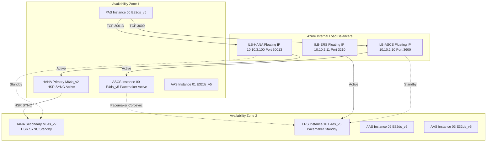
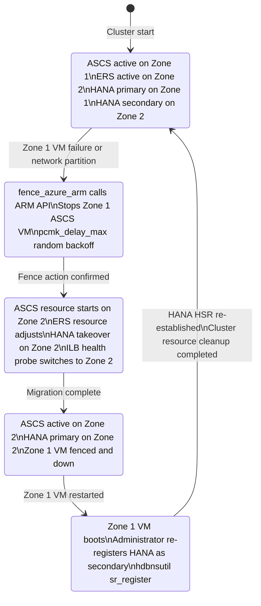

# SAP on Azure Compute Architecture

---

## Overview

This chapter defines the compute architecture for SAP workloads deployed on Microsoft Azure. The scope includes virtual machine family selection for SAP HANA, SAP NetWeaver ABAP, SAP Central Services, and SAP Web Dispatcher; Availability Zone deployment patterns; Proximity Placement Group usage; HANA System Replication configuration; Pacemaker cluster configuration for ASCS/ERS and HANA HA; Reserved Instance strategy; and OS configuration baselines for Red Hat Enterprise Linux (RHEL) and SUSE Linux Enterprise Server (SLES) on SAP-certified VM SKUs.

Key architecture decisions: M-series VMs (Mv2, Msv2, Mdsv3) for SAP HANA production; E-series VMs (Edsv5) for SAP application servers and ASCS/ERS; Availability Zone deployment with cross-zone clustering for all production tiers; Proximity Placement Groups for latency-sensitive single-zone tiers; ENSA2 for SAP ASCS/ERS with Pacemaker fence_azure_arm STONITH; HANA HSR in SYNC mode with Pacemaker SAPHana/SAPHanaTopology resource agents. These decisions are grounded in SAP Note 1928533 (supported Azure VM types), SAP Note 2694118 (ENSA2 on Azure), and SAP Note 3007991 (Azure Fence Agent).

---

## Architecture Overview

SAP production workloads are deployed across two Azure Availability Zones within a single Azure region. Zone 1 hosts the primary HANA instance and active ASCS node. Zone 2 hosts the HANA secondary (HSR SYNC) and ERS node. Azure Internal Load Balancers (Standard SKU, floating IP enabled) front the ASCS and HANA cluster virtual hostnames. SAP application servers (PAS and AAS) are distributed across both zones with Azure Load Balancer or SAP Logon Groups providing distribution.

### Architecture Diagram: SAP Compute HA Topology



---

## SAP Architecture

### SAP Components and VM Sizing

#### SAP HANA Database

SAP HANA scale-up (single-node) is the primary deployment model for SAP S/4HANA and SAP BW/4HANA on Azure. The VM family selection follows SAP Note 1928533 and the Azure HANA Certified Instances list (hardware configuration at [aka.ms/azurehavmtype]).

**Production HANA VM sizing:**

| SAP System | HANA Memory Footprint | Azure VM SKU | vCPUs | RAM | Max IOPS (Premium SSD v2) | Network Throughput |
|---|---|---|---|---|---|---|
| SAP S/4HANA (small) | Up to 768 GiB | M32ts_v2 | 32 | 192 GiB | 80,000 | 16,000 Mbps |
| SAP S/4HANA (medium) | Up to 1,792 GiB | M64s_v2 | 64 | 1,024 GiB | 160,000 | 16,000 Mbps |
| SAP S/4HANA (large) | Up to 3,892 GiB | M192is_v2 | 192 | 4,096 GiB | 200,000 | 25,000 Mbps |
| SAP BW/4HANA | Up to 5,700 GiB | Mv2 (M208ms_v2) | 208 | 5,700 GiB | 200,000 | 16,000 Mbps |

The M64s_v2 is the most common SKU for SAP S/4HANA production systems with 3-5 million line items. The Mv2 family is required for SAP BW/4HANA landscapes exceeding 3,892 GiB HANA memory. The Mdsv3 family (local NVMe SSD attached) is used when HANA persistent memory (PMEM) is required for SAP HANA Fast Restart. All HANA production VMs must have Accelerated Networking enabled (SAP Note 1928533).

HANA memory sizing follows SAP Quick Sizer output with a 20% buffer added for HANA delta merges, column table loads, and OS/kernel overhead. The Azure VM RAM must be at least 1.2x the HANA memory requirement as reported by SAP Quick Sizer.

#### SAP NetWeaver Application Servers (PAS and AAS)

| Role | Azure VM SKU | vCPUs | RAM | Justification |
|---|---|---|---|---|
| PAS (Primary Application Server) | E32ds_v5 | 32 | 256 GiB | SAP ABAP work processes (dialog, background, update, spool) require 2-4 GiB per work process; 32 vCPUs supports up to 30 configured work processes with headroom |
| AAS (Additional Application Server) | E32ds_v5 | 32 | 256 GiB | Same SKU as PAS for operational simplicity; scale out horizontally by adding AAS VMs |
| Small AAS or non-production | E16ds_v5 | 16 | 128 GiB | Sufficient for non-production or small-volume AAS instances |

Application server VMs are placed in the application subnet. The number of AAS VMs is determined by the SAP Quick Sizer SAPS (SAP Application Performance Standard) output divided by the SAPS per VM at the target utilization of 65%.

#### SAP Central Services (ASCS/ERS)

| Role | Azure VM SKU | vCPUs | RAM | Justification |
|---|---|---|---|---|
| ASCS Node 1 (Zone 1) | E4ds_v5 | 4 | 32 GiB | ASCS/SCS hosts Message Server and Enqueue Server (ENSA2); low CPU/RAM requirements; 4 vCPUs mandatory for Accelerated Networking |
| ERS Node 2 (Zone 2) | E4ds_v5 | 4 | 32 GiB | ERS (Enqueue Replication Server) for ENSA2; mirrors ASCS SKU for cluster failover symmetry |

SAP ENSA2 (Enqueue Server version 2) is the mandatory enqueue architecture for all new SAP S/4HANA and NetWeaver deployments on Azure. ENSA1 (standalone Enqueue Replication Server) is supported only on existing ECC 6.0 deployments and must not be used for new deployments. ENSA2 integrates the replication server into the ASCS cluster node, requiring only a two-VM cluster (ASCS + ERS) instead of three VMs (ASCS + ERS + SCS).

#### SAP Web Dispatcher

| Role | Azure VM SKU | vCPUs | RAM | Justification |
|---|---|---|---|---|
| SAP Web Dispatcher (Zone 1) | E16ds_v5 | 16 | 128 GiB | SAP Web Dispatcher handles HTTP/HTTPS traffic for SAP Fiori; 16 vCPUs provides 12,500 Mbps network throughput |
| SAP Web Dispatcher (Zone 2) | E16ds_v5 | 16 | 128 GiB | Second instance for HA across zones; both instances behind Azure ILB or Azure Application Gateway |

### SAP HANA System Replication (HSR) Configuration

HANA System Replication (HSR) provides synchronous data replication between the primary and secondary HANA instances for zero-RPO HA within an Azure region, and asynchronous replication to a third site (DR region) for disaster recovery.

**HSR Production Configuration (intra-region SYNC):**

```
hdbnsutil -sr_enable --name=SITEHDB1
hdbnsutil -sr_register --name=SITEHDB2 \
  --remoteHost=hanadb01 \
  --remoteInstance=00 \
  --replicationMode=SYNC \
  --operationMode=logreplay \
  --remoteLogPath=/hana/log/SID/mnt00001
```

- **Replication mode SYNC**: Every transaction on the primary is replicated to the secondary before the commit acknowledgment is returned to the application. Zero data loss for planned and unplanned failovers. Latency impact: 0.5-1.5 ms additional commit latency for each transaction, which is acceptable because intra-zone HANA VM network RTT is 0.1-0.3 ms.
- **Operation mode logreplay**: The secondary continuously applies redo logs as they arrive from the primary. This is the preferred mode for HA scenarios as it minimizes takeover time (secondary is always close to primary state).
- **HSR replication interface**: The HSR traffic uses the secondary IP address on the HANA VM's NIC 1 (HANA subnet, dedicated HSR IP). HSR traffic must not share bandwidth with application-layer HANA client connections to prevent I/O saturation.

**HSR DR Configuration (inter-region ASYNC):**

```
hdbnsutil -sr_register --name=SITEHDB3 \
  --remoteHost=hanadb01 \
  --remoteInstance=00 \
  --replicationMode=ASYNC \
  --operationMode=logreplay_readaccess
```

- **Replication mode ASYNC**: Transactions commit on the primary without waiting for the secondary to acknowledge receipt. Data lag is typically 5-15 seconds under normal load. Used for DR replication to the secondary Azure region because inter-region latency (10-60 ms) would make SYNC mode unacceptably slow.
- **Operation mode logreplay_readaccess**: The DR secondary can serve read queries (SAP HANA read-scale) while replication is active, reducing the total cost of the DR HANA instance by offloading reporting workloads.

### Pacemaker Cluster Configuration for ASCS/ERS

The Pacemaker cluster is configured with the following key parameters:

**Cluster properties:**
```xml
property stonith-enabled=true
property stonith-timeout=900
property have-watchdog=false
property concurrent-fencing=true
rsc_defaults resource-stickiness=1
rsc_defaults migration-threshold=3
op_defaults timeout=600
```

**Fence agent (fence_azure_arm) configuration:**
```xml
primitive rsc_st_azure stonith:fence_azure_arm \
  params msi=true subscriptionId="<sub-id>" \
  resourceGroup="<rg-name>" \
  pcmk_monitor_retries=4 \
  pcmk_action_limit=3 \
  power_timeout=240 \
  pcmk_reboot_timeout=900 \
  pcmk_delay_max=15
```

The fence agent uses a system-assigned managed identity on each cluster VM. The managed identity must have the `Virtual Machine Contributor` role scoped to both ASCS VMs. The `pcmk_delay_max=15` parameter introduces a random delay before fencing to prevent split-brain when both nodes see each other as failed simultaneously (tie-breaking mechanism).

**SAPInstance resource for ASCS:**
```xml
primitive rsc_sap_SID_ASCS00 SAPInstance \
  operations $id=rsc_sap_SID_ASCS00-operations \
  op monitor interval=11 timeout=60 on-fail=restart \
  params InstanceName=SID_ASCS00_<hostname> \
    START_PROFILE=/sapmnt/SID/profile/SID_ASCS00_<hostname> \
    AUTOMATIC_RECOVER=false \
    MINIMAL_PROBE=true
```

### SAP Notes Reference Table

| SAP Note | Title | Architecture Impact | Where Applied |
|---|---|---|---|
| 1928533 | SAP Applications on Azure: Supported Products and Azure VM Types | Defines supported Azure VM families (M-series for HANA; E-series for NetWeaver); mandates Accelerated Networking for VMs with 4+ vCPUs | VM SKU selection; NIC configuration |
| 1943937 | Hardware Configuration Check Tool: Azure Support | 0.7 ms maximum round-trip latency app-to-HANA; requires niping validation; specifies HANA storage KPIs | VM placement within same AZ; PPG usage decision |
| 2694118 | SAP HANA HA with ENSA2 on Azure | ENSA2 as mandatory enqueue architecture; Azure ILB Standard with floating IP; Pacemaker cluster configuration | ASCS/ERS cluster design; Azure ILB configuration |
| 3007991 | Pacemaker Fencing with Azure Fence Agent | fence_azure_arm configuration; managed identity permissions; Pacemaker property values | Pacemaker STONITH configuration |
| 2055470 | HANA on Azure: Ignore storage I/O metrics for planning | HANA storage I/O counter guidance on Azure; use actual HANA persistence statistics for sizing | HANA storage sizing approach |
| 2382421 | Optimizing the Network Configuration on HANA and OS Level | OS-level network tuning for HANA VMs; TCP buffer sizes; IRQ affinity | OS network configuration on HANA VMs |
| 2205917 | SAP HANA DB: Recommended OS Settings for SLES 12 / SLES 15 | SUSE-specific OS tuning for HANA VMs; SAP HANA profile for tuned-adm; transparent hugepages | OS configuration on SLES-based HANA VMs |
| 2009879 | SAP HANA Guidelines for Red Hat Enterprise Linux | RHEL-specific OS tuning for HANA VMs; tuned profile sap-hana; kernel parameters | OS configuration on RHEL-based HANA VMs |
| 2777782 | SAP HANA: Best Practices in Azure for Multi-SID Clusters | Multi-SID (MCOS) cluster configuration on Azure; resource naming conventions; cluster constraints | Multi-SID ASCS/ERS cluster deployments |

---

## Azure Architecture

### Azure Virtual Machine Families for SAP

**M-series (HANA production):**

| VM SKU | vCPUs | RAM | Max Cached IOPS | Network Throughput | HANA Certification |
|---|---|---|---|---|---|
| M32ts_v2 | 32 | 192 GiB | 400,000 | 16,000 Mbps | SAP HANA scale-up up to 192 GiB |
| M64s_v2 | 64 | 1,024 GiB | 800,000 | 16,000 Mbps | SAP HANA scale-up up to 1,024 GiB |
| M128s_v2 | 128 | 2,048 GiB | 800,000 | 16,000 Mbps | SAP HANA scale-up up to 2,048 GiB |
| M192is_v2 | 192 | 4,096 GiB | 800,000 | 25,000 Mbps | SAP HANA scale-up up to 4,096 GiB |
| M208ms_v2 | 208 | 5,700 GiB | 800,000 | 16,000 Mbps | SAP HANA scale-up up to 5,700 GiB; SAP BW/4HANA |
| Msv3-128 | 128 | 1,792 GiB | 130,000 | 40,000 Mbps | SAP HANA scale-up up to 1,792 GiB; higher network throughput than Mv2 |

All M-series VMs require Accelerated Networking. The Msv3 family provides higher network throughput (40 Gbps vs. 16 Gbps for Mv2) and is preferred for new deployments where HANA replication and backup traffic require high bandwidth.

**E-series (NetWeaver application servers):**

| VM SKU | vCPUs | RAM | Max IOPS | Network Throughput | SAP Use Case |
|---|---|---|---|---|---|
| E4ds_v5 | 4 | 32 GiB | 6,400 | 6,250 Mbps | ASCS/ERS cluster nodes (minimum 4 vCPUs for Accelerated Networking) |
| E16ds_v5 | 16 | 128 GiB | 25,600 | 12,500 Mbps | SAP Web Dispatcher; small AAS; SAP Cloud Connector |
| E32ds_v5 | 32 | 256 GiB | 51,200 | 16,000 Mbps | PAS and AAS (standard production sizing) |
| E48ds_v5 | 48 | 384 GiB | 76,800 | 16,000 Mbps | Large PAS with high dialog work process count |
| E64ds_v5 | 64 | 512 GiB | 80,000 | 16,000 Mbps | Very large AAS or SAP Java application servers |

E-series v5 VMs have local SSD (ds variant) for the OS disk and swap space. The local SSD is not used for SAP application data (all SAP data resides on Azure NetApp Files NFS mounts). Local SSD is used only for OS and SAP kernel directory (/usr/sap) if not using Azure NetApp Files for that path.

### Availability Zone Deployment Pattern

All production SAP workloads are deployed across two Availability Zones within the Azure region. The zone selection (Zone 1 and Zone 2 rather than Zone 1 and Zone 3) is intentional: it reserves Zone 3 capacity for emergency scale-out. The cross-zone latency between Zone 1 and Zone 2 in major Azure regions is typically 1-2 ms for intra-zone round trips, which is acceptable for Pacemaker corosync heartbeat but exceeds the SAP HANA application-to-database 0.7 ms threshold.

For this reason:
- **HANA primary and the PAS/AAS instances that connect to it** must be in the **same zone** (Zone 1).
- **HANA secondary** is placed in Zone 2 (acceptable because HSR SYNC replication latency of 1-2 ms intra-region is within the HANA synchronous replication tolerance, which is different from the application-to-HANA client connection latency requirement).
- **Additional AAS instances** are distributed across Zone 1 and Zone 2; they connect to HANA via the ILB VIP which always routes to the active HANA primary in Zone 1.

### Proximity Placement Groups (PPG)

PPG is used in limited scenarios on Azure for SAP:

| Scenario | PPG Required | Justification |
|---|---|---|
| SAP HANA production (primary + PAS in Zone 1) | Yes, when using Mv2/M-series where HANA client latency below 0.4 ms is required for fast OLTP | PPG co-locates PAS VM and HANA primary VM in the same physical host cluster within Zone 1, achieving 0.1-0.3 ms RTT vs. 0.3-0.7 ms without PPG |
| SAP ASCS/ERS cluster (two-zone) | No | Cross-zone Pacemaker cluster cannot use a single PPG (PPG is zone-specific); each cluster node may be in a zone-anchored PPG |
| SAP non-production systems | No | PPG adds deployment constraints that reduce available VM capacity; not justified for non-production |
| SAP HANA scale-out (multi-node) | Yes | HANA scale-out nodes require PPG to ensure all nodes are in the same zone and physical cluster, as HANA inter-node communication latency below 0.5 ms is required for distributed query execution |

**PPG creation and assignment:**
```bash
az ppg create --name ppg-sap-prod-z1 \
  --resource-group rg-sap-prod \
  --location eastus2 \
  --zone 1 \
  --type Standard

az vm create ... --ppg ppg-sap-prod-z1
```

The PPG must be anchored to a zone when zone-specific co-location is needed. An unanchored PPG may be placed in any zone and can cause unexpected zone-to-zone migration during VM restart.

### OS Configuration Baseline

All SAP HANA VMs must be configured with the OS tuning parameters specified in SAP Notes 2205917 (SLES) or 2009879 (RHEL) before HANA installation. The key OS parameters for HANA VMs are:

**Kernel parameters (/etc/sysctl.d/99-sap-hana.conf):**
```
net.core.somaxconn = 4096
net.ipv4.tcp_max_syn_backlog = 8192
net.ipv4.tcp_timestamps = 1
net.ipv4.tcp_sack = 1
net.ipv4.tcp_slow_start_after_idle = 0
vm.swappiness = 10
kernel.numa_balancing = 0
```

**tuned profile:** `sap-hana` (RHEL: `tuned-adm profile sap-hana`; SLES: `saptune solution apply HANA`)

**Transparent Hugepages:** `never` (HANA manages its own memory pages)
```bash
echo never > /sys/kernel/mm/transparent_hugepage/enabled
echo never > /sys/kernel/mm/transparent_hugepage/defrag
```

**Swap space:** HANA VMs require swap space equal to the VM RAM up to 2 TiB, then 1 TiB additional swap per additional 4 TiB RAM. Swap is configured on the Premium SSD v2 data disk attached to the HANA VM OS disk NIC.

### Architecture Diagram: Pacemaker Cluster State Machine



---

## Design Decisions

| Decision | Options Considered | Choice | Rationale | Reference |
|---|---|---|---|---|
| HANA VM family | (1) E-series (memory-optimized); (2) M-series (Mv2/Msv2/Mdsv3); (3) D-series large | M-series (M64s_v2 for standard production; Mv2 for large BW/4HANA) | M-series is the only Azure VM family certified by SAP for HANA production workloads above 192 GiB. E-series is not supported for production HANA by SAP Note 1928533 for HANA memory above 672 GiB. | SAP Note 1928533; Azure HANA Certified Instances |
| HANA HSR replication mode for production | (1) SYNC; (2) SYNCMEM; (3) ASYNC for all | SYNC for intra-region HA; ASYNC for inter-region DR | SYNC mode provides zero RPO for intra-region AZ failover with negligible latency impact (1-2 ms RTT between AZs). SYNCMEM (synchronous without persistence on secondary) is not supported for Pacemaker-managed HSR on Azure. ASYNC is used for inter-region DR only. | SAP HANA System Replication documentation |
| SAP ASCS/ERS enqueue architecture | (1) ENSA1 (classic 3-node); (2) ENSA2 (2-node) | ENSA2 (Enqueue Server 2) | ENSA2 reduces cluster node count from 3 to 2, simplifying Pacemaker configuration. ENSA2 is the mandatory architecture for new SAP S/4HANA deployments. ENSA1 is only supported on existing ECC 6.0 systems for continuity. | SAP Note 2694118 |
| Pacemaker STONITH mechanism | (1) SBD (SCSI Based Death); (2) fence_azure_arm (Azure REST API); (3) No STONITH | fence_azure_arm with managed identity (MSI) | SBD on Azure requires shared disk (Azure shared disk, which has limitations on M-series VMs). fence_azure_arm integrates natively with Azure Resource Manager via managed identity, requires no separate disk resource, and supports cross-zone fencing. | SAP Note 3007991 |
| Proximity Placement Group usage | (1) PPG for all SAP VMs; (2) PPG only for HANA+PAS in Zone 1; (3) No PPG | PPG used only for HANA primary VM and PAS VMs in Zone 1 when measured RTT exceeds 0.4 ms | PPG constrains VM placement and reduces available capacity. Use PPG only when niping measurements confirm that round-trip latency exceeds 0.4 ms between PAS and HANA VMs in the same zone (threshold before impact on fast OLTP response time). | SAP Note 1943937; Azure PPG documentation |
| VM OS for SAP HANA | (1) RHEL for SAP (Red Hat Enterprise Linux 8.x/9.x); (2) SLES for SAP (SUSE Linux Enterprise Server 15.x); (3) Oracle Linux | RHEL for SAP 8.8 or 9.2 (or SLES for SAP 15 SP4+ for SUSE-based organizations) | Both RHEL for SAP and SLES for SAP are certified for SAP HANA on Azure. The choice depends on the organization's existing enterprise Linux agreement and operational expertise. SAP Note 2009879 covers RHEL; SAP Note 2205917 covers SLES. | SAP Note 2009879; SAP Note 2205917 |
| Reserved Instances strategy | (1) Pay-as-you-go only; (2) 1-year Reserved Instances for HANA and AAS; (3) 3-year Reserved Instances for HANA only | 1-year Reserved Instances for HANA VMs and stable AAS VMs; pay-as-you-go for ASCS/ERS (small SKU, lower savings) | 1-year Reserved Instances save 40-50% vs. pay-as-you-go on M-series VMs. 3-year Reserved Instances provide 60-65% savings but reduce flexibility for HANA size changes. ASCS/ERS E4ds_v5 savings are lower in absolute terms, not worth reservation commitment risk. | Azure Reserved VM Instances pricing |
| AAS scaling approach | (1) Scale up (larger VMs); (2) Scale out (more VMs); (3) Hybrid | Scale out (additional AAS VMs) rather than scale up | SAP NetWeaver ABAP is designed for horizontal scale-out across multiple application server instances. Each AAS VM contributes independent SAPS capacity. Scaling up is limited by the maximum SAP-certified application server SKU (E64ds_v5) and does not improve single-user response time. | SAP Application Server architecture |

---

## Azure Well-Architected Alignment

| Pillar | Requirement | Implementation | Reference |
|---|---|---|---|
| Reliability | HANA zone failure must not cause data loss | HANA HSR SYNC mode; Pacemaker SAPHana resource agent manages automatic takeover; takeover tested quarterly via Chaos Engineering exercise | Azure WAF Reliability pillar; SAP Note 2694118 |
| Reliability | ASCS/ERS zone failure must not interrupt SAP sessions | Pacemaker ENSA2 two-node cluster; Azure Fence Agent ensures failed node is stopped within 60 seconds before resources migrate; SAP sessions reconnect to new ASCS VIP | SAP Note 2694118; SAP Note 3007991 |
| Reliability | SAP VM OS disk failure must not cause unrecoverable data loss | OS disks use Premium SSD v2; Azure Backup daily VM backup with application-consistent snapshots; HANA data resides on Azure NetApp Files (not OS disk) | Azure Backup documentation |
| Security | SAP VM OS must be patched within 30 days of critical CVE | Azure Update Manager with maintenance schedule aligned to SAP downtime window (third Sunday of each month, 22:00-02:00 UTC); patching sequence: AAS first, then PAS, then ASCS/ERS with failover, then HANA secondary first | Azure Update Manager documentation |
| Security | SAP VM access must be audited | All SAP VM SSH access via Azure Bastion (no public IP on any SAP VM NIC); Azure Bastion session logs to Log Analytics workspace; Just-in-Time VM access via Microsoft Defender for Cloud requires approval before SSH port is opened | Azure Bastion documentation; Defender for Cloud JIT |
| Security | SAP VM OS disk must be encrypted | Azure Disk Encryption (ADE) with BitLocker for Windows VMs and dm-crypt for Linux VMs; encryption key stored in Azure Key Vault Premium per SAP subscription | Azure Disk Encryption documentation |
| Cost Optimization | HANA VM cost must be minimized with Reserved Instances | 1-year Reserved Instances for M64s_v2 HANA primary and secondary VMs; saving approximately $4,200/month vs. pay-as-you-go at $6,300/month per M64s_v2 | Azure Reserved VM Instances pricing |
| Cost Optimization | Non-production SAP VMs must shut down during off-hours | Azure Automation Start/Stop VMs solution v2 schedules non-production (DEV, QA) SAP VMs to shut down at 20:00 UTC and start at 07:00 UTC Monday-Friday; estimated saving: 60% of non-production VM compute cost | Azure Automation Start/Stop VMs |
| Operational Excellence | VM deployments must be repeatable and version-controlled | All SAP VM deployments use Bicep templates under /bicep/compute/; VM extensions (Azure Monitor Agent, HANA pre-requisite scripts) applied via Bicep extension resources; no manual VM configuration | Azure Bicep documentation |
| Performance Efficiency | HANA VM CPU and memory utilization must be monitored | Azure Monitor for SAP Solutions HANA provider monitors HANA service CPU, memory, disk I/O, and network at 1-minute granularity; alert thresholds: CPU above 85% for 10 minutes (Sev 2), memory above 90% for 5 minutes (Sev 1) | Azure Monitor for SAP Solutions docs |

---

## RPO/RTO Table

| SAP Tier | RPO Target | RTO Target | HA Method | DR Method |
|---|---|---|---|---|
| Production HANA Database | 0 seconds (SYNC HSR) | 5 minutes (Pacemaker HANA takeover including fence action) | HSR SYNC + Pacemaker SAPHana/SAPHanaTopology across AZ1/AZ2 | HSR ASYNC to DR region (secondary HANA VM pre-deployed, powered down); RPO 5-15 seconds; RTO 2 hours for DR failover |
| Production ASCS/ERS | 0 seconds (ENSA2 in-memory lock replication) | 2 minutes (fence action 20-30 seconds + ASCS resource start 30-60 seconds) | Pacemaker ENSA2 two-node cluster across AZ1/AZ2 | Azure Site Recovery cold standby in DR region; RTO 4 hours |
| Production Application Servers (PAS/AAS) | Not applicable (stateless) | 5 minutes per AAS VM (Azure VM restart); 15 minutes for full AAS pool restart | Multiple AAS VMs across AZ1/AZ2; loss of one AAS handled by SAP Logon Groups re-routing to remaining AAS | Azure Site Recovery replication; RTO 1 hour for full app server pool in DR region |
| Production Web Dispatcher | Not applicable (stateless) | 5 minutes (ILB health probe switches to remaining healthy instance) | Two Web Dispatcher VMs across AZ1/AZ2 | Azure Site Recovery; RTO 30 minutes |
| Quality Assurance | 4 hours | 8 hours | Single-VM with daily Azure Backup | Azure Backup cross-region restore to DR region |
| Development | 24 hours | 24 hours | Single-VM with daily Azure Backup | No DR; rebuild from Azure Backup or SAP system copy if needed |

---

## Cost Optimization

| Optimization | Potential Saving | Implementation | Prerequisites |
|---|---|---|---|
| M64s_v2 HANA VM Reserved Instance 1-year | ~40% vs. pay-as-you-go; approximately $4,200/month saving per VM pair (primary + secondary at $6,300/month each PAYG vs. $3,780/month with 1-year RI) | Purchase 1-year Reserved Instance for each M64s_v2 HANA VM in Azure Reservations portal | 12-month commitment to production HANA landscape; VM SKU must not change within reservation term |
| E32ds_v5 AAS VM Reserved Instance 1-year | ~38% vs. pay-as-you-go; approximately $300/month saving per AAS VM (4 AAS VMs = $1,200/month total saving) | Purchase 1-year Reserved Instance for each stable AAS VM; spot instance flexibility reserved for burst AAS capacity | 12-month commitment; AAS VM SKU stable |
| Non-production VM auto-shutdown | ~60% of non-production compute cost; approximately $2,500/month for a typical 3-tier non-production SAP system | Azure Automation Start/Stop VMs v2 with schedule: shutdown at 20:00 UTC, start at 07:00 UTC Monday-Friday | Azure Automation account; non-production VMs tagged with auto-shutdown=true |
| Azure Hybrid Benefit for RHEL/SLES SAP VMs | ~15-20% of total VM cost (Linux licensing portion); approximately $0.15-0.20/vCPU/hour saving | Apply Azure Hybrid Benefit to HANA and application server VMs if organization has existing RHEL or SLES subscriptions with cloud access entitlement | Red Hat Cloud Access or SUSE Public Cloud Program enrollment |
| Deallocate HANA secondary during DR testing windows | Save HANA secondary VM cost during non-critical periods (for example, 2-week DR test window every 6 months) | Deallocate HANA secondary VM, retaining disk to avoid re-seeding HSR; restart and re-register as HSR secondary after DR test | Planned maintenance window; HANA primary must be stable during secondary deallocation; RPO increases to 0 during deallocation |
| Right-size AAS VMs quarterly | 15-25% saving when AAS VMs are overprovisioned | Review Azure Monitor CPU and memory utilization for AAS VMs quarterly; downsize E32ds_v5 to E16ds_v5 if 30-day p95 CPU below 30% and memory below 40% | Azure Monitor utilization baseline; SAP SAPS recalculation after downsizing |
| Azure Spot Instances for SAP batch servers | Up to 90% cost reduction for dedicated SAP batch application servers | Deploy dedicated SAP Batch Work Process AAS on Azure Spot Instances for non-critical batch workloads (period-end batch is excluded); configure SAP batch server group to route low-priority batch to Spot AAS | SAP batch workload classification; Azure Spot Instance eviction handling; not permitted for dialog or update work process servers |

---

## Monitoring and Alerts

| Alert Name | Metric/Signal | Threshold | Severity | Action Group |
|---|---|---|---|---|
| HANA-CPU-Critical | AMS HANA provider: HANA service CPU % | Above 85% for 10 minutes | Sev 2 | sap-hana-dba-oncall |
| HANA-Memory-Critical | AMS HANA provider: memory used % | Above 90% for 5 minutes | Sev 1 | sap-hana-dba-oncall |
| HANA-HSR-Replication-Lag | AMS HA provider: HSR secondary lag time | Above 30 seconds for 5 minutes | Sev 2 | sap-hana-dba-oncall |
| HANA-HSR-Status-Not-Active | AMS HA provider: HSR replication status | Status not ACTIVE for 2 minutes | Sev 1 | sap-hana-dba-oncall |
| ASCS-Cluster-Node-Fenced | AMS HA provider: Pacemaker node count | Node count below 2 for 2 minutes | Sev 1 | sap-basis-oncall |
| ASCS-Cluster-Resource-Failed | AMS HA provider: Pacemaker resource state | Any resource in FAILED state | Sev 1 | sap-basis-oncall |
| SAP-Dialog-ResponseTime-High | AMS NetWeaver provider: dialog response time | Above 2 seconds for 10 minutes | Sev 2 | sap-basis-oncall |
| SAP-Background-Queue-Backlog | AMS NetWeaver provider: background queue length | Above 100 queued jobs for 15 minutes | Sev 2 | sap-basis-oncall |
| SAP-VM-CPU-Saturated | Azure Monitor VM CPU % | Above 90% for 15 minutes on any SAP app server VM | Sev 2 | sap-basis-oncall |
| SAP-VM-Memory-High | Azure Monitor VM available memory bytes | Below 5% of total VM RAM for 10 minutes | Sev 2 | sap-basis-oncall |
| HANA-VM-Disk-IOPS-Throttled | Azure Monitor Disk IOPS throttled | Above 0 for 5 minutes on HANA VM | Sev 1 | sap-hana-dba-oncall |
| SAP-AbortRate-High | AMS NetWeaver provider: ABAP short dump rate | Above 10 short dumps per hour | Sev 2 | sap-basis-oncall |

---

## Anti-Patterns

### Anti-Pattern 1: Using E-series VMs for Production SAP HANA Above 192 GiB

E-series VMs (Edsv5, Edsv4) are memory-optimized VMs suitable for SAP NetWeaver application servers and ASCS/ERS, and for SAP HANA development/test with memory below 192 GiB. Deploying production SAP HANA with 512 GiB or more on E-series VMs violates SAP Note 1928533, which explicitly lists the Azure HANA Certified Instance types. E-series VMs are not on the Azure HANA Certified Instances list for production HANA above 192 GiB. SAP Support will reject tickets for production incidents if the HANA VM is not from the certified list.

**Correct approach:** Use M-series VMs (M32ts_v2 minimum for 192 GiB, M64s_v2 for 1,024 GiB, Mv2 for 3,892 GiB+) for all production SAP HANA deployments. Use E-series for HANA development, sandbox, and test systems up to 192 GiB only.

### Anti-Pattern 2: Deploying ASCS/ERS Cluster Nodes in the Same Availability Zone

Deploying both ASCS and ERS nodes in the same Availability Zone (for example, both in Zone 1) creates a single zone failure point. If Zone 1 becomes unavailable (planned maintenance or unplanned failure), both cluster nodes are unavailable simultaneously, and there is no surviving node to take over the ASCS resource. Pacemaker cannot failover when both nodes are fenced.

**Correct approach:** Deploy the ASCS node in Zone 1 and the ERS node in Zone 2. Pacemaker corosync heartbeat between zones has 1-2 ms RTT, which is within the corosync heartbeat tolerance (default timeout 5000 ms). The Azure Internal Load Balancer Standard SKU supports zone-spanning backends and routes the cluster VIP to the active node regardless of zone.

### Anti-Pattern 3: Using Transparent Hugepages on SAP HANA VMs

Transparent Hugepages (THP) is a Linux kernel memory management feature that automatically promotes 4 KiB pages to 2 MiB hugepages. SAP HANA manages its own memory page allocation internally and conflicts with THP, causing HANA memory allocation failures, elevated CPU consumption for memory management, and unpredictable HANA restart times. Both SAP Note 2009879 (RHEL) and SAP Note 2205917 (SLES) explicitly require THP to be disabled on SAP HANA VMs.

**Correct approach:** Set transparent_hugepage to never and transparent_hugepage/defrag to never in the OS kernel parameters. Apply this via the SAP HANA tuned profile (RHEL: tuned-adm profile sap-hana; SLES: saptune solution apply HANA). Verify the setting persists across reboots by adding it to /etc/rc.d/rc.local or a systemd service unit.

### Anti-Pattern 4: Not Configuring fence_azure_arm STONITH and Setting stonith-enabled=false

Setting the Pacemaker property stonith-enabled=false disables the STONITH (Shoot The Other Node In The Head) fencing mechanism to simplify initial cluster testing. In production, this configuration is dangerous: when one cluster node experiences a network partition or crash, Pacemaker cannot verify that the failed node has stopped accessing shared resources (Azure NetApp Files NFS mounts, enqueue lock table). Without STONITH, both nodes may simultaneously believe they are the active master, causing a split-brain scenario that corrupts the HANA database or duplicates SAP enqueue lock entries. SAP Note 2694118 requires STONITH to be enabled.

**Correct approach:** Always enable STONITH with fence_azure_arm as the STONITH agent. Configure the fence agent with a system-assigned managed identity on each cluster node with Virtual Machine Contributor role. Test the fence agent before production go-live: run fence_azure_arm --action=status --plug=vm-name from each cluster node and verify the ARM API call succeeds.

### Anti-Pattern 5: Running SAP HANA and SAP Application Server on the Same VM

Co-locating SAP HANA and a SAP Application Server (PAS or AAS) on the same VM is sometimes considered for cost reduction in non-production environments. On production or pre-production systems, this violates several SAP support requirements and creates operational issues: HANA memory management conflicts with SAP NetWeaver ABAP work process memory; CPU contention during HANA delta merge operations causes application server timeouts; patching the OS requires stopping both HANA and the application server simultaneously; and HANA memory sizing must account for both HANA and NetWeaver ABAP heap, which typically requires a larger (more expensive) VM than either component alone.

**Correct approach:** Deploy SAP HANA and SAP Application Servers on separate VMs, even in non-production environments. Use the smaller E-series VMs for non-production application servers and M32ts_v2 for the smallest HANA non-production size.

### Anti-Pattern 6: Skipping niping Latency Validation Before Production Cutover

Teams frequently skip the niping round-trip latency validation between SAP application servers and the HANA database before production cutover, assuming that Azure Availability Zone placement automatically guarantees sub-0.7 ms latency. In practice, latency can be higher than expected when: the PAS and HANA VMs were not co-located in the same PPG when required; the HANA VM NIC is not using the correct NIC (application traffic may be routing over the HSR NIC); or the UDR incorrectly routes application-to-HANA traffic through Azure Firewall. Discovering a latency violation after production cutover causes unplanned HANA downtime for remediation.

**Correct approach:** Execute niping -s from the HANA VM (server mode) and niping -H from each PAS/AAS VM (client mode) before declaring production readiness. Require mean RTT below 0.7 ms over 1000 iterations. Document results in an Architecture Decision Record. If results exceed 0.7 ms, investigate UDR (check that HANA subnet direct route to app subnet is in place), PPG assignment, and NIC routing before cutover.

---

## Troubleshooting

### Issue 1: Pacemaker Cluster Shows ASCS Resource in FAILED State After Node Reboot

**Symptom:** After rebooting the ASCS Zone 1 VM for OS patching, the Pacemaker cluster fails to start the SAPInstance ASCS resource on the Zone 2 ERS node. crm_mon -Afr1 shows the SAPInstance resource in FAILED state. The cluster log (/var/log/pacemaker/pacemaker.log) shows: start of SAPInstance failed: could not find START_PROFILE.

**Root cause:** The ASCS instance profile directory (/sapmnt/SID/profile/SID_ASCS00_hostname) is mounted from Azure NetApp Files NFS. The NFS mount was not yet available when Pacemaker attempted to start the SAPInstance resource on the ERS node (NFS mount takes 5-15 seconds after network initialization, but Pacemaker started the resource before NFS was ready).

**Resolution:** Add a NFS mount readiness check as a Pacemaker resource constraint. Create a Filesystem resource for the /sapmnt NFS mount and add a resource order constraint: the Filesystem resource must start before the SAPInstance ASCS resource. Alternatively, add a `start-delay=30` operation timeout to the SAPInstance resource to give NFS mounts time to stabilize. Check /var/log/messages for NFS mount timing on the ERS node to confirm the root cause.

### Issue 2: SAP HANA Takeover Takes More Than 10 Minutes After Zone Failure

**Symptom:** After a simulated Zone 1 failure (VM power-off), the HANA takeover on the Zone 2 secondary takes 12-15 minutes instead of the expected 3-5 minutes. The SAP application servers show extended HANA connection failures during this period. The hdbnsutil -sr_state on Zone 2 shows INITIALIZING for 8+ minutes before switching to ACTIVE.

**Root cause:** HANA Fast Restart is not configured. Without Fast Restart, when HANA starts on the secondary after takeover, it must load all column store data from the data volume into memory from scratch. For a 512 GiB HANA memory footprint, loading from Azure NetApp Files at 1,000 MB/s throughput takes 8-12 minutes. HANA Fast Restart uses a persistent memory-mapped file (or the local NVMe SSD on Mdsv3 VMs) to persist HANA column store data across restarts, reducing restart time from minutes to seconds.

**Resolution:** Enable HANA Fast Restart on the secondary HANA VM using a memory-mapped file stored on the Premium SSD v2 data disk attached as /hana/restart: configure the HANA parameter [persistence] basepath_persistent_memory_volumes = /hana/restart. Size the restart volume as 1.25x the HANA memory configured size. Alternatively, use Mdsv3 VMs that include local NVMe SSD for HANA restart volume, providing restart times under 60 seconds for a 1 TiB HANA memory footprint. Reference: SAP HANA Fast Restart documentation.

### Issue 3: SAP ABAP Short Dumps Increase After HANA Failover (SQL_TIMEOUT)

**Symptom:** After a HANA takeover event, SAP ABAP application servers generate a burst of SQL_TIMEOUT short dumps visible in SM21 for 5-10 minutes after the HANA ILB VIP switches to the new primary.

**Root cause:** SAP ABAP application servers maintain HANA database connections via the SAP kernel's dbsl (database shared library) connection pool. After HANA takeover, the application servers detect the connection loss and attempt to reconnect to the HANA ILB VIP. During the reconnection window, pending SQL statements time out. This is expected behavior; the issue is that the SQL_TIMEOUT period (default 30 seconds) is too short compared to the HANA ILB health probe switch time (10-30 seconds after takeover).

**Resolution:** Increase the HANA connection timeout parameter in the SAP profile parameter file: icm/HANA_SQL_TIMEOUT = 300 (seconds). This allows pending SQL transactions to wait up to 5 minutes for HANA reconnect rather than timing out at 30 seconds. Additionally, configure the SAP HANA client reconnect parameter in hdbuserstore: hdbsqldbc_inifile = RECONNECT 30,300 (retry every 30 seconds for up to 300 seconds). Monitor SM21 SQL_TIMEOUT count after HANA failover tests to confirm the fix.

### Issue 4: Azure Spot Instance AAS VM Evicted During Peak Business Hours

**Symptom:** An AAS VM deployed on Azure Spot Instance is evicted by Azure during peak business hours at 09:30 AM, causing SAP dialog user sessions on that AAS to terminate. Users receive "system busy" messages.

**Root cause:** Azure Spot Instances can be evicted at any time when Azure needs the capacity back. Spot Instance eviction rate in M-series and E-series is typically low (less than 1% per month) but increases during high-demand periods in the Azure region. Deploying dialog-capable AAS instances on Spot leads to user session interruptions when eviction occurs during business hours.

**Resolution:** Restrict Spot Instances to non-critical batch-only AAS VMs configured with only background (B) and spool (S) work process types. Remove dialog (D) and update (U) work processes from Spot AAS VMs in RZ12 (RFC server group) and SAP Logon groups so that end-user dialog traffic never routes to Spot VMs. Configure the Spot AAS VM as a dedicated SAP batch server by setting the SAP profile parameter rdisp/wp_no_dia=0 and rdisp/wp_no_btc=10 on that instance only.

### Issue 5: HANA HSR Secondary Consistently Lags by More Than 60 Seconds

**Symptom:** The HANA HSR secondary shows a replication lag of 60-120 seconds in the AMS HA provider metrics. The hdbnsutil -sr_state output shows secondary SID site "LOGREPLAY" with shipping delay. The HANA primary alert log shows: log shipping slow: <shipment-speed> MB/s below threshold.

**Root cause:** HANA HSR log shipping from primary to secondary is being throttled because the dedicated HSR network interface (NIC 1 on the HANA VM) is shared with HANA backup traffic. During HANA log backup windows (every 15 minutes), backup traffic to Azure Backup competes with HSR log shipping for NIC 1 bandwidth. On an M64s_v2, NIC 1 throughput is capped at 8,000 Mbps, but backup generates 300-400 MB/s (2,400-3,200 Mbps) peak, leaving only 4,800-5,600 Mbps for HSR, which is insufficient for high-transaction SAP S/4HANA periods.

**Resolution:** Add a third NIC to the HANA VM (NIC 2) connected to the management subnet for backup traffic. Configure HANA backup (backint) to use the management subnet NIC 2 IP for backup data transmission by setting the HANA parameter [backup] data_backup_buffer_size and the backup destination to use the management subnet NIC's interface. This separates HSR traffic (NIC 1) from backup traffic (NIC 2) and restores HSR log shipping bandwidth. Reference: SAP Note 2080991 multi-NIC HANA recommendations.

### Issue 6: Pacemaker Resource Failover Succeeds but SAP Application Servers Cannot Connect to New HANA VIP

**Symptom:** After a HANA Pacemaker takeover, crm_mon shows the HANA primary resource active on Zone 2. The ILB health probe for the HANA VIP shows Zone 2 as healthy. However, SAP application servers still attempt to connect to Zone 1 HANA IP and get connection refused. The HANA ILB VIP (10.10.3.100) is not being used by the SAP application servers.

**Root cause:** The SAP application servers are configured with HANA direct host connection (using the HANA primary VM hostname in hdbuserstore) rather than using the HANA ILB VIP hostname. When Pacemaker migrates the HANA cluster resource to Zone 2 and the ILB switches the VIP, the application servers do not follow because they are bypassing the ILB.

**Resolution:** Reconfigure hdbuserstore on all SAP application server VMs to use the HANA cluster virtual hostname (which resolves to the ILB VIP): hdbuserstore SET DEFAULT hana-vip:30013@SID SYSTEM password. The hana-vip hostname must resolve to the ILB floating IP (10.10.3.100) in Azure DNS or via /etc/hosts on all application server VMs. After updating hdbuserstore, test with hdbsql -U DEFAULT "select * from dummy" to confirm connection via ILB VIP. Verify that the /usr/sap/SID/SYS/global/hdb/custom/config/nameserver.ini on each application server does not override the connection hostname with a direct HANA VM IP.

---

## Landing Zone Mapping

| Resource | Subscription | Management Group | Justification |
|---|---|---|---|
| HANA primary and secondary VMs (M64s_v2), HANA ILB | SAP Production Subscription | Landing Zones > SAP | HANA VMs require dedicated subscription for cost isolation, Defender for Cloud Servers Plan 2, and RBAC separation of DBA team from basis team |
| ASCS/ERS cluster VMs (E4ds_v5), ASCS ILB | SAP Production Subscription | Landing Zones > SAP | ASCS cluster VMs in same subscription as HANA and application servers; fence_azure_arm managed identity scoped to both ASCS VMs in the same subscription |
| PAS/AAS VMs (E32ds_v5) | SAP Production Subscription | Landing Zones > SAP | Application servers in same subscription as HANA for network performance (no inter-subscription routing) |
| Non-production HANA VMs (M32ts_v2 or E-series) | SAP Non-Production Subscription | Landing Zones > SAP | Separate subscription for Dev/Test pricing eligibility; non-production HANA uses smaller VM SKUs |

### Management Group Policy Assignments (SAP Management Group Scope)

| Policy | Effect | Purpose |
|---|---|---|
| Require-AcceleratedNetworking-4plus-vCPU | Deny | Enforces SAP Note 1928533 Accelerated Networking requirement; blocks VM creation without Accelerated Networking when vCPU count is 4+ |
| Deny-Non-SAP-Certified-HANA-VM | Deny (custom policy) | Restricts HANA subnet VM deployments to M-series and E-series SAP-certified SKUs only |
| Require-AzureMonitorAgent-Extension | DeployIfNotExists | Ensures Azure Monitor Agent VM extension is deployed on all SAP VMs for AMS and Log Analytics integration |
| Deploy-BootDiagnostics | DeployIfNotExists | Enables VM boot diagnostics on all SAP VMs; required for serial console access during troubleshooting |
| Require-Managed-Disks | Deny | Prevents use of unmanaged disks on SAP VMs; all disks must be Azure Managed Disks |
| Audit-VM-Backup-Enabled | AuditIfNotExists | Audits that all SAP VMs are covered by an Azure Backup policy |

---

## Microsoft References

- [SAP HANA on Azure: VM sizing for HANA](https://learn.microsoft.com/en-us/azure/sap/workloads/hana-vm-operations-hardware)
- [Azure M-series virtual machines for SAP HANA](https://learn.microsoft.com/en-us/azure/virtual-machines/m-series)
- [SAP HANA HA and DR on Azure: ENSA2 with Pacemaker on RHEL](https://learn.microsoft.com/en-us/azure/sap/workloads/sap-hana-high-availability-rhel)
- [SAP ASCS/ERS with Pacemaker on RHEL](https://learn.microsoft.com/en-us/azure/sap/workloads/high-availability-guide-rhel)
- [Azure Proximity Placement Groups for SAP applications](https://learn.microsoft.com/en-us/azure/sap/workloads/sap-proximity-placement-scenarios)
- [Azure Reserved VM Instances for SAP workloads](https://learn.microsoft.com/en-us/azure/cost-management-billing/reservations/reserved-vm-instance-determine-rights)
- [Azure Update Manager overview](https://learn.microsoft.com/en-us/azure/update-manager/overview)
- [SAP HANA System Replication configuration](https://help.sap.com/docs/SAP_HANA_PLATFORM/4e9b18c116aa42fc84c7dbfd02111aba/86267e1ed56940bb8d8d67688cc2de09.html)
