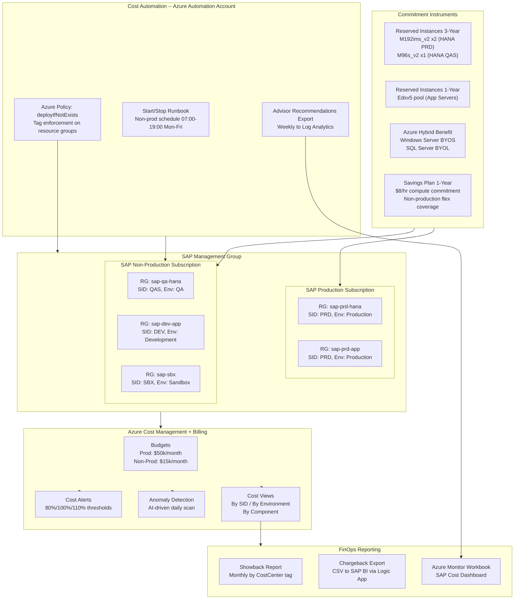
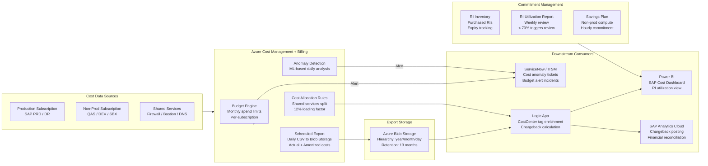

# SAP on Azure Cost Optimization

---

## Overview

Total cost of ownership for SAP on Azure is driven by four primary levers: compute (VM SKU selection and utilization rate), storage (disk type, provisioned capacity versus consumed capacity, and snapshot retention), licensing (operating system, database, and SAP application licensing model choices), and operational overhead (labor hours for patching, monitoring, incident response, and change management). Azure's consumption-based billing model rewards deliberate sizing; an M208ms_v2 VM running at 12% CPU utilization costs the same per hour as one running at 90%. Rightsizing decisions that are deferred at project inception accumulate into the most significant and most preventable cost overruns in SAP cloud migrations.

Azure's billing model for SAP workloads combines three cost structures that must be managed independently. On-demand pricing provides flexibility but is the highest rate tier; a single Standard_M192ims_v2 (4 TiB RAM) costs approximately USD 43/hour pay-as-you-go in East US 2, or approximately USD 23/hour with a 3-year Reserved Instance commitment--a 46% reduction. Azure Hybrid Benefit allows customers to apply existing Windows Server and SQL Server Software Assurance licenses against the Azure VM base rate, eliminating the OS/database license surcharge on covered VMs. Azure Savings Plans (compute-scoped) provide rate discounts of 17-37% across any compute type in exchange for a 1- or 3-year hourly spend commitment, complementing Reserved Instances for workloads with variable VM SKU requirements such as SAP application servers. Understanding how these three instruments interact--and when they conflict--is prerequisite to any cost optimization engagement.

FinOps Framework alignment structures this chapter. The FinOps Foundation's three-phase cycle (Inform, Optimize, Operate) maps directly to the SAP on Azure lifecycle: the Inform phase covers tagging, cost allocation, and showback reporting; the Optimize phase covers Reserved Instance purchases, Azure Hybrid Benefit activation, and storage tiering; the Operate phase covers automated start/stop for non-production, anomaly alerting, and continuous rightsizing using Azure Advisor and SAP EarlyWatch Alert data. Cost governance for SAP workloads must be a standing operational practice, not a one-time migration exercise, because SAP landscapes grow organically through transport landscape expansions, sandbox provisioning requests, and temporary capacity additions that are rarely decommissioned.

---

## Architecture Overview

The SAP on Azure cost governance architecture layers Azure-native controls over the SAP landscape's organizational model. At the subscription level, SAP production and non-production workloads occupy separate subscriptions within a dedicated SAP Management Group, which enables subscription-scoped budgets, cost alerts, and policy enforcement without interference from non-SAP workloads. Azure Cost Management + Billing aggregates consumption data across subscriptions and presents it through cost views that can be filtered and grouped by the resource tags applied at deployment time.

Tag-based cost allocation is the mechanism that translates raw Azure billing data into actionable chargeback or showback reports for SAP business owners. A consistent tagging schema--applied through Azure Policy deployIfNotExists at the resource group level--ensures that every VM, disk, load balancer, and storage account carries the fields required for allocation: SAPSystemID (three-character SID), SAPEnvironment (Production/QA/Development/Sandbox), SAPComponent (HANA/AppServer/ASCS/WebDispatcher/ANF), CostCenter, and ApplicationOwner. Without policy enforcement, tag drift is inevitable across landscapes with dozens of systems and multiple deployment teams.

Reserved Instance procurement for SAP HANA VMs requires a top-down approach: identify the stable production HANA VM SKU and term commitment first, then procure non-production RI coverage for the SKUs that run predictably in QA and pre-production. The M-series VMs used for SAP HANA qualify for both Azure Reserved Virtual Machine Instances and Azure Savings Plans, but the two instruments cannot stack on the same VM hour. For M-series VMs with a known stable SKU, Reserved Instances consistently outperform Savings Plans because the per-SKU discount depth (up to 46% for 3-year) exceeds the Savings Plan depth (up to 37%) for heavy compute types.

Continuous cost optimization for SAP is operationalized through three automation loops. The first is a daily Azure Automation runbook that evaluates SAP non-production VM power state schedules and enforces defined start/stop windows, targeting an 80-hour/week runtime reduction from a 168-hour baseline (a 52% compute cost reduction on non-production VMs). The second is a weekly Azure Advisor rightsizing review, integrated into the SAP operations team's Change Advisory Board, which surfaces VMs with sustained CPU utilization below 5% or memory utilization below 20%. The third is a monthly RI utilization review that compares purchased commitment against consumed hours and identifies any stranded commitments from decommissioned SAP systems.

### Architecture Diagram: SAP Cost Governance Architecture



---

## SAP Architecture

### SAP Sizing Methodology Impact on Cost

SAP sizing directly determines VM SKU selection, which is the single largest cost driver in an SAP on Azure landscape. The two primary SAP sizing tools--SAP QuickSizer and SAP EarlyWatch Alert--serve different lifecycle phases and produce different outputs that must both feed the Azure VM selection process.

SAP QuickSizer (available at quicksizer.sap.com) translates business process volumes--document postings per hour, concurrent dialog users, background job runtime--into SAPS (SAP Application Performance Standard) values. One SAPS represents the throughput to process 2,000 fully business-processed order line items per hour. The SAPS value then maps to an Azure VM SKU using the SAPS ratings published in SAP Note 1928533, which lists certified Azure VM types with their benchmark SAPS values. Critically, QuickSizer produces a peak sizing based on user-provided volumes; production systems routinely run at 30-50% of QuickSizer output during typical business hours, making right-sizing at go-live a near-universal opportunity.

SAP HANA TDI (Tailored Datacenter Integration) sizing applies specifically to HANA in-memory database sizing on non-HANA-appliance (cloud) infrastructure. SAP requires that the HANA host meet the memory, storage throughput, and CPU performance thresholds defined in SAP Note 1943937. Azure VMs are certified against TDI requirements through formal SAP certification; the full certified list is published at the SAP Certified IaaS Platforms directory. For cost purposes, TDI sizing establishes the minimum compliant VM; it does not mandate the maximum. A system sized for 1 TiB HANA memory can deploy on an M96s_v2 (1,873 GiB usable) rather than an M192ims_v2 (4 TiB) if the HANA data footprint is below the M96s_v2 memory capacity.

SAP EarlyWatch Alert (EWA) is the production rightsizing instrument. EWA reports, generated by SAP Solution Manager or SAP Cloud ALM on a weekly schedule, include CPU utilization percentiles (P50, P95), HANA memory consumption trends, database growth rates, and I/O throughput patterns. These metrics directly inform whether a production HANA VM can be downsized--for example, from M192ims_v2 to M96s_v2 when the EWA report shows HANA data + delta memory consistently below 900 GiB and CPU P95 below 40%. A single VM downsize of this type produces approximately USD 18,000/month in savings on a 3-year Reserved Instance basis.

SAP transport landscape design has a disproportionate impact on cost because it determines the number of SAP systems required. A three-tier transport landscape (DEV -> QAS -> PRD) requires a minimum of three complete SAP system stacks. Each stack includes a HANA database VM, one or more application server VMs, and ASCS/ERS VMs. Consolidating the development and quality assurance HANA databases onto a single multi-tenant HANA (MDC) instance--where SAP Note 1661202 and the HANA database size permit--can eliminate one full HANA VM from the landscape. At M64s_v2 Reserved Instance pricing of approximately USD 8,400/month (3-year commitment), this consolidation represents a meaningful recurring saving.

### SAP Notes -- Cost Architecture Impact

| SAP Note | Title | Architecture Impact | Where Applied |
|---|---|---|---|
| 1928533 | SAP Applications on Microsoft Azure: Supported Products and Azure VM Types | Defines the complete list of Azure VM SKUs certified for each SAP product; mandatory reference for any VM selection decision | VM SKU selection for all SAP components |
| 1943937 | Hardware Configuration Check Tool -- Prerequisites | Defines minimum storage KPIs (throughput, IOPS, latency) for HANA TDI certification; prevents under-provisioning that causes HANA certification failures | HANA storage sizing; ANF/disk selection |
| 2388694 | SAP HANA DB: Recommended OS settings for RHEL 7/RHEL 8 | OS tuning parameters that affect HANA memory usage and swap behavior; incorrect settings inflate HANA memory footprint, preventing downsizing | RHEL OS baseline for HANA VMs |
| 1661202 | Multi-tenancy in SAP HANA | Conditions under which multiple SAP systems can share a single HANA MDC instance; enables database consolidation to reduce HANA VM count | Transport landscape design (DEV/QAS consolidation) |
| 3014176 | SAP HANA DB: Use of SAP HANA Dynamic Tiering and SAP HANA Native Storage Extension | NSE moves warm data to disk; reduces HANA memory footprint, enabling use of smaller (cheaper) HANA VM SKUs | HANA memory optimization on production systems |
| 2399079 | Elimination of patch for HANA 2.0 | Applies to HANA 2.0 SPS patch eligibility; patch currency affects support scope and compliance; out-of-support HANA versions cannot be migrated to lower-cost VM SKUs without risk | HANA patch planning |
| 2586205 | Latest SAP HANA 2.0 Releases and Their End of Maintenance Date | Maintenance timeline planning; running post-EOM HANA versions requires SAP Extended Maintenance contracts, adding license cost | HANA version roadmap |
| 3299480 | Azure M-series VM support for SAP HANA | Specifies which exact Msv2/Mdsv3/Mv2 configurations are supported per HANA version/SPS; prevents selection of a certified VM SKU that is incompatible with the installed HANA version | VM SKU validation for HANA upgrades |

---

## Azure Architecture

### Azure Cost Management + Billing for SAP

Azure Cost Management + Billing is the primary tool for SAP cost visibility on Azure. It ingests billing data from all subscriptions within the SAP Management Group and makes it queryable with up to 13 months of history. For SAP environments, three custom views are essential: a view grouped by SAPSystemID tag to show per-SID cost; a view grouped by SAPEnvironment tag to compare production versus non-production spend; and a view grouped by resource type to identify the split between compute, storage, networking, and backup costs. These views are created as saved views in the Azure portal and exported as scheduled reports to a designated Azure Blob Storage account for integration with external reporting tools.

Cost export to Azure Blob Storage (Daily granularity, CSV format) enables downstream processing. A Logic App or Azure Data Factory pipeline reads the daily export, maps CostCenter tag values to internal cost center codes, and pushes the enriched data to an SAP BI or Power BI report. This pipeline forms the chargeback feed for SAP business units. The Logic App runs on a consumption plan; at SAP-scale export volumes (typically 5,000-50,000 rows/day), the execution cost is under USD 5/month.

### Cost Allocation Tags

The following mandatory tags are enforced via Azure Policy (effect: deployIfNotExists) at the resource group level, with inheritance propagated to child resources at billing time:

| Tag Key | Example Values | Purpose |
|---|---|---|
| SAPSystemID | PRD, QAS, DEV, SBX | Per-SID cost allocation; maps to SAP system landscape |
| SAPEnvironment | Production, QA, Development, Sandbox | Environment-level budget enforcement and alert thresholds |
| SAPComponent | HANA, AppServer, ASCS, WebDispatcher, ANF, Backup | Component-level analysis to identify storage vs compute cost distribution |
| CostCenter | CC-1234, CC-5678 | Chargeback mapping to financial cost centers |
| ApplicationOwner | firstname.lastname@domain.com | Escalation contact for anomaly alerts |
| Project | S4H-Migration, BW4HANA-Upgrade | Project-level cost tracking for CapEx/OpEx reclassification |

Tags are enforced at resource group creation. Individual resource-level tags are treated as overrides; absent a resource-level tag, the resource group tag value propagates in the billing export. Azure Policy initiative `sap-cost-tagging-governance` bundles all six tag enforcement policies and is assigned at the SAP Management Group scope.

### Chargeback Model

The SAP chargeback model operates on a monthly cycle aligned to Azure billing periods. Raw Azure costs (compute + storage + networking + backup) for each SAPSystemID are extracted from the Cost Management export. A loading factor of 1.12 is applied to cover shared services not directly attributable to a single SID: shared ANF capacity pool overhead, Azure Bastion hours, Azure Firewall processing units, and Azure Monitor Log Analytics ingestion. The loaded cost per SID is posted to the internal financial system against the CostCenter tag value. A separate showback report--provided for visibility without financial posting--breaks down cost by SAPComponent to help application teams understand where spend is concentrated.

### Reserved Instances for SAP VMs

Reserved Instances (RIs) for SAP HANA VMs represent the highest-value commitment instrument in the SAP cost optimization portfolio. M-series VMs run 24x7 without exception for production HANA; the 3-year RI discount of 40-47% over pay-as-you-go is realized in full because there is no idle time. RI scope should be set to the production subscription (not shared) to prevent RI benefit from being consumed by non-production VMs running the same SKU in the non-production subscription.

Key RI procurement decisions for SAP:

- Procure production HANA RI before non-production RI; production VM SKUs are fixed by SAP certification requirements and do not change without a major HANA upgrade.
- Use instance size flexibility (ISF) for application server RIs: Edsv5-series VMs qualify for ISF within the E-series instance family, allowing the RI to cover E4ds_v5 (ASCS/ERS) and E32ds_v5 (PAS) interchangeably.
- Do not procure RIs for Spot VMs; Spot pricing already provides 60-90% discount and RIs cannot apply to interrupted capacity.
- Review RI utilization monthly; an RI with less than 70% utilization over 30 days indicates a VM has been stopped, resized, or decommissioned.

Reference pricing (East US 2, Linux, as of mid-2025 estimates; verify current pricing at azure.microsoft.com/pricing/reserved-vm-instances):

| VM SKU | RAM | Pay-as-you-go/hour | 1-Year RI/hour | 3-Year RI/hour | 3-Year Saving |
|---|---|---|---|---|---|
| Standard_M96s_v2 | 1,873 GiB | ~USD 27.00 | ~USD 17.80 | ~USD 14.60 | ~46% |
| Standard_M192ims_v2 | 4,096 GiB | ~USD 43.50 | ~USD 28.60 | ~USD 23.50 | ~46% |
| Standard_M32ms_v2 | 875 GiB | ~USD 12.90 | ~USD 8.50 | ~USD 6.90 | ~46% |
| Standard_E32ds_v5 | 256 GiB | ~USD 2.70 | ~USD 1.90 | ~USD 1.55 | ~43% |
| Standard_E16ds_v5 | 128 GiB | ~USD 1.35 | ~USD 0.95 | ~USD 0.78 | ~42% |

### Azure Savings Plans

Azure Savings Plans (compute-scoped) provide a discount of 17-37% in exchange for a 1- or 3-year hourly spend commitment denominated in USD/hour. For SAP landscapes, Savings Plans are best suited to non-production application server capacity that varies in SKU (e.g., DevOps pipelines resize application servers) but maintains a consistent spend level. Savings Plans apply after Reserved Instances; a VM already covered by an RI does not also consume Savings Plan commitment.

A typical non-production SAP application server pool running USD 800/hour of on-demand compute can be covered by a Savings Plan commitment of USD 600/hour (75% of expected spend), achieving the plan discount on the committed portion while retaining pay-as-you-go flexibility for burst above the commitment. The remaining 25% pays on-demand rates; this is intentional headroom that avoids stranded commitment during system decommissions or migrations.

### Azure Hybrid Benefit

Azure Hybrid Benefit (AHB) eliminates the embedded OS and database license charges from Azure VM pricing when the customer applies qualifying Software Assurance licenses. For SAP workloads:

- **Windows Server AHB**: Eliminates the Windows Server license component from VM pricing. On an E32ds_v5, this saves approximately USD 0.50/hour (about USD 360/month). Applied across 20 Windows-based SAP application servers, AHB generates approximately USD 7,200/month in savings without any infrastructure change.
- **SQL Server BYOL on Azure**: Customers running SAP on SQL Server with active Software Assurance can apply SQL Server BYOL on Azure VMs. A Standard_E32ds_v5 running SQL Server Enterprise edition saves approximately USD 4.60/hour in SQL Server license cost--approximately USD 3,310/month per VM.
- AHB is activated per VM at deployment time or retroactively through the VM's licensing configuration in the Azure portal or via ARM template/Bicep. Policy enforcement via Azure Policy (effect: audit or deny) prevents new VMs from being deployed without AHB when the required licenses are held.

### Dev/Test Pricing

Azure Dev/Test subscriptions (Enterprise Agreement Dev/Test or Pay-As-You-Go Dev/Test offer) provide discounted rates for non-production workloads. For Visual Studio subscribers:

- Windows Server VMs are provided at Linux base rates (no Windows license charge) for Visual Studio subscribers.
- SQL Server Developer and Enterprise editions are available at no additional license cost under the Dev/Test offer.
- For SAP landscapes, the non-production subscription (SAP Non-Production Subscription in the Management Group) should be created as an EA Dev/Test subscription where contractually permitted, enabling these rate reductions across the entire non-production SAP landscape.
- Dev/Test pricing does not include an SLA; it is not appropriate for any SAP QA system used for production validation or disaster recovery testing under defined RTO/RPO commitments.

### Spot VMs for Non-Production SAP

Azure Spot VMs provide access to unused Azure capacity at 60-90% discount over pay-as-you-go rates with the risk of eviction when Azure reclaims the capacity. For SAP landscapes, Spot VM usage is constrained to workloads that can tolerate interruption:

- SAP sandbox systems (SBX) with no active user sessions during off-hours
- SAP build and CI/CD infrastructure for transport-level testing
- Batch processing workloads (e.g., SAP BW process chains run outside business hours)

Spot VMs are not suitable for SAP HANA production, SAP ASCS/ERS, SAP application servers serving active users, or any system in a transport landscape that an interrupted operation would leave in an inconsistent state. An evicted SAP application server with an active RFC call mid-execution results in a stranded SM66 work process that requires BASIS intervention.

Spot VM eviction handling for SAP sandbox systems uses Azure Automation: an eviction alert triggers a runbook that records the system state, waits for capacity restoration, and re-starts the VM. The HANA database auto-starts via the sapinit systemd service; application server auto-start uses the SAP start profile `Autostart = 1` parameter with a 120-second delay to allow HANA to complete crash recovery.

### Cost Management Architecture Diagram



---

## VM Cost Optimization

### SAP-Certified VM Families: Cost and Performance Comparison

The following table covers the primary Azure VM families used for SAP HANA and SAP application tier workloads. All pricing is approximate pay-as-you-go East US 2 (Linux), mid-2025; validate current rates at the Azure pricing calculator before procurement decisions.

| VM Family | Representative SKUs | RAM Range | HANA Certified | SAPS Rating | ~PAYG Cost/hr | Use Case | Cost/Performance Position |
|---|---|---|---|---|---|---|---|
| Mv2 | M208s_v2, M416s_v2 | 2,850-11,400 GiB | Yes (scale-up to 11.4 TiB) | 180,000-480,000 | USD 25-100 | Very large HANA (BW/4HANA, scale-out) | Highest absolute cost; justified only for multi-TiB HANA footprints; 3-year RI partially offsets |
| Msv2 (no local disk) | M32s_v2, M64s_v2, M96s_v2, M192ims_v2 | 438-4,096 GiB | Yes (all sizes) | 50,000-250,000 | USD 7-44 | Production SAP HANA S/4HANA and BW/4HANA | Best current-generation HANA option; lower cost than Mv2 for equivalent memory; preferred for new deployments |
| Mdsv3 (with local NVMe) | M176s_4_v3, M176ds_4_v3 | 2,794 GiB | Yes (via SAP Note 3299480) | ~280,000 | USD 30-35 | HANA workloads benefiting from local NVMe cache | Local NVMe reduces ANF dependency for log volumes; cost-effective for high-throughput HANA; evaluate vs Msv2 |
| Edsv5 | E8ds_v5, E16ds_v5, E32ds_v5, E64ds_v5 | 64-512 GiB | HANA up to 672 GiB via E-series certified | 11,000-80,000 | USD 0.70-5.40 | SAP NetWeaver application servers, ASCS/ERS, small HANA | Most cost-effective application server family; ISF enables RI flexibility across E-series sizes |
| Ev5 (no local disk) | E32_v5, E64_v5 | 256-512 GiB | No | N/A | USD 2.20-4.50 | SAP application servers in Spot or Dev/Test scenarios | Lower base rate than Edsv5; absence of local SSD acceptable for application server workloads using Premium SSD v2 OS disk |

### VM Rightsizing Process

The rightsizing process for SAP VMs follows a structured four-step cycle anchored to production EarlyWatch Alert data.

**Step 1: Baseline collection (weeks 1-4)**. Extract CPU, memory, and storage I/O metrics from Azure Monitor for all SAP VMs over a representative four-week period covering month-end, quarter-end, and at least one batch processing run. SAP recommends P95 CPU utilization as the sizing reference; Azure Monitor `Percentage CPU` metric at P95 over 30 days surfaces through the Azure Monitor Metrics Explorer or through a KQL query against the `AzureMetrics` table in Log Analytics.

**Step 2: SAP EarlyWatch Alert alignment**. Map Azure Monitor data to the HANA memory consumption figures from EWA. The EWA HANA memory section reports `Used Memory`, `Allocated Memory`, and `Configured Memory`. Rightsizing can proceed when `Used Memory` (including delta merge buffers) is consistently below 75% of the current VM's RAM for at least 30 days, and when no planned HANA table growth (new modules, data migrations) is expected within six months.

**Step 3: Change control and testing**. Downsizing an SAP HANA VM requires a maintenance window with HANA shutdown. Azure VM resize is performed through `az vm resize` or the Azure portal. HANA restart after resize includes a full crash recovery scan if the shutdown was not clean; plan for 20-40 minutes of HANA startup time on a multi-TiB database. Application server VM resizes do not require HANA shutdown; they require only SAP instance stop and VM restart.

**Step 4: Post-resize validation**. Run the HANA Hardware Configuration Check Tool (HWCCT, SAP Note 1943937) after any HANA VM resize to confirm storage KPI compliance at the new VM size. HANA storage throughput requirements are tied to HANA memory size, not VM size; however, available network bandwidth for NFS I/O is VM-size-dependent. An undersized VM can fail HWCCT storage latency checks, which constitutes a TDI certification violation.

### Scheduled Start/Stop for Non-Production VMs

Non-production SAP systems (QAS, DEV, SBX tiers) typically require availability only during business hours. Defining and enforcing a power schedule reduces compute costs without architectural change.

Reference schedule for a European SAP team (CET timezone):

| Environment | Start | Stop | Runtime/Week | Runtime Reduction vs 24x7 | Compute Saving |
|---|---|---|---|---|---|
| QAS (Quality Assurance) | Monday-Friday 06:30 | Monday-Friday 20:00 | 67.5 hours | 60% | ~60% of QAS compute cost |
| DEV (Development) | Monday-Friday 07:00 | Monday-Friday 19:00 | 60 hours | 64% | ~64% of DEV compute cost |
| SBX (Sandbox) | Monday-Friday 08:00 | Monday-Friday 18:00 | 50 hours | 70% | ~70% of SBX compute cost |

### Azure Automation Runbooks for VM Lifecycle

Two Azure Automation runbooks implement the start/stop schedule and a complementary VM lifecycle management function.

**Runbook: SAP-StartStop-Schedule**. Triggered by Azure Automation schedules (one trigger per start time, one per stop time). The runbook reads a configuration table stored in Azure Table Storage that maps VM resource IDs to schedules and overrides. Before stopping a VM, the runbook calls the SAP Host Agent `sapcontrol` web service (port 1128) to check for active SM66 work processes; if active processes are found, the stop is deferred by 15 minutes and retried twice before forcing a graceful SAP shutdown sequence (`stopsap` -> HANA stop -> VM deallocate). The runbook is written in PowerShell 7.2 and uses a system-assigned managed identity for Azure resource operations, eliminating stored credentials.

**Runbook: SAP-RightsizingAlert**. Runs weekly. Queries Azure Monitor Metrics API for P95 CPU and average memory utilization across all SAP VMs. For any VM where P95 CPU is below 10% and average memory utilization is below 30% for 21 consecutive days, the runbook posts an alert to an Azure Monitor action group (which sends to ServiceNow and notifies the SAP Basis team). The alert includes the current VM SKU, suggested downsize target, estimated monthly saving at 3-year RI rates, and a direct link to the Azure VM resize blade.

---

## Storage Cost Optimization

### Ultra Disk vs Premium SSD v2 vs Premium SSD Decision Matrix

| Criterion | Ultra Disk | Premium SSD v2 | Premium SSD (v1) |
|---|---|---|---|
| IOPS (max) | Up to 400,000/disk | Up to 80,000/disk | Up to 20,000/disk (P80) |
| Throughput (max) | Up to 10,000 MB/s | Up to 1,200 MB/s | Up to 900 MB/s (P80) |
| Latency | Sub-millisecond | ~1 ms | 2-5 ms |
| Pricing model | Provisioned IOPS + throughput (billed regardless of use) | Provisioned IOPS + throughput (independent of disk size) | Tiered by disk size; IOPS/throughput fixed per tier |
| Availability Zone constraint | Must deploy in same zone as VM | Zone-redundant available | Zone-redundant available |
| Resizable without downtime | Yes | Yes | No (size increase only, no decrease) |
| SAP HANA suitability | HANA log volume (ultra-low latency required) | HANA restart, shared, and OS volumes; app server storage | Legacy deployments; avoid for new SAP workloads |
| Cost (1 TiB, 10,000 IOPS, 400 MB/s, East US 2) | ~USD 280/month | ~USD 185/month | Not achievable in single disk at these specs |
| Recommended for SAP | HANA log where ANF is not used; latency-critical scenarios | All managed disk workloads: OS, HANA non-log, app servers | Only where Premium SSD v2 availability constraints apply |

For SAP HANA deployments on Azure NetApp Files (the architecture defined in the storage chapter), managed disks are used only for OS disks, HANA shared, and HANA restart volumes. In this configuration:

- OS disk: Premium SSD v2, 128 GiB, 3,000 IOPS, 125 MB/s (~USD 18/month)
- HANA shared: Premium SSD v2, 512 GiB, 10,000 IOPS, 400 MB/s (~USD 95/month)
- HANA restart: Premium SSD v2, 1,024 GiB, 30,000 IOPS, 500 MB/s (~USD 215/month)

Ultra Disk is not required in this architecture because ANF Ultra tier handles HANA data and log volumes. The primary scenario for Ultra Disk is a fallback deployment where ANF is unavailable in the target region and managed disks must serve HANA data and log volumes.

### Azure NetApp Files Capacity Pool Optimization

Azure NetApp Files (ANF) charges are based on provisioned capacity pool size and tier, not consumed volume size. A capacity pool provisioned at 4 TiB Ultra tier costs approximately USD 1,200/month regardless of whether 1 TiB or 4 TiB of that pool is consumed by volumes. Three optimization levers exist:

**1. Volume-to-pool ratio optimization.** ANF volumes can be allocated any size up to the capacity pool size. The sum of all volume quotas can exceed the pool size if individual volumes are not simultaneously at maximum. For a four-volume HANA layout (data, log, shared, backup), use thin provisioning: allocate data and log volumes generously (the I/O characteristics demand the capacity pool size anyway) but size shared and backup volumes conservatively, monitoring with ANF volume capacity alerts.

**2. Tier selection by workload phase.** ANF offers three tiers: Standard (16 MiB/s per TiB), Premium (64 MiB/s per TiB), and Ultra (128 MiB/s per TiB). The SAP transport volume (`/usr/sap/trans`) does not require Ultra tier throughput; downsizing the transport volume's capacity pool from Ultra to Standard tier--or moving it to a separate Standard pool--saves approximately USD 520/month per TiB (Ultra vs Standard price differential in East US 2).

**3. Snapshot reserve and schedule optimization.** ANF snapshots consume capacity from the volume quota. The default SAP ANF snapshot schedule (hourly for 48 hours, daily for 14 days) can retain 62 snapshots simultaneously. For a 2 TiB HANA data volume with moderate change rate, snapshots can consume 300-500 GiB of the volume quota. Review and tune snapshot retention to business requirements; a 14-day daily schedule (14 snapshots) is sufficient for most disaster recovery policies and reduces snapshot capacity consumption by 40-60% compared to the default schedule.

### Backup Storage Tiering

SAP HANA backups generate large volumes of backup data that accumulate over time. Azure Backup with backint stores HANA backups in a Recovery Services Vault (RSV), which uses a geo-redundant (GRS) storage model by default. GRS pricing is approximately 2x locally redundant storage (LRS) pricing. For backup data, evaluate the trade-off:

| Backup Storage Option | Cost/GiB/month (East US 2, approx.) | Durability | Recovery Speed | Suitable For |
|---|---|---|---|---|
| RSV GRS (default) | ~USD 0.032 | 16 nines (geo-redundant) | Fast (within-region) | Production HANA backups where cross-region restore is a DR requirement |
| RSV LRS | ~USD 0.016 | 11 nines (local) | Fast | Non-production HANA backups where cross-region recovery is not required |
| Azure Blob Hot Tier | ~USD 0.018 | 11-16 nines (LRS/GRS configurable) | Fast | Manual backup scripts; not backint-integrated |
| Azure Blob Cool Tier | ~USD 0.01 | Same as hot | Delayed (no practical difference for restore) | Backups older than 30 days; lifecycle policy auto-tiers |
| Azure Blob Archive Tier | ~USD 0.00099 | Same | Rehydration: 1-15 hours | Annual backups retained for compliance; not suitable for operational recovery |

Implement Azure Blob Storage lifecycle management policies to automatically tier backups:

- Day 0-30: Blob Hot tier (for RSV vault archive use Azure Backup's archive tier integration)
- Day 31-90: Azure Backup Vault Archive tier (approximately 75% cheaper than standard vault tier)
- Day 91+: Delete unless regulatory retention applies

For HANA log backups (backed up every 15 minutes), the volume is high but individual objects are small. Log backups older than the point covered by the last successful full backup can be deleted; Azure Backup's `az backup protection enable-for-vm` log backup retention policy enforces this automatically.

### Azure Blob Cold/Archive for Long-Term SAP Backups

SAP audit and compliance requirements in regulated industries often mandate 7-10 year retention of database backups (GDPR audit trails, GxP validation records, SOX financial system archives). Azure Blob Archive tier at ~USD 0.00099/GiB/month (East US 2) is the only economically viable option at this retention horizon.

A 10 TiB annual HANA full backup retained for 7 years at archive tier costs approximately USD 72/year (USD 0.00099 x 10,240 GiB x 12 months). The equivalent cost in RSV GRS would be approximately USD 3,932/year. The trade-off is rehydration time (up to 15 hours for archive rehydration) and per-GB read cost (~USD 0.022/GiB for early deletion and rehydration combined). For compliance archives, this trade-off is acceptable because the recovery requirement is audit access, not operational restoration.

Implement archive tiering through an Azure Blob Storage lifecycle policy on the target storage account, with the policy configured to transition blobs to archive tier after 90 days. The archive storage account should be in a separate subscription or resource group from operational backup storage to prevent accidental deletion and to apply a time-based immutability retention lock using Azure Immutable Blob Storage (minimum 13-month retention period aligned to the billing export retention requirement).

---

## License Cost Optimization

### Windows Server BYOS

Windows Server licenses applied through Azure Hybrid Benefit eliminate the Windows Server component from Azure VM pricing. For customers with Windows Server Datacenter Software Assurance, a single Datacenter license covers two VMs of any size. For SAP landscapes deploying multiple Windows application servers, Datacenter licensing provides better economics than Standard licensing above two VMs per license.

Activation procedure: set `LicenseType = Windows_Server` in the VM ARM resource. For existing VMs not deployed with AHB, update via `az vm update --resource-group <RG> --name <VM> --license-type Windows_Server`. The change takes effect immediately with no VM restart required. An Azure Policy (effect: audit) should report any Windows VMs not using AHB where the license inventory confirms coverage, surfacing compliance gaps in the monthly cost review.

### RHEL/SLES BYOS vs Pay-As-You-Go

Red Hat Enterprise Linux and SUSE Linux Enterprise Server on Azure are available in two licensing models:

- **Pay-as-you-go (PAYG)**: The OS subscription is included in the VM hourly rate. For RHEL E32ds_v5, the RHEL surcharge is approximately USD 0.12/hour (~USD 87/month). For SLES for SAP E32ds_v5, approximately USD 0.15/hour (~USD 108/month). No license management required; patching and support are covered through the Azure Marketplace offer.
- **BYOS (Bring Your Own Subscription)**: Customer provides Red Hat or SUSE subscriptions through an existing enterprise agreement. The VM is deployed from a BYOS marketplace image; the customer registers it with their RH Satellite or SUSE Manager server. BYOS pricing removes the OS surcharge from the VM rate. For a fleet of 20 RHEL application servers, BYOS versus PAYG represents approximately USD 1,740/month in savings--if the customer already holds the Red Hat subscriptions.

For most enterprises with existing Red Hat Enterprise Agreement or SUSE subscription contracts that cover cloud deployments, BYOS provides cost savings with the trade-off of subscription lifecycle management responsibility. For greenfield customers without existing Linux subscriptions, PAYG eliminates the overhead of subscription registration and patch channel management; the higher per-VM rate is offset by operational simplicity.

SAP-specific consideration: SAP certifies RHEL for SAP Applications and SLES for SAP Applications specifically. BYOS deployments must use the RHEL for SAP BYOS or SLES for SAP BYOS marketplace images (not generic RHEL/SLES BYOS), as they include the SAP-specific repository channels and kernel parameters required for SAP certification per SAP Notes 2002167 and 1984787.

### SQL Server BYOL for SAP

SAP NetWeaver on SQL Server deployments can apply SQL Server BYOL on Azure to eliminate the SQL Server license charge from Azure VM pricing. The SQL Server Enterprise edition surcharge on an E32ds_v5 is approximately USD 4.62/hour (~USD 3,330/month). For a landscape with five SQL Server-based SAP systems, SQL Server BYOL with active Software Assurance provides approximately USD 16,650/month in savings.

Requirements: SQL Server BYOL requires active Software Assurance. Under License Mobility, a single SQL Server Enterprise license covers the VM running on Azure without core restrictions (subject to SA terms). Activate by deploying from the SQL Server BYOL marketplace image or by setting the license type on an existing SQL Server VM resource.

Note on dual-use: SQL Server licenses applied to Azure VMs cannot simultaneously cover on-premises SQL Server instances unless the on-premises instances are in a passive failover configuration. License compliance auditing should verify that BYOL activations on Azure are matched against the on-premises license withdrawal in the customer's SAM (Software Asset Management) tool.

### Oracle License Compliance on Azure

SAP on Oracle Database deployments require careful license compliance management on Azure. Oracle licenses are governed by Oracle's cloud licensing policy, which requires customers to license all vCPUs on the Azure host (not just the VM vCPU count) unless the Azure VM is running on Oracle Cloud Infrastructure (OCI). Microsoft Azure is listed in Oracle's "Authorized Cloud Environments" policy for Standard 2 and SE2 editions; Enterprise Edition licensing on Azure requires per-vCPU licensing of the VM (not the host) under current Oracle policy as of 2024.

For SAP on Oracle on Azure, use Oracle Database Enterprise Edition BYOL (Bring Your Own License) through the Azure Marketplace Oracle BYOL image. License the number of vCPUs on the VM x 0.5 (Oracle's factor for Azure authorized cloud environments for EE). A 32-vCPU E32ds_v5 running Oracle EE requires 16 Oracle EE processor licenses. At Oracle list pricing of approximately USD 47,500 per processor license, compliance for a single Azure VM represents a USD 760,000 license commitment; verify current Oracle negotiated pricing and audit rights with Oracle licensing support before deployment.

SAP Note 2369910 provides SAP's guidance on Oracle license compliance for Azure deployments. Always verify with Oracle License Management Services (LMS) before deploying SAP on Oracle on Azure.

### SAP Software Licensing Model on Azure

SAP software (NetWeaver, S/4HANA, BW/4HANA application licenses) is not purchased from Azure; it is licensed directly from SAP. However, the SAP licensing model interacts with Azure architecture decisions in two ways that affect total cost:

**SAP Named User licenses**: SAP's primary S/4HANA licensing model counts professional, limited professional, and employee users. Azure infrastructure design does not affect named user counts directly, but system consolidation (reducing the number of DEV/QAS systems through MDC multi-tenancy) reduces the SAP landscape size, which can simplify SAP license audits and reduce the SAP USMM (User and System Measurement) overhead.

**SAP HANA Runtime versus full HANA licenses**: SAP HANA Runtime license is included with SAP S/4HANA and BW/4HANA licenses for the database serving those applications. A separate standalone HANA Enterprise license is required for side-car HANA systems (e.g., HANA used for custom reporting, SAP Data Intelligence). Azure cost optimization must account for the SAP license cost of any side-car HANA VMs; an unplanned side-car HANA instance on Azure can trigger a USD 50,000+ SAP license engagement.

---

## Design Decisions

| Decision | Options Considered | Choice | Rationale | SAP/Azure Reference |
|---|---|---|---|---|
| HANA VM RI term for production | Pay-as-you-go; 1-year RI; 3-year RI | 3-year Reserved Instance | Production HANA VMs run 24x7 with no planned decommission within 3 years; 3-year RI provides 46% discount vs PAYG; SKU is locked by SAP certification requirements, removing resize risk | Azure Reserved VM Instances documentation; SAP Note 1928533 |
| HANA VM RI scope | Shared (all subscriptions); Single subscription (production) | Single subscription (production) | Prevents non-production VMs (same SKU, lower priority) from consuming production RI benefit; production RI utilization rate target is 95%+ | Azure Cost Management RI utilization recommendations |
| Non-production Linux OS licensing | RHEL PAYG; RHEL BYOS | RHEL BYOS where existing RHEA subscriptions cover Azure | Customer holds active Red Hat Enterprise Agreement with cloud subscription riders; BYOS eliminates ~USD 0.12/hr per VM; RHEL for SAP BYOS image maintains SAP certification | SAP Note 2002167; Red Hat Cloud Access documentation |
| Non-production storage tier | ANF Ultra for all volumes; ANF Premium for non-HANA volumes; Mixed ANF tier | Mixed tier: Ultra for HANA data/log; Premium for sapmnt; Standard for transport | ANF Ultra required only for HANA storage KPIs (SAP Note 1943937); sapmnt and transport do not require Ultra throughput; mixing tiers reduces ANF cost by 30-40% vs all-Ultra | SAP Note 1943937; Azure NetApp Files performance documentation |
| Non-production VM scheduling | Always-on (no schedule); Business-hours-only schedule; Demand-based auto-scale | Business-hours-only schedule via Azure Automation | 80% of non-production SAP runtime is unused off-hours; scheduled start/stop reduces non-production compute cost by 55-65%; automation runbook verifies active SAP sessions before shutdown | Azure Automation Start/Stop VMs solution |
| Backup storage tiering | RSV GRS for all backups; RSV LRS for non-production; Azure Blob Archive for long-term | RSV GRS for production (RPO requirement); RSV LRS for non-production; Azure Blob Archive tier after 90 days | Production cross-region restore requires GRS; non-production does not require geo-redundancy; archive tier reduces long-term backup storage cost by 97% vs RSV GRS | Azure Backup pricing; SAP Note 1943937 |
| Azure Hybrid Benefit enforcement | Optional (applied per deployment); Mandatory via Azure Policy | Mandatory via Azure Policy (deny unlicensed Windows VMs) | License inventory confirms coverage for all Windows Server SKUs in use; AHB saves ~USD 0.50/hr per Windows VM; Policy enforcement prevents inadvertent PAYG deployments | Azure Policy built-in: "Windows VMs should use Azure Hybrid Benefit" |
| Savings Plan vs additional RIs for non-production app servers | Additional RI for each non-prod E-series VM; Savings Plan commitment | Savings Plan (compute, 1-year) at 75% of expected non-production compute spend | Non-production app server SKUs change during SAP upgrades and transport system rearrangements; ISF partially mitigates this for E-series RIs, but Savings Plans provide broader flexibility; 1-year term limits commitment exposure | Azure Savings Plans documentation |
| MDC consolidation for DEV/QAS HANA | Separate HANA VMs per system; HANA MDC multi-tenant on shared VM | HANA MDC for DEV and QAS sharing M32ms_v2 | SAP Note 1661202 permits MDC for non-production; eliminates one full HANA VM (M32ms_v2 ~USD 8,400/month 3yr RI equivalent); acceptable risk for non-production workloads | SAP Note 1661202; SAP HANA MDC Administration Guide |

---

## SAP Notes Reference

| SAP Note | Title | Relevance to Cost Optimization |
|---|---|---|
| 1928533 | SAP Applications on Microsoft Azure: Supported Products and Azure VM Types | Primary reference for VM SKU selection; defines the minimum-cost certified VM for each SAP product and version |
| 1943937 | Hardware Configuration Check Tool Prerequisites | Defines minimum storage throughput/IOPS/latency for HANA TDI; prevents under-provisioning that causes certification failure and prevents over-provisioning driven by uncertainty |
| 1661202 | Multi-tenancy in SAP HANA (MDC) | Enables HANA MDC consolidation of non-production systems, reducing HANA VM count and associated cost |
| 2369910 | SAP Software on Microsoft Azure: General Information | Oracle licensing guidance on Azure; prevents license compliance gaps that generate unbudgeted Oracle audit costs |
| 2002167 | Red Hat Enterprise Linux 7.x: Installation and Upgrade | RHEL for SAP installation requirements; confirms BYOS image eligibility to maintain SAP certification while avoiding PAYG OS surcharge |
| 1984787 | SUSE Linux Enterprise Server 12: Installation Notes | SLES for SAP installation requirements; confirms BYOS eligibility for SAP-certified SLES deployments |
| 3014176 | SAP HANA Native Storage Extension | NSE configuration for warm data offload to disk, reducing HANA memory footprint and enabling use of smaller VM SKUs |
| 2586205 | Latest SAP HANA 2.0 Releases and Their End of Maintenance | Maintenance timeline for HANA versions; EOM versions require paid extended maintenance; upgrading to supported HANA versions is prerequisite for VM rightsizing |

---

## Azure Well-Architected Alignment

### Cost Optimization Pillar

The Azure Well-Architected Framework's Cost Optimization pillar defines five design principles: choose the right resources, set spending goals and budgets, dynamically allocate and deallocate resources, optimize over time, and adopt a cost culture. The SAP cost architecture in this chapter implements all five. Right-sized VM SKUs based on EWA data address the first principle. Azure Budget alerts enforce the second. Automated start/stop runbooks implement the third. Monthly RI utilization reviews and Azure Advisor integration address the fourth. FinOps Framework alignment and showback reporting embed cost awareness in SAP operations teams, addressing the fifth.

### Reliability Pillar

Cost optimization decisions must be evaluated against reliability requirements. Reserved Instances do not affect VM availability or SLA; they are a billing instrument only. Spot VM eviction creates an availability risk; the architecture restricts Spot usage to sandbox workloads where eviction is tolerable. Automated start/stop runbooks include pre-stop session checks to prevent ungraceful SAP shutdown. Backup storage tiering to archive tier is acceptable for compliance archives but must not apply to backups within the operational recovery window.

### Security Pillar

Cost Management access is governed by Azure RBAC. The `Cost Management Reader` role provides read access to cost data and budgets without the ability to modify resources. The `Cost Management Contributor` role allows budget creation and alert management. Finance and FinOps team members are assigned `Cost Management Reader` at the SAP Management Group scope. Azure Policy assignments that enforce tagging are managed by the platform team with `Resource Policy Contributor` at the Management Group scope; this prevents individual subscription owners from bypassing tag enforcement to circumvent chargeback.

Billing export data stored in Azure Blob Storage is protected by a private endpoint; the storage account does not allow public access. Access to the billing export storage account is granted through managed identity to the Logic App and Power BI gateway; no storage account keys are distributed.

### Operational Excellence Pillar

Cost optimization is integrated into the SAP operations runbook. The weekly operations review includes: RI utilization report review, Azure Advisor rightsizing recommendations review, anomaly alert status, and non-production start/stop schedule compliance report. Monthly operations reviews include: budget vs. actual comparison, chargeback report validation, RI expiry pipeline (identify RIs expiring within 90 days), and Savings Plan coverage rate report. These reviews are documented in the SAP operations wiki and have assigned owners from the SAP Basis and FinOps teams.

### Performance Efficiency Pillar

Performance and cost are directly correlated for SAP: a VM that is sized too small for the workload causes SAP performance degradation and is not cost-efficient per SAPS delivered. The rightsizing process described in this chapter explicitly validates that downsized VMs maintain SAP EarlyWatch Alert green status for response time, CPU utilization, and dialog step throughput. No cost optimization change is approved through change control without a defined rollback plan and a post-implementation EWA review at the next weekly cycle.

---

## Security Architecture

Cost management infrastructure handles sensitive financial and organizational data and must be secured to the same standard as other Azure management plane components.

**Azure Cost Management access control**: Cost data is sensitive because it reveals workload capacity, business activity patterns, and organizational structure. RBAC assignments for Cost Management follow least-privilege: SAP Basis engineers receive `Reader` on the SAP production subscription (sufficient to view resource metrics, insufficient to view billing data); Finance team members receive `Cost Management Reader` at the Management Group scope; the FinOps team lead receives `Cost Management Contributor` at the Management Group scope for budget management.

**Billing export security**: The Azure Blob Storage account receiving daily billing exports is configured with: public access disabled, private endpoint in the management subnet, Azure Defender for Storage enabled, soft delete retention 30 days, and immutability policy on the container (append-only, 13-month lock). These controls prevent cost data exfiltration and inadvertent deletion of historical billing records needed for year-over-year comparison.

**Azure Automation security**: The Azure Automation account hosting the start/stop and rightsizing alert runbooks uses a system-assigned managed identity with the following minimum permissions: `Virtual Machine Contributor` on the SAP non-production resource groups (to start/stop VMs), `Monitoring Reader` on the SAP production subscription (for metric queries), and `Storage Blob Data Contributor` on the schedule configuration storage account. No automation runbook stores credentials in variables; all secrets are retrieved from Azure Key Vault at runtime through the managed identity.

**Tag enforcement policy audit logs**: Azure Policy compliance state changes (resource non-compliance, remediation task execution) are written to Azure Activity Log and forwarded to the Log Analytics workspace. Security Information and Event Management (SIEM) correlation rules alert on policies being disabled or excluded without change management approval.

---

## Reliability and High Availability

Cost optimization controls must not introduce single points of failure or degrade the availability of SAP production systems.

**Reserved Instance and Availability**: RI procurement does not affect Azure infrastructure availability. An RI is a billing discount applied to matching VM hours; the underlying Azure capacity commitment is handled by Azure capacity reservations (a separate feature from RIs). For mission-critical SAP HANA VMs, consider pairing an RI purchase with an Azure Capacity Reservation to guarantee that the reserved VM SKU is available in the target zone following a regional failover or scale event.

**Automated Start/Stop Reliability**: The Azure Automation start/stop runbook is a potential operational risk if misconfigured. Safeguards in the implementation: (1) runbooks operate only on VMs tagged `SAPEnvironment = Development | Sandbox | QA`; a deny policy prevents the `SAPEnvironment = Production` tag from being applied to non-production resource groups; (2) runbooks log all start/stop actions and results to a Log Analytics workspace; (3) a manual override mechanism--a tag `StartStopOverride = Exempt` on a VM resource--suspends automated power management for that VM; (4) the runbook sends a completion report email to the SAP Basis distribution list after each execution.

### RPO / RTO Table

| Scenario | RPO | RTO | Cost Impact | Implementation |
|---|---|---|---|---|
| Production HANA failure (HSR active/passive) | 0 (synchronous replication) | 2-5 minutes (automated Pacemaker failover) | RI for both primary and secondary HANA VMs; secondary runs 24x7 at full cost | HANA HSR + Pacemaker; both VMs must be RI-covered |
| Production HANA zone failure (cross-zone HSR) | 0 | 5-10 minutes (zone failover, Pacemaker) | Two RIs (one per zone); cannot reduce secondary cost without reducing availability | Standard_M-series in AZ1 + AZ2 |
| Non-production HANA scheduled stop | N/A (no replication) | VM start time (~5 min) + HANA startup (~20-40 min crash recovery) | Compute cost saved during scheduled stop; planned downtime window communicated to users | Azure Automation start/stop runbook |
| Backup restore (operational recovery within 30 days) | 15 minutes (log backup frequency) | 2-4 hours for full + log apply on HANA restore | RSV LRS or GRS (see backup tiering section); no impact on recovery speed | Azure Backup backint + HANA full+log restore |
| Backup restore (compliance archive, >90 days) | Point-in-time of archived full backup | 15 hours (archive rehydration) + 4-8 hours restore | Archive tier cost savings: ~97% vs RSV GRS; rehydration cost applies per GiB restored | Azure Blob Archive + rehydration to hot tier before restore |

---

## Cost Optimization Summary

The following table summarizes the primary cost optimization measures defined in this chapter with estimated monthly savings, implementation effort, and risk assessment. Savings are illustrative based on a reference landscape of two production HANA VMs (M96s_v2), four production application servers (E32ds_v5), and an equivalent non-production landscape. Validate against actual Azure pricing at the time of procurement.

### Savings Table

| Optimization | Monthly Saving Estimate | Implementation Effort | Risk Level |
|---|---|---|---|
| 3-year RI for production HANA (2x M96s_v2, replacing PAYG) | ~USD 18,600 | Low (billing change only; no infrastructure impact) | Low |
| 3-year RI for production app servers (4x E32ds_v5, replacing PAYG) | ~USD 2,870 | Low | Low |
| Azure Hybrid Benefit -- Windows Server on all non-production VMs (10 VMs) | ~USD 1,500 | Low (VM property update, no restart) | Negligible |
| Azure Hybrid Benefit -- SQL Server BYOL on SAP SQL Server VMs (2 VMs) | ~USD 6,660 | Low-Medium (redeploy from BYOL image or license type update) | Low |
| RHEL BYOS for all SAP Linux VMs (20 VMs x ~USD 87/month PAYG surcharge) | ~USD 1,740 | Medium (RHEL re-registration to BYOS image; requires RHEA contract validation) | Medium (subscription management overhead) |
| Non-production scheduled start/stop (50% runtime reduction on 10 non-prod VMs averaging E32ds_v5) | ~USD 4,500 | Medium (Automation runbook deployment, schedule tuning, session check testing) | Medium (risk of ungraceful SAP shutdown mitigated by session checks) |
| HANA MDC consolidation (eliminate 1x M32ms_v2 HANA VM from non-production) | ~USD 5,200 | High (HANA MDC migration, testing, SAP landscape validation) | Medium (shared HANA MDC failure affects multiple systems) |
| ANF tier optimization (move transport volume to Standard tier, ~1 TiB) | ~USD 520 | Low (ANF volume recreation or tier change where available) | Low |
| Backup tiering (archive tier for backups >90 days, estimated 5 TiB/year) | ~USD 1,100 | Medium (lifecycle policy configuration, archive policy testing) | Low |
| Savings Plan (non-production compute, 1-year, 75% commitment) | ~USD 1,200 | Low (purchasing decision; no infrastructure change) | Low (1-year commitment; overcommit risk minimal at 75% coverage) |
| **Total estimated monthly saving** | **~USD 43,890** | | |

---

## Operations and Monitoring

### Cost Management Budgets and Alerts

Azure Budgets are configured at two scopes: subscription-level budgets for overall spend control and resource-group-level budgets for per-SID chargeback enforcement. Budgets use "Actual cost" (not amortized) for real-time alert accuracy; amortized budgets are maintained as a separate view for internal reporting to smooth RI cost distribution.

Budget structure:

| Budget Name | Scope | Monthly Amount | Alert Thresholds | Notification Recipients |
|---|---|---|---|---|
| SAP-Production-Budget | SAP Production Subscription | USD 52,000 | 80% (forecast), 100% (actual), 110% (actual) | SAP Basis Lead, FinOps Lead, CIO |
| SAP-NonProd-Budget | SAP Non-Production Subscription | USD 16,000 | 80% (forecast), 100% (actual) | SAP Basis Lead, FinOps Lead |
| HANA-PRD-Budget | RG: sap-prd-hana | USD 35,000 | 90% (actual), 110% (actual) | SAP Basis Lead |
| DEV-SBX-Budget | RG: sap-dev-app, RG: sap-sbx | USD 4,000 | 100% (actual) | Development Lead |

### Cost Anomaly Detection

Azure Cost Management anomaly detection uses ML-based analysis on daily cost telemetry. Anomaly alerts are configured at the subscription scope and are sent to an action group that creates a P3 ServiceNow incident. SAP cost anomalies with common root causes include:

- Unscheduled HANA VM restart that disabled the scheduled stop (VM runs 24x7 instead of business-hours-only)
- ANF capacity pool auto-grow triggered by snapshot accumulation exceeding volume quota
- Azure Backup encountering a failed full backup that triggers repeated retries
- A new SAP sandbox system deployed without cost allocation tags, bypassing the budget

### Showback and Chargeback Reports

Monthly showback reports are generated from the Azure Cost Management daily export using a Logic App pipeline. The reports are delivered as CSV and PDF to SAP system owners by the 5th business day of the following month. The chargeback report--which posts costs to the internal financial system--is delivered to Finance by the 3rd business day. Both reports include:

- Total cost by SAPSystemID
- Cost breakdown by SAPComponent (compute / storage / networking / backup / management services)
- Month-over-month cost change with variance explanation (automated from Azure Advisor recommendation status)
- RI utilization rate and stranded RI cost (if any)
- Open rightsizing recommendations from Azure Advisor with estimated saving

### FinOps Tooling Integration

Azure Cost Management integrates natively with Power BI through the Azure Cost Management connector. The SAP Cost Dashboard Power BI report includes: subscription spend trend (13-month rolling), RI coverage and utilization heatmap, anomaly alert log, top 10 cost resources by SAPSystemID, and Savings Plan coverage rate. The dashboard is published to the FinOps team's Power BI workspace and shared with SAP system owners through row-level security based on CostCenter tag values.

For organizations using third-party FinOps platforms (Apptio, CloudHealth, Spot.io), the Azure Cost Management export to Blob Storage provides a standardized ingestion source. The CSV export format follows the Azure Cost and Usage schema; field mapping to FinOps platform ingestion formats is straightforward.

### Alert Table

| Alert Name | Metric/Signal | Threshold | Severity | Runbook |
|---|---|---|---|---|
| SAP-Prod-BudgetForecast-80 | Azure Budget forecast: SAP Production Subscription | 80% of USD 52,000 monthly budget (forecast model) | Warning (P3) | Review current-month cost drivers in Cost Management; identify trending resource groups; notify SAP Basis Lead |
| SAP-Prod-BudgetActual-100 | Azure Budget actual: SAP Production Subscription | 100% of USD 52,000 | High (P2) | Immediate review; identify overage source; escalate to FinOps Lead and CIO; determine if emergency procurement approval needed |
| SAP-CostAnomaly-Daily | Azure Cost Management anomaly detection score | Anomaly detected (ML threshold, subscription scope) | Warning (P3) | Identify anomalous resource; verify against change management log; resolve or escalate to responsible team |
| SAP-RI-LowUtilization | Azure RI utilization (7-day rolling average) | Below 70% on any purchased RI | Warning (P3) | Identify VMs that stopped consuming RI; check for VM decommission, resize, or stop; initiate RI exchange or cancellation if permanent |
| SAP-VM-Untagged | Azure Policy compliance: SAPSystemID tag | Any resource in SAP subscription without SAPSystemID tag | Informational (P4) | Apply mandatory tags via remediation task; identify deployment that bypassed policy; investigate and fix IaC template |
| SAP-NonProd-StartStop-Failure | Azure Automation runbook last execution status | Runbook job status = Failed or VM still running after scheduled stop + 30 minutes | High (P2) | Check Automation account job log; verify managed identity permissions; manually stop VMs if runbook failed; investigate root cause |
| SAP-Backup-StorageCostSpike | Azure Backup storage consumed (RSV) | Greater than 15% week-over-week increase in vault storage consumption | Warning (P3) | Review backup policy; check for failed backups retried multiple times; verify snapshot and log backup retention settings |
| SAP-ANF-CapPoolNearFull | Azure NetApp Files capacity pool consumed capacity | Greater than 85% of provisioned pool size | High (P2) | Review snapshot consumption; delete expired snapshots; increase pool size if volume growth is legitimate; alert SAP Basis team |

---

## Landing Zone Mapping

The cost optimization architecture maps to the Azure Landing Zone design as follows:

**Management Group scope**: All budgets, Azure Policy cost-governance assignments, and RI inventory visibility are configured at the SAP Management Group scope. This scope encompasses both the SAP Production and SAP Non-Production subscriptions, enabling consolidated budget views and policy coverage without cross-subscription configuration duplication.

**Subscription design**: The split between production and non-production subscriptions is a cost governance prerequisite. It enables separate budget alerts with different thresholds, separate RI scope targeting, and independent Dev/Test offer enrollment for the non-production subscription. Mixing production and non-production SAP workloads in a single subscription collapses budget visibility and prevents RI scope isolation.

**Network cost considerations**: Azure Firewall Premium processing units (approximately USD 7.20/hour for Premium tier) and ExpressRoute circuit charges are allocated to the Connectivity subscription's budget, not the SAP subscription budgets. The 12% loading factor in the chargeback model covers the SAP workload's proportional share of shared connectivity costs. ExpressRoute data transfer charges (USD 0.025-0.05/GB for outbound) are monitored separately; SAP RFC traffic between on-premises and Azure can generate significant ExpressRoute data costs at high transaction volumes.

**Private Endpoints**: Private endpoints for ANF, Azure Backup, Azure Blob Storage, and Azure Key Vault eliminate Public IP egress charges that would otherwise apply to HANA backup streaming and billing export downloads. Each private endpoint costs approximately USD 0.01/hour (~USD 7.30/month) plus USD 0.01/GB processed; for SAP-scale backup volumes, the elimination of public egress charges significantly outweighs private endpoint charges.

**Azure Monitor Log Analytics**: Log Analytics ingestion cost for SAP workload metrics and logs is approximately USD 2.30/GB ingested (Pay-As-You-Go) or USD 1.15/GB at 100 GB/day Commitment Tier. A typical SAP HANA production system generates 5-15 GB/day of logs and metrics depending on the verbosity of HANA trace and the number of performance counters collected. Use Log Analytics workspace data export limits and Azure Monitor metric alerts (which query without ingestion charges) to reduce Log Analytics ingestion costs: set workspace daily cap to 20 GB for non-production workspaces and use metric alerts (free) for threshold-based alerting instead of log-based alerts.

---

## Cost Governance Maturity Model

SAP on Azure cost governance matures through four stages. Most organizations begin at Stage 1 after migration and should target Stage 3 within 12 months of production go-live.

### Stage 1: Reactive (Months 0-3 Post-Migration)

At Stage 1, cost visibility is limited to the Azure portal Cost Management overview. Tags are partially applied--applied at deployment but not enforced by policy, so drift accumulates. Budgets exist at the subscription level but thresholds are guesses based on migration estimates rather than measured baselines. Reserved Instances are not yet purchased; production HANA VMs are on pay-as-you-go because the team wants to confirm VM SKU stability before committing. Non-production VMs run 24x7. There is no formal chargeback; cost is reported informally via screenshots from the Azure portal.

Actions to exit Stage 1: (1) Deploy the tag enforcement Azure Policy initiative at the Management Group scope. (2) Run Azure Advisor Cost recommendations and create a prioritized backlog. (3) Establish the daily Cost Management export to Blob Storage. (4) Define and communicate the non-production start/stop schedule even before automating it (manual daily discipline reduces cost while automation is deployed).

### Stage 2: Informed (Months 3-6)

At Stage 2, tagging compliance is above 90% (policy in audit mode; remaining gaps are documented and assigned). Budgets have been refined using two months of actual billing data. The daily Cost Management export feeds a basic Power BI report showing cost by SAPSystemID. Non-production VMs operate on a defined schedule (manual or automated). The FinOps team has reviewed Azure Advisor recommendations and approved the top three rightsizing items for change control. RIs have been purchased for the stable production HANA SKUs.

Actions to exit Stage 2: (1) Move tag policy from audit to deny/deployIfNotExists enforcement. (2) Automate non-production start/stop with the Azure Automation runbook. (3) Implement the formal monthly chargeback report with financial system posting. (4) Activate Azure Hybrid Benefit across all eligible VMs. (5) Configure cost anomaly detection with ServiceNow integration.

### Stage 3: Optimized (Months 6-12)

At Stage 3, tagging compliance is 100% (enforced by policy; zero untagged resources in monthly compliance report). Chargeback is operating on monthly cycle with Finance reconciliation. RIs are purchased for both production and non-production predictable workloads. Non-production VMs are on automated schedules. Azure Advisor rightsizing recommendations are reviewed in the Change Advisory Board and the actionable items have >= 80% implementation rate. HANA EarlyWatch Alert data is used as a quarterly rightsizing trigger. Backup storage tiering is operational with archive tier for backups older than 90 days.

Stage 3 is the target steady state for most organizations. It delivers the majority of available cost optimization value (estimated 60-70% of total achievable savings) with manageable operational overhead.

### Stage 4: Continuous Optimization (Month 12+)

At Stage 4, cost optimization is embedded in every SAP change process. New SAP system provisioning requires a cost estimate (generated from a standard template) and a defined decommission date or review date. Transport landscape changes are evaluated for HANA MDC consolidation opportunities before new HANA VMs are provisioned. Reserved Instance coverage rate and Savings Plan commitment levels are reviewed quarterly and adjusted for planned landscape changes. The FinOps team uses Azure Cost Management's cost allocation rules to automatically split shared service costs across SIDs without manual spreadsheet calculation. SAP EarlyWatch Alert outputs are consumed programmatically and correlated with Azure Monitor metrics to produce automated rightsizing recommendations without manual data extraction.

---

## FinOps Practices for SAP Lifecycle Events

Cost governance must adapt to SAP-specific lifecycle events that create spikes or structural changes in Azure spend.

### SAP System Upgrades and Migrations

SAP S/4HANA migrations (from SAP ECC or SAP ECC on HANA) typically require parallel system operation for 4-8 weeks: the legacy system continues to run while the target S/4HANA system is built, tested, and cut over. During this period, Azure costs double for the affected landscape tier. This temporary cost increase must be budgeted separately from steady-state operational budgets.

Recommended approach: create a time-bounded budget for the migration project (e.g., `S4H-Migration-2025-Budget`) scoped to the specific resource groups used for the migration build system. Alert thresholds for the migration budget are set at the project estimate, not at steady-state operational levels. The migration budget is closed and resource groups are deleted within 30 days of cutover completion; decommission of the migration build system is a tracked project deliverable with a named owner.

### SAP Support Pack Stack Upgrades

Support Pack Stack (SPS) upgrades for SAP HANA require a maintenance window where the HANA database is shut down, the HANA software is upgraded, and the system is restarted. For cost purposes, SPS upgrades have two impacts: (1) if the SPS upgrade involves a change in the minimum certified VM SKU (rare but documented in SAP Note 3299480 for Msv2 changes), a VM resize may be needed, triggering an RI exchange decision; (2) HANA downtime for SPS upgrade is typically 2-4 hours, which is covered by the existing RI (RIs cover allocated VM hours, not running VM hours; the RI discount applies to the deallocated VM hour as well, but only if the VM is in a "deallocated" state, not if it is still allocated with HANA stopped).

### SAP System Decommissions

SAP system decommissions are the most common source of stranded RI cost. When a DEV or SBX system is decommissioned at the end of a project, the VM is deleted but the RI (if purchased) continues to be charged unless it is exchanged or cancelled. The decommission process must include: (1) RI inventory check to identify any RI associated with the decommissioned VM SKU; (2) RI exchange or cancellation request submitted to Microsoft within the 365-day exchange window; (3) tag `SAPSystemID = DECOMM` applied to the resource group before deletion to maintain billing record attribution. Automate decommission RI checks using the Azure Automation rightsizing alert runbook, which surfaces any RI with zero utilization for 7+ consecutive days.

### Quarter-End and Year-End SAP Batch Peaks

SAP landscapes experience predictable compute peaks during financial quarter-end and year-end close: batch jobs (FAGLGVTR, KALRUN, F.16 foreign currency valuation) run concurrently, application server CPU utilization reaches P95 levels that normal business hours do not, and HANA buffer pool pressure increases due to large aggregation queries. These peaks last 2-5 days. The cost optimization implication: application servers should not be downsized to a SKU that cannot handle the peak load, even if average utilization is low. EarlyWatch Alert data for rightsizing decisions must include peak periods; a rightsizing recommendation based on 30-day P95 CPU is sound only if the measurement period includes at least one month-end close.

For quarter-end, the option to temporarily scale out application servers (add AAS instances) using pay-as-you-go (not RI-covered) is more cost-effective than permanently sizing the application server SKU for peak load. An E32ds_v5 at pay-as-you-go for 5 days costs approximately USD 324; permanently upgrading from E16ds_v5 to E32ds_v5 to handle the peak costs approximately USD 540/month additional on RI. If peak occurs 4 times per year (5 days each = 20 days), the scale-out approach costs approximately USD 1,296/year versus USD 6,480/year for the permanent upsize--a USD 5,184/year saving per application server scaled during peaks.

---

## Microsoft References

1. Azure Pricing Calculator -- https://azure.microsoft.com/en-us/pricing/calculator/
2. Azure Reserved Virtual Machine Instances -- https://learn.microsoft.com/en-us/azure/cost-management-billing/reservations/save-compute-costs-reservations
3. Azure Savings Plans for Compute -- https://learn.microsoft.com/en-us/azure/cost-management-billing/savings-plan/savings-plan-compute-overview
4. Azure Hybrid Benefit for Windows Server -- https://learn.microsoft.com/en-us/windows-server/get-started/azure-hybrid-benefit
5. Azure Cost Management + Billing documentation -- https://learn.microsoft.com/en-us/azure/cost-management-billing/
6. SAP on Azure: Cost Management and Optimization guidance -- https://learn.microsoft.com/en-us/azure/sap/workloads/sap-azure-cost-management
7. Azure NetApp Files Performance and Pricing -- https://learn.microsoft.com/en-us/azure/azure-netapp-files/azure-netapp-files-cost-model
8. SAP Workloads on Azure Virtual Machines -- supported VM types (SAP Note 1928533 companion) -- https://learn.microsoft.com/en-us/azure/sap/workloads/planning-guide
9. Azure Well-Architected Framework -- Cost Optimization pillar -- https://learn.microsoft.com/en-us/azure/well-architected/cost/overview
10. FinOps Foundation -- FinOps Framework -- https://www.finops.org/framework/
11. Azure Automation Start/Stop VMs solution -- https://learn.microsoft.com/en-us/azure/automation/automation-solution-vm-management
12. Azure Backup pricing -- https://azure.microsoft.com/en-us/pricing/details/backup/

---

## Implementation Reference

### Azure CLI Commands for Cost Operations

The following Azure CLI commands support the day-to-day cost operations tasks described in this chapter. All commands assume the `az` CLI version 2.50+. Required RBAC assignments: `Cost Management Contributor` at the subscription scope for budget and export operations, and `Reader` at the subscription scope for read-only queries.

**Create a monthly budget with email alert:**

```bash
az consumption budget create \
  --budget-name "SAP-Production-Budget" \
  --amount 52000 \
  --category Cost \
  --time-grain Monthly \
  --start-date "2025-01-01" \
  --end-date "2028-12-31" \
  --subscription "<production-subscription-id>" \
  --notifications "{\"Actual_GreaterThan_80Percent\":{\"enabled\":true,\"operator\":\"GreaterThan\",\"threshold\":80,\"contactEmails\":[\"sapbasis@company.com\",\"finops@company.com\"],\"contactRoles\":[\"Owner\"]},\"Actual_GreaterThan_100Percent\":{\"enabled\":true,\"operator\":\"GreaterThan\",\"threshold\":100,\"contactEmails\":[\"sapbasis@company.com\",\"cio@company.com\"]}}"
```

**Create a daily cost export to Blob Storage:**

```bash
az costmanagement export create \
  --name "sap-daily-actual-export" \
  --type ActualCost \
  --scope "/subscriptions/<production-subscription-id>" \
  --storage-account-id "/subscriptions/<mgmt-sub-id>/resourceGroups/rg-cost-exports/providers/Microsoft.Storage/storageAccounts/sacostexportsap" \
  --storage-container "sap-cost-exports" \
  --storage-directory "production" \
  --recurrence Daily \
  --recurrence-period from="2025-01-01" to="2028-12-31" \
  --schedule-status Active \
  --dataset-granularity Daily \
  --dataset-configuration columns="['Date','SubscriptionId','ResourceGroup','ResourceType','ResourceId','MeterCategory','MeterSubcategory','MeterName','Quantity','EffectivePrice','CostInBillingCurrency','Tags']"
```

**Apply Azure Hybrid Benefit to an existing VM:**

```bash
az vm update \
  --resource-group rg-sap-prd-app \
  --name vm-prd-pas-01 \
  --license-type Windows_Server
```

**Trigger manual export re-run for a missed date:**

```bash
az costmanagement export run \
  --name "sap-daily-actual-export" \
  --scope "/subscriptions/<production-subscription-id>"
```

---

## Validation Checklist

- [ ] All SAP VMs carry mandatory tags: SAPSystemID, SAPEnvironment, SAPComponent, CostCenter, ApplicationOwner, Project; verified through Azure Policy compliance report showing 100% compliance
- [ ] Azure Policy `sap-cost-tagging-governance` initiative is assigned at the SAP Management Group scope and is in enforcement (not audit) mode
- [ ] Reserved Instances are purchased for all production SAP HANA VMs and scoped to the production subscription only; RI utilization report shows >= 95% utilization over the last 30 days
- [ ] Azure Hybrid Benefit is activated on all Windows Server VMs in the SAP landscape; confirmed via Azure Policy compliance report for the AHB audit policy
- [ ] Azure Hybrid Benefit is activated on all SQL Server VMs where SQL Server SA coverage is confirmed in the SAM inventory
- [ ] Non-production SAP VMs (QAS, DEV, SBX) are enrolled in the Azure Automation start/stop schedule; last 7-day execution log shows no failed jobs and VMs are deallocated outside business hours
- [ ] Azure Cost Management budgets are configured for both the production and non-production subscriptions with alert thresholds at 80% (forecast), 100% (actual), and 110% (actual)
- [ ] Cost anomaly detection is enabled at the subscription scope for both production and non-production SAP subscriptions; action group is configured to create ServiceNow incidents
- [ ] Monthly chargeback report has been delivered for the last two months and reconciled with the internal financial system; variance from expected budget is documented
- [ ] Azure NetApp Files capacity pool utilization is below 80% on all pools; snapshot retention schedule has been reviewed and aligned to the backup policy
- [ ] Azure Backup archive tier lifecycle policy is configured on the backup export storage account to tier objects to archive after 90 days
- [ ] RI utilization is reviewed monthly; any RI with utilization below 70% has an open change request for exchange or cancellation
- [ ] HANA EarlyWatch Alert rightsizing review has been completed for production HANA VMs in the last 90 days; findings are documented and any rightsizing recommendations are tracked in the change backlog
- [ ] The SAP Cost Dashboard (Power BI) is accessible to SAP system owners filtered by their CostCenter; last data refresh is within 24 hours

---

## Anti-Patterns

### Anti-Pattern 1: Procuring RIs Before VM SKU Stabilization

**Problem**: RI purchases are made during the migration project before the target SAP HANA VM SKU is confirmed through production load testing and EarlyWatch Alert data. The initially selected VM SKU (e.g., M192ims_v2) is later downsized to M96s_v2, leaving a 3-year RI for the M192ims_v2 that cannot be fully utilized.

**Impact**: RI exchange is possible but incurs a 12% early termination fee on the residual value of the exchanged RI. A USD 23.50/hour M192ims_v2 3-year RI with 24 months remaining has a residual value of approximately USD 16,920; the 12% fee is USD 2,030 of stranded cost. Additionally, the replacement M96s_v2 RI is purchased at current pricing, which may differ from the price at original procurement.

**Correct approach**: Deploy production HANA VMs on pay-as-you-go for the first 90 days of production operation. Extract EarlyWatch Alert data after go-live and one full month-end close cycle. Purchase the RI only after the HANA memory footprint is stable and no planned growth events (new modules, data migrations) are within 12 months. The 90-day PAYG period costs approximately USD 3,150 more than RI pricing for M96s_v2; this is the option premium for SKU confirmation.

### Anti-Pattern 2: Applying Spot VMs to SAP Workloads Without Eviction Handling

**Problem**: Spot VMs are applied to SAP QA or DEV application servers to achieve 60-80% cost savings without implementing eviction detection, automated re-start, or session state management. An eviction during an active SAP transport import leaves the target system in an inconsistent state with partially applied objects and a blocked transport queue.

**Impact**: SAP transport import failures caused by evicted application servers require BASIS intervention to reset the transport request status, re-import the affected requests, and validate object activation. Recovery time is typically 2-8 hours; in regulated environments, re-import requires documented change management approval. The cost saving from Spot is negated by the labor cost of recovery and project schedule risk.

**Correct approach**: Restrict Spot VMs to isolated sandbox systems (SBX SIDs) that are not in the transport landscape and have no active transport import jobs during the Spot VM's operating window. Implement eviction notification handling (Azure Scheduled Events API) to initiate a graceful SAP system shutdown before the eviction completes. Do not use Spot for any system with a defined transport path (DEV -> QAS -> PRD).

### Anti-Pattern 3: Tagging Non-Enforcement Leading to Cost Allocation Blind Spots

**Problem**: Azure Policy for tag enforcement is deployed in audit mode rather than deny mode, or is assigned at the resource group level rather than at the Management Group level. New resources deployed by automated pipelines bypass the audit policy (no enforcement), resulting in untagged VMs, disks, and ANF volumes that cannot be attributed to a SAPSystemID in the chargeback model.

**Impact**: Untagged resources appear as unallocated cost in the Cost Management export. Finance cannot charge the cost back to a business unit. The SAP Basis team manually investigates untagged resources monthly, consuming 4-8 hours of engineering time per review cycle. Long-running untagged resources (e.g., a forgotten sandbox HANA VM) accumulate months of unallocated cost before discovery.

**Correct approach**: Assign tag enforcement policies at the SAP Management Group scope in deployIfNotExists (for resource groups) and deny (for specific resource types) mode. Include tag validation in the Azure DevOps/GitHub Actions deployment pipeline: fail the pipeline if mandatory tags are absent before resource deployment reaches Azure Resource Manager. Review Azure Policy compliance in the monthly cost operations meeting and remediate any non-compliant resources before the billing export is finalized.

### Anti-Pattern 4: Ignoring ANF Snapshot Storage Accumulation

**Problem**: Azure NetApp Files volumes are provisioned at a fixed quota (e.g., 2 TiB for HANA data volume) with a default snapshot schedule of hourly (48 hours) and daily (14 days). Snapshots consume capacity from the volume quota. After several months, snapshot consumption reaches 30-40% of the volume quota, triggering an auto-grow event that increases the volume quota (and therefore the effective ANF capacity pool cost) without any change in the actual HANA database size.

**Impact**: An ANF capacity pool that was sized for 4 TiB grows to 6 TiB due to snapshot accumulation, increasing ANF Ultra tier cost from approximately USD 1,200/month to USD 1,800/month--a 50% cost increase with no corresponding workload growth. The growth is invisible in the Azure Cost Management resource-level view because it appears as "storage volume increase" rather than a discrete billable event.

**Correct approach**: Monitor ANF volume capacity utilization and snapshot consumed bytes through Azure Monitor ANF metrics (`VolumeLogicalSize` vs `VolumeSnapshotSize`). Set an alert at 70% volume utilization. Configure the ANF snapshot schedule with explicit retention limits aligned to recovery requirements (not defaults). Use the ANF snapshot deletion policy to enforce maximum snapshot count per volume. Review snapshot-to-volume-quota ratios monthly as part of the storage cost review.

### Anti-Pattern 5: Purchasing RI at Shared Scope Without Production Isolation

**Problem**: RIs for M-series SAP HANA VMs are purchased at shared scope, making the RI benefit available across all subscriptions in the enrollment. The non-production subscription runs an M96s_v2 HANA VM for QAS and consumes the production RI benefit during off-peak production hours when the production VM is running but not at full CPU.

**Impact**: Azure applies the RI benefit to the first matching VM hour it finds across shared-scope subscriptions. If both production and QAS M96s_v2 VMs are running simultaneously, the RI covers only one of them (the one Azure billing finds first based on subscription ordering). The second VM is billed at pay-as-you-go rates. In the worst case, QAS (which should be covered by a separate, cheaper RI or Savings Plan) consumes the production RI while production pays PAYG rates--the opposite of the intended outcome.

**Correct approach**: Set production HANA RI scope to the production subscription only. Purchase separate, lower-cost RI or Savings Plan coverage for non-production HANA VMs. This guarantees that the production RI is consumed by the production HANA VM 24x7, achieving the target 95%+ RI utilization rate. Monitor RI utilization by VM (not aggregate) in the monthly RI utilization report to detect any unexpected consumption patterns.

---

## Troubleshooting

### Symptom: Production HANA RI Utilization Consistently Below 95%

**Root cause**: The RI was purchased at shared scope and is being partially consumed by a non-production VM running the same SKU. Alternatively, the production HANA VM was resized (VM downsize after rightsizing) and the RI SKU no longer matches the running VM SKU. A third cause is an RI purchased for a VM that was since deallocated as part of a landscape change without an RI cancellation/exchange being initiated.

**Resolution**: Navigate to Azure portal > Reservations > select the affected RI > Utilization. Identify which VMs are consuming the RI by reviewing the utilization details by subscription and resource. If a non-production VM is consuming the RI, change the RI scope from shared to the production subscription. If the VM SKU was changed, initiate an RI exchange (within the 12% fee window) for the new SKU. If the VM is decommissioned, initiate RI cancellation (12% fee) or exchange within the 365-day exchange policy window.

### Symptom: Non-Production SAP VMs Running 24x7 Despite Start/Stop Schedule

**Root cause**: The Azure Automation runbook job failed silently due to (a) managed identity permission expiry or RBAC change, (b) the VM's `StartStopOverride = Exempt` tag was applied and not removed after the override period, (c) the runbook reached the Azure Automation fair-share limit (3-hour job runtime) and was suspended before completing all VM stops, or (d) the schedule trigger was accidentally disabled.

**Resolution**: Check the Azure Automation account's job history for the start/stop runbook: navigate to Automation Account > Jobs > filter by runbook name and date. If jobs are failing, review the error output--common errors are `AuthorizationFailed` (RBAC issue on managed identity) and `ResourceNotFound` (VM was renamed or moved). Verify the managed identity has `Virtual Machine Contributor` on the target resource groups. Check all VMs for `StartStopOverride = Exempt` tags. Verify the Automation schedule is enabled and the next run time is in the expected future window. For fair-share limit issues, split the stop operations across two runbook executions staggered by 5 minutes.

### Symptom: Azure Cost Management Export to Blob Storage Contains Incomplete Data (Missing Resource Groups)

**Root cause**: The cost export was created with an older export definition that does not include resource groups created after the export was configured. Azure Cost Management exports with a subscription scope include all resource groups at the time of export; this is not a scoping issue. The more common cause is that the export encountered a transient error on specific billing dates (observable in the export job history) and those dates have empty or partial CSV files. A third cause is that new resources were deployed without mandatory tags; they appear in the export but cannot be attributed in the downstream pipeline because the tag field is null.

**Resolution**: Verify the export job history in Azure portal > Cost Management > Exports > select the export > Export run history. Re-trigger a manual export for the affected dates using `az costmanagement export trigger`. Validate the exported CSV row count against expected resource count using a Logic App step that compares row count to the previous day's export +/- 15%. For the tagging gap, identify the untagged resources using the Azure Policy compliance report and apply tags via `az resource tag update`; the next day's export will include the corrected tag values (tags are applied retroactively in subsequent exports for the current billing period).

### Symptom: ANF Capacity Pool Approaching Limit Unexpectedly

**Root cause**: HANA azacsnap snapshots are accumulating faster than the configured snapshot deletion schedule can remove them, typically because a failed azacsnap run left dangling snapshots that the subsequent run did not clean up due to a `--dbuser` authentication failure. A secondary cause is that the HANA data volume's change rate exceeded the estimate at design time (e.g., a large HANA table rebuild or data migration increased the daily changed bytes, causing snapshots to be larger than expected).

**Resolution**: Run `azacsnap --action backup --type data --prefix hana-data --retention 4 --trim` on the HANA backup server to force snapshot cleanup. Check the azacsnap log (`/home/azacsnap/.azacsnap/`) for authentication errors; HANA backint credentials used by azacsnap rotate with the HANA SYSTEM user password and must be updated in the azacsnap configuration file after password changes. Monitor ANF volume snapshot size via Azure Monitor metric `VolumeSnapshotSize`; if snapshot size exceeds 30% of volume quota, consider reducing azacsnap hourly retention from 48 to 24 hours as an interim measure while investigating the change rate increase.

### Symptom: Chargeback Report Costs Do Not Reconcile With Azure Invoice

**Root cause**: The most common cause is that the chargeback report uses "Actual cost" (RI charges billed in the month of purchase) while the invoice shows amortized RI cost (RI cost spread across the reservation term). A secondary cause is that the loading factor (12%) applied for shared services differs from the actual shared service cost in a given month (e.g., Azure Firewall had an unusual traffic spike that increased processing unit charges). A third cause is that the billing export captured data before the end of the billing period, excluding the last 1-3 days of the month.

**Resolution**: Standardize the chargeback model on "Amortized cost" to align with monthly invoice cost distribution. Amortized cost spreads the upfront RI cost across the reservation term, making month-over-month comparison consistent. Recalculate the shared services loading factor quarterly using actual Connectivity subscription costs divided by total SAP subscription costs over the trailing 3 months. Ensure the billing export schedule runs on the 3rd day of the following month (not the 1st) to allow Azure to finalize the previous month's billing data; Azure billing data for a month is typically finalized within 2 business days of month-end.
