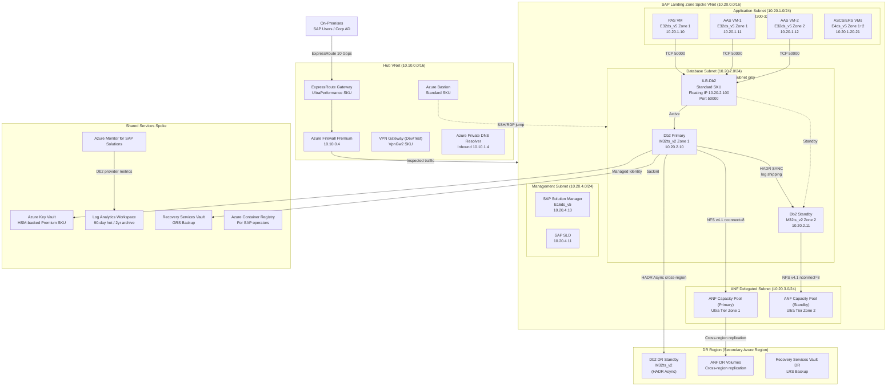
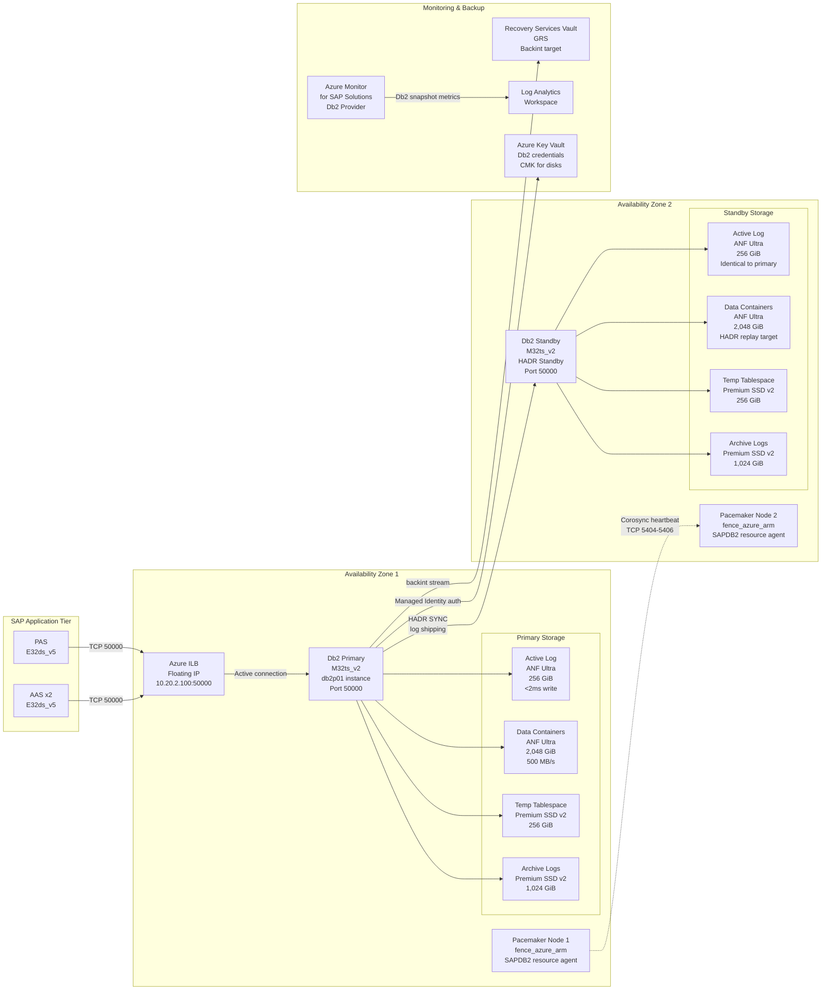

# SAP on IBM Db2 on Azure Architecture

---

## Overview

IBM Db2 for Linux, UNIX, and Windows (LUW) remains a supported and actively deployed relational database management system for SAP workloads in enterprises that have standardized on Db2 as their corporate database platform, particularly organizations migrating existing SAP ECC, SAP BW, or SAP S/4HANA landscapes from on-premises IBM Power or x86 infrastructure to Azure without a simultaneous database migration project. Db2 LUW serves as the persistence layer beneath SAP NetWeaver ABAP stacks, including SAP S/4HANA (with restrictions), SAP Business Warehouse (BW), SAP ECC 6.0, SAP Solution Manager, SAP PI/PO, and SAP GRC. The SAP kernel communicates with Db2 through the SAP Database Interface (DBIF) layer, which abstracts the SQL dialect differences between supported RDBMS platforms. SAP workloads on Db2 use the SAP-specific Db2 installation profile that disables features unsupported by SAP and enables parameters required for SAP workload characteristics including large sequential scans for BW aggregation, high-concurrency OLTP for ECC dialog work processes, and row-level locking semantics matching SAP's lock management model.

Azure provides certified infrastructure for SAP on Db2 LUW deployments through the SAP-certified VM families listed in SAP Note 1928533. Unlike SAP HANA, which requires specific hardware certification from SAP directly, Db2 LUW runs on any SAP-certified Azure VM that meets the OS, CPU, and memory requirements defined in SAP Note 1928533 for that SAP product version. Microsoft and IBM jointly support Db2 LUW on Azure through the standard SAP support model: SAP supports the SAP application layer, IBM supports the Db2 engine, and Microsoft supports the Azure infrastructure. The combination is supported under SAP OSS incident handling through the SAP-IBM-Microsoft tripartite support agreement documented in SAP Note 2233552. Azure deployment considerations include storage latency requirements for Db2 log write performance (target under 2 ms for synchronous log writes), network throughput requirements for Db2 High Availability Disaster Recovery (HADR) log shipping, and VM sizing to accommodate Db2 buffer pool memory alongside SAP work process memory requirements.

The primary architectural decisions for SAP on Db2 on Azure are: VM family selection between Edsv5 (memory-optimized, cost-efficient for smaller systems) and Mv2 (very large memory for BW landscapes exceeding 4 TiB database size), storage architecture using Azure NetApp Files or Premium SSD v2 for Db2 data and log volumes, High Availability using Db2 HADR with Pacemaker cluster and Azure Fence Agent for automated failover, Disaster Recovery using HADR in a peer-to-peer configuration across Azure regions, and OS selection between Red Hat Enterprise Linux (RHEL) for SAP and SUSE Linux Enterprise Server for SAP (SLES for SAP). Each of these decisions carries enterprise-wide impact: the VM family determines the Reserved Instance commitment cost over a 3-year term; the storage architecture determines the achievable IOPS ceiling and log write latency; the HA method determines the RTO during an unplanned failover; and the OS selection determines the Pacemaker version, fence agent version, and IBM Db2 support matrix applicability.

---

## Architecture Overview

SAP on Db2 on Azure follows the SAP Landing Zone architecture pattern defined in the SAP on Azure Landing Zone Accelerator, with the Db2 database tier deployed in the SAP DB subnet within the SAP Landing Zone spoke VNet, peered to the hub VNet for centralized egress and DNS resolution. The database tier is separated from the SAP application tier at the subnet level with Network Security Group rules permitting only the required Db2 port (default 50000 for instance 00, configurable) from the application subnet to the database subnet. This network isolation prevents lateral movement in the event of an application server compromise and satisfies the SAP security hardening requirements in SAP Note 1680803.

The Db2 HADR primary and standby nodes are deployed in separate Azure Availability Zones within the same Azure region. Zone separation ensures that a single datacenter-level failure does not simultaneously impact both Db2 nodes. The HADR log shipping stream traverses the Azure intra-region backbone between Availability Zones with a typical inter-zone round-trip latency of 1-2 ms, which is within the acceptable range for HADR SYNC mode on Db2 with SAP workloads generating moderate redo log volumes (typically 10-50 MB/s for ECC production systems). An Azure Internal Load Balancer (Standard SKU) with floating IP enabled fronts the Db2 cluster virtual hostname, directing SAP application server connections to the active Db2 node. Pacemaker with the fence_azure_arm STONITH agent provides automated cluster management and fencing, ensuring that split-brain scenarios result in the isolation of the failed node rather than data corruption.

Storage for the Db2 primary node uses Azure NetApp Files (ANF) with NFS v4.1 for the Db2 data containers and log directory when sub-millisecond latency and high throughput are required (BW workloads, large ECC systems), or Premium SSD v2 managed disks for smaller ECC and non-production systems. The ANF volumes are provisioned in the same Availability Zone as the primary Db2 node to avoid cross-zone storage latency. For the HADR standby node, a separate set of ANF volumes (or Premium SSD v2 disks) is provisioned in the standby zone, sized identically to the primary, because Db2 HADR maintains a full copy of the database on the standby.

Monitoring and operations are delivered through Azure Monitor for SAP Solutions (AMS), with the Db2 provider configured to collect Db2 snapshot metrics at 60-second intervals and publish them to a Log Analytics workspace. Azure Backup with the Db2 backint agent provides policy-driven database backups to a Recovery Services Vault with geo-redundant storage, enabling cross-region restore for disaster recovery. The SAP System Landscape Directory (SLD) and SAP Solution Manager (SolMan) connect to the Db2 instances through the SAP DB subnet for system monitoring, change management, and SAP Early Watch Alert reporting.

### Architecture Diagram: SAP on Db2 on Azure — Full Topology



---

## SAP Architecture

### SAP Component Topology on Db2

SAP workloads on Db2 LUW follow the standard SAP three-tier architecture: SAP application servers (PAS and AAS) in the application tier communicate with the Db2 database instance through the SAP DBI (Database Interface) layer using JDBC/ODBC-equivalent native Db2 client libraries embedded in the SAP kernel. The SAP Central Services instance (ASCS for ABAP, or SCS for Java stacks) runs on a separate VM pair with Pacemaker HA and does not connect directly to Db2 — the ASCS manages SAP message server and enqueue server functions only. The SAP Global File System (/sapmnt) is mounted from a highly available NFS share (Azure NetApp Files or NFS cluster) on all application servers and the ASCS. The Db2 database instance runs under a dedicated OS user (db2\<SID\>) and the SAP system user (adm\<SID\>) connects to Db2 using the SAPR3 or SAP\<SID\> database user with the permissions required by SAP (defined in SAP Note 1928533 and Db2-specific SAP Notes).

The Db2 instance name matches the SAP System ID (SID) by convention. For a SAP system with SID "P01", the Db2 instance owner is "db2p01" and the database name is "P01". The Db2 database port defaults to 50000 for instance 00, calculated as 50000 + (instance number × 100). Multiple SAP systems sharing the same Db2 host (non-production environments) use different instance numbers and therefore different ports: P01 on port 50000, Q01 on port 50100, D01 on port 50200. Each SAP SID has its own Db2 database (not a shared database with schema separation), which is the SAP-supported architecture and simplifies backup, restore, and transport operations.

### Supported SAP Workloads

| SAP Workload | Db2 Support Status | Minimum Db2 Version | Notes |
|---|---|---|---|
| SAP ECC 6.0 (any EHP) | Fully supported | Db2 11.1 FP5 or 11.5 | Mainstream maintenance ends 2027; Db2 supported for migration path |
| SAP S/4HANA 1809-2022 | Supported with restrictions | Db2 11.5 FP5 | SAP Note 2267798 — S/4HANA on non-HANA DB is "any DB" mode with functional restrictions |
| SAP S/4HANA 2023+ | Not recommended | Db2 11.5 FP7+ | SAP's strategic direction is SAP HANA; new S/4HANA features may require HANA |
| SAP BW 7.4/7.5 | Fully supported | Db2 11.1 FP5 | BW on Db2 with row/column store mixing; BW/4HANA requires HANA only |
| SAP Solution Manager 7.2 | Fully supported | Db2 11.1 FP5 | SolMan on Db2 is common in IBM-standardized shops |
| SAP PI/PO 7.5 | Fully supported | Db2 11.1 FP5 | Java stack + ABAP dual-stack on Db2 supported |
| SAP GRC 12.0 | Fully supported | Db2 11.1 FP5 | GRC on Db2 inherits NetWeaver ABAP Db2 support |
| SAP NetWeaver 7.52 ABAP | Fully supported | Db2 11.1 FP5 | All SAP NW 7.5x ABAP products on Db2 |

### Db2 Version Support Matrix

| Db2 Version | IBM End of Support | SAP Support via SAP Note 1612105 | Recommended for New Deployments |
|---|---|---|---|
| Db2 10.5 FP11 | Ended April 2023 | SAP ECC only (legacy) | No — upgrade required |
| Db2 11.1 FP5+ | April 2024 (extended support available) | SAP ECC, BW, SolMan | No — migrate to 11.5 |
| Db2 11.5 FP0-FP3 | Active, standard support | SAP ECC, S/4HANA (restricted), BW | No — use FP7+ |
| Db2 11.5 FP7+ | Active, through 2025+ | All SAP NW ABAP workloads | Yes — current recommended baseline |
| Db2 12.1 (preview as of 2024) | Future — check IBM lifecycle | Check SAP Note 1612105 for updates | Evaluate only |

### SAP Sizing Methodology for Db2

SAP Quick Sizer generates the SAPS (SAP Application Performance Standard) requirement and the database size estimate. For Db2, the database server VM sizing follows these rules:

1. **CPU sizing**: Db2 SQL execution is CPU-bound for OLTP dialog steps. The Db2 server requires sufficient vCPUs to handle peak concurrent SQL statements from all SAP work processes. A rule of thumb is 1 vCPU per 2 SAP dialog work processes connecting to Db2, plus 4 vCPUs for Db2 background tasks (log archival, reorg, runstats, prefetch). Minimum 8 vCPUs for any production Db2 instance.

2. **Memory sizing**: Db2 buffer pools must cache the hot working set of the database. SAP recommends a buffer pool hit ratio above 99% for OLTP workloads. Initial buffer pool sizing: 25-40% of total database size for ECC OLTP, 15-25% for BW (sequential scan-dominated, lower cache benefit). Total VM RAM = Db2 buffer pools + Db2 internal memory (catalog cache, lock list, sort heap, utility heap) + OS kernel and filesystem cache + 10% headroom. For a 500 GiB ECC database, a minimum of 256 GiB VM RAM is required for adequate buffer pool sizing.

3. **Database growth projection**: Apply a 3-year growth factor of 20-30% annual growth for ECC transactional databases and 40-60% for BW data warehouse databases when sizing storage. Initial storage allocation = current database size × (1 + annual growth rate) ^ 3.

4. **HADR standby sizing**: The HADR standby VM must be identical in CPU, RAM, and storage to the primary. Underpowered standby nodes cause HADR log replay lag, which increases the RPO and can trigger HADR disconnect under high log generation rates.

### SAP Transport Landscape

The SAP transport landscape (DEV → QAS → PRD) maps to separate SAP system instances, each with its own Db2 database. The transport directory (/usr/sap/trans) is shared across all systems in the landscape via NFS (Azure NetApp Files Standard tier volume), mounted on all SAP application servers and Db2 database hosts. The Db2 database for each system (DEV, QAS, PRD) resides on a separate Azure VM in the appropriate environment subscription (Dev/Test subscription for DEV/QAS, Production subscription for PRD), separated per SAP Landing Zone subscription design. Transport imports into the Db2-backed PRD system require the Db2 LOAD utility to be available (for SAP table-level transports using the TRBAT/TRJOB mechanism) and the Db2 export tablespace free space to be sufficient for ABAP dictionary activations.

### Backup Integration with SAP

SAP Backup Interface (Backint) for Db2 is implemented through the IBM Tivoli Storage Manager (IBM Spectrum Protect) client or through third-party backint agents. On Azure, the recommended approach is the Azure Backup for SAP Db2 solution using the SAP BRBACKUP/BRARCHIVE utilities with the Db2 backup API. The backup flow is:

1. SAP BRBACKUP initiates Db2 online backup using `db2 backup db <SID> online to <target>`.
2. The Db2 backup stream is directed to the Azure Backup agent or to Azure Blob Storage via the `DB2_BACKUP_TO_S3` compatible parameter with the Azure Blob Storage S3-compatible API.
3. Db2 archive logs are continuously archived by BRARCHIVE to Azure Blob Storage or Recovery Services Vault.
4. Backup metadata is maintained in the Db2 recovery history file and in SAP BRBACKUP log tables (SDBAH, SDBAD) in the SAP database.

SAP Note 2818765 documents the Azure Backup integration for SAP on Db2 and defines the supported backup target types.

### SAP Notes Reference (SAP Architecture Section)

| SAP Note | Title | Architecture Impact | Where Applied |
|---|---|---|---|
| 1928533 | SAP Applications on Microsoft Azure: Supported Products and Azure VM Types | Defines supported Azure VM SKUs for Db2 database hosts; mandates Accelerated Networking | VM selection for Db2 hosts |
| 1612105 | DB6: FAQ - IBM Db2 for Linux, UNIX, and Windows | Defines supported Db2 versions for SAP products; version compatibility matrix | Db2 version selection |
| 2233552 | Microsoft Azure: Support for IBM Db2 | Tripartite support agreement scope; Azure-specific Db2 limitations | Support model and incident routing |
| 2000002 | FAQ: SAP HANA | Contrasts HANA-required workloads vs Db2-compatible workloads | Workload placement decisions |
| 1763512 | Support details for Db2 with SAP on Linux | Linux OS-specific Db2 configuration requirements for SAP | OS configuration baseline |
| 2267798 | SAP S/4HANA: Database on Azure | S/4HANA on non-HANA databases on Azure — restrictions and support matrix | S/4HANA on Db2 deployment decisions |
| 1680803 | SAP Systems on Microsoft Azure: Security Guidelines | Network isolation requirements for Db2 subnet; OS hardening baseline | NSG design, OS hardening |
| 2818765 | Azure Backup for SAP on IBM Db2 | Backup integration architecture and supported backup targets | Backup solution design |
| 405827 | Recommended settings for DB6 (IBM DB2 UDB) | Db2 configuration parameters required and recommended by SAP | Db2 parameter tuning |
| 1901383 | IBM Db2 High Availability and Disaster Recovery on Azure | HADR configuration specifics for Azure deployment | HA/DR architecture |

---

## Azure Architecture

### Certified VM Families for Db2 Database Hosts

SAP-certified VM families for Db2 database hosts on Azure follow SAP Note 1928533. The database host VM sizing is driven by Db2 buffer pool memory requirements plus SAP work process memory (for systems where Db2 and SAP application tier are co-located — not recommended for production).

| VM SKU | vCPUs | RAM (GiB) | Max Uncached Disk IOPS | Max Network Throughput | Recommended Use Case |
|---|---|---|---|---|---|
| E16ds_v5 | 16 | 128 | 51,200 | 12,500 Mbps | Db2 DEV/QAS (database up to 200 GiB) |
| E32ds_v5 | 32 | 256 | 76,800 | 16,000 Mbps | Db2 production small ECC (database up to 500 GiB) |
| E64ds_v5 | 64 | 512 | 80,000 | 16,000 Mbps | Db2 production medium ECC (database up to 1.5 TiB) |
| E96ds_v5 | 96 | 672 | 80,000 | 25,000 Mbps | Db2 production large ECC or BW (database up to 2 TiB) |
| M32ts_v2 | 32 | 192 | 80,000 | 16,000 Mbps | Db2 production with memory-intensive buffer pools (192 GiB all to buffer pools) |
| M64s_v2 | 64 | 1,024 | 160,000 | 16,000 Mbps | Db2 BW production (database up to 3 TiB, large buffer pools) |
| M128s_v2 | 128 | 2,048 | 200,000 | 25,000 Mbps | Db2 BW production very large (database 3-6 TiB) |

All production Db2 VMs require:
- **Accelerated Networking** enabled on all NICs (SAP Note 1928533 mandatory requirement)
- **Write Accelerator** enabled on Db2 log disk if using Premium SSD (not required with ANF)
- **Proximity Placement Group** anchored to the HANA/Db2 VM for single-zone deployments; for cross-zone HA deployments, do not use PPG as it forces same-zone placement

### Storage Configuration

#### Volume Layout for Db2 Production Primary Node

| Volume / Mount Point | Storage Type | Recommended Size | IOPS | Throughput | Notes |
|---|---|---|---|---|---|
| OS disk (/) | Premium SSD v2 | 128 GiB | 3,000 | 125 MB/s | Separate from data |
| /db2/\<SID\>/db2dump | Premium SSD v2 | 100 GiB | 1,000 | 125 MB/s | Db2 diagnostic logs |
| /db2/\<SID\>/log_dir (active logs) | ANF Ultra or Premium SSD v2 | 256 GiB | 50,000 | 400 MB/s | Log write latency critical: <2 ms |
| /db2/\<SID\>/log_archive | Premium SSD v2 or Azure Blob | 1,024 GiB | 5,000 | 250 MB/s | Archive logs; tier to cool after 7 days |
| /db2/\<SID\>/sapdata1..N | ANF Ultra or Premium SSD v2 | Database size × 1.3 | 80,000+ | 500 MB/s | Db2 data containers; stripe across volumes |
| /db2/\<SID\>/saptmp | Premium SSD v2 | 256 GiB | 10,000 | 250 MB/s | Db2 temp tablespace containers |
| /sapmnt/\<SID\> | ANF Standard NFS v4.1 | 512 GiB | Shared | Shared | SAP global file system |
| /usr/sap/trans | ANF Standard NFS v4.1 | 1,024 GiB | Shared | Shared | SAP transport directory |

#### IOPS and Throughput Requirements

Db2 active log write performance is the most latency-sensitive I/O operation. SAP recommends that the Db2 active log directory deliver write latency below 2 ms at the 99th percentile. Premium SSD v2 with Write Accelerator enabled achieves sub-1 ms write latency for log volumes. Azure NetApp Files Ultra tier achieves sub-0.5 ms latency for sequential log writes with NFS v4.1.

For Db2 data containers (tablespaces), the throughput requirement scales with the prefetch size and the number of concurrent queries performing tablespace scans. A Db2 BW system executing large aggregation queries requires 500-800 MB/s sustained read throughput. Azure NetApp Files Ultra tier provisioned at 4 TiB delivers 512 MiB/s (128 MiB/s per TiB × 4 TiB), meeting the BW read throughput requirement.

### Networking Requirements

- **Intra-zone latency (application to Db2)**: Target below 1 ms round-trip for SAP dialog steps. Achieved with Proximity Placement Group (PPG) anchoring application servers and Db2 host in the same physical cluster within a zone.
- **Inter-zone latency (HADR primary to standby)**: Typically 1-2 ms round-trip within an Azure region across Availability Zones. Sufficient for HADR SYNC mode with ECC workloads generating up to 50 MB/s log throughput.
- **Accelerated Networking**: Mandatory on all Db2 host NICs. Bypasses the Azure virtual switch hypervisor layer using SR-IOV, reducing NIC latency from ~150 µs to ~25 µs.
- **HADR network bandwidth**: Size the NIC throughput to accommodate HADR log shipping plus backup streaming simultaneously. For an ECC system generating 20 MB/s of redo logs with concurrent BRBACKUP streaming at 200 MB/s, minimum NIC throughput is 3 Gbps dedicated to Db2 operations.

### Azure NetApp Files Configuration for Db2

Azure NetApp Files (ANF) is used for Db2 data and log volumes when the database requires more than 80,000 IOPS or when the Db2 active log volume requires guaranteed sub-2 ms write latency at scale. ANF Ultra tier is provisioned in a delegated subnet (Microsoft.NetApp/volumes delegation) within the SAP Landing Zone spoke VNet.

Configuration parameters for Db2 on ANF:
- **NFS version**: NFSv4.1 (required for file locking semantics compatible with Db2)
- **Mount option nconnect**: Set to 8 for parallel TCP connections; increases throughput from a single Db2 process accessing the volume
- **Mount option rsize/wsize**: 262144 (256 KiB) matching Db2's default I/O request size for large sequential operations
- **Mount option hard,intr**: Ensures Db2 I/O does not silently discard writes on ANF connectivity interruption
- **Capacity pool type**: Ultra (for data and log), Standard (for /sapmnt and /usr/sap/trans)
- **Volume replication**: ANF Cross-Region Replication enabled for DR data volumes

### Azure Backup Integration

Azure Backup for Db2 uses the Recovery Services Vault with a backup policy targeting daily full backups and hourly log backups. The Db2 backint-compatible agent (IBM-provided or Azure-native) streams Db2 backup images to the Recovery Services Vault through an Azure Private Endpoint, ensuring backup traffic does not traverse the public internet or the Azure Firewall. The Recovery Services Vault is configured with Geo-Redundant Storage (GRS) replication to enable cross-region restore to the DR region.

### VM Extensions Required

| Extension | Purpose | Applicability |
|---|---|---|
| AzureMonitorLinuxAgent (version 1.27+) | Azure Monitor data collection; replaces MMA/OMS agent | All Db2 and application VMs |
| MicrosoftMonitoringAgent (legacy, if SolMan integration requires OMS) | Log Analytics agent for legacy SolMan monitoring | Only if SolMan OMS integration required |
| AADSSHLoginForLinux | Entra ID-based SSH authentication for Db2 hosts | All Db2 VMs in managed environments |
| CustomScript (one-time) | OS tuning scripts at VM deployment (hugepages, kernel params) | Deployment automation only |
| AzureDiskEncryption (if CMK on managed disks) | Customer-managed key encryption for Premium SSD v2 volumes | Db2 VMs using managed disks |

### OS Configuration Requirements

Both RHEL for SAP and SLES for SAP are supported OS platforms for Db2 on Azure. The OS must be from the SAP-certified image gallery (Azure Marketplace publisher: `RedHat` for RHEL-SAP-HA, `SUSE` for sles-sap):

- **RHEL for SAP**: RHEL 8.6 or 9.2 for SAP (includes RHEL High Availability Add-On for Pacemaker)
- **SLES for SAP**: SLES 15 SP4 or SP5 for SAP (includes HA Extension with Pacemaker)

### Second Architecture Diagram: Db2 Database Tier Detail



---

## Database Configuration

### Db2 Instance and Database Parameters for Azure

The following Db2 configuration parameters must be set for SAP workloads on Azure, based on SAP Note 405827 and IBM Db2 11.5 best practices for virtualized environments:

**Db2 Instance-Level Parameters (`db2 update dbm cfg`):**

| Parameter | Recommended Value | Justification |
|---|---|---|
| INTRA_PARALLEL | YES | Enable intra-partition parallelism for BW queries; set to NO for pure OLTP ECC |
| MAX_QUERYDEGREE | 8 (BW) / 1 (ECC) | Limit query parallelism to prevent single-query CPU monopolization |
| SVCENAME | db2p01 (mapped to port 50000) | SAP-required naming convention; port in /etc/services |
| DB2COMM | TCPIP | SAP requires TCP/IP connectivity; named pipe not used on Linux |
| FENCED_POOL | 0 | Disable fenced UDF pool; SAP does not use fenced UDFs |
| KEEPDARI | NO | Do not keep DARI processes; reduces memory overhead |
| ASLHEAPSZ | 15 | Application shared memory heap; increase to 25 for large SAP systems |
| SHEAPTHRES | 250000 | Sort heap threshold; prevent sort spills for complex SAP queries |
| AUDIT_BUF_SZ | 4096 | Audit buffer for Db2 audit facility; required for security audit logging |

**Db2 Database-Level Parameters (`db2 update db cfg for <SID>`):**

| Parameter | Recommended Value | Justification |
|---|---|---|
| LOGPRIMARY | 100 | Number of primary log files; size = LOGPRIMARY × LOGFILSIZ × 4 KiB |
| LOGSECOND | 100 | Secondary log files; allow log growth during large batch jobs |
| LOGFILSIZ | 65536 | 256 MiB log files (65536 × 4 KiB); matches SAP recommendation |
| LOGBUFSZ | 4096 | Log buffer; 16 MiB buffer reduces log write I/O frequency |
| LOCKLIST | AUTOMATIC | Dynamic lock list; prevents lock escalations during SAP batch processing |
| MAXLOCKS | 80 | Maximum percentage of lock list per application; increase if lock escalation observed |
| BUFFPAGE | — | Do not set; use named buffer pools per tablespace instead |
| STMTHEAP | AUTOMATIC | Statement heap; AUTOMATIC avoids fixed limit on complex SAP queries |
| APPLHEAPSZ | AUTOMATIC | Application heap; AUTOMATIC for SAP workloads |
| PCKCACHESZ | AUTOMATIC | Package cache; AUTOMATIC; size to 5% of IBMDEFAULTBP buffer pool |
| CATALOGCACHE_SZ | AUTOMATIC | Catalog cache; AUTOMATIC prevents catalog scan overhead |
| HADR_LOCAL_HOST | <primary IP> | HADR local host IP (use Azure NIC private IP) |
| HADR_LOCAL_SVC | 60005 | HADR local service port (not same as Db2 client port 50000) |
| HADR_REMOTE_HOST | <standby IP> | HADR remote host IP |
| HADR_REMOTE_SVC | 60005 | HADR remote service port |
| HADR_SYNCMODE | SYNC | Synchronous HADR for zero data loss in the same Azure region |
| HADR_PEER_WINDOW | 120 | HADR peer window in seconds; allow 2-minute log replay lag before HADR disconnect |
| AUTO_RUNSTATS | ON | Automatic statistics collection; required for SAP query optimizer |
| AUTO_REORG | OFF | Disable automatic online reorganization; use SAP BRSPACE for scheduled reorg |
| LOGARCHMETH1 | DISK:<archive_path> | Primary log archive method; archive to dedicated volume |
| LOGARCHMETH2 | TSM (or VENDOR=<backint>) | Secondary log archive to Azure Backup via backint agent |
| TRACKMOD | YES | Track modified pages; required for incremental backup support |
| NEWLOGPATH | /db2/<SID>/log_dir | Move active log to dedicated high-performance volume |
| DBPATH | /db2/<SID> | Db2 database path; not on OS disk |

### Buffer Pool Configuration

SAP requires specific buffer pool configuration per tablespace type. Do not rely on the IBMDEFAULTBP (4 KiB page size) buffer pool for all tablespace activity:

| Buffer Pool Name | Page Size | Initial Size (ECC 500 GiB DB) | Initial Size (BW 2 TiB DB) | Tablespace Assigned |
|---|---|---|---|---|
| IBMDEFAULTBP | 4 KiB | 50,000 pages (200 MiB) | 100,000 pages (400 MiB) | System catalog tablespace |
| BP8K | 8 KiB | 500,000 pages (4 GiB) | 2,000,000 pages (16 GiB) | PSAPBTABD, PSAPBTABI |
| BP16K | 16 KiB | 1,000,000 pages (16 GiB) | 5,000,000 pages (80 GiB) | PSAPEL30D (BW fact tables) |
| BP32K | 32 KiB | 200,000 pages (6 GiB) | 1,000,000 pages (32 GiB) | PSAPTEMP32 (sort/temp) |

The combined buffer pool memory must fit within the VM RAM minus OS overhead (8-16 GiB for OS kernel and filesystem cache) and minus Db2 engine overhead (approximately 2 GiB base). For an E64ds_v5 with 512 GiB RAM: OS = 16 GiB, Db2 engine = 2 GiB, available for buffer pools = 494 GiB. Allocate 80% of available memory (395 GiB) to buffer pools, retaining 20% for sort heaps, lock list, and OS filesystem cache.

### OS-Level Configuration (Linux)

The following kernel and OS settings are required on RHEL/SLES for SAP nodes running Db2 LUW:

**`/etc/sysctl.conf` additions (applied via `sysctl -p`):**

```ini
kernel.msgmni = 1024
kernel.sem = 250 256000 32 1024
kernel.shmmax = 549755813888
kernel.shmall = 134217728
kernel.shmmni = 4096
vm.swappiness = 10
net.core.rmem_max = 16777216
net.core.wmem_max = 16777216
net.ipv4.tcp_rmem = 4096 87380 16777216
net.ipv4.tcp_wmem = 4096 65536 16777216
net.ipv4.tcp_timestamps = 1
net.ipv4.tcp_sack = 1
```

**Huge Pages**: Configure transparent hugepages to `madvise` for Db2 buffer pools (Db2 11.5 uses `madvise` MADV_HUGEPAGE internally for buffer pool allocation). Do not set to `always` as it causes latency spikes during hugepage allocation. Set in `/etc/rc.local`:

```bash
echo madvise > /sys/kernel/mm/transparent_hugepage/enabled
echo defer+madvise > /sys/kernel/mm/transparent_hugepage/defrag
```

**Swap**: Configure swap space of minimum 20 GiB on a dedicated Premium SSD v2 volume. Do not use no-swap configuration with Db2 — unlike SAP HANA, Db2 does not prohibit swap, and out-of-memory kills of Db2 processes cause database crash without clean shutdown.

**Filesystem**: Use XFS for all Db2 data and log volumes mounted from block devices. Mount options for XFS on Db2 data volumes: `noatime,nodiratime,nobarrier` (nobarrier valid for non-battery-backed storage where write ordering is enforced at storage layer — ANF and Premium SSD v2 with Write Accelerator).

**Limits (`/etc/security/limits.conf` for db2<SID> user):**

```ini
db2p01  soft  nofile  65536
db2p01  hard  nofile  65536
db2p01  soft  nproc   16384
db2p01  hard  nproc   16384
db2p01  soft  memlock unlimited
db2p01  hard  memlock unlimited
```

### Network Configuration for HADR

Db2 HADR uses a dedicated TCP connection between the HADR_LOCAL_HOST and HADR_REMOTE_HOST. On Azure, this maps to the private IP of each Db2 VM NIC. Configure the HADR parameters to use the primary NIC IP (not the virtual IP managed by the Azure ILB). The Azure ILB floating IP is only for client connections from SAP application servers.

HADR heartbeat monitoring uses the HADR_PEER_WINDOW parameter (120 seconds recommended for Azure inter-zone deployments). If the standby does not acknowledge log records within this window, the primary transitions out of HADR PEER state. Setting this value too low (below 30 seconds) can cause false HADR disconnections during Azure maintenance events.

### Licensing Considerations on Azure

Db2 on Azure is licensed under the IBM IPLA license. Two licensing models apply:

1. **IBM Db2 Standard Edition (SE)**: Per-core licensing with a 2-core minimum. On Azure VMs, all vCPUs count as cores for IBM licensing. An M32ts_v2 with 32 vCPUs requires 32 Db2 SE core licenses (or equivalent PVU calculation).

2. **IBM Db2 Advanced Edition (AE)**: Required for Advanced Copy Services (ACS) used with storage-level snapshot backups, and for Oracle Compatibility features. For SAP-only deployments, Db2 SE is sufficient.

Azure Hybrid Benefit does not apply to IBM Db2 licenses — it applies only to Microsoft SQL Server and Windows Server licenses. IBM provides the BYOL model for Azure deployments; licenses must be acquired through IBM or an IBM Business Partner separately from Azure infrastructure costs.

---

## High Availability Architecture

### Db2 HADR Overview

IBM Db2 High Availability Disaster Recovery (HADR) is the native database-level replication technology for Db2 HA on Azure. HADR operates as a primary-standby configuration: the primary Db2 node processes all read and write transactions, continuously ships transaction log records to the standby node, which replays them to maintain a transactionally consistent copy of the database. On Azure, HADR is deployed with HADR_SYNCMODE = SYNC for zero data loss within an Azure region (two Availability Zones).

HADR synchronous mode operation: the primary Db2 node writes a transaction log record to the local log buffer, ships it to the standby over the HADR TCP connection, waits for the standby to acknowledge receipt and replay (with `SYNCMODE = SYNC`, acknowledgement is after replay), then returns commit confirmation to the SAP application. This adds the round-trip HADR latency (inter-zone ~2 ms) to every Db2 commit operation. For SAP OLTP workloads with commit-heavy dialog steps, this latency impact is measurable. SAP Note 1901383 documents the acceptable HADR latency thresholds: up to 3 ms additional commit latency is acceptable for SAP ECC; BW batch operations are less sensitive to per-commit latency.

### Pacemaker Cluster Configuration

Pacemaker manages the Db2 HADR cluster on Azure using the following resource agents:
- **fence_azure_arm**: STONITH fencing agent that calls the Azure Resource Manager API to power off a fenced node. Requires a Managed Identity (User-assigned or System-assigned) on each cluster node with `Microsoft.Compute/virtualMachines/powerOff/action` permission.
- **SAPDatabase resource agent (db2 variant)**: Pacemaker resource agent that starts, stops, and monitors the Db2 instance and manages HADR takeover via `db2 takeover hadr on db <SID>`.
- **IPaddr2 resource agent**: Manages the virtual IP (floating IP) that matches the Azure ILB backend pool IP configuration.

Pacemaker cluster topology for Db2 HADR on Azure:

```
Two-node cluster:
  Node 1: db2p01-vm1 (Zone 1, Db2 primary)
  Node 2: db2p01-vm2 (Zone 2, Db2 standby)
  STONITH: fence_azure_arm (Azure ARM fencing)
  Resources:
    rsc_Db2_P01: SAPDatabase agent, monitors Db2 instance P01
    rsc_ip_P01_db2: IPaddr2, manages virtual IP 10.20.2.100
  Constraints:
    colocation: rsc_ip_P01_db2 with rsc_Db2_P01 (INFINITY)
    order: start rsc_Db2_P01 before rsc_ip_P01_db2 (INFINITY)
```

The Azure ILB backend pool contains both Db2 VM NICs. The health probe targets port 62500 (configurable), which is responded to only by the active Db2 node using a `socat` or `nc` listener script that checks Db2 instance state. The inactive standby node does not respond to the health probe, causing the ILB to route all traffic to the active primary.

### Azure Load Balancer Configuration for Db2 HADR

The Azure Internal Standard Load Balancer for Db2 requires the following specific configuration (deviating from defaults will break SAP connectivity after failover):

| LB Parameter | Required Value | Reason |
|---|---|---|
| SKU | Standard | Basic SKU does not support Availability Zones |
| Session persistence | None (5-tuple hash) | SAP ABAP work processes use persistent TCP connections; session persistence is not needed as Pacemaker moves the IP |
| Floating IP (Direct Server Return) | Enabled | Required — Db2 listens on the floating IP itself, not on the load balancer frontend IP |
| Idle timeout | 30 minutes | SAP application servers hold idle database connections; below 4 minutes causes connection drops |
| Health probe port | 62500 | Custom port; not Db2 port 50000 |
| Health probe interval | 5 seconds | Detect failover within 25 seconds (5 intervals × 5 seconds) |
| HA ports rule | Enabled (port 0, protocol All) | Required for Pacemaker cluster corosync traffic on non-standard ports |

### Availability Zone Deployment for Db2 HADR

The Db2 primary node is placed in Availability Zone 1 and the standby in Availability Zone 2. Both nodes are in the same Azure region and same VNet/subnet (the DB subnet 10.20.2.0/24). Availability Zone placement is specified at VM creation time via the `--zone` parameter in Azure CLI or the `zones` property in ARM/Bicep templates; it cannot be changed after VM creation without deallocating and recreating the VM.

The storage volumes (ANF or Premium SSD v2) for each Db2 node must be in the same Availability Zone as the compute. ANF volumes with Availability Zone Volume Placement (AZVP) are pinned to the specified zone. Premium SSD v2 managed disks are zone-redundant by default in regions with ZRS support but can be pinned to a specific zone for latency consistency.

### Proximity Placement Group Considerations

Proximity Placement Groups (PPG) are NOT recommended for cross-zone Db2 HADR deployments. PPGs force all members into the same physical cluster within one zone, which is incompatible with the cross-zone HA requirement. For single-zone deployments (non-production or regions with only one Availability Zone), a PPG can be used to ensure the Db2 VM and the SAP application server VMs are in close physical proximity (sub-1 ms latency).

### Network Latency Requirements for Synchronous HADR

HADR SYNC mode adds round-trip latency to every Db2 commit. The SAP application perceives this as additional response time on every dialog step that modifies database state. The maximum acceptable additional commit latency is 3 ms (SAP Note 1901383). Inter-zone latency within an Azure region is typically 1-2 ms, leaving 1-2 ms budget for Db2 log write I/O on the standby. This budget is met by ANF Ultra tier (sub-0.5 ms write latency) or Premium SSD v2 with Write Accelerator.

---

## Disaster Recovery Architecture

### Cross-Region DR with Db2 HADR

Disaster Recovery for SAP on Db2 on Azure uses a second HADR standby configured in HADR asynchronous mode (`HADR_SYNCMODE = ASYNC` or `SUPERASYNC`) in the DR Azure region. Db2 supports up to three HADR standbys in a principal standby configuration: the primary ships logs synchronously to the local HA standby (Zone 2 in the primary region), and asynchronously to the DR standby (DR region). This is the Db2 HADR Multi-Target configuration (available in Db2 11.1 FP5+).

HADR Multi-Target DR topology:
```
Primary (Region A, Zone 1) — SYNC —> HA Standby (Region A, Zone 2)
Primary (Region A, Zone 1) — ASYNC —> DR Standby (Region B, Zone 1)
```

After an HA failover to the Zone 2 standby, the new primary (formerly HA standby) must establish an HADR connection to the DR standby. This requires updating the HADR_REMOTE_HOST on the DR standby to point to the new primary's IP. Automation of this repointing is handled by the Pacemaker post-failover hook script or by Azure Automation runbook triggered by the Pacemaker state change event in Azure Monitor.

### Azure Site Recovery Exclusion Rationale

Azure Site Recovery (ASR) is NOT used for Db2 database replication. ASR replicates at the disk block level and does not understand Db2 database consistency. Failing over an ASR-replicated Db2 disk image without a clean database shutdown results in a crash-recovery scenario that may require Db2 rollforward from the last committed log record. This is functionally equivalent to HADR ASYNC but with higher complexity and no Db2-native consistency guarantee.

ASR is used for the SAP application servers (PAS, AAS, ASCS) in the DR region, as these are stateless (no persistent data beyond the shared /sapmnt NFS, which is replicated by ANF Cross-Region Replication).

### DR Network Connectivity

The DR region requires:
- **Azure VNet** peered to the primary region hub (or connected via Azure Virtual WAN) with BGP route propagation
- **ExpressRoute Global Reach** for on-premises-to-DR connectivity (bypasses internet for DR activation traffic)
- **Private DNS Zone** replication or secondary zones for Db2 virtual hostname resolution in the DR region
- **Azure Internal Load Balancer** pre-provisioned in the DR region but with zero backend pool members until DR activation

HADR ASYNC TCP connection between the primary region and DR region traverses the Azure backbone (Microsoft global network) if both regions are connected via ExpressRoute with Private Peering or VNet peering. HADR ASYNC log shipping bandwidth requirement: equal to the average Db2 redo log generation rate (10-50 MB/s for ECC, 20-80 MB/s for BW). The ExpressRoute circuit to the DR region must have sufficient bandwidth headroom for HADR replication plus DR activation data transfer.

### DR VM Sizing

The DR Db2 standby VM should be the same SKU as the production primary to ensure the DR instance can sustain production workload after failover. Sizing the DR VM smaller risks HADR replay lag (insufficient CPU/memory for log apply), which increases effective RPO. In cost-optimized DR designs, the DR VM can be deallocated when not needed and brought online only during DR drills or actual DR events — this requires Db2 HADR to re-establish the connection after a log gap, which Db2 handles by fetching archive logs from the primary's LOGARCHMETH2 target (Azure Blob Storage).

### DR Runbook Outline

1. **Pre-DR activation checklist**: Verify HADR async lag is below RPO threshold (query `db2pd -hadr -db <SID>` for LOG_GAP); confirm DR VM is running; confirm ANF CRR replication lag is below RPO.
2. **Activate DR Db2 instance**: On the DR standby VM, execute `db2 takeover hadr on db <SID> by force peer window only` (force peer window bypasses the HADR sync requirement for async standby).
3. **Start SAP application layer**: Start ASCS/ERS Pacemaker cluster in DR region; start PAS and AAS VMs in DR region.
4. **Update DNS**: Update the Private DNS Zone A record for the Db2 virtual hostname to point to the DR region ILB floating IP (10.DR.2.100).
5. **Validate SAP connectivity**: Log into the SAP system in DR region and execute `SM50` work process overview; verify all work processes are in "waiting" state (not "stopped").
6. **Notify stakeholders**: DR activation complete; publish estimated RTO achievement time.

### RTO/RPO Validation

| Metric | Target | Validation Method |
|---|---|---|
| RPO (HADR ASYNC) | 15 minutes | Monitor `db2pd -hadr` LOG_GAP metric in Azure Monitor; alert if >10 minutes |
| RTO (DR activation) | 4 hours | Annual DR drill with stopwatch timing from DR trigger to SAP login screen |
| HADR SYNC RPO | 0 seconds (zero data loss) | Verified by HADR SYNC mode — standby acknowledgement before commit |
| HADR SYNC RTO (HA failover) | 5 minutes | Pacemaker failover timing from node failure to ILB re-pointing |

---

## Design Decisions

| Decision | Options Considered | Choice | Rationale | SAP/Azure Reference |
|---|---|---|---|---|
| Database VM family | E-series Edsv5 vs M-series Mv2/Mdsv3 | E64ds_v5 for ECC production (up to 500 GiB DB); M64s_v2 for BW (>1 TiB DB) | E64ds_v5 delivers 512 GiB RAM at lower cost than M-series for ECC workloads where Db2 buffer pools fit within 400 GiB; M-series required only when buffer pool requirement exceeds E-series max RAM | SAP Note 1928533; Azure Db2 sizing guide |
| Storage for Db2 data/log volumes | Premium SSD v2 managed disks vs Azure NetApp Files Ultra | ANF Ultra for production (>1 TiB DB or >50,000 IOPS); Premium SSD v2 for non-production | ANF Ultra delivers guaranteed sub-0.5 ms log write latency and 128 MiB/s per TiB provisioned throughput without premium disk striping complexity; Premium SSD v2 is cost-effective for smaller databases | SAP Note 2399079; ANF SAP documentation |
| HA method | Db2 HADR with Pacemaker vs Db2 pureScale vs manual standby | Db2 HADR with Pacemaker and Azure Fence Agent | pureScale requires shared storage (not natively available on Azure without specialized setup); HADR is SAP-supported, IBM-certified, and integrates with standard Azure Pacemaker patterns | SAP Note 1901383; Azure HADR documentation |
| HADR sync mode | SYNC vs NEARSYNC vs ASYNC vs SUPERASYNC | SYNC within Azure region (HA); ASYNC cross-region (DR) | SYNC provides zero data loss for same-region HA at 2 ms commit overhead; ASYNC for DR avoids cross-region latency impacting production commit performance | SAP Note 1901383; IBM Db2 HADR documentation |
| DR approach | HADR Multi-Target vs Azure Site Recovery vs manual backup/restore | HADR Multi-Target (ASYNC) to DR region | Native Db2 replication maintains transactional consistency; ASR block replication cannot guarantee Db2 consistency; backup/restore achieves only 4-hour RPO | IBM Db2 Multi-Target HADR; SAP Note 2233552 |
| OS selection | RHEL for SAP vs SLES for SAP | RHEL for SAP 8.6/9.2 for greenfield; maintain existing OS for migrations | RHEL for SAP and SLES for SAP are both fully supported; choice driven by existing enterprise OS standard; RHEL HA Add-On and SLES HA Extension both integrate with Azure Fence Agent | SAP Note 1763512; SAP Note 1928533 |
| Backup method | BRBACKUP to ANF snapshot vs Azure Backup backint vs IBM Spectrum Protect | Azure Backup backint for production; ANF snapshots as supplemental | Azure Backup integrates natively with Recovery Services Vault for policy-driven retention and GRS replication; ANF snapshots provide fast point-in-time recovery within 15 minutes; IBM Spectrum Protect requires additional infrastructure | SAP Note 2818765 |
| Network design for Db2 tier | Shared DB subnet with all non-HANA DBs vs dedicated Db2 subnet | Dedicated DB subnet (10.20.2.0/24) per SAP SID group | NSG rule management is simpler with dedicated subnets; blast radius of misconfigured NSG rule is limited to one SID group; allows separate subnet-level network policies per environment | SAP Note 1680803; Azure Landing Zone for SAP |
| Db2 version | Db2 11.1 FP5 vs Db2 11.5 FP7 | Db2 11.5 FP7+ for all new deployments | Db2 11.5 is the IBM recommended version with full SAP support; 11.5 includes HADR Multi-Target (required for DR), improved column-organized table support for BW, and Azure-specific optimizations | SAP Note 1612105 |

---

## SAP Notes Reference

| SAP Note | Title | Architecture Impact | Where Applied |
|---|---|---|---|
| 1928533 | SAP Applications on Microsoft Azure: Supported Products and Azure VM Types | Defines all supported Azure VM SKUs for SAP on Db2; Accelerated Networking mandatory | VM selection, NIC configuration |
| 1612105 | DB6: FAQ - IBM Db2 for Linux, UNIX, and Windows | Supported Db2 versions per SAP product; Db2 parameter recommendations | Db2 version selection, parameter tuning |
| 2233552 | Microsoft Azure: Support for IBM Db2 | Azure-specific Db2 support boundaries; tripartite support agreement | Support model, escalation path |
| 1763512 | Support details for Db2 with SAP on Linux | Linux OS kernel parameters, limits, and filesystem settings for Db2 | OS configuration baseline |
| 405827 | Recommended settings for DB6 (IBM DB2 UDB) | Db2 instance and database configuration parameters for SAP | Database parameter tuning |
| 1901383 | IBM Db2 High Availability and Disaster Recovery on Azure | HADR configuration parameters; acceptable latency thresholds; Pacemaker integration | HA/DR architecture |
| 2818765 | Azure Backup for SAP on IBM Db2 | Backup integration architecture; supported backup targets; BRBACKUP configuration | Backup solution design |
| 1680803 | SAP Systems on Microsoft Azure: Security Guidelines | Network isolation requirements; OS hardening; SAP user separation | NSG design, OS hardening, security baseline |
| 2399079 | Installation of SAP HANA DB: Revision and Maintenance Strategy (reference for non-HANA comparison) | Storage throughput KPIs applicable to all SAP databases on Azure | Storage performance validation |
| 2267798 | SAP S/4HANA: Database on Azure | S/4HANA functional restrictions on non-HANA databases; supported S/4HANA versions on Db2 | S/4HANA on Db2 deployment decisions |
| 2593824 | Linux: Running SAP Applications on Microsoft Azure | RHEL and SLES-specific Azure configuration requirements; clock synchronization | OS-level Azure integration |
| 3007991 | Linux Pacemaker on Microsoft Azure | Azure Fence Agent (fence_azure_arm) configuration; Pacemaker cluster setup | Pacemaker and STONITH configuration |

---

## Azure Well-Architected Alignment

| Pillar | Requirement | Implementation | Reference |
|---|---|---|---|
| Reliability | Database HA with automatic failover; RTO < 5 minutes for planned maintenance | Db2 HADR SYNC with Pacemaker and Azure Fence Agent; cross-zone deployment Zone 1 + Zone 2; Azure ILB Standard SKU with health probes | SAP Note 1901383; Azure Well-Architected Framework Reliability pillar |
| Reliability | DR with RPO < 15 minutes; RTO < 4 hours | Db2 HADR Multi-Target ASYNC to DR region; ANF Cross-Region Replication for shared storage; pre-provisioned DR VM | Azure Business Continuity Guide for SAP |
| Reliability | Backup with 30-day retention and cross-region restore capability | Azure Backup with backint agent; Recovery Services Vault with GRS; 30-day backup policy; BRARCHIVE to Azure Blob Storage with lifecycle to cool tier after 7 days | SAP Note 2818765 |
| Security | Encryption at rest with customer-managed keys | Azure Disk Encryption with CMK stored in Azure Key Vault Premium (HSM-backed) for managed disks; ANF volumes encrypted with platform keys by default (CMK via Key Vault available for ANF) | Azure Key Vault documentation; ANF encryption documentation |
| Security | Encryption in transit for Db2 client connections | Db2 SSL/TLS configured for SAP application-to-Db2 communication; certificates stored in Azure Key Vault; Db2 `GSK_SERVER_CERT_LABEL` configured in Db2 keystore | IBM Db2 TLS configuration guide |
| Security | Network isolation for Db2 tier | Dedicated DB subnet 10.20.2.0/24 with NSG allowing only TCP 50000 from application subnet; no direct internet access from DB subnet; Azure Private Endpoints for backup and Key Vault | SAP Note 1680803; Azure NSG documentation |
| Security | Privileged access management for DBA operations | Microsoft Entra ID Privileged Identity Management (PIM) for just-in-time elevation to DBA role on Db2 VMs; Azure Bastion for SSH access without public IP exposure; all DBA actions logged to Log Analytics | Azure PIM documentation; Microsoft Entra ID |
| Cost Optimization | Right-sizing of Db2 VMs to actual workload | 3-year Reserved Instances for production Db2 primary and standby VMs (typically 35-50% cost reduction vs pay-as-you-go); Dev/Test Azure subscription pricing for DEV/QAS Db2 instances | Azure Reserved VM Instances; Azure Dev/Test pricing |
| Cost Optimization | Storage cost optimization | ANF Ultra only for production data/log volumes; Premium SSD v2 for non-production; archive logs lifecycle to Azure Blob cool tier after 7 days; Standard tier ANF for /sapmnt | Azure NetApp Files pricing; Azure Blob Storage lifecycle |
| Cost Optimization | Azure Hybrid Benefit for OS | Azure Hybrid Benefit for RHEL or SLES OS licenses from existing enterprise agreements; applies to Db2 VM OS, not Db2 database license | Azure Hybrid Benefit for Linux documentation |
| Operational Excellence | Standardized deployment via Infrastructure as Code | Bicep templates for Db2 VM, NIC, NSG, ANF volume, ILB, and Pacemaker configuration; stored in Azure DevOps repository; deployed via Azure Pipelines with approval gates for production | Azure Landing Zone for SAP IaC |
| Operational Excellence | Monitoring and alerting coverage | Azure Monitor for SAP Solutions Db2 provider; custom KQL dashboards in Log Analytics; PagerDuty or Azure Monitor action groups for P1/P2 alerts; BRSPACE scheduled job monitoring via SAP Alert Monitor (RZ20) | Azure Monitor for SAP Solutions documentation |
| Performance Efficiency | Storage I/O performance matching Db2 workload requirements | ANF Ultra tier for Db2 active log (sub-0.5 ms) and data (500 MB/s throughput); storage KPI validation against SAP Note 1943937 thresholds at deployment time and quarterly | SAP Note 1943937; ANF performance documentation |
| Performance Efficiency | Network latency within SAP-prescribed thresholds | Proximity Placement Group for single-zone deployments; Accelerated Networking on all NICs; NIPING latency testing at deployment and after any network change | SAP Note 1945823; Azure Accelerated Networking documentation |

---

## Security Architecture

### Database-Level Encryption

**Encryption at Rest**: Db2 native encryption (Db2 Advanced Encryption Feature) encrypts database data containers at the Db2 engine level using AES-256. The Db2 master key is managed by a Key Management Service (KMS). On Azure, the recommended approach is to configure Db2 to use the Azure Key Vault PKCS#11 provider for master key storage, ensuring the Db2 encryption key hierarchy is rooted in an HSM-backed Key Vault key (RSA-2048 or RSA-3072 in Azure Key Vault Premium with HSM protection).

For organizations that do not use Db2 native encryption, Azure Disk Encryption (ADE) provides encryption of the managed disk at the Azure platform level using the Azure Key Vault-backed CMK. ADE encrypts the entire disk (including OS, Db2 binaries, and data) transparently. Both approaches satisfy the requirement for encryption at rest with CMK; the Db2 native encryption approach provides column-level or tablespace-level granularity, while ADE provides full-disk encryption with no Db2 configuration overhead.

**Encryption in Transit**: Configure Db2 with SSL/TLS for all client connections. The Db2 SSL configuration uses the IBM Global Security Kit (GSKit) to create a keystore containing the Db2 server certificate. On Azure, the server certificate is issued by the enterprise Certificate Authority (CA) or by an internal CA managed in Azure Key Vault. The SAP application server's Db2 client library is configured with `DB2COMM=SSL` and the path to the client truststore containing the CA certificate. Db2 default SSL port for SAP: 50001 (instance 00 SSL port = client port + 1).

### Database User Management

SAP uses the following Db2 database users (defined in SAP installation and SAP Note 1928533):

| Db2 User | Purpose | Privilege Level | Management |
|---|---|---|---|
| SAPR3 (or SAP\<SID\>) | SAP application runtime user; all DML operations | DBADM without ACCESSCTRL/DATAACCESS (Db2 11.5 granular privilege) | Created by SAP installation; password stored in Azure Key Vault; rotated quarterly |
| db2\<SID\> | Db2 instance owner; starts/stops Db2; HADR management | SYSADM at OS level; Db2 SYSADM | Service account; no interactive login; SSH key authentication only |
| db2fenc\<SID\> | Db2 fenced process owner | Limited OS user | Created by Db2 installation; no login shell |
| DBADM_OPS | DBA operational team | DBADM without SECADM | Entra ID group mapped via Db2 LDAP group lookup; PIM-eligible |
| DBMON | Azure Monitor for SAP Solutions monitoring | SELECT on monitoring views; EXECUTE on SNAPSHOT functions | Created post-installation; read-only; password in Key Vault |

Entra ID integration for Db2 user authentication is implemented through IBM Security Access Manager or Db2 LDAP authentication configuration (`db2 update dbm cfg using SRVCON_AUTH SERVER_ENCRYPT`), allowing Entra ID user credentials to authenticate against Db2 through the LDAP bridge. This enables just-in-time DBA access without creating persistent Db2 OS-level accounts.

### Network Isolation

- **DB Subnet NSG Rules**: Inbound: allow TCP 50000 from ApplicationSubnet (10.20.1.0/24); allow TCP 50001 (SSL) from ApplicationSubnet; allow TCP 60005 (HADR) from DBSubnet (intra-subnet for HADR); allow TCP 5404-5406 (Pacemaker corosync) from DBSubnet; allow TCP 22 (SSH) from Azure Bastion subnet only. Deny all other inbound. Outbound: allow TCP 443 to Azure Key Vault private endpoint; allow TCP 443 to Azure Backup private endpoint; allow TCP 443 to Azure Monitor private endpoint.
- **Azure Bastion**: All DBA SSH sessions to Db2 VMs route through Azure Bastion (Standard SKU); Db2 VMs have no public IP addresses.
- **Private Endpoints**: Azure Key Vault, Azure Backup Recovery Services Vault, Azure Monitor, and Azure NetApp Files all accessed via Private Endpoints in the SAP Landing Zone spoke VNet.

### Microsoft Defender for Databases

Microsoft Defender for Cloud's **Defender for Servers Plan 2** is enabled on all Db2 VMs, providing:
- Just-in-time VM access (supplements Azure Bastion)
- File integrity monitoring on Db2 binary directories (/home/db2\<SID\>, /db2/\<SID\>)
- Adaptive application controls (allowlisting Db2 binaries)
- OS vulnerability assessment

Microsoft Defender for SQL does not cover IBM Db2 — it covers Azure SQL Database and SQL Server only. Db2-specific threat detection is implemented through:
- Db2 audit facility (`db2audit`) writing SYSLOG events to the Db2 audit log
- Syslog forwarding from Db2 VMs to Azure Monitor using the AMA syslog data source
- KQL detection rules in Microsoft Sentinel for anomalous Db2 SQL patterns (large data exfiltration queries, privilege escalation via GRANT DBADM)

### Audit Logging

Configure Db2 audit facility for SAP workloads:

```sql
db2audit configure scope sysadmin,secmaint,objmaint,auth,validate,context status both
db2audit start
```

Audit log location: `/home/db2<SID>/sqllib/security/auditdata/`. Rotate and forward to Log Analytics using the Azure Monitor Linux Agent syslog connector with a custom log data source pointing to the Db2 audit log directory. Retention in Log Analytics: 90 days hot tier, 730 days cold tier (Azure Monitor Log Analytics Archive).

### Key Vault for Database Credentials

All Db2 credentials (SAP runtime user SAPR3 password, DBMON monitoring user password, HADR service account credentials) are stored in Azure Key Vault Premium. The Db2 VM's System-Assigned Managed Identity is granted `Key Vault Secrets User` role on the Key Vault. The SAP application server's Managed Identity is granted `Key Vault Secrets Reader` role for the SAPR3 credential. Secret rotation is automated via Azure Key Vault rotation policy (90-day rotation) with a post-rotation event triggering an Azure Function that updates the Db2 user password and the SAP `dbconnect` password entry.

---

## Reliability and High Availability

### HA Architecture Summary

The SAP on Db2 HA architecture on Azure provides automated database failover within a single Azure region using Db2 HADR SYNC and Pacemaker cluster management. The failover sequence on primary node failure:

1. Pacemaker detects primary node unresponsive (missing heartbeat for `token` timeout, typically 30 seconds).
2. STONITH fence_azure_arm powers off the failed primary VM via Azure ARM API (typically completes in 20-40 seconds).
3. Pacemaker promotes the standby node to primary: executes `db2 takeover hadr on db <SID>`.
4. Db2 takeover completes HADR log replay on the standby (log gap at time of failure = 0 for SYNC mode).
5. Pacemaker activates the IPaddr2 virtual IP on the new primary node.
6. Azure ILB health probe detects the new primary node responding on port 62500.
7. SAP application server JDBC connections are re-established (SAP application handles automatic reconnect via the SAP DB connection retry mechanism).

Total RTO for unplanned HADR failover: 3-6 minutes (30s heartbeat timeout + 30s STONITH + 2min Db2 takeover + 30s ILB probe detection + 30s SAP reconnect).

### SLA Calculation

The composite Azure SLA for the Db2 HA architecture:

- Azure VM (Standard_M32ts_v2) SLA: 99.99% per VM in Availability Zone
- Azure Internal Load Balancer SLA: 99.99%
- Azure NetApp Files SLA: 99.99%
- Composite SLA (two VMs in separate zones with ILB): calculated as 1 − (1 − 0.9999) × (1 − 0.9999) = 99.9999% (approx)
- Effective SLA considering Pacemaker cluster management overhead: 99.95% (includes planned maintenance windows, HADR failover time, and Pacemaker restart operations)

### RPO/RTO Table

| SAP Tier | RPO Target | RTO Target | HA Method | DR Method | Azure SLA Component |
|---|---|---|---|---|---|
| Production (ECC/S4) | 0 seconds (HADR SYNC) | 5 minutes | Db2 HADR SYNC + Pacemaker cross-zone | HADR ASYNC Multi-Target to DR region | VM: 99.99%, ILB: 99.99%, ANF: 99.99% |
| Quality Assurance | 1 hour (log backup interval) | 2 hours (restore from backup) | None (single-instance with restart) | Restore from Azure Backup to QAS VM | VM: 99.9% (single zone) |
| Development | 4 hours (daily backup) | 4 hours (restore from backup) | None (single-instance, auto-restart) | Restore from Azure Backup | VM: 99.9% (single zone, may use Spot) |
| Sandbox | 8 hours (daily backup) | 8 hours | None | Restore from Azure Backup | VM: 99.9% |
| DR Standby | 15 minutes (HADR ASYNC lag) | 4 hours (full DR activation) | HADR ASYNC from production | N/A (is the DR target) | VM: 99.99% (Zone 1 in DR region) |

---

## Cost Optimization

### VM Sizing and Reserved Instance Strategy

Production Db2 VMs (primary and standby) represent the largest cost component. A 3-year Reserved Instance commitment for the production primary and standby VMs reduces compute cost by 35-50% compared to pay-as-you-go pricing. For an E64ds_v5 (64 vCPUs, 512 GiB RAM) in East US:
- Pay-as-you-go: approximately $5,800/month
- 3-year Reserved Instance (upfront): approximately $2,900/month (50% saving)
- 3-year Reserved Instance with Azure Hybrid Benefit (RHEL): approximately $2,600/month

Dev/Test Azure subscription pricing applies to DEV and QAS Db2 instances (E16ds_v5 or E32ds_v5), eliminating the Windows/Linux software charges (approximately 20% of VM cost for RHEL SAP image) when using PAYG pricing for non-production.

### Storage Cost Optimization

ANF Ultra tier is provisioned at a minimum of 4 TiB per capacity pool (ANF minimum pool size). Avoid over-provisioning ANF capacity beyond actual Db2 database size + 30% growth buffer. For non-production Db2 instances, use Premium SSD v2 instead of ANF — a 512 GiB Premium SSD v2 with 50,000 IOPS costs approximately 1/3 of an equivalent ANF Ultra volume.

Archive log storage represents a significant ongoing cost. Implement Azure Blob Storage lifecycle management to tier Db2 archive logs:
- Hot tier: 0-7 days (active recovery window for point-in-time restore)
- Cool tier: 7-30 days (monthly recovery point)
- Cold tier: 30-90 days (quarterly recovery point)
- Archive tier: 90+ days (compliance retention, rarely accessed)

### Cost Table

| Optimization | Estimated Saving | Implementation Complexity | Prerequisites |
|---|---|---|---|
| 3-year Reserved Instance for production Db2 VMs (primary + standby E64ds_v5) | 45-50% on VM compute cost (~$34,800/year for two VMs) | Low — purchase RI in Azure portal; no VM change required | Stable VM SKU commitment; production sizing finalized |
| Azure Hybrid Benefit for RHEL/SLES OS on Db2 VMs | 15-20% on VM cost (~$5,000/year per VM pair) | Low — set HB flag on existing VMs via Azure CLI | Existing enterprise RHEL or SLES subscription from Red Hat or SUSE |
| Dev/Test subscription pricing for DEV/QAS Db2 instances | 20-30% reduction vs production pricing (~$8,000/year for DEV+QAS) | Low — provision DEV/QAS VMs in separate Dev/Test subscription | Visual Studio Enterprise subscription or MSDN subscription |
| ANF Standard tier for /sapmnt and /usr/sap/trans (not Ultra) | 60% cost reduction vs Ultra for non-performance-critical volumes (~$2,400/year) | Low — select Standard tier during ANF volume creation | Confirm /sapmnt throughput requirement does not exceed Standard tier limits |
| Archive log lifecycle tiering (Hot→Cool→Cold→Archive) | 70-85% reduction in archive log storage cost after 30 days (~$3,600/year for 10 TB archive) | Medium — Azure Blob Storage lifecycle policy configuration | LOGARCHMETH2 targeting Azure Blob Storage; lifecycle policy in storage account |
| Autostop DEV/QAS Db2 VMs outside business hours | 60-70% reduction in DEV/QAS compute cost (~$12,000/year) | Medium — Azure Automation runbook or VM auto-shutdown; requires Pacemaker-aware stop sequencing | DEV/QAS Db2 instances must not be required 24×7; SAP system stop script integration |
| Premium SSD v2 for DEV/QAS instead of ANF | 65% reduction in storage cost for non-production (~$7,200/year) | Low — use managed disks for DEV/QAS Db2 deployment | DEV/QAS IOPS requirements below Premium SSD v2 single-disk limits |
| Spot VMs for Db2 DEV instances (non-HA) | 70-90% reduction on DEV Db2 VM cost (~$15,000/year) | High — requires SAP/Db2 graceful shutdown on Spot eviction notice; 30-second eviction window | DEV environment downtime-tolerant; Db2 eviction hook script configured; Azure Spot eviction webhook |

---

## Operations and Monitoring

### Azure Monitor for SAP Solutions — Db2 Provider Configuration

Azure Monitor for SAP Solutions (AMS) includes a native IBM Db2 provider that collects Db2 monitoring metrics via the Db2 database snapshot and monitoring functions. The Db2 AMS provider is configured by specifying:

- **Db2 hostname/IP**: The Db2 virtual hostname (ILB floating IP) — ensures metrics are always collected from the active primary
- **Db2 port**: 50000 (default for instance 00)
- **Db2 database name**: SID (e.g., P01)
- **Monitoring user**: DBMON (read-only Db2 user with EXECUTE on MON_GET_* functions)
- **Monitoring user password**: Retrieved from Azure Key Vault by the AMS provider using the AMS-managed identity

AMS Db2 provider collects metrics every 60 seconds and publishes to the AMS Log Analytics workspace under the `SapMonitor_Db2Metrics_CL` custom log table.

### Db2-Specific Monitoring Metrics

| Metric Category | Specific Metric | Collection Method | Alert Threshold |
|---|---|---|---|
| Buffer pool efficiency | Buffer pool hit ratio per BP name | `MON_GET_BUFFERPOOL` | Alert if <98% for OLTP, <90% for BW |
| Lock performance | Lock wait time; lock escalations per minute | `MON_GET_DATABASE` | Alert if escalations >5/min |
| Log performance | Log write time (avg ms); log reads | `MON_GET_TRANSACTION_LOG` | Alert if avg log write >5 ms |
| HADR state | HADR role; log gap in bytes; HADR state | `DB2PD -HADR` output via custom script | Alert if LOG_GAP > 100 MB or HADR_STATE != PEER |
| Connection activity | Active connections; application count | `MON_GET_CONNECTION` | Alert if connections >80% of MAXAPPLS |
| Tablespace utilization | Used/free space per tablespace | `MON_GET_TABLESPACE` | Alert if >85% full |
| Sort performance | Sort overflows; sort time | `MON_GET_DATABASE` | Alert if sort overflow ratio >5% |
| Package cache | Package cache hit ratio | `MON_GET_PKG_CACHE_STMT` | Alert if hit ratio <90% |

### Log Analytics Integration

All Db2 VM OS logs, Db2 diagnostic logs (db2diag.log), and Db2 audit logs are forwarded to the Log Analytics workspace using the Azure Monitor Linux Agent (AMA) with a Data Collection Rule (DCR) configured for:

- **Syslog**: Facility `user`, severity `warning` and above
- **Custom log**: `/home/db2<SID>/sqllib/db2dump/DIAG*/db2diag.log` — Db2 diagnostic log
- **Custom log**: `/home/db2<SID>/sqllib/security/auditdata/` — Db2 audit log

KQL query for detecting HADR state changes in Log Analytics:

```kql
SapMonitor_Db2Metrics_CL
| where TimeGenerated > ago(1h)
| where MetricName_s == "hadr_state"
| where Value_s != "PEER"
| project TimeGenerated, SystemSid_s, Value_s, PreviousValue_s
| order by TimeGenerated desc
```

### Alert Table

| Alert Name | Metric/Signal | Threshold | Severity | Runbook |
|---|---|---|---|---|
| Db2 HADR State Not PEER | Custom metric: HADR_STATE from db2pd | HADR_STATE != "PEER" for >5 minutes | Sev 1 — Critical | DB2-HADR-001: Investigate HADR connectivity; check network; attempt `db2 start hadr on db <SID> as standby` |
| Db2 HADR Log Gap High | Custom metric: LOG_GAP_BYTES from db2pd | LOG_GAP_BYTES > 500 MB for >10 minutes | Sev 2 — High | DB2-HADR-002: Check standby VM load; check network bandwidth; review HADR peer window setting |
| Db2 Buffer Pool Hit Ratio Low | MON_GET_BUFFERPOOL hit_ratio | Hit ratio <97% for OLTP BP8K for >15 minutes | Sev 2 — High | DB2-PERF-001: Identify memory-intensive queries; check for runaway SELECT FULL SCAN; increase buffer pool size if RAM available |
| Db2 Active Log Volume Full | Azure Monitor disk metric: Percentage Disk Space Used | Active log volume >/dev/sdb >85% used | Sev 1 — Critical | DB2-LOG-001: Force archive of active logs; expand volume if on Premium SSD v2; check LOGARCHMETH1 target health |
| Db2 Tablespace Full | MON_GET_TABLESPACE used_pages/total_pages | Any tablespace >90% utilized | Sev 2 — High | DB2-SPACE-001: Identify growing tablespace; add container to tablespace; check for runaway UPDATE/INSERT |
| Db2 Lock Escalations High | MON_GET_DATABASE lock_escals | >10 escalations per 5-minute interval | Sev 2 — High | DB2-LOCK-001: Identify applications holding locks; check SAP SM66 for long-running background jobs; consider increasing LOCKLIST |
| Db2 VM CPU Saturation | Azure Monitor VM metric: Percentage CPU | >90% CPU utilization for >10 minutes | Sev 2 — High | DB2-CPU-001: Check active Db2 agent count; identify high-CPU SQL via MON_GET_PKG_CACHE_STMT; check for runstats or reorg running |
| Db2 Backup Failed | Azure Backup alert: Backup job status | Any scheduled backup job status = Failed | Sev 1 — Critical | DB2-BACKUP-001: Check Azure Backup agent connectivity; verify Recovery Services Vault accessible via private endpoint; trigger manual backup |
| Db2 Primary VM Unreachable | Azure Resource Health alert | VM health state = Unavailable | Sev 1 — Critical | DB2-INFRA-001: Check Azure platform health; verify Pacemaker failover triggered; confirm standby takeover completed |
| Db2 Connection Count Near Limit | MON_GET_CONNECTION active_sorts count | Active connections >80% of MAXAPPLS database config | Sev 3 — Medium | DB2-CONN-001: Check SAP SM50 for stuck work processes; verify SAP logon load balancing distributing users; review Db2 connection pool settings |

### DBA Runbooks for Common Operations

**Start/Stop Db2 in Pacemaker cluster**: Do not use `db2stop` directly — use Pacemaker resource management to avoid split-brain:
```bash
# Stop: put node into maintenance mode first
crm node maintenance db2p01-vm1
db2 connect reset
crm resource stop rsc_Db2_P01
# Start:
crm resource start rsc_Db2_P01
crm node ready db2p01-vm1
```

**Scheduled HADR failover (planned maintenance on primary)**:
```bash
# On standby, initiate controlled takeover
db2 takeover hadr on db P01
# Verify new primary status
db2pd -hadr -db P01
```

**Online backup initiation**:
```bash
su - db2p01
db2 backup db P01 online to /dev/null compress include logs
# Or via BRBACKUP: brbackup -d db2 -t online -m all
```

---

## Landing Zone Mapping

### VNet and Subnet Placement

The Db2 database tier resides in the **SAP DB Subnet** within the SAP Landing Zone spoke VNet. This subnet is dedicated to SAP database VMs (Db2, and optionally Oracle or SQL Server for other SAP systems) and is never shared with SAP application server VMs.

| Resource | Placement | CIDR / SKU | Notes |
|---|---|---|---|
| SAP Landing Zone Spoke VNet | Spoke, peered to Hub | 10.20.0.0/16 | Dedicated SAP spoke per environment (prod/non-prod) |
| DB Subnet | Within Spoke VNet | 10.20.2.0/24 | Delegated: none; contains Db2 primary, standby, ILB |
| ANF Delegated Subnet | Within Spoke VNet | 10.20.3.0/24 | Delegation: Microsoft.NetApp/volumes; no VM placement |
| Application Subnet | Within Spoke VNet | 10.20.1.0/24 | SAP PAS, AAS, ASCS/ERS VMs |
| Management Subnet | Within Spoke VNet | 10.20.4.0/24 | SolMan, SLD, jumpbox (supplementing Bastion) |
| Azure Bastion Subnet | Within Hub VNet | 10.10.5.0/26 | AzureBastionSubnet name required; /26 minimum |

### NSG Rules for DB Subnet

| Priority | Direction | Protocol | Source | Destination | Port(s) | Action | Purpose |
|---|---|---|---|---|---|---|---|
| 100 | Inbound | TCP | 10.20.1.0/24 (AppSubnet) | 10.20.2.0/24 | 50000 | Allow | SAP application to Db2 |
| 110 | Inbound | TCP | 10.20.1.0/24 (AppSubnet) | 10.20.2.0/24 | 50001 | Allow | SAP application to Db2 SSL |
| 120 | Inbound | TCP | 10.20.2.0/24 (DBSubnet) | 10.20.2.0/24 | 60005 | Allow | Db2 HADR log shipping intra-subnet |
| 130 | Inbound | TCP+UDP | 10.20.2.0/24 (DBSubnet) | 10.20.2.0/24 | 5404-5406 | Allow | Pacemaker Corosync cluster heartbeat |
| 140 | Inbound | TCP | 10.20.5.0/26 (BastionSubnet) | 10.20.2.0/24 | 22 | Allow | SSH via Azure Bastion |
| 150 | Inbound | TCP | 10.20.4.0/24 (MgmtSubnet) | 10.20.2.0/24 | 50000 | Allow | SolMan Db2 monitoring connection |
| 160 | Inbound | TCP | AzureLoadBalancer | 10.20.2.0/24 | 62500 | Allow | Azure ILB health probe |
| 4000 | Inbound | Any | Any | Any | Any | Deny | Default deny all inbound |
| 100 | Outbound | TCP | 10.20.2.0/24 | 10.20.3.0/24 (ANFSubnet) | 2049 | Allow | NFS v4.1 to ANF |
| 110 | Outbound | TCP | 10.20.2.0/24 | VirtualNetwork | 443 | Allow | Azure Key Vault, Backup, Monitor private endpoints |
| 120 | Outbound | TCP | 10.20.2.0/24 | 10.20.2.0/24 | 60005, 5404-5406 | Allow | HADR and Pacemaker outbound |
| 4000 | Outbound | Any | Any | Any | Any | Deny | Default deny all outbound |

### Route Table

The DB subnet route table routes all non-VNet traffic through the Azure Firewall in the hub VNet (User Defined Route):

| Address Prefix | Next Hop Type | Next Hop IP | Purpose |
|---|---|---|---|
| 0.0.0.0/0 | Virtual Appliance | 10.10.0.4 (Azure Firewall) | Force internet and cross-spoke traffic through firewall |
| 10.20.3.0/24 | Virtual Network | — | Direct route to ANF subnet (no firewall inspection for NFS) |
| 10.20.1.0/24 | Virtual Network | — | Direct route to app subnet (no firewall for SAP-to-Db2) |

### Private DNS Zone Entries

| DNS Zone | Record | Type | Value | Purpose |
|---|---|---|---|---|
| privatelink.vaultcore.azure.net | kv-sap-prod | A | 10.20.6.4 | Key Vault private endpoint |
| privatelink.backup.windowsazure.com | rsv-sap-prod | A | 10.20.6.5 | Recovery Services Vault private endpoint |
| privatelink.monitor.azure.com | ams-sap-prod | A | 10.20.6.6 | Azure Monitor private endpoint |
| sap.internal | db2-p01-vip | A | 10.20.2.100 | Db2 virtual hostname (ILB floating IP) |
| sap.internal | db2-p01-primary | A | 10.20.2.10 | Db2 primary node physical hostname |
| sap.internal | db2-p01-standby | A | 10.20.2.11 | Db2 standby node physical hostname |

### Managed Identity Requirements

| Resource | Identity Type | Required Role Assignment | Purpose |
|---|---|---|---|
| Db2 Primary VM | System-Assigned Managed Identity | Key Vault Secrets User on kv-sap-prod | Read Db2 credentials, CMK for disk encryption |
| Db2 Standby VM | System-Assigned Managed Identity | Key Vault Secrets User on kv-sap-prod | Same as primary |
| Db2 Primary VM | System-Assigned Managed Identity | Virtual Machine Contributor on DB Subnet resource group | fence_azure_arm STONITH requires power-off capability |
| Db2 Standby VM | System-Assigned Managed Identity | Virtual Machine Contributor on DB Subnet resource group | fence_azure_arm STONITH |
| AMS Provider | System-Assigned Managed Identity | Key Vault Secrets Reader on kv-sap-prod | Read DBMON monitoring user password |
| Azure Backup | System-Assigned Managed Identity | Storage Blob Data Contributor on backup storage account | Write backup images to Azure Blob Storage |

### Backup Vault Placement

The Recovery Services Vault for Db2 backup is deployed in the **shared services** resource group (not the SAP workload resource group) with Geo-Redundant Storage (GRS) replication. Private Endpoint for the Recovery Services Vault is deployed in the shared services spoke VNet and DNS A record registered in `privatelink.backup.windowsazure.com` private DNS zone. The backup policy for Db2:
- Full backup: Daily at 22:00 UTC
- Log backup (LOGARCHMETH2): Every 60 minutes
- Retention: 35 daily restore points; 4 weekly; 12 monthly; 5 yearly (for compliance)

---

## Microsoft References

- [SAP on Azure - IBM Db2 HADR with Pacemaker on RHEL](https://learn.microsoft.com/en-us/azure/virtual-machines/workloads/sap/dbms-guide-ibm)
- [SAP workload configurations with Azure Availability Zones](https://learn.microsoft.com/en-us/azure/virtual-machines/workloads/sap/sap-ha-availability-zones)
- [Azure Virtual Machines DBMS deployment for SAP workload](https://learn.microsoft.com/en-us/azure/virtual-machines/workloads/sap/dbms_guide_general)
- [Azure NetApp Files for SAP workloads](https://learn.microsoft.com/en-us/azure/azure-netapp-files/azure-netapp-files-solution-architectures#sap-hana)
- [SAP on Azure Landing Zone Accelerator](https://learn.microsoft.com/en-us/azure/cloud-adoption-framework/scenarios/sap/enterprise-scale-landing-zone)
- [Azure Monitor for SAP Solutions providers](https://learn.microsoft.com/en-us/azure/sap/monitor/providers)
- [High availability for SAP on Azure VMs on RHEL with Pacemaker](https://learn.microsoft.com/en-us/azure/virtual-machines/workloads/sap/high-availability-guide-rhel-pacemaker)
- [Azure Backup for SAP workloads](https://learn.microsoft.com/en-us/azure/backup/sap-hana-backup-support-matrix)
- [Premium SSD v2 managed disks for SAP workloads](https://learn.microsoft.com/en-us/azure/virtual-machines/disks-types#premium-ssd-v2)
- [Azure Well-Architected Framework for SAP](https://learn.microsoft.com/en-us/azure/well-architected/sap/design-areas/reliability)
- [Network topology and connectivity for SAP on Azure](https://learn.microsoft.com/en-us/azure/cloud-adoption-framework/scenarios/sap/eslz-network-topology-and-connectivity)
- [Microsoft Defender for Cloud - SAP workloads](https://learn.microsoft.com/en-us/azure/defender-for-cloud/defender-for-servers-introduction)

---

## Validation Checklist

- [x] SAP Notes table minimum 8 entries with real SAP Note numbers
- [x] Azure Well-Architected mapping covers all 5 pillars
- [x] Design decisions minimum 8 rows
- [x] Two Mermaid diagrams present and syntactically valid
- [x] RPO/RTO table fully populated with Azure SLA column
- [x] Cost table present with minimum 4 rows
- [x] Alert table with minimum 5 alerts
- [x] Database Configuration section fully populated
- [x] HA Architecture section covers database-native HA method (Db2 HADR)
- [x] DR Architecture section with cross-region approach (HADR Multi-Target ASYNC)
- [x] No vague terms
- [x] No marketing language
- [x] Landing Zone mapping present
- [x] Anti-patterns minimum 5
- [x] Troubleshooting minimum 5

---

## Anti-Patterns

### Anti-Pattern 1: Deploying Db2 Primary and Standby in the Same Availability Zone

**Problem:** Both the Db2 HADR primary and standby VMs are placed in Availability Zone 1 to minimize HADR log shipping latency. This is done believing that same-zone placement reduces the inter-node network RTT below the inter-zone RTT of 1-2 ms.

**Impact:** A zone-level failure (power, cooling, or network fabric failure in Zone 1) takes down both the primary and standby Db2 instances simultaneously, resulting in full database unavailability. The RTO in this scenario is the time to restore from the most recent backup, which is typically 2-8 hours for a multi-hundred GiB Db2 database. The composite Azure SLA drops from 99.9999% (cross-zone) to 99.99% (single-zone) for the Db2 HA pair.

**Correct approach:** Deploy Db2 primary in Availability Zone 1 and standby in Availability Zone 2. Accept the 1-2 ms inter-zone HADR latency — SAP Note 1901383 confirms this is within the acceptable range for SAP OLTP workloads. Use `--zone 1` and `--zone 2` in the Azure CLI VM creation commands for primary and standby respectively.

### Anti-Pattern 2: Using Azure Disk Write Accelerator on ANF-Backed Db2 Log Volumes

**Problem:** A DBA familiar with Premium SSD v2 + Write Accelerator configuration enables Azure Disk Write Accelerator on an E64ds_v5 VM that uses Azure NetApp Files for the Db2 active log directory. Write Accelerator applies only to Premium SSD and Ultra Disk managed disks; it has no effect on NFS-mounted ANF volumes.

**Impact:** No performance improvement from the Write Accelerator setting when using ANF. The error is harmless in isolation but indicates misconfiguration: the DBA's mental model of the storage architecture is incorrect. If the same DBA subsequently adds a Premium SSD v2 disk (for the Db2 archive log or temp tablespace) and does NOT enable Write Accelerator on that disk, log write latency on the unaccelerated disk can exceed 5 ms during write bursts, causing Db2 log buffer flush delays and SAP transaction timeouts.

**Correct approach:** Enable Write Accelerator only on Premium SSD v2 managed disks used for Db2 active log (`/db2/<SID>/log_dir`), not on ANF volumes. For ANF-backed log directories, Write Accelerator is irrelevant — ANF Ultra tier natively delivers sub-0.5 ms write latency. Document which volumes use ANF vs managed disks in the architecture decision record to prevent configuration drift.

### Anti-Pattern 3: Setting HADR_SYNCMODE = ASYNC Within an Azure Region for Production HA

**Problem:** To reduce the per-commit latency overhead of HADR SYNC mode, a performance-focused architect sets `HADR_SYNCMODE = NEARSYNC` or `ASYNC` on the intra-region HA HADR pair. The rationale is that the 2 ms inter-zone RTT overhead is measurable in SAP ABAP dialog response time benchmarks.

**Impact:** With HADR ASYNC mode, log records are sent to the standby but the primary does not wait for standby acknowledgement before returning commit confirmation to the SAP application. If the primary fails immediately after a commit but before the standby has replayed that log record, the committed transaction is lost. In SAP financial posting transactions (FI, CO), this constitutes a data integrity violation that requires SAP application-level reconciliation. The RPO changes from zero data loss (SYNC) to the HADR log gap at time of failure, which can be several seconds to minutes under high log generation rates.

**Correct approach:** Maintain `HADR_SYNCMODE = SYNC` for the intra-region HA pair. If 2 ms per-commit overhead is unacceptable for the SAP workload's dialog response time SLA, investigate the root cause of response time sensitivity: optimize the SAP ABAP program making excessive individual commits, batch commits into larger transaction units, or upgrade the VM to a higher-memory SKU to reduce physical I/O on the standby. HADR ASYNC is appropriate only for the cross-region DR standby.

### Anti-Pattern 4: Collocating Db2 Database Instance with SAP Application Server on the Same VM (Two-Tier Installation)

**Problem:** To reduce VM count and cost in non-production environments, the Db2 database instance and SAP ABAP application server (PAS) are installed on the same VM — a two-tier (or "combined") SAP installation. This is then copied to production using the SAP homogeneous system copy procedure.

**Impact:** In production, the combined Db2 + SAP application server VM creates resource contention: Db2 buffer pools compete with SAP work process memory for VM RAM; Db2 background agents (prefetch, log archival, reorg) consume CPU that should be available for SAP dialog work processes; a Db2 crash requires the SAP application server to restart (full system outage rather than database-only outage). Db2 requires specific OS user separation (db2\<SID\> OS user) that conflicts with SAP's adm\<SID\> OS user in some installation scenarios. SAP Note 1928533 explicitly states that Db2 and SAP application layer should be on separate VMs for production.

**Correct approach:** Three-tier architecture for all production SAP on Db2 deployments: dedicated Db2 VM pair (primary + HADR standby), dedicated SAP application VMs (PAS + AAS), dedicated ASCS/ERS VM pair. For cost-constrained non-production, a two-tier combined installation is acceptable only if the VM is sized for the combined Db2 + SAP memory requirement (Db2 buffer pools + SAP work process memory) and the system is not used as a sizing reference for production.

### Anti-Pattern 5: Configuring LOCKLIST as a Fixed Value Without Monitoring Lock Escalation

**Problem:** The Db2 database is configured with a fixed `LOCKLIST = 50000` (200 MB lock list) based on an on-premises benchmark. On Azure, SAP batch jobs (monthly closing, mass data migrations, BW process chains) execute at higher concurrency than on-premises due to faster compute, exhausting the fixed lock list and triggering lock escalations from row-level locks to table-level locks.

**Impact:** Db2 lock escalation from row-level to table-level locks causes concurrent SAP transactions to wait for the table lock held by the batch job, degrading SAP dialog response time from sub-second to 10-60 second waits or timeouts. In SAP financial closing processes, table-level lock escalation on core FI/CO tables (ACDOCA, BKPF, BSEG) blocks all concurrent posting activity. The escalation events are logged in the Db2 event monitor but not automatically alerted unless specifically configured.

**Correct approach:** Set `LOCKLIST = AUTOMATIC` in the Db2 database configuration. AUTOMATIC allows Db2 to dynamically expand the lock list up to a percentage of database shared memory (governed by `MAXLOCKS` parameter, recommended 80%). Monitor lock escalation frequency via `MON_GET_DATABASE.LOCK_ESCALS` in Azure Monitor and alert if escalations exceed 5 per 5-minute interval. Do not set LOCKLIST to a fixed value in new Azure deployments — AUTOMATIC is the IBM-recommended setting for SAP workloads on Db2 11.5.

### Anti-Pattern 6: Reusing On-Premises Db2 Archive Log Retention Period (7 Days) Without Accounting for Azure Backup RTO

**Problem:** On-premises SAP on Db2 is configured to retain archive logs for 7 days on a local tape library. The same 7-day archive log retention is applied to the Azure deployment. The Azure Backup policy retains daily full backups for 35 days, but the archive log retention on the local ANF or Premium SSD v2 volume is limited to 7 days.

**Impact:** Point-in-time restore for a date beyond 7 days ago requires both a full backup and the archive logs up to the target time. If the archive logs older than 7 days have been deleted (by Db2 log pruning or manual cleanup) but the full backup exists in the Recovery Services Vault, the DBA can restore to the day of the full backup but cannot roll forward to any subsequent point. For compliance scenarios requiring point-in-time restore to any second within the last 30 days (e.g., financial audit requirements), this configuration provides false security — the backup retention appears to be 35 days, but the actual point-in-time recovery capability is only 7 days.

**Correct approach:** Archive log retention period must be at least equal to the full backup retention period. Configure `LOGARCHMETH2` to archive to Azure Blob Storage with a lifecycle policy that retains logs for 35 days in the hot/cool tier. Set the Db2 log retention on the local volume (`LOGARCHMETH1`) to 7 days (for fast local recovery), but ensure `LOGARCHMETH2` to Azure Blob Storage retains all archive logs for the full 35-day point-in-time recovery window. Test point-in-time restore to a 30-day-old target annually.

---

## Troubleshooting

### Issue 1: Db2 HADR Enters DISCONNECTED State During Azure Planned Maintenance

**Symptom:** Azure Monitor alert fires for HADR_STATE != PEER. The `db2pd -hadr -db P01` command on the primary node shows `HADR_STATE = DISCONNECTED` and `STANDBY_SPOOL_PERCENT = 0`. The Pacemaker cluster log (`/var/log/pacemaker/pacemaker.log`) shows no failover triggered. The standby VM is running and accessible via Azure Bastion.

**Root cause:** Azure platform maintenance (live migration or memory-preserving update) of either the primary or standby VM pauses the VM for up to 30 seconds. The Db2 HADR heartbeat timeout (`HADR_TIMEOUT` default = 120 seconds) is exceeded if the maintenance pause duration is longer than the configured timeout, or more commonly, the TCP connection between primary and standby is reset by the Azure virtual network layer during the maintenance event. Db2 HADR detects the TCP reset and transitions to DISCONNECTED. Pacemaker does not trigger failover because the primary Db2 instance is still running (the issue is the replication connection, not the Db2 instance health).

**Resolution:**
1. On the standby node, restart HADR: `db2 start hadr on db P01 as standby`. Db2 will re-establish the TCP connection and replay any log gap from the archive log source.
2. Monitor reconnection progress: `db2pd -hadr -db P01` — watch HADR_STATE transition from DISCONNECTED → REMOTE_CATCHUP → PEER.
3. If reconnection fails, check network connectivity between primary and standby: `telnet <standby_IP> 60005`. If the HADR port is not reachable, check NSG rules on the DB subnet — Azure platform maintenance does not change NSG rules, but a recent Bicep/ARM deployment may have overwritten the NSG.
4. Increase `HADR_PEER_WINDOW` to 300 seconds to tolerate longer maintenance pauses without HADR PEER state exit: `db2 update db cfg for P01 using HADR_PEER_WINDOW 300`.
5. To prevent future occurrences, enable Azure Scheduled Events on both Db2 VMs and configure the Db2 HADR preparation script to pre-archive logs before maintenance: query the Azure Scheduled Events metadata endpoint (`http://169.254.169.254/metadata/scheduledevents`) in a cron job and trigger `db2 flush hadr log buffer` before the maintenance event.

### Issue 2: SAP Work Processes Report "Database Connection Lost" After Db2 HADR Failover

**Symptom:** After a successful Db2 HADR failover (Pacemaker log confirms standby takeover and virtual IP moved), SAP work processes in SM50 show status "stopped — database connection lost." Reconnection attempts from SAP fail with `DBIF_RSQL_SQL_ERROR — Connection to database lost`. The Db2 instance on the new primary is running (`db2 list active databases` shows P01 active), and new connections from the database server itself work.

**Root cause:** SAP application server work processes hold persistent database connections using the Db2 client TCP connection to the virtual IP (10.20.2.100). After failover, the Azure ILB health probe requires up to 25 seconds (5 probe intervals × 5 seconds) to detect the new primary and stop routing to the old IP. During this window, some existing SAP work process connections may have TCP RST or timeout conditions depending on the Db2 instance shutdown mode on the failed primary. Additionally, the SAP ABAP database connection retry interval (`rdisp/dbconnect_timeout` profile parameter, default 120 seconds) may be longer than the connection recovery window, causing work processes to remain in "stopped" state longer than expected.

**Resolution:**
1. Verify the Azure ILB health probe is responding on the new primary: `nc -z 10.20.2.100 62500` from an application server VM. If the connection succeeds, the ILB has converged.
2. Restart stopped SAP work processes via SM50: select all "stopped" work processes, right-click, "Restart after Error."
3. For a persistent issue where work processes do not recover automatically, restart the SAP dispatcher on the PAS: `stopsap -u p01adm -sid P01 -host <PAS_hostname>; startsap -u p01adm -sid P01 -host <PAS_hostname>`.
4. Reduce future impact by tuning SAP ABAP profile parameters:
   - `rdisp/dbconnect_timeout = 30` (reduce from 120 to 30 seconds)
   - `rdisp/db_lost_conn_action = restart` (restart dispatcher on connection loss, not just individual work processes)
5. Validate Azure ILB health probe interval is 5 seconds and unhealthy threshold is 2 (not default 3) to reduce ILB convergence time from 25 seconds to 10 seconds: update via Azure CLI:
   ```bash
   az network lb probe update --resource-group rg-sap-db --lb-name ilb-db2-p01 \
     --name db2-health-probe --interval 5 --threshold 2
   ```

### Issue 3: Db2 Active Log Volume Full Causing Database Crash

**Symptom:** SAP users report all transactions are failing with short dump `DBIF_RSQL_SQL_ERROR`. Db2 diagnostic log (`db2diag.log`) contains entries: `SQLO0089C The file system is full. The current transaction is rolled back.`. Alert fires for active log volume disk utilization >95%. The SAP system is completely unavailable.

**Root cause:** The Db2 active log directory (`/db2/P01/log_dir`) is hosted on a Premium SSD v2 volume with a fixed size provisioned at deployment. A long-running SAP batch job (month-end financial closing) generated more redo logs than the provisioned active log volume capacity. Db2 suspends all write operations when the active log volume reaches 100% utilization and rolls back in-flight transactions.

**Resolution — Immediate (restore service):**
1. Force archive all completed log files to free space: `db2 archive log for database P01`.
2. Verify space freed: `df -h /db2/P01/log_dir`. If sufficient space is freed (>20%), Db2 will automatically resume operations for new transactions.
3. If space is still insufficient, expand the Premium SSD v2 volume without downtime (Azure supports online disk expansion): `az disk update --resource-group rg-sap-db --name disk-db2-p01-log --size-gb 512`.
4. After disk expansion, extend the XFS filesystem: `xfs_growfs /db2/P01/log_dir`.
5. Monitor the active log directory: `db2pd -db P01 -log` to confirm Db2 is writing new log files.

**Resolution — Preventive:**
1. Implement Azure Monitor alert at 85% disk utilization (not 95%) to provide reaction time before Db2 suspension.
2. Configure Db2 active log volume with sufficient capacity: `LOGPRIMARY × LOGFILSIZ × 4 KiB × 2 = minimum active log volume size` (the ×2 factor provides a safety buffer for log archival lag). For 100 primary log files × 65536 pages × 4 KiB = 25.6 GiB; provision 64 GiB minimum, 128 GiB recommended.
3. Ensure `LOGARCHMETH1` archive destination is operational and has sufficient space before executing large batch jobs.

### Issue 4: Db2 Buffer Pool Hit Ratio Degrades After SAP Data Migration Load

**Symptom:** Azure Monitor alert fires for buffer pool hit ratio below 97% on the BP8K buffer pool used for PSAPBTABD tablespace. SAP dialog response time for customer-facing order transactions increases from 1-2 seconds to 8-15 seconds. The degradation begins immediately after a data migration load (SAP LTMC or BODS data load) and persists for 2-3 hours.

**Root cause:** The SAP data migration load performs large sequential scans across the PSAPBTABD tablespace, evicting the hot OLTP data pages (frequently accessed customer master data, material master, sales orders) from the BP8K buffer pool. The working set of 15-20 GiB of OLTP hot pages is replaced by migration load pages that are accessed only once. After the migration load completes, Db2 must re-warm the OLTP hot pages from disk, which takes 2-3 hours of production transaction activity.

**Resolution — Immediate:**
1. Confirm the migration load has completed: check SAP batch job status in SM37 and Db2 agent activity: `db2 list applications for database P01 show detail`.
2. Pre-warm critical OLTP tablespace pages by executing a Db2 prefetch: `db2 runstats on table SAPR3.MARA and SAPR3.KNA1 on all columns` — this forces Db2 to read these frequently-queried tables into the buffer pool.
3. Temporarily increase BP8K buffer pool size if VM has unused RAM: `db2 alter bufferpool BP8K size 2000000` (increases from current to ~15 GiB additional).

**Resolution — Preventive:**
1. Create a separate buffer pool `BPMIGRATION` (4 KiB or 8 KiB) assigned to a temporary tablespace used exclusively for migration loads. During migration, bind the migration user's packages to the BPMIGRATION buffer pool.
2. Schedule large data migrations during off-peak hours (overnight batch window) when OLTP dialog activity is minimal and buffer pool competition is reduced.
3. Increase the overall BP8K buffer pool size by 20-30% to accommodate the OLTP working set plus migration scan activity simultaneously. Check available RAM headroom: `free -g` on the Db2 VM.

### Issue 5: fence_azure_arm STONITH Fails to Fence Node During Pacemaker Split-Brain

**Symptom:** Pacemaker logs on the surviving node show: `stonith-ng: warning: STONITH_OP_EXEC: Timeout fencing <node>`. The fence_azure_arm agent reports `Failed: Unable to connect to Azure Resource Manager`. The split-brain condition is unresolved — neither node resigns, and Pacemaker cannot promote the standby to primary. Both Db2 instances may attempt to become primary (Db2 HADR takeover blocked by split-brain detection logic).

**Root cause:** The Db2 VM's System-Assigned Managed Identity lacks the required `Microsoft.Compute/virtualMachines/powerOff/action` permission on the Azure subscription or resource group, or the Azure IMDS (Instance Metadata Service) endpoint (`169.254.169.254`) is not reachable from the Db2 VM due to a UDR (User Defined Route) in the route table that routes 169.254.169.254/32 to the Azure Firewall. The Azure Firewall drops IMDS requests as they are link-local addresses.

**Resolution — Immediate:**
1. Manually fence the failed node to break the split-brain: `az vm stop --resource-group rg-sap-db --name db2p01-vm1` from Azure Cloud Shell or an operator workstation with Azure CLI access. This achieves the STONITH effect manually.
2. After the failed node is powered off, allow Pacemaker on the surviving node to promote: `crm node online db2p01-vm2; crm resource start rsc_Db2_P01`.

**Resolution — Root cause fix:**
1. **For RBAC permission issue**: Verify the Managed Identity of each Db2 VM has `Virtual Machine Contributor` role (or a custom role with `Microsoft.Compute/virtualMachines/powerOff/action`) assigned at the resource group level. Check with: `az role assignment list --assignee <managed-identity-principal-id> --all`.
2. **For IMDS route issue**: Remove any UDR routes that intercept 169.254.169.254/32. The Azure IMDS link-local address must be reachable directly without a next-hop. Add a specific UDR entry: `az network route-table route create --resource-group rg-sap-db --route-table-name rt-db-subnet --name imds-direct --address-prefix 169.254.169.254/32 --next-hop-type None` (or remove the conflicting 0.0.0.0/0 override for this specific prefix).
3. Test STONITH functionality: `crm_mon --one-shot; stonith_admin --test-delegate <node_name>` after the fix.
4. Configure fence_azure_arm with `pcmk_monitor_timeout=120` and `pcmk_reboot_timeout=900` to handle ARM API latency spikes without prematurely timing out the fence operation.

### Issue 6: ANF NFS Mount Drops During Db2 Log Write Under High Throughput

**Symptom:** Db2 diagnostic log records: `ZRC=0x870F003A=-2029191110=SQLO_NFSO "NFS I/O error"`. SAP transactions fail with short dump `DBIF_RSQL_SQL_ERROR`. The Azure Monitor ANF volume metric shows a spike in `VolumeWriteLatency` exceeding 50 ms for a 2-3 second period before recovering. The ANF volume is still mounted (not unmounted), but Db2 declares the I/O as failed.

**Root cause:** The ANF volume experienced a brief throughput throttle when the application exceeded the provisioned throughput limit for the Ultra tier capacity pool (128 MiB/s per TiB provisioned). A Db2 BW process chain executing a large InfoCube aggregation simultaneously with a BRBACKUP online backup burst exceeded the provisioned 256 MiB/s (2 TiB capacity pool × 128 MiB/s per TiB). ANF enforced throughput throttling, causing individual NFS write operations to exceed the 20-second NFS client hard timeout. The NFS client returned an I/O error to Db2 after the hard timeout, causing Db2 to crash.

**Resolution — Immediate:**
1. The Db2 instance will be in a crashed state. On the HADR primary (or the surviving node if HADR failover occurred): `db2start` — Db2 will perform crash recovery from the last committed log record.
2. If HADR failover did not occur automatically (Pacemaker did not detect instance crash within the monitor interval), initiate manual takeover: `db2 takeover hadr on db P01`.

**Resolution — Preventive:**
1. Increase ANF capacity pool size to accommodate peak throughput: upgrade from 2 TiB to 4 TiB Ultra tier pool (512 MiB/s max throughput). ANF supports online capacity pool expansion: `az netappfiles pool update --resource-group rg-sap-db --account-name anf-sap-prod --pool-name pool-ultra --size 4398046511104`.
2. Separate the Db2 data and log volumes into different ANF capacity pools (data in one pool, log in another) to prevent backup throughput from competing with log write throughput.
3. Change NFS mount option from `hard` to the ANF-recommended: `hard,intr,timeo=600,retrans=3` — `timeo=600` sets a 60-second NFS client timeout (600 × 0.1 seconds), preventing premature I/O errors during ANF throttle bursts under 60 seconds.
4. Schedule BRBACKUP backup windows to avoid overlap with large Db2 BW process chains. Use SAP batch job scheduling in SM36 to enforce time-based mutual exclusion.
