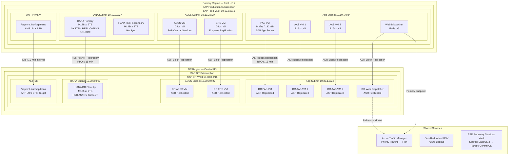
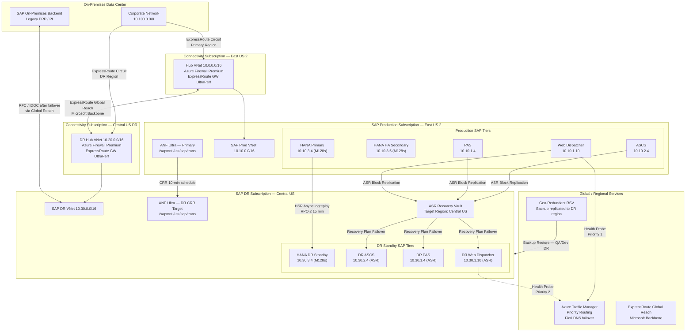

# SAP on Azure Disaster Recovery Architecture

---

## Overview

SAP workloads impose strict recovery requirements that exceed the capabilities of generic disaster recovery tooling. SAP systems consist of multiple interdependent tiers: the SAP HANA database, ABAP application servers (Primary Application Server and Additional Application Servers), SAP Central Services (ASCS and ERS for enqueue replication), the SAP Web Dispatcher, and the SAP Transport Management System. Each tier has distinct recovery time and recovery point characteristics. The SAP HANA database demands near-zero data loss (RPO < 15 minutes for async replication, RPO = 0 for synchronous replication) because financial and operational transactions written to HANA cannot be reconstructed from application-layer logs alone. SAP Central Services carries the in-memory enqueue lock table, which cannot be replicated asynchronously — all open locks are lost at failover and SAP programs waiting on those locks receive ABAP dump messages. SAP application servers are stateless relative to the database but carry instance profiles, work directory state, and in-flight ABAP batch jobs that must be accounted for in the recovery sequence. The DR architecture must address each tier with controls matched to its specific recovery characteristics, not apply a uniform snapshot-and-restore strategy across the entire SAP landscape.

Microsoft Azure provides the building blocks required to construct a tier-specific SAP DR architecture. Azure paired regions (for example East US 2 paired with Central US, or West Europe paired with North Europe) guarantee that Microsoft staggers maintenance operations and prioritises paired-region recovery in declared Azure region disasters. Azure Site Recovery (ASR) orchestrates VM replication and failover for stateless or lightly stateful VMs, including SAP application servers and Web Dispatchers, with RPO targets of under 15 minutes and customisable recovery plans that invoke PowerShell extension scripts for SAP-specific steps. Azure NetApp Files Cross-Region Replication (ANF CRR) replicates NFS volumes — used for SAP shared filesystems such as `/sapmnt`, `/usr/sap/trans`, and SAP global directories — across regions with a replication interval of 10 minutes (hourly schedules also available). ExpressRoute Global Reach connects the DR region's on-premises gateway to the primary region's gateway without traversing the public internet, preserving the private network path that SAP systems require for RFC calls to on-premises backend systems. SAP HANA System Replication (HSR) in asynchronous mode provides continuous database replication across regions with a replication lag bounded only by network throughput, typically under 15 minutes for transaction volumes below 5 GB/hour of redo log generation.

DR strategy selection for SAP on Azure is not a binary active-passive choice. A four-tier model is the practical approach: (1) Production SAP systems receive warm standby DR with automated failover orchestration and HSR async replication, targeting RPO ≤ 15 minutes and RTO ≤ 4 hours; (2) Quality Assurance systems receive periodic backup restore from geo-redundant Azure Recovery Services Vaults, targeting RPO ≤ 24 hours and RTO ≤ 8 hours; (3) Development and sandbox systems use on-demand rebuild from infrastructure-as-code and the most recent database backup, targeting RPO ≤ 24 hours and RTO ≤ 24 hours; (4) Integration and pre-production systems are evaluated individually but default to the QA tier unless they are in the critical path for production cutover. This tiered approach avoids the cost of running warm-standby DR for every system while ensuring that the production tier meets SAP contractual SLAs. DR strategy for each SAP SID is documented in the System Profile maintained by the SAP Basis team and reviewed annually or whenever the system's criticality classification changes.

---

## Architecture Overview

The SAP on Azure DR architecture spans two Azure paired regions: a Primary Region hosting the production SAP landscape and a DR Region hosting the standby SAP landscape. Both regions share the same Azure management group hierarchy, subscription structure, and governance policies applied at the SAP Management Group scope. The DR subscription is a sibling to the production subscription under the SAP Management Group, ensuring that Azure Policy assignments for SAP VM SKU restrictions, disk encryption enforcement, and network ACL baselines apply equally to both regions. Shared services — Azure Key Vault, Azure Monitor Log Analytics, Microsoft Sentinel — are deployed with geo-redundancy so that DR operations do not depend on primary region availability for secrets retrieval, log querying, or SIEM alerting.

At the database tier, SAP HANA System Replication in asynchronous mode (operation mode `logreplay`) continuously ships redo log segments from the primary HANA node to the DR HANA standby node. The DR HANA VM is sized identically to the primary HANA VM (same M-series SKU, same memory configuration) because HANA HSR in logreplay mode applies redo logs to a fully loaded in-memory database image on the standby, not a cold disk image. Any under-sizing of the DR HANA VM results in HSR connection failures when the standby cannot load the data volume into memory. ANF Cross-Region Replication replicates the `/sapmnt/<SID>`, `/usr/sap/trans`, and HANA data and log volumes at 10-minute intervals, providing a shared filesystem DR target that is consistent with the HANA data replication timeline.

At the application tier, Azure Site Recovery replicates production SAP application server VMs (PAS and all AAS instances) to the DR region with an RPO target of 15 minutes. ASR does not replicate the SAP HANA database VMs — those are handled exclusively by HANA HSR — but it does replicate the ASCS and ERS VMs. ASR replication uses managed disk replication behind the scenes, storing recovery points in a cache storage account in the source region and replicating delta changes every 30 seconds to ASR-managed storage in the target region. Custom recovery plan scripts handle SAP-specific tasks: mounting ANF volumes, starting SAPHostAgent, starting the ASCS instance, starting the ERS instance, starting the PAS instance, and starting AAS instances in the configured sequence with inter-step wait timers.

The DR region SAP landscape mirrors the production topology: one HANA VM (M-series), one ASCS VM, one ERS VM, one PAS VM, and a configurable number of AAS VMs pre-provisioned and replicated by ASR. The DR region contains its own ANF capacity pool, with volumes provisioned to receive CRR replication from the primary. Azure Traffic Manager with Priority routing directs SAP Fiori traffic to the primary region's Web Dispatcher VMs; in a declared DR event, the DNS TTL expiry (300 seconds) and Traffic Manager monitoring interval (30 seconds) determine how quickly Fiori users are redirected to DR-region Web Dispatcher endpoints.



---

## SAP Architecture

### SAP DR Landscape Design

The SAP DR landscape is a functional replica of the production landscape at the system level. Each production SAP SID (for example, S4P for S/4HANA production) has a corresponding DR target that shares the same SID and system number, enabling SAP GUI connections, RFC destination configurations, and SAP Solution Manager monitoring to work without reconfiguration after DR failover. This is a critical design constraint: if the DR system uses a different SID, every downstream integration — IDocs, RFC, BAPI, BAPIs from connected systems — requires re-pointing after failover, multiplying the RTO by the number of integrations. The DR landscape uses the same SAP kernel version, patch level, and transport track as production, enforced by the SAP Basis team's post-transport checklist that includes a DR landscape sync verification step.

The approach for the database tier is HANA System Replication (HSR), not system copy. Periodic system copies (weekly or monthly snapshots of the HANA database restored to DR) cannot achieve an RPO below the copy frequency and require hours of database startup time, making them unsuitable for production DR. HSR maintains a continuously updated in-memory replica in the DR region with redo log shipping lag determined solely by network bandwidth between regions. System copies are retained as a separate mechanism for DR environment patching and DR test isolation (see the DR Testing section), not for production DR recovery.

SAP application servers are stateless from the database perspective but carry instance-level state: the SAP work processes have in-flight dialog and batch jobs at the moment of a disaster. In-flight dialog steps are rolled back automatically by SAP's database commit/rollback mechanism after the HANA DR takeover completes. In-flight batch jobs are in ABAP status ACTIVE at the time of failure; after DR failover they appear as ACTIVE with no executing host, and the SAP Basis team must use SM50/SM66 to identify and restart or cancel them as part of the DR runbook. This is an accepted behaviour — batch job recovery is included in the RTO calculation with a 30-minute allowance for batch job triage.

### SAP HANA System Replication — Async Mode for DR

SAP HANA System Replication for DR uses operation mode `logreplay` and replication mode `async`. In `logreplay` mode, the secondary site receives redo log segments, replays them against an in-memory copy of the data volumes, and maintains a fully consistent database image ready for takeover with minimal additional replay time (typically under 60 seconds of log replay at takeover). In contrast, `delta_datashipping` mode does not keep the secondary in-memory and requires a full data shipping cycle before takeover, which can take hours for large HANA databases. `delta_datashipping` fails to meet production DR RTO targets below 4 hours for databases larger than 500 GB.

Replication mode `async` means the primary HANA node acknowledges transaction commits to the application layer without waiting for the secondary to confirm receipt of the redo log. The replication lag is bounded by the network bandwidth between regions and the transaction log generation rate. For a production SAP S/4HANA system generating 3 GB/hour of redo log, the replication lag over a 1 Gbps ExpressRoute connection (shared with other traffic) is typically 2–5 minutes. SAP Note 1999880 documents the HSR monitoring views `M_SERVICE_REPLICATION` and `M_SYSTEM_REPLICATION` which expose `SECONDARY_ACTIVE_STATUS`, `REPLICATION_STATUS`, and `REPLICATION_MODE`. The alert `HANA HSR Replication Lag > 15 min` (implemented in Azure Monitor via a custom metric from HANA monitoring agent) fires before the RPO threshold is breached.

### SAP Application Server Recovery

SAP application server VMs (PAS and AAS) are replicated by Azure Site Recovery. At DR failover, ASR recreates the VMs in the DR region VNet with the same disk contents as of the latest recovery point (RPO ≤ 15 minutes). The VMs start with the production IP addresses remapped to the DR subnet's IP scheme (handled by ASR network mapping). The SAP application servers mount the `/sapmnt/<SID>` NFS share from the DR ANF volume (which received CRR replication from primary) and read instance profiles from there. SAP licence files stored in `/usr/sap/<SID>/SYS/global/saphostsrv.cfg` and the SAP hardware key are VM-specific — after ASR failover to new VM hardware, the SAP hardware key changes and a new SAP licence must be applied. The DR runbook includes a step to generate and apply a new SAP licence key using the DR hardware key, obtained from `saplicense -get` on the DR application server after first start.

### SAP Central Services Recovery

SAP Central Services (ASCS instance for the enqueue server and message server, ERS instance for Enqueue Replication Server) are replicated by ASR. The ASCS instance carries the in-memory enqueue lock table. At the moment of a primary region failure, all locks in the enqueue lock table are lost — there is no mechanism to replicate the enqueue lock table to the DR region. SAP programs that held locks display ABAP runtime error `ENQUEUE_FAILED` after the DR ASCS starts. This is an accepted and documented behaviour in SAP Note 2630425. The DR runbook includes a step to communicate to business process owners that SAP transactions with pending locks must be restarted after DR failover. The ERS instance in production maintains a replicated copy of the enqueue table for HA within the primary region, but this replication does not cross regions.

### SAP NetWeaver DR Procedures

SAP NetWeaver DR recovery sequence follows the dependency order mandated by SAP startup scripts: (1) mount shared filesystems (`/sapmnt`, `/usr/sap/trans`), (2) start SAP HANA database, (3) start ASCS instance (message server + enqueue server), (4) start ERS instance (enqueue replication), (5) start PAS instance, (6) start AAS instances. Deviating from this sequence causes SAP startup failures: starting the PAS before the ASCS results in the message server connection failure and SAP work processes entering error state. ASR Recovery Plans encode this sequence with explicit inter-group wait timers: 5-minute wait after HANA takeover, 3-minute wait after ASCS start, 2-minute wait after ERS start, before starting PAS. The pre- and post-failover scripts in the Recovery Plan execute PowerShell runbooks from an Azure Automation account in the DR subscription.

### SAP Transport Domain in DR

The SAP Transport Management System (TMS) operates through the Transport Domain Controller (TDC), which is typically the production SAP system. After DR failover, the DR SAP system is the live production system, but TMS still references the original TDC hostname. The DR runbook includes a step to execute transaction STMS on the DR system and verify the Transport Domain Controller connection. If the TDC is unreachable (because it was in the failed primary region), the DR system must be promoted to a temporary TDC using the TMS reconfiguration procedure documented in SAP Note 1768384. Transport imports are suspended during the DR period to prevent incomplete transports from entering the DR production system. A freeze on SAP changes is issued as part of the DR declaration process.

### SAP Notes — Architecture Applicability

| SAP Note | Title | Architecture Impact | Where Applied |
|---|---|---|---|
| 1999880 | FAQ: SAP HANA System Replication | Defines HSR replication modes (sync/syncmem/async), logreplay vs delta_datashipping, multi-tier HSR topology, monitoring views M_SYSTEM_REPLICATION | HANA DR Design, Monitoring |
| 2039883 | FAQ: SAP HANA Database Backup and Recovery | Backup-based DR for QA/Dev tiers, HANA backup encryption, recovery time estimation for large databases | QA/Dev DR Strategy, Runbooks |
| 2057595 | FAQ: SAP HANA High Availability | HSR pre-checks, network bandwidth requirements between primary and secondary, HANA takeover procedure steps | HANA DR Design, Runbooks |
| 2630425 | SAP HANA System Replication Known Issues and Restrictions | Enqueue lock loss at ASCS failover, delta_datashipping limitations, HSR takeover incomplete scenarios | Central Services DR, Anti-Patterns |
| 1928533 | SAP Applications on Microsoft Azure: Supported Products and Azure VM Types | Supported M-series VM types for HANA DR standby, certification requirements for DR VMs | DR VM Sizing, Design Decisions |
| 2015553 | SAP on Microsoft Azure: Support Prerequisites | ExpressRoute requirement for production SAP, support prerequisites for DR configurations | DR Connectivity |
| 1768384 | SAP Transport Management System in High Availability Scenarios | TMS/TDC reconfiguration in DR, promoting a system to TDC | Transport Domain DR |
| 2925421 | SAP HANA System Replication — Operations Guide | HANA takeover commands (`hdbnsutil -sr_takeover`), re-registration of original primary as secondary after failback, full HSR operational runbook | HANA DR Runbooks |
| 2630765 | SAP HANA Backup and Recovery for Azure NetApp Files | ANF snapshot-consistent backups for HANA, integration with HANA Backint for ANF CRR scenarios | ANF DR, Backup Strategy |
| 3024346 | SAP HANA 2.0 SPS 06 Release Notes | Multi-target HSR support including 1+1+1 topology for chained replication (primary → HA secondary → DR secondary) | Multi-Target HSR Design |

---

## Azure Architecture

### Azure Paired Regions for SAP

Azure paired regions for SAP workloads must be selected based on three criteria: geographic proximity (to minimise HSR replication latency), Azure region capability (M-series VM availability in both regions), and regulatory residency requirements (data must remain in the same jurisdiction). The validated SAP DR region pairs for the three primary geographies are:

- **Americas**: East US 2 (primary) / Central US (DR) — M-series available in both, approximately 18 ms inter-region round-trip latency via ExpressRoute Global Reach
- **Europe**: West Europe (Netherlands) (primary) / North Europe (Ireland) (DR) — M-series available in both, approximately 22 ms inter-region round-trip latency
- **Asia Pacific**: Southeast Asia (Singapore) (primary) / East Asia (Hong Kong) (DR) — M-series available in both, approximately 31 ms inter-region round-trip latency

The latency figures above are for ExpressRoute Global Reach paths, which route through the Microsoft backbone rather than the public internet. These latencies are acceptable for HANA HSR async mode because async replication does not block application commits. For HANA HSR sync mode (required for zero RPO), the Microsoft-documented latency limit is 1 ms round-trip; cross-region latencies of 18–31 ms make sync mode across regions non-viable for production SAP workloads.

### ExpressRoute Global Reach for DR Connectivity

ExpressRoute Global Reach connects two ExpressRoute circuits (one in the primary region, one in the DR region) through the Microsoft backbone, creating a private path between the primary Azure region and the DR Azure region without traversing the public internet. For SAP DR, this path serves three functions: (1) HANA HSR redo log replication between primary HANA VM and DR HANA standby VM; (2) RFC calls from the DR SAP application servers to on-premises backend systems (ERP to legacy systems, SAP PI/PO integrations); (3) operator access from on-premises to the DR region for DR runbook execution. Global Reach is provisioned at the connectivity subscription level and the route advertisement from DR VNet is controlled by the DR ExpressRoute Gateway's connection authorisation. Each ExpressRoute circuit must have Premium add-on enabled for Global Reach when primary and DR regions are in different geopolitical regions.

### Azure Site Recovery for Non-HANA SAP Components

Azure Site Recovery manages replication of all SAP VM tiers except HANA. ASR replication for SAP VMs is configured with the following parameters:

- **Replication policy**: RPO threshold 15 minutes, app-consistent snapshot frequency 4 hours, recovery point retention 24 hours
- **Target resource group**: pre-created in DR subscription with naming convention `rg-sap-dr-<SID>-<region>`
- **Target virtual network**: DR SAP VNet with network mapping configured in ASR (source subnet → target subnet mapping)
- **Target VM size**: identical to source VM size (ASR allows override for compute-optimised DR scenarios, but SAP VMs must match for performance parity)
- **Managed disk type**: Premium SSD (same as source; ASR does not downgrade disk type)
- **Availability zone**: ASR supports zone-to-zone and region-to-region replication; for cross-region DR, zone assignment in the DR region is specified per VM in the Recovery Plan

ASR replication health is monitored through the ASR vault's replication health dashboard and through Azure Monitor alerts on the `ASRReplicationLagExceedingRPOThreshold` metric. The ASR Mobility Service agent must be installed on all SAP VMs in scope; on Linux VMs, the agent is deployed via the Custom Script Extension in the VM provisioning Bicep templates.

### Azure NetApp Files Cross-Region Replication

ANF Cross-Region Replication replicates ANF volumes from the primary region to the DR region. For SAP, the following volumes are included in CRR:

| Volume | Mount Point | Size | Replication Schedule | Notes |
|---|---|---|---|---|
| `sapmnt-<SID>` | `/sapmnt/<SID>` | 256 GB | 10-minute | SAP shared directory, instance profiles, kernel executables |
| `usrsaptrans` | `/usr/sap/trans` | 512 GB | 10-minute | SAP transport directory; imports frozen during DR |
| `usrsap-<SID>-ASCS` | `/usr/sap/<SID>/ASCS<nr>` | 64 GB | 10-minute | ASCS instance directory |
| `usrsap-<SID>-ERS` | `/usr/sap/<SID>/ERS<nr>` | 64 GB | 10-minute | ERS instance directory |

HANA data and log volumes are NOT replicated via ANF CRR when HSR is in use — HSR is the authoritative replication mechanism for HANA. ANF CRR and HSR are complementary but operate independently. During DR failover, ANF CRR replication to the DR volumes must be broken (the DR volumes converted from data protection volumes to standard read-write volumes) before the DR SAP VMs can mount them. The CRR break operation takes less than 2 minutes for volumes below 512 GB.

### Azure Backup Geo-Redundant Vaults

Azure Recovery Services Vaults (RSV) configured with geo-redundant storage (GRS) replicate backup data to the paired region. For SAP, two separate RSVs are used:

- **Production RSV** (`rsv-sap-prod-<region>`): GRS-enabled, retains HANA Backint backups (daily full, hourly log backups with 35-day retention), ASR replication data (managed by ASR, not backup policies)
- **Non-Production RSV** (`rsv-sap-nonprod-<region>`): GRS-enabled, retains QA/Dev HANA backup restore points, Azure Backup for SAP HANA on Azure VM (uses Backint API), 30-day retention

Cross-Region Restore (CRR) is enabled on both RSVs, allowing restore of SAP HANA backup points to VMs in the DR region without waiting for a declared Azure region disaster. This capability is used for DR testing: a HANA backup taken in production can be restored to a test HANA VM in the DR region to validate recovery procedures without touching the HSR standby.

### DR Subscription Design

The DR subscription is a dedicated subscription under the SAP Management Group in the Azure management group hierarchy. It is not the same subscription as the production subscription. Reasons for subscription separation:

1. **Blast radius isolation**: Production subscription quota exhaustion, policy violations, or accidental resource deletion does not affect DR subscription readiness
2. **RBAC isolation**: DR subscription access is restricted to the DR Operations team and SAP Basis leads; production DevOps teams do not have access to DR subscription by default
3. **Cost visibility**: DR subscription costs are reported separately, enabling the finance team to account for DR as a distinct cost category
4. **Policy independence**: The DR subscription can carry a more permissive Azure Policy assignment for `Allowed VM SKUs` during DR testing (allowing temporary non-production VMs) without relaxing policy on the production subscription
5. **Azure quota pre-allocation**: M-series vCPU quota in the DR subscription is reserved exclusively for DR HANA VMs and ASR failover targets; a shared subscription risks quota depletion by non-production VMs leaving insufficient quota for DR VM startup

The DR subscription uses the naming convention `sub-sap-dr-<region-abbreviation>` and is tagged with `environment=DR`, `sap-tier=production-dr`, and `cost-centre=<IT-DR-cost-centre-code>`.

### Azure Traffic Manager for SAP Fiori DR

Azure Traffic Manager provides DNS-based routing for SAP Fiori access. Traffic Manager is configured with Priority routing and two endpoints:

- **Priority 1** (primary): Public IP address of the SAP Web Dispatcher in the primary region (or the Azure Application Gateway Frontend IP if Application Gateway fronts the Web Dispatcher)
- **Priority 2** (DR): Public IP address of the SAP Web Dispatcher in the DR region (or DR Application Gateway Frontend IP)

Traffic Manager health probes monitor the primary endpoint every 30 seconds on TCP port 443. If three consecutive probes fail (90-second detection window), Traffic Manager demotes Priority 1 and routes DNS responses to Priority 2. TTL on the Traffic Manager DNS record is set to 300 seconds (5 minutes), meaning the maximum DNS propagation delay after Traffic Manager switches is 5 minutes. The total Fiori routing failover time is: 90 seconds (probe detection) + 300 seconds (TTL) = approximately 6.5 minutes, which is factored into the application-layer RTO.

---

### DR Network Topology



---

## DR Strategy by SAP Tier

### Production SAP Systems

Production SAP systems — identified by SID suffix `P` (for example `S4P`, `BWPP`, `CRMP`) — receive the full warm-standby DR architecture:

- **Database**: HANA System Replication async in logreplay mode to DR region HANA VM. HSR is the sole DR mechanism for the database. No database snapshot or backup restore is used for production DR failover.
- **Application servers**: Azure Site Recovery replication with 15-minute RPO. Recovery Plan with SAP-aware startup sequence scripts.
- **Shared filesystem**: ANF Cross-Region Replication at 10-minute schedule for `/sapmnt`, `/usr/sap/trans`, and instance directories.
- **SAP Central Services**: ASR replication. Post-failover enqueue lock loss is accepted and documented.
- **SAP Fiori / Web Dispatcher**: ASR replication + Traffic Manager Priority 2 endpoint activation.

### Quality Assurance SAP Systems

QA systems (`S4Q`, `BWPQ`) receive periodic backup restore DR:

- **Database**: Daily HANA full backup to geo-redundant RSV using Azure Backup for SAP HANA (Backint). In DR, restore from the most recent backup point in the paired-region RSV. Recovery time for a 1 TB HANA database from Azure Backup restore is approximately 2–3 hours (benchmark from Microsoft: approximately 400 MB/minute restore throughput).
- **Application servers**: Not replicated by ASR. Rebuilt from Bicep IaC templates in the DR subscription. IaC deployment time for QA application server VMs: approximately 30–45 minutes.
- **Shared filesystem**: ANF volumes are not CRR-replicated for QA. ANF volumes are provisioned in DR region and `/sapmnt` is populated from the HANA restore's associated file backup.
- **SAP Central Services**: Rebuilt from IaC. SAP software installation from software repository in Azure Blob (geo-redundant).

### Development and Sandbox SAP Systems

Dev/sandbox systems (`S4D`, `S4S`) are rebuilt on demand:

- **Database**: No continuous replication. Restore from the most recent weekly full backup in the geo-redundant RSV. If the latest backup is 6 days old, the dev system is restored to that point — data loss in dev is accepted.
- **Application servers**: Rebuilt from IaC. SAP software installed from the Azure Blob software repository.
- **Timeline**: RTO 24 hours is acceptable. Dev rebuild is initiated only if the primary region outage exceeds 48 hours.

### DR Strategy Decision Matrix

| SAP System Type | RPO Target | RTO Target | DB DR Method | App Server DR Method | Filesystem DR Method | DR Activation Trigger |
|---|---|---|---|---|---|---|
| Production (SID suffix P) | ≤ 15 min | ≤ 4 hours | HANA HSR async logreplay | Azure Site Recovery | ANF CRR 10-min | Automated detection + manual DR declaration |
| Pre-Production / Integration | ≤ 4 hours | ≤ 8 hours | HANA HSR async logreplay | Azure Site Recovery | ANF CRR hourly | Manual DR declaration |
| Quality Assurance | ≤ 24 hours | ≤ 8 hours | Azure Backup restore from GRS RSV | IaC rebuild | ANF new provision | Manual, RTO > 4 hours from incident |
| Development | ≤ 7 days | ≤ 24 hours | Azure Backup restore from GRS RSV | IaC rebuild | ANF new provision | Manual, only if primary outage > 48 hours |
| Sandbox | No DR SLA | No DR SLA | Not applicable | Not applicable | Not applicable | Not activated for region failure |

---

## HANA DR Design

### HANA System Replication Modes

SAP HANA System Replication supports four replication modes that differ in the synchronisation point between the primary and secondary:

| Replication Mode | Commit Acknowledgement | Data Loss Exposure | Network Latency Impact | Use Case |
|---|---|---|---|---|
| `sync` | After secondary confirms log write to disk | Zero (RPO = 0) | Blocks primary commit if secondary unreachable | HA within same AZ (≤ 1 ms RTT) |
| `syncmem` | After secondary confirms log write to memory | Up to secondary memory loss | Slightly lower than sync (no disk write wait on secondary) | HA within same datacenter |
| `async` | After primary writes log to disk (secondary async) | Up to replication lag (typically < 15 min) | No impact on primary commit latency | DR across regions (18–31 ms RTT) |
| `async` + `full_sync` | Configured per tenant; `full_sync` option blocks if secondary falls behind | Zero when secondary connected, unbounded if disconnected | Blocks primary if secondary lag exceeds threshold | Not recommended for cross-region DR |

For cross-region SAP DR on Azure, `async` replication mode is the only viable choice. The `sync` and `syncmem` modes at 18+ ms inter-region latency add 18+ ms to every SAP database commit — for an S/4HANA system executing 200 commits/second, this adds 3,600 ms of cumulative blocking per second, which is not acceptable.

### logreplay vs delta_datashipping Operation Mode

The operation mode controls what the secondary HANA site stores and how it prepares for takeover:

- **`logreplay`** (recommended for DR): The secondary site receives redo log segments and continuously replays them against a full in-memory data image. The secondary database is always in a state consistent up to the last applied log segment. Takeover time is the time to replay the last few seconds of unprocessed log segments (typically < 60 seconds). Memory requirement on secondary: same as primary (full data image loaded in memory).
- **`delta_datashipping`**: The secondary site receives full data shipping at configurable intervals (default 10 minutes) plus delta redo log for the interval. The secondary does not keep the data volume in memory. At takeover, the secondary must load the full data volume from disk into memory (potentially hours for TB-scale databases). Not suitable for production DR with RTO < 4 hours for databases > 500 GB.

The DR HANA VM must be sized identically to the primary HANA VM because `logreplay` mode requires the secondary to hold the full in-memory data volume. Choosing a smaller secondary VM results in HANA HSR connection failure with the error `[34014] The secondary system does not have enough memory to hold the full data volume`.

### Multi-Target Replication

For SAP landscapes requiring both HA (within primary region) and DR (cross-region), a multi-target (1+1+1) HSR topology is used:

```
Primary HANA (East US 2, AZ1)
    ↓ HSR sync — logreplay (HA)
HA Secondary HANA (East US 2, AZ2)
    ↓ HSR async — logreplay (DR)
DR Secondary HANA (Central US)
```

In this topology, the HA tier uses `sync` replication for zero RPO within the region, and the DR tier uses `async` replication chained off the HA secondary (not directly off the primary). The chaining reduces load on the primary HANA node. HANA supports this via the `--replicationMode=async` flag on the HSR add-secondary command for the DR tier. Multi-target HSR requires HANA 2.0 SPS 03 or later (SAP Note 3024346).

The HA secondary and DR secondary are independent sites — if the HA secondary fails, HSR automatically re-routes replication between primary and DR secondary. After HA secondary recovery, it re-registers as an HSR target and resynchronises.

### HANA DR Takeover Procedure

The authoritative HANA DR takeover procedure is:

1. **Verify HSR status** on DR secondary before takeover: `hdbnsutil -sr_state` should show `ACTIVE` for the DR site.
2. **Initiate takeover** on the DR HANA VM: `hdbnsutil -sr_takeover`
3. **Monitor takeover progress** in `hdbnsutil -sr_state` output — status transitions from `SECONDARY` to `TAKEOVER` to `PRIMARY`.
4. **Verify database started** as primary: `HDB info` on DR HANA OS user shows HANA processes running. `hdbsql -u SYSTEM -p <password> -n localhost:30015 "SELECT * FROM M_SYSTEM_OVERVIEW"` returns rows.
5. **Verify replication lag replayed**: Check `M_SERVICE_REPLICATION` view — `SECONDARY_ACTIVE_STATUS = 'YES'` indicates no more replication. After takeover, no secondary is connected (the original primary is failed), so this view returns no rows.
6. **Validate database consistency**: Execute HANA consistency check: `hdbcons -e "consistency check"` — should return `CHECK PASSED`.
7. **Update HANA tenant connection string** if application servers use the HANA tenant port (30015) rather than the system DB port — typically no change required if using HANA nameserver-based routing.

The entire takeover procedure, steps 1–7, is scripted in an Azure Automation PowerShell runbook that SSH-executes commands on the DR HANA VM using a managed identity and SSH key stored in Key Vault.

### HANA DR Testing Without Impact to Production

DR testing using the HSR standby directly risks impacting production replication — a test takeover makes the DR secondary the primary, leaving production without a DR target. Two approaches avoid this:

1. **Snapshot-based test restore**: Use the HANA Backup / ANF snapshot of the DR ANF volume to provision a separate test HANA instance in the DR region. This creates an isolated test environment identical to the DR standby's state without breaking HSR. After testing, delete the test instance and ANF clone. Production HSR is never interrupted.
2. **Planned test takeover with immediate re-registration**: Execute a planned takeover (`hdbnsutil -sr_takeover --mode=takeover`) on the DR secondary, validate the database, then immediately re-register the original primary (which was in a controlled shutdown state) as the new secondary (`hdbnsutil -sr_register --remoteHost=<primary-host> --remoteInstance=<nr> --replicationMode=async --name=PRIMARY_SITE`). This approach requires a maintenance window on the production system. It is executed as the annual DR simulation test.

---

## Application Server DR

### Azure Site Recovery for SAP Application Servers

ASR is configured for all non-HANA SAP VMs. The ASR configuration for SAP-specific requirements:

- **Crash-consistent vs app-consistent recovery points**: ASR creates app-consistent snapshots every 4 hours using VSS (Windows) or pre/post scripts (Linux). For SAP on Linux, the ASR pre-snapshot script stops SAP work processes gracefully (`sapcontrol -nr <nr> -function Stop`) and the post-snapshot script restarts them. This ensures the VM snapshot is SAP-application-consistent, meaning no torn ABAP work process state is in the snapshot. Between app-consistent snapshots, crash-consistent recovery points are created every 5 minutes.
- **Recovery point selection**: During DR failover, the latest app-consistent recovery point is preferred over the latest crash-consistent recovery point to avoid ABAP state corruption. The ASR Recovery Plan is configured with `Latest app-consistent` as the recovery point type.
- **Target VM size**: Identical to source. SAP is not licensed per CPU count on Azure, but SAP sizing (SAPS rating) is CPU-count-dependent. Under-sizing the DR application server reduces throughput and causes SAP dialog step timeouts.

### Custom Scripts for SAP-Aware Failover

ASR Recovery Plans invoke custom scripts (Azure Automation runbooks) at each recovery group boundary. The SAP-specific scripts handle steps that ASR's built-in VM boot cannot perform:

| Recovery Group | Script | Action | Timeout |
|---|---|---|---|
| Group 1 (Pre-failover) | `Break-ANF-CRR.ps1` | Breaks ANF CRR replication, converts DR volumes to read-write | 5 minutes |
| Group 1 (Pre-failover) | `Update-DNS-Records.ps1` | Updates Private DNS A records from production to DR IPs for SAP hostnames | 3 minutes |
| Group 2 (Database) | `Execute-HANA-Takeover.ps1` | SSH executes `hdbnsutil -sr_takeover` on DR HANA VM, polls for completion | 10 minutes |
| Group 3 (Central Services) | `Start-ASCS-ERS.ps1` | SSH executes SAP ASCS start, waits for message server port 3600 to respond | 5 minutes |
| Group 4 (PAS) | `Start-PAS.ps1` | SSH executes SAP PAS start, verifies work process status via `sapcontrol -nr <nr> -function GetProcessList` | 5 minutes |
| Group 5 (AAS) | `Start-AAS-Instances.ps1` | SSH executes SAP AAS starts in parallel, verifies each | 10 minutes |
| Group 6 (Post-failover) | `Validate-SAP-Landscape.ps1` | Executes SAP availability check via RFC using SAP .NET Connector, posts result to Teams webhook | 5 minutes |

All runbooks are stored in the Azure Automation account `aa-sap-dr-<region>` in the DR subscription. Runbook authentication uses managed identity with RBAC role `Virtual Machine Contributor` on the DR resource group and `Key Vault Secrets User` on the DR Key Vault.

### SAP Profile and Transport File Recovery

After ASR failover, SAP instance profiles are read from the `/sapmnt/<SID>/profile/` directory on the DR ANF volume (populated by ANF CRR). The profiles reference the SAP hostname, which after DR failover resolves to the DR VM's IP via Private DNS. The `Update-DNS-Records.ps1` script must run before the SAP instances start to ensure hostname resolution is correct. Any hardcoded IP addresses in SAP profiles (for example `icm/server_port_0 = PROT=HTTP,PORT=8000,PROCTIMEOUT=600,TIMEOUT=600`) are avoided by using hostnames in all profile parameters — this is enforced by the SAP Basis team's profile review checklist.

The SAP transport directory `/usr/sap/trans` is replicated by ANF CRR. After DR failover, the directory is available read-write on the DR ANF volume. However, transport imports are frozen as part of DR declaration, so the transport directory is used read-only (for program source access) during the DR period.

### SAP Licence Recovery in DR

SAP licences are tied to the SAP hardware key, which is derived from the host's unique hardware identifiers. When ASR recreates VMs in the DR region, the hardware key of the DR VMs differs from the original production VMs. The SAP Basis runbook step after application server start is:

1. Log in to the DR ASCS VM via Azure Bastion.
2. Switch to the `<sid>adm` OS user.
3. Run `saplicense -get` to retrieve the new hardware key.
4. Open an SAP support request (incident type: `BC-LIC-LIK`) with the new hardware key and request an emergency licence for the DR system.
5. SAP provides an emergency 28-day temporary licence within minutes via the SAP support portal.
6. Apply the temporary licence: `saplicense -install` with the provided key file.
7. After the DR period ends and production is restored, request a permanent licence restore.

SAP emergency licences for DR are a known procedure documented in SAP Note 2133415. The 28-day emergency licence provides sufficient time for any production DR scenario.

---

## DR Runbooks

### DR Declaration Process

A DR event is declared when one of the following conditions is met:

1. **Azure Service Health** reports an active Azure region outage affecting East US 2 with estimated recovery time exceeding 4 hours.
2. **SAP Availability Manager** (or SAP Solution Manager system monitoring) reports all production SAP systems unreachable for more than 30 consecutive minutes.
3. **Azure Monitor alert** `Primary-Region-HANA-Unreachable` fires (HANA port 30015 unreachable from DR region monitoring VM for 10 consecutive minutes).
4. **IT Management decision** following a physical infrastructure event (datacenter fire, flood, power failure) affecting the primary region.

The DR Declaration is a formal step requiring approval from two of three named approvers (IT Director, SAP Application Manager, Infrastructure Lead). The declaration is logged in the IT incident management system (ServiceNow) with incident type `DR_DECLARATION` and severity P1. The declaration triggers the DR communication plan: notification to all SAP users, notification to business process owners, activation of the DR Operations team on-call bridge.

### Failover Sequence

The failover sequence is divided into four layers executed in strict order:

**Layer 1 — Network (estimated time: 10 minutes)**
1. Confirm DR ExpressRoute circuit is up (`az network expressroute show --resource-group rg-connectivity-dr --name er-sap-dr`).
2. Confirm ExpressRoute Global Reach connection is propagating routes (`az network expressroute peering show` — verify BGP routes include production VNet prefixes propagated via Global Reach).
3. Update Private DNS zones in DR subscription: point SAP host A records to DR VM IPs.
4. Confirm Azure Firewall in DR hub VNet is running and routing tables are correct.
5. Test connectivity from DR bastion host to DR SAP VNet subnets.

**Layer 2 — Storage (estimated time: 15 minutes)**
1. Break ANF CRR replication: `az netappfiles volume replication remove` on each DR data protection volume. This converts volumes to standard read-write.
2. Verify DR ANF volumes are mounted by DR VMs (if VMs are already running in DR): `df -h | grep sapmnt`.
3. Verify `/sapmnt/<SID>` directory structure is intact: `ls -la /sapmnt/<SID>/profile/`.
4. Verify `/usr/sap/trans` directory is accessible with correct permissions (`<sid>adm` readable, `sapsys` group writable).
5. Confirm DR storage account (used by ASR) is accessible.

**Layer 3 — Database (estimated time: 20 minutes)**
1. On DR HANA VM, verify HSR status: `hdbnsutil -sr_state`. Expected: site name matches DR site configuration, `SECONDARY_ACTIVE_STATUS=YES` (or `CONNECTION_STATUS=CONNECTING` if primary is unreachable).
2. Execute HANA takeover: `hdbnsutil -sr_takeover` (or via Automation runbook `Execute-HANA-Takeover.ps1`).
3. Monitor takeover: poll `hdbnsutil -sr_state` every 30 seconds until `mode=PRIMARY`.
4. Verify database started: `HDB info` shows `hdbdaemon`, `hdbcompileserver`, `hdbnameserver`, `hdbindexserver` processes running.
5. Connect to HANA and verify tenant database: `hdbsql -u SYSTEM -p <password> -n localhost:30015 -d <DBSID> "SELECT CURRENT_TIMESTAMP FROM DUMMY"`.
6. Run HANA consistency check: `hdbcons -e "consistency check"`.

**Layer 4 — Application (estimated time: 45–90 minutes, primarily SAP licence wait)**
1. Execute ASR Recovery Plan: `az recoveryservices vault failover start` (or via Azure Portal ASR Recovery Plans).
2. Monitor ASR failover progress in the Recovery Services vault failover jobs.
3. After ASCS VM starts: wait for ASCS SAP instance to start (via `Start-ASCS-ERS.ps1`). Verify message server port 3600 responds: `telnet <ASCS-DR-IP> 3600`.
4. After ERS VM starts: verify ERS running via `sapcontrol -nr <nr> -function GetProcessList` shows `enrepserver` in GREEN state.
5. After PAS VM starts: request and apply SAP emergency licence (steps in SAP Licence Recovery section). Verify licence: `saplicense -show`.
6. Start PAS SAP instance: `sapcontrol -nr <nr> -function Start`. Wait for PAS to reach GREEN status.
7. Start AAS instances in parallel.
8. Execute SAP landscape validation (`Validate-SAP-Landscape.ps1`): tests RFC connection, SM50 work process list, basic dialog step execution.
9. Activate Traffic Manager DR endpoint: confirm Priority 1 probe is failing, Priority 2 (DR) is responding. DNS TTL expiry propagates Fiori URL to DR in ≤ 5 minutes.
10. Notify DR declaration approvers and business process owners that SAP DR landscape is available.

**Total estimated RTO: 90 minutes (network) + storage overlap + 20 min DB + 45–90 min application = 2.5–4 hours depending on SAP licence response time.**

### DR Test Procedure

DR tests are executed twice per year (aligned with SAP DR test schedule in the operations calendar). The test procedure uses method 1 (snapshot-based test restore) to avoid interrupting production HSR:

1. **Pre-test preparation (T-7 days)**: Create ANF snapshots of DR volumes manually via Azure Portal. Notify SAP basis team of DR test window. Prepare test HANA VM in DR subscription (pre-provisioned M64s for test — smaller than production to reduce cost).
2. **Test execution (Day 0)**:
   a. Clone ANF DR volume snapshot to a new ANF test volume in the DR region.
   b. Mount test ANF volume on test HANA VM.
   c. Start HANA on test VM using the mounted data volume: `HDB start`. This starts HANA from the snapshot point.
   d. Verify HANA started and data is consistent up to the snapshot timestamp.
   e. Deploy test application server VMs from IaC, connecting to the test HANA.
   f. Execute SAP functional test: logon, transaction execution (VA01, ME21N, FB50), RFC call to test system.
   g. Measure RTO from step (a) start to step (f) completion. Document actual vs target.
3. **Post-test cleanup**: Delete test HANA VM, test application server VMs, test ANF volumes. Document findings in DR test report.
4. **HSR continuity verification**: After test, verify production HSR replication is undisturbed: `hdbnsutil -sr_state` on production primary and HA secondary.

### Failback Procedure

Failback to the primary region after DR recovery is a planned operation executed during a maintenance window. Steps:

1. **Verify primary region recovery**: Confirm Azure Service Health shows primary region fully operational. Verify primary region VMs (all production SAP VMs) are running and healthy.
2. **Synchronise HANA from DR to primary**: Register the original primary HANA VM as a new secondary off the DR HANA (which is now primary): `hdbnsutil -sr_register --remoteHost=<dr-hana-host> --remoteInstance=<nr> --replicationMode=async --name=ORIGINAL_PRIMARY`. Wait for initial synchronisation to complete (this is a full data sync — time depends on database size, approximately 2–4 hours for 2 TB HANA at 200 MB/s ANF throughput).
3. **Perform planned takeover back to primary**: After sync completes, execute planned takeover: `hdbnsutil -sr_takeover --mode=takeover` on the original primary HANA VM. This makes the original primary the new primary again.
4. **Re-register DR as secondary**: `hdbnsutil -sr_register --remoteHost=<primary-hana-host> --remoteInstance=<nr> --replicationMode=async --name=DR_SITE` on the DR HANA VM.
5. **Failback application servers**: Execute ASR Re-protect (reverse replication from DR back to primary) for all ASR-protected VMs. After re-protect completes and RPO reaches ≤ 15 minutes, execute failback failover (ASR planned failover from DR to primary).
6. **Re-establish ANF CRR**: Break CRR direction, re-establish from primary ANF to DR ANF (primary → DR). Initial resync requires transferring delta changes from DR operation period.
7. **Validate primary SAP landscape**: Execute the same validation steps as DR activation (layers 1–4) in reverse.
8. **Deactivate DR Traffic Manager endpoint**: After primary Fiori is confirmed working, demote the DR Traffic Manager endpoint to standby (Priority 2).

### RTO Measurement Methodology

RTO is measured from the moment of DR declaration (T0) to the moment SAP users can successfully log in and execute transactions (T_ready). The measurement is divided into:

| Phase | Measurement Point | Target |
|---|---|---|
| T0 | DR declaration logged in ServiceNow | N/A |
| T_network | Private DNS updated, DR connectivity confirmed | T0 + 10 min |
| T_storage | ANF CRR broken, DR volumes read-write | T0 + 25 min |
| T_database | HANA takeover complete, database in PRIMARY mode | T0 + 45 min |
| T_ascs | ASCS instance running, message server port 3600 responding | T0 + 70 min |
| T_pas | PAS instance running, SAP licence applied | T0 + 120 min |
| T_ready | All AAS running, Traffic Manager switched, user logon test passed | T0 + 180–240 min |

RTO target of ≤ 4 hours (240 minutes) accommodates SAP emergency licence response time (up to 60 minutes in worst case). If SAP emergency licence is pre-staged in DR Key Vault (a 28-day temporary licence renewed monthly as part of DR operations), T_pas reduces to T0 + 90 min and T_ready to T0 + 120–150 min.

---

## Design Decisions

| Decision | Options Considered | Choice | Rationale | SAP/Azure Reference |
|---|---|---|---|---|
| HANA DR replication mode | sync, syncmem, async | async | Cross-region latency (18–31 ms) makes sync/syncmem non-viable; sync adds 18+ ms per commit. async achieves RPO ≤ 15 min with no primary performance impact. | SAP Note 1999880; HANA Administration Guide — System Replication |
| HANA DR operation mode | logreplay, delta_datashipping | logreplay | delta_datashipping requires full data load at takeover (hours for TB-scale DB). logreplay maintains in-memory replica, takeover < 60 seconds. | SAP Note 2057595 |
| DR region pair | Multiple options evaluated | East US 2 / Central US (Americas); West Europe / North Europe (EMEA) | Azure-documented paired regions with M-series availability and lowest inter-region latency. | Azure paired regions documentation |
| DR HANA VM sizing | Same as production vs. smaller | Same M-series SKU as production | logreplay mode requires full in-memory data volume on secondary. Under-sizing causes HSR connection failure. | SAP Note 1999880; HANA System Replication Guide |
| Application server DR mechanism | ASR vs. IaC rebuild vs. VM snapshot | Azure Site Recovery | ASR achieves 15-min RPO with automated failover orchestration and Recovery Plan scripts. IaC rebuild cannot achieve < 2-hour RTO. VM snapshots lack SAP-aware consistency. | Azure Site Recovery SAP deployment guide |
| DR subscription model | Shared prod/DR subscription vs. dedicated DR subscription | Dedicated DR subscription | Blast radius isolation, RBAC separation, independent cost accounting, independent Azure Policy assignments. | Azure Landing Zone for SAP guidance |
| ANF replication for SAP shared filesystem | ANF CRR vs. DFS-R vs. rsync over VPN | ANF CRR | Native Azure managed replication with 10-minute RPO, no custom sync scripts, no additional VMs required. Consistent with HANA HSR timeline. | Azure NetApp Files CRR documentation |
| Enqueue lock handling at DR failover | Replicate locks vs. accept loss vs. Enqueue Replication Server extension | Accept lock loss at regional failover | Cross-region ERS replication is not supported by SAP. Lock loss is documented in SAP Note 2630425 and accepted by business. Impact mitigated by user communication and restart procedures. | SAP Note 2630425 |
| SAP licence in DR | Pre-stage emergency licence vs. request at failover time | Pre-stage 28-day temporary licence renewed monthly | Eliminates 30–60 minute SAP support wait from RTO critical path. Monthly renewal is automated via SAP support API. | SAP Note 2133415 |
| Traffic Manager for Fiori | Traffic Manager vs. Azure Front Door vs. Application Gateway | Azure Traffic Manager | Fiori access is direct B2B corporate network access, not public CDN-optimised traffic. Traffic Manager DNS-based routing with 90-second detection + 300-second TTL is adequate. Front Door adds cost without benefit for non-CDN SAP Fiori. | Azure Traffic Manager documentation |

---

## SAP Notes Reference

| SAP Note | Title | Relevant Section |
|---|---|---|
| 1999880 | FAQ: SAP HANA System Replication | HANA DR Design, Replication Modes, Multi-Target HSR |
| 2039883 | FAQ: SAP HANA Database Backup and Recovery | QA/Dev DR Strategy, Backup Restore Procedures |
| 2057595 | FAQ: SAP HANA High Availability | HANA Takeover Procedure, Pre-checks, Network Requirements |
| 2630425 | SAP HANA System Replication Known Issues and Restrictions | Enqueue Lock Loss, delta_datashipping Limitations |
| 1928533 | SAP Applications on Microsoft Azure: Supported Products and Azure VM Types | DR VM Sizing, M-series Certification |
| 2015553 | SAP on Microsoft Azure: Support Prerequisites | ExpressRoute Requirement, DR Support Prerequisites |
| 1768384 | TMS in High Availability Scenarios | TMS/TDC Reconfiguration, Transport Domain DR |
| 2925421 | SAP HANA System Replication — Operations Guide | HANA Takeover Commands, Re-registration Procedure, Failback |
| 3024346 | SAP HANA 2.0 SPS 06 Release Notes | Multi-Target HSR 1+1+1 Topology |
| 2133415 | SAP Licence in Virtual and Cloud Environments | Emergency Licence Procedure, Hardware Key Change After VM Migration |
| 2630765 | SAP HANA Backup and Recovery for Azure NetApp Files | ANF Snapshot Backups, Backint for ANF |
| 2927965 | Availability and BCDR Concepts for SAP on Azure | Azure-specific DR concepts, ASR for SAP, DR strategy overview |

---

## Azure Well-Architected Alignment

### Reliability

The DR architecture directly implements the Reliability pillar by designing for regional failure as a first-class scenario. HANA HSR async replication provides continuous data replication with RPO ≤ 15 minutes, eliminating point-in-time data loss as a reliability risk. Azure Site Recovery provides automated failover orchestration, eliminating manual VM recreation as a source of human error during high-stress DR events. ANF Cross-Region Replication ensures shared filesystem availability in the DR region without dependency on primary region storage. Azure paired regions guarantee that Microsoft infrastructure maintenance is staggered between primary and DR regions and that DR region recovery is prioritised in a declared Azure outage. The recovery plan is tested twice yearly, and RTO measurements are documented and tracked against targets — the reliability of the DR process itself is subject to measurement.

### Security

The Security pillar is preserved in the DR region through identical security controls. The DR subscription inherits the same Azure Policy assignments as the production subscription via the SAP Management Group scope — encryption-at-rest enforcement, NSG baseline requirements, and Azure Defender for Cloud enforcement apply to DR VMs from the moment they are provisioned. Replication data transmitted over ExpressRoute Global Reach traverses the Microsoft backbone private network. ANF CRR replication is encrypted in transit using TLS. HSR replication uses HANA's built-in SSL encryption between primary and secondary (`communication=ssl` in HSR configuration, with certificates managed by the SAP Basis team). The DR subscription RBAC grants `DR Operations` security group `Virtual Machine Contributor` rights, not `Owner` or `Contributor` at subscription scope. All Azure Automation runbooks authenticate via managed identity, eliminating stored credentials. Secrets required for DR runbooks (HANA system password, SAP OS user passwords) are stored in the DR Key Vault with access restricted to the DR Automation account's managed identity and the DR Operations security group via PIM-eligible assignments.

### Cost Optimisation

The Cost Optimisation pillar is addressed through a tiered DR strategy that matches DR investment to business impact. Production systems justify warm-standby DR costs because RTO ≤ 4 hours has a direct financial impact. QA and Dev systems use backup-restore and IaC rebuild, eliminating continuous replication costs for non-production. DR region VMs (ASR replicated) are in a powered-off state until failover — ASR charges for replicated disk storage and replication traffic, not for running compute. The DR HANA VM (M-series) is always-on because HSR requires a running HANA instance — this is the single largest DR cost item and is offset by Azure Reserved Instances (1-year RI) for the DR HANA VM. ASR replication traffic costs are bounded by the delta-change rate, not total VM disk size.

### Operational Excellence

The Operational Excellence pillar is addressed through infrastructure-as-code, automated runbooks, and documented testing. The entire DR infrastructure (DR VNet, ANF volumes, ASR vault, Recovery Plans, Automation runbooks) is deployed and maintained via Bicep templates in the repository's `bicep/dr/` directory, version-controlled alongside production infrastructure code. DR runbook scripts are stored in the Azure Automation account as PowerShell runbooks, version-controlled in the repository's `automation/dr/` directory, and linked to the Recovery Plan steps by runbook name and version tag. DR tests are scheduled in the operations calendar and test results are documented in the DR register. Post-DR-test retrospective findings are converted to GitHub Issues and tracked to resolution before the next test.

### Performance Efficiency

The Performance Efficiency pillar requires that DR VMs perform identically to production VMs at failover. All SAP DR VMs are sized identically to production (same VM SKU, same disk configuration). The DR region's ANF capacity pool is provisioned at the same service level (Ultra) and capacity as production to deliver the same NFS throughput required by SAP. The DR ExpressRoute Gateway uses the `UltraPerformance` SKU (10 Gbps) to match the primary region, ensuring that post-failover RFC and user traffic is not throttled by an under-provisioned gateway. Performance testing of the DR environment (transaction throughput benchmark using ECATT or SAP HANA benchmark) is included in the annual DR simulation test.

---

## Security Architecture

### Replication Encryption

All replication traffic between the primary and DR regions is encrypted:

- **HANA HSR**: Configured with `communication=ssl` in the `global.ini` [system_replication] section. HANA generates self-signed certificates for HSR by default; this deployment uses certificates from the internal PKI issued to each HANA VM's FQDN and stored in the HANA certificate store (`hdbsql -n localhost:30015 -u SYSTEM "SELECT * FROM CERTIFICATES"`). Certificates are renewed before expiry as part of the SAP Basis monthly operations checklist.
- **ANF CRR**: ANF Cross-Region Replication encrypts data in transit using AES-256. This is implemented by the ANF service; no configuration is required by the customer.
- **ASR block replication**: ASR replication traffic travels over HTTPS (TLS 1.2 minimum) to ASR-managed storage endpoints in the DR region. The ASR Mobility Service agent on the source VMs encrypts data at the block level before transmission.
- **Azure Backup**: Backup data is encrypted using the RSV encryption key (CMK via Azure Key Vault Premium) and transmitted over TLS to the RSV. The CMK is stored in the DR Key Vault, separate from the production Key Vault, to avoid cross-region Key Vault dependency during DR.

### DR Environment Access Controls

The DR subscription enforces the principle of least privilege with the following RBAC assignments:

| Role Assignment | Scope | Members | Justification |
|---|---|---|---|
| Reader | DR Subscription | SAP Application team, SAP Basis team | Read-only monitoring of DR readiness |
| Virtual Machine Contributor | DR SAP Resource Groups | DR Operations security group (PIM-eligible) | VM management during DR execution only |
| Network Contributor | DR Connectivity Resource Groups | Network team | DR network configuration |
| Key Vault Secrets User | DR Key Vault | DR Automation Account managed identity, DR Operations PIM | Secret retrieval for runbooks and manual operations |
| Recovery Services Contributor | ASR Vault | DR Operations PIM | ASR failover execution |
| Owner | DR Subscription | None (no permanent Owner) | Owner rights via PIM only for infrastructure changes |

PIM-eligible assignments require approval from the IT Security Manager for activation. Activation is time-limited (8-hour maximum), justified with the ServiceNow incident number, and fully audited in Microsoft Entra ID audit logs.

### Network Security in DR Region

The DR region replicates the primary region's network security posture:

- **Azure Firewall Premium** in the DR hub VNet enforces the same application rule collections and network rule collections as the primary hub. Firewall policies are defined as Azure Firewall Policy resources and applied to both the primary and DR hub firewalls — a single policy change propagates to both regions simultaneously.
- **NSG baselines** for SAP subnets are deployed via Azure Policy `DeployIfNotExists` using the same policy definitions as the primary region. The DR subscription inherits these policies from the SAP Management Group.
- **Azure DDoS Protection Standard** is enabled on the DR VNet to protect the DR Fiori endpoint during an active DR period when the DR Web Dispatcher is serving production users.
- **Private Endpoints** for all PaaS services (ANF not applicable; Key Vault, Automation, Monitor) are deployed in the DR subscription's Private Endpoint subnet with corresponding Private DNS Zone entries.
- **Just-in-time VM access** (Microsoft Defender for Cloud JIT) is enabled on all DR VMs. During normal operations, management ports (SSH port 22) are closed. During DR operations, the DR Operations team activates JIT access (maximum 8-hour windows) to open SSH from the Azure Bastion host IP only.

---

## Reliability and High Availability

### Component Failure Domains

The DR architecture provides protection against two failure categories: component failure within the primary region (addressed by HA architecture — Pacemaker clusters, Availability Zones, HSR sync) and regional failure (addressed by the DR architecture described in this chapter). The DR architecture does not duplicate the HA architecture in the DR region — HA within the DR region during an active DR event is a secondary concern and is addressed only for the HANA tier (the DR HANA VM is a single instance; a region-internal HANA HSR secondary within the DR region is not provisioned in default configuration to control cost).

### RPO and RTO by SAP Tier

| SAP Tier | RPO Target | RTO Target | HA Method | DR Method | Azure SLA Component | DR Test Frequency |
|---|---|---|---|---|---|---|
| S/4HANA Production (HANA DB) | ≤ 15 minutes | ≤ 4 hours | HSR sync within AZ (RPO=0) + Pacemaker STONITH | HSR async logreplay to DR region | HANA VM: 99.99% (AZ) | 2x per year |
| S/4HANA Production (App Servers) | ≤ 15 minutes | ≤ 4 hours | Multiple AAS instances across AZs | Azure Site Recovery | ASR RPO ≤ 15 min | 2x per year |
| S/4HANA Production (ASCS/ERS) | ≤ 15 minutes (enqueue loss accepted) | ≤ 4 hours | Pacemaker HA cluster (ASCS+ERS) | Azure Site Recovery | ASR RPO ≤ 15 min | 2x per year |
| S/4HANA Production (Fiori/WD) | ≤ 15 minutes | ≤ 30 minutes (DNS TTL) | Multiple WD instances, load balanced | ASR + Traffic Manager | Traffic Manager: 99.99% | 2x per year |
| BW/4HANA Production (HANA DB) | ≤ 15 minutes | ≤ 4 hours | HSR sync | HSR async logreplay | HANA VM: 99.99% | 2x per year |
| Quality Assurance | ≤ 24 hours | ≤ 8 hours | None (single instances) | Azure Backup GRS + IaC rebuild | RSV GRS: 99.9% | 1x per year |
| Development | ≤ 7 days | ≤ 24 hours | None | Azure Backup GRS + IaC rebuild | RSV GRS: 99.9% | Not tested separately |
| SAP Transport Domain Controller | ≤ 15 minutes (with production) | ≤ 4 hours | Part of production S4P landscape | Recovered with S4P DR | Same as production | 2x per year |

### Composite SLA Calculation

The composite SLA for the production SAP DR solution depends on the weakest link in the DR chain. The critical path to DR availability:

- ExpressRoute Global Reach: 99.95% SLA
- DR HANA VM (M-series, single instance): 99.9% SLA (single VM)
- ANF service: 99.99% SLA
- Azure Site Recovery service: 99.9% SLA
- Azure Automation: 99.9% SLA

The composite SLA for DR availability = 99.95% × 99.9% × 99.99% × 99.9% × 99.9% ≈ **99.64%**. This means the DR mechanism itself is unavailable for approximately 31 hours per year. This is acceptable because DR is activated only during primary region failures (which are rare) and the DR mechanism's unavailability window is shorter than most primary region recovery windows.

---

## Cost Optimisation

### DR Cost Model

The DR cost model distinguishes between warm standby (infrastructure always running, ready for immediate failover) and cold standby (infrastructure provisioned only when needed).

**Warm standby components (always running, always billed):**
- DR HANA VM (M128s): HSR requires the secondary HANA instance to be running continuously. This is the largest single DR cost. Example: M128s ≈ $13,338/month on-demand in East US 2; with 1-year RI: ≈ $8,270/month (38% saving).
- DR ExpressRoute Gateway (UltraPerformance): ≈ $1,120/month
- DR Azure Firewall Premium: ≈ $2,500/month (includes processing cost)
- ANF Cross-Region Replication: charged per GB replicated per month on the destination volume capacity

**Cold standby components (billed only when running):**
- DR application server VMs (ASR-replicated): powered off until failover. ASR charges: ≈ $25/VM/month for replication (not compute). Compute charges only during DR activation and DR tests.
- DR ASCS/ERS VMs: same as application servers — ASR replication charge only.

**One-time costs per DR test (twice per year):**
- Test HANA VM (M64s for test, smaller than production): ≈ $120/hour × 4 hours = $480 per test
- Test application server VMs: ≈ $2–3/hour per VM × 4 hours

### DR Cost Table

| Component | Type | Billing Model | Estimated Monthly Cost (USD) | Notes |
|---|---|---|---|---|
| DR HANA VM (M128s) | Warm standby | 1-year RI | $8,270 | Mandatory for HSR logreplay mode |
| DR ExpressRoute Gateway | Warm standby | Fixed | $1,120 | UltraPerformance SKU |
| DR Azure Firewall Premium | Warm standby | Fixed + traffic | $2,500 | Shared with other DR workloads if applicable |
| ANF DR capacity pool (Ultra, 8 TB) | Warm standby | Per provisioned capacity | $1,120 | `/sapmnt`, `/usr/sap/trans`, other volumes |
| ANF CRR replication traffic | Usage | Per GB transferred | ~$200 | Based on 200 GB/day delta change rate |
| ASR replication (app servers, 8 VMs) | Cold standby | Per VM per month | $200 | $25/VM/month × 8 VMs |
| ASR Vault | Warm standby | Per protected VM | $64 | $8/VM/month license fee |
| DR Azure Automation account | Warm standby | Per runbook minute | ~$20 | Runbook executions during DR test and operations |
| Geo-Redundant RSV storage | Always | Per GB per month | ~$150 | HANA backup storage (GRS premium) |
| DR subscription management overhead | Fixed | Resource fixed cost | ~$100 | DNS, Key Vault, Monitoring |
| **Total estimated monthly DR cost** | | | **~$13,744** | Excluding DR HANA RI: ~$19,812 on-demand |

### Cost Optimisation Recommendations

1. **1-Year Reserved Instance for DR HANA VM**: Apply RI to the DR HANA VM for 38% savings ($5,068/month saving for M128s). The DR HANA VM runs continuously and is an ideal RI candidate.
2. **Do not RI application server DR VMs**: ASR-replicated application server VMs are powered off normally. Applying RI to powered-off VMs wastes RI commitment.
3. **Consolidate DR ANF capacity pools**: If multiple SAP SIDs share a DR landing zone, a single ANF capacity pool serves all SID DR volumes, reducing minimum capacity pool commitment overhead.
4. **Use Standard ANF for non-HANA DR volumes**: `/sapmnt` and `/usr/sap/trans` can use ANF Standard (not Ultra) in the DR region during standby — they are only required at Ultra performance during active DR. Downgrade and upgrade can be done in ≤ 5 minutes. This reduces ANF cost by ~50% for shared volumes.
5. **Cold standby for Dev/Sandbox**: No ongoing DR replication cost. Entire cost is the weekly backup storage in GRS RSV.

---

## Operations and Monitoring

### DR Monitoring Strategy

DR monitoring covers three distinct domains: replication health (is the DR mechanism continuously working?), DR readiness (is the DR environment configured correctly and ready to receive failover?), and DR activation (are DR operations proceeding according to the runbook?).

**Replication health** is monitored continuously via Azure Monitor:
- HANA HSR replication lag: queried from HANA monitoring agent → Azure Monitor custom metrics → alert rule
- ASR replication health: native ASR metric `ASRReplicationLagExceedingRPOThreshold` → Azure Monitor alert
- ANF CRR replication status: Azure Monitor metric `VolumeReplicationStatus` on DR ANF volumes (0 = healthy, 1 = unhealthy)

**DR readiness** is assessed via a weekly automated DR readiness check runbook (`DR-Readiness-Check.ps1`) that verifies: HSR status on DR HANA, ASR replication health for all protected VMs, ANF CRR volume replication status, DR ExpressRoute connectivity ping from DR bastion to DR SAP VNet, DR Key Vault accessibility from DR Automation account. Readiness check results are posted to the SAP Operations Teams channel and logged to a Log Analytics custom table `DRReadinessCheck_CL`.

**DR activation monitoring** uses Azure Monitor alert rules that escalate during a declared DR event: HANA takeover progress, ASR failover job status, SAP instance start status.

### Alert Table

| Alert Name | Metric/Signal | Threshold | Severity | Runbook |
|---|---|---|---|---|
| HANA HSR Replication Lag High | Custom metric `hana_hsr_replication_lag_seconds` from HANA monitoring agent | > 900 seconds (15 min) | Sev 2 | `Investigate-HSR-Lag.md` — check network bandwidth, HANA log volume, HSR connection status |
| HANA HSR Replication Disconnected | Custom metric `hana_hsr_connection_status` = 0 (disconnected) | Any disconnected state > 5 min | Sev 1 | `HSR-Disconnected-Runbook.md` — immediate escalation, DR readiness assessment |
| ASR RPO Threshold Exceeded | `ASRReplicationLagExceedingRPOThreshold` in ASR vault | Any VM exceeding 15 min RPO | Sev 2 | `Investigate-ASR-Replication.md` |
| ASR Replication Health Critical | `ASRReplicationHealth` = Critical | Any VM in Critical state | Sev 1 | `ASR-Critical-Runbook.md` |
| ANF CRR Replication Unhealthy | `VolumeReplicationStatus` on DR ANF volumes | = 1 (unhealthy) for > 30 min | Sev 2 | `Investigate-ANF-CRR.md` |
| DR ExpressRoute Gateway Down | `BgpAvailability` on DR ExpressRoute connection | < 100% for > 10 min | Sev 1 | `DR-Network-Connectivity.md` |
| DR HANA VM Unreachable | Heartbeat from DR HANA VM in Log Analytics | No heartbeat > 10 min | Sev 1 | `DR-HANA-VM-Unreachable.md` — check VM power state, OS health |
| DR Readiness Check Failed | Custom log alert on `DRReadinessCheck_CL` table | `readinessStatus_s = "FAIL"` | Sev 2 | `DR-Readiness-Failed.md` — review failed check details in Log Analytics |
| Primary Region Azure Service Health | Azure Service Health alert on East US 2 | Active incident impacting Compute or Storage | Sev 1 | `DR-Declaration-Assessment.md` |
| ANF CRR Lag > RPO Threshold | Custom metric `anf_crr_lag_minutes` | > 15 minutes | Sev 2 | `Investigate-ANF-CRR-Lag.md` |

### DR Drill Scheduling

DR drills are scheduled in the SAP operations calendar managed in ServiceNow. The annual schedule:

- **Q1 (March)**: Full DR simulation — snapshot-based HANA restore to test VM, application server IaC deploy, functional test, RTO measurement.
- **Q3 (September)**: DR readiness assessment only — verify all replication health metrics, review runbooks, tabletop walkthrough of DR declaration process, update contact list.
- **Ad hoc**: Triggered when a DR readiness check fails or when a significant infrastructure change (new SAP SID, HANA version upgrade, major VM SKU change) is made to production.

Each DR drill has a pre-defined success criteria: all functional SAP transactions execute successfully in the DR environment, RTO measured ≤ 4 hours from simulated DR declaration, no production impact observed. Drill results are documented in the DR register and reviewed by IT management within 5 business days.

### Azure Monitor DR Dashboard

A dedicated Azure Monitor Workbook `SAP DR Operations Dashboard` is deployed in the Management subscription Log Analytics workspace with the following tiles:

1. **HSR Replication Health**: Time series chart of `hana_hsr_replication_lag_seconds` for each production HANA SID, last 24 hours.
2. **ASR Replication Health**: Grid showing all ASR-protected SAP VMs with last replication time, replication health state, and RPO.
3. **ANF CRR Status**: Grid showing all DR ANF volumes with replication status, last successful sync time, and replication lag.
4. **DR Readiness Score**: KPI tile showing the percentage of DR readiness checks passing in the last 7 days.
5. **ExpressRoute Global Reach Status**: BGP availability for primary and DR ExpressRoute connections.
6. **DR Drill History**: Table from `DRDrillResults_CL` custom table showing last 4 drill results with RTO achieved, pass/fail, and date.

---

## Landing Zone Mapping

### DR Subscription

The DR subscription (`sub-sap-dr-cus`) maps to the following Azure Landing Zone constructs:

- **Management Group**: SAP Management Group (sibling to production subscription under the same management group)
- **Governance**: Inherits all Azure Policy assignments from SAP Management Group: VM SKU restrictions, encryption enforcement, NSG baselines, Defender for Cloud enablement, tagging policy
- **Cost Management**: Separate budget alert (`budget-sap-dr-monthly`) set to 120% of estimated monthly DR cost ($16,500) with alerts at 80%, 100%, and 120% thresholds
- **Service Health Alerts**: DR subscription has its own Azure Service Health alert for Central US region, in addition to the primary subscription's East US 2 alert

### DR VNet Design

The DR VNet (`vnet-sap-dr-cus`, 10.30.0.0/16) follows the same subnet segmentation as the production VNet:

| Subnet Name | CIDR | Purpose | NSG |
|---|---|---|---|
| `snet-sap-dr-app` | 10.30.1.0/24 | SAP application servers (ASR failover target) | `nsg-sap-dr-app` |
| `snet-sap-dr-ascs` | 10.30.2.0/27 | SAP ASCS and ERS (ASR failover target) | `nsg-sap-dr-ascs` |
| `snet-sap-dr-hana` | 10.30.3.0/27 | HANA DR standby VM | `nsg-sap-dr-hana` |
| `snet-sap-dr-mgmt` | 10.30.4.0/27 | Bastion, monitoring agents, Automation workers | `nsg-sap-dr-mgmt` |
| `snet-sap-dr-pe` | 10.30.5.0/27 | Private Endpoints for Key Vault, Automation, Monitor | `nsg-sap-dr-pe` |
| `AzureBastionSubnet` | 10.30.6.0/26 | Azure Bastion Standard | (Azure-managed) |

The DR VNet is peered to the DR Hub VNet in the DR Connectivity subscription. The DR Hub VNet hosts the DR ExpressRoute Gateway (connected to the DR ExpressRoute circuit) and the DR Azure Firewall Premium. All DR traffic flows: on-premises to DR SAP VMs traverse the DR Hub Firewall; inter-region replication (HSR, CRR) traverses ExpressRoute Global Reach through the Microsoft backbone.

### DR Connectivity

The DR connectivity model:

| Traffic Type | Path | Encryption | Bandwidth Sizing |
|---|---|---|---|
| HANA HSR replication | DR HANA VM → DR VNet → DR Hub → ExpressRoute Global Reach → Primary Hub → Primary VNet → Primary HANA VM | HANA SSL | Size for peak redo log rate × 2 (headroom). Example: 5 GB/hour peak = 12 Mbps average; ExpressRoute 1 Gbps circuit provides adequate headroom. |
| ANF CRR replication | Managed by ANF service, Microsoft backbone | AES-256 (service-managed) | ANF allocates bandwidth from its regional backbone capacity; no customer circuit sizing required. |
| ASR block replication | Source VM → cache storage account → ASR replication endpoint in DR region | TLS 1.2 | ASR uses internet-facing endpoints by default; can be routed over ExpressRoute with Private Endpoints for ASR. For SAP, configure Private Endpoint for `siterecovery` in PE subnet. |
| Operator access (DR runbooks) | On-premises → DR ExpressRoute → DR Hub → DR Bastion → DR VMs | ExpressRoute private peering + Bastion TLS | Bastion concurrent sessions: Standard SKU supports 25 concurrent sessions. |
| User access (Fiori in DR) | User browser → Traffic Manager DNS → DR Web Dispatcher public IP (or Application Gateway) | TLS 1.3 | Dimensioned to production peak concurrent Fiori sessions. |

---

## Microsoft References

1. SAP HANA System Replication on Azure: [https://learn.microsoft.com/azure/sap/workloads/sap-hana-high-availability](https://learn.microsoft.com/azure/sap/workloads/sap-hana-high-availability)
2. Azure Site Recovery for SAP NetWeaver disaster recovery: [https://learn.microsoft.com/azure/site-recovery/site-recovery-sap](https://learn.microsoft.com/azure/site-recovery/site-recovery-sap)
3. Azure paired regions documentation: [https://learn.microsoft.com/azure/reliability/cross-region-replication-azure](https://learn.microsoft.com/azure/reliability/cross-region-replication-azure)
4. Azure NetApp Files Cross-Region Replication: [https://learn.microsoft.com/azure/azure-netapp-files/cross-region-replication-introduction](https://learn.microsoft.com/azure/azure-netapp-files/cross-region-replication-introduction)
5. ExpressRoute Global Reach: [https://learn.microsoft.com/azure/expressroute/expressroute-global-reach](https://learn.microsoft.com/azure/expressroute/expressroute-global-reach)
6. Azure Backup for SAP HANA: [https://learn.microsoft.com/azure/backup/backup-azure-sap-hana-database](https://learn.microsoft.com/azure/backup/backup-azure-sap-hana-database)
7. SAP on Azure Landing Zone Accelerator — DR considerations: [https://learn.microsoft.com/azure/cloud-adoption-framework/scenarios/sap/enterprise-scale-landing-zone](https://learn.microsoft.com/azure/cloud-adoption-framework/scenarios/sap/enterprise-scale-landing-zone)
8. Azure Traffic Manager for SAP Fiori: [https://learn.microsoft.com/azure/traffic-manager/traffic-manager-overview](https://learn.microsoft.com/azure/traffic-manager/traffic-manager-overview)
9. SAP HANA disaster recovery with Azure Site Recovery: [https://learn.microsoft.com/azure/site-recovery/azure-to-azure-how-to-enable-replication-s2d](https://learn.microsoft.com/azure/site-recovery/azure-to-azure-how-to-enable-replication-s2d)
10. SAP workload DR and HA on Azure Well-Architected Review: [https://learn.microsoft.com/azure/well-architected/sap/reliability](https://learn.microsoft.com/azure/well-architected/sap/reliability)

---

## Validation Checklist

Use this checklist before declaring the DR architecture production-ready and before each DR drill.

- [ ] **HSR async replication configured**: `hdbnsutil -sr_state` on production HANA shows DR site name in `ACTIVE` state with `REPLICATION_STATUS = YES` and `SECONDARY_ACTIVE_STATUS = YES`.
- [ ] **HSR replication lag within threshold**: `M_SERVICE_REPLICATION.SECONDARY_SHIPPED_LOG_POSITION_TIME` lag is < 15 minutes as verified via HANA monitoring alert.
- [ ] **ANF CRR replication healthy**: All DR protection volumes show `replicationStatus = Healthy` in Azure Portal ANF Cross-Region Replication view.
- [ ] **ASR replication health green**: All SAP VMs in ASR vault show `Replication health = Healthy` and `RPO threshold = Not breached` in the Azure Portal ASR Replicated Items view.
- [ ] **DR HANA VM running**: DR HANA VM is in `Running` state in the DR subscription. HANA processes verified with `HDB info` showing `hdbdaemon` and `hdbindexserver` running.
- [ ] **DR ExpressRoute circuit up**: DR ExpressRoute circuit `CircuitProvisioningState = Enabled`, `ServiceProviderProvisioningState = Provisioned`, and BGP peering `Status = Connected`.
- [ ] **ExpressRoute Global Reach active**: Global Reach connection shows `ProvisioningState = Succeeded` and routes from DR VNet are visible in primary region route table.
- [ ] **DR ANF volumes provisioned and correct capacity**: DR ANF capacity pool and volumes are provisioned at correct service level (Ultra) and capacity matching CRR source volumes.
- [ ] **ASR Recovery Plan complete and current**: ASR Recovery Plan includes all production SAP VMs, recovery groups are in correct startup sequence, runbook scripts reference current Automation account and are tested.
- [ ] **Automation runbooks current and tested**: All DR runbooks in `aa-sap-dr-<region>` Automation account are at current version, have passed test execution in the last 90 days, and are linked correctly in the ASR Recovery Plan.
- [ ] **DR Key Vault accessible**: DR Key Vault is accessible from DR Automation account managed identity. Secret `hana-system-password` and `sap-os-user-password` are present and not expired.
- [ ] **SAP emergency licence pre-staged**: A 28-day SAP emergency licence for the DR system's hardware key is stored in DR Key Vault secret `sap-emergency-licence-<SID>` and is within expiry date.
- [ ] **Private DNS DR records current**: DR Private DNS zones contain A records for all SAP hostnames pointing to correct DR VM IPs.
- [ ] **Traffic Manager DR endpoint configured**: Traffic Manager profile has DR Web Dispatcher as Priority 2 endpoint, health probe is configured on TCP/443, endpoint is `Enabled`.
- [ ] **DR readiness check passing**: The weekly `DR-Readiness-Check.ps1` runbook last execution result in `DRReadinessCheck_CL` Log Analytics table shows `readinessStatus_s = "PASS"`.
- [ ] **DR drill completed within 6 months**: The `DRDrillResults_CL` Log Analytics table contains a successful drill result dated within the last 6 months with RTO ≤ 4 hours.

---

## Anti-Patterns

### Anti-Pattern 1: Using delta_datashipping for Production DR

**Description**: Configuring HANA HSR operation mode as `delta_datashipping` for the DR site to reduce memory requirements on the DR HANA VM (by using a smaller, cheaper VM that does not need to hold the full data volume in memory).

**Why it fails**: At DR takeover, `delta_datashipping` requires loading the full HANA data volume from disk into memory. For a 2 TB HANA database at ANF Ultra throughput (~3 GB/s), loading into memory takes approximately 10–15 minutes, but full HANA initialisation including redo log replay adds 30–60 minutes. More critically, the smaller DR HANA VM may not have enough memory to load the full data volume — the error `[34014] The secondary system does not have enough memory` causes takeover failure, with no in-place remedy during a DR event.

**Correct approach**: Use `logreplay` mode with an identically sized DR HANA VM. Accept the DR HANA VM cost and offset with a 1-year Reserved Instance.

### Anti-Pattern 2: Not Pre-staging the SAP Emergency Licence

**Description**: Relying on the SAP support team to issue an emergency licence at the time of DR failover, rather than pre-staging a 28-day temporary licence in DR Key Vault.

**Why it fails**: SAP support response time for an emergency licence, even for P1 incidents, can be 30–60 minutes. During a production DR event, all teams are under pressure and the SAP licence wait blocks application server startup, extending RTO by 30–60 minutes. In a real disaster scenario, SAP support queues may be longer than usual.

**Correct approach**: Pre-stage a 28-day SAP emergency licence for the DR hardware key. Renew monthly via an automated SAP support API call in an Azure Automation runbook. Store the licence in DR Key Vault. Include licence retrieval and application in the DR runbook as a scripted step.

### Anti-Pattern 3: Sharing the DR Subscription with Non-Production SAP Workloads

**Description**: Placing DR infrastructure (DR HANA VM, ASR vault, DR ANF volumes) in the same subscription as non-production SAP workloads (development, sandbox) to reduce management overhead.

**Why it fails**: Non-production workloads introduce noise into DR monitoring, consume quota that DR VMs need at failover time (for example, M-series vCPU quota), and create RBAC blast radius — developers with Contributor access to non-production workloads gain access to DR infrastructure. During a DR event, resource contention in a shared subscription can cause ASR failover to fail with quota errors.

**Correct approach**: Use a dedicated DR subscription under the SAP Management Group. Apply M-series vCPU quota reservation to the DR subscription sufficient for all DR HANA VMs.

### Anti-Pattern 4: Configuring HSR Replication Directly Off the HA Cluster VIP

**Description**: When HANA HA is implemented with a Pacemaker cluster and a virtual IP (VIP), configuring HSR to replicate to the DR secondary using the HA cluster VIP as the source hostname.

**Why it fails**: The HSR configuration must reference physical hostnames (not VIPs) because HSR is configured at the HANA instance level on each physical node. Referencing a VIP as the HSR primary means that after an HA failover within the primary region (Pacemaker moves the VIP to the secondary node), the DR site's HSR source hostname no longer matches the active HANA node's physical hostname. HSR connection drops and does not automatically recover.

**Correct approach**: Configure HSR using the physical hostname of each HANA node. For the multi-target (1+1+1) topology, HSR to the DR secondary is configured from the HA secondary physical node, not from the VIP. This is documented in SAP Note 2057595 and the HANA High Availability Guide.

### Anti-Pattern 5: Skipping ANF CRR for the SAP Transport Directory

**Description**: Omitting `/usr/sap/trans` from ANF Cross-Region Replication to reduce ANF volume count and CRR replication costs, assuming the transport directory is not needed in DR since transports are frozen.

**Why it fails**: The SAP transport directory contains not only pending transports but also the compiled ABAP programs (`/usr/sap/trans/data/R<nr>/<SID>/`) which are referenced by running SAP work processes. While transports are frozen during DR, the R<nr> files are actively read during SAP instance startup and during program execution for any programs installed via transport. An SAP system starting without `/usr/sap/trans` mounted will fail with `TP_SYSTEM_CALL_FAILED` or missing programme objects, depending on which transports' compiled objects are not present in the database.

**Correct approach**: Include `/usr/sap/trans` in ANF CRR. The volume is typically 512 GB at 10-minute replication intervals. Cost is approximately $70/month for the CRR destination volume in Standard service level, which is negligible relative to the DR HANA VM cost.

### Anti-Pattern 6: Not Testing the ASR Recovery Plan Before a DR Event

**Description**: Assuming ASR Recovery Plan scripts (PowerShell runbooks) are correct based on code review alone, without executing a test failover in a non-production environment.

**Why it fails**: ASR Recovery Plan scripts execute in a specific context during failover (Azure Automation runbook context, not interactive shell), with specific managed identity permissions, specific network connectivity, and specific VM state. Scripts that work in manual testing may fail in the Recovery Plan context due to: managed identity RBAC insufficient for target resource, SSH key not accessible from Automation account, ANF volume break-replication operation timing out, DNS update script missing required permissions on Private DNS zone. Each failure extends RTO and may require manual intervention under time pressure.

**Correct approach**: Execute a test failover (ASR test failover to an isolated network, not production DR network) at least twice per year. Test failover exercises the Recovery Plan scripts in full without impacting production. Document each script's execution in the test failover job log and validate output.

---

## Troubleshooting

### Scenario 1: HANA HSR Replication Lag Exceeds 15 Minutes

**Symptom**: Azure Monitor alert `HANA HSR Replication Lag High` fires. `M_SERVICE_REPLICATION.SECONDARY_SHIPPED_LOG_POSITION_TIME` shows a lag of 20+ minutes. Alert severity: Sev 2.

**Root cause**: HANA HSR async replication lag accumulates when the redo log generation rate on the primary exceeds available ExpressRoute bandwidth, or when a transient network disruption causes the DR secondary to fall behind and then attempt to catch up while normal transaction traffic continues. Secondary causes include DR HANA log apply backpressure (undersized DR VM disk I/O) and ExpressRoute circuit congestion from competing workloads.

**Diagnosis steps**:
1. Log in to primary HANA VM via Azure Bastion.
2. Check HSR status: `hdbnsutil -sr_state` — verify `SECONDARY_ACTIVE_STATUS` is `YES` (if `NO`, HSR connection is broken; escalate to Scenario 2).
3. Check HANA redo log generation rate: `SELECT * FROM M_LOG_SEGMENTS WHERE STATE = 'Writing'` — a high generation rate (> 5 GB/hour) combined with network constraint causes lag.
4. Check ExpressRoute circuit bandwidth utilisation: Azure Monitor `ExpressRoute — BitsInPerSecond` and `BitsOutPerSecond` metrics on the ExpressRoute circuit. If utilisation > 80% of circuit capacity, the HSR replication competes with other traffic.
5. Check DR HANA log apply rate: `SELECT * FROM M_SERVICE_REPLICATION WHERE HOST = '<dr-hana-hostname>'` — check `LOG_POSITION_TIME` vs `SECONDARY_SHIPPED_LOG_POSITION_TIME` delta.

**Resolution steps**:
- If caused by ExpressRoute saturation: open a Network Operations ticket to assess ExpressRoute capacity expansion or traffic prioritisation (HSR traffic should be marked DSCP EF for QoS prioritisation on ExpressRoute).
- If caused by temporary HANA workload spike (month-end, batch): monitor for natural recovery once the batch completes. If lag persists > 4 hours, escalate to Sev 1.
- If the lag has not recovered after 4 hours, document the maximum lag value (this is the worst-case RPO breach) and notify the SAP Application Manager.

### Scenario 2: HANA HSR Replication Disconnected

**Symptom**: Azure Monitor alert `HANA HSR Replication Disconnected` fires. `hdbnsutil -sr_state` on primary HANA shows `CONNECTION_STATUS = NO` or `SECONDARY_ACTIVE_STATUS = NO`. Alert severity: Sev 1.

**Root cause**: HSR disconnection has four common causes: (1) the DR HANA VM has been stopped or deallocated (manual action or Azure platform event); (2) the HANA process on the DR VM has crashed due to an OOM event, disk full condition, or HANA software fault; (3) the ExpressRoute Global Reach connection has dropped (BGP session failure, circuit maintenance); (4) an NSG rule change has blocked TCP port 40001–40007 (HSR ports) on the DR HANA subnet.

**Diagnosis steps**:
1. Verify DR HANA VM is running: `az vm show -g rg-sap-dr-<SID>-cus -n <dr-hana-vmname> --query powerState`.
2. If DR HANA VM is running, log in and check HANA process status: `HDB info`. If `hdbindexserver` is not running, HANA has crashed on DR — restart HANA (`HDB start`) and monitor HSR re-establishment.
3. Verify network connectivity from primary HANA to DR HANA: `nc -zv <dr-hana-ip> 40001` (HSR port). If connection refused, check NSG rules on DR HANA subnet and ExpressRoute Global Reach route propagation.
4. Check HSR error log on primary HANA: `grep "REPLICATION" /usr/sap/<SID>/HDB<nr>/<hostname>/trace/nameserver_<hostname>.*.trc` — look for disconnect reason.

**Resolution steps**:
- If HANA crashed on DR: restart and wait for automatic HSR resync. Resync time depends on lag accumulated since disconnect. Monitor `SECONDARY_ACTIVE_STATUS` until it returns to `YES`.
- If network connectivity is broken: open Priority 1 Network Operations ticket. During the network outage, production SAP continues unaffected (async mode). DR protection is suspended for the duration.
- If DR HANA VM is stopped or deallocated (cost optimisation mistake): immediately start the VM. HANA auto-start (`sapservice` or `systemd` unit) will restart HANA. HSR resync begins automatically.
- Document the disconnect event, duration, and maximum accumulated lag as a DR readiness finding.

### Scenario 3: ASR Recovery Plan Fails at HANA Takeover Step

**Symptom**: During DR test or live DR activation, the ASR Recovery Plan `Execute-HANA-Takeover.ps1` runbook step fails with error. Failover halts at Recovery Group 2.

**Root cause**: The most frequent root causes are: (1) JIT VM access has not been activated on the DR HANA VM, causing the SSH connection from the Automation account to be refused on port 22; (2) the Automation account managed identity lacks `Key Vault Secrets User` on the DR Key Vault, preventing HANA system password retrieval before the SSH step; (3) the DR HANA VM is already in PRIMARY mode from a previous test that was not re-registered as a secondary.

**Diagnosis steps**:
1. Check the Azure Automation job output for the `Execute-HANA-Takeover` runbook: Azure Portal → Automation Account → Jobs → select the failed job → Output tab.
2. Common failure: SSH connection refused to DR HANA VM. Cause: DR HANA VM JIT access not activated, blocking SSH port 22. Resolution: activate JIT access from DR bastion host IP on port 22 before executing recovery plan.
3. Common failure: `hdbnsutil -sr_takeover` returns `RC = 5 (ERR_ALREADY_PRIMARY)`. Cause: DR HANA is already in PRIMARY mode from a previous test that was not cleaned up. Resolution: re-register DR HANA as secondary and restart the DR procedure.
4. Common failure: `hdbnsutil -sr_takeover` returns `RC = 129 (ERR_COULDNOT_REACHPRIMARY)`. This is normal when primary is failed — the takeover proceeds. Check HANA log for confirmation: `grep "takeover" /usr/sap/<SID>/HDB<nr>/<hostname>/trace/nameserver_<hostname>.*.trc`.
5. Common failure: Managed identity RBAC missing `Key Vault Secrets User` on DR Key Vault — HANA password retrieval fails before SSH step. Verify: `az keyvault secret show --vault-name kv-sap-dr-<region> --name hana-system-password --query value`.

**Resolution steps**: Address the specific failure from the diagnosis. After resolving, re-run the failed recovery group from the ASR Recovery Plan (`Resume Recovery Plan` in Azure Portal) rather than re-running the entire plan from the start.

### Scenario 4: ANF CRR Volumes Cannot Be Broken (Stuck in Replicating State)

**Symptom**: During DR activation Layer 2 (storage), the `Break-ANF-CRR.ps1` script fails. `az netappfiles volume replication status` shows `mirrorState = Mirroring` and `az netappfiles volume replication remove` returns an error.

**Root cause**: The ANF CRR `replication remove` API call is rejected when the volume replication relationship is mid-transfer (`Resyncing` state). ANF does not allow breaking an in-progress transfer to prevent partial-state volumes. The transfer was triggered by the 10-minute CRR schedule running concurrently with the DR activation. A secondary cause is the replication relationship being in an `Errored` state, which also blocks the `remove` operation until a re-initialize is performed.

**Diagnosis steps**:
1. Check ANF volume replication status via Azure Portal: ANF → DR volume → Replication → check status.
2. If status shows `Resyncing`, the volume is in mid-transfer; the `replication remove` operation is blocked until the current transfer completes or times out. Transfer completion time depends on delta size.
3. If status shows `Errored`, the replication relationship is in an error state — check ANF service health for the DR region.

**Resolution steps**:
- If `Resyncing`: wait for the current transfer to complete (check `az netappfiles volume replication status` every 2 minutes for status change to `Mirrored`). Then execute `replication remove`. Typical transfer completion: 5–15 minutes for < 100 GB delta.
- If `Errored`: use `az netappfiles volume replication re-initialize` to reset the replication, then wait for completion, then `replication remove`.
- If the DR timeline cannot accommodate waiting: break replication using `az netappfiles volume replication remove --force-breaking` (if available for the ANF API version in use — verify current API support). The volume breaks immediately but the last transferred state may not include the most recent data, increasing effective RPO.
- Document the additional RPO incurred from forced break in the DR event log.

### Scenario 5: SAP Application Server Fails to Start After ASR Failover — Profile Not Found

**Symptom**: After ASR failover, the `Start-PAS.ps1` runbook step reports SAP start failure. Checking the OS log shows: `ERROR => NiGetDefaultDomain: hostname 'sapascs01' not resolved [nistd.c 1346]`. SAP instance fails to start.

**Root cause**: The `Update-DNS-Records.ps1` pre-failover script in ASR Recovery Group 1 failed to update the Private DNS A record for `sapascs01` from the primary region IP (10.10.2.4) to the DR region IP (10.30.2.4). As a result, when the PAS VM boots in the DR region and the SAP start sequence looks up the ASCS message server hostname, DNS returns the primary region IP, which is unreachable from the DR VNet, causing the SAP instance profile-load and message-server-registration steps to fail.

**Diagnosis steps**:
1. The error indicates the ASCS hostname (`sapascs01`) is not resolving correctly on the DR application server VM.
2. Verify Private DNS: on the DR PAS VM, run `nslookup sapascs01`. Expected: DR ASCS VM's IP (10.30.2.4). Actual: if returning primary region IP (10.10.2.4) or NXDOMAIN, the DNS update step failed.
3. Check that `Update-DNS-Records.ps1` runbook executed successfully in ASR Recovery Group 1 (pre-failover). Review Automation job output.
4. Check Private DNS zone `sap.internal` (or the SAP zone name used) in the DR subscription: verify A record for `sapascs01` points to DR IP.

**Resolution steps**:
- If DNS A record is missing or incorrect: manually update the Private DNS zone record. Navigate to Private DNS zones in the DR subscription → `sap.internal` → Record sets → update A record for `sapascs01` to `10.30.2.4`.
- After DNS fix: re-run `Start-ASCS-ERS.ps1` and `Start-PAS.ps1` runbooks manually (the ASR Recovery Plan allows manual runbook execution for individual steps via the Azure Automation portal).
- Root cause: the `Update-DNS-Records.ps1` script likely has an incorrect record set name or zone name parameter. Update the script and ASR Recovery Plan after the DR event.
- Prevention: add a DNS resolution verification step to the recovery plan (a dedicated runbook that runs `Resolve-DnsName` for all SAP hostnames and fails with a clear error if any resolution is incorrect) before the ASCS start step.
