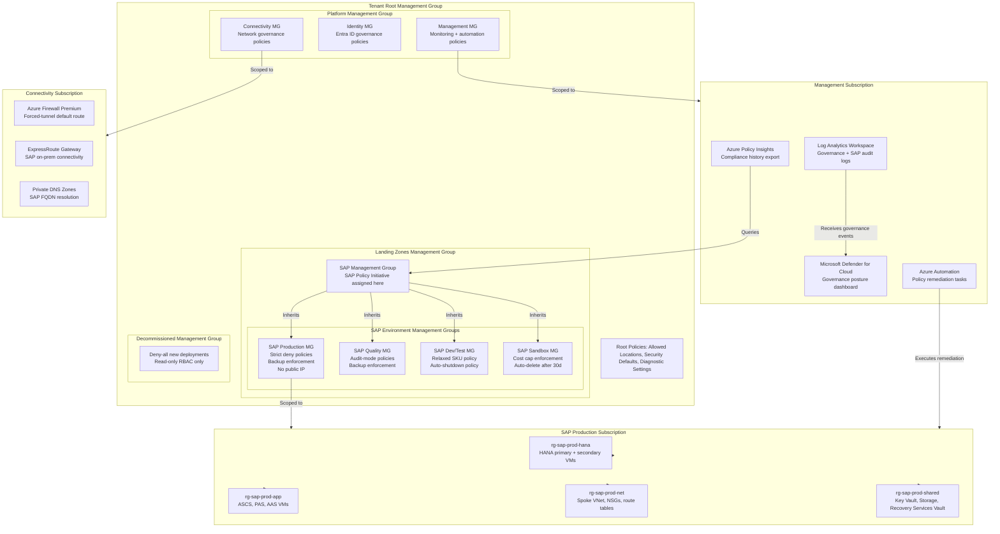
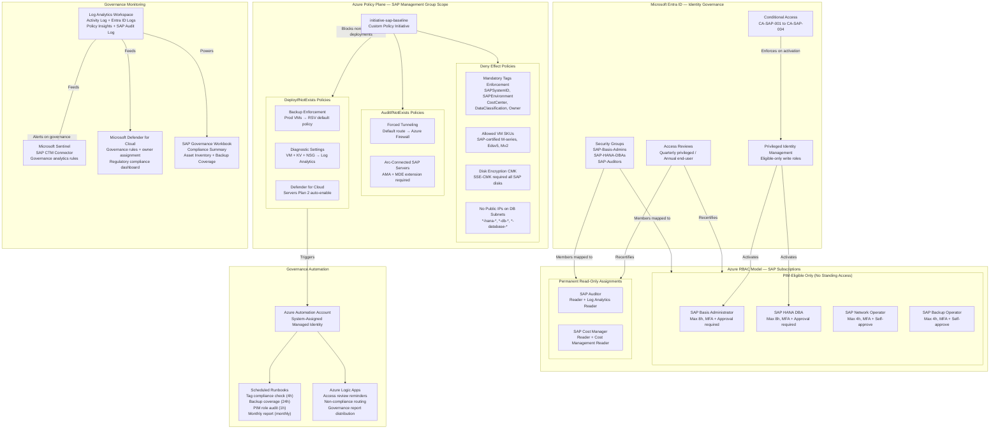

# SAP on Azure Governance Architecture

---

## Overview

Governance for SAP on Azure encompasses the policies, controls, and enforcement mechanisms that ensure SAP workloads remain compliant, secure, and cost-aligned from initial deployment through ongoing operations. The scope of this chapter covers the Azure control plane (Management Group hierarchy, Azure Policy, Azure Role-Based Access Control, Microsoft Entra ID governance) and the SAP application plane (transport governance, authorization concepts, SAP GRC alignment, SAP audit logging). These two planes are governed independently but must be aligned: a change that is approved at the SAP transport level must also pass Azure resource policy constraints, and a privileged Azure role assignment requires the same just-in-time approval workflow as a temporary SAP_BASIS profile assignment. Governance failures in either plane independently constitute a compliance violation under SOC 2 Type II, ISO 27001, and GDPR.

Azure Policy is the primary enforcement mechanism for the Azure control plane. All SAP subscriptions are placed under a dedicated SAP Management Group where custom policy initiatives enforce SAP-specific constraints: allowed VM SKUs from the SAP-certified list, mandatory disk encryption, required resource tags for cost allocation, network topology protection (no internet-routable public IPs on SAP database subnets), and backup policy enforcement. Policy effects range from Audit (for controls where enforcement would break existing deployments during transition) to Deny (for controls that must never be violated, such as unencrypted disks on HANA VMs) to DeployIfNotExists (for controls that require a companion resource, such as enabling Microsoft Defender for Cloud on all SAP VMs at subscription enrollment). Compliance state is tracked in the Azure Policy compliance dashboard and published as a metric to Azure Monitor for alerting when compliance drops below threshold.

The enterprise control plane for SAP on Azure integrates Azure governance tools with SAP's own governance frameworks: SAP Solution Manager for transport route management and system landscape governance, SAP GRC Access Control for segregation-of-duties enforcement and periodic access recertification, and SAP Audit Information System (AIS) for audit trail collection. Microsoft Entra ID Privileged Identity Management (PIM) bridges the Azure and SAP identity planes by requiring just-in-time elevation for both Azure infrastructure roles and the SAP_BASIS emergency access profiles. All governance events from both planes are forwarded to a central Log Analytics workspace that feeds Microsoft Sentinel with the SAP Continuous Threat Monitoring connector, providing a unified governance audit trail across the full stack.

---

## Architecture Overview

The SAP on Azure governance architecture is organized into four layers that collectively enforce the principle that no SAP workload change — whether infrastructure or application — can be made without passing through an auditable approval gate. The first layer is the Azure Management Group and subscription hierarchy, which provides the structural container for all Azure Policy and RBAC assignments. The second layer is the Azure Policy initiative stack, which enforces resource configuration constraints through policy effects applied at management group scope so that all current and future subscriptions inherit them automatically. The third layer is the identity governance layer, which uses Microsoft Entra ID PIM, access reviews, and Conditional Access to enforce least-privilege access with time-bounded elevation. The fourth layer is the SAP application governance layer, which uses SAP GRC, SAP Solution Manager ChaRM, and SAP Security Audit Log to enforce change control and authorization management within the SAP application itself.

The governance architecture separates concerns across three subscription types: the Management subscription hosts the governance control plane components (Log Analytics workspaces, Azure Automation, Microsoft Defender for Cloud), the Connectivity subscription hosts shared network infrastructure subject to its own network governance policies, and the SAP subscriptions (one per environment tier: Production, Quality, Development, Sandbox) host the actual SAP workloads subject to the full SAP policy initiative. This subscription-per-environment model ensures that policy assignments targeting a specific environment tier (for example, stricter backup enforcement on Production) can be scoped without affecting lower environments, while baseline security policies inherited from the root Management Group apply universally.

Azure Resource Graph provides the governance inventory plane. It indexes all SAP-tagged resources across subscriptions and is queried by Kusto queries in Azure Monitor workbooks to produce the SAP estate inventory: which VMs are running SAP workloads, which are covered by backup policies, which have non-compliant disk configurations, and which resource groups are missing mandatory cost-allocation tags. Resource Graph queries are executed on a scheduled basis by Azure Logic Apps that publish findings to the governance dashboard and trigger remediation workflows for DeployIfNotExists policies where auto-remediation is enabled.

The governance framework treats infrastructure-as-code as the authoritative source of truth. All Azure resources are deployed through Azure DevOps or GitHub Actions pipelines that enforce policy compliance checks (using `az policy` or the Azure Policy GitHub Action) before any deployment reaches production. The concept of policy-as-code means that the same Bicep definitions that describe the resource configuration also describe the policy assignments that govern it, stored in the same repository and subject to the same pull-request approval workflow. Drift from declared state is detected by Azure Policy's `DeployIfNotExists` and `Modify` effects, and by Azure Automation Change Tracking, which alerts on configuration changes to SAP VMs that were not made through the approved pipeline.

### Architecture Diagram: SAP on Azure Governance Hierarchy



---

## SAP Architecture

### SAP Basis Governance

SAP Basis governance defines the rules under which SAP infrastructure administrators operate within the Azure-hosted SAP landscape. Each SAP system has a designated System Administrator (SA) who holds permanent SAP_BASIS profile assignment in the non-production systems for day-to-day operations but must use emergency access procedures (a firefighter ID governed by SAP GRC Access Control's Superuser Privilege Management) for production system Basis operations. The firefighter ID is time-limited, session-logged, and triggers an automatic notification to the SAP system owner and the security team.

SAP Basis activities that modify system parameters (transaction RZ10, RZ11), transport routes (transaction STMS), kernel patches (transaction SPAM), or RFC connections (transaction SM59) are classified as Change Category 2 changes under the enterprise change management policy. They require a Service Now change ticket with SAP Basis approval and must be executed within an approved maintenance window. Azure-level changes to the underlying VMs (VM size changes, disk modifications, OS patching) follow the same change category and must be correlated with a transport-layer freeze or maintenance window in SAP Solution Manager ChaRM to prevent overlapping changes.

Kernel and support package patch governance follows SAP's quarterly patch cycle. SAP HANA database revisions and SAP kernel patches are applied to non-production systems first, with a two-week stabilization period before production patching. Azure Update Manager is integrated with the patching workflow: VM OS patches are coordinated with SAP kernel maintenance to avoid conflicting maintenance windows that could require a double reboot cycle. Patch compliance is tracked in Microsoft Defender for Cloud's regulatory compliance dashboard under the "SAP Baseline" custom standard.

### SAP Transport Governance

The SAP transport governance model controls the promotion of ABAP code, configuration, and customizing through the system landscape: Development (DEV) → Quality Assurance (QA) → Production (PRD). Transport governance is enforced through SAP Solution Manager Change Request Management (ChaRM) in conjunction with the enterprise change management process. No direct transport imports to production are permitted outside of ChaRM; the STMS transport routes are configured so that DEV exports to the shared transport directory but PRD import queues are locked to manual import triggered only from ChaRM.

Azure governance enforces transport governance indirectly through two mechanisms. First, the SAP transport directory (typically `/usr/sap/trans`) is hosted on Azure NetApp Files or an Azure Premium Files share, and access to that share from outside the approved SAP application VMs is restricted by Private Endpoint and NSG rules — preventing unauthorized file-level manipulation of transport files. Second, SAP Security Audit Log events for transport-related transactions (SE09, SE10, STMS, SCTS) are forwarded to Microsoft Sentinel via the SAP Continuous Threat Monitoring connector, where analytics rules alert on transports imported to production outside of approved ChaRM tickets.

Emergency transport procedures — required when a production outage demands an unplanned transport — follow a documented break-glass process: the requestor creates an emergency change in Service Now, the SAP Basis administrator uses the firefighter ID in SAP GRC Access Control to temporarily unlock the PRD import queue, the transport is imported and documented, and the firefighter session log is reviewed within 24 hours by the SAP security team. Azure Policy compliance is checked after every emergency change to confirm that no persistent policy violations were introduced.

### SAP Authorization Concept

The SAP authorization concept defines the role structure, segregation-of-duties (SoD) rules, and access recertification process for the Azure-hosted SAP landscape. The role model uses SAP single roles (generated with Profile Generator, transaction PFCG) assembled into composite roles that reflect job functions. Role design follows the principle of least privilege: each role grants access to exactly the transactions, authorization objects, and field-value ranges required for the job function, with no excess authorizations.

Segregation of duties is enforced by SAP GRC Access Control's Access Risk Analysis (ARA) component. The SoD ruleset is maintained by the SAP Security team and reviewed quarterly. Any user provisioning that introduces an SoD conflict requires a formal risk acknowledgment and compensating control documentation before the access is granted. Access requests flow through the SAP GRC Business Role Management (BRM) module integrated with Service Now: the requestor selects a business role from the catalog, the system performs a simulation risk analysis, and the approver sees both the business justification and the SoD risk before granting access.

Periodic access recertification is conducted quarterly for production system Basis and developer roles, and annually for end-user roles. Microsoft Entra ID Access Reviews govern Azure RBAC role assignments on SAP subscriptions, running on the same quarterly schedule as the SAP GRC access review campaigns. Review findings from both planes are consolidated into a governance report reviewed by the SAP System Owner and Information Security Officer.

### SAP Audit Architecture

SAP audit logging is configured through SAP Security Audit Log (SM19) to capture security-relevant events: logon/logoff, failed logon attempts, transaction start, RFC calls, user and role administration changes, and system parameter changes. The profile parameter `rsau/enable` is set to 1 on all production systems. Audit logs are written to the local audit file and forwarded in real time to Microsoft Sentinel via the SAP Continuous Threat Monitoring connector (the Microsoft Sentinel SAP data connector), which uses the SAP RFC interface to pull events from the RSAU* tables.

In addition to the Security Audit Log, SAP Change Document Log (transaction SCU3, SCUL) captures changes to business configuration objects, and ABAP Workbench audit trails (SE01, SE09) capture developer activity. These logs are forwarded to the central Log Analytics workspace where retention is set to 365 days (online) with 7-year archival to Azure Storage (cold tier) to meet regulatory retention requirements under GDPR Article 30 and SOC 2 Type II audit evidence requirements.

The SAP Audit Information System (AIS, transaction SECR) is configured to generate standard SAP audit reports for user master data, authorization changes, and system configuration changes. These reports are scheduled monthly and exported to a SharePoint site accessible to internal audit. The AIS configuration is itself governed — changes to AIS report schedules require a change ticket to prevent audit evidence gaps.

### SAP GRC Alignment

SAP GRC Access Control is deployed in the landscape as a centralized component serving all SAP production systems. The GRC system runs on a dedicated SAP NetWeaver ABAP stack in the Management subscription, separated from productive SAP systems to ensure that GRC availability does not depend on the systems it governs. SAP GRC is integrated with Microsoft Entra ID via SAML 2.0 SSO for the GRC self-service portal (Access Request Management), ensuring that GRC portal access requires the same Conditional Access policy enforcement (MFA, compliant device) as all other SAP Fiori access.

GRC Process Control is used to document and test IT general controls (ITGCs) for the SAP landscape. Control testing evidence — system-generated reports from SAP and Azure — is uploaded to GRC Process Control via the automated control testing framework, reducing manual evidence collection. GRC Risk Management maintains the SAP IT risk register, with risks linked to Azure security findings from Microsoft Defender for Cloud, ensuring that Azure-level risks are tracked within the same GRC framework as SAP-level risks.

### SAP Notes Reference for Governance Architecture

| SAP Note | Title | Architecture Impact | Where Applied |
|---|---|---|---|
| 2131662 | Superuser Privilege Management in SAP GRC Access Control | Defines firefighter ID configuration for emergency SAP Basis access | SAP GRC Access Control, all production systems |
| 2754200 | SAP Security Audit Log: New Features in S/4HANA | Enables enhanced audit log event classes for S/4HANA governance | SM19 configuration, SAP S/4HANA production |
| 1580943 | SAP Security Audit Log: Central configuration | Describes rsau/* profile parameter requirements for audit completeness | All SAP ABAP systems, profile parameter management |
| 2873965 | SAP GRC Access Control 12.0 integration with SAP Identity Authentication Service | Required for Entra ID-backed SSO to GRC self-service portal | SAP GRC 12.0, Microsoft Entra ID SAML integration |
| 2973497 | Central Note for SAP Identity Governance | Defines role lifecycle management integration between SAP IDG and GRC | SAP Identity Governance deployment, HR system integration |
| 1899182 | Security Recommendations for SAP HANA | HANA-level authorization and audit configuration for governance | SAP HANA system administration, tenant database governance |
| 2477204 | SAP HANA Tenant Databases — Combined Auditing | Configures combined audit trail for HANA multi-tenant architectures | SAP HANA MDC deployments, database audit policies |
| 3089413 | SAP S/4HANA Business Roles and Authorization Concept | Defines SAP Fiori role templates for S/4HANA least-privilege role design | PFCG role design, SAP Fiori launchpad authorization |

---

## Azure Architecture

### Management Group Hierarchy for SAP

The Management Group hierarchy for SAP is a four-level structure: Tenant Root → Platform/Landing Zones (level 2) → SAP Management Group (level 3) → SAP Environment Management Groups (level 4). This structure is aligned with the Cloud Adoption Framework enterprise-scale landing zone architecture, with SAP-specific customization at level 3 and below.

The SAP Management Group at level 3 is the primary assignment scope for the SAP Policy Initiative. All subscriptions that host SAP workloads — regardless of environment — are direct children of the SAP-environment-level management groups at level 4, inheriting policies both from the SAP MG and from the parent Landing Zones MG above it. This inheritance model means that platform-wide security policies (allowed locations, diagnostic settings, Microsoft Defender for Cloud auto-provisioning) are enforced by the platform team and cannot be overridden at the SAP level, while SAP-specific policies are maintained by the SAP architecture team independently.

The Decommissioned Management Group is a sibling of the Landing Zones MG and serves as the destination for SAP subscriptions that are being wound down. Moving a subscription to the Decommissioned MG automatically applies a Deny-all policy for new resource deployments, ensuring no new workloads are provisioned on a subscription that is being decommissioned, while read access for audit and evidence collection is preserved.

### Subscription Design

Each SAP environment tier has a dedicated Azure subscription: SAP Production, SAP Quality (QA), SAP Development, and SAP Sandbox. The production/non-production split at the subscription level serves three governance purposes: Azure Policy assignments with stricter effects (Deny vs. Audit) can be scoped to production only; Azure RBAC assignments can be scoped to prevent developers from having any access to the production subscription; and Azure Cost Management budget alerts can be configured independently per environment without cross-contamination of cost data.

Within each subscription, resources are organized into resource groups aligned with SAP system components: one resource group per SAP SID (System ID) for application-layer resources, one for database-layer resources, one for networking resources, and one for shared resources (Key Vault, Storage, Recovery Services Vault). This resource group model enables granular RBAC assignments — the HANA DBA team can be assigned the HANA DBA custom role scoped to the database resource group without gaining access to application-layer resources.

A dedicated Connectivity subscription hosts shared network infrastructure (hub VNet, Azure Firewall, ExpressRoute Gateway, Private DNS zones) and is governed by network-specific policies assigned at the Connectivity MG level. SAP subscriptions peer to the hub VNet through VNet peering, with the peering managed centrally by the platform network team using Azure Policy `DeployIfNotExists` to enforce correct peering configuration. SAP subscriptions are not permitted to create their own VPN Gateways or independent internet egress — enforced by Deny policies at the SAP MG level.

### Azure Policy Assignments for SAP Workloads

Azure Policy assignments are organized into three tiers of scope within the SAP governance model. Tier 1 assignments are made at the Tenant Root Management Group level by the platform team and cover universal security controls. Tier 2 assignments are made at the SAP Management Group level and cover SAP-specific controls applicable to all SAP environments. Tier 3 assignments are made at the environment-specific management group level (SAP Production MG, SAP Dev/Test MG) and implement environment-specific stringency differences.

Tier 2 SAP-specific policy assignments include: allowed VM SKU list (SAP-certified M-series, Edsv5, Mv2 families), mandatory tag enforcement (SAPSystemID, SAPEnvironment, CostCenter, DataClassification, Owner), disk encryption enforcement (SSE with CMK required on all managed disks attached to SAP-tagged VMs), private endpoint enforcement for Key Vault and Storage accessed by SAP workloads, backup policy enforcement (Azure Backup policy must be applied to all production SAP VMs within 24 hours of deployment), and network policy enforcement (no public IP addresses on HANA subnet resources).

Policy compliance state is exported from Azure Policy Insights to a Log Analytics workspace where it feeds a governance dashboard. Compliance trend data is retained for 90 days in Log Analytics and exported monthly to Azure Storage for annual audit evidence. When compliance drops below 95% for any Deny-effect policy, an alert fires to the SAP governance team's Service Now queue with the list of non-compliant resources.

### Azure Blueprints and Deployment Environments

Azure Deployment Environments is used to provide self-service, policy-compliant environment provisioning for SAP development and sandbox tiers. Development teams request a new SAP development environment through a catalog in Azure Deployment Environments; the catalog entry invokes a Bicep template that deploys the full SAP development landing zone (VNet peering, resource groups, RBAC assignments, Key Vault, storage) in a configuration pre-validated against the SAP policy initiative. This removes the need for developers to understand Azure Policy constraints while ensuring that self-service environments are compliant by construction.

For production and quality environments, Azure Blueprints (or their successor, policy-backed Bicep deployment stacks) define the authoritative infrastructure configuration. The blueprint definition is stored in the governance repository and versioned; subscription enrollment to a new SAP environment requires a blueprint assignment approval from the SAP Platform Architect. Blueprint assignments are audited: any drift between the assigned blueprint and the current subscription state is detected by Azure Policy and reported in the compliance dashboard.

### Resource Graph for SAP Inventory

Azure Resource Graph is the inventory backbone for SAP governance. The following Kusto queries are executed on a scheduled basis to maintain the SAP estate inventory:

**SAP VM inventory by environment:**
```kusto
Resources
| where type == "microsoft.compute/virtualmachines"
| where tags['SAPSystemID'] != ""
| project name, resourceGroup, subscriptionId,
    sapSID = tags['SAPSystemID'],
    sapEnv = tags['SAPEnvironment'],
    vmSize = properties.hardwareProfile.vmSize,
    location
| order by sapEnv, sapSID
```

**Non-compliant disk encryption:**
```kusto
Resources
| where type == "microsoft.compute/disks"
| where tags['SAPSystemID'] != ""
| where properties.encryption.type != "EncryptionAtRestWithCustomerKey"
| project name, resourceGroup, subscriptionId,
    sapSID = tags['SAPSystemID'],
    encryptionType = properties.encryption.type
```

**SAP VMs without backup:**
```kusto
RecoveryServicesResources
| where type == "microsoft.recoveryservices/vaults/backupfabrics/protectioncontainers/protecteditems"
| where properties.workloadType == "VM"
| project vmId = tolower(properties.sourceResourceId), backupStatus = properties.lastBackupStatus
| join kind=rightouter (
    Resources
    | where type == "microsoft.compute/virtualmachines"
    | where tags['SAPSystemID'] != ""
    | project vmId = tolower(id), name, sapSID = tags['SAPSystemID']
) on vmId
| where isempty(backupStatus)
| project name, sapSID
```

These queries are embedded in Azure Monitor workbooks in the SAP Governance dashboard and are also used by the monthly governance report automation.

### RBAC Model

The SAP RBAC model uses custom Azure role definitions scoped to specific resource groups and is structured around SAP job functions rather than Azure technical roles. No standing Contributor or Owner assignments exist on production SAP subscriptions; all elevated access requires PIM activation with business justification and MFA.

**Custom Azure roles for SAP:**

| Role Name | Permissions | Scope | Justification |
|---|---|---|---|
| SAP HANA DBA | Read/write on HANA VM, ANF volumes, backup items in DB resource group | SAP production DB resource group | HANA DBAs manage database VMs and storage; no access to application layer |
| SAP Basis Administrator | Read on all SAP resources; Start/Stop/Restart VM actions on SAP VMs | SAP production subscription (activated via PIM only) | Basis admins need cross-resource visibility but elevation is time-bounded |
| SAP Network Operator | Read/write on SAP spoke VNet NSGs and route tables | SAP networking resource group | Allows NSG rule management without subscription-wide access |
| SAP Backup Operator | Backup contributor on Recovery Services Vault | SAP shared resource group | Allows backup job management without VM write access |
| SAP Cost Manager | Read on all SAP resources; Cost Management reader | SAP subscription | Allows cost analysis without infrastructure change capability |
| SAP Auditor | Reader on all SAP resources; Log Analytics reader | SAP subscription, Log Analytics workspace | Read-only audit access across the full SAP estate |

Permanent Reader assignments are permitted at subscription scope for the SAP Auditor and SAP Cost Manager roles. All write-capable roles are PIM-eligible only, with maximum activation duration of 8 hours, requiring manager approval for Basis Administrator and HANA DBA roles.

### Managed Identities

All SAP supporting infrastructure components that need to authenticate to Azure services use system-assigned or user-assigned managed identities, eliminating service principal secrets from the SAP environment. The following managed identity assignments are standard:

SAP backup proxy VMs use a user-assigned managed identity with Backup Contributor on the Recovery Services Vault and Storage Blob Data Contributor on the backup storage account. HANA VMs use a system-assigned managed identity with Key Vault Secrets User on the Key Vault, allowing the HANA hdbuserstore to retrieve credentials without storing them on disk. Azure Monitor Agent (AMA) on all SAP VMs uses a system-assigned managed identity with Monitoring Metrics Publisher on the Log Analytics workspace. Azure Automation accounts that execute governance remediation tasks use a system-assigned managed identity with scoped Contributor access on the resource groups they manage.

User-assigned managed identities are preferred over system-assigned for workloads where the same identity needs to be shared across multiple resources or where the identity lifecycle must be decoupled from the resource lifecycle (for example, a managed identity shared by a cluster of SAP application servers).

### Azure Arc for Hybrid SAP

For SAP systems that remain on-premises during a phased migration or as a permanent hybrid configuration, Azure Arc for Servers extends Azure governance controls to on-premises VMs. Arc-connected SAP servers appear in Azure Resource Graph and are subject to Azure Policy guest configuration policies (enforcing OS hardening baselines), Microsoft Defender for Cloud (extending vulnerability assessment and EDR to on-premises), and Azure Monitor Agent deployment for log forwarding to the central Log Analytics workspace.

Arc governance for hybrid SAP systems does not replace SAP-level governance (GRC, transport management, authorization) but adds the Azure control plane visibility that enables a unified governance dashboard spanning both cloud-native and on-premises SAP systems. The SAP Management Group policies include a specific assignment for Arc-connected servers: `AuditIfNotExists` checks that Arc-connected servers tagged as SAP workloads have the Azure Monitor Agent extension and Microsoft Defender for Endpoint extension deployed.

### Architecture Diagram: Azure Policy and RBAC Structure for SAP



---

## Governance Framework

### Azure Policy Initiative for SAP

The SAP Policy Initiative (`initiative-sap-baseline`) is a custom Azure Policy initiative containing the following policy definitions, assigned at the SAP Management Group scope:

**Required Tags Policy (Deny effect)**
- Policy: All resources in SAP subscriptions must have tags: `SAPSystemID`, `SAPEnvironment`, `CostCenter`, `DataClassification`, `Owner`.
- Effect: Deny — resource creation is blocked if any mandatory tag is missing or has an empty value.
- Exemption process: Resource groups used for transient deployment artifacts (e.g., ARM deployment resource groups) can be exempted by the SAP Platform Architect for a maximum of 72 hours.

**Allowed VM SKUs (Deny effect)**
- Policy: Virtual machines in SAP subscriptions may only use SKUs from the SAP-certified list: Standard_M8ms, Standard_M16ms, Standard_M32ms, Standard_M64ms, Standard_M128ms, Standard_M208ms_v2, Standard_M416ms_v2, Standard_E16ds_v5, Standard_E32ds_v5, Standard_E48ds_v5, Standard_E64ds_v5, Standard_E96ds_v5, Standard_E104ids_v5.
- Effect: Deny — VM deployments using uncertified SKUs fail at the ARM layer.
- Rationale: Only SAP-certified VM SKUs are permitted in production to comply with SAP Note 1928533 certification requirements.

**Disk Encryption Enforcement (Deny effect)**
- Policy: Managed disks attached to VMs tagged as SAP workloads must use Server-Side Encryption with Customer-Managed Key (SSE-CMK). Disk Encryption Sets must reference a Key Vault in the same subscription's approved Key Vault resource.
- Effect: Deny on disk creation; DeployIfNotExists to associate existing disks with a Disk Encryption Set where not already configured.

**Network Policy: No Public IPs on Database Subnets (Deny effect)**
- Policy: Public IP addresses may not be associated with network interfaces attached to VMs in subnets named `*-hana-*`, `*-db-*`, or `*-database-*` in SAP subscriptions.
- Effect: Deny — prevents accidental direct internet exposure of SAP database VMs.

**Network Policy: Forced Tunneling Required (AuditIfNotExists effect)**
- Policy: Route tables associated with SAP subnets must contain a default route (0.0.0.0/0) pointing to the Azure Firewall private IP in the hub VNet.
- Effect: AuditIfNotExists — flags route tables missing the forced-tunnel route for remediation. Deny effect not used here to avoid breaking emergency network changes during incidents.

**Backup Enforcement (DeployIfNotExists effect)**
- Policy: Virtual machines in SAP Production subscriptions tagged with `SAPEnvironment: Production` must be associated with an Azure Backup policy within the approved Recovery Services Vault. If no backup item exists for a VM, a backup item is created using the default SAP backup policy (daily backup, 35-day retention, weekly backup with 12-week retention, monthly backup with 12-month retention).
- Effect: DeployIfNotExists — auto-remediation creates the backup association.

**Diagnostic Settings Enforcement (DeployIfNotExists effect)**
- Policy: All VMs, Key Vaults, Storage Accounts, and Network Security Groups in SAP subscriptions must have diagnostic settings configured to send logs to the central Log Analytics workspace.
- Effect: DeployIfNotExists — creates diagnostic settings if missing.

**Microsoft Defender for Cloud Auto-Provisioning (DeployIfNotExists effect)**
- Policy: Microsoft Defender for Cloud Servers Plan 2 must be enabled on all SAP subscriptions. The Azure Monitor Agent and the Defender for Endpoint extension must be deployed on all SAP VMs.
- Effect: DeployIfNotExists — auto-enables the Defender plan and deploys extensions.

### Compliance Reporting via Azure Policy Compliance Dashboard

The Azure Policy compliance dashboard for the SAP Policy Initiative is configured as the primary compliance reporting tool for the SAP governance team. The dashboard shows overall compliance percentage per policy definition, per subscription, and per resource type. A compliance percentage below 95% for any Deny-effect policy triggers an automated alert to the SAP governance team.

Compliance data is exported monthly using the Azure Policy Insights REST API (`/providers/Microsoft.PolicyInsights/policyStates`) to a storage account, where it is ingested into a Power BI report for executive governance reporting. The report shows compliance trend over time, identifies the top 10 non-compliant resource types, and correlates non-compliance with change management tickets to identify whether non-compliance was authorized (exempt) or unauthorized (requiring remediation).

Azure Policy compliance history is retained for 90 days by the Azure platform. For longer-term compliance evidence required by SOC 2 Type II audits (12-month audit period), the monthly export to Azure Storage provides the historical record. The storage account containing compliance exports is WORM-protected (Write Once Read Many) using Azure Blob Storage Immutability with a 13-month retention lock, ensuring that compliance evidence cannot be modified after export.

### Regulatory Compliance for SAP: SOC 2, ISO 27001, and GDPR

**SOC 2 Type II Applicability:**
SOC 2 Type II requires continuous evidence of controls over a 12-month period. The SAP governance architecture addresses SOC 2 Trust Services Criteria as follows: CC6.1 (logical access controls) is evidenced by Entra ID PIM activation logs and SAP GRC access request logs; CC6.3 (access revocation) is evidenced by quarterly access reviews in Entra ID and SAP GRC; CC7.1 (change monitoring) is evidenced by Azure Policy compliance exports and SAP ChaRM transport logs; CC8.1 (change management) is evidenced by Service Now change records correlated with Azure Activity Log deployment events.

**ISO 27001:2022 Applicability:**
ISO 27001 Annex A controls relevant to SAP governance include A.5.15 (access control), A.5.18 (access rights management), A.5.23 (information security for use of cloud services), A.8.24 (use of cryptography), and A.8.32 (change management). The Azure Policy initiative enforces A.8.24 through CMK disk encryption requirements and A.8.32 through the deployment pipeline approval gates. ISO 27001 Statement of Applicability (SoA) entries referencing these controls cite this governance architecture document and the Azure Policy initiative definition as implementation evidence.

**GDPR Applicability:**
SAP systems hosting personal data (HR data in SAP HCM, customer data in SAP SD/CRM) are subject to GDPR Article 25 (data protection by design) and Article 32 (security of processing). The governance architecture addresses Article 25 by enforcing encryption by default (CMK policy), network isolation (no public IP policy), and least-privilege access (PIM-only elevated roles). Article 30 (records of processing activities) requires audit log retention — addressed by the 7-year archival policy for SAP Security Audit Log events in Azure Storage. Article 33 (breach notification within 72 hours) is supported by Microsoft Sentinel analytics rules that alert on SAP data exfiltration indicators within minutes of detection.

---

## Design Decisions

| Decision | Options Considered | Choice | Rationale | SAP/Azure Reference |
|---|---|---|---|---|
| Management Group depth for SAP | Flat (all SAP subs directly under Landing Zones MG) vs. four-level hierarchy with SAP MG and environment MGs | Four-level hierarchy: Root → Landing Zones → SAP MG → Environment MGs | Environment-level MGs allow Deny policies on Production without affecting Development; SAP MG provides single assignment scope for all SAP-wide policies | Azure CAF enterprise-scale landing zone; Azure Policy inheritance model |
| Policy effect for VM SKU enforcement | Audit vs. Deny | Deny | Audit mode allows non-compliant VMs to be created and potentially reach production state; SAP Note 1928533 certification is a hard requirement, not a recommendation | SAP Note 1928533; Azure Policy effect documentation |
| RBAC model for SAP Basis access | Permanent Contributor on SAP subscriptions vs. PIM-eligible Basis Administrator custom role | PIM-eligible custom role, no standing write access | Standing Contributor violates least-privilege and creates SOC 2 CC6.1 finding; PIM activation provides auditable just-in-time access with MFA verification | Azure AD PIM documentation; SOC 2 CC6.1 |
| Subscription topology | Single subscription for all SAP environments vs. per-environment subscriptions | Per-environment subscriptions (Prod, QA, Dev, Sandbox) | Subscription-level RBAC isolation prevents developers from accessing production; independent budget alerts and policy strictness per environment; Azure subscription quotas do not become a shared constraint | Azure subscription design guidance; Azure Policy scope |
| SAP transport directory hosting | On-premises NFS server vs. Azure NetApp Files vs. Azure Premium Files | Azure NetApp Files with Private Endpoint | ANF provides NFS v4.1 required by SAP transport system, sub-millisecond latency, and Private Endpoint for access control; no public network exposure of transport files | SAP Note 2015553; Azure ANF NFS documentation |
| GRC system placement | On-premises GRC vs. GRC in SAP landscape vs. dedicated GRC subscription | Dedicated GRC subscription within SAP Management Group | GRC availability must not depend on productive SAP systems; dedicated subscription with its own resource quotas and policies; GRC data (access logs, risk register) is governance-sensitive and should be isolated | SAP GRC system sizing guide; Azure subscription isolation |
| Policy compliance reporting | Native Azure Policy dashboard only vs. export to Log Analytics vs. export to external SIEM | Export to Log Analytics + Power BI report | Azure Policy dashboard lacks trend history beyond 90 days; Log Analytics enables custom KQL queries and integration with governance workbooks; Power BI enables executive reporting with RBAC-controlled access | Azure Policy Insights API; Log Analytics retention |
| Managed identity vs. service principals | Service principals with client secrets vs. managed identities for Azure resource access | Managed identities exclusively for SAP supporting infrastructure | Service principal secrets require rotation, are susceptible to secret leakage, and create compliance findings; managed identities eliminate secret management entirely for Azure-to-Azure authentication | Azure managed identity documentation; Microsoft Defender for Cloud secret rotation recommendation |

---

## SAP Notes Reference

| SAP Note | Title | Governance Relevance | Applicable Systems |
|---|---|---|---|
| 1928533 | SAP Applications on Azure: Supported Products and Azure VM Types | Authoritative list of SAP-certified Azure VM SKUs; basis for Allowed VM SKU policy | All SAP production systems |
| 2131662 | Superuser Privilege Management in SAP GRC Access Control | Firefighter ID configuration for emergency Basis access; governs break-glass procedures | SAP GRC Access Control, all production ABAP systems |
| 2754200 | Security Audit Log in SAP S/4HANA | Configuration of enhanced audit log event classes for S/4HANA; required for complete governance audit trail | SAP S/4HANA systems |
| 1580943 | SAP Security Audit Log: Central Configuration | Profile parameter `rsau/enable`, `rsau/max_diskspace/local`, and filter configuration for complete audit log coverage | All SAP ABAP systems |
| 1899182 | Security Recommendations for SAP HANA | HANA-level audit policy configuration, user administration restrictions, and password policy governance | SAP HANA databases |
| 2477204 | SAP HANA Tenant Databases — Combined Auditing | Audit policy configuration for HANA multi-tenant (MDC) deployments to ensure tenant-level audit completeness | SAP HANA MDC systems |
| 3089413 | SAP S/4HANA Business Roles and Authorization Concept | SAP Fiori business role templates for least-privilege role design in S/4HANA; used as basis for PFCG role catalog | SAP S/4HANA, SAP Fiori Launchpad |
| 2973497 | Central Note for SAP Identity Governance | Integration requirements for SAP Identity Governance with SAP GRC Access Control and SAP HR system | SAP Identity Governance, SAP GRC |
| 2382421 | Optimizing the Network Configuration on HANA and OS Level | Network configuration constraints relevant to governance of HANA VM network interfaces; prevents unauthorized interface additions | SAP HANA VMs |

---

## Azure Well-Architected Alignment

### Reliability

The governance architecture itself must be reliable: if governance tooling fails, the SAP estate must not become ungoverned. Azure Policy enforcement is built into the Azure Resource Manager control plane and does not depend on external services — Deny-effect policies continue to block non-compliant deployments even if the policy portal is unavailable. Microsoft Entra ID PIM is a global service with 99.99% SLA; PIM activation failures fall back to the pre-approved break-glass accounts documented in the emergency access procedure. The Log Analytics workspace uses a dedicated cluster or standard workspace with geo-redundant backup to ensure governance event retention survives a regional outage. Recovery Services Vault for the SAP backup governance data uses geo-redundant storage (GRS) by default.

The governance control plane (Log Analytics, Sentinel, Defender for Cloud) is hosted in the Management subscription in a primary Azure region, with cross-region replication of critical governance data (audit logs, policy compliance exports) to the paired region. If the Management subscription experiences a regional failure, the compliance export data in Azure Storage (GRS) is accessible from the paired region, and Sentinel has cross-workspace query capability to reconstruct governance visibility.

### Security

The governance architecture is itself a security-sensitive component: the policies, role assignments, and audit log configurations that govern the SAP estate must be protected against unauthorized modification. Azure Policy definitions and assignments are protected by Azure RBAC: only members of the SAP Platform Architecture security group (Policy Contributor role at the SAP Management Group) can create or modify policy assignments. Changes to policy assignments are logged in the Azure Activity Log and generate Sentinel analytics rule alerts for any policy assignment deletion or modification.

The Log Analytics workspace that receives SAP governance events is protected by its own RBAC model: the workspace uses workspace-level RBAC where SAP operators have table-level read access only to the tables relevant to their function, and write access is restricted to the Azure Monitor Agent managed identity. Log purge operations on the workspace require Owner-level PIM activation and trigger a critical Sentinel alert. Key Vault access policies for governance-related secrets (Disk Encryption Set keys, automation account certificates) follow the same managed identity model described in the Azure Architecture section.

### Cost Optimization

Governance tooling generates cost at several points: Log Analytics data ingestion and retention, Microsoft Defender for Cloud Servers Plan 2 per-VM licensing, and Azure Policy compliance data export to Storage. These costs are tracked under the `CostCenter: Governance` tag and separated from SAP workload costs. Log Analytics ingestion costs are controlled by configuring data collection rules (DCRs) on Azure Monitor Agent to collect only governance-relevant log tables from SAP VMs (Security, Syslog, WindowsEvent for security event IDs) rather than all available logs. Retention beyond 90 days is handled by archiving to Azure Storage (cold tier) at significantly lower cost than Log Analytics retention pricing.

Microsoft Defender for Cloud costs are allocated to the SAP subscription budget rather than the Management subscription to create accountability: if a SAP system team deploys additional VMs, they bear the incremental Defender cost, providing incentive to right-size the VM estate. The cost allocation is enforced through the `CostCenter` tag and Azure Cost Management budget alerts per subscription.

### Operational Excellence

Governance automation reduces toil and ensures consistency. The following governance operations are automated: policy remediation tasks run daily for DeployIfNotExists policies, triggered by Azure Automation runbooks; access review reminder notifications are sent to reviewers 7 days before the review deadline via Logic Apps integrated with Service Now; non-compliant resource alerts are routed to the owning SAP team's Service Now queue based on the `Owner` resource tag; and monthly governance reports are generated automatically and distributed to SAP System Owners via the Logic App report generation pipeline.

The governance-as-code principle ensures that all policy definitions, initiative assignments, and RBAC role definitions are stored in the governance repository and deployed through the CI/CD pipeline. No manual changes to policy assignments or RBAC configurations are made outside of the pipeline — enforced by the same pipeline-only deployment model that governs SAP infrastructure changes. This eliminates configuration drift in the governance layer and ensures that all governance changes are peer-reviewed, tested in non-production management groups first, and documented with a Service Now change ticket.

### Performance Efficiency

Governance overhead on SAP workloads must not degrade SAP performance. The governance tools that run on SAP VMs (Azure Monitor Agent, Microsoft Defender for Endpoint) are validated for SAP performance impact: AMA collects logs asynchronously and has negligible CPU and memory overhead. Microsoft Defender for Endpoint is configured with SAP-specific exclusions (SAP data directories, work directories, transport directories) as documented in the Microsoft Defender for Endpoint SAP configuration guidance, preventing false-positive I/O scanning of high-throughput SAP database files.

Azure Policy evaluation occurs server-side in the Azure control plane and has no performance impact on SAP VMs. Guest Configuration policies (which run inside the VM) are scheduled at low frequency (15-minute compliance scan intervals with a configurable jitter) and use minimal CPU resources. The guest configuration agent is configured to run at below-normal OS process priority on HANA VMs to prevent any interference with HANA's memory and CPU allocation.

---

## Security Architecture

### Microsoft Entra ID Governance

Microsoft Entra ID serves as the authoritative identity provider for all Azure resource access and for SAP Fiori SSO. The Entra ID tenant is configured with the following governance settings: Password Protection enabled with the SAP-specific banned password list (preventing SAP<SID>-pattern passwords); Self-Service Password Reset disabled for SAP admin accounts (requiring helpdesk-mediated resets with identity verification); and Conditional Access requiring MFA and compliant device for all access to the SAP Azure subscriptions and SAP Fiori endpoints.

Entra ID Identity Protection is configured to detect and respond to risky sign-ins for SAP system accounts. High-risk sign-in detections for accounts with SAP RBAC role assignments trigger an automatic PIM role deactivation and an alert to the SAP security team. Medium-risk sign-ins require step-up MFA for continued session access. Identity Protection risk policies are scoped to the security group containing all accounts with PIM-eligible SAP roles.

Entra ID Access Reviews are configured for all Azure RBAC role assignments on SAP subscriptions and for all PIM-eligible role assignments. Reviews run quarterly for privileged roles (SAP Basis Administrator, HANA DBA) and annually for read-only roles (SAP Auditor, SAP Cost Manager). Review results are exported to Log Analytics for compliance reporting. Accounts that are not reviewed within the review window are automatically removed from the eligible role assignments (auto-deny on no response).

### PIM for SAP Admin Roles

Privileged Identity Management is configured for all Azure RBAC roles that have write access on SAP subscriptions. PIM activation settings for SAP-specific roles:

- **SAP Basis Administrator**: Maximum activation duration 8 hours; requires MFA verification; requires business justification (Service Now change ticket number); requires approval from SAP Platform Architect or designated alternate.
- **SAP HANA DBA**: Maximum activation duration 8 hours; requires MFA verification; requires business justification; manager approval required.
- **SAP Network Operator**: Maximum activation duration 4 hours; requires MFA verification; requires business justification; no additional approval (self-approve with justification).
- **SAP Backup Operator**: Maximum activation duration 4 hours; requires MFA verification; requires business justification; no additional approval.

PIM activation events are forwarded to Log Analytics and trigger Sentinel analytics rules that correlate the PIM activation with subsequent Azure Activity Log events to verify that the activated role was used only for the stated purpose. Activations outside business hours (defined as 06:00–20:00 in the enterprise's primary time zone) trigger an additional notification to the SAP security team.

### Access Reviews

Entra ID Access Reviews are the primary mechanism for periodic revalidation of both Azure RBAC and PIM eligible assignments. Review configuration: Reviewers are the direct managers of the role holders for end-user roles, and the SAP Platform Architect for privileged roles. Duration is 14 days. Frequency is quarterly for privileged roles and annual for read-only roles. On completion, accounts with a "Deny" decision or no response are automatically removed.

SAP GRC access review campaigns are synchronized with the Entra ID access review schedule so that both platforms review access simultaneously, reducing reviewer fatigue and enabling the governance team to present a unified access recertification report. The synchronization is implemented through a Logic App that reads the SAP GRC review campaign schedule and creates a corresponding Entra ID access review at the same time.

### Conditional Access Policies for SAP

Conditional Access policies specific to SAP access:

**CA-SAP-001: Require MFA for SAP Fiori Access**
- Target users: All users assigned to SAP Fiori enterprise applications in Entra ID.
- Conditions: All locations (no trusted network exemption for SAP Fiori).
- Grant control: Require MFA + compliant device.

**CA-SAP-002: Block Legacy Authentication for SAP**
- Target users: All users.
- Conditions: Authentication flows using legacy protocols (basic auth, NTLM).
- Target applications: SAP NetWeaver ABAP enterprise app, SAP Fiori enterprise app.
- Grant control: Block.

**CA-SAP-003: Require Privileged Workstation for SAP Basis PIM Activation**
- Target users: Members of the SAP-Basis-Admins security group.
- Conditions: All locations.
- Grant control: Require MFA + Hybrid Entra ID Joined device + require compliant device (Intune MDM compliance policy with SAP workstation baseline applied).

**CA-SAP-004: Block SAP Access from High-Risk Locations**
- Target users: All users.
- Target applications: All SAP enterprise apps.
- Conditions: Named locations not in the approved country list.
- Grant control: Block.

### Just-in-Time VM Access

Microsoft Defender for Cloud Just-in-Time VM Access is configured for all SAP VMs to eliminate standing SSH/RDP access. JIT access requests for SAP VMs require:
- Service Now change ticket reference.
- MFA verification.
- Approval from the SAP Basis Administrator or SAP Platform Architect for production VMs.
- Maximum access duration of 4 hours per request.
- Source IP restriction to the requester's current public IP or the enterprise's Bastion subnet CIDR.

JIT access approval workflows are configured in Defender for Cloud with notifications sent to the SAP Basis team's Service Now queue. JIT access sessions are logged in the Defender for Cloud activity log and forwarded to Log Analytics. Bastion is the preferred access method for all SAP VM administrative access; JIT is used as a fallback when Bastion is unavailable.

### Microsoft Defender for Cloud Governance Posture

Microsoft Defender for Cloud is configured with a custom governance rule for the SAP subscription that assigns non-compliant security recommendations to the responsible SAP team based on resource tags. The governance rule maps `Owner` tag values to Defender for Cloud email notification recipients, ensuring that every unresolved security recommendation has an assigned owner with a remediation due date. Recommendations with a "High" severity have a 7-day remediation SLA; "Medium" severity have a 30-day SLA; "Low" severity have a 90-day SLA.

The Defender for Cloud regulatory compliance dashboard is configured with ISO 27001, SOC 2, and a custom "SAP Baseline" standard. The SAP Baseline standard includes checks specific to SAP workload configuration (HANA VM SKU compliance, disk encryption, backup coverage) that are not covered by the built-in regulatory standards. Compliance scores are exported to the governance Power BI report on a monthly basis.

Microsoft Defender for Cloud's attack path analysis is reviewed monthly by the SAP security team to identify cross-resource attack paths that traverse the SAP governance boundary — for example, a path that begins with a public internet exposure and leads to a HANA database VM. Identified attack paths are remediated as P1 security findings with a 48-hour SLA.

---

## Reliability and High Availability

### RPO and RTO Targets

| SAP Tier | RPO Target | RTO Target | HA Method | DR Method | Azure SLA Component |
|---|---|---|---|---|---|
| Tier 1: SAP S/4HANA Production (HANA DB) | < 15 minutes | < 4 hours | HSR SYNC + Pacemaker, AZ1-AZ2 | HSR ASYNC to paired region | Azure VM 99.99% (AZ), Azure ANF 99.99% |
| Tier 1: SAP S/4HANA Production (App Servers) | < 15 minutes | < 2 hours | Multiple PAS/AAS across AZs; ASCS/ERS Pacemaker cluster | Azure Site Recovery (RPO 15 min replication) | Azure VM 99.99% (AZ) |
| Tier 2: SAP BW/4HANA Production | < 30 minutes | < 6 hours | HSR SYNC + Pacemaker, AZ1-AZ2 | Azure Backup + HSR ASYNC | Azure VM 99.99% (AZ) |
| Tier 3: SAP Quality/Pre-Production | < 4 hours | < 8 hours | Single-zone deployment; VM restart via Azure platform | Azure Backup restore from daily snapshot | Azure VM 99.9% (single zone) |
| Tier 4: SAP Development | < 24 hours | < 24 hours | No HA; best-effort VM restart | Azure Backup restore | Azure VM 99.9% |
| Tier 5: SAP Sandbox | Best effort | Best effort | No HA; no DR | No dedicated DR (rebuilt from catalog) | Azure VM 99.5% |
| Governance Control Plane (Log Analytics, Sentinel) | < 5 minutes (event ingestion) | < 1 hour (workspace failover) | Zone-redundant workspace or dedicated cluster | Cross-workspace query to secondary region workspace | Log Analytics 99.9% |

### Governance Control Plane HA Considerations

The governance control plane is not itself a SAP-tier workload but its availability directly affects the ability to detect and respond to SAP governance events. Log Analytics workspace failures are mitigated by the 90-day local retention buffer in the Azure Monitor Agent on each SAP VM: if the workspace is unavailable, AMA buffers up to 5 GB of log data locally before beginning to drop events. Sentinel analytics rules are evaluated against the Log Analytics workspace and do not generate alerts during workspace outages; the Sentinel workspace health workbook alerts when rule evaluation latency exceeds 15 minutes.

Azure Automation accounts used for policy remediation are deployed with a system-assigned managed identity and have no dependency on SAP VMs or the SAP spoke VNet — they communicate with Azure Resource Manager through the Azure backbone. Automation runbook failures are alerted through Azure Monitor action groups and are retried automatically up to three times before generating a Service Now incident for the governance team.

---

## Cost Optimization

### Governance Cost Optimization Strategies

| Optimization | Estimated Saving | Implementation Complexity | Prerequisites |
|---|---|---|---|
| Configure Data Collection Rules to ingest only security and governance tables (Security, Syslog security facility, WindowsEvent 4624/4625/4648/4688) from SAP VMs instead of all tables | 40–60% reduction in Log Analytics ingestion cost for SAP VMs | Medium (DCR authoring per VM OS type, testing for missed events) | Azure Monitor Agent deployed on all SAP VMs; DCR per SAP VM role type |
| Archive Log Analytics data beyond 90 days to Azure Storage (cold tier) instead of retaining in Log Analytics interactive tier | 85–90% reduction in log retention cost for data aged 90–2555 days | Low (configure workspace archive settings) | Log Analytics workspace; Azure Storage account with immutability lock |
| Use Azure Policy Audit effect instead of DeployIfNotExists for non-production environments where auto-remediation is not required | Eliminates Azure Automation run cost for non-production remediation tasks | Low (duplicate policy initiative with modified effects for non-production MG) | Separate policy initiative for non-production environments |
| Consolidate Log Analytics workspaces to a dedicated cluster for large estates (>500 GB/day ingestion) | 25% ingestion cost reduction via cluster commitment tier | High (workspace migration, sentinel reconfiguration) | Log Analytics dedicated cluster (100 GB/day minimum); workspace migration planning |
| Right-size Microsoft Defender for Cloud Servers Plan 2 to Servers Plan 1 on non-production SAP VMs | ~50% Defender cost reduction on non-production VMs | Low (Defender plan per subscription via policy) | Confirm Servers Plan 1 meets compliance requirements for non-production |
| Use Azure Reservations for governance compute (Automation workers, Sentinel workspace VMs if using dedicated cluster) | 30–40% compute cost reduction on committed governance infrastructure | Low (1-year or 3-year reservation purchase) | Stable governance infrastructure sizing; financial approval for commitment |

### Cost Governance Enforcement

Azure Cost Management budgets are configured at subscription level for each SAP subscription, with thresholds at 80% (forecast alert) and 100% (actual spend alert). Budget alerts route to the SAP System Owner and the Cost Manager role holder for the subscription. Azure Cost Management anomaly detection is enabled on all SAP subscriptions to catch unexpected cost spikes that may indicate unauthorized resource deployments or runaway automation.

The `CostCenter` mandatory tag is enforced by the SAP Policy Initiative and enables cost allocation reports in Azure Cost Management to be split by cost center, enabling accurate chargeback to the business units that own each SAP system. The `SAPSystemID` tag enables cost reports to be broken down by SAP SID, allowing the infrastructure cost of each SAP system to be tracked independently.

---

## Operations and Monitoring

### Azure Policy Compliance Monitoring

Azure Policy compliance is monitored through a combination of the Azure Policy compliance dashboard, Log Analytics queries on the PolicyInsights data source, and automated alerts. The following monitoring configuration is standard:

Policy compliance data is ingested into Log Analytics using the Azure Policy Insights diagnostic setting. The `AzurePolicyInsights` Log Analytics solution (or its replacement, the Policy Insights data connector) is enabled on the governance workspace. A saved query detects compliance state changes for Deny-effect policies:

```kusto
PolicyInsights
| where TimeGenerated > ago(24h)
| where PolicyEffect == "deny"
| where ComplianceState == "NonCompliant"
| summarize count() by PolicyDefinitionName, ResourceType, SubscriptionId
| where count_ > 0
```

This query runs on a 4-hour schedule and routes alerts to the SAP governance team's Service Now queue via an Azure Monitor action group.

### Azure Monitor Governance Dashboards

The SAP Governance Azure Monitor workbook contains the following tabs:
- **Compliance Summary**: Policy compliance percentage by initiative, by subscription, and trend over 30 days.
- **SAP Asset Inventory**: Table of all SAP-tagged resources from Resource Graph, with compliance indicators.
- **Backup Coverage**: SAP VMs with and without backup policy associations, last backup status, and any backup failures.
- **Access Activity**: PIM activation events, Conditional Access policy match/block events, and SAP Security Audit Log sign-on failures from Sentinel.
- **Cost Allocation**: Azure Cost Management data by SAPSystemID and CostCenter tags, with budget consumption gauges.

The workbook is pinned to the shared dashboard in the Azure portal for the SAP Platform Architecture and SAP Basis teams.

### Log Analytics for Governance Events

The following governance-relevant data sources are configured in the Log Analytics workspace:

| Data Source | Collection Method | Retention | Primary Use |
|---|---|---|---|
| Azure Activity Log (SAP subscriptions) | Diagnostic setting → workspace | 90 days interactive, 2 years archive | Azure resource change auditing, unauthorized deployment detection |
| Microsoft Entra ID Audit Logs | Entra ID diagnostic setting → workspace | 90 days interactive, 7 years archive | Access review evidence, PIM activation log, role assignment changes |
| Microsoft Entra ID Sign-In Logs | Entra ID diagnostic setting → workspace | 90 days interactive, 1 year archive | Conditional Access enforcement evidence, sign-in anomaly detection |
| SAP Security Audit Log | SAP Continuous Threat Monitoring connector | 90 days interactive, 7 years archive | SAP application-level governance evidence, SOC 2 CC6.1 |
| Azure Policy Insights | PolicyInsights diagnostic | 90 days interactive, 13 months archive | Policy compliance evidence, SOC 2 CC7.1 |
| Defender for Cloud Security Alerts | Defender for Cloud connector | 90 days interactive, 1 year archive | Security posture evidence, ISO 27001 A.8.16 |
| Automation Job Logs | Automation diagnostic setting → workspace | 30 days interactive | Remediation task auditing, failed remediation alerting |

### Automation for Drift Detection

Azure Automation is used to detect and remediate governance drift on a scheduled basis. The following runbooks are deployed in the governance Automation account:

**Check-SAPTagCompliance.ps1**: Runs every 4 hours. Queries all SAP-tagged resources using Resource Graph and identifies resources missing mandatory tags. Creates Service Now incidents for resources missing tags for more than 2 hours (allowing for deployment pipeline tag propagation delay).

**Check-SAPBackupCoverage.ps1**: Runs every 24 hours. Identifies SAP Production VMs not associated with a backup policy. Attempts auto-remediation by creating a backup item using the default SAP backup policy. If remediation fails, creates a P2 Service Now incident.

**Check-SAPPIMRoleCleanup.ps1**: Runs every hour. Identifies any permanent (non-PIM-eligible) write-capable role assignments on SAP subscriptions that were not made through the approved pipeline. Creates a P1 Service Now incident and triggers a Sentinel alert for investigation.

**Export-SAPGovernanceReport.ps1**: Runs monthly on the 1st at 02:00 UTC. Generates the governance report (policy compliance snapshot, access review status, backup coverage) and uploads to the SharePoint governance site.

### Alert Configuration

| Alert Name | Metric/Signal | Threshold | Severity | Runbook |
|---|---|---|---|---|
| SAP Policy Compliance Drop | Azure Policy compliance percentage (custom metric from KQL) | < 95% for any Deny-effect policy | Sev 1 | Runbook: Investigate-PolicyNonCompliance.ps1; Service Now P2 |
| SAP VM Backup Failure | AzureBackupReport (BackupItemType == VM, BackupManagementType == AzureVM, Status == Failed) | Any failure on SAP-tagged VM | Sev 2 | Runbook: Retry-SAPBackup.ps1; Service Now P3 |
| SAP PIM Activation Outside Hours | Entra ID Audit Log (activateRole outside 06:00–20:00 local time) | Any activation | Sev 2 | Notify SAP security team; investigate within 1 hour |
| Unauthorized Policy Assignment Change | Azure Activity Log (Microsoft.Authorization/policyAssignments/write or delete, caller not in approved pipeline service principal) | Any event | Sev 1 | Sentinel incident created; Service Now P1 |
| SAP Security Audit Log Gap | SAP Continuous Threat Monitoring connector heartbeat | No events received for > 15 minutes from any production SAP SID | Sev 1 | Runbook: Check-SAPConnectorHealth.ps1; Service Now P2 |
| HANA VM Disk Encryption Non-Compliant | Azure Policy compliance (SSE-CMK policy, SAP HANA resource group) | Any non-compliant disk | Sev 1 | Runbook: Remediate-DiskEncryption.ps1; Service Now P1 |
| SAP Subscription Cost Budget Exceeded | Azure Cost Management (actual spend > 100% of monthly budget) | Budget threshold breach | Sev 3 | Notify SAP System Owner and Cost Manager; Service Now P4 |
| Entra ID Risky Sign-In for SAP Role Holder | Identity Protection (RiskLevel == High, user in SAP-Admin-Groups) | Any high-risk sign-in | Sev 1 | Auto-revoke PIM activations; notify security team; Service Now P1 |

---

## Landing Zone Mapping

The governance architecture maps directly to the Azure Landing Zone for SAP defined in the `landing-zone.md` chapter. The following components of the landing zone are governed by this architecture:

**Management Group structure** (landing-zone.md section: Management Group Hierarchy): The hierarchy defined in this chapter is identical to the one implemented in the landing zone Bicep templates in `bicep/management-groups/`. The SAP Management Group and environment sub-groups are deployed as part of landing zone provisioning.

**Subscription vending** (landing-zone.md section: Subscription Design): New SAP subscriptions are vended by the subscription vending process, which applies the SAP Policy Initiative assignment and baseline RBAC role assignments defined in this chapter as part of the vending pipeline.

**Azure Policy assignments** (landing-zone.md section: Azure Policy): The SAP Policy Initiative (`initiative-sap-baseline`) defined in this chapter is assigned in the landing zone Bicep at `bicep/policy/assignments/sap-baseline-assignment.bicep`. Changes to the initiative require a pull request to the governance repository with SAP Platform Architect approval.

**Networking governance** (networking.md, landing-zone.md section: Hub-Spoke Topology): The forced-tunnel policy and no-public-IP policy defined in this chapter enforce the hub-spoke topology described in the networking and landing zone chapters. The policy definitions reference the hub VNet resource ID as a parameter, which is output by the connectivity subscription Bicep deployment.

**Identity and access** (security.md section: Microsoft Entra ID): The PIM role assignments, Conditional Access policies, and access review configuration defined in this chapter extend the Entra ID configuration described in the security chapter. The security chapter addresses the SSO and authentication architecture; this chapter addresses the governance and lifecycle management of those access mechanisms.

**Monitoring** (operations.md section: Azure Monitor): The governance dashboards and alert rules defined in this chapter are deployed as extensions of the SAP monitoring architecture described in the operations chapter. The governance Log Analytics workspace is the same workspace used for SAP operational monitoring — governance and operational data coexist in the same workspace with table-level RBAC controlling access.

---

## Microsoft References

The following Microsoft documentation URLs are authoritative references for the governance architecture described in this chapter:

1. **Azure Policy overview and effects**: https://learn.microsoft.com/en-us/azure/governance/policy/overview
2. **SAP on Azure landing zone accelerator**: https://learn.microsoft.com/en-us/azure/cloud-adoption-framework/scenarios/sap/enterprise-scale-landing-zone
3. **Azure Management Group hierarchy**: https://learn.microsoft.com/en-us/azure/governance/management-groups/overview
4. **Microsoft Entra ID Privileged Identity Management**: https://learn.microsoft.com/en-us/entra/id-governance/privileged-identity-management/pim-configure
5. **Azure Policy for SAP on Azure**: https://learn.microsoft.com/en-us/azure/governance/policy/samples/built-in-policies
6. **Microsoft Sentinel SAP data connector**: https://learn.microsoft.com/en-us/azure/sentinel/sap/deployment-overview
7. **Azure Resource Graph overview**: https://learn.microsoft.com/en-us/azure/governance/resource-graph/overview
8. **Microsoft Defender for Cloud governance rules**: https://learn.microsoft.com/en-us/azure/defender-for-cloud/governance-rules
9. **Azure Well-Architected Framework — Operational Excellence**: https://learn.microsoft.com/en-us/azure/well-architected/operational-excellence/
10. **Azure Cost Management and Billing**: https://learn.microsoft.com/en-us/azure/cost-management-billing/cost-management-billing-overview
11. **Just-in-time VM access in Defender for Cloud**: https://learn.microsoft.com/en-us/azure/defender-for-cloud/just-in-time-access-usage

---

## Validation Checklist

The following checklist must be verified before any SAP workload is promoted to production status in the Azure environment:

- [ ] **1. SAP Management Group hierarchy deployed**: Verify that the four-level Management Group hierarchy (Root → Landing Zones → SAP MG → Environment MGs) is deployed and all SAP subscriptions are placed in the correct environment-level MG.
- [ ] **2. SAP Policy Initiative assigned**: Confirm that `initiative-sap-baseline` is assigned at the SAP Management Group scope with no policy exclusions on production subscriptions. Verify compliance percentage is 100% for Deny-effect policies.
- [ ] **3. Mandatory tags present**: Verify all resources in the SAP production subscription have all five mandatory tags (`SAPSystemID`, `SAPEnvironment`, `CostCenter`, `DataClassification`, `Owner`) with non-empty values.
- [ ] **4. Disk encryption with CMK**: Confirm all managed disks attached to SAP production VMs use SSE-CMK. Verify the Disk Encryption Set references the approved Key Vault and that the Key Vault has soft-delete and purge protection enabled.
- [ ] **5. No standing write-capable RBAC assignments**: Verify using Azure Resource Graph that no permanent Contributor or Owner assignments exist on the SAP production subscription. All write-capable assignments must be PIM-eligible only.
- [ ] **6. PIM configuration for SAP roles**: Verify PIM activation settings for SAP Basis Administrator and HANA DBA roles: maximum activation 8 hours, MFA required, approval required, justification required.
- [ ] **7. Conditional Access policies active**: Confirm CA-SAP-001 through CA-SAP-004 are in Enabled state in Entra ID Conditional Access. Verify CA-SAP-001 is not in Report-only mode.
- [ ] **8. SAP Security Audit Log configured**: Verify `rsau/enable = 1` on all production SAP ABAP systems. Confirm Security Audit Log is forwarding to Microsoft Sentinel via the SAP Continuous Threat Monitoring connector. Verify a test event appears in the Sentinel workspace within 5 minutes of trigger.
- [ ] **9. Backup policy applied to all SAP Production VMs**: Run the Resource Graph query for SAP VMs without backup and confirm zero results for the production subscription. Verify the last backup of each VM completed successfully within the last 24 hours.
- [ ] **10. Forced tunneling in place**: Verify route tables on all SAP subnets contain a 0.0.0.0/0 route to the Azure Firewall private IP. Confirm no SAP VM has a direct internet path by testing from a SAP VM that external IP resolution returns the Azure Firewall public IP.
- [ ] **11. Log Analytics governance events flowing**: Verify Azure Activity Log, Entra ID Audit Logs, and Entra ID Sign-In Logs are streaming to the governance Log Analytics workspace. Confirm Policy Insights data is present. Verify data is arriving within the expected latency (< 5 minutes for Activity Log, < 15 minutes for Entra ID logs).
- [ ] **12. Governance alert rules active**: Verify all eight alert rules in the Operations section are in Enabled state in Azure Monitor. Confirm action group routing is correctly configured to Service Now and the SAP security team's notification channel.
- [ ] **13. Access review campaigns scheduled**: Confirm quarterly access review campaigns are scheduled in Entra ID Access Reviews for all PIM-eligible SAP roles and that reviewer assignments are current.
- [ ] **14. Governance workbook accessible**: Verify the SAP Governance Azure Monitor workbook loads without errors and all tabs display data. Confirm the workbook is shared with the SAP Platform Architecture and SAP Basis team security groups.

---

## Anti-Patterns

### Anti-Pattern 1: Permanent Contributor Assignments on SAP Production Subscriptions

**Problem**: Granting a permanent (non-PIM) Contributor role assignment to SAP Basis or DBA teams on the production SAP subscription for operational convenience, to avoid the friction of PIM activation.

**Impact**: Permanent Contributor access violates the principle of least privilege and SOC 2 CC6.1 (logical access controls). Any compromise of the team member's Entra ID account immediately yields full write access to all SAP production resources without requiring MFA re-verification. It also eliminates the audit trail value of PIM activation — without activation records, it is impossible to correlate specific changes to specific authorized sessions.

**Correct approach**: Use PIM-eligible assignments exclusively for all write-capable roles. Reduce PIM activation friction by pre-staging common approvers, using approved break-glass accounts with permanently activated access for true emergencies (documented and monitored separately), and setting a maximum activation duration of 8 hours so frequent re-activation is not required during maintenance windows.

---

### Anti-Pattern 2: Using Audit-Mode Policy Effect for Security Controls That Should Be Deny

**Problem**: Assigning Azure Policy definitions for critical security controls (disk encryption, VM SKU compliance, no public IPs on database subnets) with Audit effect instead of Deny, on the rationale that Deny might block a deployment during an incident.

**Impact**: Audit-mode policies do not prevent non-compliant resources from being created. During incident response, non-compliant resources (unencrypted disks, uncertified VM SKUs, database VMs with public IPs) will be created and remain in the environment long after the incident is resolved. Audit-mode compliance findings require manual remediation effort and create a backlog of security debt that grows over time. They also fail SOC 2 CC7.1 (change monitoring) because the non-compliant state was not prevented, only detected after the fact.

**Correct approach**: Use Deny effect for controls that must never be violated. Maintain a documented exemption process for the rare cases where a Deny policy legitimately needs to be bypassed (for example, a transient non-compliant configuration during a complex migration). Exemptions must be time-bounded, approved by the SAP Platform Architect, and automatically expire. Use Audit effect only for controls that are informational or where the compliance baseline is being established for the first time in a transition period with a defined end date.

---

### Anti-Pattern 3: Treating SAP Transport Governance and Azure Change Control as Independent Processes

**Problem**: Managing SAP transport approvals in SAP ChaRM and Azure resource changes in Service Now as entirely separate processes with no cross-reference requirement, allowing Azure infrastructure changes to be made during SAP transport freezes or vice versa.

**Impact**: Overlapping changes to both the Azure infrastructure and the SAP application layer simultaneously make root-cause analysis during incidents extremely difficult. If a SAP application issue occurs immediately after both an SAP kernel upgrade and an Azure VM resize, it is impossible to isolate the causal change without rolling back both, which may require extended downtime. This pattern also creates audit gaps: a production outage that was preceded by undocumented infrastructure changes creates SOC 2 CC8.1 findings.

**Correct approach**: Mandate that all Azure infrastructure change tickets reference the associated SAP ChaRM transport request (or vice versa for infrastructure-only changes). During SAP transport freeze periods (typically before quarter-end close), also freeze Azure infrastructure changes on production SAP subscriptions using a temporary Deny-all deployment policy assigned at the production subscription scope. Define and document the cross-platform change correlation process in the change management runbook.

---

### Anti-Pattern 4: Storing SAP Governance Evidence Only in Azure Policy Dashboard (No Export)

**Problem**: Relying solely on the Azure Policy compliance dashboard for governance evidence, without exporting compliance data to a durable, tamper-evident store. Assuming the 90-day Azure Policy compliance history is sufficient for annual SOC 2 or ISO 27001 audits.

**Impact**: Azure Policy compliance data is only retained in the platform for 90 days. SOC 2 Type II audit periods are 12 months; ISO 27001 surveillance audits require evidence across the 12-month certification period. If compliance data has not been exported, there is no evidence that controls were operating effectively during the months that fall outside the 90-day retention window. This will result in a SOC 2 audit qualification or ISO 27001 non-conformity finding.

**Correct approach**: Configure monthly automated export of Azure Policy compliance state to an Azure Storage account with immutability (WORM) lock configured for 13 months. Verify the export automation runs successfully each month and alert on export failures. Include the storage account URI in the SOC 2 audit evidence package. Treat the export automation as a governance control itself: its operational status is included in the monthly governance report.

---

### Anti-Pattern 5: Assigning the SAP Policy Initiative at the Subscription Level Instead of the Management Group Level

**Problem**: Assigning the SAP Policy Initiative directly to each SAP subscription rather than at the SAP Management Group scope, either because the management group hierarchy was not set up when the subscriptions were created or to provide "flexibility" to override policies per subscription.

**Impact**: Subscription-level policy assignments must be managed individually for each subscription. When a new SAP subscription is created, the policy assignment must be manually applied — creating a window of non-compliance between subscription creation and policy assignment. If a subscription is inadvertently created without the policy assignment, it is governed only by platform-level policies, potentially missing all SAP-specific controls. This also creates maintenance overhead: every policy initiative update requires changes to N subscription assignments instead of one management group assignment.

**Correct approach**: Assign all SAP Policy Initiatives at the SAP Management Group scope. Use the management group's automatic inheritance to ensure every new subscription placed in the management group is immediately governed. If subscription-specific overrides are required, use policy exemptions with time bounds rather than separate subscription-level assignments. The subscription vending process should be responsible for placing new subscriptions in the correct management group as part of the vending pipeline, not as a separate post-provisioning step.

---

## Troubleshooting

### Issue 1: Azure Policy Deny Effect Blocking an Emergency SAP Deployment

**Symptom**: During an incident response, an ARM deployment for an emergency SAP VM (for example, an additional application server to handle failover load) fails with error: `RequestDisallowedByPolicy: Resource 'vm-sap-emer-01' was disallowed by policy. Policy: 'Allowed VM SKUs for SAP workloads'`. The required VM SKU is not in the approved list.

**Root Cause**: The emergency VM SKU is not in the SAP-certified VM SKU allow-list defined in the Allowed VM SKU policy. The policy has Deny effect at the SAP Production MG scope, blocking the deployment regardless of who initiates it or what the business justification is.

**Resolution**:
1. In the Azure portal, navigate to Policy > Assignments and locate the Allowed VM SKU assignment on the SAP Production MG.
2. Create a policy exemption (Exemption Category: Waiver) scoped to the specific resource group or subscription for the emergency VM. Set the exemption expiration to 72 hours.
3. Exemption creation requires the `Policy Contributor` role at the SAP MG scope — this requires a PIM activation for the SAP Platform Architect role. The PIM activation and exemption creation must be documented in the incident ticket.
4. Deploy the emergency VM within the exemption window.
5. After the incident, evaluate whether the emergency VM SKU should be added to the permanent allow-list (requires SAP certification verification per SAP Note 1928533) or whether the VM should be replaced with a certified SKU.
6. Remove the policy exemption after the emergency VM is decommissioned or replaced.

---

### Issue 2: SAP Security Audit Log Events Not Appearing in Microsoft Sentinel

**Symptom**: The SAP Continuous Threat Monitoring connector health dashboard shows the SAP data connector for a production SAP SID as "Connected" but no SAP Security Audit Log events have appeared in the Sentinel workspace for more than 30 minutes. The `SAPAuditLog` table shows no new rows.

**Root Cause**: Multiple possible causes: (a) The SAP RFC user account used by the Sentinel connector has expired or its password has been reset; (b) the SAP System container running the connector (Azure Container Instances or AKS) has crashed or been restarted and lost its configuration; (c) SAP Security Audit Log on the SAP system has been disabled (SM19 filter disabled or `rsau/enable` profile parameter set to 0); (d) network connectivity between the connector container and the SAP system has been blocked (NSG rule change or RFC destination TCP 3300+ blocked).

**Resolution**:
1. Check the connector container logs: `az container logs --name sap-sentinel-connector-<SID> --resource-group rg-sap-prod-shared`. Look for authentication errors or RFC connection errors.
2. Verify the SAP RFC user in transaction SU01: check account validity, password status, and that the user is not locked.
3. In SAP SM19, verify that the Security Audit Log filter is active (status should be "Active" for all configured filters).
4. From the connector container's host, verify TCP connectivity to the SAP system on port 3300 (or the configured RFC port): `nc -zv <SAP_HOST> 3300`.
5. If the container has crashed, restart it: `az container restart --name sap-sentinel-connector-<SID> --resource-group rg-sap-prod-shared`.
6. If the RFC user password has been reset, update the secret in Azure Key Vault (the connector retrieves credentials from Key Vault at startup) and restart the container.
7. If the issue recurs, review the connector container's resource limits (CPU and memory) and increase if the container is being OOM-killed.

---

### Issue 3: PIM Activation Failing for SAP Basis Administrator Role During Maintenance Window

**Symptom**: During a scheduled maintenance window, a SAP Basis administrator attempts to activate the `SAP Basis Administrator` PIM role and receives: `Your activation request was denied. Reason: Approval expired`. The maintainer has been unable to proceed with the maintenance for 45 minutes.

**Root Cause**: PIM approval requests expire after the configured approval timeout (default 24 hours, but may have been configured to a shorter duration). The approver was not available or did not respond to the approval request within the timeout window. Alternatively, the approver rejected the request without contacting the requestor.

**Resolution**:
1. Check the PIM audit log in Entra ID to determine whether the request was denied or simply timed out without approval.
2. If timed out, create a new PIM activation request ensuring that the designated approver is available and aware of the incoming request (contact them directly via Teams or phone during maintenance windows rather than waiting for email notification).
3. If the approval chain is unavailable (primary and alternate approvers both absent), invoke the emergency access procedure: use the SAP break-glass Azure account (a cloud-only Global Administrator account with permanent Contributor access to the SAP subscription, used only for break-glass scenarios). The break-glass account usage must be documented in the incident ticket immediately.
4. After the maintenance window, review the PIM configuration: add additional alternate approvers to the SAP Basis Administrator role approval policy to prevent single-approver bottlenecks. Consider enabling a "no approval required during maintenance window" policy using PIM's scheduled access feature for pre-approved maintenance windows.
5. Update the maintenance window runbook to include a pre-check step: verify PIM activation succeeds and the role is active before beginning any maintenance steps.

---

### Issue 4: Azure Resource Graph Showing Incorrect Compliance State After Policy Remediation

**Symptom**: An Azure Policy remediation task for the backup enforcement policy completed successfully (status: Succeeded in the Remediation blade), but the Azure Policy compliance dashboard still shows several SAP VMs as non-compliant. Resource Graph queries continue to return these VMs as lacking backup protection.

**Root Cause**: Azure Policy compliance evaluation is not immediate. After a remediation task completes, the policy engine must re-evaluate the affected resources against the policy rule. This re-evaluation can take 15–30 minutes for standard subscriptions or up to several hours during periods of high platform load. Additionally, if the remediation task created the backup item but the first backup has not yet completed, the policy's existence condition (`ifNotExists` check for a protected item) may still evaluate as non-compliant until the first backup job runs.

**Resolution**:
1. Wait 30 minutes after remediation task completion and refresh the compliance dashboard.
2. If still non-compliant after 30 minutes, manually trigger a policy compliance scan: `az policy state trigger-scan --subscription <SUB_ID>`. This forces an immediate re-evaluation.
3. Verify in the Azure Backup blade that backup items exist for the flagged VMs and that an initial backup has been triggered and completed.
4. If the backup item exists but the policy still reports non-compliant, check that the backup item is associated with the policy definition's configured Recovery Services Vault (the policy uses a parameter for the vault resource ID — verify the parameter value in the policy assignment matches the actual vault used in remediation).
5. If the issue persists after 2 hours with a successful backup in place, open a Microsoft support case referencing the policy assignment ID and the resource IDs showing incorrect compliance state.

---

### Issue 5: Unauthorized Resource Tag Removal Causing Cost Allocation Failure

**Symptom**: The monthly cost allocation report shows a significant portion of SAP subscription costs (approximately 15%) attributed to "Untagged resources" in the Azure Cost Management report. Investigation reveals that several SAP VMs lost their `CostCenter` and `SAPSystemID` tags. The Azure Policy tag enforcement policy has Deny effect for new resources but the tags were removed from existing resources.

**Root Cause**: The Azure Policy Deny effect for tag enforcement prevents resources from being created without mandatory tags, but it does not prevent tags from being removed from existing resources after creation. Tag removal on existing resources requires a separate `Modify` effect policy that adds or modifies tag values on existing resources, or the use of resource locks to prevent tag modification. In this case, an automated deployment script (a third-party backup agent installer) removed all resource tags from the target VMs as a side effect of a VM extension deployment.

**Resolution**:
1. Immediately re-apply the missing tags to the affected VMs using the `az tag update --operation Merge` command or a Bicep re-deployment.
2. Identify the cause of tag removal: check the Azure Activity Log for the affected resources around the time the tags disappeared, filtering for `Microsoft.Compute/virtualMachines/write` operations. Identify the calling identity (likely the service principal used by the deployment script).
3. Create a supplemental Azure Policy definition with `Modify` effect that ensures mandatory tag values are present on all existing SAP VMs, scheduled for daily remediation. This will re-apply missing tags automatically if they are removed again.
4. Apply a CanNotDelete resource lock on the SAP VM resource groups to prevent accidental deletion by automated tools while still allowing tag updates. Note that a ReadOnly lock prevents all writes including tag updates, so use CanNotDelete unless write prevention is explicitly required; the Modify policy remediation identity must hold Resource Policy Contributor or Owner to override lock restrictions when reapplying tags.
5. Review the deployment script that caused the tag removal and fix it to use `--mode Incremental` (ARM) or tag merging (Bicep `union()` function) rather than full resource overwrites, to preserve existing tags during re-deployments.

