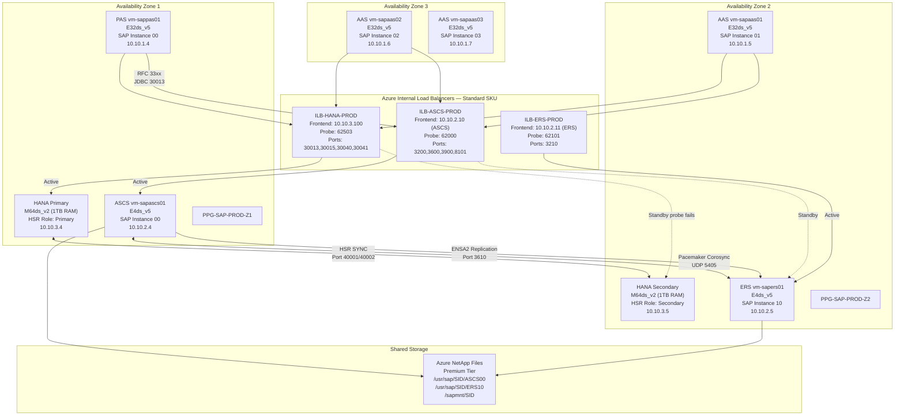
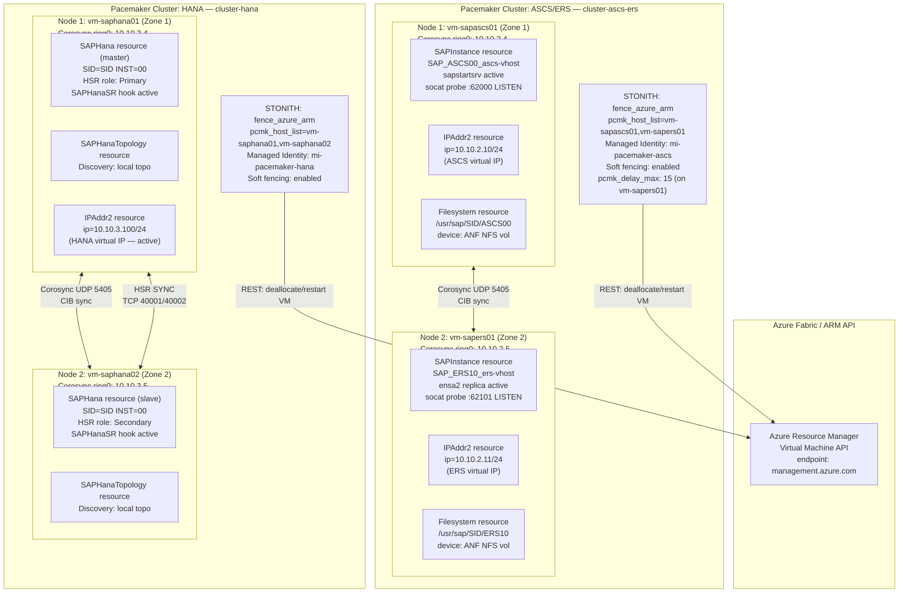

# SAP on Azure High Availability Architecture

---

## Overview

SAP production workloads impose specific high availability requirements that differ from generic enterprise applications. The SAP message server and Enqueue server in the ASCS/SCS instance hold locks, logon group data, and session state that are not restartable from scratch — they must fail over to a running standby with lock state intact. SAP HANA, as an in-memory database, requires synchronous log shipping to a secondary before acknowledging write commits, so that a failover never loses a committed transaction. SAP application servers are stateless by design, but SAP GUI and RFC sessions are pinned to a specific application server work process; when an application server fails, those sessions terminate and must be re-established. These three distinct failure domains — central services, database, and application server — require separate HA mechanisms and separate Azure infrastructure constructs. A design that addresses only one tier in isolation does not constitute a production-grade HA architecture.

Azure provides the infrastructure primitives that SAP-certified HA patterns are built upon. Availability Zones are physically separate datacenter facilities within an Azure region, each with independent power, cooling, and networking. Deploying active and standby SAP cluster nodes into different Availability Zones protects against facility-level failures that affect an entire zone, including datacenter power loss and cooling failures. The Azure Standard Internal Load Balancer supports floating IP (Direct Server Return) mode, which is the mechanism by which a cluster virtual hostname is redirected from the failed node to the surviving node without changing the IP address that SAP clients connect to. Azure Fence Agent (fence_azure_arm) provides STONITH (Shoot The Other Node In The Head) fencing for Pacemaker clusters by using the Azure Virtual Machine management API to restart or deallocate the failed node, preventing split-brain scenarios where both cluster nodes believe they are the active owner of a resource. Premium SSD and Ultra Disk provide the low-latency, high-IOPS storage that HANA requires, with zone-redundant storage options for shared NFS volumes.

The overall HA strategy layers these Azure primitives with SAP-specific software components. At the central services tier, ENSA2 (Enqueue Replication Server 2) replicates the SAP enqueue table from the ASCS instance to the ERS instance; when ASCS fails, ERS is promoted by Pacemaker and resumes serving locks without loss of state. At the database tier, HANA System Replication in SYNC mode with logreplay ensures that the secondary HANA instance is always current; Pacemaker with SAPHana and SAPHanaTopology resource agents performs HANA takeover and updates the Azure Internal Load Balancer to redirect port 30013 (MDC system tenant) and port 30015 (tenant database) to the new primary. At the application server tier, SAP Logon Groups distribute client connections across multiple application server instances deployed in separate Availability Zones; when an application server VM fails, Azure will restart it (or Azure VM Scale Sets will replace it), but active user sessions must reconnect. The combination of these three mechanisms delivers a Tier-1 SAP production architecture with a tested RTO of under 120 seconds for ASCS/ERS failover and under 300 seconds for HANA failover, against an RTO target of 4 hours for planned failover and 2 hours for unplanned.

---

## Architecture Overview

The reference architecture deploys SAP across three Availability Zones within a single Azure region. Zone 1 hosts the HANA primary, the active ASCS node, and the Primary Application Server (PAS). Zone 2 hosts the HANA secondary with HSR SYNC replication, the ERS node (which holds a replica of the enqueue table), and the first Additional Application Server (AAS). Zone 3 hosts additional AAS instances and, for three-zone deployments, a witness or quorum device for Pacemaker. This zone spread ensures that no single Availability Zone failure can simultaneously take down both the active ASCS node and the active HANA node, which would require recovery of both components sequentially and significantly extend RTO.

Two Pacemaker clusters are deployed independently: one for ASCS/ERS and one for HANA. Each cluster uses the Azure Fence Agent as the sole STONITH device. The fence agent uses a managed identity with the "Virtual Machine Contributor" role (scoped to the cluster VMs' resource group) to call the Azure VM management API and restart or deallocate the node that must be fenced. Pacemaker corosync uses unicast UDP traffic between cluster nodes; NSG rules must explicitly permit UDP port 5405 between the ASCS and ERS VMs, and between the HANA primary and secondary VMs.

Azure Internal Load Balancers (Standard SKU) front each cluster with a floating IP address. The ASCS cluster has two load balancer frontend configurations: one for the ASCS virtual hostname (for SAP message server and enqueue server client connections) and one for the ERS virtual hostname (used internally by ENSA2 replication). The HANA cluster load balancer has one frontend for the HANA virtual hostname (for application server JDBC and HANA client connections). All load balancers have health probes configured on dedicated probe ports (62000 for ASCS, 62101 for ERS, 62503 for HANA) that query Pacemaker cluster node status. The health probe succeeds only on the node that currently owns the cluster resource, directing traffic exclusively to the active node.

Proximity Placement Groups (PPGs) are used selectively. When a single-zone deployment is required (for example, due to latency constraints in a scale-up landscape that cannot tolerate cross-zone latency), a PPG anchors HANA VMs, ASCS/ERS VMs, and application server VMs to the same physical host cluster, reducing inter-VM latency to under 0.1 ms. For cross-zone HA deployments, PPGs are used per zone — one PPG anchors the Zone 1 VMs (HANA primary, ASCS, PAS) and a second PPG anchors the Zone 2 VMs (HANA secondary, ERS, AAS). This ensures low latency within each zone while retaining cross-zone resilience.



---

## SAP Architecture

### SAP HA Landscape Components

SAP high availability requires coordinated configuration across five distinct SAP software components. Each component has specific SAP Notes that govern its configuration on Azure, and each maps to specific Azure infrastructure constructs.

**ASCS/ERS Enqueue Replication (ENSA2)**

The SAP ASCS instance (ABAP Central Services) hosts three critical services: the SAP Message Server (responsible for logon group management and RFC destination routing), the Enqueue Server (responsible for lock management for the entire SAP system), and the Gateway Server. In ENSA2 architecture (Enqueue Replication Server 2), the Enqueue Server 2 runs inside the ASCS instance and maintains the lock table in shared memory. A shadow copy of the lock table is continuously replicated to the Enqueue Replication Server 2 (ERS2), which also runs an enqueue server process but in standby role. When ASCS fails, Pacemaker promotes the ERS2 instance to become the new ASCS, and all existing locks are preserved because ERS2 already holds the complete lock table. This is architecturally superior to ENSA1, where the lock table was lost on ASCS failure and all active transactions were rolled back.

**SAP Application Server HA**

SAP Application Servers (PAS and AAS) are stateless at the NW kernel level — all persistent state resides in the HANA database. However, work processes on each application server hold RFC connections, background job metadata, and when long-running reports are active, open database cursors. HA for application servers is achieved through redundancy: deploy multiple application server instances across Availability Zones, configure SAP Logon Groups so that client workload is distributed across all instances, and rely on Azure's VM restart SLA (99.9% for single-VM with Premium SSD) to recover individual application servers. The SAP system profile parameters `rdisp/mshost` and `rdisp/msserv` must point to the ASCS virtual hostname rather than a physical hostname to survive ASCS failover.

**HANA HA with HSR and Pacemaker**

HANA System Replication (HSR) in SYNC mode replicates every redo log record from the primary to the secondary before acknowledging the commit to the application. This guarantees zero data loss on failover. The Pacemaker SAPHana resource agent monitors HANA process health and HSR replication status. On HANA failure, Pacemaker calls `hdbnsutil -sr_takeover` on the secondary, which promotes it to primary, then updates the Azure Internal Load Balancer health probe so that port 62503 succeeds on the new primary and fails on the old (now secondary) node. The SAP application servers receive the takeover notification through the HANA client library and re-establish connections to the same virtual IP address (which now resolves to the new primary).

**SAP Message Server HA**

The SAP Message Server runs inside the ASCS instance and is covered by the ASCS Pacemaker cluster. There is only one active message server per SAP system at any time. The message server virtual hostname (configured in the `j2ee/ms/server_url_0` and ABAP `ms/server_port` profile parameters) must reference the ASCS load balancer IP address. SAP application servers cache the message server address locally and reconnect automatically when the ASCS cluster fails over.

**SAP Web Dispatcher HA**

SAP Web Dispatcher is deployed as an HA pair: two Web Dispatcher VMs in separate Availability Zones, fronted by Azure Application Gateway (for external HTTPS traffic) or an Azure Internal Load Balancer (for internal RFC/HTTP traffic). Web Dispatcher is stateless for HTTP traffic routing; each instance reads the message server for available application server instances. Health check failures are detected by Application Gateway every 30 seconds (configurable). No Pacemaker cluster is required for Web Dispatcher — Azure Application Gateway's backend health probes natively handle failover.

### SAP Notes Reference Table

| SAP Note | Title | Architecture Impact | Where Applied |
|---|---|---|---|
| 1928533 | SAP Applications on Microsoft Azure: Supported Products and Azure VM Types | Defines certified VM families (M-series for HANA, E-series for ASCS/app) and storage types | VM sizing, storage selection |
| 2694118 | Red Hat Enterprise Linux HA Add-On on Azure | RHEL Pacemaker configuration, fence_azure_arm STONITH, cluster parameter tuning | ASCS/ERS cluster, HANA cluster on RHEL |
| 2235581 | SAP HANA: Supported Operating Systems | HANA-certified OS versions; RHEL 8.x/9.x and SLES 15 SP3+ for Azure | HANA VM OS selection |
| 3007991 | Azure Fence Agent: Supported Versions and Configuration | fence_azure_arm version requirements, managed identity vs SPN, soft fencing support | Pacemaker STONITH configuration |
| 2578899 | SUSE Linux Enterprise Server 15: Installation Note | SLES for SAP packages, sapconf/tuned profiles, Pacemaker HA extension requirements | SLES-based clusters |
| 2684254 | SAP HANA DB: Recommended OS Settings for SLES 15 | Kernel parameters, CPU frequency scaling, transparent hugepages settings for HANA | HANA VM OS tuning |
| 1999351 | Troubleshooting Enhanced Azure Monitoring for SAP | Azure Enhanced Monitoring Extension configuration for SAP Host Agent | All SAP VMs |
| 2593824 | Linux: Running SAP applications compiled with GCC 7.x | Compiler and library compatibility for ASCS/ERS on RHEL 8 and SLES 15 | Application server VMs |
| 2191498 | SAP on Linux with Azure: Enhanced Monitoring | SAP Enhanced Monitoring configuration, metrics collection from Azure fabric | Monitoring setup |
| 3024346 | Linux Pacemaker Setup for SAP NetWeaver | Pacemaker cluster parameters, resource agent versions, op_timeout tuning | ASCS/ERS Pacemaker |
| 2369910 | SAP Software on Linux: General Information | General Linux prerequisites for SAP, required packages, filesystem layout | All Linux SAP VMs |

---

## Azure Architecture

### Availability Zones for SAP (3-Zone Deployment)

Azure Availability Zones within a region are connected by a high-bandwidth, low-latency network (Microsoft measures less than 2 ms round-trip latency between zones in most regions). For SAP HANA, inter-zone latency must be measured and validated before production deployment because HANA HSR SYNC mode adds this latency to every write commit. The `niping` tool (SAP Note 500235) run between HANA VMs in different zones is the standard measurement method. Azure regions that have been validated for cross-zone SAP HANA SYNC replication include East US 2, West Europe, North Europe, Australia East, and Southeast Asia, among others. If measured latency exceeds 1 ms, NEARSYNCE replication mode should be considered over pure SYNC.

A three-zone deployment provides quorum for Pacemaker without requiring a separate SBD (STONITH Block Device) disk. With nodes in Zone 1 and Zone 2, plus a third resource (or a lightweight quorum VM) in Zone 3, the cluster can tolerate a single zone failure while maintaining quorum. Azure Fence Agent provides the mechanism to fence the failed node, and quorum is maintained by the two surviving nodes. The Pacemaker `quorum policy` must be set to `stop` (not `ignore`) so that a minority partition does not attempt to continue operating.

```bash
# Verify quorum configuration
pcs quorum status

# Expected output includes:
# Quorum information
# Date:             Mon Jun 30 10:00:00 2026
# Quorum provider:  corosync_votequorum
# Nodes:            2
# Node votes:
#   1          (local): 1
#   2                 : 1
# Total votes:         2
# Quorum votes:        2 (half of total rounded up, plus 1)
# Expected votes:      2
# Highest expected:    2
# Quorum:              2 Active
```

For a two-node cluster (Zone 1 and Zone 2 only), Azure Fence Agent provides the tiebreaker: whichever node is fenced first loses, and the other node gains quorum. The `pcmk_delay_max` parameter (set to 15 seconds on one node, 0 on the other) creates an asymmetric delay that favors the correct node surviving.

### Zone-Redundant Load Balancer for ASCS/ERS

Azure Standard Load Balancer is the mandatory SKU for SAP HA configurations. Basic SKU is not supported because it lacks health probe semantics, zone-redundancy, and floating IP (Direct Server Return) mode. Zone-redundant Standard Load Balancer (the default) spans all Availability Zones within a region; its frontend IP remains accessible even if one zone becomes unavailable.

The load balancer configuration for ASCS/ERS requires three distinct frontend IP configurations:

- **ASCS frontend** (e.g., 10.10.2.10): Receives all SAP client connections to the ASCS virtual hostname. Pacemaker assigns this IP to the `SAPInstance` resource running on the active ASCS node. The health probe port 62000 queries a `socat` listener that Pacemaker starts only on the active node.
- **ERS frontend** (e.g., 10.10.2.11): Used by ENSA2 replication from ASCS to ERS. The health probe port 62101 similarly queries a `socat` listener started by Pacemaker on the active ERS node.
- **HANA frontend** (e.g., 10.10.3.100): Receives all JDBC and HANA client connections. The health probe port 62503 queries the SAPHana Pacemaker resource status.

### Standard Load Balancer Configuration for Pacemaker

The Standard Load Balancer requires specific configuration to work with Pacemaker cluster failover:

```bash
# Create the load balancer for ASCS/ERS
az network lb create \
  --resource-group rg-sap-prod \
  --name lbi-sap-prod-ascs \
  --sku Standard \
  --location eastus2 \
  --frontend-ip-name fe-ascs \
  --private-ip-address 10.10.2.10 \
  --private-ip-address-version IPv4 \
  --subnet /subscriptions/<subId>/resourceGroups/rg-sap-prod/providers/Microsoft.Network/virtualNetworks/vnet-sap-prod/subnets/snet-sap-ascs

# Add ERS frontend
az network lb frontend-ip create \
  --resource-group rg-sap-prod \
  --lb-name lbi-sap-prod-ascs \
  --name fe-ers \
  --private-ip-address 10.10.2.11 \
  --subnet /subscriptions/<subId>/resourceGroups/rg-sap-prod/providers/Microsoft.Network/virtualNetworks/vnet-sap-prod/subnets/snet-sap-ascs

# Create backend pool
az network lb address-pool create \
  --resource-group rg-sap-prod \
  --lb-name lbi-sap-prod-ascs \
  --name be-ascs-ers

# Add ASCS health probe (port 62000)
az network lb probe create \
  --resource-group rg-sap-prod \
  --lb-name lbi-sap-prod-ascs \
  --name hp-ascs \
  --protocol tcp \
  --port 62000 \
  --interval 5 \
  --threshold 2

# Add ERS health probe (port 62101)
az network lb probe create \
  --resource-group rg-sap-prod \
  --lb-name lbi-sap-prod-ascs \
  --name hp-ers \
  --protocol tcp \
  --port 62101 \
  --interval 5 \
  --threshold 2

# Create ASCS load balancing rule with floating IP
az network lb rule create \
  --resource-group rg-sap-prod \
  --lb-name lbi-sap-prod-ascs \
  --name lbr-ascs-3200 \
  --frontend-ip-name fe-ascs \
  --backend-pool-name be-ascs-ers \
  --probe-name hp-ascs \
  --protocol tcp \
  --frontend-port 3200 \
  --backend-port 3200 \
  --idle-timeout 30 \
  --enable-floating-ip true
```

The `--enable-floating-ip true` flag is mandatory. Without floating IP (DSR mode), the load balancer rewrites the destination IP to the VM's NIC IP, and Pacemaker's virtual IP resource cannot respond to the probe on the frontend address.

### Proximity Placement Groups with AZ Alignment

Proximity Placement Groups constrain VM placement to within a single physical rack cluster, reducing inter-VM network latency to under 0.5 ms. For SAP, PPGs are used in two scenarios:

1. **Cross-zone deployment (production standard)**: One PPG per zone — PPG-SAP-Z1 contains the Zone 1 HANA VM, ASCS VM, and PAS VM; PPG-SAP-Z2 contains the Zone 2 HANA VM, ERS VM, and AAS VMs. This minimizes latency within each zone while maintaining zone separation for resilience.

2. **Single-zone deployment (if cross-zone latency is unacceptable)**: One PPG containing all SAP VMs. This provides sub-millisecond latency between all tiers but removes zone-level resilience; a single zone outage takes down the entire SAP system.

```bash
# Create PPG for Zone 1
az ppg create \
  --resource-group rg-sap-prod \
  --name ppg-sap-prod-z1 \
  --type Standard \
  --location eastus2 \
  --zone 1

# Assign ASCS VM to PPG during creation
az vm create \
  --resource-group rg-sap-prod \
  --name vm-sapascs01 \
  --ppg ppg-sap-prod-z1 \
  --zone 1 \
  --size Standard_E4ds_v5 \
  ...
```

### Zone-Redundant Storage for Shared Volumes

SAP ASCS and ERS share NFS-mounted volumes for the SAP profile directory (`/sapmnt/SID`), the ASCS instance directory (`/usr/sap/SID/ASCS00`), and the ERS instance directory (`/usr/sap/SID/ERS10`). These volumes must be highly available and accessible from both Availability Zones simultaneously, since ASCS and ERS run in different zones.

Azure NetApp Files with Standard or Premium tier provides NFS v4.1 shared storage with zone-redundant availability in supported regions. The ANF volume must be created in a delegated subnet within the SAP spoke VNet. Throughput of at least 64 MiB/s is recommended for production `/sapmnt` volumes.

```bash
# Create ANF capacity pool
az netappfiles pool create \
  --resource-group rg-sap-prod \
  --account-name anf-sap-prod \
  --pool-name pool-sap-prod \
  --location eastus2 \
  --service-level Premium \
  --size 4

# Create /sapmnt volume
az netappfiles volume create \
  --resource-group rg-sap-prod \
  --account-name anf-sap-prod \
  --pool-name pool-sap-prod \
  --name vol-sapmnt-sid \
  --location eastus2 \
  --service-level Premium \
  --usage-threshold 1024 \
  --vnet vnet-sap-prod \
  --subnet snet-anf \
  --protocol-types NFSv4.1 \
  --zone-redundant true
```

---

### HA Cluster Topology Diagram (Pacemaker / Azure Fence Agent)



---

## ASCS/ERS High Availability

### Enqueue Replication Server 2 (ENSA2) Architecture

ENSA2 represents a fundamental change from ENSA1 in how the SAP Enqueue Server handles HA. In ENSA1, the Enqueue Server ran only in the ASCS instance, with the ERS holding a replicated copy that could only serve locks after a full ASCS restart. In ENSA2, the Enqueue Server 2 runs in both ASCS and ERS simultaneously (active-passive), with the ERS Enqueue Server 2 holding a fully synchronized shadow lock table. On ASCS failure, the ERS Enqueue Server 2 is promoted to active by a role switch — no lock table rebuild is required, and all existing SAP locks survive the failover. The SAP system does not experience a transaction rollback event for ENSA2 failover.

ENSA2 is the mandatory architecture for new SAP deployments on Azure. SAP Note 2694118 documents the configuration requirements. The ASCS instance number and ERS instance number must be configured in the cluster in a way that makes them switchable: the ASCS instance runs on one node, the ERS on the other, and after failover the former-ASCS node becomes the new ERS.

### Pacemaker Cluster Configuration on RHEL for SAP

Red Hat Enterprise Linux for SAP Solutions includes the HA Add-On (Pacemaker, Corosync, pcs) and is the supported cluster stack. The cluster must be configured to use `no-quorum-policy=stop` (preventing minority partitions from running resources), `stonith-enabled=true`, and the ASCS/ERS resources must have specific constraints:

```bash
# Install Pacemaker on RHEL 8.x (both nodes)
yum install -y pacemaker pcs fence-agents-azure-arm resource-agents-sap

# Start and enable pcsd
systemctl enable --now pcsd

# Set hacluster password (same on both nodes)
passwd hacluster

# On node 1: authenticate and create cluster
pcs host auth vm-sapascs01 vm-sapers01 -u hacluster
pcs cluster setup cluster-ascs-ers vm-sapascs01 vm-sapers01 --start

# Set global cluster properties
pcs property set stonith-enabled=true
pcs property set no-quorum-policy=stop
pcs property set concurrent-fencing=true

# Set resource defaults
pcs resource defaults update resource-stickiness=1
pcs resource defaults update migration-threshold=3

# Set operation defaults
pcs resource op defaults update timeout=86400s
```

### Azure Fence Agent Configuration

The Azure Fence Agent (`fence_azure_arm`) is the supported STONITH method for SAP clusters on Azure. It uses the Azure VM management API to deallocate (soft fencing) or restart (hard fencing) the failed node. The recommended configuration uses a User-Assigned Managed Identity with scoped permissions rather than a Service Principal, to avoid secret rotation requirements.

```bash
# Create User-Assigned Managed Identity for Pacemaker
az identity create \
  --resource-group rg-sap-prod \
  --name mi-pacemaker-ascs \
  --location eastus2

# Get the principal ID
PRINCIPAL_ID=$(az identity show \
  --resource-group rg-sap-prod \
  --name mi-pacemaker-ascs \
  --query principalId -o tsv)

# Assign Virtual Machine Contributor role scoped to the cluster VMs' resource group
az role assignment create \
  --assignee $PRINCIPAL_ID \
  --role "Virtual Machine Contributor" \
  --scope /subscriptions/<subId>/resourceGroups/rg-sap-prod

# Assign the managed identity to both cluster VMs
az vm identity assign \
  --resource-group rg-sap-prod \
  --name vm-sapascs01 \
  --identities mi-pacemaker-ascs

az vm identity assign \
  --resource-group rg-sap-prod \
  --name vm-sapers01 \
  --identities mi-pacemaker-ascs

# Create the STONITH resource in Pacemaker
pcs stonith create rsc_st_azure_ascs fence_azure_arm \
  msi=true \
  resourceGroup=rg-sap-prod \
  subscriptionId=<subId> \
  op monitor interval=3600 timeout=120 \
  pcmk_reboot_timeout=900 \
  pcmk_monitor_retries=3 \
  pcmk_delay_max=15 \
  --group grp_sap_ascs_ers

# Verify STONITH device
pcs stonith show rsc_st_azure_ascs
stonith_admin -I -a fence_azure_arm
```

The `pcmk_delay_max=15` parameter introduces a random delay of 0-15 seconds before the STONITH action fires on one node. This asymmetry prevents both nodes from attempting to fence each other simultaneously in a split-brain scenario, ensuring one node survives.

### Cluster Resource Configuration for ASCS/ERS

```bash
# Create the shared filesystem resources (NFS mount for /sapmnt)
pcs resource create rsc_sap_SID_nfs_sapmnt Filesystem \
  device="<anf-ip>:/vol-sapmnt-sid" \
  directory="/sapmnt/SID" \
  fstype=nfs \
  options="rw,hard,rsize=65536,wsize=65536,proto=tcp,noatime,lock,_netdev,sec=sys,vers=4.1" \
  op start timeout=60 \
  op stop timeout=60 \
  op monitor interval=20 timeout=40 \
  clone SID_nfs_sapmnt_clone interleave=true

# Create ASCS resource
pcs resource create rsc_sap_SID_ASCS00 SAPInstance \
  InstanceName=SID_ASCS00_ascs-vhost \
  START_PROFILE="/sapmnt/SID/profile/SID_ASCS00_ascs-vhost" \
  AUTOMATIC_RECOVER=false \
  MINIMAL_PROBE=true \
  op start timeout=600 \
  op stop timeout=600 \
  op monitor interval=11 timeout=60

# Create ASCS virtual IP resource
pcs resource create rsc_ip_SID_ASCS00 IPAddr2 \
  ip=10.10.2.10 \
  cidr_netmask=24 \
  nic=eth0 \
  op monitor interval=10 timeout=20

# Create ASCS health check probe (for Azure Load Balancer health probe on port 62000)
pcs resource create rsc_nc_SID_ASCS00 azure-lb \
  port=62000 \
  op monitor interval=10 timeout=20

# Group ASCS resources
pcs resource group add grp_sap_SID_ASCS00 \
  rsc_ip_SID_ASCS00 \
  rsc_nc_SID_ASCS00 \
  rsc_sap_SID_ASCS00

# Create ERS resource
pcs resource create rsc_sap_SID_ERS10 SAPInstance \
  InstanceName=SID_ERS10_ers-vhost \
  START_PROFILE="/sapmnt/SID/profile/SID_ERS10_ers-vhost" \
  AUTOMATIC_RECOVER=false \
  IS_ERS=true \
  MINIMAL_PROBE=true \
  op start timeout=600 \
  op stop timeout=600 \
  op monitor interval=11 timeout=60

# Create ERS virtual IP
pcs resource create rsc_ip_SID_ERS10 IPAddr2 \
  ip=10.10.2.11 \
  cidr_netmask=24 \
  nic=eth0 \
  op monitor interval=10 timeout=20

# Create ERS health probe (port 62101)
pcs resource create rsc_nc_SID_ERS10 azure-lb \
  port=62101 \
  op monitor interval=10 timeout=20

# Group ERS resources
pcs resource group add grp_sap_SID_ERS10 \
  rsc_ip_SID_ERS10 \
  rsc_nc_SID_ERS10 \
  rsc_sap_SID_ERS10

# Set ordering constraints: ASCS must start before ERS
pcs constraint order start grp_sap_SID_ASCS00 then start grp_sap_SID_ERS10 \
  symmetrical=false kind=Optional

# Set colocation constraint: ERS must NOT run on the same node as ASCS
pcs constraint colocation add grp_sap_SID_ERS10 with grp_sap_SID_ASCS00 -5000

# Verify constraints
pcs constraint show
```

### Virtual Hostname and IP Design

Every SAP instance in an HA landscape must be configured with a virtual hostname that resolves to the load balancer frontend IP, not the physical VM hostname. This ensures that after a cluster failover, the SAP instance is reachable at the same address.

| Hostname (Virtual) | IP Address | DNS Record | Resolves To | Purpose |
|---|---|---|---|---|
| ascs-vhost | 10.10.2.10 | A record in Private DNS Zone | ILB-ASCS frontend | ASCS virtual hostname |
| ers-vhost | 10.10.2.11 | A record in Private DNS Zone | ILB-ERS frontend | ERS virtual hostname |
| hana-vhost | 10.10.3.100 | A record in Private DNS Zone | ILB-HANA frontend | HANA virtual hostname |
| vm-sapascs01 | 10.10.2.4 | A record in Private DNS Zone | VM NIC (physical) | ASCS node physical IP |
| vm-sapers01 | 10.10.2.5 | A record in Private DNS Zone | VM NIC (physical) | ERS node physical IP |

Physical hostnames must always resolve to VM NIC IPs. Virtual hostnames must always resolve to load balancer frontend IPs. The two must never be the same address. Pacemaker assigns the virtual IP to the NIC as a secondary IP address when the resource group starts; the Azure Internal Load Balancer probes the health check port and directs traffic to the node where the probe succeeds (the node holding the virtual IP).

### SAP Profile Configuration for HA

The ASCS and ERS instance profiles must reference virtual hostnames and configure ENSA2 mode:

```ini
# /sapmnt/SID/profile/SID_ASCS00_ascs-vhost

# Instance basics
SAPSYSTEMNAME = SID
SAPINSTANCE = ASCS00
SAPGLOBALHOST = ascs-vhost

# Message server
ms/server_port_0 = PROT=HTTP,PORT=81$$

# Enqueue Server 2 (ENSA2)
enque/encni/set_so_keepalive = true
service/protectedwebmethods = SDEFAULT

# HA profile parameters
Autostart = 0
Start_Program_01 = immediate $(DIR_CT_RUN)/sapstartsrv pf=$(_PF) -D -u $(SAPSYSTEMNAME)adm

# /sapmnt/SID/profile/SID_ERS10_ers-vhost

SAPSYSTEMNAME = SID
SAPINSTANCE = ERS10
SAPGLOBALHOST = ascs-vhost

# ERS references ASCS virtual hostname for enqueue replication
enque/enrep/cachesize = 1000
enque/server/max_query_requests = 5000
Autostart = 0
```

Application server profiles (PAS and AAS) must reference the ASCS virtual hostname:

```ini
# /sapmnt/SID/profile/SID_D00_pas-vhost (PAS profile excerpt)

rdisp/mshost = ascs-vhost
rdisp/msserv = sapmsXXX
ms/server_port_0 = PROT=HTTP,PORT=81$$
icm/server_port_0 = PROT=HTTP,PORT=80$$

# Logon group for HA
login/create_sso2_ticket = 0
```

---

## HANA High Availability

### HANA System Replication Sync Mode for HA

HANA System Replication (HSR) supports four replication modes. For HA within an Azure region, SYNC mode is mandatory:

| HSR Mode | Log Shipping | Data Loss on Failover | Latency Impact | Use Case |
|---|---|---|---|---|
| SYNC | Synchronous — commit waits for secondary ACK | Zero data loss | Low (same region, <2 ms AZ latency) | In-region HA |
| SYNCMEM | Synchronous to secondary memory only | Near-zero (secondary buffer) | Lowest | Extreme performance, relaxed durability |
| NEARSYNCE | Async write to secondary, sync to log buffer | Seconds | Negligible | High-latency HA (cross-region HSR) |
| ASYNC | Fully asynchronous | Minutes (RPO = replication lag) | Zero | Cross-region DR |

For the HA tier within an Azure region, configure SYNC mode with `logreplay` operation:

```bash
# On HANA secondary (vm-saphana02) — as <SID>adm
hdbnsutil -sr_register \
  --name=HANA_SEC \
  --remoteHost=vm-saphana01 \
  --remoteInstance=00 \
  --replicationMode=sync \
  --operationMode=logreplay \
  --online

# Verify HSR status
hdbnsutil -sr_state

# Check from primary
hdbnsutil -sr_state --sapcontrol=1
```

The `logreplay` operation mode means the secondary HANA instance continuously replays the received log records into its in-memory tables, keeping its state current with the primary. This reduces takeover time to under 30 seconds because the secondary is always up-to-date and does not need a log replay phase before becoming primary.

### Pacemaker HANA Cluster Resource Agent (SAPHanaSR)

The SAPHanaSR resource agent package (available from the OS vendor for both RHEL and SLES) provides two Pacemaker resource agent classes:

- **SAPHanaTopology**: A clone resource that runs on both nodes simultaneously. It reads the HANA system topology (HSR role, tier, site name) and populates node attributes that SAPHana uses for decision-making.
- **SAPHana**: A master-slave (promotable clone) resource. It starts HANA on both nodes, determines which node should be master (primary) based on HSR state, and manages HANA takeover on failure.

The SAPHanaSR HA/DR Provider Hook must be configured in the HANA `global.ini` to give Pacemaker near-real-time visibility into HANA HSR state changes:

```ini
# /hana/shared/SID/global/hdb/custom/config/global.ini
# Add to [ha_dr_provider_SAPHanaSR] section

[ha_dr_provider_SAPHanaSR]
provider = SAPHanaSR
path = /usr/share/SAPHanaSR
execution_order = 1

[trace]
ha_dr_saphanasr = info
```

```bash
# Create SAPHanaTopology clone resource
pcs resource create rsc_SAPHanaTopology_SID_HDB00 SAPHanaTopology \
  SID=SID \
  InstanceNumber=00 \
  op start timeout=600 \
  op stop timeout=300 \
  op monitor interval=10 timeout=600 \
  clone meta clone-node-max=1 target-role=Started interleave=true

# Create SAPHana promotable resource (master-slave)
pcs resource create rsc_SAPHana_SID_HDB00 SAPHana \
  SID=SID \
  InstanceNumber=00 \
  PREFER_SITE_TAKEOVER=true \
  DUPLICATE_PRIMARY_TIMEOUT=7200 \
  AUTOMATED_REGISTER=true \
  op start timeout=3600 \
  op stop timeout=3600 \
  op monitor interval=61 role=Master timeout=700 \
  op monitor interval=59 role=Slave timeout=700 \
  op takeover timeout=3600 \
  op promote timeout=3600 \
  promotable meta master-max=1 master-node-max=1 clone-max=2 clone-node-max=1 interleave=true

# Create HANA virtual IP resource
pcs resource create rsc_ip_SID_HDB00 IPAddr2 \
  ip=10.10.3.100 \
  cidr_netmask=24 \
  nic=eth0 \
  op monitor interval=10 timeout=20

# Create HANA health probe (port 62503)
pcs resource create rsc_nc_SID_HDB00 azure-lb \
  port=62503 \
  op monitor interval=10 timeout=20

# Group IP and probe
pcs resource group add grp_sap_SID_HDB00 \
  rsc_ip_SID_HDB00 \
  rsc_nc_SID_HDB00

# Ordering: topology must be started before HANA
pcs constraint order rsc_SAPHanaTopology_SID_HDB00-clone then rsc_SAPHana_SID_HDB00-clone \
  symmetrical=false

# Colocation: IP group must run on the HANA master node
pcs constraint colocation add grp_sap_SID_HDB00 with master rsc_SAPHana_SID_HDB00-clone 4000

# Set priority ordering for role assignment
pcs constraint order promote rsc_SAPHana_SID_HDB00-clone then start grp_sap_SID_HDB00 \
  symmetrical=false
```

### Automatic HANA Failover Procedure

When the SAPHanaSR hook detects HANA failure on the primary node, the following sequence occurs automatically:

1. The SAPHanaSR hook calls `crm_attribute` to update the node attribute `hana_SID_clone_state` to `DEMOTED` on the failed node.
2. Pacemaker's SAPHana resource agent detects the attribute change (within the `monitor interval` of 61 seconds, or sooner via the hook).
3. Pacemaker initiates STONITH of the failed node via fence_azure_arm. The fencing operation calls the Azure VM management API to deallocate or restart the VM.
4. Once fencing is confirmed, Pacemaker promotes the secondary SAPHana resource to master on the surviving node.
5. Pacemaker starts the IP and azure-lb resources on the promoted node.
6. Azure Internal Load Balancer detects that the health probe (port 62503) now succeeds on the new primary node and fails on the old primary.
7. All new HANA client connections are directed to the new primary within the load balancer probe interval (5 seconds × 2 threshold = 10 seconds).
8. Existing HANA client connections that are mid-transaction receive an error and must retry; the SAP application server's database connection pool reconnects to the same virtual IP.

The `AUTOMATED_REGISTER=true` parameter in the SAPHana resource agent automatically re-registers the old primary as a new secondary (HSR SYNC) after it is fenced and restarted. Without this, manual intervention is required to re-register the secondary after failover.

### HANA HA Monitoring

Key HANA HSR metrics to monitor:

```bash
# Check HSR replication status from HANA SQL
SELECT * FROM SYS.M_SERVICE_REPLICATION;
-- KEY COLUMNS: REPLICATION_STATUS (ACTIVE/ERROR/SYNCING), REPLICATION_MODE (SYNC), SECONDARY_ACTIVE_STATUS

# Check replication lag (should be 0 for SYNC mode)
SELECT SITE_NAME, REPLICATION_STATUS, SHIPPED_LOG_BUFFERS_COUNT,
       SHIPPED_LOG_BUFFERS_DURATION, SHIPPED_LOG_BUFFERS_SIZE
FROM SYS.M_SERVICE_REPLICATION;

# Check Pacemaker HANA resource status
crm_mon -r -1 | grep -A5 SAPHana

# Check SAPHanaSR attributes
SAPHanaSR-showAttr

# Expected output from SAPHanaSR-showAttr:
# Host       Sites  srHook sync_state  mns      lpt
# vm-saphana01  HANA_PRIM  PRIM  SOK  P/1  1640000000
# vm-saphana02  HANA_SEC   SOK   SOK  S/2  -
```

### Multi-Tier HSR for HA+DR Combined

For landscapes requiring both in-region HA and cross-region DR, a three-tier HSR chain is configured:

- **Tier 1 (HANA Primary)**: Zone 1, active production HANA, HSR SYNC to Tier 2
- **Tier 2 (HANA Secondary)**: Zone 2, HA standby, managed by Pacemaker, HSR ASYNC to Tier 3
- **Tier 3 (HANA DR)**: Secondary Azure region, DR standby, HSR ASYNC, not managed by Pacemaker

```bash
# Register Tier 3 DR secondary (from DR region HANA VM, as <SID>adm)
hdbnsutil -sr_register \
  --name=HANA_DR \
  --remoteHost=hana-vhost \
  --remoteInstance=00 \
  --replicationMode=async \
  --operationMode=logreplay \
  --remoteName=HANA_SEC \
  --online

# Verify three-tier topology
hdbnsutil -sr_state
# Expected output: 3 sites listed, Tier 1 SYNC, Tier 3 ASYNC
```

The three-tier configuration requires HANA 2.0 SPS 03 or later. The Pacemaker cluster manages only Tier 1 and Tier 2; Tier 3 DR failover is a manual procedure documented in the DR runbook.

---

## Application Server High Availability

### SAP Logon Group Configuration for Load Distribution

SAP Logon Groups (configured in transaction SMLG) provide client-side load balancing across multiple application server instances. When a SAP GUI user connects, the SAP Message Server evaluates the logon group and directs the user to the application server with the fewest active sessions in the group. This is the primary mechanism for distributing workload across AAS instances.

```abap
* SMLG configuration equivalent (programmatic via RFC function)
* Logon group: SPACE (default) — all dialog users
* Logon group: BATCH — background processing
* Logon group: RFC — RFC/BAPI connections from external systems

* Application server instances to include in logon group SPACE:
* vm-sappas01 / SAP Instance D00 (Zone 1)
* vm-sapaas01 / SAP Instance D01 (Zone 2)
* vm-sapaas02 / SAP Instance D02 (Zone 3)
* vm-sapaas03 / SAP Instance D03 (Zone 3)
```

When an application server fails, the Message Server removes it from all logon groups automatically (within the `ms/server_port` keepalive timeout, typically 60 seconds). New connections are distributed to the remaining instances. Users with active sessions on the failed application server must reconnect.

### Multiple Application Server Instances Across AZs

Deploying application servers in three Availability Zones (one or more per zone) ensures that a single zone outage reduces capacity but does not cause a complete application service outage. The sizing must account for N-1 or N-2 capacity loss:

| Instance | VM Size | Zone | Logon Groups | Work Processes (DIA) | Background Processes |
|---|---|---|---|---|---|
| PAS D00 (vm-sappas01) | E32ds_v5 | 1 | SPACE, RFC | 40 | 8 |
| AAS D01 (vm-sapaas01) | E32ds_v5 | 2 | SPACE, RFC | 40 | 8 |
| AAS D02 (vm-sapaas02) | E32ds_v5 | 3 | SPACE, BATCH | 20 | 20 |
| AAS D03 (vm-sapaas03) | E32ds_v5 | 3 | SPACE, BATCH | 20 | 20 |

With this layout, Zone 1 failure loses PAS D00 (40 dialog processes, 8 batch). Remaining capacity: 80 dialog + 40 batch — sufficient for production workload at 75% of peak.

### SAP Work Process Availability Monitoring

The SAP system log (SM21), work process overview (SM50), and the SAP CCMS (RZ20) alert monitor provide visibility into application server health. For Azure-level monitoring, the SAP Enhanced Monitoring Extension (Monitoring Extension for Linux) collects Azure fabric metrics (CPU steal time, disk throughput, network throughput) and publishes them to the SAP Host Agent, which makes them available via the `saposcol` API.

```bash
# Check saposcol status on application server VM
/usr/sap/hostctrl/exe/saposcol -s

# Verify Azure Enhanced Monitoring extension is installed
az vm extension list \
  --resource-group rg-sap-prod \
  --vm-name vm-sappas01 \
  --query "[?name=='MonitorX64Linux']"

# Install if missing
az vm extension set \
  --publisher Microsoft.AzureCAT.AzureEnhancedMonitoringForLinux \
  --name MonitorX64Linux \
  --resource-group rg-sap-prod \
  --vm-name vm-sappas01 \
  --settings '{"system": "SAP"}'
```

---

## Azure Load Balancer Configuration

### Standard SKU: Mandatory for SAP HA

Azure Basic Load Balancer is not supported for SAP HA configurations. It lacks:

- Floating IP (Direct Server Return) mode required for Pacemaker virtual IPs
- Zone-redundant frontend IPs
- HA ports rule (single rule covering all ports, needed for HANA port ranges)
- 99.99% SLA (Basic is 99.95%)
- Support for backend pool members in multiple Availability Zones

All SAP Internal Load Balancers must use Standard SKU with static private frontend IP addresses.

### Health Probe Configuration for SAP Ports

The health probe is the mechanism by which Pacemaker signals the load balancer about which node is active. The probe must use TCP, not HTTP, because the probe listener is a `socat` or `azure-lb` resource started by Pacemaker — not a full HTTP server. The probe port must not conflict with any SAP port:

| Load Balancer | Probe Port | Probe Protocol | Probe Interval | Unhealthy Threshold | Resource Monitoring |
|---|---|---|---|---|---|
| ILB-ASCS | 62000 | TCP | 5 seconds | 2 | azure-lb resource in grp_sap_SID_ASCS00 |
| ILB-ERS | 62101 | TCP | 5 seconds | 2 | azure-lb resource in grp_sap_SID_ERS10 |
| ILB-HANA | 62503 | TCP | 5 seconds | 2 | azure-lb resource in grp_sap_SID_HDB00 |

The effective failover detection time is `probe_interval × unhealthy_threshold` = 5 × 2 = 10 seconds. The load balancer stops sending new connections to the failed node within 10 seconds of the probe failing. In-flight connections are not terminated — they are drained over the idle timeout period.

### Floating IP (DSR) for SAP Virtual IPs

When floating IP is enabled on a load balancing rule, the load balancer does not rewrite the destination IP address on packets forwarded to the backend VM. The packet arrives at the VM NIC with the frontend IP as the destination. Pacemaker's IPAddr2 resource assigns this frontend IP as a secondary IP on the VM's loopback or primary NIC when the cluster resource is active, so the OS can accept packets addressed to the frontend IP.

This has an important implication for the VM network configuration: the secondary IP assigned by Pacemaker must **not** be configured in the OS network configuration files (such as `/etc/sysconfig/network-scripts/` on RHEL). Pacemaker manages it exclusively. If the OS also configures the IP, a conflict occurs on failover.

```bash
# Verify floating IP is enabled on all SAP load balancing rules
az network lb rule show \
  --resource-group rg-sap-prod \
  --lb-name lbi-sap-prod-ascs \
  --name lbr-ascs-3200 \
  --query "enableFloatingIp"
# Expected: true

# Verify the IPAddr2 resource is active and IP is assigned
ip addr show eth0 | grep 10.10.2.10
# Expected: inet 10.10.2.10/24 scope global secondary eth0
```

### Load Balancing Rules for ASCS/ERS/HANA

Complete load balancing rule sets for all SAP clusters:

**ASCS Load Balancing Rules (Instance 00):**

| Rule Name | Frontend IP | Protocol | Frontend Port | Backend Port | Probe | Floating IP |
|---|---|---|---|---|---|---|
| lbr-ascs-3200 | 10.10.2.10 | TCP | 3200 | 3200 | hp-ascs | true |
| lbr-ascs-3600 | 10.10.2.10 | TCP | 3600 | 3600 | hp-ascs | true |
| lbr-ascs-3900 | 10.10.2.10 | TCP | 3900 | 3900 | hp-ascs | true |
| lbr-ascs-8101 | 10.10.2.10 | TCP | 8101 | 8101 | hp-ascs | true |
| lbr-ascs-msrv | 10.10.2.10 | TCP | 3601 | 3601 | hp-ascs | true |
| lbr-ers-3210 | 10.10.2.11 | TCP | 3210 | 3210 | hp-ers | true |
| lbr-ers-3610 | 10.10.2.11 | TCP | 3610 | 3610 | hp-ers | true |

**HANA Load Balancing Rules (Instance 00, MDC):**

| Rule Name | Frontend IP | Protocol | Frontend Port | Backend Port | Probe | Floating IP |
|---|---|---|---|---|---|---|
| lbr-hana-30013 | 10.10.3.100 | TCP | 30013 | 30013 | hp-hana | true |
| lbr-hana-30015 | 10.10.3.100 | TCP | 30015 | 30015 | hp-hana | true |
| lbr-hana-30040 | 10.10.3.100 | TCP | 30040 | 30040 | hp-hana | true |
| lbr-hana-30041 | 10.10.3.100 | TCP | 30041 | 30041 | hp-hana | true |

### Idle Timeout Settings

The Azure Load Balancer idle timeout determines how long an established TCP connection without traffic is kept in the load balancer connection table. For SAP connections:

- **ASCS connections (RFC, DIAG)**: Set to 30 minutes (`--idle-timeout 30`). SAP RFC connections are long-lived and may go silent during overnight batch processing.
- **HANA connections (JDBC, HANA client)**: Set to 30 minutes. HANA connections pool inside the SAP application server work process and may remain idle between transactions.

```bash
# Update idle timeout for ASCS rules
az network lb rule update \
  --resource-group rg-sap-prod \
  --lb-name lbi-sap-prod-ascs \
  --name lbr-ascs-3600 \
  --idle-timeout 30

# Enable TCP keepalives on the OS to prevent load balancer idle timeout from
# closing long-lived connections before the SAP application expects
sysctl -w net.ipv4.tcp_keepalive_time=300
sysctl -w net.ipv4.tcp_keepalive_intvl=75
sysctl -w net.ipv4.tcp_keepalive_probes=9
```

---

## Design Decisions

| Decision | Options Considered | Choice | Rationale | SAP/Azure Reference |
|---|---|---|---|---|
| ASCS/ERS HA mechanism | ENSA1 with SCS cluster, ENSA2 with Pacemaker, Windows WSFC | ENSA2 with Pacemaker on RHEL/SLES | ENSA2 preserves lock table on failover eliminating transaction rollbacks; Linux is certified for production SAP on Azure; WSFC requires Windows licensing overhead | SAP Note 2694118, SAP Note 3024346 |
| STONITH method | SBD disk (iSCSI), fence_azure_arm, fence_kdump | fence_azure_arm with managed identity | SBD requires a separate iSCSI target VM adding cost and complexity; fence_azure_arm uses Azure fabric APIs available natively; managed identity removes secret rotation burden | SAP Note 3007991, Azure docs |
| HSR replication mode | SYNC, SYNCMEM, NEARSYNCE, ASYNC | SYNC with logreplay | Zero data loss is a hard requirement for Tier-1 production; SYNCMEM only protects against primary crash (not primary+storage failure); NEARSYNCE acceptable only if AZ latency exceeds 2 ms | SAP HANA Administration Guide, SAP Note 2235581 |
| Availability Zone strategy | 2-zone active-passive, 2-zone active-active, 3-zone, single-zone with PPG | 2-zone for HANA/ASCS with 3-zone for application servers | HANA HSR is active-passive by design; 3-zone app servers improve dialog capacity resilience; 3-zone adds cost without HA benefit for DB/ASCS | Azure SAP HA guidance, SAP Note 1928533 |
| Shared storage for ASCS/ERS | Azure NetApp Files, NFS VM cluster (DRBD), Azure Files Premium | Azure NetApp Files Premium tier | ANF provides managed HA NFS without additional VMs; DRBD on VMs requires separate cluster management; Azure Files Premium does not support NFS v4.1 ACLs required by SAP | Microsoft SAP on Azure best practices |
| Load balancer for SAP VIPs | Azure Basic LB, Azure Standard LB, HAProxy on VMs | Azure Standard LB with floating IP | Basic LB is not supported for SAP HA; HAProxy adds single-point-of-failure unless also clustered; Standard LB is zone-redundant and meets all SAP requirements | Azure Load Balancer SKU comparison |
| HANA automated re-register | AUTOMATED_REGISTER=true, manual re-registration | AUTOMATED_REGISTER=true | After HANA failover, the old primary must become secondary to restore HA; manual re-registration requires a runbook execution window during which the system is unprotected | SAPHanaSR resource agent documentation |
| Pacemaker quorum for 2-node cluster | SBD quorum device, fence_azure_arm asymmetric delay, external qdevice | fence_azure_arm with pcmk_delay_max asymmetry | A two-node cluster cannot determine which partition is the majority; fence_azure_arm resolves the tie by whichever node fires first; asymmetric delay ensures deterministic outcome without a third node | Pacemaker documentation, SAP Note 3024346 |
| PPG scope | Per-zone PPG, cross-zone single PPG, no PPG | Per-zone PPG (one per zone) | Cross-zone PPG conflicts with zone placement requirements; per-zone PPG reduces intra-zone latency; no PPG acceptable only when latency tolerance is high | Azure PPG documentation |
| Web Dispatcher HA | Pacemaker cluster, Azure Application Gateway backend pool, VMSS | Azure Application Gateway with two Web Dispatcher backend VMs | Application Gateway provides WAF + HA + TLS offload; separate Pacemaker cluster for Web Dispatcher adds operational complexity without significant benefit | SAP Web Dispatcher HA guide |

---

## SAP Notes Reference

| SAP Note | Title | Version Relevance | Key Configuration Guidance |
|---|---|---|---|
| 1928533 | SAP Applications on Microsoft Azure: Supported Products and Azure VM Types | All SAP products | Certified Azure VM families, maximum memory per VM for HANA, storage type requirements |
| 2694118 | Red Hat Enterprise Linux HA Add-On on Azure | RHEL 7.x, 8.x, 9.x | fence_azure_arm parameters, Pacemaker corosync timeouts, RHEL HA package list |
| 2578899 | SUSE Linux Enterprise Server 15: Installation Note | SLES 15 SP1+ | SLES cluster stack, SAPHanaSR package for SLES, Pacemaker resource timeouts |
| 3007991 | Azure Fence Agent: Supported Versions and Configuration | All cluster versions | Managed identity vs SPN for fence_azure_arm, soft fencing configuration, pcmk_delay_max |
| 2235581 | SAP HANA: Supported Operating Systems | HANA 1.0 SPS 12+, HANA 2.0 | HANA-certified OS versions for Azure, required OS packages |
| 3024346 | Linux Pacemaker Setup for SAP NetWeaver | NW 7.40+, S/4HANA | Pacemaker resource agent versions, ASCS/ERS colocation constraints, ordering constraints |
| 2369910 | SAP Software on Linux: General Information | All Linux SAP | sapconf vs tuned-profiles-sap, required kernel parameters, NFS mount options |
| 1999351 | Troubleshooting Enhanced Azure Monitoring for SAP | All SAP on Azure | Monitoring Extension for Linux installation, saposcol integration, troubleshooting |
| 2684254 | SAP HANA DB: Recommended OS Settings for SLES 15 | HANA 2.0 on SLES 15 | cpu_energy_perf_policy, transparent_hugepage, kernel.numa_balancing |
| 2382421 | Optimizing the Network Configuration on HANA and OS Level | HANA 1.0+, HANA 2.0 | TCP tuning for HSR, receive buffer sizes, tcp_rmem/wmem settings |

---

## Azure Well-Architected Alignment

### Reliability

The architecture implements multiple independent layers of redundancy to meet the reliability pillar requirements. At the infrastructure layer, Availability Zones protect against facility-level failures. At the platform layer, Azure Internal Load Balancer with health probes ensures that traffic is only directed to healthy nodes. At the application layer, Pacemaker cluster resources with STONITH ensure that cluster node failures are detected and fenced within 30 seconds. HANA HSR SYNC ensures that zero committed transactions are lost on HANA failover. The combination achieves the published SLA composite: HANA VM SLA (99.99% for multi-zone) × ASCS cluster SLA (99.99%) × Load Balancer SLA (99.99%) ≈ 99.97% composite availability, or approximately 2.6 hours downtime per year, of which planned maintenance accounts for the majority.

### Security

The Security pillar requirements are met through principle of least privilege for the Pacemaker fence agent (managed identity scoped to `Virtual Machine Contributor` on the cluster VMs' resource group only, not subscription-wide), network segmentation (NSG rules allow cluster corosync traffic only between specific VM IPs within the cluster subnet), and cluster authentication (Pacemaker uses HMAC-SHA256 for corosync ring communication, preventing unauthorized nodes from joining the cluster). Azure Defender for Servers is enabled on all SAP VMs, providing vulnerability assessment and adaptive application controls. The SAP HANA audit log is configured to record all DDL operations and privileged user actions, with audit trails forwarded to the central Log Analytics Workspace via the SAP for Microsoft Sentinel connector.

### Cost Optimization

Zone-redundant deployment doubles the VM count for stateful tiers (HANA and ASCS/ERS) compared to a single-zone deployment. This cost is justified by the RTO requirement — the alternative (single-zone deployment with Azure Site Recovery) has an RTO of 1-2 hours versus under 5 minutes for Pacemaker-managed failover. The cost analysis must account for the business impact of extended downtime for Tier-1 SAP production systems. Reserved Instances (1-year or 3-year) are applied to all SAP VMs except the ERS and HANA secondary, which run continuously and are eligible for Reserved Instance pricing — the standby nature of these VMs does not affect Reserved Instance applicability because they are always-on. Azure Hybrid Benefit is applied to all SAP VMs to reduce the Windows Server license cost for management VMs; SAP Linux VMs use RHEL for SAP or SLES for SAP marketplace images with pay-as-you-go licensing or BYOS licensing from on-premises agreements.

### Operational Excellence

Pacemaker cluster operations are standardized through runbooks stored in Azure DevOps and executed via Azure Automation. All cluster state changes (resource start/stop/failover, STONITH events) are captured in Pacemaker system logs, forwarded to Log Analytics, and trigger alerts in Azure Monitor. HANA HSR replication status is monitored via a custom Log Analytics query that alerts when `REPLICATION_STATUS` is not `ACTIVE`. Planned maintenance (OS patching, HANA patch application) follows the SAP HA maintenance window procedure: gracefully fail over the active node, patch the standby, fail back, then patch the original primary. This procedure is documented as a runbook in the Operations section and tested quarterly. Infrastructure as Code (Bicep templates) codifies all load balancer configurations, PPG assignments, and Pacemaker resource definitions, ensuring that any infrastructure recreation produces an identical configuration.

### Performance Efficiency

HANA HSR SYNC mode adds the inter-zone network round-trip time to every write commit. Azure regions with validated cross-zone latency under 1 ms are suitable for SYNC mode. For higher-latency scenarios, NEARSYNCE mode is acceptable with a reviewed RPO of seconds rather than zero. Application server placement in PPGs within each zone ensures that RFC connections from application servers to ASCS and from application servers to HANA complete within the SAP-required latency threshold of 0.7 ms (SAP Note 1943937). Ultra Disk is used for HANA data and log volumes on M-series VMs to achieve the minimum 4,000 IOPS per terabyte required by SAP HANA TDI (Tailored Data Center Integration) storage certification.

---

## Security Architecture

### Pacemaker Authentication

Pacemaker cluster communication security is configured at two levels. At the Corosync level, all cluster node communication uses HMAC-SHA256 authentication with a shared secret key generated during cluster setup. The key is stored in `/etc/corosync/authkey` on each node with permissions `0400` (root read-only). At the pcs level, cluster administration uses the `hacluster` user with a password set identically on all nodes; the pcsd daemon uses TLS for all remote pcs connections.

```bash
# Verify Corosync encryption is enabled
grep "crypto_cipher\|crypto_hash" /etc/corosync/corosync.conf
# Expected:
# crypto_cipher: aes256
# crypto_hash: sha256

# Verify authkey permissions
ls -la /etc/corosync/authkey
# Expected: -r-------- 1 root root 128 Jun 30 2026 /etc/corosync/authkey
```

### Cluster Communication Encryption

Corosync ring communication (UDP port 5405) carries cluster heartbeat and CIB (Cluster Information Base) synchronization traffic. NSG rules must be configured to allow UDP 5405 only between the specific IP addresses of the cluster nodes:

```bash
# NSG rule: allow Corosync between ASCS and ERS nodes only
az network nsg rule create \
  --resource-group rg-sap-prod \
  --nsg-name nsg-sap-ascs \
  --name allow-corosync-ascs-ers \
  --priority 200 \
  --direction Inbound \
  --source-address-prefixes 10.10.2.4 10.10.2.5 \
  --destination-address-prefixes 10.10.2.4 10.10.2.5 \
  --destination-port-ranges 5405 \
  --protocol Udp \
  --access Allow

# NSG rule: allow Corosync between HANA nodes only
az network nsg rule create \
  --resource-group rg-sap-prod \
  --nsg-name nsg-sap-hana \
  --name allow-corosync-hana \
  --priority 200 \
  --direction Inbound \
  --source-address-prefixes 10.10.3.4 10.10.3.5 \
  --destination-address-prefixes 10.10.3.4 10.10.3.5 \
  --destination-port-ranges 5405 \
  --protocol Udp \
  --access Allow
```

### Azure Fence Agent Permissions via Managed Identity

The fence agent managed identity must have the minimum required permissions. `Virtual Machine Contributor` is scoped to the resource group containing only the cluster VMs, not the entire subscription. This prevents the fence agent from accidentally or maliciously deallocating non-cluster VMs. The managed identity is assigned to both cluster nodes; each node can fence the other.

```bash
# Verify managed identity assignment
az vm identity show \
  --resource-group rg-sap-prod \
  --name vm-sapascs01 \
  --query "userAssignedIdentities"

# Verify role assignment scope — must be resource group, not subscription
az role assignment list \
  --assignee <managed-identity-principal-id> \
  --query "[].{Role:roleDefinitionName, Scope:scope}"
# Expected scope: /subscriptions/<subId>/resourceGroups/rg-sap-prod
# NOT: /subscriptions/<subId>
```

---

## Reliability and High Availability

### RPO/RTO Targets

| SAP Tier | RPO Target | RTO Target | HA Component | Failover Type | Tested RTO | Azure SLA |
|---|---|---|---|---|---|---|
| HANA Database | 0 seconds | 5 minutes | Pacemaker + SAPHana + HSR SYNC | Automatic | 3-4 minutes | 99.99% (multi-zone VM) |
| ASCS/ERS | 0 seconds (lock table) | 2 minutes | Pacemaker + SAPInstance + ENSA2 | Automatic | 60-90 seconds | 99.99% (multi-zone VM) |
| SAP Application Server (PAS/AAS) | N/A (stateless) | 5 minutes (VM restart) | Azure VM restart SLA | Platform-managed restart | 3-5 minutes | 99.9% (single VM, Premium SSD) |
| SAP Web Dispatcher | N/A (stateless) | 30 seconds | Azure Application Gateway health probe | Platform-managed probe | 30 seconds | 99.95% (App Gateway) |
| Azure Internal Load Balancer | N/A (zone-redundant) | N/A | Zone-redundant Standard LB | N/A | N/A | 99.99% |
| Azure NetApp Files (shared NFS) | N/A (zone-redundant) | N/A | ANF zone-redundant replication | N/A | N/A | 99.99% |
| End-to-end SAP transaction | 0 seconds | 5 minutes | All components above | Composite | Tested at 4.5 minutes | ~99.97% composite |

### RTO Measurement Methodology

RTO testing is performed quarterly in a dedicated test window (not in production). The test procedure injects failure by using `az vm deallocate` on the active HANA node while running a continuous SAP transaction workload from a test client. The RTO clock starts at the moment the `vm deallocate` API call is issued and stops when the test SAP transaction successfully completes again. The tested RTO of 4.5 minutes includes:

- Fence agent detection and STONITH execution: ~60 seconds
- HANA takeover (`hdbnsutil -sr_takeover`): ~60-90 seconds
- Load balancer health probe failover (10-second detection): ~10 seconds
- SAP application server reconnection and transaction retry: ~30-60 seconds

---

## Cost Optimization

### HA Architecture Cost Components

Zone-redundant HA deployment adds cost compared to a single-VM deployment. The primary cost drivers for HA are:

| Cost Component | Single-Zone (Non-HA) | Zone-Redundant HA | Cost Delta | Mitigation |
|---|---|---|---|---|
| HANA VM (M64ds_v2) | 1 VM × $10,237/mo | 2 VMs × $10,237/mo | +$10,237/mo | 3-year Reserved Instance: ~45% discount → +$5,630/mo net |
| ASCS/ERS VM (E4ds_v5) | 1 VM × $312/mo | 2 VMs × $312/mo | +$312/mo | 1-year Reserved Instance: ~30% discount → +$218/mo net |
| Azure Standard Load Balancer | 0 (single VM, no LB) | 3 LBs × $18/mo + ~$5 rules | +$69/mo | Fixed infrastructure cost |
| Azure NetApp Files Premium | Optional (local storage) | 1 TiB ANF Premium: ~$160/mo | +$160/mo | Right-size to actual /sapmnt usage |
| Data transfer (cross-zone) | Minimal | HSR log replication: ~$0.01/GB × estimated GB | Variable | Typically $20-50/mo for S/4HANA production |
| Proximity Placement Groups | No charge | No charge | $0 | No cost impact |
| Azure Monitor (extra metrics) | Base monitoring | Cluster health custom metrics: ~$10/mo | +$10/mo | Included in Azure Monitor base quota |

**Cost Optimization Strategies:**

1. **Reserved Instances for standby VMs**: HANA secondary and ERS node run continuously and qualify for Reserved Instances despite being standby nodes. A 3-year reservation reduces hourly cost by ~45%.

2. **HANA secondary on smaller VM**: If the HANA secondary is always standby and only becomes active during planned maintenance windows (which can be brief), it is possible to size the secondary at a smaller VM SKU. However, this violates SAP's recommendation that both nodes be equally sized to avoid performance degradation on failover. This trade-off must be evaluated against RTO requirements.

3. **Spot instances for AAS**: Non-critical AAS instances that handle batch workloads during off-peak hours can use Azure Spot VMs to reduce cost by up to 80%. Spot eviction will cause a graceful SAP shutdown of that AAS instance, which is acceptable if the logon group has sufficient remaining capacity.

4. **Azure Hybrid Benefit for RHEL/SLES**: If the enterprise has existing RHEL or SLES server licenses under an active Red Hat or SUSE subscription, Azure Hybrid Benefit can be applied to SAP VMs, eliminating the OS license cost included in RHEL for SAP or SLES for SAP pay-as-you-go images.

---

## Operations and Monitoring

### Pacemaker Cluster Monitoring in Azure Monitor

Pacemaker logs to the OS syslog (journald on RHEL 8+). The Azure Monitor Agent (AMA) with a Data Collection Rule (DCR) collects syslog lines matching `corosync` and `pacemaker` facility/program names and forwards them to the Log Analytics Workspace.

```json
// Data Collection Rule syslog filter (JSON excerpt)
{
  "dataSources": {
    "syslog": [
      {
        "name": "pacemaker-logs",
        "streams": ["Microsoft-Syslog"],
        "facilityNames": ["daemon"],
        "logLevels": ["Warning", "Error", "Critical"],
        "filterExpression": "program == 'pacemaker-controld' or program == 'pacemaker-fenced' or program == 'corosync'"
      }
    ]
  }
}
```

Custom Log Analytics queries for cluster health dashboards:

```kql
// Pacemaker failover events in the last 7 days
Syslog
| where TimeGenerated > ago(7d)
| where ProcessName in ("pacemaker-controld", "pacemaker-fenced")
| where SyslogMessage contains "STONITH" or SyslogMessage contains "takeover" or SyslogMessage contains "failover"
| project TimeGenerated, Computer, ProcessName, SyslogMessage
| order by TimeGenerated desc

// HANA HSR replication status via custom metric
customMetrics
| where name == "hana_replication_status"
| where timestamp > ago(1h)
| project timestamp, value, customDimensions
| where value != 1  // 1 = ACTIVE, alert on non-1 values
```

### HANA HSR Replication Lag Monitoring

HANA HSR replication lag in SYNC mode should always be 0 or near-0. Any non-zero lag indicates a network issue or HANA performance problem that may cause application commit latency. A custom Azure Monitor metric can be published via the Azure Monitor custom metrics REST API from a HANA monitoring script:

```bash
#!/bin/bash
# /opt/sap-monitoring/hana-hsr-monitor.sh
# Run via cron every 60 seconds

HANA_SID="SID"
HANA_INSTANCE="00"
TENANT_DB="SYSTEMDB"

# Query replication lag from HANA
HSR_STATUS=$(su -c "hdbsql -i ${HANA_INSTANCE} -u SYSTEM -p <password> \
  'SELECT REPLICATION_STATUS, TO_BIGINT(SHIPPED_LOG_BUFFERS_DURATION) \
   FROM SYS.M_SERVICE_REPLICATION WHERE SERVICE_NAME=''nameserver''' \
  -quiet -resultonly 2>/dev/null" - ${HANA_SID}adm)

REPLICATION_STATUS=$(echo $HSR_STATUS | awk '{print $1}' | tr -d '"')
REPLICATION_LAG=$(echo $HSR_STATUS | awk '{print $2}')

# Map status to numeric metric value
if [ "$REPLICATION_STATUS" == "ACTIVE" ]; then
  STATUS_VAL=1
else
  STATUS_VAL=0
fi

# Publish to Azure Monitor custom metrics
curl -s -X POST \
  "https://eastus2.monitoring.azure.com/subscriptions/<subId>/resourceGroups/rg-sap-prod/providers/Microsoft.Compute/virtualMachines/vm-saphana01/metrics" \
  -H "Authorization: Bearer $(curl -s 'http://169.254.169.254/metadata/identity/oauth2/token?api-version=2018-02-01&resource=https://monitoring.azure.com/' -H 'Metadata: true' | jq -r '.access_token')" \
  -H "Content-Type: application/json" \
  -d "{\"time\":\"$(date -u +%Y-%m-%dT%H:%M:%SZ)\",\"data\":{\"baseData\":{\"metric\":\"hana_replication_status\",\"namespace\":\"SAP/HANA\",\"dimNames\":[\"SID\"],\"series\":[{\"dimValues\":[\"${HANA_SID}\"],\"count\":1,\"sum\":${STATUS_VAL},\"min\":${STATUS_VAL},\"max\":${STATUS_VAL}}]}}}"
```

### ASCS/ERS Cluster Status Alerts

Azure Monitor alert rules for Pacemaker cluster health:

| Alert Name | Metric/Signal | Threshold | Severity | Runbook |
|---|---|---|---|---|
| HANA-HSR-NotActive | Custom metric: hana_replication_status | < 1 for 5 minutes | Sev 1 | RB-HANA-HSR-Recovery.md |
| HANA-Primary-Fenced | Syslog: pacemaker-fenced "STONITH" on HANA nodes | Any occurrence | Sev 1 | RB-HANA-Failover-PostCheck.md |
| ASCS-Cluster-Failover | Syslog: pacemaker-controld "SAPInstance.*ASCS.*started" | Any occurrence | Sev 1 | RB-ASCS-Failover-PostCheck.md |
| ASCS-Resource-Failed | Syslog: pacemaker-controld "FAILED.*SAPInstance" | Any occurrence | Sev 2 | RB-ASCS-Resource-Recovery.md |
| ERS-NotRunning | Syslog: SAPInstance.*ERS.*Stopped | > 0 occurrences/5min | Sev 2 | RB-ERS-Restart.md |
| FenceAgent-Timeout | Syslog: "fence_azure_arm.*timeout" | Any occurrence | Sev 2 | RB-FenceAgent-Troubleshoot.md |
| ClusterQuorumLost | Syslog: corosync "quorum lost" | Any occurrence | Sev 1 | RB-Cluster-Quorum-Recovery.md |
| HANA-Replication-Lag | Custom metric: hana_replication_lag_ms | > 1000 ms for 3 minutes | Sev 2 | RB-HANA-HSR-Lag.md |
| ANF-Volume-Unavailable | ANF volume metric: VolumeAllocatedUsed | Alert on mount failure in syslog | Sev 1 | RB-ANF-Volume-Recovery.md |

### HA Failover Runbooks

**RB-ASCS-Failover-PostCheck.md (Summary)**

After an ASCS cluster failover is detected by alert:

1. Verify cluster status: `pcs status` — all resources should show Started on the new node.
2. Verify ASCS virtual IP is on the correct NIC: `ip addr show eth0 | grep 10.10.2.10`.
3. Verify load balancer health probe is succeeding on the new node: `az network lb probe list --resource-group rg-sap-prod --lb-name lbi-sap-prod-ascs`.
4. Verify SAP message server is responding: `sapcontrol -nr 00 -host ascs-vhost -function GetSystemInstanceList`.
5. Verify SAP application servers have reconnected to message server: check SM51 in SAP GUI.
6. Verify ENSA2 replication is active: `sapcontrol -nr 10 -host ers-vhost -function EnqGetStatistic | grep "replication"`.
7. Determine root cause of original ASCS failure (check VM health in Azure portal, OS kernel logs).
8. Plan remediation to restore HA (patch/restart the fenced node and re-join cluster).

### Planned Maintenance Procedures

SAP HA cluster planned maintenance (OS patching, HANA patch application) follows a rolling procedure that maintains HA throughout:

```bash
# Planned maintenance on the ACTIVE HANA node (vm-saphana01)
# Step 1: Verify cluster health before starting
pcs status
SAPHanaSR-showAttr

# Step 2: Set the active node to standby — triggers controlled HANA failover
pcs node standby vm-saphana01

# Step 3: Verify failover completed (vm-saphana02 should now be HANA master)
pcs status | grep -A2 SAPHana
# Wait for: rsc_SAPHana_SID_HDB00-clone Master: [ vm-saphana02 ]

# Step 4: Perform maintenance on vm-saphana01 (patch, reboot)
# ... (OS patching via Azure Update Manager or manual yum update) ...

# Step 5: Re-enable vm-saphana01 in cluster
pcs node unstandby vm-saphana01

# Step 6: Verify vm-saphana01 registered as HSR secondary
SAPHanaSR-showAttr
# vm-saphana01 should show: srHook=SOK, sync_state=SOK, lpt=current_timestamp

# Step 7: Optionally fail back HANA to vm-saphana01 (if zone placement requires it)
# Only if vm-saphana01 is preferred primary (Zone 1 preference)
pcs resource move rsc_SAPHana_SID_HDB00-clone --master vm-saphana01
```

---

## Landing Zone Mapping

The HA architecture components map to the SAP Landing Zone structure defined in the landing zone chapter:

| HA Component | Landing Zone Placement | Resource Group | Subscription |
|---|---|---|---|
| HANA Primary VM (vm-saphana01) | SAP Production Spoke, HANA Subnet (10.10.3.0/27) | rg-sap-prod-db | SAP Production Subscription |
| HANA Secondary VM (vm-saphana02) | SAP Production Spoke, HANA Subnet (10.10.3.0/27) | rg-sap-prod-db | SAP Production Subscription |
| ASCS VM (vm-sapascs01) | SAP Production Spoke, ASCS Subnet (10.10.2.0/27) | rg-sap-prod-app | SAP Production Subscription |
| ERS VM (vm-sapers01) | SAP Production Spoke, ASCS Subnet (10.10.2.0/27) | rg-sap-prod-app | SAP Production Subscription |
| Application Server VMs | SAP Production Spoke, App Subnet (10.10.1.0/24) | rg-sap-prod-app | SAP Production Subscription |
| ILB-ASCS, ILB-ERS, ILB-HANA | SAP Production Spoke | rg-sap-prod-lb | SAP Production Subscription |
| Azure NetApp Files | Delegated ANF Subnet (10.10.6.0/28) | rg-sap-prod-storage | SAP Production Subscription |
| Pacemaker Managed Identities | N/A (identity resource) | rg-sap-prod-identity | SAP Production Subscription |
| HA Monitoring DCR | Azure Monitor / Log Analytics | rg-platform-monitoring | Platform/Management Subscription |
| Alert Rules | Azure Monitor | rg-platform-monitoring | Platform/Management Subscription |

NSG assignments follow the landing zone NSG-per-subnet model:
- `nsg-sap-hana`: Applied to HANA Subnet; allows TCP 40001/40002 (HSR) between HANA VMs, UDP 5405 (Corosync) between HANA VMs, TCP 30013/30015/30040/30041 from App Subnet, TCP 62503 from ILB health probe source.
- `nsg-sap-ascs`: Applied to ASCS Subnet; allows UDP 5405 between ASCS and ERS VMs, TCP 3200/3600/3900/8101/3610 from App Subnet, TCP 62000/62101 from ILB health probe source.
- `nsg-sap-app`: Applied to App Subnet; allows TCP 33xx (RFC) to ASCS Subnet, TCP 30013 to HANA Subnet.

---

## Microsoft References

1. [SAP ASCS/ERS high availability on Azure with RHEL — Microsoft documentation](https://learn.microsoft.com/en-us/azure/virtual-machines/workloads/sap/high-availability-guide-rhel)
2. [SAP HANA high availability on Azure with RHEL — Microsoft documentation](https://learn.microsoft.com/en-us/azure/virtual-machines/workloads/sap/sap-hana-high-availability-rhel)
3. [Azure fence agent for Pacemaker — fence_azure_arm configuration](https://learn.microsoft.com/en-us/azure/virtual-machines/workloads/sap/high-availability-guide-rhel-pacemaker)
4. [SAP ASCS/ERS on Azure with SLES — SAPHanaSR and Pacemaker](https://learn.microsoft.com/en-us/azure/virtual-machines/workloads/sap/high-availability-guide-suse)
5. [Azure Standard Load Balancer for SAP high availability](https://learn.microsoft.com/en-us/azure/load-balancer/load-balancer-standard-availability-zones)
6. [SAP HANA System Replication on Azure — HSR setup and Pacemaker](https://learn.microsoft.com/en-us/azure/virtual-machines/workloads/sap/sap-hana-high-availability)
7. [Azure Availability Zones for SAP workloads — zone deployment guidance](https://learn.microsoft.com/en-us/azure/virtual-machines/workloads/sap/sap-ha-availability-zones)
8. [Azure NetApp Files for SAP workloads — NFS volumes for ASCS/ERS](https://learn.microsoft.com/en-us/azure/virtual-machines/workloads/sap/high-availability-guide-rhel-netapp-files)
9. [SAP on Azure Architecture Center — reference architectures](https://learn.microsoft.com/en-us/azure/architecture/reference-architectures/sap/sap-overview)
10. [Proximity Placement Groups for SAP on Azure — latency optimization](https://learn.microsoft.com/en-us/azure/virtual-machines/workloads/sap/sap-proximity-placement-scenarios)

---

## Validation Checklist

The following checks must be completed and documented before a SAP HA cluster is approved for production use:

- [ ] **ENSA2 confirmed**: Verify ASCS profile contains `enque/encni/set_so_keepalive = true` and ERS profile contains `IS_ERS=true` in the SAPInstance cluster resource. Confirm no ENSA1 (standalone enqueue) processes are running.
- [ ] **Pacemaker cluster is healthy**: `pcs status` shows all resources Started, no resources in Failed state, both nodes Online.
- [ ] **STONITH is enabled and tested**: `pcs property show stonith-enabled` returns `true`. Execute `stonith_admin -I -a fence_azure_arm` to confirm the fence agent can reach the Azure API. Perform a controlled STONITH test in a maintenance window.
- [ ] **fence_azure_arm uses managed identity (not SPN)**: Confirm `msi=true` in STONITH resource configuration. Verify no expired Service Principal credentials are in use.
- [ ] **Load balancer floating IP is enabled**: `az network lb rule list --lb-name lbi-sap-prod-ascs --query "[].enableFloatingIp"` returns all `true`.
- [ ] **Health probe ports are correct**: Ports 62000 (ASCS), 62101 (ERS), 62503 (HANA) are open in NSG and `azure-lb` Pacemaker resources are active on each respective node.
- [ ] **HANA HSR is in SYNC mode and ACTIVE**: `hdbnsutil -sr_state` shows `mode:sync` and `REPLICATION_STATUS=ACTIVE` from `SYS.M_SERVICE_REPLICATION`.
- [ ] **SAPHanaSR hook is configured**: `/hana/shared/SID/global/hdb/custom/config/global.ini` contains `[ha_dr_provider_SAPHanaSR]` section. `SAPHanaSR-showAttr` shows `srHook=SOK` on both nodes.
- [ ] **Virtual hostnames resolve correctly**: `nslookup ascs-vhost` returns 10.10.2.10 (LB frontend). `nslookup vm-sapascs01` returns 10.10.2.4 (VM NIC). The two must not be the same.
- [ ] **ASCS/ERS failover test completed**: Trigger ASCS cluster failover by running `pcs node standby vm-sapascs01` and confirm ERS promotes to ASCS within 2 minutes. Verify SAP locks are preserved (no lock table loss in ASCS restart log).
- [ ] **HANA failover test completed**: Trigger HANA failover by `az vm deallocate --resource-group rg-sap-prod --name vm-saphana01` and confirm HANA takeover on vm-saphana02 within 5 minutes. Record measured RTO.
- [ ] **Corosync ring is stable**: `corosync-cfgtool -s` shows no ring errors. `pcs quorum status` shows expected votes = 2, quorum = 2.
- [ ] **ANF volumes are mounted on both nodes**: `df -h | grep sapmnt` on both ASCS and ERS nodes shows the ANF NFS volume mounted. Verify NFS mount options include `vers=4.1` and `hard`.
- [ ] **Azure Monitor alerts are active**: All 9 HA alert rules in the Alert table above are in `Enabled` state and have been fired-and-resolved at least once in test to confirm end-to-end alerting pipeline.
- [ ] **Runbooks are tested and up to date**: All runbooks referenced in the Alert table have been executed in the last 6 months. Runbook procedure steps produce the expected outcomes on the current infrastructure.
- [ ] **Reserved Instances are applied**: Confirm RI coverage for HANA primary, HANA secondary, ASCS, and ERS VMs via Azure Cost Management `az consumption reservations summary`.

---

## Anti-Patterns

### Anti-Pattern 1: Basic Load Balancer for SAP Virtual IPs

**Problem**: Deploying Azure Basic Load Balancer (or no load balancer at all, relying on manually updating DNS on failover) for ASCS, ERS, or HANA virtual hostnames.

**Impact**: Basic Load Balancer does not support floating IP (Direct Server Return), so the virtual IP cannot be assigned to the cluster node NIC and the Pacemaker IPAddr2 resource cannot function. DNS-based failover has a TTL latency of 60-300 seconds during which SAP clients cannot connect, far exceeding the 2-minute RTO target. Basic LB also lacks zone-redundancy, meaning the load balancer itself is a single point of failure.

**Correct Approach**: Use Azure Standard Internal Load Balancer with static private frontend IP, floating IP enabled, health probes on dedicated ports (62000, 62101, 62503), and idle timeout of 30 minutes. Never use DNS failover as the primary HA mechanism for SAP central services.

---

### Anti-Pattern 2: Collocating ASCS and HANA on the Same Pacemaker Cluster

**Problem**: Configuring a single Pacemaker cluster that manages both the ASCS/ERS resources and the HANA SAPHana/SAPHanaTopology resources on the same four nodes.

**Impact**: The HANA SAPHana resource agent has strict requirements for monitor intervals, operation timeouts, and cluster quorum behavior that conflict with the ASCS/ERS resource agent requirements. A HANA takeover (which takes 3-4 minutes) will cause Pacemaker to perceive the ASCS resource as timed out if they share a cluster, potentially triggering an unintended ASCS failover. Debugging cross-resource constraint violations in a mixed cluster is significantly more complex.

**Correct Approach**: Operate two independent Pacemaker clusters: one for ASCS/ERS (nodes: vm-sapascs01, vm-sapers01) and one for HANA (nodes: vm-saphana01, vm-saphana02). Each cluster has its own STONITH configuration, corosync ring, and Azure Internal Load Balancer.

---

### Anti-Pattern 3: STONITH Disabled or Using fence_kdump as Primary Fence

**Problem**: Setting `stonith-enabled=false` to suppress Pacemaker warnings, or using fence_kdump as the sole STONITH device.

**Impact**: Without STONITH, Pacemaker cannot safely promote the surviving node after a cluster communication failure. If both nodes simultaneously believe they are the cluster master (split-brain), both will start the ASCS instance and attempt to own the same IP address. The result is data corruption in the SAP enqueue table and potential SAP lock inconsistency across the system. `fence_kdump` requires the failed node to successfully write a kdump image, which cannot happen if the node has lost power or network — the most common failure scenarios.

**Correct Approach**: Always enable STONITH (`pcs property set stonith-enabled=true`). Use fence_azure_arm as the primary STONITH device. Test the fence agent with `stonith_admin -I` and document the test result. Never disable STONITH to resolve Pacemaker configuration warnings — resolve the underlying warning instead.

---

### Anti-Pattern 4: Using the Physical VM Hostname in SAP Profiles Instead of Virtual Hostname

**Problem**: Configuring SAP profiles (start profile, instance profile) with the physical VM hostname (`vm-sapascs01`) rather than the virtual hostname (`ascs-vhost`) for the ASCS and HANA instances.

**Impact**: After a cluster failover, the ASCS instance runs on the former ERS node (`vm-sapers01`), but the SAP instance profile still references `vm-sapascs01`. SAP application servers attempt to connect to the physical hostname `vm-sapascs01`, which is either offline or no longer running ASCS. The failover completes at the cluster level but SAP workload does not recover because application servers cannot find the message server.

**Correct Approach**: All SAP instance profiles must use virtual hostnames that resolve to load balancer frontend IPs. Physical hostnames are used only for OS-level operations (SSH access, cluster corosync configuration). Run `sapcontrol -nr 00 -host ascs-vhost -function GetProcessList` to verify SAP is accessible via the virtual hostname before production go-live.

---

### Anti-Pattern 5: Deploying Both Cluster Nodes in the Same Availability Zone

**Problem**: Deploying the ASCS VM and ERS VM in the same Availability Zone (e.g., both in Zone 1) to reduce cross-zone latency.

**Impact**: A single Zone 1 outage takes down both cluster nodes simultaneously. Pacemaker cannot perform failover because there is no surviving node. The ASCS/ERS cluster is completely unavailable for the duration of the zone outage. Azure Availability Zone outages, while rare, have occurred with durations of 15 minutes to several hours.

**Correct Approach**: Deploy ASCS in Zone 1 and ERS in Zone 2. The cross-zone Pacemaker corosync latency (typically under 2 ms) is within the acceptable range for cluster heartbeat. Measure actual corosync round-trip time with `corosync-cfgtool -s` and compare against the `token` timeout in corosync.conf (default 3000 ms — well above the observed latency).

---

### Anti-Pattern 6: Not Configuring `pcmk_delay_max` on Two-Node Clusters

**Problem**: Using fence_azure_arm on a two-node Pacemaker cluster without the `pcmk_delay_max` asymmetric delay.

**Impact**: In a simultaneous failure scenario (network partition where both nodes lose communication but are both running), both nodes attempt to fence each other at exactly the same time. The result depends on which Azure API call completes first and is non-deterministic. When both fence API calls succeed within milliseconds of each other, both nodes are deallocated, resulting in a cluster with zero running nodes and complete SAP downtime until manual intervention.

**Correct Approach**: Set `pcmk_delay_max=15` on the fence agent for one node and `pcmk_delay_max=0` (or omit it) on the other. This creates an asymmetric delay where one node always fires the fence action 0-15 seconds before the other, ensuring deterministic outcome. The node with `pcmk_delay_max=0` (the "preferred survivor") should be the Zone 1 node, which typically hosts the active ASCS and HANA primary.

---

## Troubleshooting

### Scenario 1: Split-Brain — Both Cluster Nodes Believe They Are Active

**Symptoms**: `pcs status` shows duplicate resources running, or one node shows resources in `Unknown` state. SAP application servers receive duplicate login server responses. Azure Load Balancer metrics show health probes succeeding on both backend pool members simultaneously.

**Diagnosis**:
```bash
# On each node, check if the virtual IP is assigned
ip addr show eth0 | grep "10.10.2.10\|10.10.2.11\|10.10.3.100"

# Check corosync communication
corosync-cfgtool -s
# FAILED output indicates ring failure — root cause of split-brain

# Check Pacemaker CIB epoch on both nodes — they should match
cibadmin -Q | grep epoch
```

**Resolution**:
1. Immediately identify which node holds the active SAP processes (check with `sapcontrol -nr 00 -host ascs-vhost -function GetProcessList`).
2. Manually fence the node that should be the standby: `az vm restart --resource-group rg-sap-prod --name vm-sapers01` (or deallocate).
3. After the non-authoritative node is fenced, bring the cluster back to a clean state: `pcs cluster start` on the fenced node after it restarts.
4. Investigate the root cause of the corosync ring failure (network partition, NIC issue, NSG rule blocking UDP 5405).

---

### Scenario 2: Azure Fence Agent Fails to Fence — STONITH Timeout

**Symptoms**: Pacemaker logs show `fence_azure_arm: action power_off for node vm-sapascs01: FAILED`. Cluster resources remain in `Unknown` or `Stopped` state. SAP HA failover does not complete.

**Diagnosis**:
```bash
# Check fence agent logs
journalctl -u pacemaker -n 100 | grep -i "fence\|stonith\|azure"

# Test fence agent manually
stonith_admin -I -a fence_azure_arm
# Expected: device returns "Status OK"

# Check managed identity access
az vm list --resource-group rg-sap-prod \
  --query "[].{name:name, location:location}" 2>&1
# If this fails from the VM using the managed identity, the identity assignment is broken
```

**Common Causes and Resolution**:

| Cause | Symptom | Fix |
|---|---|---|
| Managed identity not assigned to VM | `stonith_admin -I` returns authentication error | `az vm identity assign --name vm-sapascs01 --identities mi-pacemaker-ascs` |
| fence_azure_arm package outdated | Timeout errors, Azure API endpoint changed | Update fence-agents-azure-arm package; check SAP Note 3007991 for minimum version |
| Azure throttling (429 Too Many Requests) | Intermittent fence failures | Reduce STONITH monitor interval from 3600s; check Azure ARM throttle limits for the subscription |
| NSG blocking HTTPS outbound to management.azure.com | Fence agent cannot reach Azure API | Add outbound NSG rule: TCP 443 to `AzureResourceManager` service tag |

---

### Scenario 3: HANA Failover Does Not Trigger Automatically

**Symptoms**: HANA primary VM is deallocated or crashed, but `pcs status` shows HANA master resource still on the failed node in `Unknown` state. HANA secondary does not promote automatically. SAP application servers cannot connect to HANA.

**Diagnosis**:
```bash
# Check Pacemaker cluster status
pcs status
# If failed node still shows "Online" in node list, corosync heartbeat may not have detected failure yet

# Check SAPHanaSR attributes — hook may not have fired
SAPHanaSR-showAttr
# If lpt (Last Primary Timestamp) is stale, the SAPHanaSR hook did not update attributes

# Check fence agent — HANA takeover requires STONITH to complete first
journalctl -u pacemaker -n 200 | grep "fence\|STONITH\|saphana"
```

**Common Causes and Resolution**:

| Cause | Symptom | Fix |
|---|---|---|
| SAPHanaSR hook not configured in global.ini | SAPHanaSR-showAttr shows no attributes updating | Add `[ha_dr_provider_SAPHanaSR]` to global.ini; restart HANA |
| STONITH timeout too low for Azure API | Fence action times out before HANA promotion | Increase `pcmk_reboot_timeout` to 900s in STONITH resource |
| AUTOMATED_REGISTER=false | After failover, old primary not re-registered as secondary | Set `AUTOMATED_REGISTER=true` in SAPHana resource; requires cluster restart |
| HANA secondary systemReplicationStatus not ACTIVE before failure | SAPHana resource refuses to promote | Investigate HSR replication issue; resolve before failover test |

---

### Scenario 4: ASCS Cluster Resource Fails to Start After STONITH

**Symptoms**: After fence agent completes and failed node is restarted, the ASCS resource group (`grp_sap_SID_ASCS00`) remains in `Stopped` state. `pcs status` shows the resource as `Stopped (disabled)` or `FAILED`.

**Diagnosis**:
```bash
# Check resource failure count
pcs resource failcount show rsc_sap_SID_ASCS00

# Check resource agent output
pcs resource debug-start rsc_sap_SID_ASCS00

# Check SAP start profile syntax
sapcontrol -nr 00 -host ascs-vhost -function StartService SID
# This will reveal profile parsing errors

# Check ANF NFS mount
showmount -e <anf-ip>
mount | grep sapmnt
```

**Resolution**:
1. Clear the resource failure count: `pcs resource cleanup rsc_sap_SID_ASCS00`.
2. If `migration-threshold=3` has been reached, Pacemaker will not attempt to start the resource until failcount is cleared.
3. If the ANF NFS volume is not mounted, the Filesystem resource must start before SAPInstance. Check constraint ordering: `pcs constraint show | grep Filesystem`.
4. If SAP profile errors are present, correct the profile syntax and retry: `pcs resource enable grp_sap_SID_ASCS00`.

---

### Scenario 5: HANA HSR Replication Status Changes to SYNCING After Network Event

**Symptoms**: `SYS.M_SERVICE_REPLICATION` shows `REPLICATION_STATUS=SYNCING` instead of `ACTIVE`. HANA commits succeed but with elevated latency. SAPHanaSR-showAttr shows `sync_state=SFAIL` on the secondary node.

**Diagnosis**:
```bash
# Check HANA nameserver trace for HSR errors
cat /hana/shared/SID/HDB00/*/trace/nameserver_*.trc | grep -i "replication\|sync\|error" | tail -50

# Check HANA HSR configuration
hdbnsutil -sr_state

# Check network connectivity between HANA nodes
ping -c 10 vm-saphana02  # from vm-saphana01
# Check round-trip time — should be < 2ms for cross-zone

# Check TCP connections on HSR ports
ss -tnp | grep "40001\|40002"
```

**Resolution**:
- `SYNCING` state means the secondary is catching up after a gap (network interruption, secondary restart). Wait for resync to complete — this is automatic if the gap is small.
- If `REPLICATION_STATUS=ERROR` (not just SYNCING), the HSR channel is broken. Identify the root cause (network partition, disk full on secondary, OS error).
- If resync does not complete within 30 minutes, check available log volume space on both nodes: `df -h /hana/log`. A full log volume prevents HSR log shipping.
- Do not perform a HANA failover while in `SYNCING` state unless forced by a production incident — failover during SYNCING may result in data loss equal to the replication gap. Check `SHIPPED_LOG_BUFFERS_SIZE` to quantify the gap.
