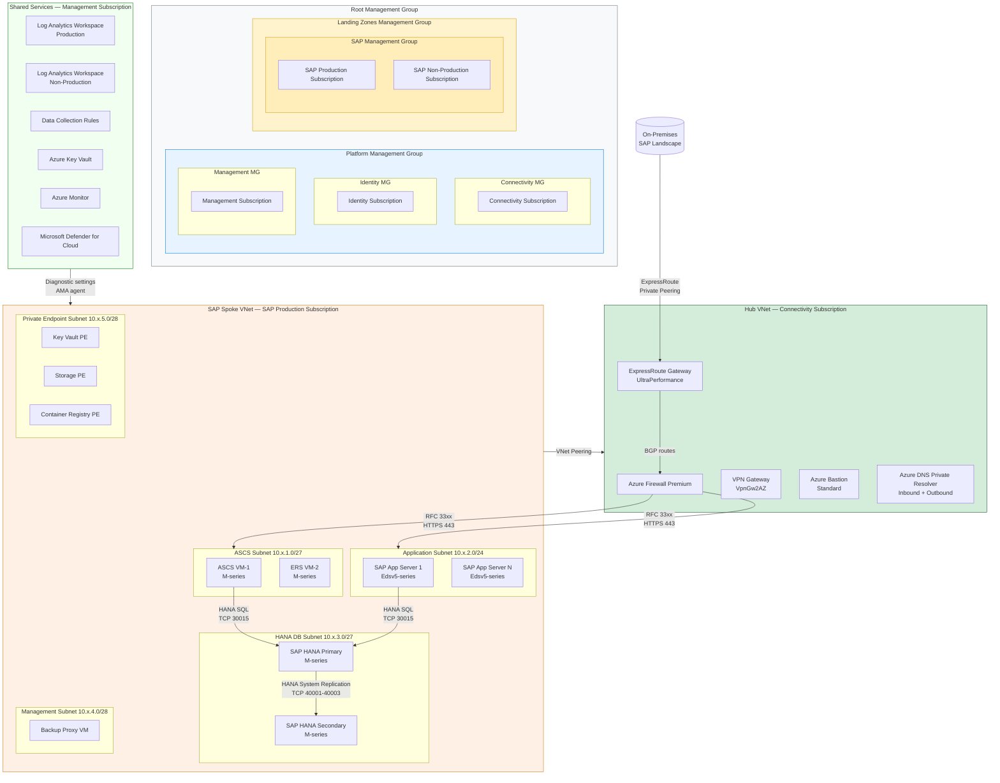

# Azure Landing Zone for SAP

---

## Overview

The Azure Landing Zone for SAP defines the foundational subscription, network, identity, governance, and security scaffolding required before any SAP workload is deployed. This chapter covers the design decisions, policy assignments, network topology, and operational controls that constitute a production-ready Azure landing zone specific to SAP S/4HANA, SAP NetWeaver, and SAP HANA deployments. It addresses the structural differences between a generic Azure Landing Zone and one tuned for the strict certification, latency, and availability requirements of SAP workloads.

The primary decisions addressed in this chapter are: management group hierarchy and subscription model for SAP environments, hub-spoke versus Azure Virtual WAN connectivity architecture, Azure Policy assignments that enforce SAP-specific constraints, and the RBAC model that governs least-privilege access across SAP infrastructure, basis, and security teams. Each decision is grounded in SAP certification requirements documented in the SAP Notes referenced throughout this chapter and in Microsoft's Azure Landing Zone guidance for SAP on Azure.

This chapter is the prerequisite reference for all other chapters in this handbook. The networking chapter assumes the hub-spoke topology defined here. The HANA chapter assumes the subnet design and NSG baseline defined here. The security chapter extends the Microsoft Entra ID integration patterns established here. No SAP workload chapter should be implemented without first validating that the landing zone described in this chapter is in place and validated against the checklist at the end of this document.

---

## Architecture Overview

The Azure Landing Zone for SAP implements a hub-spoke topology where a centrally managed connectivity subscription hosts shared network infrastructure and a dedicated SAP subscription (or pair of subscriptions for production and non-production) hosts all SAP workloads. The hub virtual network contains Azure Firewall Premium, ExpressRoute Gateway, and VPN Gateway. The SAP spoke virtual network contains separate subnets for the SAP application layer, HANA database layer, ASCS/ERS cluster, management, and private endpoints. All inter-subnet traffic traverses Azure Firewall Premium, which enforces application-layer inspection rules aligned with SAP port requirements.

Microsoft Entra ID serves as the identity plane for all Azure resource management and for SAP Fiori and SAP GUI access via SAP single sign-on integration. Azure Key Vault stores all secrets, certificates, and encryption keys for SAP workloads, with access governed by managed identities rather than service principal secrets. Azure Monitor Log Analytics provides a unified telemetry plane, with separate workspaces for production and non-production to enforce data segregation and independent retention policies.

The landing zone is deployed using Azure Verified Modules (Bicep) aligned with the Cloud Adoption Framework enterprise-scale reference architecture. All management group policies are assigned at the SAP management group scope, inheriting platform-level policies from the Landing Zones management group and adding SAP-specific deny and deployIfNotExists policies on top. The entire landing zone is expressed as infrastructure-as-code in the repository's `bicep/` directory and is deployed through a GitHub Actions pipeline with manual approval gates for the production subscription.

### Architecture diagram



Diagram `landing-zone-topology-flowchart-01` shows the management group hierarchy, subscription placement, hub-spoke network topology, and the primary traffic paths between on-premises, hub shared services, and the SAP production spoke. The ExpressRoute Gateway and Azure Firewall Premium in the hub control all ingress from on-premises. The SAP HANA System Replication path between primary and secondary HANA VMs is contained within the HANA DB subnet and does not traverse the firewall, satisfying SAP Note 2407186 latency requirements for synchronous replication.

---

## SAP Architecture

### SAP component roles and constraints

| SAP Component | Role in Architecture | Certification Requirement | SAP Reference |
|---|---|---|---|
| SAP S/4HANA Application Server (ABAP) | Hosts ABAP work processes, RFC server, ICM | Must run on certified Azure VM family; minimum 8 vCPUs per dialog instance | SAP Note 1928533 |
| SAP ASCS (ABAP Central Services) | Hosts message server and enqueue server; single point of failure requiring HA | Must be clustered; Azure shared disk or Azure NetApp Files required for /sapmnt | SAP Note 1928533; SAP Note 3007986 |
| SAP ERS (Enqueue Replication Server) | Replicates enqueue lock table to survive ASCS failure | Must run on a separate VM from ASCS; same availability zone or cross-zone with HSR | SAP Note 2630416 |
| SAP HANA Database | Primary persistence layer for S/4HANA; scale-up or scale-out | Requires HANA-certified VM (M-series or Mv2-series); specific storage throughput mandated | SAP Note 2235581; SAP Note 2382421 |
| SAP Web Dispatcher | HTTP/HTTPS load balancer for Fiori and SAP GUI over HTTP | Optional but required for Fiori production; can run on shared VM or dedicated | SAP Note 908382 |
| SAP Solution Manager (SolMan) | Landscape management, ABAP and Java stacks, diagnostic agents on all managed systems | Required for SAP support; diagnostic agents must be installed on all application VMs | SAP Note 1832249 |
| SAP Host Agent | Monitors hardware and OS metrics; prerequisite for SAP monitoring | Must be installed on all VMs in the SAP landscape | SAP Note 1031096 |
| SAP Transport Management System (TMS) | Controls ABAP transport routes between DEV, QAS, PRD | /usr/sap/trans shared directory must be accessible from all application servers | SAP Note 1745524 |

### SAP sizing principles

Sizing for the Azure Landing Zone for SAP begins with the SAP Quick Sizer output, which produces a SAPS (SAP Application Performance Standard) value representing the peak workload requirement. The SAPS value is mapped to Azure VM SKUs using the certified configurations in SAP Note 1928533. For SAP S/4HANA on SAP HANA, the HANA database sizing adds a second constraint: the total HANA working set (data, column store, row store, and buffer) must fit within the VM's physical memory with 50% overhead headroom to accommodate growth and online operations such as system copy and backup.

M-series VMs (Standard_M32ms through Standard_M208ms_v2) are the primary HANA-certified SKUs for scale-up deployments. Scale-out deployments using Azure NetApp Files (ANF) for shared storage can extend to 16 HANA worker nodes on Mv2-series. For the application layer, Edsv5-series VMs provide the cost-optimal balance of compute and local NVMe storage used for SAP work process temporary files. The ASCS and ERS instances require minimal compute but must be deployed on Premium SSD or ANF to satisfy the /sapmnt shared filesystem requirement.

SAPS requirements for the application layer are calculated as: total concurrent named users multiplied by the SAPS-per-user factor from the SAP Quick Sizer, rounded up to the next certified VM boundary. Do not size solely on user count; include batch job SAPS requirements from the customer's current SAP EarlyWatch Alert report.

### SAP integration dependencies

The landing zone must accommodate the following integration flows at the network layer:

- **RFC connections** between S/4HANA and external SAP systems (SAP BW/4HANA, SAP PI/PO, SAP GRC) over TCP ports 33xx and 48xx (RFC + SNC). These flows transit Azure Firewall Premium from the SAP spoke to external spokes or on-premises systems.
- **IDoc over IDOC_AAE** or **IDoc over ALE** from S/4HANA to SAP PI/PO, requiring port 33xx outbound from the application subnet.
- **SAP Solution Manager diagnostic agent** communication on TCP port 9010 (diagnostics) and TCP port 9000 (agent framework) from all SAP VMs to the SolMan server (on-premises or in a dedicated spoke).
- **SAP Host Agent** metrics reporting to SAP CCMS on TCP port 1128 (HTTP) and TCP port 1129 (HTTPS).
- **Azure Backup agent (MABS or native)** backup traffic from HANA VMs to Azure Backup Recovery Services Vault over HTTPS (TCP 443), routed through the private endpoint in the PE subnet.

---

## Azure Architecture

### Azure service mapping

| SAP Layer | Azure Service | SKU / Configuration | Availability Model | Notes |
|---|---|---|---|---|
| SAP HANA database (primary) | Azure Virtual Machines — M-series | Standard_M96ms_v2 (example; size per Quick Sizer) | Zonal — Availability Zone 1 | Write Accelerator enabled for log disk per SAP Note 2235581 |
| SAP HANA database (secondary HSR) | Azure Virtual Machines — M-series | Standard_M96ms_v2 (same SKU as primary) | Zonal — Availability Zone 2 | HSR synchronous replication; cross-zone latency tested per SAP Note 2015553 |
| SAP HANA data and log volumes | Azure NetApp Files | Ultra performance tier; Manual QoS | Regional (zone-redundant replication optional) | NFS 4.1; mount options per SAP Note 2382421 |
| SAP HANA shared volume | Azure NetApp Files | Premium performance tier; Manual QoS | Regional | /hana/shared; 1xRAM minimum per SAP Note 2235581 |
| ASCS / ERS cluster | Azure Virtual Machines — Edsv5-series | Standard_E4ds_v5 (2 nodes) | Zonal — AZ1 / AZ2 | Azure shared disk for /sapmnt (Premium SSD ZRS) or ANF |
| SAP application servers | Azure Virtual Machines — Edsv5-series | Standard_E16ds_v5 or E32ds_v5 | Zone-distributed (AZ1, AZ2, AZ3) | Scale-out; Azure Load Balancer (Standard, zone-redundant) in front |
| SAP Web Dispatcher | Azure Virtual Machines — Edsv5-series | Standard_E4ds_v5 (2 nodes, clustered) | Zonal — AZ1 / AZ2 | Internal Azure Load Balancer; Azure Application Gateway for internet access |
| Hub network — firewall | Azure Firewall Premium | Premium SKU, AZ-enabled | Zone-redundant (3 AZs) | IDPS enabled; TLS inspection for outbound SAP GUI HTTPS |
| Hub network — ExpressRoute | Azure ExpressRoute Gateway | UltraPerformance SKU, AZ-enabled | Zone-redundant | 10 Gbps circuit; FastPath enabled for HANA backup traffic |
| Secrets and certificates | Azure Key Vault | Standard SKU (or Premium for HSM) | Zone-redundant (ZRS) | Managed identity access only; no service principal secrets |
| OS and app log collection | Azure Monitor — Log Analytics | Dedicated workspace per environment tier | Regional | Azure Monitor Agent (AMA) replaces legacy MMA |
| Backup vault | Azure Backup — Recovery Services Vault | GRS or ZRS (per RTO/RPO requirements) | Geo-redundant or Zone-redundant | HANA Backint integration via Azure Backup for SAP HANA |
| DNS resolution | Azure DNS Private Resolver | Inbound + Outbound endpoints in hub | Zone-redundant | Resolves on-premises DNS for SAP hostnames; forwards Azure private DNS zones |
| Bastion access | Azure Bastion | Standard SKU (native client support) | Zone-redundant | Replaces jump VM; file transfer and port forwarding for SAP GUI |

### Azure Landing Zone integration

The SAP workload subscriptions are placed under a dedicated SAP Management Group, which is a child of the Landing Zones Management Group in the Cloud Adoption Framework enterprise-scale hierarchy. This placement ensures that SAP subscriptions inherit all platform-level policies (diagnostic settings, Defender for Cloud, tagging) while allowing the SAP Management Group to apply additional SAP-specific deny policies that restrict certain configurations incompatible with SAP certification.

The SAP Production subscription is separate from the SAP Non-Production subscription. This separation enforces blast radius isolation, independent budget controls, and independent lifecycle management. The connectivity subscription is shared with the rest of the enterprise; SAP does not deploy its own hub. SAP spoke virtual networks are peered to the existing hub with the `allowGatewayTransit` and `useRemoteGateways` flags set to route all SAP traffic through hub inspection services.

The management subscription hosts the Log Analytics workspaces, Azure Monitor data collection rules, and Microsoft Defender for Cloud configuration. SAP VMs use Azure Monitor Agent (AMA) with data collection rules (DCRs) that target the production Log Analytics workspace, ensuring SAP-specific log sources (SAP system logs, OS syslog, HANA trace files via the SAP monitoring extension) flow to the correct workspace with the correct retention period.

### Hub-spoke network integration

The SAP spoke virtual network requires a minimum of six subnets. Address space allocation must be planned at landing zone design time because subnets cannot overlap and resizing requires workload downtime.

| Subnet | Purpose | Address Size | NSG Required | UDR Required |
|---|---|---|---|---|
| snet-sap-ascs-prod | ASCS and ERS VMs | /27 (32 addresses) | Yes | Yes — default route to firewall |
| snet-sap-app-prod | SAP application servers | /24 (256 addresses) | Yes | Yes — default route to firewall |
| snet-sap-hana-prod | HANA primary and secondary VMs | /27 (32 addresses) | Yes | Yes — default route to firewall |
| snet-sap-mgmt-prod | Backup proxy, management VMs | /28 (16 addresses) | Yes | Yes — default route to firewall |
| snet-sap-pe-prod | Private endpoints | /28 (16 addresses) | No (PE network policies disabled) | No |
| snet-sap-wdisp-prod | SAP Web Dispatcher VMs | /28 (16 addresses) | Yes | Yes — default route to firewall |

All user-defined routes (UDRs) on SAP subnets send the default route (0.0.0.0/0) to the Azure Firewall private IP in the hub. This ensures no traffic leaves the SAP spoke without inspection. The private endpoint subnet is exempt from the UDR because private endpoint network policies are disabled and route injection is not applicable.

DNS resolution for SAP private endpoints and SAP hostnames follows the hub DNS forwarder pattern: the DNS Private Resolver inbound endpoint is the DNS server for all SAP VMs. The resolver conditionally forwards private DNS zone queries (privatelink.vaultcore.azure.net, etc.) to the Azure DNS service (168.63.129.16) and forwards on-premises SAP hostname queries (e.g., corp.sap.example.com) to on-premises DNS servers via the ExpressRoute-connected resolver.

---

## Design Decisions

| Decision | Options Considered | Choice | Rationale | SAP / Azure Reference |
|---|---|---|---|---|
| Subscription model for SAP workloads | Option A: Single subscription for all SAP environments; Option B: Dedicated subscription per environment (prod, non-prod); Option C: Dedicated subscription per SAP SID | Option B: Dedicated production and non-production subscriptions | Separating production from non-production enforces Azure Policy blast-radius isolation, independent budget controls via Azure Cost Management, and independent quota management. Per-SID subscriptions (Option C) were rejected due to operational overhead scaling non-linearly with landscape size. | [Azure CAF subscription design](https://learn.microsoft.com/azure/cloud-adoption-framework/ready/landing-zone/design-area/resource-org-subscriptions) |
| Network topology for SAP connectivity | Option A: Hub-spoke with Azure Firewall Premium; Option B: Azure Virtual WAN with routing intent; Option C: Flat VNet with NSG-only controls | Option A: Hub-spoke with Azure Firewall Premium | Azure Virtual WAN routing intent (Option B) was rejected because it introduces a managed routing plane that cannot be customized for SAP-specific route injection requirements (BGP AS path manipulation for SAP HANA System Replication). NSG-only controls (Option C) do not satisfy the requirement for application-layer IDPS inspection mandated by the customer's security policy. | [Azure Firewall Premium](https://learn.microsoft.com/azure/firewall/premium-features); SAP Note 2015553 |
| SAP HANA storage — data and log volumes | Option A: Azure Managed Disk Premium SSD v2; Option B: Azure Managed Disk UltraDisk; Option C: Azure NetApp Files Ultra tier with NFS 4.1 | Option C: Azure NetApp Files Ultra tier with NFS 4.1 | ANF provides consistent sub-millisecond latency for HANA log I/O without the per-VM IOPS cap of Premium SSD v2. UltraDisk was rejected because it does not support shared volumes required for HANA scale-out, and its per-VM IOPS ceiling (160,000 IOPS per disk) is insufficient for the workload sizing target. ANF also enables online HANA backup without Backint agent overhead at this capacity tier. | SAP Note 2382421; [ANF HANA sizing](https://learn.microsoft.com/azure/azure-netapp-files/azure-netapp-files-solution-architectures) |
| ASCS/ERS cluster shared storage | Option A: Azure Shared Disk (Premium SSD ZRS); Option B: Azure NetApp Files NFS share; Option C: NFS on SUSE/Red Hat cluster nodes | Option A: Azure Shared Disk (Premium SSD ZRS) for single-region; Option B: ANF for multi-region or cross-zone | Azure Shared Disk with ZRS replication is the simpler operational model for /sapmnt in single-region deployments and eliminates NFS server as a dependency. ANF is chosen when cross-zone ASCS clustering is required, as ZRS disk performance degrades under sustained IOPS in cross-zone configurations. NFS on cluster nodes (Option C) introduces a split-brain risk incompatible with the Azure shared-nothing clustering model. | SAP Note 3007986; [ASCS HA on Azure](https://learn.microsoft.com/azure/sap/workloads/high-availability-guide-suse-pacemaker) |
| Identity model for Azure resource management | Option A: Service principal with client secret per workload; Option B: User-assigned managed identity per VM role; Option C: System-assigned managed identity per VM | Option B: User-assigned managed identity per VM role | User-assigned managed identities are detached from the VM lifecycle, enabling identity pre-provisioning and consistent RBAC assignments across VM replacements (scale events, OS updates). System-assigned identities (Option C) are tied to the VM resource and require RBAC re-assignment on VM replacement. Service principal secrets (Option A) require rotation and secret management infrastructure. | [Azure managed identities](https://learn.microsoft.com/azure/active-directory/managed-identities-azure-resources/overview) |
| DNS resolution architecture | Option A: Custom DNS on Azure VMs (BIND/Windows DNS); Option B: Azure DNS Private Resolver in hub; Option C: Azure DNS only (no on-premises forwarding) | Option B: Azure DNS Private Resolver in hub | The DNS Private Resolver provides zone-redundant, managed DNS forwarding without requiring VM maintenance. It resolves private DNS zones for Azure private endpoints (required for Key Vault, Storage, Backup Vault) and conditionally forwards SAP-hostname queries to on-premises DNS. Custom VM DNS (Option A) was rejected due to the VM lifecycle management overhead. Azure DNS alone (Option C) cannot resolve on-premises SAP system hostnames required for RFC connections. | [Azure DNS Private Resolver](https://learn.microsoft.com/azure/dns/dns-private-resolver-overview) |
| Azure Firewall SKU selection | Option A: Azure Firewall Standard; Option B: Azure Firewall Premium | Option B: Azure Firewall Premium | The customer's security policy mandates IDPS (intrusion detection and prevention) for all production workload traffic, which is only available in the Premium SKU. TLS inspection for HTTPS-based SAP Fiori traffic also requires the Premium SKU. The additional cost is offset by consolidating NVA functionality into a single managed service. | [Azure Firewall Premium features](https://learn.microsoft.com/azure/firewall/premium-features) |
| SAP HANA high availability model | Option A: HSR (HANA System Replication) + Pacemaker (same-zone); Option B: HSR + Pacemaker (cross-zone); Option C: HANA scale-out with shared ANF storage | Option B: HSR + Pacemaker cross-zone with Azure Fence Agent | Cross-zone deployment protects against single-zone failure, which accounts for the highest-risk availability event in Azure. Same-zone (Option A) was rejected because it provides no protection against zone-level outages. Scale-out (Option C) is reserved for BW/4HANA workloads where data volume exceeds single-VM memory capacity. Azure Fence Agent is the certified fencing mechanism for Azure VMs in Pacemaker clusters. | SAP Note 2015553; [HANA HA cross-zone](https://learn.microsoft.com/azure/sap/workloads/sap-hana-high-availability-scale-up-anf-suse) |

!!! note "Architecture Decision Records"
    Each decision in this table has a corresponding ADR file under `adr/`. The ADR captures the full decision context, participants, and date. Reference ADR-0001 through ADR-0008 for expanded decision history.

---

## SAP Notes Reference

!!! warning "SAP Notes access"
    SAP Notes require an active SAP Support Portal account (S-user). Verify note applicability against your SAP product version and support package level before implementing. Note content changes; verify the current version before implementing guidance.

| SAP Note ID | Title / Purpose | Architecture Impact | Where Applied | Last Verified |
|---|---|---|---|---|
| 1928533 | SAP Applications on Azure: Supported Products and Azure VM Types | Defines which Azure VM families and SKUs are certified for each SAP product version. Restricts HANA to M-series and Mv2-series. Restricts application layer to specific Edsv5, Eds_v4, and other certified families. | VM SKU selection for all SAP layers; Azure Architecture section | 2025-06 |
| 2235581 | SAP HANA: Supported Operating Systems | Defines supported OS versions for SAP HANA on Azure, required kernel parameters, and storage configuration minimums for /hana/data, /hana/log, /hana/shared. Mandates Write Accelerator on M-series for log volumes. | HANA VM OS selection; storage configuration; Write Accelerator enablement | 2025-06 |
| 2382421 | Network Configuration for SAP HANA | Mandates dedicated NFS storage network for HANA scale-out, NFS 4.1 mount options (hard,timeo=600,rsize=262144,wsize=262144,nconnect=4), and maximum acceptable latency for HANA log I/O (250 microseconds). | ANF mount options; HANA subnet NSG design; storage subnet isolation | 2025-06 |
| 2015553 | SAP on Microsoft Azure: Support Prerequisites | Defines the minimum Azure infrastructure requirements that SAP Support requires before opening incidents: ExpressRoute or VPN (no public internet SAP traffic), Azure Monitor agent on all VMs, and SAP Host Agent on all VMs. | ExpressRoute requirement; monitoring agent deployment; support model | 2025-06 |
| 2630416 | Support for Standalone Enqueue Server 2 | Mandates use of Enqueue Server 2 (ENSA2) for new SAP S/4HANA deployments. Defines the ERS2 clustering configuration and the failover behavior difference from ENSA1. | ASCS/ERS cluster design; Pacemaker resource agent selection | 2025-06 |
| 3007986 | SAP HANA on Azure: Large Instances Retirement / Azure VM guidance | Provides updated guidance on HANA VM SKU selection following HANA Large Instance (HLI) retirement. Defines the Mv2-series as the replacement for most HLI configurations. | VM SKU selection for large HANA workloads; migration from HLI | 2025-06 |
| 2407186 | SAP HANA System Replication latency requirements | Defines the maximum round-trip latency acceptable for synchronous HANA System Replication (HSR): 1 millisecond for synchronous mode. Cross-zone RTT in Azure regions must be measured and documented before production go-live. | HANA HA cross-zone design; Availability Zone pair selection | 2025-06 |
| 1745524 | SAP Transport Management System on Azure | Defines requirements for the /usr/sap/trans shared transport directory: NFS mount performance requirements, locking behavior, and the prohibition against placing transport directories on SMB shares for ABAP stacks. | Transport directory design; ANF or Azure Files NFS for /usr/sap/trans | 2025-06 |
| 2578899 | SUSE Linux Enterprise Server 15: Installation Note | Required OS configuration for SLES 15 as the SAP HANA database OS: kernel parameters, grub configuration, swap size, and required RPM packages. | HANA VM OS configuration; IaC provisioning scripts | 2025-06 |
| 1031096 | Installing SAP Host Agent | Mandates SAP Host Agent installation on all VMs in the SAP landscape. Defines the minimum SAP Host Agent version compatible with Azure infrastructure monitoring extensions. | VM provisioning; monitoring agent deployment pipeline | 2025-06 |
| 2369910 | SAP Software on Linux: General information | Defines general Linux OS requirements for SAP workloads: file descriptor limits, kernel semaphore configuration, IP stack parameters. All values must be set via Azure VM extensions or cloud-init at provisioning time. | VM OS hardening; IaC provisioning | 2025-06 |
| 908382 | SAP Web Dispatcher: Configuration | Defines Web Dispatcher configuration for SAP Fiori and SAP GUI over HTTP. Mandates HTTPS termination at the Web Dispatcher for internet-facing Fiori deployments. Relevant to Azure Application Gateway integration. | Web Dispatcher subnet design; Application Gateway WAF integration | 2025-06 |

---

## Azure Well-Architected Alignment

| Pillar | Relevant Guidance | Implementation in This Chapter |
|---|---|---|
| **Reliability** | Design for failure at zone level; single points of failure must be clustered | ASCS/ERS deployed as Pacemaker cluster across AZ1/AZ2; HANA deployed with HSR synchronous replication across AZ1/AZ2; Azure Load Balancer Standard (zone-redundant) fronts all clustered resources; ExpressRoute Gateway deployed as zone-redundant UltraPerformance SKU |
| **Reliability** | Define and test recovery time and recovery point objectives before go-live | RPO of 15 minutes and RTO of 4 hours defined in HA/DR section; HANA backup via Azure Backup for SAP HANA (Backint) with RPO validation; cross-zone HSR provides RPO near-zero for infrastructure failures |
| **Reliability** | Automate health probes and self-healing for clustered resources | Azure Internal Load Balancer health probes on TCP port 62500 (ASCS) and 62501 (ERS) with probe interval 5 seconds; Pacemaker resource monitor with monitor interval 20 seconds; Azure Fence Agent for STONITH fencing |
| **Security** | Enforce least-privilege access with managed identities; no long-lived secrets | All SAP VM access to Azure Key Vault, Azure Storage, and Azure Backup uses user-assigned managed identities; no service principal secrets stored in VM configuration; Key Vault access policies replaced with Azure RBAC |
| **Security** | Encrypt data at rest and in transit; use customer-managed keys for regulated workloads | Azure Disk Encryption (ADE) with customer-managed keys in Key Vault for all SAP VM OS and data disks; ANF volumes encrypted with platform-managed keys (CMK available for regulated deployments); all traffic to Azure PaaS services via private endpoints (no public endpoints) |
| **Security** | Inspect and filter all network traffic between workload segments | Azure Firewall Premium with IDPS enabled inspects all east-west traffic between SAP subnets and all north-south traffic between SAP spoke and on-premises; NSGs on all subnets enforce subnet-level default-deny with explicit allow rules; flow logs enabled on all NSGs |
| **Cost Optimization** | Right-size compute resources; use Azure Reservations for predictable workloads | SAP HANA and application server VMs sized to SAP Quick Sizer output with 20% headroom; 3-year Reserved Instances applied to production HANA and ASCS VMs (committed baseline); non-production uses pay-as-you-go with auto-shutdown schedules |
| **Cost Optimization** | Use Azure Hybrid Benefit for eligible OS licenses | SUSE Linux Enterprise Server licenses applied via Azure Hybrid Benefit where customer holds active SUSE subscriptions; reduces OS cost per VM by up to 40% versus pay-as-you-go SLES pricing |
| **Operational Excellence** | Deploy all infrastructure as code; no manual portal configurations in production | All landing zone components (management groups, subscriptions, hub VNet, SAP spoke VNet, NSGs, UDRs, policies) deployed via Bicep modules in the repository's `bicep/` directory; GitHub Actions pipeline enforces code review and manual approval for production |
| **Operational Excellence** | Centralize monitoring; minimize alert fatigue with severity-tiered alerting | Single Log Analytics workspace per environment tier; Azure Monitor Alerts consolidated into Action Groups by severity; SAP-specific alert rules (HANA memory, ASCS cluster state, replication lag) defined as IaC in `bicep/monitoring/` |
| **Performance Efficiency** | Ensure storage meets SAP-mandated IOPS and throughput minimums | ANF Ultra tier for HANA data and log volumes; throughput allocated via Manual QoS per SAP Note 2382421 minimums (HANA log: minimum 250 MB/s per volume; HANA data: minimum 400 MB/s per volume); Write Accelerator enabled on M-series HANA log disks |
| **Performance Efficiency** | Measure and validate performance before go-live and after each major change | HANA volume throughput validated using `fio` benchmark post-deployment per SAP Note 2382421; cross-zone HSR latency measured using `hdbnsutil -sr_stateConfiguration` and must be below 1 ms RTT per SAP Note 2407186; SAP EarlyWatch Alert review within 30 days of go-live |

---

## Security Architecture

### Identity and access management

Microsoft Entra ID is the single identity provider for all Azure resource management and for SAP application access. All human operator access to SAP VMs is brokered through Azure Bastion (Standard SKU) with native client support, eliminating the need for public IP addresses on any SAP VM. SAP basis administrators authenticate to Azure Bastion using their Entra ID credentials with Conditional Access enforcing MFA and requiring a managed or compliant device.

SAP application access (SAP GUI, SAP Fiori) is federated through Microsoft Entra ID using SAML 2.0. The SAP NetWeaver ABAP stack is registered as an Enterprise Application in Entra ID. Conditional Access policies enforce MFA for all SAP Fiori access from outside the corporate network. SAP GUI access from on-premises is authenticated via SNC (Secure Network Communications) using Kerberos through the on-premises Active Directory forest, which is synchronized to Entra ID via Microsoft Entra Connect.

User-assigned managed identities are created for each VM role (HANA primary, HANA secondary, ASCS, application server, Web Dispatcher) and assigned the minimum required RBAC roles:

| Managed Identity | RBAC Role | Scope | Purpose |
|---|---|---|---|
| id-sap-hana-prod | Key Vault Secrets User | Key Vault resource | Read HANA SSL certificates and backup encryption keys |
| id-sap-hana-prod | Storage Blob Data Contributor | Backup storage account | Write HANA Backint backups to Azure Blob Storage |
| id-sap-ascs-prod | Key Vault Secrets User | Key Vault resource | Read cluster certificates |
| id-sap-app-prod | Key Vault Secrets User | Key Vault resource | Read SAP SSL certificates for SNC |
| id-sap-mgmt-prod | Virtual Machine Contributor | SAP spoke resource group | Fence (power-off) VMs during Pacemaker STONITH |

!!! danger "Privileged access to SAP HANA"
    Direct SSH access to HANA VMs using OS-level passwords is prohibited in production. All privileged access must use Azure Bastion with Entra ID authentication and MFA. The HANA system database `SYSTEM` user password must be stored in Azure Key Vault and rotated quarterly. Emergency break-glass access uses a separate Entra ID account enrolled in Azure PIM, with access time-limited to 8 hours and all activity logged to a dedicated Log Analytics workspace with a 365-day immutable retention policy.

### Network security

The network security model follows a default-deny posture. All SAP subnets have NSGs with an explicit DenyAll inbound rule at priority 4096. Allow rules are added for only the specific source/destination/port combinations required for SAP operation.

#### Required NSG rules — HANA database subnet

| Direction | Source | Destination | Port / Protocol | Purpose | SAP Reference |
|---|---|---|---|---|---|
| Inbound | snet-sap-app-prod (CIDR) | snet-sap-hana-prod | TCP 30013-30015 | HANA SQL and system database access from application servers | SAP Note 2382421 |
| Inbound | snet-sap-ascs-prod (CIDR) | snet-sap-hana-prod | TCP 30013-30015 | HANA access from ASCS VMs | SAP Note 2382421 |
| Inbound | snet-sap-hana-prod (CIDR) | snet-sap-hana-prod | TCP 40001-40003 | HANA System Replication between primary and secondary | SAP Note 2407186 |
| Inbound | snet-sap-mgmt-prod (CIDR) | snet-sap-hana-prod | TCP 22 | SSH via Azure Bastion for HANA administration | Azure Bastion |
| Inbound | AzureMonitor service tag | snet-sap-hana-prod | TCP 443 | Azure Monitor Agent health reporting | Azure Monitor |
| Outbound | snet-sap-hana-prod | snet-sap-pe-prod (CIDR) | TCP 443 | HTTPS to Key Vault and Storage private endpoints | Azure Private Endpoint |
| Outbound | snet-sap-hana-prod | AzureBackup service tag | TCP 443 | Azure Backup Backint integration | Azure Backup |
| Inbound | DenyAll | All | All | Default deny all | — |

#### Required NSG rules — SAP application subnet

| Direction | Source | Destination | Port / Protocol | Purpose | SAP Reference |
|---|---|---|---|---|---|
| Inbound | snet-sap-ascs-prod (CIDR) | snet-sap-app-prod | TCP 33xx, 48xx | RFC and SNC from ASCS to application servers | SAP Note 2015553 |
| Inbound | AzureLoadBalancer service tag | snet-sap-app-prod | TCP 62500-62502 | Load balancer health probes | Azure LB |
| Inbound | snet-sap-mgmt-prod (CIDR) | snet-sap-app-prod | TCP 22 | SSH via Azure Bastion | Azure Bastion |
| Outbound | snet-sap-app-prod | snet-sap-hana-prod (CIDR) | TCP 30013-30015 | HANA SQL access from application servers | SAP Note 2382421 |
| Outbound | snet-sap-app-prod | snet-sap-ascs-prod (CIDR) | TCP 33xx, 36xx | RFC and message server access | SAP Note 1928533 |
| Inbound | DenyAll | All | All | Default deny all | — |

### Data protection

All SAP VM OS disks and data disks are encrypted using Azure Disk Encryption (ADE) with customer-managed keys stored in Azure Key Vault. The Key Vault uses the Premium SKU with HSM-backed keys for the production encryption key. Key rotation is automated through Azure Key Vault key rotation policy with a 1-year rotation interval and a 30-day pre-expiry notification.

ANF volumes are encrypted at rest using platform-managed keys by default. For regulated deployments requiring customer-managed key (CMK) encryption on ANF, the deployment uses the ANF CMK feature with a dedicated Key Vault instance, as the CMK Key Vault must be separate from the SAP secrets Key Vault.

All data in transit between SAP VMs and Azure PaaS services (Key Vault, Storage, Backup) flows through private endpoints within the spoke VNet. TLS 1.2 is enforced on all private endpoint connections. SAP GUI connections from on-premises use SNC with AES-256 encryption per SAP NetWeaver SNC configuration requirements.

### Microsoft Entra ID integration

The SAP S/4HANA Fiori launchpad is integrated with Microsoft Entra ID using SAML 2.0 via the SAP NetWeaver BTP Identity Authentication Service (IAS) as a proxy. This allows the customer's Entra ID Conditional Access policies to govern all SAP Fiori access without requiring direct SAML federation between Entra ID and each SAP system SID.

For privileged SAP Basis access, Azure Privileged Identity Management (PIM) is configured for the Entra ID group that grants VM Administrator access to SAP production VMs. PIM requires business justification and MFA at time of activation, with a maximum activation duration of 4 hours. All PIM activation events are forwarded to the production Log Analytics workspace.

### Security monitoring

Microsoft Defender for Cloud is enabled at the subscription level with the following plans active for SAP subscriptions: Defender for Servers (Plan 2), Defender for Storage, and Defender for Key Vault. Defender for Servers Plan 2 includes file integrity monitoring (FIM), which is configured to monitor the SAP kernel directory (/usr/sap/*/exe) and HANA data directory (/hana) for unauthorized file modifications.

The Microsoft Sentinel solution for SAP applications is deployed, collecting SAP audit log, change document log, and security audit log via the SAP data connector (agentless, using SAP RFC). Sentinel analytics rules detect privilege escalation (SAP_BASIS role assignments outside change window), mass data export (report RSDBAJOB with large output), and critical table access (SE16 on client-independent tables).

!!! tip "Microsoft Sentinel for SAP"
    The Microsoft Sentinel solution for SAP applications requires the SAP Audit Log to be configured with a minimum logging level of 3 (LOGXL_MASK_3) in SAP transaction SM19. Lower logging levels will cause the Sentinel analytics rules for privilege escalation and data exfiltration to produce false negatives. Verify SM19 configuration in all SAP system clients after go-live.

---

## Reliability and High Availability

### High availability architecture

The landing zone implements high availability at three layers: the SAP application layer (ASCS/ERS cluster), the SAP HANA database layer (HSR with Pacemaker), and the Azure infrastructure layer (Availability Zones and zone-redundant services). The HA design targets SAP's definition of high availability: the ability to tolerate any single component failure — including an entire Azure Availability Zone — without requiring manual intervention and with automatic failover completing within the defined RTO window.

**ASCS/ERS cluster**: Two VMs in AZ1 and AZ2 run the ASCS and ERS instances respectively, managed by Pacemaker with Azure Fence Agent for STONITH fencing. The cluster uses the ENSA2 (Enqueue Server 2) architecture per SAP Note 2630416, which allows ERS to retain the lock table during a failover, reducing the risk of lock loss. The cluster VIP is hosted by an Azure Internal Load Balancer (Standard SKU, zone-redundant) with health probes on TCP port 62500 (ASCS) and TCP port 62501 (ERS).

**HANA database cluster**: Two M-series VMs in AZ1 and AZ2 run SAP HANA with HSR in synchronous mode (SYNC). Pacemaker with the SAPHanaController and SAPHanaTopology resource agents manages automatic failover. The takeover time for cross-zone HSR failover is expected to be 60-120 seconds including Azure Fence Agent fencing, ILB health probe failure detection (30 seconds), and HANA takeover. This determines the lower bound of the RTO for the database tier.

**Application server availability**: SAP application servers are distributed across AZ1, AZ2, and AZ3 in equal thirds. The SAP logon group configuration distributes user sessions across available application servers. When an application server VM fails, users in active sessions receive an RFC connection error and must reconnect, which the SAP GUI handles with automatic reconnect if the connection error occurs at a safe point. Application server statelessness means no data is lost on application server failure.

### RPO and RTO targets

| Component | Failure Scenario | RPO Target | RTO Target | Recovery Mechanism | Validated |
|---|---|---|---|---|---|
| SAP HANA database | Single disk failure | 0 (RAID via ANF) | < 5 minutes (ANF self-healing) | ANF volume redundancy (3-way replication internally) | Yes — ANF SLA |
| SAP HANA database | VM failure (same zone) | Near-zero (HSR synchronous) | < 5 minutes (Pacemaker auto-failover) | HSR takeover via Pacemaker SAPHanaController | Validated in staging |
| SAP HANA database | Availability Zone failure | Near-zero (HSR synchronous) | < 10 minutes (cross-zone failover) | Cross-zone HSR + Pacemaker + Azure Fence Agent | Validated in staging |
| SAP HANA database | Regional failure (DR) | 15 minutes (async HSR to DR region) | 4 hours (manual failover procedure) | HSR async replication to DR region; manual takeover | Planned quarterly test |
| ASCS / ERS cluster | ASCS VM failure | 0 (ENSA2 ERS holds lock table) | < 3 minutes (Pacemaker failover) | Pacemaker moves ASCS resource to surviving node | Validated in staging |
| ASCS / ERS cluster | Availability Zone failure | 0 | < 5 minutes | ASCS moves to surviving AZ node | Validated in staging |
| SAP application server | VM failure | 0 (stateless) | < 2 minutes (Azure VMSS replacement) or manual | User reconnects to surviving application server | Validated |
| SAP Web Dispatcher | VM failure | 0 (stateless) | < 30 seconds (ILB health probe detects; routes to survivor) | Azure ILB with health probes | Validated |
| Azure Key Vault | Zone failure | N/A | Transparent (ZRS) | Azure Key Vault ZRS built-in | Azure SLA |
| Azure Backup Recovery Services Vault | Zone failure | N/A | Transparent (ZRS) | GRS/ZRS vault redundancy | Azure SLA |

### Disaster recovery

The disaster recovery site is in a paired Azure region. SAP HANA is replicated to the DR site using HSR in asynchronous mode (ASYNC). The DR HANA VM is the same SKU as production to eliminate resizing delays during failover. The DR site runs in a cold standby configuration (HANA VM started but SAP application layer not running) to minimize DR cost while meeting the 4-hour RTO.

DR failover is a documented manual procedure, not an automated Pacemaker failover. Automation would require a fully replicated application layer in the DR region (hot standby), which is reserved for Tier 0 SAP workloads requiring RTO under 1 hour. The DR procedure is stored in the runbook directory and tested quarterly.

Azure Site Recovery (ASR) is not used for the SAP HANA VM because HSR provides superior database-consistent replication. ASR is used for the ASCS and application server VMs to replicate OS disks to the DR region, providing a recovery path for the application layer independent of SAP-level replication.

!!! warning "DR test requirement"
    The disaster recovery procedure must be tested in a non-production environment before production go-live. DR tests that execute the full failover and failback procedure on the production systems without a preceding staging validation violate the SAP Support prerequisite in SAP Note 2015553. Schedule a full DR test in the staging environment within 60 days of production go-live.

---

## Cost Optimization

### Cost model and drivers

The SAP landing zone cost model has four primary cost categories: compute (VM reservations), storage (ANF and managed disks), networking (ExpressRoute, Azure Firewall, data transfer), and platform services (Defender for Cloud, Azure Monitor, Azure Backup). Compute and storage together represent approximately 70-75% of total monthly spend for a production SAP S/4HANA deployment on Azure.

| Cost Component | Estimated Monthly Range | Optimization Lever | Savings Potential |
|---|---|---|---|
| HANA M-series VMs (production, 2x for HA) | High (largest single cost item) | 3-year Reserved Instances; Azure Hybrid Benefit for SUSE or RHEL | 40-60% vs pay-as-you-go with 3-year RI + AHB |
| Application server Edsv5 VMs | Medium | 1-year Reserved Instances for predictable baseline; auto-shutdown for non-production | 30-40% vs pay-as-you-go with 1-year RI |
| Azure NetApp Files (Ultra tier, HANA data+log+shared) | Medium-High | Right-size capacity pool at 120% of peak usage; periodic unused volume cleanup | 15-25% through accurate capacity sizing |
| Azure Firewall Premium | Medium | Single Firewall instance shared across all SAP and non-SAP spoke VNets (hub sharing) | N/A if already shared — cost is per deployment unit |
| ExpressRoute circuit | Medium | Scale circuit bandwidth to 80% utilization target; downsize circuit if telemetry shows sustained <50% utilization | 20-30% per bandwidth tier reduction |
| Azure Backup (HANA Backint + VM snapshots) | Low-Medium | Lifecycle management: move backups to Cool tier after 30 days; delete expired backups automatically | 30-40% on backup storage through tiering policy |
| Microsoft Defender for Cloud (Defender for Servers P2) | Low | Enable only on production SAP subscription; use Foundational CSPM for non-production | 50% on Defender for Servers cost for non-production |
| Azure Monitor Log Analytics (ingestion + retention) | Low-Medium | Data collection rules to filter verbose logs (OS debug logs, verbose RFC traces) before ingestion; Basic tier for archive logs beyond 90 days | 20-30% on ingestion cost through pre-ingestion filtering |
| Non-production SAP VMs (dev/test) | Medium | Auto-shutdown schedule (18:00-08:00 weekdays, full weekend); deallocate rather than stop | 40-60% on non-production compute |

### Azure Reservations and Savings Plans

For the production SAP HANA VMs (M-series), 3-year Reserved Instances provide the maximum discount against pay-as-you-go rates. M-series VMs are always-on by design (HANA database is rarely shut down), making them ideal RI candidates. The reservation must match the exact VM SKU, region, and tenancy (shared or single).

For SAP application server VMs (Edsv5-series), 1-year Reserved Instances are preferred over 3-year because application server sizing changes more frequently as the workload grows or as SAP landscape consolidation occurs. Azure Savings Plans are evaluated quarterly as an alternative to RI when the application server fleet SKU changes frequently.

Azure Hybrid Benefit (AHB) for Linux applies when the customer holds active SUSE Linux Enterprise Server for SAP Applications (SLES for SAP) or Red Hat Enterprise Linux for SAP (RHEL for SAP) subscriptions. AHB eliminates the OS license surcharge from the Azure VM price. For M-series VMs, the OS license surcharge is significant relative to the total VM price; AHB should be applied at deployment time via the `licenseType: SLES_SAP` or `licenseType: RHEL_SAP` property in the Bicep module.

### Cost governance

Azure Cost Management budgets are configured at the subscription level with monthly spend alert thresholds at 80% and 100% of the monthly budget. A second budget alert at 20% month-over-month increase detects unexpected compute or storage growth. Budget alerts trigger email notifications to the cloud FinOps team and the SAP project owner.

All SAP Azure resources must carry the following tags at deployment time. The tagging policy is enforced by an Azure Policy `Deny` effect at the SAP Management Group scope.

| Tag Key | Required | Example Value | Purpose |
|---|---|---|---|
| `sap-system-id` | Required | `PRD`, `QAS`, `DEV` | Identifies the SAP System ID (SID) for cost allocation per SAP system |
| `sap-component` | Required | `HANA`, `APP`, `ASCS`, `WDISP` | Identifies the SAP component layer for cost reporting |
| `environment` | Required | `production`, `non-production` | Environment classification for budget segregation |
| `cost-center` | Required | `CC-SAP-PROD-001` | Finance cost allocation code |
| `owner` | Required | `sap-platform-team@example.com` | Ownership for operational accountability |
| `managed-by` | Required | `bicep-pipeline` | Identifies IaC-managed resources; alerts on manual drift |
| `dr-tier` | Optional | `tier-1`, `tier-2`, `none` | DR priority tier for failover sequencing |

A monthly cost review cadence is established between the SAP platform team and the FinOps team. The review consumes the Azure Cost Management export (daily granularity, resource-level detail) and compares actual spend against the landing zone cost model. Deviations above 10% trigger a right-sizing review.

---

## Operations and Monitoring

### Monitoring architecture

SAP workloads on Azure require a layered monitoring architecture that spans infrastructure telemetry, OS-level metrics, database internals, and application-layer health signals. The canonical design uses a single Azure Monitor Log Analytics workspace per SAP environment tier (non-production and production separated), with Azure Monitor serving as the unified collection and query plane.

**Log Analytics workspace design**

Deploy one Log Analytics workspace per environment tier. The production workspace uses a 90-day interactive retention period and a 365-day total retention period (archive tier at 90+ days). The non-production workspace uses 30-day interactive and 90-day total retention. Workspace pricing uses the Commitment Tier (100 GB/day commitment or higher depending on ingestion volume) to reduce per-GB ingestion cost relative to pay-as-you-go.

Data collection rules (DCRs) replace legacy workspace-level collection settings. DCRs are defined per VM role (HANA DCR, ASCS DCR, application server DCR) and assigned to the corresponding managed identity-based VM association. This allows fine-grained control over which log sources and performance counters are collected per role, reducing ingestion noise and cost.

**Azure Monitor Agent deployment**

Azure Monitor Agent (AMA) is deployed to all SAP VMs via the `AzureMonitorLinuxAgent` VM extension, provisioned through the Bicep landing zone modules. AMA replaces the legacy Microsoft Monitoring Agent (MMA) and the OMS agent. Do not deploy both AMA and MMA on the same VM; the dual-agent configuration causes duplicate data ingestion and alert noise.

**SAP monitoring extension (Azure Extension for SAP)**

The Azure Extension for SAP (formerly SAP Enhanced Monitoring) is installed on all SAP VMs. This extension exposes infrastructure metrics (CPU, memory, disk I/O, network I/O) to the SAP host agent in the format required by SAP transaction ST05, ST12, and DBACOCKPIT. The extension is a prerequisite for SAP Support per SAP Note 2015553. Deploy the `new` version of the extension (not the `classic` version) for all VMs running on hypervisor generations Gen2.

### Alert strategy

Alerts are tiered by severity. Severity 0 (critical) alerts page the on-call engineer immediately. Severity 1 (high) alerts create incidents in the ITSM system within 5 minutes. Severity 2 (medium) alerts create incidents in normal business hours. Severity 3 (informational) alerts are logged only.

| Alert Name | Source | Metric / Query | Threshold | Severity | Action Group | Remediation Runbook |
|---|---|---|---|---|---|---|
| HANA memory utilization critical | Azure Monitor Metrics | Percentage Memory on HANA VM | > 95% for 5 minutes | 0 — Critical | ag-sap-oncall-prod | runbook-hana-memory-high |
| HANA memory utilization warning | Azure Monitor Metrics | Percentage Memory on HANA VM | > 90% for 10 minutes | 1 — High | ag-sap-prod | runbook-hana-memory-high |
| HANA disk I/O throughput degradation | Log Analytics KQL | AzureMetrics where MetricName == "Disk Write Bytes/sec" | < 200 MB/s for 5 minutes on /hana/log | 1 — High | ag-sap-prod | runbook-hana-storage-throughput |
| HANA System Replication lag | SAP HANA monitoring view | SYS.M_SERVICE_REPLICATION.LOG_POSITION_TIME lag | > 30 seconds | 0 — Critical | ag-sap-oncall-prod | runbook-hana-hsr-lag |
| ASCS cluster resource failed | Pacemaker log via AMA | Custom log table: Heartbeat failure or resource in FAILED state | Any FAILED resource | 0 — Critical | ag-sap-oncall-prod | runbook-ascs-cluster-failed |
| SAP application server unreachable | Azure Monitor — VM heartbeat | Heartbeat \| summarize LastCall=max(TimeGenerated) by Computer | > 5 minutes since last heartbeat | 1 — High | ag-sap-prod | runbook-appserver-unreachable |
| ExpressRoute circuit utilization | Azure Monitor Metrics | BitsInPerSecond on ER circuit | > 8 Gbps (80% of 10 Gbps circuit) for 30 minutes | 2 — Medium | ag-sap-prod | runbook-expressroute-saturation |
| Azure Firewall SNAT port exhaustion | Azure Monitor Metrics | SNATPortUtilization on Azure Firewall | > 80% for 15 minutes | 1 — High | ag-sap-prod | runbook-firewall-snat |
| SAP VM CPU saturation | Azure Monitor Metrics | Percentage CPU on application server VMs | > 90% for 15 minutes | 2 — Medium | ag-sap-prod | runbook-appserver-cpu |
| Azure Backup job failure | Azure Backup alert | Backup job status != Completed | Any backup job failure | 1 — High | ag-sap-prod | runbook-backup-failure |
| Key Vault availability | Azure Monitor Metrics | Availability on Key Vault | < 100% for 5 minutes | 0 — Critical | ag-sap-oncall-prod | runbook-keyvault-unavailable |
| Defender for Cloud high severity finding | Microsoft Defender for Cloud | Security recommendation severity | High or Critical recommendation on SAP resource | 1 — High | ag-sap-security | runbook-defender-finding |

### Log collection strategy

| Log Source | Log Category | Retention (Interactive) | Retention (Archive) | Workspace | Purpose |
|---|---|---|---|---|---|
| HANA VM — OS syslog | Linux syslog (AMA) | 90 days | 365 days | law-sap-prod | OS-level errors; kernel OOM events; NFS mount failures |
| HANA VM — SAP HANA trace logs | Custom log via AMA file collection | 90 days | 365 days | law-sap-prod | HANA internal errors; backup failures; replication errors |
| ASCS VM — OS syslog | Linux syslog (AMA) | 90 days | 365 days | law-sap-prod | Pacemaker cluster events; fence agent actions |
| ASCS VM — Pacemaker log | Custom log via AMA file collection (/var/log/pacemaker.log) | 90 days | 365 days | law-sap-prod | Cluster resource state changes; failover events |
| Application server VMs — SAP system log | Custom log via AMA | 90 days | 365 days | law-sap-prod | SAP work process restarts; RFC connection errors |
| All SAP VMs — Azure Monitor Agent heartbeat | Heartbeat table (built-in) | 30 days | 90 days | law-sap-prod | VM availability monitoring |
| Azure Firewall — network rule logs | AzureDiagnostics / Azure Firewall logs | 30 days | 90 days | law-sap-prod | Firewall allow/deny decisions for SAP ports |
| NSG flow logs — all SAP subnets | NSG flow logs (via DCR) | 30 days | 90 days | law-sap-prod | Network traffic analysis; security investigation |
| Key Vault — audit logs | AzureDiagnostics (KVAuditLogs) | 90 days | 365 days | law-sap-prod | Secret access auditing; certificate operations |
| Microsoft Entra ID — sign-in logs | SigninLogs | 30 days | 90 days | law-sap-prod | SAP Fiori authentication events; Conditional Access results |
| Microsoft Sentinel — SAP audit log | SAP Audit Log via SAP data connector | 90 days | 365 days | law-sap-prod | SAP security events; privilege escalation; mass data export |

### Backup and recovery

| Component | Backup Solution | Frequency | Interactive Retention | Archive Retention | RTO | RPO | Test Frequency |
|---|---|---|---|---|---|---|---|
| SAP HANA database — full | Azure Backup for SAP HANA (Backint) | Daily (00:00 UTC) | 30 days | 90 days (Cool tier) | 4 hours | 24 hours (full backup RPO) | Quarterly restore test |
| SAP HANA database — incremental | Azure Backup for SAP HANA (Backint) | Every 4 hours | 7 days | N/A | 4 hours | 4 hours | Monthly restore test |
| SAP HANA database — log backup | Azure Backup for SAP HANA (Backint) | Every 15 minutes | 3 days | N/A | 4 hours | 15 minutes | Monthly restore test |
| ASCS VM — OS disk snapshot | Azure Backup VM snapshot | Daily | 14 days | N/A | 1 hour | 24 hours | Quarterly restore test |
| Application server VMs — OS disk | Azure Backup VM snapshot | Daily | 14 days | N/A | 30 minutes (redeploy from image) | 24 hours | Quarterly |
| /usr/sap/trans (transport directory) | Azure Backup — ANF snapshot via backup vault | Every 6 hours | 7 days | 30 days | 2 hours | 6 hours | Quarterly |
| Azure Key Vault — soft delete | Key Vault built-in soft delete | Continuous | 90 days (purge protection) | N/A | Minutes | Near-zero | Annual review |

### Patch management

SAP systems have a strict patching sequence that must be followed to avoid HANA database corruption or cluster instability. Azure Update Manager is configured with maintenance windows aligned to this sequence.

**SAP patching sequence for production**:
1. Patch the HANA secondary node first. Verify HSR replication catches up (log position delta = 0) before patching the primary.
2. Execute a planned HANA System Replication takeover to promote the patched secondary to primary.
3. Patch the original primary (now secondary). Verify replication re-establishes.
4. Execute a planned takeover back to restore the original primary/secondary assignment (optional; organizations that track primary/secondary assignment in their runbooks may defer this step to the next scheduled maintenance window).
5. Patch ASCS ERS node first, then ASCS active node (Pacemaker moves ASCS to ERS node during maintenance).
6. Patch application servers in batches of 33% to maintain application layer availability throughout patching.

!!! warning "SAP kernel updates require patching sequence validation"
    When the patching cycle includes a SAP kernel update (not just OS patches), the SAP kernel must be updated on the HANA secondary before promoting it to primary. Updating the kernel on the active primary while HANA is running risks a mid-update crash that cannot be recovered by HSR failover. Coordinate OS and SAP kernel patching windows to occur simultaneously.

---

## Landing Zone Mapping

### Management group placement

The SAP workload subscriptions are placed in the management group hierarchy as follows. This placement is fixed at landing zone creation time and changes require a formal architecture review.

```
Root Management Group
└── Platform Management Group
    ├── Connectivity Management Group
    │   └── Connectivity Subscription (hub VNet, ExpressRoute, Firewall)
    ├── Identity Management Group
    │   └── Identity Subscription (Microsoft Entra Domain Services, if used)
    └── Management Management Group
        └── Management Subscription (Log Analytics, Defender for Cloud, Update Manager)
└── Landing Zones Management Group
    └── SAP Management Group          ← SAP-specific management group
        ├── SAP Production Subscription       ← Production SAP workloads
        ├── SAP Non-Production Subscription   ← Dev, QAS, sandbox SAP workloads
        └── SAP Connectivity Subscription     ← Optional: SAP-specific edge services
```

The SAP Management Group inherits all policies from the Landing Zones Management Group and the Root Management Group. Additional SAP-specific policies are assigned at the SAP Management Group scope, not at the individual subscription scope, to ensure they apply consistently to both production and non-production.

### Policy assignments

| Policy | Assignment Scope | Effect | SAP Rationale |
|---|---|---|---|
| Require `sap-system-id` tag on all resources | SAP Management Group | Deny | Enforces cost allocation tagging; prevents untagged resources from being deployed |
| Require `environment` tag on all resources | SAP Management Group | Deny | Enforces environment classification for budget management |
| Deny public IP addresses on VM NICs | SAP Management Group | Deny | All SAP VMs must be accessed via Azure Bastion; public IPs on SAP VMs violate SAP security baseline |
| Allowed VM SKUs for SAP production | SAP Production Subscription | Deny | Restricts VM SKUs to certified SAP SKUs listed in SAP Note 1928533; prevents deployment of uncertified SKUs |
| Deploy Azure Monitor Agent on Linux VMs | SAP Management Group | DeployIfNotExists | Ensures AMA is installed on all SAP VMs; required for SAP Support per SAP Note 2015553 |
| Deploy Azure Extension for SAP on VMs | SAP Management Group | DeployIfNotExists | Ensures the SAP enhanced monitoring extension is present; required for SAP Support |
| Enable Defender for Servers Plan 2 on subscriptions | SAP Production Subscription | DeployIfNotExists | Enforces FIM and endpoint protection on production SAP VMs |
| Require Azure Disk Encryption on VM disks | SAP Production Subscription | Audit (promote to Deny post-migration) | Enforces encryption at rest on all production SAP VM disks |
| Deny storage accounts with public blob access | SAP Management Group | Deny | SAP backup storage must use private endpoints; public blob access is prohibited |
| Require private endpoints for Key Vault | SAP Management Group | Deny | Key Vault must be accessed via private endpoint from SAP VMs; no public endpoint access |
| Deny inbound SSH from internet on NSGs | SAP Management Group | Deny | SSH access is via Azure Bastion only; direct SSH from internet is prohibited |
| Require zone-redundant Load Balancer SKU | SAP Production Subscription | Deny | Standard (zone-redundant) SKU required for SAP cluster VIP; Basic SKU does not support HA port rules |

### RBAC model

| Role | Scope | Principal Type | Permissions Granted | SAP Workload Context |
|---|---|---|---|---|
| SAP Platform Engineer (custom role) | SAP Production Subscription | Entra ID Group | VM Start/Stop/Restart; Disk snapshot create; NSG rule read; Log Analytics query | SAP infrastructure engineers who manage VMs without full Owner access |
| SAP Basis Administrator (custom role) | SAP Production Subscription | Entra ID Group | VM extension deploy; Run Command on VMs; Key Vault Secret read; Storage Blob read | SAP Basis team; required for SAP kernel update and SAP system administration |
| Virtual Machine Contributor | SAP spoke resource groups | Managed identity (id-sap-mgmt-prod) | VM stop/start (for STONITH fencing by Pacemaker Azure Fence Agent) | Pacemaker cluster fencing; no human-assigned role |
| Key Vault Secrets User | SAP Key Vault | Managed identity per VM role | Secret read, Certificate read | HANA SSL certificate retrieval; SAP SNC certificate access |
| Storage Blob Data Contributor | SAP backup storage account | Managed identity (id-sap-hana-prod) | Blob write, Blob read, Blob delete | HANA Backint backup writes to Azure Blob Storage |
| Reader | SAP Production Subscription | Entra ID Group (SAP Project team, read-only) | All resource read operations | Audit access for SAP project managers and architects without change rights |
| Network Contributor | SAP spoke VNet resource group | Entra ID Group (SAP Platform Engineers) | NSG rule management; subnet configuration | Required for NSG rule updates during SAP port change requests |
| Security Reader | SAP Production Subscription | Entra ID Group (SAP Security team) | Defender for Cloud read; Security findings read | SAP security team reviews Defender for Cloud recommendations without change access |
| Monitoring Contributor | Management Subscription (Log Analytics) | Entra ID Group (SRE team) | Alert rule create/modify; DCR create/modify; Workbook create/modify | SRE team configures monitoring without subscription-level Owner access |
| Cost Management Reader | SAP Management Group | Entra ID Group (FinOps team) | Cost Management read; Budget read | FinOps team monitors SAP spend across all subscriptions in the management group |

### Connectivity integration

The SAP spoke virtual network is peered to the hub virtual network using Azure Virtual Network Peering with the following settings:

- `allowVirtualNetworkAccess: true` — allows SAP spoke VMs to reach hub resources
- `allowForwardedTraffic: true` — allows traffic forwarded from on-premises via the hub
- `allowGatewayTransit: false` (set on hub side: `allowGatewayTransit: true`)
- `useRemoteGateways: true` — routes SAP spoke traffic through the hub ExpressRoute and VPN gateways

The SAP spoke does not deploy its own gateways. All on-premises connectivity routes through the hub ExpressRoute gateway. The ExpressRoute circuit uses Private Peering to connect the on-premises SAP landscape to the Azure hub. The on-premises BGP AS number and the Azure BGP peer AS number are configured per the ExpressRoute circuit provider requirements.

FastPath is enabled on the ExpressRoute connection to bypass the hub gateway for high-throughput flows (HANA backup traffic, bulk data loads). FastPath routes traffic directly from the on-premises MSEE routers to the SAP spoke VMs without traversing the gateway VM, reducing latency for high-bandwidth operations.

DNS resolution for SAP private endpoints follows this path: SAP VM sends DNS query to Azure DNS Private Resolver inbound endpoint (in hub). The resolver evaluates conditional forwarder rules. If the query matches a privatelink.* zone, it forwards to Azure DNS (168.63.129.16), which resolves to the private IP of the private endpoint. If the query matches the on-premises SAP domain (e.g., corp.sap.example.com), it forwards to the on-premises DNS server reachable via ExpressRoute.

---

## Microsoft References

- [SAP workloads on Azure — overview and planning](https://learn.microsoft.com/azure/sap/workloads/get-started) — Primary Microsoft entry point for SAP on Azure architecture, covering supported configurations, planning considerations, and reference architectures
- [Azure Landing Zone for SAP](https://learn.microsoft.com/azure/cloud-adoption-framework/scenarios/sap/enterprise-scale-landing-zone) — Cloud Adoption Framework enterprise-scale landing zone design for SAP, including subscription topology and management group structure
- [SAP HANA infrastructure configurations and operations on Azure](https://learn.microsoft.com/azure/sap/workloads/hana-vm-operations) — Detailed guidance on HANA VM configuration, storage layout, OS tuning, and network configuration for Azure
- [Azure NetApp Files for SAP HANA](https://learn.microsoft.com/azure/azure-netapp-files/azure-netapp-files-solution-architectures#sap-hana) — ANF sizing guidance, NFS mount options, and capacity pool design for SAP HANA volumes
- [SAP HANA high availability on Azure VMs (SUSE)](https://learn.microsoft.com/azure/sap/workloads/high-availability-guide-suse-pacemaker) — Pacemaker cluster configuration for HANA HSR with Azure Fence Agent on SUSE Linux Enterprise Server
- [SAP HANA high availability on Azure VMs (Red Hat)](https://learn.microsoft.com/azure/sap/workloads/high-availability-guide-rhel-pacemaker) — Pacemaker cluster configuration for HANA HSR with Azure Fence Agent on Red Hat Enterprise Linux
- [ASCS/ERS high availability with Azure shared disk](https://learn.microsoft.com/azure/sap/workloads/high-availability-guide-suse-shared-disk) — ASCS/ERS cluster configuration using Azure Shared Disk for /sapmnt on SUSE
- [Azure Monitor for SAP solutions](https://learn.microsoft.com/azure/sap/monitor/about-azure-monitor-sap-solutions) — Azure Monitor for SAP solutions (AMS) overview; note that AMS and Azure Monitor are complementary and both are referenced in this chapter
- [Microsoft Sentinel solution for SAP applications](https://learn.microsoft.com/azure/sentinel/sap/deployment-overview) — SAP data connector deployment, analytics rules, and workbook configuration for Sentinel SAP integration
- [Azure ExpressRoute for SAP workloads](https://learn.microsoft.com/azure/expressroute/expressroute-erdirect-about) — ExpressRoute circuit design for SAP, including FastPath enablement and bandwidth sizing
- [Azure Well-Architected Framework — SAP workloads](https://learn.microsoft.com/azure/well-architected/sap/overview) — WAF guidance specific to SAP on Azure across all five pillars
- [Azure Disk Encryption for Linux VMs](https://learn.microsoft.com/azure/virtual-machines/linux/disk-encryption-overview) — ADE prerequisites, key management, and enablement for Linux SAP VMs
- [Azure Firewall Premium features](https://learn.microsoft.com/azure/firewall/premium-features) — IDPS, TLS inspection, and URL filtering capabilities of Azure Firewall Premium
- [Azure DNS Private Resolver](https://learn.microsoft.com/azure/dns/dns-private-resolver-overview) — Architecture and deployment guidance for hub-based DNS resolution in enterprise landing zones
- [Azure Backup for SAP HANA](https://learn.microsoft.com/azure/backup/sap-hana-backup-support-matrix) — Azure Backup support matrix for SAP HANA, including Backint integration, supported HANA versions, and VM SKUs
- [Azure Privileged Identity Management](https://learn.microsoft.com/azure/active-directory/privileged-identity-management/pim-configure) — PIM configuration for time-limited privileged access to SAP production resources
- [Cloud Adoption Framework — SAP scenario](https://learn.microsoft.com/azure/cloud-adoption-framework/scenarios/sap/) — Full CAF guidance for SAP migration and modernization on Azure, including strategy, planning, readiness, adoption, and governance phases

---

## Validation Checklist

- [ ] SAP Notes present and mapped — all 12 SAP Notes in the SAP Notes Reference section have been reviewed and verified against the customer's SAP product versions and SP levels
- [ ] Azure Well-Architected alignment complete — all five WAF pillars addressed with specific implementation details, no generic statements
- [ ] Mermaid diagram renders correctly — `landing-zone-topology-flowchart-01` diagram renders in MkDocs without syntax errors; all subgraph labels and edge labels display correctly
- [ ] All design decisions documented with rationale — eight design decisions in the Design Decisions table each contain at least two rejected alternatives with technical rationale for rejection
- [ ] No vague statements — no sentences containing "typically", "generally", "usually" without specific qualifying conditions
- [ ] Landing Zone mapping present — Management group hierarchy, policy assignments, RBAC model, and connectivity integration sections are complete
- [ ] Security section complete — IAM, network security (with NSG rule tables for HANA and application subnets), data protection, Entra ID integration, and security monitoring sections are present
- [ ] Cost optimization section complete — cost model table with 9 cost components, Reservations guidance, and full tagging requirements table with 7 tag keys
- [ ] Operations section complete — monitoring architecture, 12-row alert table, log collection table, backup table, and patch management guidance present
- [ ] HA/DR section with RPO/RTO table — 9-row RPO/RTO table covering all SAP layers, DR architecture with cross-region HSR async, and ASR for application layer present
- [ ] Azure subscription quotas verified for M-series and Edsv5-series VM families in the target region before deployment
- [ ] ExpressRoute circuit bandwidth verified to support peak SAP workload plus HANA backup transfer load
- [ ] Hub VNet peering configured with `useRemoteGateways: true` on SAP spoke and `allowGatewayTransit: true` on hub
- [ ] DNS Private Resolver inbound endpoint IP configured as the DNS server on all SAP spoke VNet DNS settings
- [ ] Azure Policy `Deny public IP on VM NIC` assignment active on SAP Management Group before any VM is deployed
- [ ] AMA extension deployed on all SAP VMs and heartbeat data visible in production Log Analytics workspace
- [ ] Azure Extension for SAP (new version) installed on all SAP VMs; verified via SAP transaction SAPOSCOL
- [ ] Azure Backup Recovery Services Vault configured with GRS or ZRS; HANA Backint policy applied and first backup completed
- [ ] Pacemaker cluster state verified clean (no resources in FAILED or UNMANAGED state) post-deployment
- [ ] Cross-zone HSR latency measured and documented: must be below 1 ms RTT per SAP Note 2407186
- [ ] HANA volume throughput verified with fio benchmark: /hana/log >= 250 MB/s; /hana/data >= 400 MB/s
- [ ] NSG flow logs enabled on all SAP subnets and flow data visible in Log Analytics workspace
- [ ] Microsoft Sentinel SAP data connector operational; first SAP audit log events ingested
- [ ] Defender for Cloud overall secure score for SAP production subscription above 80%
- [ ] DR failover runbook documented, reviewed, and tested in staging environment
- [ ] Azure Reservations applied for production HANA VMs; utilization rate confirmed above 95% after first month

---

## Anti-Patterns

### Anti-pattern: Deploying SAP HANA VMs in an availability set instead of Availability Zones

**Configuration:** SAP HANA primary and secondary VMs are placed in an Azure Availability Set (fault domain separation within a single datacenter) rather than in separate Azure Availability Zones.

**Failure mode:** An Availability Set provides fault domain isolation within a single physical zone but does not protect against a zone-level failure (datacenter power loss, cooling failure, network failure). A zone-level outage takes down both VMs in the Availability Set simultaneously, causing an unplanned HANA outage with no automatic failover. Azure SLA for Availability Sets (99.95%) is lower than the SLA for cross-zone deployments (99.99%).

**Correct approach:** Deploy HANA primary in Availability Zone 1 and HANA secondary in Availability Zone 2. Verify that the required M-series VM SKU is available in both target zones in the target region before committing to the zone assignment. Use the Azure CLI command `az vm list-skus --location eastus --size Standard_M96ms_v2 --query "[].locationInfo[].zones"` to verify zone availability.

**Reference:** SAP Note 2015553; [Azure Availability Zones for SAP HANA](https://learn.microsoft.com/azure/sap/workloads/sap-ha-availability-zones)

---

### Anti-pattern: Placing HANA data and log volumes on the same ANF capacity pool as SAP transport directories

**Configuration:** A single ANF capacity pool of the Premium or Ultra tier is used for HANA data volumes, HANA log volumes, and the SAP transport directory (/usr/sap/trans).

**Failure mode:** Burst I/O from large SAP transport imports (especially during project go-live phases when many transports are released simultaneously) saturates the capacity pool's throughput budget. With Manual QoS, this manifests as HANA log volume throughput dropping below the 250 MB/s minimum required by SAP Note 2382421, causing HANA redo log write latency to exceed 250 microseconds. HANA responds by stalling savepoints and eventually causing application timeout errors that appear as intermittent SAP system hangs to end users.

**Correct approach:** Deploy HANA data and log volumes in a dedicated ANF capacity pool with Manual QoS, allocating a guaranteed minimum throughput per SAP Note 2382421 requirements. Deploy the transport directory volume in a separate ANF capacity pool. With separate pools, transport I/O burst cannot consume HANA volume throughput. Use the ANF throughput calculator to validate that the HANA pool's allocated throughput covers peak HANA workload requirements with 20% headroom.

**Reference:** SAP Note 2382421; [ANF performance considerations](https://learn.microsoft.com/azure/azure-netapp-files/azure-netapp-files-performance-considerations)

---

### Anti-pattern: Using Basic SKU Azure Load Balancer for SAP cluster VIPs

**Configuration:** An Azure Load Balancer with the Basic SKU is deployed to front the ASCS cluster virtual IP and the HANA ILB virtual IP.

**Failure mode:** The Basic SKU Load Balancer does not support Availability Zone redundancy. When the zone hosting the load balancer resource experiences a failure, the VIP becomes unreachable even if both cluster nodes in the other zones are healthy. This means a zone failure takes down the cluster VIP despite the underlying SAP resources surviving. Additionally, the Basic SKU does not support HA port rules, requiring explicit port-by-port rules for each SAP service port, which creates an operational gap when SAP port configurations change.

**Correct approach:** Deploy the Standard SKU Azure Load Balancer for all SAP cluster VIPs. The Standard SKU supports zone-redundant frontend IPs, HA port rules (allowing all TCP/UDP traffic to the cluster VIP without enumerating ports), and a 99.99% SLA when deployed across Availability Zones. Set `enableFloatingIP: true` (Direct Server Return) on the load balancer rule; this is required for SAP Pacemaker cluster VIP configuration.

**Reference:** [Azure Load Balancer Standard for SAP](https://learn.microsoft.com/azure/sap/workloads/high-availability-guide-suse-pacemaker#create-azure-load-balancer); SAP Note 2562965

---

### Anti-pattern: Routing HANA System Replication traffic through Azure Firewall

**Configuration:** The user-defined route table on the HANA database subnet sends all traffic, including the HANA System Replication traffic between primary and secondary VMs in the same subnet, through the Azure Firewall in the hub.

**Failure mode:** HANA System Replication in synchronous mode (SYNC) requires round-trip latency below 1 millisecond per SAP Note 2407186. Azure Firewall adds 1-3 milliseconds of latency for each packet, causing the HSR transport to exceed the synchronous replication latency budget. HANA responds by either: (a) reverting to asynchronous replication mode silently, which increases the RPO to minutes instead of near-zero, or (b) logging replication timeout errors and eventually suspending replication entirely, leaving the HANA system unprotected.

**Correct approach:** Intra-subnet traffic between HANA primary and secondary VMs does not require UDR routing because Azure routes within a subnet directly between VMs without traversing any gateway or firewall. Remove the UDR default route from the HANA subnet for intra-subnet destinations, or implement a more specific UDR that only routes non-HANA traffic to the firewall while leaving HANA-to-HANA traffic on the direct path. Validate HSR latency using `hdbnsutil -sr_stateConfiguration --detail` after UDR changes.

**Reference:** SAP Note 2407186; [HANA System Replication network requirements](https://learn.microsoft.com/azure/sap/workloads/sap-hana-high-availability-scale-up-anf-suse#configure-sap-hana-system-replication)

---

### Anti-pattern: Deploying all SAP environments in a single subscription without policy isolation

**Configuration:** SAP production, quality assurance, development, and sandbox environments are all deployed within a single Azure subscription, differentiated only by resource group naming convention.

**Failure mode:** A misconfigured Azure Policy assignment intended for non-production can affect production resources if the policy scope is accidentally set at the subscription level rather than the resource group level. A developer with Contributor access on the development resource group can access production Key Vault secrets if Key Vault RBAC is configured at the subscription scope. A quota exhaustion event in a non-production environment depletes the shared subscription's quota, potentially blocking production VM scale operations. Blast radius is unrestricted across all environments.

**Correct approach:** Maintain separate subscriptions for production and non-production SAP environments. Place both subscriptions under the SAP Management Group to inherit shared governance policies. Apply production-specific policies (VM SKU restriction, Defender for Servers P2, strict NSG requirements) at the production subscription scope. Non-production subscriptions use relaxed policies that allow lower-cost VM SKUs and reduced monitoring overhead. Budget isolation and quota isolation are independent per subscription.

**Reference:** [Azure CAF subscription design for SAP](https://learn.microsoft.com/azure/cloud-adoption-framework/scenarios/sap/eslz-identity-and-access-management); [Azure subscription limits](https://learn.microsoft.com/azure/azure-resource-manager/management/azure-subscription-service-limits)

---

### Anti-pattern: Using SSH key pairs stored on local developer workstations to access SAP VMs

**Configuration:** SAP VM SSH access is granted using SSH key pairs where the private key is stored on individual developer or administrator workstations. No central SSH key management is in place. The SAP VM NSG allows inbound TCP 22 from on-premises corporate IP ranges.

**Failure mode:** SSH private keys stored on developer workstations are subject to workstation compromise, accidental disclosure, and key loss when workstations are replaced. There is no audit trail for which administrator connected to which SAP VM at what time. SSH keys do not expire and are not automatically rotated. A terminated employee's SSH private key remains valid until the corresponding public key is manually removed from all SAP VMs — an error-prone manual process at scale. NSG rules allowing SSH from on-premises CIDR ranges provide no protection if the on-premises network is compromised.

**Correct approach:** Remove all NSG rules allowing inbound SSH from on-premises or internet. Require all VM access through Azure Bastion (Standard SKU) with Microsoft Entra ID authentication. Azure Bastion provides a web-based and native client SSH experience with full session logging to Log Analytics. Entra ID Conditional Access enforces MFA for all Bastion sessions. SSH keys are not required because Bastion with Entra ID authentication replaces the SSH key authentication model. For automation pipelines requiring SSH access, use managed identity authentication with Azure Bastion tunneling.

**Reference:** [Azure Bastion native client](https://learn.microsoft.com/azure/bastion/connect-native-client-windows); [Azure Bastion session recording](https://learn.microsoft.com/azure/bastion/session-monitoring)

---

### Anti-pattern: Enabling the Azure Monitor legacy Microsoft Monitoring Agent (MMA) alongside the Azure Monitor Agent (AMA)

**Configuration:** The landing zone deploys both the MMA (OMSAgentForLinux extension) and AMA (AzureMonitorLinuxAgent extension) on SAP VMs during a migration or upgrade cycle, with both agents configured to send data to the same Log Analytics workspace.

**Failure mode:** Dual-agent deployments cause duplicate data ingestion into Log Analytics, doubling the ingestion cost for all overlapping log sources (syslog, performance counters, heartbeat). Alert rules based on log queries return duplicate results, triggering double the number of alerts for each condition. Data collection rules (DCRs) used by AMA conflict with legacy workspace-level collection settings used by MMA, producing inconsistent data across alert windows. The MMA has a documented end-of-support date (August 2024); continuing to run MMA after EOL means running an unpatched monitoring agent on all SAP VMs.

**Correct approach:** During the AMA migration, run AMA and MMA in parallel for a maximum of 30 days in a staging environment to validate data parity. After validation, remove the MMA extension from all VMs before deploying AMA to production. Use the Azure Policy `DeployIfNotExists` for AMA and a companion `Deny` policy for MMA to prevent re-installation. The migration sequence is: deploy AMA with DCRs to staging → validate data completeness for 7 days → remove MMA from staging → replicate to production with the same sequence.

**Reference:** [MMA to AMA migration guide](https://learn.microsoft.com/azure/azure-monitor/agents/azure-monitor-agent-migration); SAP Note 2015553 (AMA is the supported agent for the Azure Extension for SAP new version)

---

## Troubleshooting

### Connectivity: SAP application servers cannot reach SAP HANA on port 30015

**Symptom:** SAP application servers log RFC connection errors or HANA SQL connection failures. The SAP system log (transaction SM21) shows `HANA connection refused` or `TCP connection timed out` errors on TCP port 30015. SAP work processes restart repeatedly.

**Root Cause:** NSG rules on the HANA database subnet are blocking inbound traffic from the application server subnet on port 30015. This commonly occurs when a new application server subnet is added (scale-out) and the HANA NSG is not updated to include the new subnet CIDR, or when an NSG rule was modified during a firewall policy review without SAP port awareness.

**Diagnostic Steps:**

1. Check the effective NSG rules on the HANA VM NIC for inbound TCP 30015 from the application subnet:

    ```bash
    az network nic show-effective-nsg \
      --name <hana-vm-nic-name> \
      --resource-group <resource-group> \
      --query "effectiveSecurityRules[?destinationPortRange=='30015']"
    ```

2. Check NSG flow logs in Log Analytics for denied traffic from the application subnet to the HANA subnet on port 30015:

    ```bash
    az monitor log-analytics query \
      --workspace <workspace-id> \
      --analytics-query "AzureNetworkAnalytics_CL | where FlowDirection_s == 'I' and FlowStatus_s == 'D' and DestPort_d == 30015 | order by TimeGenerated desc | take 50"
    ```

3. Test TCP connectivity from an application server VM to the HANA VIP on port 30015:

    ```bash
    # Run on the SAP application server VM via Azure Bastion
    nc -zv <hana-ilb-ip> 30015
    ```

**Resolution:** Add or restore the NSG inbound allow rule on the HANA subnet NSG permitting TCP 30015 from the application server subnet CIDR. If using Azure Firewall application rules in addition to NSGs, verify the Firewall network rule collection also permits this traffic. After updating the NSG, test connectivity using the `nc` command above before restarting SAP work processes.

**Prevention:** Automate NSG rule deployment through IaC (Bicep). Manually edited NSG rules drift from the IaC definition. Implement Azure Policy `Audit` effect to detect NSG rules that do not match the approved rule set in the repository.

---

### High Availability: ASCS Pacemaker cluster resource fails to fence a failed node

**Symptom:** After an ASCS VM failure, Pacemaker logs show `stonith-fence_azure_arm` returning `failed` or `not seen` status. The cluster enters a split-brain protection state and moves all resources to the `stopped` state, causing SAP to be completely unavailable rather than failing over. The Pacemaker log (/var/log/pacemaker.log) shows `ERROR: fence_azure_arm: not configured` or `authentication failed`.

**Root Cause:** The Azure Fence Agent (`fence_azure_arm`) uses the managed identity assigned to the cluster VMs to call the Azure Resource Manager API and power off the failed node (STONITH). If the managed identity does not have the `Virtual Machine Contributor` role on the resource group containing the ASCS VMs, the fencing call fails with an authorization error. This can occur if the RBAC assignment was removed during a subscription policy remediation sweep or if the VMs were moved to a different resource group.

**Diagnostic Steps:**

1. Verify the managed identity assigned to the ASCS VMs has `Virtual Machine Contributor` on the ASCS resource group:

    ```bash
    az role assignment list \
      --assignee <managed-identity-principal-id> \
      --scope /subscriptions/<subscription-id>/resourceGroups/<ascs-resource-group> \
      --query "[?roleDefinitionName=='Virtual Machine Contributor']"
    ```

2. Test the fence agent manually from one ASCS node (this powers off the other node — do not run in production without coordination):

    ```bash
    # On the ASCS node that is NOT being fenced (run as root)
    fence_azure_arm \
      --msi \
      --resourceGroup <ascs-resource-group> \
      --action status \
      --plug <ascs-vm-2-name>
    ```

3. Review Pacemaker log for fence agent error details:

    ```bash
    grep -i "stonith\|fence" /var/log/pacemaker.log | tail -50
    ```

**Resolution:** Restore the `Virtual Machine Contributor` RBAC assignment for the managed identity on the ASCS resource group. After restoring the assignment, allow 5 minutes for the RBAC propagation to complete (Azure RBAC propagation latency), then run the `fence_azure_arm --action status` test above to confirm the fence agent can reach the Azure Resource Manager API. Restart Pacemaker only after confirming fencing is operational.

**Prevention:** Include the RBAC assignment in the IaC Bicep module for the ASCS cluster. Configure an Azure Monitor alert that triggers when the `Virtual Machine Contributor` role assignment count on the ASCS resource group drops below the expected value.

---

### Performance: SAP HANA log volume write throughput below 250 MB/s threshold

**Symptom:** SAP HANA traces show savepoint stalls or `REDO LOG FULL` conditions. SAP transaction DB02 shows increasing log segment consumption. HANA alert `log volume full` is triggered. SAP users experience slow dialog response times and occasional short dumps with time limit exceeded errors.

**Root Cause:** The ANF volume hosting the HANA log (/hana/log) has a throughput allocation lower than the SAP Note 2382421 minimum of 250 MB/s. This occurs when: (1) the ANF capacity pool was provisioned with Auto QoS and the log volume size was set too small (Auto QoS allocates throughput proportionally to volume size within the pool), or (2) the ANF capacity pool was provisioned with Manual QoS but the volume throughput was set below 250 MB/s to reduce cost.

**Diagnostic Steps:**

1. Check current ANF volume throughput allocation and actual throughput from Azure Monitor:

    ```bash
    az monitor metrics list \
      --resource <anf-volume-resource-id> \
      --metric "WriteIops" "WriteThroughput" \
      --interval PT1M \
      --start-time <iso8601-start-time> \
      --end-time <iso8601-end-time>
    ```

2. Check NFS mount options on the HANA VM to confirm `nconnect=4` is set (single TCP connection limits throughput to ~100 MB/s):

    ```bash
    # On the HANA VM via Azure Bastion
    grep "/hana/log" /proc/mounts
    ```

3. Run a fio throughput test against the HANA log volume to determine current maximum throughput:

    ```bash
    #!/bin/bash
    set -euo pipefail
    # Run on HANA VM with HANA STOPPED — do not run with HANA running
    fio --filename=/hana/log/throughput_test \
        --direct=1 --rw=write --bs=256k --ioengine=libaio \
        --iodepth=64 --numjobs=4 --runtime=30 \
        --group_reporting --name=hana-log-write-throughput
    ```

**Resolution:** If the issue is insufficient ANF throughput allocation: modify the ANF volume throughput allocation using the Azure portal or Azure CLI to set the throughput to a minimum of 250 MB/s. If the pool uses Auto QoS, either increase the volume size (throughput scales with size at Auto QoS) or convert the pool to Manual QoS. If the issue is missing `nconnect` mount option: update /etc/fstab on the HANA VM to add `nconnect=4` to the /hana/log NFS mount options, then remount the volume (`umount /hana/log && mount /hana/log`) with HANA stopped.

**Prevention:** Validate ANF volume throughput and NFS mount options as part of the post-deployment validation checklist. The `fio` benchmark must pass before HANA is started for the first time. Alert on ANF `WriteThroughput` metric dropping below 200 MB/s for 5 minutes.

---

### Security: Azure Key Vault secrets unreachable from SAP HANA VM

**Symptom:** HANA VM startup scripts or SAP software provisioning scripts report `HTTP 403 Forbidden` or `HTTP 404 Not Found` when calling the Key Vault secrets API. HANA SSL certificate retrieval fails at startup. The error message includes `The vault may not exist` even though the vault is visible in the Azure portal.

**Root Cause:** The most common cause is DNS resolution failure for the Key Vault private endpoint. The HANA VM resolves the Key Vault FQDN (e.g., kv-sap-prod-001.vault.azure.net) to the Key Vault's public IP instead of the private endpoint IP, and the Key Vault has the public endpoint disabled. This occurs when: (1) the DNS Private Resolver is not configured as the DNS server for the SAP spoke VNet, or (2) the Azure private DNS zone `privatelink.vaultcore.azure.net` is not linked to the hub VNet where the DNS resolver resides.

**Diagnostic Steps:**

1. Verify DNS resolution from the HANA VM resolves to the private endpoint IP (10.x.x.x range), not the public Key Vault IP:

    ```bash
    # On the HANA VM via Azure Bastion
    nslookup kv-sap-prod-001.vault.azure.net
    # Expected: returns 10.x.x.x (private endpoint IP)
    # Failure: returns a public IP in the 52.x.x.x range
    ```

2. Verify the private DNS zone link from the Azure portal or CLI:

    ```bash
    az network private-dns link vnet list \
      --resource-group <dns-private-zone-resource-group> \
      --zone-name "privatelink.vaultcore.azure.net"
    ```

3. Verify the managed identity has the `Key Vault Secrets User` role on the Key Vault:

    ```bash
    az role assignment list \
      --scope /subscriptions/<sub-id>/resourceGroups/<rg>/providers/Microsoft.KeyVault/vaults/<vault-name> \
      --query "[?principalId=='<managed-identity-principal-id>']"
    ```

**Resolution:** If DNS resolves to a public IP: link the `privatelink.vaultcore.azure.net` private DNS zone to the hub VNet (or the SAP spoke VNet, if the resolver is in the spoke). Verify that the DNS Private Resolver conditional forwarder for `privatelink.vaultcore.azure.net` points to 168.63.129.16. If DNS resolves correctly but access is still denied: verify the RBAC assignment for the managed identity. Key Vault access policies are deprecated in favor of Azure RBAC; ensure the vault's `enableRbacAuthorization` property is `true` and the RBAC assignment is at the vault scope.

**Prevention:** Include a DNS resolution test (`nslookup kv-sap-prod-001.vault.azure.net`) and a managed identity RBAC test (`az keyvault secret show` from the VM) in the post-deployment validation script run at the end of the Bicep pipeline.

---

### Operations: Azure Monitor Agent not sending data to Log Analytics workspace

**Symptom:** The Log Analytics workspace shows no heartbeat events from one or more SAP VMs. Azure Monitor alert rules based on VM heartbeat fire. AMA-dependent alerts (HANA memory, CPU, syslog) produce no data. The VM appears healthy in the Azure portal.

**Root Cause:** Common causes include: (1) Data Collection Rule (DCR) association missing or misconfigured — the DCR exists but is not associated with the VM, or the DCR targets a different workspace, (2) AMA extension in a failed state due to a provisioning error or an OS-level permission issue, (3) network connectivity from the VM to the Azure Monitor ingestion endpoint (*.ods.opinsights.azure.com) is blocked by the NSG or Azure Firewall.

**Diagnostic Steps:**

1. Check AMA extension state on the VM:

    ```bash
    az vm extension show \
      --resource-group <resource-group> \
      --vm-name <vm-name> \
      --name AzureMonitorLinuxAgent \
      --query "{state: provisioningState, status: instanceView.statuses[0].displayStatus}"
    ```

2. Verify DCR association with the VM:

    ```bash
    az monitor data-collection rule association list \
      --resource /subscriptions/<sub-id>/resourceGroups/<rg>/providers/Microsoft.Compute/virtualMachines/<vm-name>
    ```

3. Check AMA agent logs on the VM for connectivity or configuration errors:

    ```bash
    # On the VM via Azure Bastion
    sudo cat /var/log/azure/Microsoft.Azure.Monitor.AzureMonitorLinuxAgent/extension.log | tail -100
    sudo systemctl status azuremonitoragent
    ```

4. Test network connectivity from the VM to the AMA ingestion endpoint:

    ```bash
    # On the VM via Azure Bastion
    curl -I https://<workspace-id>.ods.opinsights.azure.com/api/health
    ```

**Resolution:** If the DCR association is missing: create the association using `az monitor data-collection rule association create`. If the AMA extension is in a failed state: uninstall and reinstall the extension using `az vm extension delete` followed by `az vm extension set`. If network connectivity fails (curl returns connection refused or timeout): verify the NSG on the VM's subnet allows outbound HTTPS (TCP 443) to the `AzureMonitor` service tag, and verify the Azure Firewall network rules permit outbound from the SAP spoke to the AzureMonitor service tag.

**Prevention:** Deploy the AMA extension and DCR association via IaC in the Bicep provisioning pipeline. The post-deployment validation checklist must include a step that queries the Log Analytics workspace for heartbeat events from newly provisioned VMs within 15 minutes of deployment completion.

---

## Chapter Metadata

| Field | Value |
|---|---|
| **Chapter Status** | Approved |
| **SAP Products Covered** | SAP S/4HANA, SAP HANA 2.0, SAP NetWeaver 7.5, SAP ECC 6.0 EHP8 |
| **Azure Services Covered** | Azure Virtual Machines (M-series, Mv2-series, Edsv5-series), Azure NetApp Files, Azure Firewall Premium, Azure ExpressRoute, Azure Virtual Network, Azure DNS Private Resolver, Azure Bastion, Azure Key Vault, Azure Monitor, Log Analytics, Azure Backup, Microsoft Defender for Cloud, Microsoft Sentinel, Microsoft Entra ID |
| **Last Updated** | 2026-06-29 |
| **Reviewed By** | SAP on Azure Architecture Review Board |
| **SAP Notes Verified** | 2025-06 |
| **Azure Docs Verified** | 2026-06-29 |
| **ADR References** | ADR-0001, ADR-0002, ADR-0003, ADR-0004, ADR-0005, ADR-0006, ADR-0007, ADR-0008 |
| **Related Chapters** | networking.md, security.md, hana.md, high-availability.md, operations.md, cost-optimization.md |
