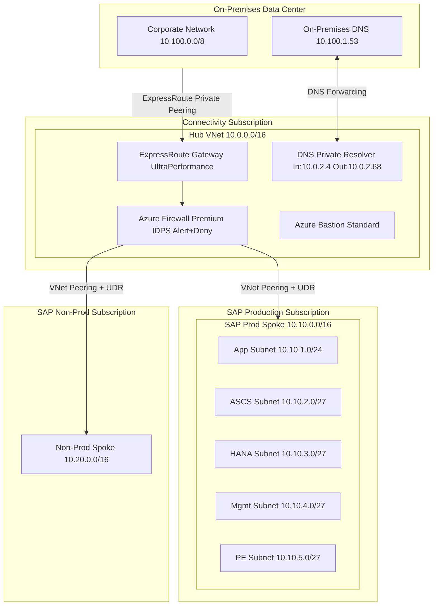
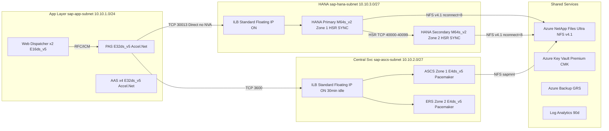

# SAP on Azure Networking Architecture

---

## Overview

This chapter defines the complete networking architecture for SAP workloads deployed on Microsoft Azure. The scope includes SAP S/4HANA, SAP ECC 6.0, SAP BW/4HANA, SAP NetWeaver Application Server (ABAP and Java stacks), and SAP HANA database instances. It addresses ExpressRoute circuit sizing, hub virtual network design, SAP spoke virtual network subnet segmentation, Azure Firewall Premium rule sets for SAP traffic, Private Endpoint placement, Private DNS Zone configuration, Azure DNS Private Resolver forwarding rules, and NSG baseline rules for each SAP subnet.

Key architecture decisions: ExpressRoute as the mandatory connectivity method for production SAP landscapes; Azure Firewall Premium as the single egress and inter-spoke inspection point; hub-spoke topology with dedicated SAP spokes per environment tier; Private Endpoints for all PaaS services; Azure DNS Private Resolver for split-horizon DNS; and Accelerated Networking enabled on all SAP VM NICs. These decisions are grounded in SAP Note 1928533, SAP Note 2015553, and Microsoft SAP on Azure Landing Zone Accelerator guidance.

SAP HANA imposes strict latency constraints between application and database tiers: round-trip latency below 0.7 ms for production HANA scale-up as documented in SAP Note 1943937. Every network component selection in this chapter is validated against these constraints.

---

## Architecture Overview

The architecture follows the Azure Cloud Adoption Framework enterprise-scale hub-spoke pattern. The hub virtual network (10.0.0.0/16) contains the Azure ExpressRoute Gateway, Azure VPN Gateway, Azure Firewall Premium, Azure Bastion Standard, and Azure DNS Private Resolver. The SAP production spoke (10.10.0.0/16) and SAP non-production spoke (10.20.0.0/16) are peered to the hub and route all internet-bound and inter-spoke traffic through Azure Firewall Premium via user-defined routes.

Five subnets are defined per SAP spoke: application subnet (PAS, AAS, Web Dispatcher), central services subnet (ASCS, ERS), HANA subnet (primary and secondary HANA VMs), management subnet (jump servers, monitoring agents), and private endpoint subnet (all PaaS Private Endpoints).

### Architecture Diagram: Hub-Spoke Topology

---

## SAP Architecture

### SAP Components in Scope

- **SAP S/4HANA Application Server (ABAP)**: PAS and AAS VMs in the application subnet. Each instance opens ICM HTTP/HTTPS ports (80xx/443xx), RFC/CPIC ports (33xx), and message server registration ports.
- **SAP Central Services (ASCS/SCS)**: Hosts SAP Message Server (port 36xx) and ENSA2 Enqueue Server (port 32xx). Two-node Pacemaker cluster with Azure Internal Load Balancer Standard SKU providing a floating IP for the cluster virtual hostname.
- **SAP Enqueue Replication Server (ERS)**: Runs on the second ASCS cluster node for ENSA2 lock replication. Uses a separate Azure Internal Load Balancer IP.
- **SAP HANA Database**: Two-node HSR across two Availability Zones in SYNC mode. HANA replication requires unrestricted TCP between the two HANA VMs on ports 40000-40099 (SAP Note 2080991).
- **SAP Web Dispatcher**: Reverse proxy for SAP Fiori deployed behind Azure Application Gateway WAF v2.
- **SAP Cloud Connector**: VM in management subnet, outbound HTTPS port 443 to SAP BTP endpoints.

### SAP HANA Latency Requirements

SAP Note 1943937 defines maximum acceptable network round-trip latency between the SAP application layer and SAP HANA as **0.7 ms** for production workloads. Azure deployments must place application VMs and HANA VMs in the same Availability Zone. The niping tool must be run before production cutover. All routing between the application subnet and HANA subnet must not traverse Azure Firewall or any NVA.

### SAP-Specific Networking Constraints on Azure

1. **Accelerated Networking is mandatory** for all SAP VMs with 4 or more vCPUs (SAP Note 1928533, Table 5).
2. **Multiple NICs for HANA** are required to separate application traffic, HANA System Replication traffic, and management/backup traffic (SAP Note 2080991).
3. **IP forwarding must not be enabled** on SAP application or database VM NICs (SAP Note 2015553).
4. **Azure Load Balancer idle timeout** must be set to **30 minutes** for all load balancers fronting SAP ASCS/ERS instances (SAP Note 1999351).
5. **NVA placement between SAP application tier and HANA database tier is prohibited** in production because any additional hop exceeds the 0.7 ms HANA latency threshold.

### SAP Notes Reference Table

| SAP Note | Title | Architecture Impact | Where Applied |
|---|---|---|---|
| 1928533 | SAP Applications on Azure: Supported Products and Azure VM Types | Mandates Accelerated Networking for VMs with 4+ vCPUs | VM NIC configuration |
| 1943937 | Hardware Configuration Check Tool: Azure Support | Maximum 0.7 ms round-trip latency app-to-HANA; niping validation before go-live | No NVA on app-to-HANA routing path |
| 2015553 | SAP on Microsoft Azure: Support Prerequisites | Prohibits IP forwarding on SAP VM NICs | NIC configuration validation |
| 2080991 | SAP HANA on Azure: Network Requirements | HSR ports 40000-40099; dedicated NIC for HSR traffic | HANA subnet NSG rules; multi-NIC HANA VM design |
| 2694118 | SAP HANA HA with ENSA2 on Azure | Requires ILB floating IP (DSR); health probe port 621xx | Azure ILB configuration for ASCS/ERS |
| 1999351 | Troubleshooting Enhanced Azure Monitoring for SAP | 30-minute idle timeout requirement for Azure ILBs | Azure ILB idle timeout on all SAP ILBs |
| 3007991 | Pacemaker Fencing with Azure Fence Agent | Outbound HTTPS 443 from ASCS VMs to management.azure.com | ASCS subnet NSG outbound rules |
| 2778954 | SAP on Azure: Port and Firewall Configuration | Comprehensive SAP port reference for all components | All NSG and Azure Firewall rule sets |
| 2854226 | Azure NetApp Files for SAP Applications | NFS v4.1 requirements; Ultra tier criteria for HANA | Azure NetApp Files configuration |
| 2523032 | SAP Web Dispatcher Security Hardening | Prohibits direct internet exposure without WAF | Application Gateway WAF v2 placement |
| 3114876 | Azure NetApp Files for SAP HANA Scale-Up | Throughput and IOPS requirements for HANA data and log volumes | ANF volume sizing and mount options |

---

## Azure Architecture

### ExpressRoute Connectivity

ExpressRoute is mandatory for production SAP landscapes.

- **Minimum bandwidth**: 1 Gbps for up to 3 SAP production SIDs; 2 Gbps for 4-8 SIDs; 4 Gbps for larger landscapes.
- **ExpressRoute Gateway SKU**: UltraPerformance (10 Gbps) for production, HighPerformance (2 Gbps) for non-production.
- **ExpressRoute FastPath**: Enable to bypass the gateway dataplane for on-premises to spoke VM traffic, reducing latency.
- **Zone-redundant Gateway**: Deploy with ErGwUltraAZ SKU to prevent single Availability Zone failure from severing connectivity.
- **ExpressRoute Private Peering only**: Microsoft Peering is for Microsoft 365 and must not carry SAP application traffic.

### Virtual Network Topology

**SAP Production Spoke Virtual Network** (10.10.0.0/16):

| Subnet | Address | NSG | UDR | Purpose |
|---|---|---|---|---|
| sap-app-subnet | 10.10.1.0/24 | nsg-sap-app-prod | udr-sap-spoke-prod | PAS, AAS, Web Dispatcher VMs |
| sap-ascs-subnet | 10.10.2.0/27 | nsg-sap-ascs-prod | udr-sap-spoke-prod | ASCS, ERS cluster VMs |
| sap-hana-subnet | 10.10.3.0/27 | nsg-sap-hana-prod | udr-sap-hana-prod | HANA primary and secondary VMs |
| sap-mgmt-subnet | 10.10.4.0/27 | nsg-sap-mgmt-prod | udr-sap-spoke-prod | Jump server, AMS agent, Cloud Connector |
| sap-pe-subnet | 10.10.5.0/27 | nsg-sap-pe-prod | None | Private Endpoints for all PaaS services |
| sap-appgw-subnet | 10.10.6.0/26 | nsg-sap-appgw-prod | None | Azure Application Gateway WAF v2 |

**Route Table: udr-sap-hana-prod** (applied to HANA subnet only):

| Route Name | Address Prefix | Next Hop |
|---|---|---|
| default-to-firewall | 0.0.0.0/0 | Azure Firewall private IP 10.0.1.4 |
| app-subnet-direct | 10.10.1.0/24 | Virtual Network (satisfies 0.7 ms HANA latency requirement) |
| ascs-subnet-direct | 10.10.2.0/27 | Virtual Network (satisfies 0.7 ms HANA latency requirement) |

### Azure Firewall Premium Policy Structure

- **Application Rule Collection SAP-Outbound-Allow** (Priority 200): Permits outbound HTTPS to SAP support portal, SAP BTP (*.hana.ondemand.com), OS update repositories.
- **Network Rule Collection SAP-Inter-Subnet-Allow** (Priority 300): Permits TCP 3300-3399 (RFC/CPIC), TCP 36xx (Message Server) from app to ASCS subnet.
- **Network Rule Collection SAP-HANA-Replication** (Priority 310): Permits TCP 40000-40099 between HANA primary and secondary VM private IPs.
- **DNAT Rule Collection SAP-Inbound-Management** (Priority 100): Emergency inbound management access restricted to SAP Basis team source IPs.

All Azure Firewall logs (AzureFirewallApplicationRule, AzureFirewallNetworkRule, AzureFirewallDnsProxy, AzureFirewallIDPSSignature) are sent to the central Log Analytics workspace with 90-day retention and archived to Azure Storage for 2 years.

### NSG Baseline Rules: HANA Subnet

| Direction | Priority | Name | Protocol | Source | Destination | Port | Action |
|---|---|---|---|---|---|---|---|
| Inbound | 100 | Allow-HANA-from-App | TCP | 10.10.1.0/24 | 10.10.3.0/27 | 30013-30015 | Allow |
| Inbound | 110 | Allow-HANA-HSR | TCP | 10.10.3.0/27 | 10.10.3.0/27 | 40000-40099 | Allow |
| Inbound | 120 | Allow-HANA-from-Mgmt | TCP | 10.10.4.0/27 | 10.10.3.0/27 | 22,443 | Allow |
| Inbound | 130 | Allow-AzureLoadBalancer | TCP | AzureLoadBalancer | 10.10.3.0/27 | 62500-62599 | Allow |
| Inbound | 4000 | Deny-All-Inbound | Any | Any | Any | Any | Deny |
| Outbound | 100 | Allow-HANA-to-App | TCP | 10.10.3.0/27 | 10.10.1.0/24 | Any | Allow |
| Outbound | 110 | Allow-HANA-HSR-Out | TCP | 10.10.3.0/27 | 10.10.3.0/27 | 40000-40099 | Allow |
| Outbound | 4000 | Deny-All-Outbound | Any | Any | Any | Any | Deny |

### NSG Baseline Rules: ASCS Subnet

| Direction | Priority | Name | Protocol | Source | Destination | Port | Action |
|---|---|---|---|---|---|---|---|
| Inbound | 100 | Allow-MsgSrv-from-App | TCP | 10.10.1.0/24 | 10.10.2.0/27 | 3600-3699 | Allow |
| Inbound | 110 | Allow-Enqueue-from-App | TCP | 10.10.1.0/24 | 10.10.2.0/27 | 3200-3299,3900-3999 | Allow |
| Inbound | 120 | Allow-AzureLB-HealthProbe | TCP | AzureLoadBalancer | 10.10.2.0/27 | 62100-62199 | Allow |
| Inbound | 130 | Allow-Pacemaker-Corosync | UDP | 10.10.2.0/27 | 10.10.2.0/27 | 5404-5412 | Allow |
| Inbound | 4000 | Deny-All-Inbound | Any | Any | Any | Any | Deny |
| Outbound | 100 | Allow-ASCS-FenceAgent | TCP | 10.10.2.0/27 | AzureResourceManager | 443 | Allow |
| Outbound | 4000 | Deny-All-Outbound | Any | Any | Any | Any | Deny |

### Azure DNS Private Resolver

- **Inbound Endpoint** (10.0.2.4): On-premises DNS servers configure conditional forwarders here for all Azure-hosted SAP hostnames and *.privatelink.* domains.
- **Outbound Endpoint** (10.0.2.68): Forwarding ruleset routes on-premises SAP domain queries (*.corp.example.com, *.sap.example.com) to on-premises DNS server 10.100.1.53.
- **Default rule**: All other queries forwarded to Azure DNS (168.63.129.16).

### Private Endpoints

| Service | Private DNS Zone | Endpoint Name |
|---|---|---|
| Azure NetApp Files | privatelink.netapp.azure.com | pe-anf-prod |
| Azure Key Vault | privatelink.vaultcore.azure.net | pe-kv-sap-prod |
| Azure Blob Storage | privatelink.blob.core.windows.net | pe-blob-sap-prod |
| Azure Files | privatelink.file.core.windows.net | pe-file-sap-prod |
| Azure Monitor | privatelink.monitor.azure.com | pe-monitor-sap-prod |
| Azure Backup | privatelink.backup.windowsazure.com | pe-backup-sap-prod |

All Private DNS Zones are created in the connectivity subscription and linked to the hub VNet and both SAP spoke VNets. Azure Policy initiative Deploy-Private-DNS-Zones is assigned at the SAP management group scope to auto-create A records when Private Endpoints are provisioned.

### Architecture Diagram: Azure Service Detail

---

## Design Decisions

| Decision | Options Considered | Choice | Rationale | Reference |
|---|---|---|---|---|
| On-premises connectivity for production | (1) ExpressRoute only; (2) VPN only; (3) ExpressRoute + VPN failover | ExpressRoute Private Peering with VPN as non-production fallback | ExpressRoute provides guaranteed bandwidth and predictable latency. VPN introduces 10-50 ms jitter incompatible with 0.7 ms HANA requirement. | SAP Note 1943937 |
| NVA placement between app and HANA tiers | (1) All traffic through Firewall; (2) Only internet/inter-spoke through Firewall; (3) Dedicated HANA NVA | App-to-HANA as Virtual Network (no NVA); all other traffic through Azure Firewall Premium | Azure Firewall on app-to-HANA path adds 0.5-2 ms latency exceeding the 0.7 ms HANA threshold. NSG provides sufficient L4 control within the spoke. | SAP Note 1943937 |
| DNS resolution architecture | (1) Azure DNS only; (2) Custom DNS VMs; (3) Azure DNS Private Resolver | Azure DNS Private Resolver with outbound forwarding ruleset | Fully managed PaaS requiring no VM patching. Custom DNS VMs introduce single-point-of-failure risk and patching overhead. | Azure Private DNS Resolver docs |
| SAP Fiori exposure | (1) Application Gateway WAF v2 only; (2) Azure Front Door + Application Gateway; (3) Direct Web Dispatcher | Application Gateway WAF v2 in SAP spoke | Direct internet exposure of SAP Web Dispatcher without WAF is unsupported per SAP Note 2523032. | SAP Note 2523032 |
| Shared file storage for /sapmnt | (1) Azure Files Premium SMB; (2) ANF NFS v4.1; (3) ANF NFS v3 | Azure NetApp Files Ultra tier with NFS v4.1 | ANF Ultra tier delivers required HANA IOPS and throughput (up to 128 MiB/s per TiB). Azure Files Premium does not meet SAP HANA storage KPIs. | SAP Note 2854226, 3114876 |
| Azure ILB for ASCS/ERS | (1) Basic SKU; (2) Standard SKU with floating IP; (3) Application Load Balancer | Azure ILB Standard SKU with floating IP and 30-minute idle timeout | Standard SKU is the only SAP-certified option. Floating IP (DSR) required for SAP Message Server protocol. Basic SKU deprecated September 2025. | SAP Note 2694118, 1999351 |
| Network segmentation | (1) Single flat subnet; (2) Two subnets; (3) Five dedicated subnets | Five dedicated subnets with individual NSGs per tier | Dedicated subnets enable precise least-privilege NSG rules per SAP tier. Matches Azure Landing Zone Accelerator for SAP reference design. | Azure Landing Zone Accelerator for SAP |
| Azure Firewall SKU | (1) Standard; (2) Premium; (3) Third-party NVA | Azure Firewall Premium | IDPS in alert-and-deny mode required for PCI-DSS and ISO 27001 compliance. Auto-scales without VM patching overhead. | Azure WAF Security pillar |

---

## Azure Well-Architected Alignment

| Pillar | Requirement | Implementation | Reference |
|---|---|---|---|
| Reliability | Single AZ failure must not impact SAP production | ASCS/ERS across Zone 1 and Zone 2; HANA HSR primary Zone 1 secondary Zone 2; ErGwUltraAZ zone-redundant gateway | Azure WAF Reliability; SAP Note 2694118 |
| Reliability | ExpressRoute failure must not permanently sever connectivity | VPN Gateway VpnGw2AZ as secondary path; BGP auto-failover within 60-180 seconds | Azure ExpressRoute reliability docs |
| Security | No SAP VM NIC must have a public IP | Azure Policy Deny-Public-IP at SAP management group scope; all admin access via Azure Bastion | CIS Azure Benchmark; Azure Policy |
| Security | All data in transit must use TLS 1.2 minimum | Application Gateway policy AppGwSslPolicy20220101; SAP Web Dispatcher ssl/min_protocol = TLSv1.2 | SAP Note 510007; Azure App Gateway TLS |
| Security | Network traffic between SAP tiers must be logged | Azure Firewall diagnostic logs to Log Analytics; NSG flow logs on all SAP subnet NSGs with 90-day retention | Azure NSG Flow Logs docs |
| Security | PaaS services must not traverse public internet | All PaaS via Private Endpoints; Azure Policy Deny-PublicEndpoint on all relevant PaaS resource types | Azure Private Link docs |
| Cost Optimization | ExpressRoute bandwidth must not be overprovisioned | Quarterly utilization review via Network Watcher Connection Monitor; online circuit bandwidth downgrade available | Azure ExpressRoute pricing |
| Cost Optimization | Azure Firewall cost must be shared across environments | Single Azure Firewall Premium in hub VNet with separate Firewall Policy per environment | Azure Firewall pricing |
| Operational Excellence | Network changes must go through IaC pipeline | All VNet, NSG, UDR, DNS configs in Bicep modules under /bicep/networking/; PR required with two approvals | Azure Landing Zone Accelerator Bicep |
| Performance Efficiency | HANA round-trip latency must be validated before production cutover | niping from each PAS VM to HANA primary; mean RTT below 0.7 ms over 1000 iterations; results in Architecture Decision Record | SAP Note 1943937; SAP niping tool |

---

## RPO/RTO Table

| SAP Tier | RPO Target | RTO Target | HA Method | DR Method |
|---|---|---|---|---|
| Production SAP S/4HANA ABAP | 0 seconds (synchronous HSR) | 4 hours (full region DR) | HANA HSR SYNC + Pacemaker AZ failover under 5 minutes | HANA HSR ASYNC to secondary region + Azure Site Recovery for app servers |
| Production SAP ASCS/ERS | 0 seconds (ENSA2 in-memory replication) | 2 minutes (Pacemaker fence) | Pacemaker two-node cluster across AZ1/AZ2 with Azure Fence Agent | ASR replication of ASCS VMs to secondary region |
| Production SAP Web Dispatcher | 0 seconds (stateless) | 5 minutes (ILB health probe failover) | Two instances across AZ1/AZ2 behind Azure ILB | ASR replication to secondary region |
| Quality Assurance | 4 hours | 8 hours | Single-VM with Azure Backup daily | Azure Backup cross-region restore |
| Development | 24 hours | 24 hours | Single-VM with Azure Backup daily | Rebuild from Azure Backup if needed |

---

## Cost Optimization

| Optimization | Potential Saving | Implementation | Prerequisites |
|---|---|---|---|
| ExpressRoute Gateway Reserved Instance 1-year | ~19% vs. pay-as-you-go; ~$600/month saving on $3,200/month ERGW cost | Purchase 1-year reserved capacity for ERGW via Azure Reservations portal | 12-month commitment to production SAP landscape |
| Azure Bastion off-hours scale-in | ~40% reduction; ~$280/month saving (6 units peak to 2 units off-hours) | Azure Automation runbook: scale to 2 units at 20:00 UTC, back to 6 at 07:00 UTC Monday-Friday | Azure Automation account with Contributor role on Bastion resource |
| Single Azure Firewall for all SAP environments | ~$3,200/month saving vs. separate firewall per environment | Single Azure Firewall Premium in hub VNet with separate Firewall Policy per environment | Hub-spoke topology with centralized connectivity subscription |
| Azure NetApp Files capacity pool right-sizing | 15-25% cost reduction | Monthly review via Azure Monitor ANF metrics; reduce capacity pool when average utilization below 70% for 30 days | Azure Monitor alert on ANF utilization below 70% for 30+ days |
| NSG Flow Logs storage tiering | ~$50/month saving | Azure Storage lifecycle policy: cool tier after 30 days, archive after 90 days | Azure Storage Account lifecycle management policy |
| Azure Hybrid Benefit for Windows VMs | 40% license cost reduction on Windows VMs | Apply AHB to Web Dispatcher and jump server Windows VMs | Software Assurance-covered Windows Server licenses |
| ExpressRoute circuit bandwidth right-sizing | Variable | Monthly utilization review; downgrade if sustained peak below 50% of provisioned bandwidth | ExpressRoute provider supports online bandwidth reduction |

---

## Monitoring and Alerts

| Alert Name | Metric/Signal | Threshold | Severity | Action Group |
|---|---|---|---|---|
| HANA-Memory-Critical | AMS HANA provider memory utilization % | Above 90% for 5 minutes | Sev 1 | sap-hana-dba-oncall |
| HANA-HSR-Replication-Broken | AMS HA provider HSR replication status | Status not ACTIVE for 2 minutes | Sev 1 | sap-hana-dba-oncall |
| ASCS-Cluster-Node-Fenced | AMS HA provider Pacemaker node count | Node count below 2 for 2 minutes | Sev 1 | sap-basis-oncall |
| HANA-Disk-Latency-High | ANF volume read latency AMS NetApp provider | Above 1 ms for 5 minutes | Sev 2 | sap-hana-dba-oncall |
| ExpressRoute-BandwidthUtilization | ERGW NetworkIn + NetworkOut vs provisioned capacity | Above 80% for 15 minutes | Sev 2 | sap-network-ops |
| AzureFirewall-IDPS-Alert | AzureFirewallIDPSSignature log Action=Alert | Any IDPS alert in 5-minute window | Sev 2 | sap-security-ops |
| ASCS-LoadBalancer-HealthProbe-Down | Azure ILB health probe success rate | Below 100% for 2 minutes | Sev 1 | sap-basis-oncall |
| SAP-VM-Disk-IOPS-Throttled | VM OS metric Disk IOPS throttled count | Above 0 for 5 minutes on HANA VM | Sev 2 | sap-hana-dba-oncall |
| ANF-CapacityPool-Full | ANF capacity pool used throughput % | Above 85% for 10 minutes | Sev 2 | sap-storage-ops |
| DNS-Resolver-Query-Failure | AzureDiagnostics DNS Private Resolver failure count | Above 10 failures in 5 minutes | Sev 2 | sap-network-ops |

---

## Anti-Patterns

### Anti-Pattern 1: Routing SAP Application-to-HANA Traffic Through Azure Firewall

A UDR with default route 0.0.0.0/0 pointing to Azure Firewall applied to the application subnet, without a specific route for the HANA subnet, causes all application-to-HANA TCP traffic to traverse Azure Firewall, adding 0.5-2 ms per connection. For a typical SAP S/4HANA production system with 50-200 SQL SELECT calls per dialog step, adding 1 ms per call to 100 SQL calls adds 100 ms to dialog response time, causing SLA breaches. Azure Firewall TCP state table capacity can also be exhausted by HANA connection pool traffic under load.

**Correct approach:** Add an explicit route on the application subnet UDR for the HANA subnet CIDR pointing to Virtual Network next hop. Apply NSG rules on the HANA subnet to restrict inbound access from the application subnet on HANA ports 30013-30015 per SAP Note 2080991.

### Anti-Pattern 2: Using Azure Internal Load Balancer Basic SKU for SAP ASCS/ERS

Basic SKU does not support Availability Zone-spanning deployments, does not support floating IP (DSR) required for SAP Message Server protocol behavior, and has been deprecated with new creation disabled in Azure public cloud regions (retirement 30 September 2025). SAP Note 2694118 explicitly states only Standard SKU is supported for SAP ASCS/ERS.

**Correct approach:** Deploy Azure ILB Standard SKU with floating IP enabled, idle timeout 30 minutes, and health probe on TCP port 621xx. Ensure the ASCS subnet NSG permits inbound from AzureLoadBalancer service tag on port 621xx.

### Anti-Pattern 3: Placing SAP Private DNS Zones in the SAP Application Subscription

Private DNS Zones created in the SAP production subscription and linked only to the SAP production spoke cause three failures: on-premises systems forwarding to Azure DNS Private Resolver cannot resolve private endpoint addresses because zones are not linked to hub VNet; non-production systems cannot resolve private endpoint hostnames; during DR failover zones may contain stale records pointing to primary-region private endpoint IPs.

**Correct approach:** Create all Private DNS Zones in the connectivity subscription and link to hub and all spoke virtual networks. Use Azure Policy initiative Deploy-Private-DNS-Zones at SAP management group scope for automatic A record creation.

### Anti-Pattern 4: Disabling Accelerated Networking on SAP VMs to Reduce Cost

Accelerated Networking is not a separate cost item. Disabling it does not save money but reduces network throughput and increases CPU utilization for network processing. SAP Note 1928533 mandates it for all SAP VMs with 4+ vCPUs; production systems without it are out of SAP support scope.

**Correct approach:** Enable Accelerated Networking on all SAP VM NICs at VM creation time. Enabling on an existing running VM requires a VM stop/start during a maintenance window. Use Azure Policy to deny SAP VM deployments without Accelerated Networking.

### Anti-Pattern 5: Using a Single NSG for All SAP Subnets

A single shared NSG with broad allow rules across all SAP subnets eliminates the security boundary between tiers. A compromised SAP application server can directly access HANA administrative ports. NSG rules for all tiers become intermixed, making auditing against the SAP port baseline impossible.

**Correct approach:** Deploy one NSG per subnet with minimum necessary rules using the SAP port baseline from SAP Note 2778954. Use NSG Flow Logs to validate actual traffic patterns before applying deny-all rules.

### Anti-Pattern 6: Not Setting Azure Load Balancer Idle Timeout to 30 Minutes

The default 4-minute idle timeout causes SAP RFC connections idle for more than 4 minutes to receive TCP RST on the next packet, producing RFC_COMMUNICATION_FAILURE short dumps in SM21. This commonly occurs during off-peak periods between batch job steps or during low-traffic windows.

**Correct approach:** Set Azure ILB idle timeout to 30 minutes on all rules fronting SAP ASCS/ERS VIPs per SAP Note 1999351. Also configure TCP keepalive at OS level: net.ipv4.tcp_keepalive_time=300, net.ipv4.tcp_keepalive_intvl=60, net.ipv4.tcp_keepalive_probes=10 in /etc/sysctl.d/99-sap-tcp.conf.

---

## Troubleshooting

### Issue 1: SAP HANA System Replication Status Shows ERROR After AZ Failover

**Symptom:** After Pacemaker failover of HANA from Zone 1 to Zone 2, hdbnsutil -sr_state shows the old primary in ERROR state. The HANA ILB health probe shows both backends unhealthy for 30-120 seconds.

**Root cause:** HANA ILB health probe timeout is too low. The probe marks both nodes unhealthy before the new primary completes Pacemaker resource startup (30-90 seconds for SAPHana resource agent to complete takeover and start the health probe listener on port 62500).

**Resolution:** Set ILB probe interval to 5 seconds with unhealthy threshold of 2 (10 seconds total to mark unhealthy). Verify Pacemaker SAPHana resource is fully started: crm_mon -Afr1. Verify probe port 62500 listening: ss -tlnp | grep 62500. If old primary remains in ERROR, re-register as secondary: hdbnsutil -sr_register --name --remoteHost --remoteInstance=00 --replicationMode=SYNC --operationMode=logreplay. Reference: SAP Note 3007991.

### Issue 2: SAP RFC Connections Fail Intermittently with RFC_COMMUNICATION_FAILURE

**Symptom:** RFC_COMMUNICATION_FAILURE short dumps at irregular intervals during low-load periods. SM21 shows ThIErrHandle NWRFC entries.

**Root cause:** Azure ILB fronting SAP ASCS message server VIP has default 4-minute idle timeout. RFC connections idle for more than 4 minutes have their NAT table entry removed, resulting in TCP RST to the application server.

**Resolution:** Set idle timeout to 30 minutes on all ILB rules fronting SAP VIPs: az network lb rule update --set idleTimeoutInMinutes=30. Configure TCP keepalive in /etc/sysctl.d/99-sap-tcp.conf. Monitor SM21 for NWRFC errors over 48 hours after the change. Reference: SAP Note 1999351.

### Issue 3: SAP Fiori Users Report 502 Bad Gateway from Azure Application Gateway

**Symptom:** SAP Fiori users intermittently receive HTTP 502 Bad Gateway. Application Gateway access logs show ERRORINFO: FailedToConnect for SAP Web Dispatcher backends.

**Root cause:** Application Gateway backend health probe timeout (default 30 seconds) is too aggressive. SAP Web Dispatcher under CPU load during peak Fiori usage may take up to 60 seconds to respond to a probe, causing Application Gateway to mark the backend unhealthy.

**Resolution:** Increase Application Gateway backend health probe timeout from 30 to 120 seconds. Configure probe path to /sap/public/ping. Enable Application Gateway Access Logs to Log Analytics workspace. Verify SAP Web Dispatcher profile parameter wdisp/system_auto_configuration=true.

### Issue 4: Azure DNS Private Resolver Fails to Resolve On-Premises SAP Hostnames

**Symptom:** SAP RFC calls from Azure to on-premises SAP systems fail with RFC destination could not be resolved. SM59 RFC destination test returns Host or service name not known.

**Root cause:** Azure DNS Private Resolver outbound forwarding ruleset has a rule for the parent zone corp.example.com but not for the subdomain sap.corp.example.com. Some resolver versions require explicit subdomain forwarding rules.

**Resolution:** Add explicit forwarding rule for sap.corp.example.com pointing to on-premises DNS server 10.100.1.53. Verify ruleset is linked to SAP spoke VNet: az dns-resolver vnet-link list --ruleset-name. Test from test VM: dig @10.0.2.68 solman01.sap.corp.example.com. Verify NSG on dns-resolver-inbound subnet permits inbound UDP 53 from SAP spoke CIDRs.

### Issue 5: Pacemaker Fence Agent Fails: ASCS Cluster Cannot Fence Nodes

**Symptom:** During ASCS cluster failover test, cluster remains in PENDING state for fencing. pacemaker.log shows: fence_azure_arm: Unable to connect to ARM API: HTTPS connection to management.azure.com failed.

**Root cause:** NSG outbound allow rule for TCP 443 to AzureResourceManager service tag from the ASCS subnet was accidentally deleted or overridden.

**Resolution:** Re-add NSG outbound rule: TCP 443 from 10.10.2.0/27 to AzureResourceManager service tag at priority 100. Test from ASCS VM: curl -v https://management.azure.com. Verify also in Azure Firewall application rules. Verify fence agent managed identity has Virtual Machine Contributor role on both ASCS VMs: az role assignment list. Reference: SAP Note 3007991.

### Issue 6: Azure NetApp Files NFS Mount Drops on HANA VMs During HANA Startup

**Symptom:** SAP HANA fails to start after VM restart. hdbdaemon trace shows I/O errors on /hana/data. dmesg shows NFS mount timeout errors. mount -a returns mount.nfs4: Connection timed out.

**Root cause:** /etc/fstab uses soft mount option. With soft mounts, if the ANF NFS endpoint is not reachable when the VM restarts, the mount fails immediately without retry. Also missing nconnect=8 and incorrect rsize/wsize (should be 1048576 bytes per ANF recommendations).

**Resolution:** Update /etc/fstab to use hard mount with bg (background retry), nconnect=8, rsize=1048576, wsize=1048576. The correct mount options for ANF NFS v4.1 are: rw,hard,nointr,bg,timeo=600,retrans=2,proto=tcp,nconnect=8,rsize=1048576,wsize=1048576,vers=4.1,minorversion=1. Test during maintenance window by stopping HANA, unmounting, updating fstab, remounting, then restarting HANA. Reference: SAP Note 3114876.

---

## Landing Zone Mapping

| Resource | Subscription | Management Group | Justification |
|---|---|---|---|
| Hub VNet, ExpressRoute GW, VPN GW, Azure Firewall Premium, DNS Private Resolver | Connectivity Subscription | Platform > Connectivity | Shared infrastructure managed by central network team; separate billing and RBAC from SAP application teams |
| SAP Production Spoke VNet, NSGs, UDRs, App Gateway WAF, ILBs, SAP VMs | SAP Production Subscription | Landing Zones > SAP | Isolated billing and RBAC for production SAP workloads; Defender for Cloud Plan 2 active |
| SAP Non-Production Spoke VNet, NSGs, UDRs, non-prod VMs | SAP Non-Production Subscription | Landing Zones > SAP | Separate subscription for Dev/Test pricing eligibility; lower Defender plan acceptable |

### Management Group Policy Assignments (SAP Management Group Scope)

| Policy | Effect | Purpose |
|---|---|---|
| Deny-Public-IP-on-NIC | Deny | Prevents accidental public IP on SAP VM NICs |
| Require-AcceleratedNetworking-4plus-vCPU | Deny | Enforces SAP Note 1928533 mandatory Accelerated Networking requirement |
| Audit-NSG-SAP-Ports | AuditIfNotExists | Detects NSG rules deviating from SAP port baseline in SAP Note 2778954 |
| Deploy-NSG-FlowLogs | DeployIfNotExists | Ensures NSG flow logs enabled on all SAP subnet NSGs |
| Deploy-AzureMonitorAgent | DeployIfNotExists | Ensures Azure Monitor Agent deployed on all SAP VMs |
| Deny-PublicEndpoint-Storage | Deny | Prevents backup storage accounts from enabling public network access |
| Deny-PublicEndpoint-KeyVault | Deny | Prevents SAP Key Vault from enabling public network access |
| Deploy-ActivityLog-Diagnostic | DeployIfNotExists | Ensures Activity Log forwarding to central Log Analytics workspace |

---

## Microsoft References

- [SAP on Azure: Network planning](https://learn.microsoft.com/en-us/azure/sap/workloads/planning-guide-network)
- [SAP HANA infrastructure configurations: Networking](https://learn.microsoft.com/en-us/azure/sap/workloads/hana-vm-operations-network)
- [Azure Landing Zone Accelerator for SAP on Azure](https://learn.microsoft.com/en-us/azure/cloud-adoption-framework/scenarios/sap/enterprise-scale-introduction)
- [SAP ASCS/ERS with Pacemaker on RHEL](https://learn.microsoft.com/en-us/azure/sap/workloads/high-availability-guide-rhel)
- [Azure NetApp Files for SAP HANA](https://learn.microsoft.com/en-us/azure/sap/workloads/hana-vm-operations-netapp)
- [Azure Monitor for SAP Solutions](https://learn.microsoft.com/en-us/azure/sap/monitor/about-azure-monitor-sap-solutions)
- [Hub-spoke network topology in Azure](https://learn.microsoft.com/en-us/azure/architecture/networking/architecture/hub-spoke)
- [Azure DNS Private Resolver overview](https://learn.microsoft.com/en-us/azure/dns/dns-private-resolver-overview)
- [Azure Firewall Premium features](https://learn.microsoft.com/en-us/azure/firewall/premium-features)
