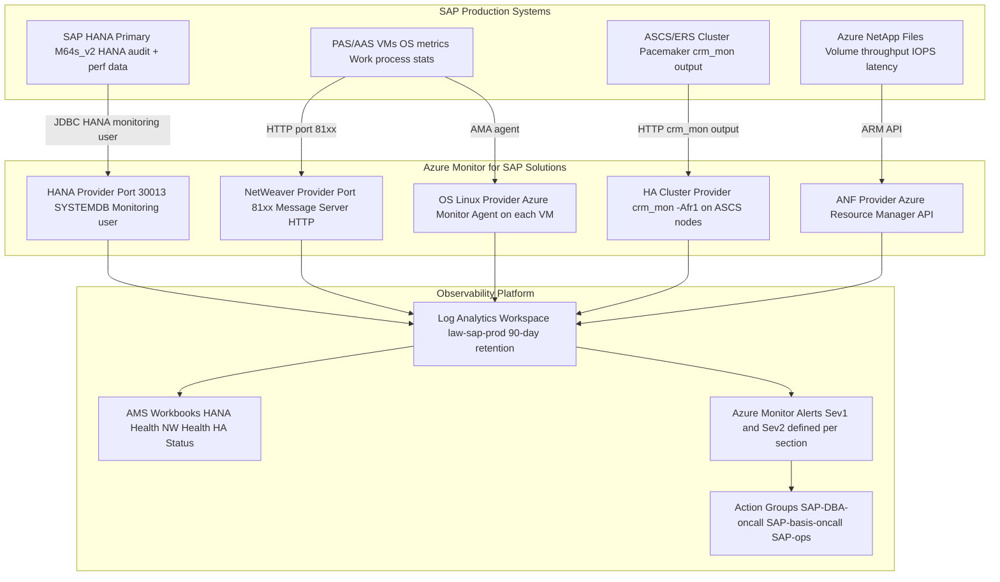
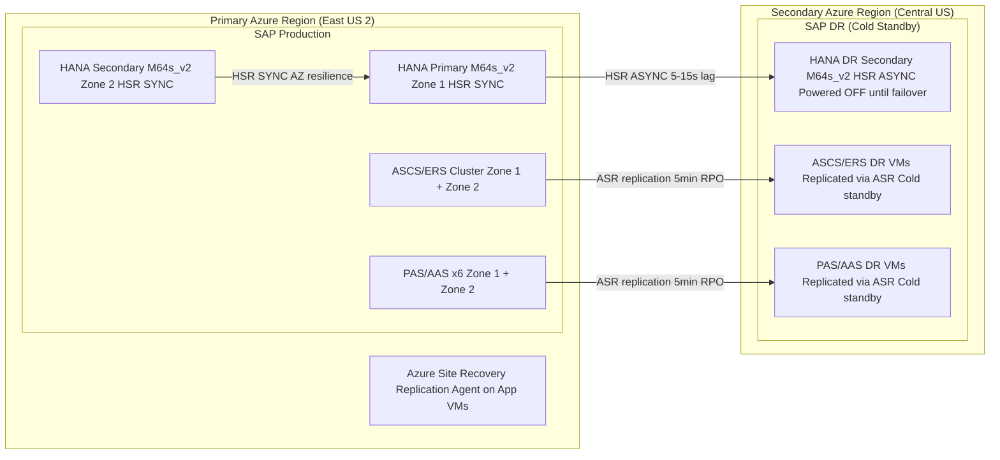

# SAP on Azure Operations Architecture

---

## Overview

This chapter defines the operations architecture for SAP workloads deployed on Microsoft Azure. The scope covers Azure Monitor for SAP Solutions (AMS) configuration with HANA, NetWeaver ABAP, OS (Linux), HA Cluster, and Azure NetApp Files providers; Log Analytics workspace design and retention; Azure Update Manager for OS patching with pre/post maintenance scripts; backup strategy combining Azure Backup backint with ANF snapshots; disaster recovery with HANA HSR ASYNC and Azure Site Recovery; Pacemaker cluster day-2 operations; and the operational runbook structure for SAP on Azure.

Key architecture decisions: Azure Monitor for SAP Solutions (AMS) as the primary monitoring framework for SAP-specific metrics; a single shared Log Analytics workspace per SAP environment tier (production and non-production separate); Azure Update Manager with maintenance schedules aligned to SAP downtime windows; hybrid backup strategy (Azure Backup backint for long-term retention + azacsnap for fast point-in-time recovery); and SAP DR implemented with HANA HSR ASYNC to a secondary Azure region with Azure Site Recovery for application server failover.

---

## Architecture Overview

Operations for SAP on Azure are built on four pillars: observability (Azure Monitor for SAP Solutions), patching (Azure Update Manager), backup and recovery (Azure Backup + azacsnap), and disaster recovery (HANA HSR ASYNC + Azure Site Recovery). Each pillar integrates with the central Log Analytics workspace and creates alerts that route to SAP-specific Action Groups (SAP DBA on-call, SAP Basis on-call, SAP Storage ops, SAP Security ops).

### Architecture Diagram: SAP Operations Observability Stack



---

## SAP Architecture

### SAP Monitoring Requirements

SAP production systems require monitoring at four levels:

**Level 1 — SAP Application Monitoring (SAP native tools):**
- SAP Work Process Monitor (SM50): Dialog, background, update, enqueue, spool work processes.
- SAP System Log (SM21): ABAP runtime errors, update failures, memory dumps.
- SAP Short Dump Monitor (ST22): ABAP short dumps with root cause categorization.
- SAP Background Job Monitor (SM37): Background job status, duration, and failure analysis.
- SAP Performance Monitor (ST05/SM12/SM13): SQL trace, lock list, update list.

These SAP-native tools run on the SAP system itself and are accessed by SAP Basis team via SAP GUI. Their output is not automatically forwarded to Azure Monitor; SAP ABAP short dump counts and dialog response time are exposed via the AMS NetWeaver provider.

**Level 2 — SAP HANA Monitoring (HANA-specific):**
- HANA Services Monitor: Individual HANA services (indexserver, nameserver, statisticsserver) CPU, memory, thread count.
- HANA System Replication Status: HSR connection state, log shipping lag, replication mode.
- HANA Disk Usage: Data volume, log volume, and backup catalog space usage.
- HANA Alert Log: HANA internal alerts (memory allocation failures, long-running transactions, table growth).

These are exposed via the AMS HANA provider to Log Analytics.

**Level 3 — Azure Infrastructure Monitoring (Azure Monitor):**
- VM CPU, memory, disk I/O, network throughput via Azure Monitor Agent (AMA).
- Azure NetApp Files volume throughput, IOPS, and latency via ANF diagnostic metrics.
- NSG flow logs and Azure Firewall diagnostic logs for network security monitoring.
- Azure Resource Health for VM availability and Azure service health events.

**Level 4 — Cluster HA Monitoring (Pacemaker):**
- Pacemaker cluster node status, resource state, failover events.
- Azure Fence Agent (fence_azure_arm) execution success/failure.
- ASCS cluster VIP active location (which zone is serving the cluster resource).

### SAP Day-2 Operations Runbooks

SAP on Azure operations require documented runbooks for the following scenarios:

| Runbook | Trigger | Owner | Estimated Duration |
|---|---|---|---|
| HANA planned failover (takeover) | Monthly HA test; Zone maintenance | SAP HANA DBA | 30-60 minutes |
| HANA log backup restore (point-in-time) | Data corruption event; operator error | SAP HANA DBA | 60-120 minutes |
| ASCS/ERS cluster failover test | Quarterly; Azure maintenance | SAP Basis | 15-30 minutes |
| SAP system patch (OS + SAP kernel) | Monthly maintenance window | SAP Basis | 4-6 hours |
| AAS scale-out (add new AAS VM) | SAPS capacity increase needed | SAP Basis + Azure team | 2-4 hours |
| SAP system copy (non-prod refresh) | Quarterly QA/dev refresh | SAP Basis | 8-16 hours |
| DR failover test (partial) | Semi-annual | SAP Basis + DBA + Azure team | 4-8 hours |
| DR failover (production) | Declared regional disaster | SAP Basis + DBA + Azure team + management | 2-4 hours |

### SAP Notes Reference Table

| SAP Note | Title | Architecture Impact | Where Applied |
|---|---|---|---|
| 1999351 | Troubleshooting Enhanced Azure Monitoring for SAP | Azure Enhanced Monitoring configuration requirements; SAP HANA monitoring prerequisites; Azure Monitor Agent setup | AMS configuration; Azure Monitor Agent deployment on SAP VMs |
| 2380765 | Azure Monitor for SAP Solutions: HANA Provider | HANA monitoring user authorization requirements; HANA provider configuration parameters; HANA metrics available | AMS HANA provider configuration; HANA monitoring user setup |
| 2630416 | Azure Monitor for SAP Solutions: NetWeaver Provider | NetWeaver ABAP provider configuration; Message Server HTTP port requirements; dialog response time metrics | AMS NetWeaver provider configuration |
| 3007991 | Pacemaker Fencing with Azure Fence Agent | Pacemaker cluster operational procedures; fence_azure_arm diagnostics; cluster resource maintenance mode | Pacemaker day-2 operations runbook |
| 2694118 | SAP HANA HA with ENSA2 on Azure | ASCS/ERS failover procedures; Pacemaker resource cleanup after failover; ENSA2 cluster operational commands | ASCS/ERS failover runbook; Pacemaker cleanup procedure |
| 3025468 | SAP HANA: azacsnap Installation and Configuration | azacsnap operational procedures; snapshot verification; recovery from ANF snapshot | azacsnap operational runbook |
| 2965811 | Troubleshooting SAP HANA Backup Failures on Azure | Azure Backup backint failure diagnosis; Recovery Services Vault connectivity troubleshooting; backup catalog management | Azure Backup operational runbook |
| 2555971 | Azure Site Recovery for SAP Applications | ASR configuration for SAP application server VMs; network mapping for DR region; test failover procedures | DR runbook; ASR configuration guide |
| 2382421 | Optimizing the Network Configuration on HANA and OS Level | OS network tuning verification after patching; TCP parameter persistence check | Post-patch validation runbook |
| 2775207 | Azure Update Manager: SAP Workload Integration | SAP-specific Azure Update Manager configuration; maintenance schedule alignment; pre/post scripts | Azure Update Manager configuration for SAP |
| 2580633 | SAP HANA Backup on Azure with Azure NetApp Files | azacsnap + backint hybrid backup operations; restore decision tree (snapshot vs. backint) | Backup and recovery operations guide |

---

## Azure Architecture

### Azure Monitor for SAP Solutions Configuration

Azure Monitor for SAP Solutions (AMS) is the primary monitoring framework for SAP workloads on Azure. AMS is deployed as a managed Azure resource in the SAP production subscription and is configured with the following providers:

**AMS Resource creation:**
```bicep
resource amsMonitor 'Microsoft.Workloads/monitors@2023-04-01' = {
  name: 'ams-sap-prod'
  location: primaryRegion
  properties: {
    appLocation: primaryRegion
    workspaceId: logAnalyticsWorkspaceId
    managedResourceGroupName: 'mrg-ams-sap-prod'
    monitorSubnet: amsSubnetId
    zoneRedundancyPreference: 'Enabled'
  }
}
```

**HANA Provider configuration:**
```bicep
resource hanaProvider 'Microsoft.Workloads/monitors/providerInstances@2023-04-01' = {
  parent: amsMonitor
  name: 'hana-provider-prod'
  properties: {
    providerSettings: {
      providerType: 'SapHana'
      hostname: hanaVMPrivateIP        // HANA primary VM private IP
      dbPort: '30013'                   // HANA SYSTEMDB SQL port
      dbUsername: 'AZUREWLBACKUP'      // HANA monitoring user
      dbPasswordUri: keyVaultSecretUri  // KV reference to monitoring password
      sslPreference: 'ServerCertificate'
      sslCertificateUri: hanaCertUri
    }
  }
}
```

The HANA monitoring user (AZUREWLBACKUP) requires minimum HANA authorizations:
```sql
CREATE USER AZUREWLBACKUP PASSWORD '<pwd>' NO FORCE_FIRST_PASSWORD_CHANGE;
ALTER USER AZUREWLBACKUP DISABLE PASSWORD LIFETIME;
GRANT MONITORING TO AZUREWLBACKUP;
GRANT CATALOG READ TO AZUREWLBACKUP;
```

**NetWeaver ABAP Provider configuration:**
```bicep
resource nwProvider 'Microsoft.Workloads/monitors/providerInstances@2023-04-01' = {
  name: 'netweaver-provider-prod'
  properties: {
    providerSettings: {
      providerType: 'SapNetWeaver'
      sapHostname: ascsClusterVIP        // ASCS cluster virtual hostname
      sapInstanceNr: '00'
      sapSid: 'SID'
      sapUsername: 'wdxadm'             // SAP Web Dispatcher admin user (or diagnostics user)
      sapPassword: nwPassword
      sapPortNumber: '8100'             // ICM HTTP port (81xx where xx = instance number)
    }
  }
}
```

**HA Cluster Provider configuration:**
```bicep
resource haProvider 'Microsoft.Workloads/monitors/providerInstances@2023-04-01' = {
  name: 'ha-cluster-provider-prod'
  properties: {
    providerSettings: {
      providerType: 'HighAvailabilityCluster'
      clusterName: 'sap-hana-cluster'
      hostname: ascsVM1PrivateIP         // First ASCS cluster node IP
      prometheusUrl: 'http://<ip>:44322/metrics'
    }
  }
}
```

### Log Analytics Workspace Design

| Workspace | Subscription | Retention | Purpose | Daily Ingestion Cap |
|---|---|---|---|---|
| law-sap-prod | SAP Production | 90 days hot; 2 years archive | AMS providers, NSG flow logs, Azure Firewall, VM OS metrics, SAP HANA audit log, Sentinel CTM events | 50 GB/day cap (alert if exceeded) |
| law-sap-nonprod | SAP Non-Production | 30 days hot; 90 days archive | Non-production AMS, NSG flow logs (non-prod) | 20 GB/day cap |
| law-platform | Management Subscription | 365 days | Activity logs from all subscriptions, Azure Policy compliance, Defender for Cloud, PIM audit | 20 GB/day cap |

All three workspaces are linked to a single Azure Monitor workspace for cross-workspace querying in AMS dashboards.

**Log Analytics data sources per workspace (law-sap-prod):**

| Data Source | Table | Volume (est.) | Purpose |
|---|---|---|---|
| AMS HANA provider | SapHana_SystemAvailability_CL, SapHana_Disk_CL | 2 GB/day | HANA health and performance |
| AMS NetWeaver provider | SapNetWeaver_WorkProcess_CL | 500 MB/day | SAP ABAP work process metrics |
| AMS HA Cluster provider | SapHanaHASr_Status_CL | 100 MB/day | Pacemaker cluster status |
| AMS ANF provider | NetAppFiles_Volume_CL | 200 MB/day | ANF volume throughput and latency |
| Azure Monitor Agent (VMs) | Perf, Event, Syslog | 5 GB/day | VM OS metrics (CPU, memory, disk, network) |
| NSG Flow Logs | AzureNetworkAnalytics_CL | 8 GB/day | Network traffic analytics |
| Azure Firewall | AzureDiagnostics (AzureFirewallApplicationRule etc.) | 3 GB/day | Firewall rule matches, IDPS events |
| Sentinel SAP CTM | SAPAuditLog | 500 MB/day | SAP security audit log events |
| Azure Backup | AddonAzureBackupJobs | 50 MB/day | Backup job status and history |
| Azure Update Manager | UpdateRunProgress | 10 MB/day | Patch run history |

### Azure Update Manager for SAP VM Patching

Azure Update Manager (AUM) replaces the legacy Azure Automation Update Management solution. AUM is configured with SAP-specific maintenance schedules and pre/post scripts that ensure SAP system availability is maintained during patching.

**Maintenance schedule configuration:**
```bicep
resource maintenanceConfig 'Microsoft.Maintenance/maintenanceConfigurations@2023-04-01' = {
  name: 'mc-sap-prod-monthly'
  properties: {
    maintenanceScope: 'InGuestPatch'
    maintenanceWindow: {
      startDateTime: '2024-01-21 22:00'   // Third Sunday of month
      expirationDateTime: '9999-12-31 23:59'
      duration: '04:00'                    // 4-hour window
      timeZone: 'UTC'
      recurEvery: '1Month Third Sunday'
    }
    installPatches: {
      linuxParameters: {
        classificationsToInclude: ['Critical', 'Security']
        packageNameMasksToExclude: ['kernel*']   // SAP-specific: exclude kernel updates (require reboot planning)
      }
      rebootSetting: 'IfRequired'
    }
  }
}
```

Kernel updates are excluded from the automated patch cycle because kernel updates require a VM reboot, which must be coordinated with HANA HSR failover (HANA secondary is patched first, then primary after failover). Kernel updates are handled in a separate quarterly planned maintenance window.

**Pre-maintenance script (run before OS patches on each SAP VM):**
```bash
#!/bin/bash
# pre-patch-sap-check.sh
# Verify SAP system state before applying patches

SAP_SID="SID"
SAP_INST="00"

# Check if this VM hosts active ASCS
if pacemaker_status=$(crm_mon -1 --output-as=xml 2>/dev/null); then
    ACTIVE_ASCS=$(echo $pacemaker_status | xmllint --xpath \
      "//resource[@id='rsc_sap_${SAP_SID}_ASCS${SAP_INST}']/@role" -)
    if echo "$ACTIVE_ASCS" | grep -q "Started"; then
        echo "ACTIVE ASCS detected on this node. Initiating resource migration before patching."
        crm resource migrate "rsc_sap_${SAP_SID}_ASCS${SAP_INST}" --force
        sleep 120  # Wait for migration to complete
    fi
fi

# Check if HANA is running
if systemctl is-active --quiet "SAP${SAP_SID}_${SAP_INST}"; then
    HANA_ROLE=$(hdbnsutil -sr_state 2>/dev/null | grep "site name" | head -1)
    if echo "$HANA_ROLE" | grep -q "PRIMARY"; then
        echo "HANA PRIMARY detected on this node. Performing HANA takeover before patching."
        hdbnsutil -sr_takeover --site=SECONDARY_SITE 2>&1
        sleep 300  # Wait for takeover to complete
    fi
fi

echo "Pre-patch checks complete. Proceeding with patching."
exit 0
```

**Post-maintenance script (run after OS patches on each SAP VM):**
```bash
#!/bin/bash
# post-patch-sap-validate.sh
# Validate SAP-critical OS parameters after patching

# Check transparent hugepages (must be 'never' for HANA)
THP=$(cat /sys/kernel/mm/transparent_hugepage/enabled)
if ! echo "$THP" | grep -q "\[never\]"; then
    echo "WARNING: Transparent hugepages not disabled. Setting to never."
    echo never > /sys/kernel/mm/transparent_hugepage/enabled
    echo never > /sys/kernel/mm/transparent_hugepage/defrag
fi

# Check TCP keepalive settings
TCP_KA=$(sysctl net.ipv4.tcp_keepalive_time 2>/dev/null | awk '{print $3}')
if [[ "$TCP_KA" != "300" ]]; then
    echo "WARNING: TCP keepalive_time not 300. Reapplying sysctl settings."
    sysctl -p /etc/sysctl.d/99-sap-tcp.conf
fi

# Check ANF NFS mounts
for MOUNT in /hana/data /hana/log /hana/shared /sapmnt; do
    if ! mountpoint -q "$MOUNT"; then
        echo "ERROR: NFS mount $MOUNT is not mounted. Attempting remount."
        mount "$MOUNT"
    fi
done

echo "Post-patch validation complete."
exit 0
```

AUM pre/post scripts are stored in Azure Blob Storage (accessed by the VM via managed identity) and executed by the Azure VM Run Command extension.

**SAP patching sequence for production:**

1. Jump server and AMS agent VMs (no SAP components; can patch simultaneously).
2. SAP Web Dispatcher VMs (one at a time; ILB health probe ensures traffic routes to surviving instance during patching).
3. AAS VMs (one at a time to maintain work process capacity; SAP Logon Groups automatically re-route users to remaining AAS VMs).
4. PAS VM (last application server; patch during low-traffic period; brief ABAP dialog interruption for sessions on PAS).
5. ERS node (ASCS/ERS cluster): patch the ERS node first (it is the standby node). Pre-script migrates any resources off ERS before patching.
6. ASCS node: pre-script migrates ASCS resource to ERS node (ERS becomes active), then patch ASCS node. Post-script returns ASCS resource to the patched node.
7. HANA secondary VM (Zone 2): pre-script performs HANA takeover to make Zone 2 the new primary. HANA Zone 1 becomes secondary.
8. HANA Zone 1 (now secondary): patch. Post-script re-registers Zone 1 as HANA secondary and re-establishes HSR.

### Azure Site Recovery for SAP Application Server DR

Azure Site Recovery (ASR) replicates SAP application server VMs (PAS, AAS, Web Dispatcher, ASCS) from the primary Azure region to the secondary Azure region. SAP HANA DR is handled by HANA HSR ASYNC (not ASR), because HANA requires application-consistent replication at the database level.

**ASR replication configuration:**

- **Replication policy**: crash-consistent recovery point every 5 minutes; application-consistent recovery point every 1 hour (using VSS/Linux LVM snapshot for application consistency).
- **RPO for app servers**: 5 minutes (crash-consistent) or 1 hour (app-consistent).
- **Recovery plan**: Recovery Plan "rp-sap-prod-dr" defines the failover sequence: (1) Networking (VNet, NSG, UDR in DR region); (2) ASCS/ERS VMs (cluster); (3) HANA VM (standby, registered as HANA secondary); (4) PAS/AAS VMs; (5) Web Dispatcher VMs.

**Network mapping for DR:**

| Primary Region Resource | DR Region Equivalent |
|---|---|
| SAP Production Spoke VNet (10.10.0.0/16) | SAP DR Spoke VNet (10.30.0.0/16) |
| App subnet (10.10.1.0/24) | App subnet DR (10.30.1.0/24) |
| ASCS subnet (10.10.2.0/27) | ASCS subnet DR (10.30.2.0/27) |
| HANA subnet (10.10.3.0/27) | HANA subnet DR (10.30.3.0/27) |
| ASCS cluster VIP (10.10.2.10) | ASCS DR cluster VIP (10.30.2.10) |
| HANA cluster VIP (10.10.3.100) | HANA DR cluster VIP (10.30.3.100) |

The DR region's Azure DNS Private Resolver is pre-configured with the same DNS forwarding rules as the primary region. Private DNS Zones are global resources and resolve correctly in the DR region without additional configuration.

### Architecture Diagram: SAP DR Architecture



---

## Design Decisions

| Decision | Options Considered | Choice | Rationale | Reference |
|---|---|---|---|---|
| SAP monitoring platform | (1) SAP Solution Manager (SolMan) CCMS; (2) Azure Monitor for SAP Solutions (AMS); (3) Third-party APM (Dynatrace, AppDynamics) | Azure Monitor for SAP Solutions (AMS) as primary; SolMan CCMS for SAP application-layer monitoring on-premises | AMS integrates natively with Azure Monitor and Log Analytics, providing unified dashboards that correlate SAP HANA health with Azure infrastructure metrics. SolMan CCMS provides SAP-native monitoring for ABAP application layer metrics that AMS NetWeaver provider does not cover. Third-party APM requires additional instrumentation on SAP VMs and separate licensing. | SAP Note 1999351; Azure AMS documentation |
| Log Analytics workspace topology | (1) Single workspace for all SAP systems; (2) Separate workspace per SAP SID; (3) Workspace per environment tier (prod/non-prod) | Workspace per environment tier (law-sap-prod, law-sap-nonprod) | Single workspace creates data sovereignty concerns (non-production teams can query production data). Per-SID workspaces make cross-SID correlation (for example, SAP ECC triggering HANA alerts that affect BW) impossible. Tier-based workspaces balance data isolation with cross-SID visibility within the same environment. | Azure Log Analytics workspace design best practices |
| SAP OS patching orchestration | (1) Manual patching via SSH; (2) Azure Automation Update Management (legacy); (3) Azure Update Manager with pre/post scripts | Azure Update Manager with SAP-specific maintenance schedules and pre/post scripts | Azure Update Manager is the current-generation patching service replacing Azure Automation Update Management (deprecated). AUM supports pre/post maintenance scripts, maintenance schedules aligned to SAP downtime windows, and Azure Policy compliance reporting for unpatched VMs. SAP Note 2775207 documents AUM integration with SAP workloads. | SAP Note 2775207; Azure Update Manager documentation |
| Backup strategy | (1) Azure Backup backint only; (2) ANF snapshots only; (3) Hybrid: backint + azacsnap | Hybrid: Azure Backup backint for long-term retention (35 days); azacsnap for fast recovery (48-hour window, 15-minute granularity) | Backint-only approach has 60-90 minute RTO for point-in-time recovery. ANF snapshots-only approach does not provide off-site copies for DR scenarios. Hybrid approach provides: sub-10-minute RTO for operator errors within 48 hours (azacsnap), 60-90 minute RTO for corruption beyond 48 hours (backint), and cross-region restore for DR (backint with GRS RSV). | SAP Note 2580633; SAP Note 3025468 |
| DR approach for HANA | (1) Azure Site Recovery for HANA VMs; (2) HANA HSR ASYNC to DR region; (3) Azure Backup cross-region restore only | HANA HSR ASYNC to DR region with pre-provisioned DR HANA VM | ASR for HANA VMs creates crash-consistent snapshots of HANA storage every 5 minutes; crash-consistent HANA restore requires extensive log replay and may result in 1-4 hours of recovery time from the snapshot to a consistent state. HANA HSR ASYNC provides near-continuous data replication with 5-15 second RPO; DR takeover requires HANA HSR registration only (no data restore). Azure Backup cross-region restore provides 2-8 hour RPO (backup frequency), not acceptable for production SAP RTO target of 4 hours. | SAP HANA System Replication documentation; SAP Note 2555971 |
| AMS deployment model | (1) AMS deployed in production subscription; (2) AMS deployed in management subscription; (3) AMS deployed in dedicated monitoring subscription | AMS deployed in SAP production subscription with workspace in the same subscription | AMS providers (HANA, NetWeaver) use network connectivity to reach SAP systems via private IP. Deploying AMS in a separate subscription requires VNet peering or Private Endpoints between the monitoring subscription and the SAP production spoke, adding complexity. Deploying in the production subscription allows AMS to reach HANA via the HANA subnet private IP directly. | Azure AMS deployment guide |
| Update Manager kernel update handling | (1) Include kernel updates in automated monthly patch cycle; (2) Exclude kernel updates from automated cycle and handle quarterly | Exclude kernel updates from automated cycle; handle quarterly in dedicated kernel patching window | Kernel updates require VM reboot. HANA HSR failover is required before rebooting the HANA primary VM. This two-step process (HANA failover + OS reboot) cannot be automated safely via AUM pre-scripts without significant risk of HANA data corruption if the pre-script fails mid-execution. Quarterly manual kernel patching with documented runbook is safer. | SAP Note 2382421; Azure Update Manager documentation |

---

## Azure Well-Architected Alignment

| Pillar | Requirement | Implementation | Reference |
|---|---|---|---|
| Reliability | SAP system availability SLA must be measured and reported | AMS HANA availability workbook reports SAP HANA uptime percentage; Log Analytics query computes SAP system availability from AMS SystemAvailability_CL table; monthly availability report generated via Azure Workbook export | Azure AMS workbooks |
| Reliability | DR failover must be tested semi-annually | Planned DR failover test every 6 months: HANA HSR ASYNC takeover in DR region, ASR test failover for app server VMs to DR isolated network; test results documented in DR test report | Azure Site Recovery test failover documentation |
| Reliability | Backup restore must be tested monthly | Monthly Azure Backup HANA restore test to sandbox HANA instance in non-production subscription; restore completion time and chain integrity verified by SAP DBA team | Azure Backup restore testing procedures |
| Security | All AMS monitoring credentials must be stored in Key Vault | AMS provider configurations reference Key Vault secret URIs for HANA monitoring user password and NetWeaver diagnostics user password; no plaintext credentials in AMS provider configurations | Azure AMS Key Vault integration |
| Cost Optimization | Log Analytics ingestion cost must be monitored and controlled | Azure Monitor alert on Law-sap-prod ingestion exceeding 50 GB/day; cost analysis workbook tracks ingestion by data source; high-volume low-value sources (OS syslog) moved to Basic Logs tier | Log Analytics pricing; Basic Logs tier |
| Cost Optimization | ASR replication cost must be justified against DR RTO | ASR replication charges based on number of protected VMs and data churn; right-size replication by excluding non-critical VMs from ASR (for example, management/jump VMs that can be redeployed from Bicep without ASR) | Azure Site Recovery pricing |
| Operational Excellence | All SAP operational procedures must be documented in runbooks | Operations runbooks stored in Azure DevOps Wiki; each runbook has: trigger condition, prerequisites, step-by-step procedure, validation steps, rollback procedure; runbooks reviewed quarterly | Azure DevOps Wiki; SAP runbook documentation |
| Performance Efficiency | SAP performance baselines must be established and tracked | AMS NetWeaver provider dialog response time baseline established during first 30 days of production; Azure Monitor baseline alerts fire when dialog response time exceeds 2x the 30-day p95 baseline for more than 10 minutes | Azure Monitor baseline alerts |

---

## RPO/RTO Table

| Scenario | RPO | RTO | Method |
|---|---|---|---|
| HANA AZ failover (intra-region) | 0 seconds | 5 minutes | HANA HSR SYNC + Pacemaker automatic takeover within the primary Azure region |
| HANA point-in-time recovery (azacsnap) | 15 minutes | 10 minutes + log replay | ANF snapshot revert via azacsnap; HANA applies backint log backups to reach recovery point |
| HANA point-in-time recovery (backint) | 4 hours (last full backup interval) | 60-90 minutes | Azure Backup backint full restore + log replay to recovery point |
| ASCS/ERS failover (intra-region) | 0 seconds | 2 minutes | Pacemaker ENSA2 cluster failover with Azure Fence Agent STONITH |
| SAP DR failover to secondary region | 5-15 seconds (HANA ASYNC lag) | 2-4 hours | HANA HSR ASYNC takeover in DR region; ASR failover for app servers; DNS cutover |
| Application server VM failure | Not applicable (stateless) | 5-15 minutes | Azure VM auto-restart on host failure; SAP Logon Groups re-route to remaining AAS VMs |
| Full SAP system recovery from Azure Backup | 24 hours (last daily backup) | 4-8 hours | Azure Backup VM restore for all SAP VMs; HANA restore from backint; SAP system start sequence |

---

## Cost Optimization

| Optimization | Potential Saving | Implementation | Prerequisites |
|---|---|---|---|
| Log Analytics commitment tier | 20-30% ingestion cost saving vs. pay-per-GB; at 50 GB/day: commitment tier 50 GB/day at $1.44/GB vs. PAYG $2.76/GB = $660/month saving | Set law-sap-prod to commitment tier pricing at 50 GB/day capacity reservation; enable auto-top-up for days exceeding 50 GB | Stable daily ingestion above 50 GB for 3+ months |
| Basic Logs for OS syslog | ~75% cost reduction on OS syslog ingestion ($0.50/GB vs. $2.76/GB); at 3 GB/day OS syslog: saving $202/month | Route OS syslog (/var/log/messages, /var/log/syslog) to Log Analytics Basic Logs tier; retain HANA and SAP ABAP metrics in Analytics Logs tier for alerting | Log Analytics workspace with Basic Logs tier enabled |
| ASR replication scope reduction | ~30% ASR cost reduction; exclude management VMs (2 VMs at ~$25/VM/month = $50/month saving) | Remove jump server and AMS agent VMs from ASR protection; these VMs can be redeployed from Bicep in 30 minutes in the DR region without ASR | Bicep templates for management VMs stored and tested in secondary region |
| AMS workspace data export to cold storage | ~$40/month saving on Log Analytics archive tier vs. cold blob storage | Configure Log Analytics diagnostic export to Azure Storage (cool tier) for data older than 90 days; query archived data via Log Analytics archived data query feature | Azure Storage Account lifecycle policy; Log Analytics archived data query |
| Azure Update Manager replaces Automation Account | ~$80/month saving by eliminating Automation Account used for legacy Update Management | Migrate from Azure Automation Update Management to Azure Update Manager; decommission Automation Account workers used only for patching | Azure Update Manager deployment; validation that all SAP VMs are in scope |
| DR HANA VM cost reduction (powered-off standby) | ~$3,200/month saving when HANA DR VM (M64s_v2) is deallocated when not in DR test mode; HANA DR VM storage (ANF + Premium SSD) still incurs cost but compute is free when deallocated | Deallocate HANA DR VM when not in active DR test; use Azure Automation to start VM and re-register HSR 2 hours before DR test window | HANA DR VM re-registration runbook; ANF DR volumes remain provisioned; HSR re-sync completes within 30-60 minutes of VM restart |

---

## Monitoring and Alerts

| Alert Name | Metric/Signal | Threshold | Severity | Action Group |
|---|---|---|---|---|
| HANA-Memory-Critical | AMS SapHana_Memory_CL: usedPercent | Above 90% for 5 minutes | Sev 1 | sap-hana-dba-oncall |
| HANA-CPU-High | AMS SapHana_Cpu_CL: cpuPercent | Above 85% for 10 minutes | Sev 2 | sap-hana-dba-oncall |
| HANA-HSR-Not-Active | AMS SapHanaHASr_Status_CL: SystemReplicationStatus | Not equal to ACTIVE for 2 minutes | Sev 1 | sap-hana-dba-oncall |
| HANA-Disk-Space-Low | AMS SapHana_Disk_CL: usedPercent | Above 80% for 30 minutes | Sev 2 | sap-hana-dba-oncall |
| ASCS-Cluster-Resource-Failed | AMS SapHanaHASr_Status_CL: node count | Below 2 for 2 minutes | Sev 1 | sap-basis-oncall |
| SAP-Dialog-ResponseTime | AMS SapNetWeaver_WorkProcess_CL: avgResponseTime | Above 2 seconds for 10 minutes | Sev 2 | sap-basis-oncall |
| SAP-AbortRate-High | AMS SapNetWeaver_WorkProcess_CL: shortDumpsPerHour | Above 10 per hour | Sev 2 | sap-basis-oncall |
| Backup-FullBackup-Failed | Azure Backup AddonAzureBackupJobs: JobStatus | Full backup job Failed | Sev 1 | sap-hana-dba-oncall |
| Backup-LogBackup-Gap | Azure Backup: log backup gap | No successful log backup in 30 minutes | Sev 2 | sap-hana-dba-oncall |
| ANF-Volume-Latency-High | ANF diagnostic: AverageReadLatency | Above 1 ms for 5 minutes on HANA data volume | Sev 1 | sap-hana-dba-oncall |
| OS-Patch-Non-Compliant | Azure Update Manager: UpdateComplianceStatus | VM not patched within 30 days of critical CVE | Sev 2 | sap-ops-team |
| ASR-Replication-Health-Degraded | Azure Site Recovery: ReplicationHealth | Any SAP VM ASR replication health = Critical | Sev 2 | sap-ops-team |

---

## Anti-Patterns

### Anti-Pattern 1: Using Azure Automation Update Management (Legacy) Instead of Azure Update Manager

Azure Automation Update Management was deprecated in August 2024. Organizations continuing to use it for SAP VM patching will lose support and miss new features (pre/post scripts, SAP-specific patching sequences, Azure Policy compliance reporting). Legacy Update Management does not support the pre-maintenance scripts needed to safely patch HANA VMs without data loss (HANA failover before primary VM reboot).

**Correct approach:** Migrate to Azure Update Manager. AUM supports pre/post maintenance scripts via Azure VM Run Command extension, allowing HANA HSR failover to be scripted before kernel patching of the HANA primary VM. AUM maintenance schedules support SAP downtime window alignment (third Sunday monthly) and exclude classifications (exclude kernel updates from automated monthly cycle per SAP recommendation).

### Anti-Pattern 2: Monitoring Only Azure Infrastructure Metrics Without SAP Application Metrics

Deploying Azure Monitor VM metrics (CPU, memory, disk I/O) without the SAP application-layer metrics from AMS HANA and NetWeaver providers misses the most important SAP health indicators. A SAP system can show normal CPU and memory utilization at the VM level while experiencing HANA memory fragmentation (approaching the HANA memory alert threshold), SAP work process starvation (all dialog work processes busy), or HANA HSR replication lag (secondary 60+ seconds behind primary). These conditions cause SAP user impact but are invisible to VM-level monitoring.

**Correct approach:** Deploy Azure Monitor for SAP Solutions with all five providers: HANA, NetWeaver ABAP, OS (Linux), HA Cluster, and Azure NetApp Files. AMS provides SAP-specific health metrics at the application layer that complement VM-level infrastructure metrics. Configure AMS alerts on SAP KPIs (HANA memory, HSR status, dialog response time) with appropriate Sev 1 and Sev 2 thresholds, not just on VM CPU and disk IOPS.

### Anti-Pattern 3: Patching All AAS VMs Simultaneously

Applying OS patches to all SAP Additional Application Server (AAS) VMs simultaneously causes all ABAP work processes across all AAS instances to become unavailable during the patching window. SAP Logon Groups and RFC server groups require at least one AAS to be available for user sessions to be served. Patching all AAS VMs at once creates a complete SAP outage for the duration of the patch application (typically 15-30 minutes per VM for security patches) and the VM restart.

**Correct approach:** Patch AAS VMs one at a time in sequence. AUM maintenance schedule scope is configured with a max_concurrent setting of 1 (one VM at a time). SAP Logon Groups automatically re-route user sessions to remaining AAS VMs as each AAS VM is patched. Monitor SAP work process availability (SM50) during patching to verify that remaining AAS VMs are handling the reduced work process capacity without work process queue buildup.

### Anti-Pattern 4: Not Testing DR Failover Before a Real Disaster

Many SAP on Azure deployments have HANA HSR ASYNC and Azure Site Recovery configured but never tested in a realistic failover scenario. Untested DR configurations commonly fail due to: HANA HSR secondary out of sync (HSR lag over 15 seconds due to bandwidth constraint); ASR recovery plan VM boot order incorrect (ASCS/ERS cluster starts before HANA DR HANA is available); DNS not updated to DR region VIP; SAP system numbers conflicting in DR region (same SAP SID and instance numbers as primary, but DR VMs have different hostnames causing SAP profile mismatch).

**Correct approach:** Execute a DR failover test semi-annually. The test must include: stopping HANA HSR primary replication (simulating primary region failure), performing HANA HSR ASYNC takeover in the DR region, executing ASR test failover for app server VMs to the DR test VNet (isolated network to avoid DNS conflicts), starting SAP systems in the DR region and verifying SAP Logon works end-to-end, and documenting actual failover time vs. RTO target. Fix all identified issues before the DR test window closes; document fixes in the DR runbook.

### Anti-Pattern 5: Using ANF Snapshot-Only Backup Without Azure Backup for Long-Term Retention

Organizations that use only azacsnap ANF snapshots for HANA backup (without Azure Backup backint) are limited to a maximum 14-day recovery window (daily snapshot retention) and have no off-site copy of HANA data. If the Azure NetApp Files service experiences a regional issue that affects all volume data (extremely rare but possible for account-level events), there is no external backup to recover from. Additionally, ANF snapshot-only backup cannot satisfy compliance requirements that mandate 35+ days of backup retention for financial data.

**Correct approach:** Use the hybrid backup strategy: azacsnap for fast point-in-time recovery within 48 hours (15-minute granularity); Azure Backup backint for long-term retention (35 days daily, with optional monthly and yearly backups for long-term archive), off-site storage in GRS Recovery Services Vault, and cross-region restore capability for DR scenarios. Both approaches are complementary and their combined cost is justified by the recovery flexibility and compliance coverage.

### Anti-Pattern 6: Not Configuring AMS HANA Provider with SSL

Configuring the AMS HANA provider without SSL (setting sslPreference to Disabled) causes the AMS HANA monitoring connection to transmit HANA credentials and HANA metric data in plaintext from the HANA VM to the AMS service. Although this traffic is intra-VNet and not exposed to the internet, it violates the defense-in-depth security posture required for PCI-DSS and ISO 27001 environments. Plaintext HANA monitoring connections can also be intercepted by a compromised VM within the same subnet.

**Correct approach:** Configure the AMS HANA provider with sslPreference set to ServerCertificate and provide the HANA server certificate URI from Azure Key Vault. Generate a HANA server certificate signed by the organizational CA, store it in Key Vault, and reference the Key Vault URI in the AMS HANA provider configuration. All AMS-to-HANA connections will then use TLS 1.2 or higher.

---

## Troubleshooting

### Issue 1: AMS HANA Provider Shows No Data in Log Analytics After Initial Configuration

**Symptom:** Azure Monitor for SAP Solutions HANA provider was created successfully, but the Sentinel/Log Analytics tables SapHana_SystemAvailability_CL and SapHana_Disk_CL show no data 2 hours after AMS configuration.

**Root cause:** The AMS managed resource group VM (deployed in the AMS MRG) does not have network connectivity to the HANA VM's private IP on port 30013. The HANA subnet NSG (nsg-sap-hana-prod) has an inbound deny-all rule at priority 4000, and there is no allow rule permitting inbound TCP 30013 from the AMS subnet.

**Resolution:** Identify the AMS managed resource group VNet and subnet (visible in the AMS resource managed resource group in the Azure portal). Add an NSG inbound allow rule on nsg-sap-hana-prod for TCP 30013 from the AMS subnet source CIDR. Verify connectivity from the AMS managed VM to the HANA VM: use Azure Network Watcher IP Flow Verify. After adding the NSG rule, data should appear in Log Analytics within 5-10 minutes. Also verify the HANA monitoring user (AZUREWLBACKUP) has the MONITORING and CATALOG READ privileges via HANA Studio or hdbsql.

### Issue 2: Azure Update Manager Pre-Maintenance Script Fails with Permission Denied on ASCS VM

**Symptom:** Azure Update Manager pre-maintenance script fails on the ASCS Zone 1 VM with error: crm resource migrate: permission denied. The patch run is aborted; the OS is not patched. The ASCS cluster VM Run Command execution log shows the script ran as root but crm command failed.

**Root cause:** The Azure VM Run Command extension on RHEL 8 SAP systems requires that the `crm` (Pacemaker CIB management) tool be invoked by the hacluster user or a user with sudo crm permission. Running crm directly as root in RHEL 8 raises a permission error because the Pacemaker D-Bus daemon rejects root requests in certain RHEL 8 SELinux configurations.

**Resolution:** Update the pre-maintenance script to use `sudo -u hacluster crm resource migrate` or configure the script to run as the hacluster user. On RHEL systems: add hacluster to the sudoers file with NOPASSWD for the crm binary, or use the `pcs` command (native RHEL Pacemaker management tool) instead of `crm`: `pcs resource move rsc_sap_SID_ASCS00 --wait=120`. Test the updated pre-maintenance script manually on the ASCS VM before the next maintenance window.

### Issue 3: azacsnap Fails to Create ANF Snapshot: Snapshot Quota Exceeded

**Symptom:** azacsnap log shows: Error creating snapshot SID-data-mnt00001: MaxSnapshotLimitReached. The ANF data volume shows the maximum 255 snapshots already present.

**Root cause:** Azure NetApp Files volumes have a maximum of 255 snapshots per volume. The azacsnap snapshot policy retains 48 hourly snapshots and 14 daily snapshots (62 total per policy). However, additional manual snapshots were created by the SAP DBA team during troubleshooting sessions and were never deleted. The combination of azacsnap scheduled snapshots plus manual snapshots reached the 255 limit.

**Resolution:** List all snapshots on the ANF volume: az netappfiles snapshot list. Identify and delete manual snapshots created during troubleshooting: az netappfiles snapshot delete. Do not delete azacsnap snapshots that may be needed for recovery (verify with the SAP DBA team that no point-in-time recovery from the manual snapshots is required). After deleting manual snapshots, azacsnap will be able to create new scheduled snapshots. Prevent recurrence by creating an Azure Monitor alert on ANF snapshot count above 200 (providing 55 snapshot buffer before the 255 limit).

### Issue 4: SAP Dialog Response Time Increases After Azure Update Manager Patches Applied

**Symptom:** SAP AMS dialog response time metric (AMS NetWeaver provider) spikes from 300 ms (baseline) to 2,500 ms for 90 minutes after the monthly OS patch is applied to the PAS VM. SAP SM50 shows all dialog work processes busy with long-running requests. The spike resolves after SAP system restart.

**Root cause:** The OS patch included a kernel update that changed the transparent hugepage setting from never back to madvise (the OS default), despite the post-maintenance script setting it to never. The kernel update replaced the /etc/rc.d/rc.local file that contained the THP setting, and the post-maintenance script ran before the rc.local replacement was applied. HANA memory allocation conflicts with THP (madvise mode), causing HANA memory management overhead that increases SQL query latency.

**Resolution:** Move the transparent hugepage configuration from /etc/rc.d/rc.local to a systemd service unit file (/etc/systemd/system/sap-thp-disable.service) that executes after kernel initialization. systemd service units persist across kernel updates because they are not part of the kernel package. After creating the systemd unit, verify it is enabled: systemctl enable sap-thp-disable. Re-apply THP setting immediately: echo never > /sys/kernel/mm/transparent_hugepage/enabled. Update the post-maintenance script to verify THP setting is never and restart the sap-thp-disable service if not. Reference: SAP Note 2009879 (RHEL) or SAP Note 2205917 (SLES) for persistent THP configuration.

### Issue 5: Azure Site Recovery Test Failover Succeeds but SAP System Cannot Start in DR Region

**Symptom:** ASR test failover for all SAP VMs completes successfully (VMs running in DR test network). SAP DBA attempts to start HANA on the DR test VMs but receives error: HANA instance already running on source system. HANA refuses to start in the DR test because it detects the HSR relationship with the primary still active.

**Root cause:** During an ASR test failover, the original source VMs continue running in the primary region. SAP HANA HSR is still active between the production HANA primary VM and the actual HANA DR secondary VM. The ASR test failover created additional VM instances (copies of the HANA VMs at the recovery point). These test VM copies have the same HANA SID, instance number, and system ID as the production system. When the SAP DBA attempts to start HANA on the test failover VMs, HANA detects that the HSR connection (to the production primary) is still active and refuses to start a second primary.

**Resolution:** For SAP HANA DR testing using ASR, the test failover must use isolated networking that prevents the DR test VMs from communicating with the production HANA VM. In the ASR Recovery Plan test failover, select a test network that has no connectivity to the production network (a separate VLAN or VNet with no peering to production). This prevents the HANA test VM from contacting the production HSR endpoint. Alternatively, perform DR testing using the HANA HSR ASYNC takeover directly (not ASR test failover): stop HANA replication on the actual HANA DR secondary VM, perform takeover, start SAP in the DR region, then re-register as secondary. This is the recommended approach for SAP HANA DR testing per the SAP DR runbook.

### Issue 6: Log Analytics Ingestion Cost Exceeds Budget Unexpectedly

**Symptom:** The Law-sap-prod Log Analytics workspace ingestion reaches 120 GB/day for 3 consecutive days, triggering the 50 GB/day alert. Monthly cost exceeds budget by $4,000. AUM and AMS configurations have not changed.

**Root cause:** NSG flow logs for a newly deployed Azure Application Gateway WAF v2 (added for a new SAP Fiori deployment) were not configured to use the Syslog/Security Compression feature, resulting in verbose flow log entries for every HTTP request to the Application Gateway. SAP Fiori generates 500-2,000 HTTP requests per second during peak business hours; without flow log aggregation, each request generates a separate log entry, producing 50-80 GB/day of flow log data alone.

**Resolution:** Enable NSG flow log traffic analytics with 10-minute aggregation on the Application Gateway NSG (nsg-sap-appgw-prod). This aggregates individual flow entries into 10-minute summaries, reducing flow log volume by 90-95% while retaining the traffic pattern information needed for security analytics. Move Application Gateway access logs to the Basic Logs tier in Log Analytics (access logs are primarily used for troubleshooting, not real-time alerting). Create an Azure Monitor alert on Log Analytics workspace daily ingestion exceeding 60 GB/day with a 24-hour evaluation period to detect future ingestion spikes before they persist for multiple days.

---

## Landing Zone Mapping

| Resource | Subscription | Management Group | Justification |
|---|---|---|---|
| Azure Monitor for SAP Solutions (AMS) | SAP Production Subscription | Landing Zones > SAP | AMS requires network connectivity to SAP systems; deploying in the SAP production subscription avoids cross-subscription peering complexity |
| Log Analytics Workspace law-sap-prod | SAP Production Subscription | Landing Zones > SAP | Workspace co-located with SAP subscription for data residency; Sentinel is a separate workspace in the management subscription |
| Azure Update Manager maintenance configurations | SAP Production Subscription | Landing Zones > SAP | Maintenance configurations are subscription-scoped and must be in the subscription containing the VMs |
| Recovery Services Vault (ASR vault for app server replication) | SAP DR Subscription | Landing Zones > SAP | ASR vault in DR subscription ensures DR resources are isolated from production subscription; reduces blast radius if production subscription has an RBAC misconfiguration |
| Azure Site Recovery configuration | SAP Production Subscription (source) + SAP DR Subscription (target) | Landing Zones > SAP | ASR replication source (production subscription) replicates to target vault in DR subscription; cross-subscription ASR replication is supported |

### Management Group Policy Assignments (SAP Management Group Scope)

| Policy | Effect | Purpose |
|---|---|---|
| Audit-VM-Backup-Enabled | AuditIfNotExists | Audits that all SAP VMs are covered by an Azure Backup policy in a Recovery Services Vault |
| Deploy-AMS-DiagnosticSettings | DeployIfNotExists | Ensures AMS resources send diagnostic data to the central Log Analytics workspace |
| Require-MaintenanceConfiguration | AuditIfNotExists | Audits that all SAP VMs are associated with an Azure Update Manager maintenance configuration |
| Deploy-LogAnalyticsAgent | DeployIfNotExists | Ensures Azure Monitor Agent (AMA) is deployed on all SAP VMs and connected to law-sap-prod |
| Audit-ASR-Replication-Enabled | AuditIfNotExists (custom) | Audits that all production SAP tier VMs (excluding management and non-critical VMs) are enrolled in Azure Site Recovery replication |

---

## Microsoft References

- [Azure Monitor for SAP Solutions overview](https://learn.microsoft.com/en-us/azure/sap/monitor/about-azure-monitor-sap-solutions)
- [Azure Monitor for SAP Solutions: HANA provider](https://learn.microsoft.com/en-us/azure/sap/monitor/provider-hana)
- [Azure Monitor for SAP Solutions: NetWeaver provider](https://learn.microsoft.com/en-us/azure/sap/monitor/provider-netweaver)
- [Azure Update Manager overview](https://learn.microsoft.com/en-us/azure/update-manager/overview)
- [Azure Update Manager pre/post maintenance scripts](https://learn.microsoft.com/en-us/azure/update-manager/pre-post-scripts-overview)
- [SAP HANA backup on Azure with Azure Backup](https://learn.microsoft.com/en-us/azure/backup/sap-hana-db-about)
- [azacsnap: Azure Application-Consistent Snapshot Tool](https://learn.microsoft.com/en-us/azure/azure-netapp-files/azacsnap-introduction)
- [Azure Site Recovery for SAP NetWeaver](https://learn.microsoft.com/en-us/azure/site-recovery/site-recovery-sap)
- [SAP HANA disaster recovery with Azure Site Recovery](https://learn.microsoft.com/en-us/azure/site-recovery/azure-to-azure-tutorial-enable-replication)
- [Log Analytics workspace design guide](https://learn.microsoft.com/en-us/azure/azure-monitor/logs/workspace-design)
