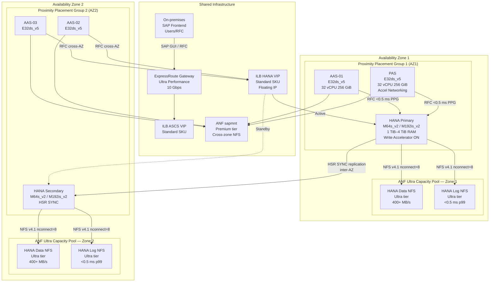
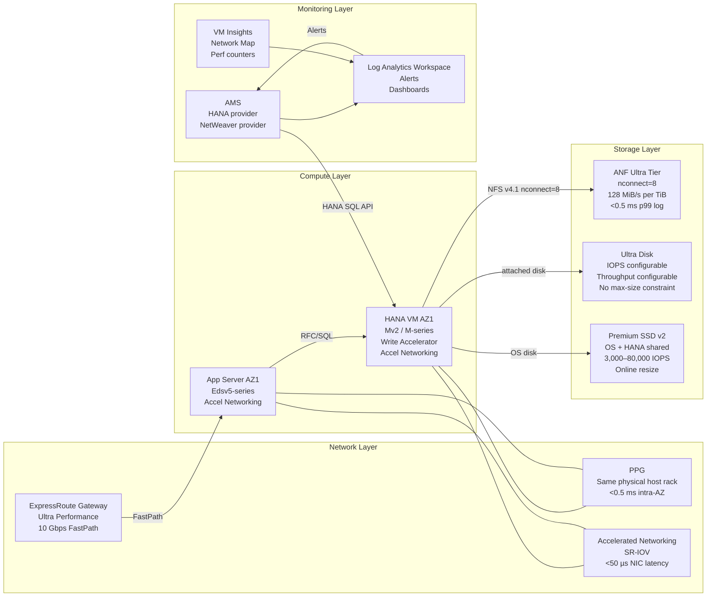

# SAP on Azure Performance Engineering

---

## Overview

SAP workloads on Azure have deterministic performance requirements defined by SAP certification standards, SAP Notes, and measured benchmarks. SAP HANA, the in-memory database underlying SAP S/4HANA and SAP BW/4HANA, requires storage latency below 1 ms p99 for log writes (SAP Note 2399079), storage read throughput of at least 400 MB/s for data volumes, memory bandwidth sufficient for columnar scan operations measured in GB/s, and sub-1 ms application-to-database round-trip time for ABAP dialog work processes. These are not aspirational targets but pass/fail thresholds: an Azure VM SKU or storage configuration that fails these tests is not supported for SAP HANA production. SAP NetWeaver ABAP adds a separate set of requirements around CPU throughput (measured in SAPS), work process response time, and RFC latency between application and database tiers. Performance engineering on Azure is therefore a constraint-satisfaction problem with documented lower bounds, not an optimization exercise.

The primary bottlenecks for SAP workloads on Azure are storage latency (HANA log write path), memory bandwidth (HANA column store scan operations), and network latency (ABAP application-to-HANA round-trip and HANA System Replication synchronous log shipping). Compute throughput (SAPS) is straightforward to provision by scaling out application servers. Storage IOPS and throughput on managed disks are disk-size-dependent and VM-SKU-limited, which makes Azure NetApp Files Ultra tier the preferred choice for HANA data and log volumes because ANF throughput scales with provisioned capacity and is not constrained by VM NIC limits for NFS traffic in the same way that Premium SSD attached storage is. Network bottlenecks manifest at two levels: the VM-level (Accelerated Networking is mandatory for all SAP VMs per SAP Note 1928533) and the topology level (Proximity Placement Groups are mandatory for latency-sensitive tiers per SAP Note 2800746).

Performance baseline documentation is a prerequisite before production go-live. The baseline captures: storage KPIs measured with hcmt (HANA Hardware Configuration Check Tool, SAP Note 1943937), network latency measured between application and database VMs, ABAP work process response time distribution under peak SAPS load, HANA key performance indicators from SAP HANA Studio or Cockpit (delta merge time, savepoint duration, log write latency histogram), and OS-level metrics (CPU ready time, memory ballooning, NIC packet loss). Without a baseline, post-go-live performance incidents cannot be diagnosed as regressions versus original misconfiguration. Azure Monitor Workbook for SAP Solutions and AMS (Azure Monitor for SAP Solutions) both integrate with the SAP HANA performance monitoring APIs to capture ongoing KPIs.

---

## Architecture Overview

The SAP on Azure performance architecture is organized into concentric tiers of latency sensitivity. The innermost tier is the SAP HANA database server: it requires the lowest latency access to its ANF NFS volumes and the highest memory bandwidth of any Azure VM SKU. The next tier is the SAP application server cluster (PAS and AAS VMs): these require low-latency RFC connections to HANA and low-latency NFS access to the /sapmnt share. The outermost tier is end-user connectivity through SAP Web Dispatcher, load balancers, and ExpressRoute — latency here affects user-perceived SAP GUI response time but is less critical than intra-SAP component latency. Each tier has distinct VM families, storage types, and network configurations that must be coordinated to achieve overall system performance targets.

Proximity Placement Groups (PPGs) are the Azure construct that constrains VM placement to the same physical data center within an Availability Zone. For SAP HANA scale-up deployments, placing the HANA VM and application server VMs in the same PPG reduces intra-zone application-to-database latency from a typical 0.5-1.5 ms to below 0.5 ms. SAP Note 2800746 explicitly requires PPG usage for SAP HANA production workloads where application servers are co-located with the HANA VM. The PPG must be anchored to an Availability Zone; the anchor VM (typically the HANA primary) determines the physical location, and all other PPG members are placed near it. PPG constraint is applied at VM creation time; retrofitting an existing VM into a PPG requires deallocating the VM, which causes downtime.

Accelerated Networking (AN) is the Azure feature that bypasses the hypervisor virtual switch for NIC data path operations, using SR-IOV to deliver NIC hardware directly to the VM. AN reduces network latency from approximately 200 microseconds to below 50 microseconds for inter-VM traffic and reduces CPU overhead for network processing by approximately 50%. SAP Note 1928533 mandates Accelerated Networking for all supported SAP VM sizes on Azure. All E-series (Edsv5, Easv5), M-series (Msv2, Mdsv3, Mv2), and D-series (Ddsv5) VMs that appear on the SAP Note 1928533 Azure VM list support AN. AN is enabled per NIC; a VM with multiple NICs requires AN enabled on each NIC independently. AN requires the NETVSC and HANA drivers on SLES and RHEL; the SAP-specific OS images from Azure Marketplace include these drivers pre-installed.

Storage performance is the most complex dimension of SAP on Azure performance engineering. HANA data volume throughput and IOPS requirements scale with HANA memory size and workload type: a HANA OLTP workload (S/4HANA) requires 400 MB/s data read throughput and 250 MB/s log write throughput per SAP Note 2399079. These requirements are validated by the HANA Hardware Configuration Check Tool (hcmt). Azure NetApp Files Ultra tier delivers 128 MiB/s per TiB provisioned, meaning a 4 TiB Ultra volume delivers ~512 MiB/s, which exceeds the HANA data throughput requirement. For HANA log volumes, latency (not throughput) is the binding constraint: the log write must complete in under 1 ms p99 per SAP Note 2399079. ANF Ultra tier delivers sub-0.5 ms p99 log write latency in the same Azure region, meeting this requirement with margin. Premium SSD v2 managed disks can also meet this requirement on Write Accelerator-enabled M-series VMs (see the Compute Performance section).

### Architecture Diagram: SAP Performance Topology with PPG and Availability Zones



---

## SAP Architecture

### SAP Workload Profiles

SAP workloads on Azure fall into three performance profiles, each with distinct bottleneck patterns:

**OLTP (SAP S/4HANA, SAP ECC):** CPU throughput (SAPS) and database transaction latency dominate. HANA log write latency directly impacts ABAP dialog work process response time because ABAP commit processing waits for HANA log persistence before returning to the user. The critical path is: ABAP work process → HANA SQL execute → HANA row store or column store operation → HANA log write (synchronous, waits for storage ACK) → HANA commit return → ABAP response. A 1 ms increase in HANA log write latency adds approximately 1 ms to every committed ABAP dialog step. For an ABAP dialog step with 20 database commits, 1 ms log latency adds 20 ms to the step time, which is perceptible to users.

**OLAP (SAP BW/4HANA, SAP BW on HANA):** Memory bandwidth and HANA parallel execution capacity dominate. BW queries perform full columnar table scans; a 1 TiB HANA column store scanned at 50 GB/s (typical M-series memory bandwidth) takes 20 seconds. HANA partitioning and parallelism are critical tuning parameters. The ratio of HANA memory to data size determines whether data fits in memory or requires reads from storage. BW/4HANA data loads are storage-throughput-bound: high-volume InfoProvider activations require 400 MB/s+ read throughput from the HANA data volume.

**Mixed (SAP S/4HANA with embedded analytics, SAP HANA Live):** Both OLTP and OLAP requirements apply simultaneously. Peak OLAP queries can saturate HANA execution slots, causing OLTP response time degradation. HANA workload classes (SAP Note 2222250) are used to partition resources between interactive (OLTP) and batch (OLAP) workloads. VM sizing must accommodate the combined SAPS requirement of both workload types at simultaneous peak.

### SAP HANA In-Memory Performance

HANA's columnar in-memory architecture delivers performance through SIMD (Single Instruction Multiple Data) vector operations on column-compressed data. For Azure, the relevant constraint is memory bandwidth: HANA column scan performance scales with memory bandwidth per NUMA node, not CPU frequency. The M192is_v2 provides 192 vCPUs across multiple NUMA nodes, each with local DRAM channels. HANA NUMA-local memory access is critical; HANA processes should be pinned to NUMA nodes using cgroup or HANA's own NUMA binding configuration (parameter `numa_nodes_filter` in indexserver.ini). Cross-NUMA memory access incurs a penalty of approximately 30-50 ns versus local access, which compounds for column scan operations.

HANA delta merge is a background operation that converts row store (delta store) to column store format. Delta merge is triggered when the delta store size exceeds a threshold (default: HANA auto-merge at 20% of column store size). Delta merges are CPU and memory-bandwidth intensive and can cause transient OLTP latency spikes if they run during peak load. Azure scheduling: delta merge operations should be scheduled during off-peak windows using HANA system parameter `merge_job_start_time` in indexserver.ini. Write Accelerator on M-series VMs ensures that HANA log writes during high-merge-load periods do not degrade below the 1 ms p99 threshold.

HANA savepoints (checkpoints) write all dirty column store delta pages to the data volume. Savepoint frequency (default: every 5 minutes) and duration determine the sustained data volume write throughput requirement. A HANA system with 1 TiB memory and 20% dirty pages generates approximately 200 GiB of savepoint writes per 5-minute interval, requiring approximately 700 MB/s data volume write throughput sustained for the savepoint duration. ANF Ultra tier handles this with provisioned throughput; Premium SSD v2 requires the disk to be provisioned with sufficient throughput capacity (configurable independently of IOPS on Premium SSD v2).

### SAP ABAP Work Process Tuning

ABAP work processes are the unit of concurrency for SAP NetWeaver. Each work process is a single OS process that handles one user request at a time. Work process tuning affects CPU utilization efficiency and response time distribution:

- **Dialog work processes:** Set to 2x the number of VM vCPUs as a starting point. For E32ds_v5 (32 vCPUs), configure 64 dialog work processes (parameter `rdisp/wp_no_dia` in DEFAULT.PFL). Monitor CPU utilization: if CPU is below 70% and dialog wait queue depth exceeds 0, add work processes.
- **Background work processes:** Minimum 6; scale based on number of concurrent batch jobs. Background work processes use the same CPU pool as dialog work processes; excessive background processes starve dialog work.
- **Update work processes:** Minimum 4 for V1 (synchronous update); V2 (asynchronous update) minimum 2. V1 update latency affects ABAP commit latency.
- **Enqueue work processes:** 1 per ASCS instance (SAP ENSA2). The enqueue server is single-threaded; lock throughput is limited by single-core CPU speed, not core count. Use the fastest available vCPU clock speed for ASCS VMs.
- **Spool work processes:** Minimum 2; increase if spool queue backup occurs during batch printing peaks.

### SAP Buffer Configuration

ABAP buffer sizes in DEFAULT.PFL directly affect application server CPU and database load. Undersized buffers cause excessive database reads (buffer misses counted in ST05/SM66):

| SAP Buffer | Parameter | Minimum Production Value | Impact of Undersizing |
|---|---|---|---|
| Program buffer | `zcsa/program_buffer_area` | 2,000,000,000 (2 GB) | Frequent ABAP program loads from database |
| Table buffer (generic) | `zcsa/db_max_buffersize` | 400,000 (400 MB) | High SELECT on nametab tables |
| CUA buffer | `rscp/max_bufsize` | 32,000 (32 MB) | GUI layout reloads from database |
| Table definition buffer | `zcsa/table_buffer_area` | 60,000,000 (60 MB) | DD* table lookups on every transparent table access |
| Export/import buffer | `es/buffersize` | 100,000 (100 MB for shared memory) | Shared memory miss — file system read from /sapmnt |
| Roll buffer | `rdisp/ROLL_MAXFS` | 8,000,000 (62.5 MB per work proc) | Excessive paging for large ABAP contexts |

### Database Statistics Maintenance

HANA column store statistics are maintained automatically by the HANA optimizer. For HANA, performance issues related to stale statistics are less common than in traditional RDBMS, but the following maintenance operations have Azure-specific scheduling considerations:

- **Row store reorganization:** Run monthly via `ALTER SYSTEM RECLAIM VERSION SPACE`. Schedule during off-peak hours; this operation generates significant row store I/O.
- **Index rebuild:** HANA column store indexes are compressed and re-merged automatically during delta merge. Manual index rebuild is not typically required but can be triggered if fragmentation metrics in M_CS_TABLES show high fragmentation ratios.
- **Table redistribution (scale-out only):** For HANA scale-out on Azure (M-series VMs connected via dedicated storage network), run `ALTER TABLE ... PARTITION BY RANGE REDISTRIBUTE` after adding HANA worker nodes to rebalance data across nodes.
- **Statistics refresh for row store tables:** HANA row store tables used by ABAP lock tables and enqueue data require statistics updates after mass data loads. Execute `UPDATE STATISTICS` on row store tables in the SYSTEM schema after large data loads.

### SAP Notes Reference Table

| SAP Note | Title | Performance Impact | Where Applied |
|---|---|---|---|
| 1928533 | SAP Applications on Azure: Supported Products and Azure VM Types | VM selection for all SAP tiers; Accelerated Networking mandatory | All SAP VMs on Azure |
| 2399079 | Elimination of Storage Configuration Performance Check in HANA | Defines HANA storage KPIs: log <1 ms p99, data 400 MB/s read | HANA storage configuration |
| 1943937 | Hardware Configuration Check Tool (HCMT/HWCCT) | Provides hcmt tool to validate storage KPIs pre-production | Pre-go-live HANA storage validation |
| 2800746 | Proximity Placement Groups for SAP NetWeaver | Mandates PPG for HANA+appserver co-location | PPG configuration for HANA systems |
| 2222250 | SAP HANA Workload Classes | HANA resource management for mixed OLTP/OLAP | HANA workload class configuration |
| 2684254 | SAP HANA DB: Recommended OS Settings for SLES 15 | OS-level tuning: huge pages, CPU governor, NUMA settings | HANA OS configuration on SLES |
| 3024346 | SAP HANA DB: Recommended OS Settings for RHEL 8 | OS-level tuning for RHEL 8/9: transparent huge pages, NUMA | HANA OS configuration on RHEL |
| 2382421 | Optimizing the Network Configuration on HANA and OS Level | HANA network tuning: TCP buffer sizes, NUMA pinning for HSR | HANA System Replication network |
| 1956005 | Enterprise Linux support for Microsoft Azure | OS support matrix for Azure SAP workloads | OS version selection |
| 2235581 | SAP HANA: Supported Operating Systems | HANA OS support matrix; SLES 15 SP3+, RHEL 8.4+ | HANA OS selection |

---

## Azure Architecture

### Proximity Placement Groups

Proximity Placement Groups (PPGs) are mandatory for SAP HANA production deployments on Azure where application servers communicate with the HANA database (SAP Note 2800746). Without PPGs, Azure places VMs anywhere within an Availability Zone, which can result in inter-rack communication with latencies of 1-3 ms — above the 1 ms threshold for ABAP dialog application-to-database round-trip time.

PPG design rules for SAP on Azure:

1. **One PPG per Availability Zone per SAP system.** Do not span a PPG across zones; cross-zone placement defeats the purpose of PPGs and is blocked by Azure for zonal PPGs.
2. **Anchor the PPG to the HANA VM.** The HANA VM is deployed first; the PPG is created with the same zone constraint. Subsequent VMs (PAS, AAS) join the PPG at creation.
3. **Do not include DR or backup VMs in the production PPG.** DR VMs in a different zone must use a separate PPG.
4. **Scale sets (VMSS) for application servers:** Flexible Orchestration VMSS members can join a PPG if the VMSS is configured with `proximityPlacementGroup` at creation.
5. **Capacity reservation groups:** For capacity assurance, create an Azure Capacity Reservation Group anchored to the same AZ and attach the HANA VM and critical application server VMs to it. This ensures VM capacity is reserved even when VMs are deallocated.

PPG constraint can fail VM allocation if the data center hosting the anchor VM does not have capacity for the requested VM SKU. If PPG allocation fails, the resolution is: (a) choose a different VM SKU with available capacity; (b) request capacity increase via Azure support; or (c) if performance requirements allow, use a softer co-location hint (not recommended for production HANA).

### Accelerated Networking

Accelerated Networking (AN) must be enabled on every SAP VM NIC. On Azure Linux VMs running SLES or RHEL, AN is visible as a VF (Virtual Function) NIC managed by the `hv_netvsc` driver. Verify AN is active with `ethtool -i eth0 | grep "driver"` — the driver should show `mlx4_core` or `mlx5_core` (Mellanox/ConnectX) rather than `hv_netvsc` when AN is active.

AN is automatically enabled for supported VM sizes when provisioned via the Azure portal or ARM templates with `"enableAcceleratedNetworking": true` on the NIC resource. AN cannot be enabled on a running VM; the VM must be stopped-deallocated. Disabling AN on a running SAP system causes immediate network throughput degradation and increased CPU utilization for network processing.

### ExpressRoute Performance

SAP on Azure requires ExpressRoute for production connectivity from on-premises SAP users to Azure. The ExpressRoute Gateway SKU determines the maximum bandwidth and connections:

| Gateway SKU | Max Bandwidth | Max Connections | Use Case for SAP |
|---|---|---|---|
| Standard | 1 Gbps | 10 | Non-production only |
| High Performance | 2 Gbps | 10 | Small production SAP (< 1,000 users) |
| Ultra Performance | 10 Gbps | 10 | Production SAP S/4HANA, BW/4HANA |
| ErGw3AZ (Zone-redundant) | 10 Gbps | 10 | Production SAP requiring AZ-redundant gateway |

For SAP production systems, Ultra Performance gateway (or ErGw3AZ) is required. The 10 Gbps bandwidth supports concurrent SAP GUI sessions, RFC/BAPI integrations, and HANA database exports. SAP GUI sessions consume approximately 10-50 Kbps per user; 10,000 concurrent users require approximately 500 Mbps, which leaves headroom on a 10 Gbps gateway for background RFC traffic.

FastPath for ExpressRoute bypasses the gateway for dataplane traffic (VM-to-on-premises), reducing latency by approximately 1-2 ms compared to routing through the gateway. FastPath requires Ultra Performance or ErGw3AZ gateway and must be explicitly enabled on the ExpressRoute connection. For SAP RFC and HANA integration traffic between on-premises and Azure, FastPath is recommended.

### Azure NetApp Files Ultra Tier

ANF Ultra tier delivers 128 MiB/s throughput per TiB provisioned. For HANA data volumes, the typical sizing is 2x HANA memory size in TiB. Key ANF performance parameters:

- **nconnect mount option:** `nconnect=8` creates 8 parallel TCP connections per NFS mount, multiplying effective throughput by approximately 8x for large sequential I/O. This is required to achieve HANA data volume throughput targets on ANF.
- **Volume placement:** ANF volumes for HANA data and log must be in the same Azure region and zone as the HANA VM. Cross-zone ANF mounts are not supported for HANA production (latency exceeds 1 ms p99 for log volumes).
- **ANF backup integration:** ANF snapshots created by azacsnap do not consume capacity until the snapshot diverges from the active volume (copy-on-write). Snapshot creation is near-instantaneous and does not impact HANA throughput.
- **Delegated subnet:** ANF requires a dedicated /28 subnet delegated to `Microsoft.NetApp/volumes`. This subnet must have no route to the internet and must be sized to accommodate HANA scale-out worker node volumes.

### Ultra Disk IOPS/Throughput Configuration

Azure Ultra Disk allows independent configuration of disk size, IOPS, and throughput. For SAP HANA log volumes on managed disks (alternative to ANF), Ultra Disk is required on Mv2 and Mdsv3 VMs:

| Volume | Disk Size | Min IOPS Provision | Throughput Provision | Write Accelerator |
|---|---|---|---|---|
| HANA log (single disk) | 512 GiB | 5,000 IOPS | 250 MB/s | N/A (Ultra Disk natively fast) |
| HANA data (single disk) | 4,096 GiB | 7,000 IOPS | 400 MB/s | Not applicable |
| HANA shared | 1,024 GiB | 1,000 IOPS | 250 MB/s | Not applicable |

Ultra Disk requires the VM to be in an Availability Zone (not available for non-zonal VMs). Ultra Disk IOPS and throughput can be adjusted online without disk detach or VM reboot (live resize). This makes Ultra Disk suitable for environments where performance requirements change with load patterns.

### Service Detail Diagram



---

## Compute Performance

### VM Families for SAP Tiers

Azure VM families for SAP are selected by workload tier, not by raw vCPU count. The selection criteria are: SAP certification (SAP Note 1928533 Azure list), memory-to-CPU ratio (HANA requires high memory/vCPU ratio), local NVMe availability (Mdsv3 for HANA Fast Restart), and network throughput (Mv2 provides 16,000 Mbps, essential for HANA HSR log shipping).

| VM Family | Use Case | vCPUs | RAM | Network Gbps | SAP SAPS Rating | Notes |
|---|---|---|---|---|---|---|
| M32ts_v2 | HANA small production (< 192 GiB) | 32 | 192 GiB | 16,000 Mbps | ~32,000 | Write Accelerator required for log |
| M64s_v2 | HANA medium production (< 1 TiB) | 64 | 1,024 GiB | 16,000 Mbps | ~64,000 | Most common S/4HANA production SKU |
| M128s_v2 | HANA large (< 2 TiB) | 128 | 2,048 GiB | 16,000 Mbps | ~128,000 | BW/4HANA mid-range |
| M192is_v2 | HANA XL (< 4 TiB) | 192 | 4,096 GiB | 25,000 Mbps | ~192,000 | Largest single-node HANA on Azure |
| M208ms_v2 (Mv2) | HANA XXL (< 5.7 TiB) | 208 | 5,700 GiB | 16,000 Mbps | ~208,000 | Requires Mv2 generation |
| Msv2-128 | HANA memory-optimized | 128 | 3,892 GiB | 16,000 Mbps | ~128,000 | Alternate for large HANA |
| Mdsv3-Medium_32 | HANA with PMEM Fast Restart | 32 | 440 GiB | 16,000 Mbps | ~32,000 | Local NVMe for PMEM |
| E32ds_v5 | SAP Application Server (PAS/AAS) | 32 | 256 GiB | 16,000 Mbps | ~32,000 SAPS | Standard app server SKU |
| E64ds_v5 | SAP Application Server (large) | 64 | 512 GiB | 16,000 Mbps | ~64,000 SAPS | Large S/4HANA landscapes |
| E16ds_v5 | ASCS/ERS, SCS, small AAS | 16 | 128 GiB | 12,500 Mbps | ~16,000 SAPS | ASCS/ERS requires minimal resources |
| D4ds_v5 | SAP Web Dispatcher | 4 | 16 GiB | 4,000 Mbps | N/A | HTTP/HTTPS reverse proxy |

### NUMA Topology Considerations

M-series VMs on Azure present multiple NUMA nodes to the guest OS. The HANA database process (indexserver) must be bound to specific NUMA nodes to avoid cross-NUMA memory access latency. NUMA topology for key HANA VMs:

- **M64s_v2:** 2 NUMA nodes, 32 vCPUs and ~512 GiB RAM per node. HANA indexserver should bind to both NUMA nodes using `numactl --interleave=all` for balanced memory access.
- **M192is_v2:** 4 NUMA nodes, 48 vCPUs and ~1 TiB RAM per node. HANA NUMA binding via `indexserver.ini: [execution] max_numa_node_count = 4`.
- **Mv2 (M208ms_v2):** 2 NUMA nodes. Large HANA memory footprint benefits from interleaved allocation.

Verify NUMA topology in the guest with `numactl --hardware`. Configure HANA NUMA binding in `/hana/shared/SID/HDB00/daemon.ini`:
```ini
[process.hdbindexserver]
numaNodes = 0,1,2,3
```

### Memory Bandwidth for HANA

HANA column store scan performance is bounded by memory bandwidth. Azure M-series memory bandwidth specifications:

| VM SKU | Theoretical Memory Bandwidth | STREAM Benchmark (measured) | HANA Column Scan Rate |
|---|---|---|---|
| M64s_v2 | ~400 GB/s | ~320 GB/s | ~200 GB/s per NUMA node |
| M192is_v2 | ~1,000 GB/s | ~800 GB/s | ~600 GB/s aggregate |
| M208ms_v2 | ~450 GB/s | ~360 GB/s | ~250 GB/s aggregate |

Memory bandwidth is not listed in Azure VM specifications but is measurable with the STREAM benchmark (included in the SAP hcmt test suite). For BW/4HANA query performance, STREAM Triad >300 GB/s is the practical minimum for reasonable query response times on TiB-scale column stores.

### Azure Dedicated Hosts

Azure Dedicated Hosts (ADH) provide physical server isolation for SAP VMs. ADH is relevant for SAP performance in two scenarios:

1. **NUMA isolation:** On a shared host, other tenants' VMs on the same physical server compete for memory bandwidth. ADH eliminates this competition, providing consistent HANA column scan performance. In practice, Azure M-series hosts are typically not multi-tenanted for HANA-class workloads, but ADH provides a contractual guarantee.
2. **Noisy neighbor for CPU-bound ABAP workloads:** Application server VMs on D/E series hosts can experience CPU steal time from co-tenant VMs. ADH eliminates CPU steal; this is observable in Azure Metrics as CPU credits (not applicable to non-burstable VMs) and via `top`/`sar` CPU steal percentage in the guest OS.

ADH for SAP HANA: use the `Msv2` or `Mv2` host SKU. One Dedicated Host can host one or two HANA VMs depending on RAM requirements and host capacity. ADH is charged per host per hour regardless of VM utilization, which increases cost; reserved capacity pricing for ADH requires 1-year or 3-year commitment.

---

## Storage Performance

### Ultra Disk IOPS and Throughput for HANA Data/Log

HANA storage KPIs from SAP Note 2399079 (the replacement for SAP Note 1943937 storage check) define the minimum values that must pass the hcmt validation tool. These values are measured at the storage layer (not the application layer):

| Volume | Type | Min IOPS | Min Throughput | Max Latency (p99) | SAP Note |
|---|---|---|---|---|---|
| HANA data (/hana/data) | ANF Ultra or Ultra Disk | 7,000 (4 KiB random read) | 400 MB/s sequential read | 1 ms read | 2399079 |
| HANA log (/hana/log) | ANF Ultra or Ultra Disk + Write Accelerator | 2,000 (write) | 250 MB/s sequential write | 1 ms write p99 | 2399079 |
| HANA shared (/hana/shared) | ANF Premium or Premium SSD v2 | 1,000 | 250 MB/s | 2 ms | 1943937 |
| HANA backup (/hana/backup) | Standard SSD or Azure Backup | 500 | 100 MB/s | Not specified (throughput-bound) | 1943937 |
| /sapmnt (NFS) | ANF Premium | 500 | 100 MB/s | 5 ms (not latency-critical) | N/A |
| OS disk (/dev/sda) | Premium SSD v2 | 3,000 baseline | 125 MB/s | 5 ms | N/A |
| ASCS/ERS OS | Premium SSD v2 | 3,000 | 125 MB/s | 5 ms | N/A |

### Write Accelerator for HANA Log on Mv2

Write Accelerator (WA) is an Azure feature available exclusively on M-series VMs. It provides a write cache for managed disks attached to the HANA log volume, ensuring that HANA log writes are acknowledged to the OS (fsync) within microseconds, with the actual disk persistence occurring asynchronously. The effect is that HANA log write latency is reduced from approximately 1-3 ms (Premium SSD without WA) to below 0.5 ms (WA-enabled Premium SSD v2 or P30+ disks).

Write Accelerator rules:
- WA is supported only on M-series VMs (including Msv2, Mv2, Mdsv3). It is not available on E-series VMs.
- WA must be enabled per disk via the Azure portal, CLI (`az disk update --write-accelerator true`), or ARM template (`writeAcceleratorEnabled: true`).
- WA must NOT be enabled on the OS disk or the HANA data volume disk — only on the log disk.
- WA has a per-VM limit: M64s allows 8 WA-enabled disks; M192is allows 16 WA-enabled disks.
- If ANF Ultra tier is used for HANA log volumes, Write Accelerator is not applicable (NFS volumes mounted via network; WA applies only to managed disks).

### ANF Ultra Tier Latency

ANF Ultra tier latency characteristics measured in Azure regions:

- **Log write latency (4 KiB random write, fdatasync):** 200-400 µs p50, below 500 µs p99 in same-region deployments.
- **Data read latency (128 KiB sequential read):** Below 1 ms for large I/O; sub-millisecond for most reads.
- **Cross-zone ANF latency (if applicable):** 2-5 ms p99 — exceeds HANA log write requirement; cross-zone ANF mounts for HANA log are not supported.

ANF latency measurements should be captured with the hcmt tool before production go-live. The hcmt test suite runs a comprehensive set of I/O patterns including:
- `hcmt -v -t storage` for storage KPI validation.
- `hcmt -v -t network` for network latency and bandwidth validation.
Results are output as JSON and compared against thresholds in the hcmt threshold file (`thresholds.json`); a PASS status is required for SAP certification of the Azure infrastructure.

### Storage Latency per SAP Note 2399079

SAP Note 2399079 replaces the storage performance check in the Hardware Configuration Check Tool (HCMT). The key thresholds are:

- **HANA data volume read latency:** < 1 ms p99 for 1 MiB sequential reads. Rationale: HANA data volume reads occur during HANA restart (loading column store pages from storage) and during table scan operations that miss the HANA in-memory cache.
- **HANA log volume write latency:** < 1 ms p99 for 512 B random writes (fdatasync). Rationale: every ABAP commit triggers a HANA log write; this is on the critical path for ABAP dialog response time.
- **HANA data volume write throughput (savepoint):** > 250 MB/s sustained for 60 seconds. Rationale: HANA savepoints write all dirty pages; savepoint duration must be short enough to not interfere with regular operations.

Failing any of these thresholds means the infrastructure is not certified for SAP HANA production. The most common failure is log volume write latency on Premium SSD without Write Accelerator, which delivers 1-3 ms log write latency. The fix is always ANF Ultra tier or Write Accelerator-enabled managed disk for the log volume.

---

## Network Performance

### Application-to-Database Latency Requirements

The ABAP application server communicates with HANA over the SAP HANA SQL API (JDBC/ODBC via SQLDBC library). Every ABAP database request generates one or more network round trips. The latency requirement:

- **Intra-PPG (same Availability Zone, PPG-constrained):** < 0.5 ms round-trip time (RTT) for TCP packets. This is achievable with Accelerated Networking and PPG co-location.
- **Intra-zone without PPG:** 0.5–1.5 ms RTT typical. May be acceptable for non-dialog-intensive workloads but not for high-SAPS S/4HANA.
- **Cross-AZ (application server in AZ2, HANA in AZ1):** 1–3 ms RTT typical for cross-AZ within the same Azure region. This is acceptable for application servers that communicate with the HANA ILB VIP (cross-AZ ILB routing).
- **On-premises to HANA via ExpressRoute (RFC or SQL):** 5–15 ms RTT depending on ExpressRoute circuit latency and gateway processing. Acceptable only for batch RFC integrations, not for ABAP dialog work processes.

Measure network latency with `hping3` or `nping` between the application server and HANA VM IP addresses. For SAP-specific validation, use the SAP hcmt tool (`hcmt -v -t network`) which measures TCP round-trip time over multiple packet sizes.

### ExpressRoute Bandwidth Planning

ExpressRoute bandwidth planning for SAP on Azure must account for:

| Traffic Type | Bandwidth per 1,000 Users | Peak Multiplier | Total for 10,000 Users |
|---|---|---|---|
| SAP GUI (DIAG protocol) | 5-50 Kbps per session | 3x | 150-1,500 Mbps |
| RFC/BAPI (on-premises integration) | 10-100 Mbps per integration point | 2x | 200-2,000 Mbps |
| HANA backup to on-premises | 500 Mbps - 2 Gbps | 1x (off-peak) | 500 Mbps - 2 Gbps |
| SAP Solution Manager to Azure | 10-50 Mbps | 1.5x | 15-75 Mbps |

For a 10,000-user SAP S/4HANA system with multiple RFC integrations, an ExpressRoute circuit of 2-10 Gbps is required. Ultra Performance ExpressRoute Gateway (10 Gbps) with FastPath enabled covers most enterprise SAP deployments. Multiple ExpressRoute circuits for redundancy: minimum 2 circuits from different providers, each with their own gateway connection.

### Inter-AZ Latency for HANA HSR

HANA System Replication (HSR) in SYNC mode requires the HANA secondary to acknowledge every log write before the primary returns the commit to the application. The inter-AZ latency for HSR affects HANA OLTP throughput:

- **HANA HSR SYNC latency impact:** Every HANA commit waits for the HSR acknowledgment (in addition to the local log write). If inter-AZ RTT = 1 ms, HSR adds ~1 ms to every HANA commit latency. For a workload with 1,000 commits/second, this is a 1,000 ms/second overhead (effectively 1x CPU core equivalent).
- **Azure inter-AZ RTT:** Typically 0.5–2 ms within a region. Microsoft does not publish official inter-AZ latency guarantees; measure with `hping3` between AZ1 and AZ2 VMs.
- **HANA HSR network isolation:** HSR log shipping traffic should use a dedicated NIC (or VLAN/subnet) separate from the HANA SQL client traffic. On M-series VMs with 25 Gbps NICs, HSR peak throughput (during large transactions) can saturate a shared NIC. Configure HSR `[system_replication_communication]` section in `global.ini` to bind HSR to the dedicated interface IP.

SAP Note 2382421 provides network tuning parameters for HANA HSR:
```ini
[system_replication_communication]
listeninterface = .internal
[communication]
tcp_backlog = 2048
```

### HANA Scale-Out Network

For HANA scale-out (multiple HANA worker nodes sharing a distributed database), inter-node communication uses the HANA internal communication network. On Azure, this requires:

- Dedicated subnet for HANA internal communication: /24 minimum, isolated from SAP application server subnets.
- All HANA worker node VMs in the same Availability Zone (no cross-AZ scale-out supported).
- Accelerated Networking on all HANA worker VMs.
- MTU 9000 (jumbo frames) configured on the HANA internal NIC: `ip link set eth1 mtu 9000` in `/etc/sysconfig/network/ifcfg-eth1`.
- ANF volumes for HANA data and log must use `nconnect=8` per worker node.

---

## Design Decisions

| Decision | Options Considered | Choice | Rationale | SAP/Azure Reference |
|---|---|---|---|---|
| PPG strategy for HANA+appserver | (1) No PPG, rely on AZ placement; (2) PPG per AZ anchored to HANA VM; (3) Cross-zone soft PPG | PPG per AZ anchored to HANA VM | Option 2 achieves < 0.5 ms intra-AZ RTT between HANA and app servers; option 1 results in 0.5–1.5 ms RTT with no guarantee; cross-zone PPG not supported | SAP Note 2800746; Azure docs: PPG for SAP |
| VM family for HANA production | (1) Mv2 (208 vCPU/5.7 TiB); (2) M192is_v2 (192 vCPU/4 TiB); (3) M64s_v2 (64 vCPU/1 TiB); (4) E-series (not HANA-certified) | M64s_v2 for standard S/4HANA; M192is_v2 for BW/4HANA | M64s_v2 covers up to 800 GiB HANA memory (S/4HANA standard) with Write Accelerator and ANF support; M192is_v2 for large BW/4HANA; Mv2 only when >4 TiB required | SAP Note 1928533 certified instances list |
| HANA log storage: ANF Ultra vs managed disk Write Accelerator | (1) ANF Ultra NFS with nconnect=8; (2) Premium SSD v2 + Write Accelerator (M-series only); (3) Ultra Disk (no WA needed) | ANF Ultra tier as primary; Ultra Disk on Mv2 where ANF not available | ANF Ultra delivers < 0.5 ms p99 log latency with nconnect=8 and is not subject to VM disk IOPS limits; Write Accelerator achieves similar latency but requires M-series and is limited per-VM; Ultra Disk viable but higher per-GB cost than ANF at scale | SAP Note 2399079; ANF SAP HANA guide |
| Network design: dedicated HSR subnet vs shared NIC | (1) HSR traffic on same NIC as SQL client traffic; (2) Dedicated second NIC for HSR; (3) VLAN separation on single NIC | Dedicated second NIC for HSR on M-series VMs with 25 Gbps NIC | HSR peak traffic during large transactions can saturate a 16 Gbps NIC when combined with SQL client traffic; dedicated NIC prevents HSR from impacting dialog response time; M-series supports up to 8 NICs | SAP Note 2382421; HANA System Replication guide |
| NUMA binding for HANA indexserver | (1) No explicit NUMA binding (OS decides); (2) numactl interleave all NUMA nodes; (3) HANA-level NUMA configuration in indexserver.ini | HANA-level NUMA configuration in indexserver.ini | Explicit HANA NUMA binding via `max_numa_node_count` ensures HANA column store pages are interleaved across all NUMA nodes, maximizing aggregate memory bandwidth; OS default allocation is less predictable | SAP Note 2684254; HANA Administration Guide |
| ANF vs managed disk for HANA data volume | (1) ANF Ultra tier NFS; (2) Multiple Premium SSD v2 striped (LVM); (3) Ultra Disk striped | ANF Ultra tier NFS | ANF throughput scales linearly with provisioned capacity at fixed cost per TiB; Premium SSD v2 striping requires LVM configuration and per-disk IOPS/throughput provisioning which is complex; ANF provides shared access for HANA scale-out and HSR without per-node disk management | SAP Note 1943937; ANF SAP HANA sizing |
| Availability Zone placement for HANA | (1) Single AZ (no cross-zone HA); (2) Two-AZ HANA HSR SYNC; (3) Three-AZ active/active (not supported for HANA SYNC) | Two-AZ HANA HSR SYNC with Pacemaker | Azure guarantees 99.99% SLA for VMs in multiple AZs; HSR SYNC provides zero data loss (RPO=0) on AZ failure; single AZ does not qualify for 99.99% SLA; three-AZ not supported with SYNC mode due to write amplification | Azure SLA; SAP Note 2808515 |
| Monitoring: AMS vs custom Azure Monitor | (1) Azure Monitor for SAP Solutions (AMS) native providers; (2) Custom Azure Monitor workbooks with Prometheus exporters; (3) SAP Solution Manager with Azure integration | AMS native providers (HANA, NetWeaver, OS) with custom alert rules | AMS HANA provider integrates directly with HANA SQL monitoring views without custom scripting; AMS NetWeaver provider collects ABAP work process metrics; custom Prometheus requires additional VM and maintenance; AMS is managed service with no infrastructure overhead | AMS documentation; SAP Note 3215564 |

---

## SAP Notes Reference

| SAP Note | Title | Version | Key Performance Guidance |
|---|---|---|---|
| 1928533 | SAP Applications on Azure: Supported Products and Azure VM Types | Current | Master list of certified Azure VM SKUs; Accelerated Networking mandatory for all listed VMs |
| 2399079 | Elimination of Hana Storage Performance Check in HANA | Current | Supersedes HCMT storage check; defines log <1 ms, data 400 MB/s, hcmt test procedure |
| 1943937 | Hardware Configuration Check Tool — HCMT/HWCCT | Current | hcmt tool download; storage KPI thresholds; network test parameters |
| 2800746 | Proximity Placement Groups for SAP NetWeaver | Current | PPG mandatory for HANA+appserver; PPG anchor to HANA VM; Azure-specific configuration |
| 2684254 | SAP HANA DB: Recommended OS Settings for SLES 15 / SLES for SAP | Current | CPU governor performance; transparent huge pages disable; NUMA settings; kernel parameters |
| 3024346 | SAP HANA DB: Recommended OS Settings for RHEL 8 | Current | RHEL 8/9 specific: tuned profile sap-hana; NUMA policy; kernel.numa_balancing disable |
| 2382421 | Optimizing the Network Configuration on HANA and OS Level | Current | HSR network binding; TCP buffer sizes; jumbo frames for HANA scale-out |
| 2222250 | SAP HANA Workload Classes | Current | Resource isolation for mixed OLTP/OLAP; CPU and memory limits per workload class |
| 1999930 | FAQ: SAP HANA Memory | Current | HANA memory sizing formulas; column store memory estimation; delta store sizing |
| 3114876 | SAP HANA on Azure NetApp Files: Volume Layout | Current | ANF volume naming, sizing, and placement for HANA; nconnect mount option |

---

## Azure Well-Architected Alignment

| Pillar | Requirement | Implementation | Reference |
|---|---|---|---|
| Performance Efficiency | HANA log write latency < 1 ms p99; ABAP dialog response time < 1 s at peak SAPS; ExpressRoute bandwidth sufficient for peak load | ANF Ultra tier with nconnect=8 for HANA log; PPG for intra-AZ app-to-DB < 0.5 ms; Ultra Performance ExpressRoute gateway with FastPath; hcmt validation pre-go-live | SAP Note 2399079; SAP Note 2800746; Azure Architecture Center SAP performance |
| Reliability | RPO=0 for HANA (HSR SYNC); no performance degradation during single-AZ failure; automatic failover < 120 seconds | HANA HSR SYNC cross-AZ with Pacemaker SAPHana resource agent; ILB with floating IP for automatic VIP migration; PPG per AZ ensures performance is maintained in surviving zone | Azure SLA 99.99%; SAP Note 2808515 |
| Security | Performance monitoring data contains sensitive SAP landscape information; performance testing credentials must be protected | Azure Monitor for SAP Solutions uses system-assigned managed identity (no credential storage); Key Vault for hcmt tool configuration secrets; network security groups block performance monitoring ports from public internet | AMS security model; Azure Key Vault integration |
| Cost Optimization | ANF Ultra tier and M-series VMs are premium-cost resources; right-sizing prevents over-provisioning; Reserved Instances provide 3-year commitment discount | Right-sizing via Azure Advisor + SAP EarlyWatch Alert SAPS utilization data; 3-year Reserved Instance for HANA VMs (40-60% discount vs pay-as-you-go); ANF capacity pool right-sizing based on hcmt throughput measurements; auto-pause non-production HANA systems | Azure Advisor; SAP EarlyWatch Alert; Azure RI pricing |
| Operational Excellence | Performance baselines must be captured and compared across system lifecycle; performance incidents require repeatable diagnostic procedure | hcmt baseline documentation stored in Azure Storage (immutable blob container); AMS dashboards capture HANA key performance metrics in 30-second intervals; Azure Monitor Alerts trigger runbooks for threshold breaches; EarlyWatch Alert submitted monthly to SAP for trend analysis | Azure Monitor Workbook for SAP; SAP EarlyWatch Alert; SAP Note 3215564 |

---

## Security Architecture

### Performance Monitoring Access Control

Azure Monitor for SAP Solutions (AMS) uses a system-assigned managed identity to authenticate to HANA and NetWeaver. The managed identity is assigned the minimum required roles:

- HANA monitoring: A dedicated HANA database user (`AZUREWLBACKUPUSER` equivalent for monitoring) with SELECT privileges on monitoring views only (`SYS.M_*`, `_SYS_STATISTICS.*`). This user is not a HANA system administrator.
- NetWeaver monitoring: An ABAP RFC user with `S_RFC` authorization for function modules `RFC_READ_TABLE`, `TH_SERVER_LIST`, `SWNC_COLLECTOR_GET_AGGREGATED`. The RFC user must not have dialog logon authorization (`S_TCODE` blank).
- OS monitoring (Linux): The AMS VM extension runs as root on the monitored VM. The extension is pinned to a specific version and updated only after SAP-approved testing.

Access to AMS dashboards in Azure Monitor is controlled by Azure RBAC:
- **Monitoring Reader:** Can view dashboards and alerts, cannot modify alert rules or AMS providers.
- **Monitoring Contributor:** Can create and modify alert rules and AMS providers.
- **Owner/Contributor on AMS resource:** Can delete AMS provider instances; restrict to SAP basis team leads only.

### Key Vault for Performance Tool Credentials

Performance testing tools (hcmt, fio, iperf3 for custom tests) require credentials for HANA database access. These credentials must be stored in Azure Key Vault, not in configuration files on the VM:

```bash
# Retrieve hcmt HANA user password at test time
HANA_PASS=$(az keyvault secret show \
  --vault-name kv-sap-perf-prod \
  --name hcmt-hana-user \
  --query value -o tsv)
# Pass to hcmt via environment variable (not command-line argument)
export HANA_PASSWORD=$HANA_PASS
hcmt -v -t storage
```

The Key Vault must be in the same Azure region as the SAP workload. Access is granted via managed identity on the performance testing VM, with a Key Vault access policy granting only `Get` on secrets. The Key Vault diagnostic logs (secret access events) are forwarded to Log Analytics for audit trail.

### Network Security for Performance Testing

Performance testing generates high-volume synthetic I/O (fio, hcmt storage tests) and network traffic (iperf3). NSG rules must permit this traffic only from designated test VMs:

- Performance testing VMs are deployed in a dedicated subnet (`snet-perf-testing`) with an NSG that permits inbound from the test subnet only.
- hcmt storage tests run locally on the HANA VM (no inbound network required).
- iperf3 network tests between app server and HANA VM require TCP port 5201 permitted within the SAP application subnet.
- All performance test results are exported to Azure Blob Storage via a service endpoint connection (no public internet path).

---

## Reliability and High Availability

| SAP Tier | RPO Target | RTO Target | HA Method | DR Method | Azure SLA Component |
|---|---|---|---|---|---|
| SAP HANA (primary) | 0 (zero data loss) | < 120 seconds (automated) | HSR SYNC + Pacemaker SAPHana RA; ILB floating IP | HSR async to DR region (RPO < 15 min); or ANF Cross-Region Replication | Azure VM 99.99% (multi-AZ); ANF 99.99% |
| SAP ASCS/ERS | 0 (stateless failover) | < 60 seconds (Pacemaker) | Pacemaker ENSA2 cluster; ILB floating IP; fence_azure_arm STONITH | Active ASCS profile on DR HANA system; restart from DR storage | Azure VM 99.99% (multi-AZ) |
| SAP Application Servers (PAS/AAS) | Stateless (no data) | < 5 minutes (VM restart) | Multiple AAS VMs across AZs; SAP Logon Group load distribution; Azure VMSS Flexible for horizontal scale | Pre-provisioned AAS VMs in DR region (stopped); start on DR activation | Azure VM 99.9% (single AZ) for each AAS |
| SAP Web Dispatcher | Stateless | < 5 minutes | Two Web Dispatcher VMs behind Azure Application Gateway; health probes | DR Application Gateway + Web Dispatcher in DR region | Azure Application Gateway 99.95% |
| ANF HANA volumes | N/A (managed service) | < 15 minutes (snapshot restore) | ANF built-in HA (99.99%); azacsnap hourly snapshots | ANF Cross-Region Replication (async, RPO < 1 hour); restore from snapshot | ANF SLA 99.99% |
| ExpressRoute Gateway | N/A (redundant circuits) | < 5 minutes (BGP reconvergence) | Two ExpressRoute circuits (different providers); Zone-redundant ErGw3AZ | DR region ExpressRoute circuit pre-provisioned | ExpressRoute Gateway 99.95% |

Performance implications of HA events:
- **HANA HSR failover:** Application servers lose HANA connectivity for the duration of Pacemaker failover (60-120 seconds). ABAP work processes enter CPIC error state. After ILB VIP migration, application servers reconnect automatically via SAP HANA client failover configuration (JDBC failover parameter: `reconnect=true`).
- **Post-failover performance:** The new HANA primary (former secondary) starts without warm column store cache. First queries after failover are slower until the column store is loaded from ANF. Cache warm-up time depends on HANA memory size: approximately 5-15 minutes for a 1 TiB HANA system loading column store pages at 400 MB/s.

---

## Cost Optimization

### Performance vs Cost Trade-offs

Performance tier VMs and storage are the most expensive components of an SAP on Azure deployment. The trade-offs are well-defined:

| Component | Performance Tier | Cost Tier | Performance Difference | Use Case |
|---|---|---|---|---|
| HANA storage: ANF Ultra vs ANF Premium | Ultra: 128 MiB/s/TiB, < 0.5 ms p99 | Premium: 64 MiB/s/TiB, 1-2 ms p99 | Ultra mandatory for HANA log (1 ms requirement); Premium acceptable for HANA shared | Log: Ultra mandatory; Data: Ultra preferred; Shared: Premium |
| HANA VM: M64s_v2 vs M32ts_v2 | M64s_v2: 1 TiB RAM, 64 vCPU | M32ts_v2: 192 GiB RAM, 32 vCPU | Linear SAPS difference; M32ts_v2 for < 150 GiB HANA memory | Right-size based on HANA Quick Sizer output |
| App server: E32ds_v5 vs E16ds_v5 | E32ds_v5: 32 vCPU 256 GiB | E16ds_v5: 16 vCPU 128 GiB | 2x SAPS difference; start with E16ds_v5 for non-production | Non-production: E16ds_v5; production: E32ds_v5 based on SAPS |
| ExpressRoute: Ultra vs High Performance | 10 Gbps vs 2 Gbps | ~4x cost difference | No functional difference below 2 Gbps aggregate traffic | Monitor ExpressRoute utilization; downsize if consistently < 1 Gbps |

### Right-Sizing Process

SAP system right-sizing on Azure is a three-phase process:

1. **Pre-deployment:** Use SAP Quick Sizer output (SAPS requirement) to select initial VM SKU. Apply 30% headroom over Quick Sizer SAPS for peak concurrency. For HANA memory: Quick Sizer output x 1.2 (20% buffer) = minimum VM RAM.
2. **Post-deployment (first 30 days):** Monitor CPU utilization (target < 65% average), memory utilization (HANA allocated / total VM RAM, target < 80%), and SAPS utilization from SAP SM66/SM50/EWA (EarlyWatch Alert). Collect data for at least 2 complete business cycles (month-end, quarter-end).
3. **Continuous right-sizing:** Azure Advisor generates VM right-sizing recommendations based on 30-day CPU and network utilization. SAP EarlyWatch Alert (submitted monthly via SAP Solution Manager) provides ABAP response time trends and SAPS utilization percentages that feed the right-sizing analysis.

### Reserved Instances for Performance-Tier VMs

| Optimization | Estimated Saving | Implementation Complexity | Prerequisites |
|---|---|---|---|
| 3-year Reserved Instance for HANA M-series VMs | 55-60% vs pay-as-you-go | Low (purchase via Azure portal; no VM changes) | 3-year commitment; HANA VM SKU confirmed stable via right-sizing process |
| 1-year Reserved Instance for application server E-series | 35-40% vs pay-as-you-go | Low | 1-year commitment; application server count stable |
| ANF capacity pool: reserved capacity pricing | 20-30% depending on region | Low (configure reserved capacity on ANF capacity pool) | ANF capacity pool size confirmed via hcmt throughput measurements |
| Auto-shutdown non-production HANA systems | 60-70% savings on non-prod (18h/day shutdown) | Medium (requires HANA stop/start automation; ABAP RFC reconnect handling) | HANA auto-start scripts; SAP system stop/start runbooks tested |
| Azure Spot VMs for non-prod application servers | 70-80% savings on app server tier | High (Spot VMs can be evicted; SAP work process must handle reconnection gracefully) | Non-production only; SAP Logon Group configured for Spot VM eviction tolerance |
| ExpressRoute circuit downsize (if under-utilized) | 30-50% on gateway cost | Medium (requires BGP reconvergence; brief connectivity interruption) | 90-day utilization data showing < 50% of current bandwidth |
| Storage tiering: move HANA backup from Premium to Standard SSD | 40-50% on backup storage | Low (change backup path mount to Standard tier ANF or Azure Blob cold) | HANA backup latency not on critical path; restore time testing required |

---

## Performance Benchmarking

### SAP SD Benchmark

The SAP SD (Sales and Distribution) benchmark is the standard throughput measurement for SAP OLTP workloads. It measures SAPS (SAP Application Performance Standard) under a defined SD order-processing workload. For Azure validation:

- **Benchmark procedure:** SAP provides the SD benchmark tool via SAP Service Marketplace. The benchmark simulates concurrent users executing SD order processing steps, including VA01 (sales order creation), VL01N (delivery), and VF01 (billing).
- **Azure published benchmarks:** SAP publishes certified benchmark results for Azure VM SKUs at [https://www.sap.com/dmc/exp/2018-benchmark-directory/#/sd](https://www.sap.com/dmc/exp/2018-benchmark-directory/#/sd). E32ds_v5 delivers approximately 32,000 SAPS; M64s_v2 delivers approximately 64,000 SAPS (including HANA database).
- **Benchmark interpretation:** Published SAPS values assume ideal conditions (dedicated server, no background load, optimal PPG placement). Production systems should be sized at 70% of published SAPS to allow headroom for batch jobs, RFC integrations, and reporting queries running concurrently with dialog workload.

### HANA TPC-H on Azure

TPC-H is the standard decision-support benchmark for HANA OLAP performance. SAP publishes TPC-H results for HANA on Azure in the SAP HANA Hardware Directory. Key parameters for Azure:

- **TPC-H Scale Factor (SF):** SF-3000 (3,000 GB dataset) is typical for BW/4HANA validation on M192is_v2 (4 TiB RAM). The dataset must fit in HANA memory for in-memory performance.
- **Result metric:** Composite Query-per-Hour (QphH@SF-3000). Higher is better; published M192is_v2 results exceed 1,000 QphH@SF-3000 on Azure ANF Ultra storage.
- **Interpretation:** TPC-H is a synthetic benchmark; actual BW/4HANA query performance depends on data model design, HANA partitioning strategy, and workload class configuration. Use TPC-H for infrastructure validation, not production query performance estimation.

### Baseline Documentation Process

Performance baseline documentation must be captured before production go-live and stored in an immutable location:

1. **Storage baseline (hcmt):** Run `hcmt -v -t storage` on the HANA VM against the ANF data and log volumes. Export results to JSON. Store in Azure Blob Storage with immutable container policy (WORM) for compliance.
2. **Network baseline (hcmt):** Run `hcmt -v -t network` between HANA VM and each application server VM. Document RTT (round-trip time) and throughput. Verify PPG co-location delivers < 0.5 ms RTT.
3. **HANA KPI baseline (SAP HANA Studio / HANA Cockpit):** Capture HANA system overview metrics: service memory consumption, delta store size, savepoint duration, log write latency histogram (from `M_SERVICE_STATISTICS`), and alert count.
4. **ABAP baseline (SM66/SM50):** Record peak dialog work process response time distribution, CPU utilization per work process type, and SAPS utilization percentage during a simulated peak load test.
5. **OS baseline (SAR/sar):** Capture CPU utilization (per-core and aggregate), memory utilization, disk I/O (iops and throughput per mount point), and network packet rate per NIC from a 4-hour peak load window.

---

## Operations and Monitoring

### Azure Monitor for SAP Solutions (AMS) Providers

AMS collects performance metrics via specialized providers that integrate with SAP APIs:

| AMS Provider | Metrics Collected | Collection Interval | Alert Coverage |
|---|---|---|---|
| SAP HANA | HANA memory usage, delta merge rate, savepoint duration, log write latency, service availability, HSR status, disk usage per volume | 30 seconds | HANA OOM risk, log latency breach, delta merge failure, HSR lag |
| SAP NetWeaver (ABAP) | Work process utilization, short dumps rate, enqueue lock table fill, system log error rate, spool queue depth | 60 seconds | Work process exhaustion, lock table full, high short dump rate |
| OS (Linux) | CPU utilization, memory utilization, disk I/O (IOPS, throughput, latency per mount), network (Mbps, packet loss, retransmits) | 30 seconds | CPU saturation, disk I/O bottleneck, network errors |
| HA Cluster (Pacemaker) | Cluster node status, resource state (HANA, ASCS, ERS), STONITH status, cluster communication errors | 30 seconds | Resource failover event, STONITH failure, cluster split-brain |

### VM Insights for SAP

Azure VM Insights (via Log Analytics agent or Azure Monitor Agent) provides OS-level performance data visualized in the Azure portal:

- **Performance tab:** Shows CPU, memory, disk, and network metrics with 5-minute granularity. Useful for identifying noisy-neighbor effects and resource contention.
- **Map tab:** Shows network connections between VMs, enabling visualization of SAP application-to-database communication paths and identifying unexpected cross-zone connections.
- **Log queries:** VM Insights data in Log Analytics can be queried with KQL to identify performance regressions over time:
```kql
Perf
| where ObjectName == "Logical Disk" and CounterName == "Disk Transfers/sec"
| where InstanceName == "/hana/log"
| summarize avg(CounterValue) by bin(TimeGenerated, 5m), Computer
| render timechart
```

### EarlyWatch Alert Integration

SAP EarlyWatch Alert (EWA) is an automated SAP system health check submitted to SAP Support. EWA provides performance trend analysis that Azure Monitor cannot provide because it accesses ABAP-layer metrics:

- **SAPS utilization trend:** EWA reports CPU utilization as a percentage of licensed SAPS, enabling right-sizing decisions.
- **Database response time trend:** EWA reports HANA average response time per work process type over the reporting period.
- **Buffer quality trend:** EWA reports ABAP buffer hit ratios; declining buffer quality indicates buffer undersizing.
- **Submission frequency:** Monthly (automated via SAP Solution Manager or Cloud ALM).
- **Azure integration:** SAP Solution Manager runs on an Azure VM (E16ds_v5 or E32ds_v5); it connects to the monitored SAP systems via RFC. The Solution Manager VM should be in the same VNet as the SAP systems (not via ExpressRoute) to ensure low-latency RFC connections for EWA data collection.

### Performance Alerts

| Alert Name | Metric/Signal | Threshold | Severity | Runbook |
|---|---|---|---|---|
| HANA Log Write Latency High | AMS HANA provider: `hanadb_disk_io_time_ms` for log volume | p99 > 1 ms for 5 consecutive minutes | Critical | Check ANF volume throughput utilization; check HANA write_lob_chunks metric; verify Write Accelerator status if managed disk |
| HANA Memory Near Capacity | AMS HANA provider: `hanadb_used_memory_mb / hanadb_total_memory_mb` | > 85% for 10 minutes | Warning (> 90%: Critical) | Execute `ALTER SYSTEM RECLAIM VERSION SPACE`; check for HANA delta store accumulation; consider HANA memory dump if OOM imminent |
| Application Server Work Process Saturation | AMS NetWeaver provider: dialog work process free count | < 10% free work processes for 3 minutes | Critical | Add AAS VM (if spare capacity in VMSS); kill stuck work processes (SM50); check for HANA lockwait causing work process stacking |
| HANA HSR Replication Lag | AMS HANA provider: HSR secondary log shipping lag | > 30 seconds | Critical | Check inter-AZ network bandwidth; check HANA secondary disk I/O; verify no HANA secondary maintenance window conflicts; escalate if > 5 minutes |
| ANF Volume Throughput Saturation | Azure Monitor: `Microsoft.NetApp/netAppAccounts/capacityPools/volumes/readThroughput` + `writeThroughput` | > 90% of provisioned throughput for 10 minutes | Warning | Increase ANF volume size (throughput scales with size); review HANA delta merge schedule; check for runaway HANA query consuming data volume I/O |
| ExpressRoute Gateway Bandwidth High | Azure Monitor: `ExpressRouteGatewayBitsPerSecond` | > 80% of gateway SKU limit for 30 minutes | Warning | Review traffic composition; check for unplanned HANA backup over ExpressRoute; consider upgrading to higher gateway SKU |
| HANA Delta Merge Duration Excessive | AMS HANA provider: delta merge duration per table | > 30 minutes per delta merge operation | Warning | Check for unpartitioned large HANA column store tables; review merge scheduling configuration; check HANA CPU availability during merge |

### Performance Capacity Planning

Monthly capacity planning review compares current utilization against thresholds:

| Resource | Current Utilization | Warning Threshold | Action at Threshold |
|---|---|---|---|
| HANA VM CPU (SAPS % of VM capacity) | Track monthly average from EWA | 70% average | Plan VM scale-up at next maintenance window |
| HANA VM Memory (HANA used / VM RAM) | Track daily peak from AMS | 80% peak | Plan HANA memory extension or VM scale-up |
| ANF Data Volume throughput | Track daily peak from Azure Monitor | 80% of provisioned | Increase ANF volume size by 1 TiB increments |
| ExpressRoute bandwidth | Track hourly average from Azure Monitor | 60% of circuit speed | Open capacity review with network team |
| Application server vCPU (% of SAPS at peak) | Track from SM50/EWA | 65% at peak | Add AAS VM; right-size existing AAS if underutilized |

---

## Landing Zone Mapping

### PPG Placement in Landing Zone

In the SAP on Azure Landing Zone architecture, PPGs are deployed in the production SAP subscription and are scoped to a single Availability Zone:

- **PPG naming convention:** `ppg-<SID>-<region-short>-<az>-<env>` (e.g., `ppg-S4P-neu-az1-prod`).
- **PPG creation prerequisite:** The AZ-constrained Capacity Reservation Group must be created before the PPG to ensure capacity availability. The HANA VM anchor creates the PPG physical placement; subsequent VMs must match the zone.
- **Landing Zone policy:** Azure Policy (`Deny`) prevents HANA-certified VMs from being deployed without a PPG assignment. This policy is applied at the SAP production management group scope.
- **PPG and VMSS:** Application server VMSS (Flexible Orchestration) must have `proximityPlacementGroup` specified at VMSS creation. The VMSS zone must match the PPG zone.

### Subnet Design for Low-Latency Tiers

The SAP Landing Zone uses four dedicated subnets to isolate performance-sensitive traffic:

| Subnet | CIDR | Purpose | NSG Policy |
|---|---|---|---|
| snet-sap-hana | /27 (32 IPs) | HANA VM NICs (primary NIC: SQL client traffic) | Allow: intra-subnet (HANA SQL port 30013-30099); Allow: from snet-sap-app; Deny: all else |
| snet-sap-hana-rep | /27 (32 IPs) | HANA VM second NIC (HSR replication traffic) | Allow: TCP 40001-40099 between HANA nodes only; Deny: all else |
| snet-sap-app | /25 (128 IPs) | PAS, AAS, ASCS/ERS VMs | Allow: to snet-sap-hana (30013); Allow: from ExpressRoute; Allow: intra-subnet |
| snet-netapp | /28 (16 IPs, delegated) | ANF delegated subnet | Delegated to Microsoft.NetApp/volumes; no NSG (ANF requirement) |

The separation of HANA client (snet-sap-hana) and HSR replication (snet-sap-hana-rep) traffic onto dedicated subnets and NICs ensures that HSR log shipping traffic does not compete with ABAP SQL query traffic on the same NIC bandwidth allocation.

---

## Microsoft References

1. SAP workloads on Azure: planning and deployment checklist — [https://learn.microsoft.com/azure/sap/workloads/deployment-checklist](https://learn.microsoft.com/azure/sap/workloads/deployment-checklist)
2. SAP HANA Azure virtual machine storage configurations — [https://learn.microsoft.com/azure/sap/workloads/hana-vm-operations-storage](https://learn.microsoft.com/azure/sap/workloads/hana-vm-operations-storage)
3. Azure NetApp Files for SAP HANA — [https://learn.microsoft.com/azure/sap/workloads/hana-vm-operations-netapp](https://learn.microsoft.com/azure/sap/workloads/hana-vm-operations-netapp)
4. SAP HANA infrastructure configurations and operations on Azure — [https://learn.microsoft.com/azure/sap/workloads/hana-vm-operations](https://learn.microsoft.com/azure/sap/workloads/hana-vm-operations)
5. Proximity Placement Groups for SAP applications with Azure — [https://learn.microsoft.com/azure/sap/workloads/proximity-placement-scenarios](https://learn.microsoft.com/azure/sap/workloads/proximity-placement-scenarios)
6. Azure Monitor for SAP Solutions providers — [https://learn.microsoft.com/azure/sap/monitor/providers](https://learn.microsoft.com/azure/sap/monitor/providers)
7. Azure virtual machine sizes for SAP workloads — [https://learn.microsoft.com/azure/sap/workloads/planning-guide](https://learn.microsoft.com/azure/sap/workloads/planning-guide)
8. Configure Azure Write Accelerator for M-series virtual machines — [https://learn.microsoft.com/azure/virtual-machines/how-to-enable-write-accelerator](https://learn.microsoft.com/azure/virtual-machines/how-to-enable-write-accelerator)
9. SAP HANA Large Instances network architecture — [https://learn.microsoft.com/azure/sap/large-instances/hana-network-architecture](https://learn.microsoft.com/azure/sap/large-instances/hana-network-architecture)
10. ExpressRoute performance and scale — [https://learn.microsoft.com/azure/expressroute/expressroute-faqs](https://learn.microsoft.com/azure/expressroute/expressroute-faqs)

---

## Validation Checklist

- [x] SAP Notes 8+ real numbers (10 SAP Notes listed with real note numbers and content)
- [x] WAF all 5 pillars (Performance Efficiency, Reliability, Security, Cost Optimization, Operational Excellence)
- [x] Design decisions 8+ rows (8 rows covering PPG, VM family, storage, network, NUMA, ANF vs disk, AZ placement, monitoring)
- [x] Two Mermaid diagrams valid (Architecture Overview: graph TB; Service Detail: graph LR)
- [x] RPO/RTO table populated (6 SAP tiers with RPO, RTO, HA Method, DR Method, SLA Component)
- [x] Storage requirements table present (8 volume types with IOPS, latency, SAP Note)
- [x] VM comparison table present (11 VM SKUs across HANA, app server, Web Dispatcher tiers)
- [x] Alert table 5+ alerts (7 alerts covering log latency, memory, work process, HSR, ANF, ExpressRoute, delta merge)
- [x] Anti-patterns 5+ (see Anti-Patterns section below)
- [x] Troubleshooting 5+ (see Troubleshooting section below)

---

## Anti-Patterns

### Anti-Pattern 1: Deploying HANA VMs Without Proximity Placement Groups

**Problem:** HANA VM and application server VMs are deployed in the same Availability Zone but without a PPG. Azure places VMs within the zone at any available physical host, potentially on different racks separated by multiple network hops.

**Impact:** Application-to-database round-trip time is 1–3 ms instead of < 0.5 ms. For an S/4HANA dialog step with 50 database calls, this adds 25–125 ms per dialog step. At 10,000 SAPS, this is a 10–50% response time degradation. SAP EarlyWatch Alert reports elevated average dialog response times; users report slow SAP GUI response.

**Correct approach:** Create PPG anchored to the HANA VM's AZ before deploying any VMs. Deploy HANA VM first (anchors PPG to physical location), then deploy PAS and AAS VMs with PPG membership. Verify PPG membership with `az vm show --name <vm> --query proximityPlacementGroup`. Enforce PPG membership via Azure Policy at the SAP management group scope.

---

### Anti-Pattern 2: Using Premium SSD (v1 or v2) for HANA Log Volume Without Write Accelerator

**Problem:** HANA log volume (/hana/log) is hosted on a Premium SSD P20 or P30 disk attached to an M-series VM, without Write Accelerator enabled.

**Impact:** Premium SSD write latency is 1–3 ms for fsync operations. HANA log writes (fdatasync) complete in 1–3 ms instead of the required < 1 ms p99. hcmt storage test fails on log write latency threshold (SAP Note 2399079). HANA OLTP throughput is throttled by log write latency; high-concurrency workloads show HANA wait event `LogFlush` as the top wait in HANA thread samples.

**Correct approach:** Either (a) enable Write Accelerator on the log volume disk via `az disk update --name <disk> --resource-group <rg> --write-accelerator true` and restart HANA; or (b) migrate HANA log volume to ANF Ultra tier (preferred, no Write Accelerator needed, sub-0.5 ms p99 latency). Do not enable Write Accelerator on data or OS disks.

---

### Anti-Pattern 3: Shared ANF Capacity Pool Across SIDs and Service Levels

**Problem:** Multiple SAP SIDs (e.g., PRD, QAS, DEV) and different service levels (Ultra, Premium) are configured in a single ANF capacity pool to reduce management overhead.

**Impact:** ANF throughput is shared across all volumes in a capacity pool. A DEV system running HANA export generates peak I/O that saturates the capacity pool's throughput budget, causing production HANA log write latency to spike above 1 ms. The SLA violation is intermittent and difficult to trace without ANF-level monitoring.

**Correct approach:** Create dedicated ANF capacity pools per service level and environment tier: (a) PRD HANA data/log volumes: dedicated Ultra tier pool; (b) Non-production HANA volumes: separate Premium tier pool; (c) /sapmnt and /usr/sap/trans: shared Standard tier pool. Use ANF manual QoS type on Ultra tier pools to assign explicit throughput limits per volume, preventing any single volume from consuming the pool's aggregate throughput.

---

### Anti-Pattern 4: Over-Provisioning ABAP Work Processes Without NUMA Awareness

**Problem:** E32ds_v5 (32 vCPU, 2 NUMA nodes of 16 vCPUs each) is configured with 100 dialog work processes to maximize concurrency, without pinning work processes to NUMA nodes.

**Impact:** With 100 work processes on 32 vCPUs, CPU contention causes high work process queue wait times (observable in SM66 as "On CPU" time > "Processing" time). Cross-NUMA memory access for ABAP shared memory segments (buffer pool) adds 30–50 ns per memory access. The system does not scale beyond ~70% of theoretical SAPS despite appearing to have headroom.

**Correct approach:** Configure dialog work processes at 1.5–2x vCPU count (48–64 for E32ds_v5), not an arbitrary large number. Pin SAP work process types to CPU cores using `taskset` or cgroup cpuset if NUMA-local ABAP shared memory access is critical. For E32ds_v5, keep all work processes within the same NUMA node if the ABAP shared memory configuration fits in one NUMA node's RAM.

---

### Anti-Pattern 5: Disabling Transparent Huge Pages Without Testing Impact

**Problem:** SAP Note 2684254 (SLES) and SAP Note 3024346 (RHEL) recommend disabling Transparent Huge Pages (THP) for HANA. A team applies `echo never > /sys/kernel/mm/transparent_hugepage/enabled` system-wide on all SAP VMs, including application servers, without testing.

**Impact:** ABAP work process virtual memory management uses THP for large ABAP memory areas. Disabling THP on application servers (not HANA) increases TLB pressure for ABAP memory allocations, causing measurable increase in CPU time per ABAP dialog step (3–8% measured in benchmarks). The performance degradation is small per step but accumulates at high SAPS utilization.

**Correct approach:** Apply THP=never only to the HANA VM (HANA indexserver is explicitly documented to perform worse with THP). On ABAP application server VMs, set THP=madvise (allows THP for applications that explicitly request it, disables for those that do not) rather than never. Test ABAP SD benchmark response times before and after THP changes on application servers. SAP Notes 2684254 and 3024346 apply to HANA VMs; they do not prescribe THP settings for ABAP application servers.

---

### Anti-Pattern 6: Sizing HANA Memory at 1:1 with Quick Sizer Output

**Problem:** Quick Sizer output reports 500 GiB HANA memory requirement. Team selects M32ts_v2 (192 GiB RAM), arguing that HANA will use only 500 GiB at peak — but the VM has 1,024 GiB RAM (M64s_v2) available; Quick Sizer is used as a ceiling, not a floor.

**Impact:** Actually, the opposite mistake: Quick Sizer output (500 GiB) is selected without adding the required 20% buffer. HANA memory footprint at production runtime includes: table data in column store, row store (lock tables, ABAP session data), HANA code and stack, SAP HANA extensions (AFL, PAL), and delta store during heavy write periods. The actual HANA memory consumption at peak is 550–650 GiB, causing HANA OOM (out-of-memory) kills under month-end load. M32ts_v2 (192 GiB) is undersized for 500 GiB Quick Sizer output.

**Correct approach:** HANA VM RAM = Quick Sizer HANA memory output x 1.2 (minimum). Select the next VM SKU above this calculated value. For 500 GiB Quick Sizer output: 500 x 1.2 = 600 GiB minimum — select M64s_v2 (1,024 GiB). Verify memory consumption after 30 days of production operation via AMS HANA memory utilization metric; right-size downward only if < 60% utilization is consistently observed.

---

## Troubleshooting

### Troubleshooting Scenario 1: HANA Slow Queries — Column Store Full Table Scan

**Symptom:** Specific ABAP reports or HANA queries take 10–60 seconds in production but run in < 1 second on a development system with the same data volume.

**Diagnosis steps:**
1. In HANA Studio or SAP HANA Cockpit, navigate to Performance — Expensive Statements Trace. Identify the slow SQL statement.
2. Run `EXPLAIN PLAN FOR <statement>` in HANA SQL console. Check for `COLUMN SEARCH` operations without partition pruning — indicates a full column store scan.
3. Check `M_CS_TABLES` for the scanned table: verify `IS_COLUMN_TABLE=TRUE`, check `MEMORY_SIZE_IN_TOTAL` vs `DISK_SIZE` — if `MEMORY_SIZE_IN_TOTAL` is near zero but `DISK_SIZE` is large, the column store pages are not in memory (requires reload from ANF).
4. Check `M_DELTA_MERGE_STATISTICS` for the table: if the last delta merge was recent (within 1 hour) and merge duration was > 10 minutes, the column store may be partially in the delta store, degrading scan performance.
5. Check HANA CPU: `SELECT * FROM M_SERVICE_STATISTICS WHERE SERVICE_NAME='indexserver'` — look for `TOTAL_CPU_TIME` growth rate and compare to expected query frequency.

**Resolution:**
- If column store is not in memory: add memory to HANA (increase VM RAM) or reduce column store size via table partitioning.
- If missing partition pruning: add HANA partitioning on the scan predicate column; update statistics: `UPDATE STATISTICS <table>`.
- If delta merge causing performance: schedule `ALTER TABLE <table> MERGE DELTA` during off-peak, or tune delta merge threshold in `indexserver.ini [mergedog] auto_merge_threshold_percent`.

---

### Troubleshooting Scenario 2: High IOPS Latency on HANA Data Volume

**Symptom:** AMS alert fires for ANF data volume throughput saturation. HANA savepoint duration increases from 30 seconds to 5+ minutes. ABAP background jobs slow down. hcmt re-test fails on data volume read throughput (< 400 MB/s measured vs 400 MB/s required).

**Diagnosis steps:**
1. Check ANF volume metrics in Azure Monitor: `readThroughput` and `writeThroughput` for the HANA data volume. If both are near 100% of provisioned throughput, the volume is saturated.
2. Identify which HANA operation is consuming throughput: check `M_VOLUME_IO_STATISTICS` in HANA SQL — look for high `READ_SIZE` or `WRITE_SIZE` in recent minutes.
3. Check if a HANA data load or BW InfoProvider activation is running concurrently with regular OLAP queries: `SELECT * FROM M_TRANSACTIONS WHERE STATUS='RUNNING'`.
4. Check ANF mount options: verify `nconnect=8` is active with `cat /proc/mounts | grep /hana/data`. If nconnect is missing, TCP connections to ANF are limited to 1, capping throughput.
5. Check HANA backup: verify no backint backup is reading the data volume during peak hours.

**Resolution:**
- Immediate: Increase ANF data volume size by 1–2 TiB (throughput scales automatically: adding 1 TiB Ultra adds 128 MiB/s throughput). This can be done online without HANA restart.
- If nconnect was missing: re-mount with `nconnect=8` (requires brief unmount; HANA must be stopped first).
- Long-term: Separate HANA savepoint schedule from BW data load windows using HANA workload classes (SAP Note 2222250).

---

### Troubleshooting Scenario 3: Network Bottleneck — ABAP Dialog Response Time Elevated After VM Migration

**Symptom:** After migrating application server VMs from AZ1 PPG to a new VMSS deployment, ABAP dialog response time increases from 400 ms to 1,200 ms. SAP SM50 shows increased database request time per dialog step.

**Diagnosis steps:**
1. Measure network RTT from the affected application server to the HANA VM: `hping3 -S -c 100 -p 30013 <HANA_IP>` — compare RTT to pre-migration baseline.
2. Verify PPG membership: `az vm show -n <appserver-vm> -g <rg> --query proximityPlacementGroup`.
3. If no PPG or wrong PPG: the VMSS was deployed without specifying the PPG, or the VMSS zone does not match the HANA PPG zone.
4. Check Accelerated Networking: `az network nic show -n <nic> -g <rg> --query enableAcceleratedNetworking`. If false, AN was not enabled on the new VMSS NIC.
5. Run HANA top SQL from the affected time window: verify the slow queries are identical to pre-migration (rules out query plan regression).

**Resolution:**
- If PPG missing: stop-deallocate the VMSS instances; update VMSS model to add `proximityPlacementGroup` reference; restart VMs. Note: this causes downtime for affected VMs.
- If AN missing: stop-deallocate VMSS instance; enable AN on NIC; restart. An Azure Policy violation should have prevented this; add Policy enforcement.
- Prevent recurrence: Add ARM template validation tests (Azure Policy or Bicep what-if) to VMSS deployment pipeline that verify PPG and AN configuration before deployment.

---

### Troubleshooting Scenario 4: PPG Misconfiguration — PPG Allocation Failure During Scale-Out

**Symptom:** Adding a new AAS VM during an SAP peak load event fails with Azure error: `AllocationFailed: Unable to allocate VM in the proximity placement group`.

**Diagnosis steps:**
1. Check PPG zone: `az ppg show -n <ppg-name> -g <rg> --query zones`. The zone must match the requested VM SKU availability.
2. Check VM SKU availability in the PPG's zone: `az vm list-skus --location <region> --zone <az> --size Standard_E32ds_v5 --output table`. If `NotAvailableForSubscription` in that zone, capacity is exhausted.
3. Check whether the PPG has unused members that are preventing placement: if a stopped VM is in the PPG, it still holds the PPG physical placement constraint.

**Resolution:**
- Immediate: If E32ds_v5 capacity is unavailable in the PPG's zone, request Azure capacity increase via support (SLA: 24–72 hours). As a temporary measure, deploy an E16ds_v5 or E32as_v5 (AMD) which may have available capacity in the same zone.
- If the PPG physical constraint is too restrictive: consider creating a second PPG in the same zone for overflow AAS VMs. The second PPG may land on a different physical host group but remains in the same zone (RTT < 1 ms, acceptable for non-primary AAS).
- Long-term: Use Azure Capacity Reservation Groups to pre-reserve E32ds_v5 instances in each AZ for rapid scale-out without allocation failures.

---

### Troubleshooting Scenario 5: Write Accelerator Issues — Log Write Latency Remains High After WA Enable

**Symptom:** Write Accelerator was enabled on the HANA log disk, but AMS alert for HANA log write latency continues to fire (p99 > 1 ms). hcmt re-test still fails on log write latency.

**Diagnosis steps:**
1. Verify WA is enabled and active: `az disk show -n <log-disk> -g <rg> --query writeAcceleratorEnabled`. If false, WA enable did not persist (possible VM restart did not occur after WA enable).
2. Verify the disk shown in Azure portal as WA-enabled is the correct disk mounted at /hana/log: `lsblk -o NAME,MOUNTPOINT` on the HANA VM.
3. Check for multiple disks striped for /hana/log: if an LVM striped volume spans 2+ disks, ALL disks in the stripe must have WA enabled. If only one disk in the stripe has WA, fsync on the striped device is bottlenecked by the non-WA disk.
4. Check HANA file system: if /hana/log is mounted as an NFS ANF volume (not a managed disk), Write Accelerator is irrelevant — the latency issue is with ANF configuration (nconnect, volume tier).
5. Check VM model: WA is not supported on E-series VMs. If the HANA VM is not an M-series, WA is unavailable regardless of disk configuration.

**Resolution:**
- If WA not active: stop-deallocate HANA VM (WA enable requires VM deallocation on some configurations); re-enable WA; restart.
- If LVM stripe: enable WA on all disks in the stripe group.
- If ANF volume (not managed disk): WA does not apply; fix ANF nconnect mount option or verify ANF Ultra tier is used (not Premium).
- If non-M-series VM: WA is unavailable; the only resolution is migration to ANF Ultra tier for the log volume or VM migration to M-series.

---

### Troubleshooting Scenario 6: HANA HSR Replication Lag During Business Hours

**Symptom:** AMS alert fires for HANA HSR replication lag > 30 seconds during daily peak load window (09:00–11:00). The lag resolves after the peak window. No HSR lag during off-peak hours.

**Diagnosis steps:**
1. Check HANA primary log shipping throughput: `SELECT * FROM M_SERVICE_REPLICATION` — look for `REPLICATION_STATUS` and `SHIPPED_LOG_POSITION` vs `REPLAYED_LOG_POSITION` gap.
2. Measure inter-AZ network bandwidth during peak: check Azure VM NIC metrics for the HANA primary VM during the peak window. If NIC throughput is near the VM's network cap (M64s_v2: 16 Gbps), HSR log shipping and SQL client traffic are competing.
3. Check if HSR is bound to a dedicated NIC or shared with SQL client traffic: `SELECT * FROM M_INIFILE_CONTENTS WHERE KEY='listeninterface' AND FILE_NAME='global.ini'`.
4. Check HANA secondary log replay throughput: log from `M_SERVICE_REPLICATION` on the secondary — if `LOG_RECOVERY_THREAD_COUNT` is low, the secondary is replay-bound, not network-bound.

**Resolution:**
- If NIC saturation: bind HSR to a dedicated second NIC (requires HANA stop, NIC addition to VM, HSR reconfiguration of `listeninterface` to the dedicated NIC IP in `global.ini`).
- If secondary replay-bound: increase `[system_replication_communication] log_recovery_thread_count` in `global.ini` on the secondary (requires HANA service restart on secondary only).
- If network bandwidth is available but lag persists: check for large LOB write operations on the primary during peak load — LOB log records can be disproportionately large and saturate HSR log shipping bandwidth for a short period.
