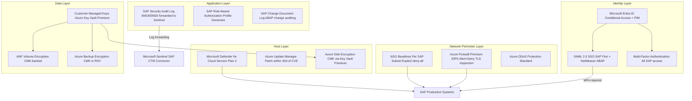
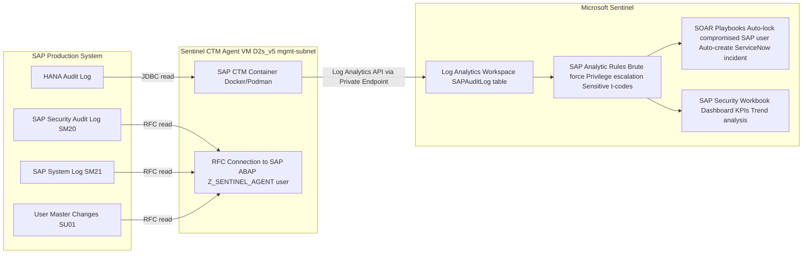

# SAP on Azure Security Architecture

---

## Overview

This chapter defines the security architecture for SAP workloads deployed on Microsoft Azure. The scope covers identity and access management (IAM) using Microsoft Entra ID with Privileged Identity Management (PIM) and Conditional Access; SAP Fiori single sign-on (SSO) via SAML 2.0; Azure Firewall Premium with IDPS (Intrusion Detection and Prevention System) in alert-and-deny mode; network security group (NSG) baselines; Microsoft Defender for Cloud with Servers Plan 2; Microsoft Sentinel with the SAP Continuous Threat Monitoring connector; Azure Key Vault Premium for secrets and Customer Managed Keys (CMK); disk encryption; and audit logging.

The SAP security architecture follows the Zero Trust model: no traffic is implicitly trusted based on network location, all identities are verified before resource access, and least-privilege access is enforced at every layer. SAP systems contain sensitive financial, HR, and operational data subject to PCI-DSS, SOC 2, ISO 27001, and GDPR compliance requirements. Each security control documented here maps to one or more compliance requirements.

Key architecture decisions: Microsoft Entra ID as the single identity provider for SAP Fiori and SAP ABAP SAML SSO; Azure Firewall Premium IDPS in alert-and-deny mode for all SAP network perimeters; Microsoft Sentinel with the SAP Continuous Threat Monitoring connector for SAP-aware SIEM; CMK via Azure Key Vault Premium for all data-at-rest encryption; PIM for all privileged Azure infrastructure roles; and no permanent Contributor or Owner role assignments on SAP production subscriptions.

---

## Architecture Overview

The SAP security architecture implements defense in depth across five layers:

1. **Identity layer**: Microsoft Entra ID with PIM, Conditional Access, and SAML 2.0 SSO for SAP Fiori.
2. **Network perimeter layer**: Azure Firewall Premium IDPS, NSG baselines per SAP subnet, Azure DDoS Protection Standard.
3. **Host layer**: Microsoft Defender for Cloud Servers Plan 2, Azure Update Manager, Azure Disk Encryption with CMK.
4. **Application layer**: SAP authorization concepts (roles, profiles), SAP Security Audit Log (SM19/SM20), SAP Change Document Log.
5. **Data layer**: CMK encryption for ANF volumes and managed disks, Azure Backup encryption, Key Vault Premium for secret management.

### Architecture Diagram: Zero Trust Security Layers



---

## SAP Architecture

### SAP Identity and Access Management

**SAP Fiori SSO with Microsoft Entra ID (SAML 2.0):**

SAP NetWeaver ABAP is configured as a SAML 2.0 Service Provider (SP) with Microsoft Entra ID as the Identity Provider (IdP). The SAML trust relationship is established by:

1. Downloading the SAP ABAP SAML SP metadata from SAML2 transaction in SAP GUI.
2. Uploading the SP metadata to Microsoft Entra ID Enterprise Application (SAP NetWeaver) configuration.
3. Downloading the Entra ID IdP metadata (SAML signing certificate + SSO endpoint URL) and uploading to SAML2 transaction in SAP ABAP.
4. Configuring the SAML Name ID format as `<user>@<domain>` (email) or `<sAMAccountName>` to map to SAP user principal.

SAP user mapping from Entra ID to SAP ABAP user accounts:

| Entra ID attribute | SAP ABAP user field | Mapping rule |
|---|---|---|
| userPrincipalName (UPN) | BNAME (SAP username) | Strip @domain suffix; uppercase; match to SAP user ID |
| objectId | SAML Name ID | Direct mapping when using persistent NameID format |
| mail | SAP SAML2 user mapping via email | Used when SAP users are identified by email in SU01 |

**Conditional Access Policy for SAP Fiori Production:**

```json
{
  "displayName": "CA-SAP-Fiori-Prod-MFA-Required",
  "conditions": {
    "applications": {
      "includeApplications": ["<SAP-Fiori-EntraID-AppId>"]
    },
    "users": {
      "includeGroups": ["SAP-Fiori-Users-All"],
      "excludeGroups": ["SAP-Break-Glass-Accounts"]
    },
    "clientAppTypes": ["browser", "mobileAppsAndDesktopClients"]
  },
  "grantControls": {
    "operator": "AND",
    "builtInControls": ["mfa", "compliantDevice"]
  },
  "sessionControls": {
    "signInFrequency": {
      "value": 8,
      "type": "hours",
      "isEnabled": true
    }
  }
}
```

The `compliantDevice` requirement enforces that SAP Fiori access from mobile devices requires an Intune-compliant device (screen lock, encryption, OS version current). Browser-based SAP Fiori access from managed corporate devices does not require compliantDevice (covered by Entra ID Hybrid Azure AD Join).

**PIM for Azure Infrastructure Roles:**

No permanent Contributor or Owner role assignments exist on the SAP production subscription. All privileged roles are activated through PIM:

| Role | PIM Activation Duration | Approver | Justification Trigger |
|---|---|---|---|
| SAP-Infra-Contributor (custom) | 4 hours maximum | SAP Infrastructure Lead | ServiceNow change ticket number |
| Key Vault Administrator | 2 hours maximum | SAP Security Lead | Incident ticket number |
| Network Contributor (SAP spokes) | 4 hours maximum | SAP Network team lead | Change ticket number |
| Virtual Machine Contributor (HANA subnet) | 8 hours maximum | SAP HANA DBA Lead | Planned maintenance ticket |
| Reader (all SAP subscriptions) | Permanent | N/A | No justification required |

PIM activation alerts are sent to the SAP Security team distribution list for all Contributor-level and above activations, regardless of approval outcome.

### SAP Security Audit Log (SM19/SM20) Integration with Microsoft Sentinel

The SAP Continuous Threat Monitoring (CTM) connector for Microsoft Sentinel forwards SAP Security Audit Log events (SM20) to the Sentinel Log Analytics workspace. The connector is deployed as a containerized agent (Docker or Podman) on a dedicated agent VM in the SAP management subnet.

SAP audit events forwarded to Sentinel:

| Event Class | SAP Event ID | Description | Sentinel Severity |
|---|---|---|---|
| Dialog logon | AUW | Successful dialog logon to SAP system | Informational |
| Failed logon | AUA | Failed logon attempt | Medium (5+ failures: High) |
| RFC/CPIC logon | AUJ | RFC destination logon | Informational |
| Authorization failure | AUB | Authorization check failure | Medium |
| Transaction start | AUE | Transaction start with sensitive t-code | Medium (for SE16, SU01, SE37, SA38) |
| Report execution | AUF | Background report execution | Informational |
| User master change | AUG | SAP user master record change (SU01) | High |
| Role/Profile assignment | AUH | Authorization role/profile assignment | High |
| System parameter change | AUI | SAP profile parameter change (RZ10) | High |
| Debugging breakpoint | AUK | ABAP debugger with breakpoint in production | Critical |
| Download to frontend | AUL | Data download to frontend desktop | Medium |

Sentinel Analytic Rule for SAP brute force detection:
```kusto
SAPAuditLog
| where EventType == "AUA"
| where MessageId in ("AU4", "AU5", "AU6", "AU7")
| summarize FailedAttempts = count(), Users = make_set(User) by IPAddress, bin(TimeGenerated, 10m)
| where FailedAttempts > 10
| extend SeverityLevel = "High"
| project TimeGenerated, IPAddress, FailedAttempts, Users, SeverityLevel
```

### SAP Notes Reference Table

| SAP Note | Title | Architecture Impact | Where Applied |
|---|---|---|---|
| 1656250 | SAP on Azure: Security Recommendations | General SAP security hardening on Azure; recommended OS security settings; SAP-specific firewall rules | SAP VM OS hardening; NSG baseline; Azure Firewall rules |
| 2369415 | SAP on Azure: Security Best Practices | Azure-specific SAP security controls; Defender for Cloud recommendations; Key Vault integration | Defender for Cloud configuration; Key Vault for SAP secrets |
| 2773983 | Microsoft Sentinel: SAP Continuous Threat Monitoring Connector | SAP CTM connector architecture; SM19 audit log configuration; required SAP authorizations for CTM agent | Sentinel SAP CTM connector configuration |
| 1689246 | SAP Security Audit Log: Configuration Guide | SM19 audit log profile configuration; minimum event classes to capture; log archiving requirements | SAP SM19 configuration for Sentinel forwarding |
| 2209195 | SAP on Azure: TLS Configuration for ICM | TLS 1.2 minimum enforcement on SAP Internet Communication Manager; cipher suite selection | SAP ICM TLS profile parameter configuration |
| 2510660 | Disabling SAP Default Users: Best Practices | Locking SAP default users (DDIC, SAP*, TMSADM, EarlyWatch); password policy for locked users | SAP user management hardening |
| 1860711 | SAP HANA: Security Configuration Guide | HANA SSL configuration; HANA user authentication settings; HANA audit log configuration | SAP HANA security baseline configuration |
| 2372069 | SAP HANA: Secure Network Communication | HANA SSL/TLS configuration for client connections; certificate management; prohibited cipher suites | HANA SSL configuration in indexserver.ini |
| 2830222 | SAP Fiori: Security Hardening Guide | Fiori security hardening; WAF rules for Fiori OData APIs; Content Security Policy headers | Application Gateway WAF custom rules for Fiori |
| 2927905 | Microsoft Entra ID SSO for SAP S/4HANA | Entra ID SAML 2.0 configuration with SAP S/4HANA; user mapping; Conditional Access integration | SAP SAML2 transaction configuration; Entra ID SSO setup |

---

## Azure Architecture

### Microsoft Defender for Cloud

Microsoft Defender for Cloud is enabled at the SAP management group scope with the following plans:

**Defender for Servers Plan 2** on all SAP production VMs:
- **Microsoft Defender for Endpoint (MDE)** integration: MDE is automatically provisioned on all Windows and Linux SAP VMs. MDE provides real-time antimalware, behavioral detection, and EDR capabilities. On SAP HANA VMs, MDE is configured to exclude HANA data and log volume paths (/hana/data, /hana/log) from real-time scan to prevent scan-induced I/O latency on HANA storage operations.
- **Agentless disk scanning**: Defender for Cloud scans VM OS disks for malware and vulnerabilities without installing an agent. Scans are performed on disk snapshots, not on the running VM, to avoid I/O impact.
- **File Integrity Monitoring (FIM)**: Monitors changes to critical SAP OS files (/usr/sap/SID/*, /sapmnt/SID/profile/*, /etc/hosts, sudoers) and alerts when unauthorized changes are detected.
- **Adaptive network hardening**: Analyzes NSG rules and actual traffic patterns, recommending tighter NSG rules based on observed traffic. Recommendations reviewed monthly by the SAP Network team.
- **Just-in-Time (JIT) VM access**: SSH port (22) is blocked on all SAP VM NSGs by default. Basis and DBA team members request JIT access via Defender for Cloud, which opens TCP 22 from their specific IP for a maximum of 3 hours, then closes it automatically.

**Defender for Storage** on all Azure Storage accounts used for SAP:
- Detects malware in HANA backup files uploaded to Azure Blob Storage.
- Alerts on anomalous access patterns: downloads of large SAP backup archives from unexpected IP addresses.
- Detects mass data export from SAP-related storage accounts.

**Defender for Key Vault** on all SAP Key Vault instances:
- Detects unusual access patterns: access from unexpected IP addresses, access by non-SAP service principals.
- Alerts on Key Vault soft delete disable attempts and purge protection disable attempts.
- Detects credential stuffing attacks against Key Vault access policies.

### Azure Key Vault Premium Configuration

Azure Key Vault Premium (HSM-backed) is deployed per SAP environment (production and non-production use separate instances) in the SAP production subscription, accessed via Private Endpoint from the SAP spoke.

**Key Vault Secrets stored:**

| Secret Name | Purpose | Rotation Frequency | Rotated By |
|---|---|---|---|
| hana-system-password | SAP HANA SYSTEM user password | 90 days | Azure Function triggered by Key Vault rotation event |
| hana-backup-enckey | HANA backup encryption key (backint) | Annual | Manual; requires HANA backup re-encryption |
| sap-abap-adm-password | SAP &lt;SID&gt;adm OS user password | 90 days | Azure Function + SAP HANA sidecar for validation |
| sap-rfc-password-SID | SAP RFC destination password for SID-to-SID RFC calls | 90 days | Azure Function + SAP RFC destination update via SM59 |
| appgw-tls-cert-fiori | SAP Fiori TLS certificate (PFX) | Auto-renewed via DigiCert integration | Key Vault certificate auto-renewal policy |
| cmk-disk-key | Customer Managed Key for Premium SSD v2 Disk Encryption Set | Annual key rotation; old key version retained | Manual with 48-hour transition window |
| cmk-anf-key | Customer Managed Key for ANF volume encryption | Annual key rotation | Manual with ANF re-encryption |

**Key Vault Access Control (Azure RBAC):**

| Role | Principal | Scope | Permissions |
|---|---|---|---|
| Key Vault Secrets User | HANA VM system-assigned managed identity | Key Vault secrets for HANA credentials | Get, List secrets |
| Key Vault Secrets User | Azure Backup managed identity | Key Vault backup encryption key | Get secret |
| Key Vault Certificate User | Application Gateway user-assigned managed identity | Fiori TLS certificate | Get, List certificates |
| Key Vault Crypto User | Disk Encryption Set system-assigned managed identity | CMK disk key | WrapKey, UnwrapKey |
| Key Vault Crypto User | ANF account managed identity | CMK ANF key | WrapKey, UnwrapKey |
| Key Vault Administrator | SAP Security team PIM group | Full Key Vault | All operations (PIM-activated, maximum 2 hours) |

No Key Vault access policies are used; Azure RBAC is the sole authorization mechanism on all SAP Key Vault instances.

**Key Vault configuration requirements:**
```bash
az keyvault update \
  --name kv-sap-prod \
  --enable-soft-delete true \
  --soft-delete-retention-days 90 \
  --enable-purge-protection true \
  --public-network-access Disabled \
  --default-action Deny
```

### Azure Firewall Premium IDPS

Azure Firewall Premium IDPS is configured in **Alert and Deny** mode (not Alert only). The IDPS signature set is updated automatically by Microsoft. Custom IDPS rules are added for SAP-specific attack signatures:

**IDPS policy configuration:**
```bicep
resource firewallPolicy 'Microsoft.Network/firewallPolicies@2023-06-01' = {
  properties: {
    sku: { tier: 'Premium' }
    intrusionDetection: {
      mode: 'Deny'
      configuration: {
        signatureOverrides: [
          { id: '2024897', mode: 'Deny' }  // SAP ICM directory traversal
          { id: '2024898', mode: 'Deny' }  // SAP Message Server exploit
        ]
        bypassTrafficSettings: [
          {
            name: 'bypass-hana-replication'
            protocol: 'TCP'
            sourceAddresses: ['10.10.3.0/27']
            destinationAddresses: ['10.10.3.0/27']
            destinationPorts: ['40000-40099']
            description: 'HANA HSR traffic exempt from IDPS (intra-subnet)'
          }
        ]
      }
    }
    transportSecurity: {
      certificateAuthority: {
        keyVaultSecretId: tlsInspectionCertSecretId
        name: 'sap-tls-inspection-ca'
      }
    }
  }
}
```

**TLS inspection:** Azure Firewall Premium TLS inspection is enabled for outbound HTTPS traffic from SAP VMs to the internet (SAP support portal, OS update repositories). TLS inspection requires a CA certificate to be installed in the Azure Firewall policy and in the SAP VM OS trust stores. TLS inspection does not apply to intra-VNet traffic (HANA to application server connections use the internal ANF NFS path, not HTTPS).

**Exclusion from TLS inspection:** SAP BTP Cloud Connector outbound HTTPS is excluded from TLS inspection (Azure Firewall IDPS bypass rule for destination *.hana.ondemand.com) because Cloud Connector uses certificate pinning that breaks when an inspection certificate is inserted.

### Network Security and DDoS

**Azure DDoS Protection Standard** is enabled on the SAP production VNet (not just the hub VNet). This protects the SAP spoke VNet from volumetric DDoS attacks targeting the Azure Application Gateway WAF v2 public IP (if Application Gateway is internet-facing for external SAP Fiori users). Standard tier provides adaptive real-time protection, metric alerting, and DDoS rapid response support from Microsoft.

**NSG Flow Logs and Traffic Analytics** are enabled on all SAP subnet NSGs:
- Flow logs sent to Azure Storage Account (LRS, cool tier; lifecycle policy moves to archive after 90 days).
- Traffic Analytics enabled with 10-minute aggregation interval, sent to the Log Analytics workspace.
- Traffic Analytics is used to identify unexpected communication patterns: HANA VM initiating connections to the internet, AAS VMs communicating directly with each other bypassing the message server, or unexpected inbound connections from on-premises to HANA VMs.

### Microsoft Sentinel SAP CTM Connector

The SAP Continuous Threat Monitoring connector for Microsoft Sentinel provides SAP-aware threat detection that the generic Sentinel analytics rules cannot provide without SAP context. The connector:

1. Reads SAP Security Audit Log (SM20) via an RFC-based connection from the agent to the SAP system.
2. Reads SAP system log (SM21), change document log (SCU3), user lock log, and SAP HANA audit log.
3. Sends all events to the Sentinel Log Analytics workspace via the Log Analytics Data Collector API.
4. Provides built-in Sentinel Analytic Rules for SAP threats: brute force against SAP GUI logon, SAP privilege escalation (SU01 changes), sensitive transaction execution (SE16, SE37, SA38 in production), SAP transport import from non-standard routes, and SAP user lockout bypass.

The CTM agent runs on a dedicated VM (D2s_v5) in the SAP management subnet. The agent authenticates to the SAP system using a dedicated SAP RFC user (Z_SENTINEL_AGENT) with minimum required authorizations:

```
Authorization Object: S_RFC
  ACTVT: 16 (Execute)
  RFC_TYPE: FUNC
  RFC_NAME: /SDF/SMON_API*, SYSMON*, RSAU_READ*

Authorization Object: S_TABU_DIS
  ACTVT: 03 (Display)
  DICBERCLS: SS (System tables for audit log)
```

### Architecture Diagram: Microsoft Sentinel SAP Integration



---

## Design Decisions

| Decision | Options Considered | Choice | Rationale | Reference |
|---|---|---|---|---|
| SAP Fiori identity provider | (1) SAP Identity Authentication Service (IAS) standalone; (2) Microsoft Entra ID standalone; (3) Entra ID as corporate IdP with IAS as proxy | Microsoft Entra ID as primary IdP with Conditional Access; SAP IAS used only for SAP-to-SAP SSO where Entra ID cannot be directly configured | Entra ID provides organization-wide Conditional Access policies (MFA, compliant device, named location), PIM integration, and unified identity governance. SAP IAS adds complexity without additional value when Entra ID already meets all SAP SSO requirements. | SAP Note 2927905; Entra ID SAP integration documentation |
| Azure Firewall IDPS mode | (1) Off (monitoring only via NSG logs); (2) Alert mode (log only, no block); (3) Alert and Deny mode | Alert and Deny mode | PCI-DSS requirement 6.4 and ISO 27001 A.13.1.2 require active network intrusion prevention for systems handling cardholder data or sensitive financial data. Alert-only mode detects attacks but does not prevent them; Deny mode blocks known exploitation attempts in real time. | Azure Firewall Premium documentation; PCI-DSS v4.0 requirement 6.4 |
| SAP Security Audit Log SIEM integration | (1) Custom log shipping via syslog to Splunk/QRadar; (2) Microsoft Sentinel with SAP CTM connector; (3) SAP Enterprise Threat Detection (ETD) | Microsoft Sentinel with SAP CTM connector | SAP CTM connector provides pre-built SAP-aware Analytic Rules, Workbooks, and SOAR Playbooks that would require months of custom development in alternative SIEMs. Sentinel integrates natively with Entra ID and Defender for Cloud for correlated SAP + cloud infrastructure alerts. SAP ETD is an on-premises solution with separate infrastructure and licensing costs. | SAP Note 2773983; Microsoft Sentinel SAP CTM documentation |
| Key Vault access model | (1) Key Vault access policies; (2) Azure RBAC | Azure RBAC only; no access policies | Azure RBAC provides fine-grained role assignments with PIM support and Azure Monitor audit logs. Access policies are flat (Principal can either access a Key Vault entirely or not at all for a given operation type), limiting least-privilege implementation. Azure RBAC allows scoping access to specific secrets, certificates, or keys. | Azure Key Vault RBAC documentation; Azure security baseline for Key Vault |
| Disk encryption approach | (1) Platform Managed Keys (PMK); (2) Azure Disk Encryption (ADE with BitLocker/dm-crypt); (3) Server-side encryption with Customer Managed Keys (CMK) | CMK via Disk Encryption Set for managed disks | CMK satisfies key ownership requirements for ISO 27001 and PCI-DSS. ADE (BitLocker/dm-crypt) adds OS-level encryption on top of Azure's native server-side encryption, creating double encryption (useful only in highly regulated environments); it also requires the OS to decrypt before HANA can read from disk, adding CPU overhead. CMK server-side encryption (transparent to the guest OS) provides compliance without performance impact. | PCI-DSS v4.0 requirement 3.5; ISO 27001 A.10 |
| MDE exclusion for HANA storage paths | (1) No exclusions (full scan); (2) Exclude /hana/data and /hana/log from real-time scan; (3) Disable MDE on HANA VMs | Exclude HANA data and log volume paths from real-time scan; retain all other MDE capabilities | Real-time filesystem scan of HANA data volume (2 TiB, high I/O) would add 5-15% I/O latency overhead, pushing HANA storage latency above the 1 ms p99 KPI from SAP Note 1943937. Excluding these paths removes the scan overhead while retaining MDE protection for OS, SAP kernel binaries, and SAP instance directories. | SAP Note 1943937 (storage latency KPI); Microsoft Defender for Cloud documentation on antimalware exclusions |
| SAP Basis team privileged access | (1) Permanent Contributor role on SAP production subscription; (2) PIM-activated time-bounded Contributor; (3) Azure Lighthouse with delegated access | PIM-activated time-bounded Contributor role (maximum 8 hours) with approval workflow | Permanent Contributor role on production subscription violates least-privilege principle and creates persistent attack surface if a SAP Basis engineer's Entra ID account is compromised. PIM activation requires MFA, business justification (ServiceNow ticket), and manager approval, creating an auditable approval trail for every privileged action. | Azure PIM documentation; CIS Azure Benchmark 1.23 |
| HANA SSL/TLS for client connections | (1) SAP HANA without SSL (TCP plaintext); (2) HANA SSL with self-signed certificates; (3) HANA SSL with certificates from organizational PKI or Azure Key Vault | HANA SSL with certificates from Azure Key Vault-integrated CA | Plaintext HANA client connections expose HANA credentials and query data on the network. Self-signed certificates require manual certificate trust distribution and are not revocable. Certificates from a managed CA (Key Vault integrated) provide automated renewal, revocation support, and centralized certificate lifecycle management. | SAP Note 2372069; SAP Note 1860711 |

---

## Azure Well-Architected Alignment

| Pillar | Requirement | Implementation | Reference |
|---|---|---|---|
| Security | All SAP access must require MFA | Conditional Access policy CA-SAP-Fiori-Prod-MFA-Required applied to all SAP Fiori Entra ID Enterprise Applications; SAP GUI access requires MFA via Named Location policy for SAP RFC remote function calls | Azure Conditional Access documentation |
| Security | No permanent privileged role assignments on SAP production | PIM activated roles only; reader role is the maximum permanent assignment; all Contributor+ role activations logged and alertable | Azure PIM documentation; CIS Azure Benchmark |
| Security | All SAP VM OS disks must be encrypted with CMK | Disk Encryption Set with CMK assigned to all SAP VM managed disks in production subscription; Azure Policy Deny-Disk-Without-CMK assigned at SAP management group scope | Azure Disk Encryption documentation |
| Security | SAP Security Audit Log must be forwarded to SIEM within 15 minutes of event | Sentinel SAP CTM connector pulls SM20 events every 5 minutes; events available in Sentinel within 5-10 minutes of SAP system generation; 30-day active retention + 1-year archive in Log Analytics | SAP Note 2773983; Sentinel data retention |
| Security | SAP HANA SSL must be enforced for all client connections | HANA global.ini [communication] sslMinProtocol = TLSv1.2; sslCipherSuites = ECDHE-RSA-AES256-GCM-SHA384; HANA user store (hdbuserstore) configured with SSL=TRUE on all application server connections | SAP Note 2372069 |
| Reliability | Security control failures must not impact SAP availability | Sentinel CTM agent failure does not impact SAP system operation (agent is read-only RFC); Azure Firewall failure uses Azure Firewall zone-redundant deployment (3 instances across zones) | Azure Firewall zone redundancy documentation |
| Operational Excellence | Security incidents must be detected and responded to within defined SLAs | Sentinel Analytic Rule alerts trigger SOAR playbooks; Critical alerts (brute force, ABAP debugger in production) auto-create P1 incidents in ServiceNow within 5 minutes; Sev 1 security incidents have 1-hour response SLA | Microsoft Sentinel SOAR documentation |
| Cost Optimization | Security tooling cost must be justified against risk reduction | Defender for Cloud Servers Plan 2 cost (~$15/VM/month) is justified by agentless scanning, MDE integration, and JIT VM access, which collectively replace 2-3 separate security tools; Sentinel ingestion cost optimized by filtering high-volume SAP syslog events before ingestion | Azure Defender for Cloud pricing |

---

## RPO/RTO Table (Security-Specific)

| Security Scenario | Detection Time | Response Time | Recovery Method |
|---|---|---|---|
| SAP user credential compromise (brute force) | 5-10 minutes (Sentinel rule fires after 10 failed logons in 10 minutes) | 15 minutes (SOAR playbook auto-locks SAP user + Entra ID account) | Lock user via SU01; reset Entra ID password; investigate source IP via NSG flow logs |
| SAP ABAP debugger active in production | 1-5 minutes (SM20 event AUK forwarded to Sentinel; Critical alert) | 30 minutes (manual investigation; session termination via SM04) | SAP Basis kills ABAP work process; Sentinel incident documents timeline |
| Azure Firewall IDPS block (SAP exploit attempt) | Immediate (Azure Firewall blocks and logs) | 15 minutes (Sev 2 alert to SAP Security team) | No SAP recovery required (attack blocked); Firewall log analyzed for source IP; IP blocked in Azure DDoS/NSG |
| CMK key deletion (accidental) | Immediate (Key Vault Defender alert) | 5 minutes (soft delete protection + purge protection prevents immediate deletion; 90-day recovery window) | Recover deleted key via Key Vault undelete; no SAP downtime if recovery within soft delete period |
| SAP production user privilege escalation (SU01 unauthorized role assignment) | 5-10 minutes (Sentinel rule fires on SM20 AUH event) | 30 minutes (SOAR creates incident; SAP Security reviews and revokes role assignment) | Revert unauthorized role assignment via SU01; document in security incident; review audit trail in SCU3 |
| Mass download from SAP system (data exfiltration attempt) | 5-10 minutes (Sentinel rule fires on SM20 AUL events > threshold) | 30 minutes (Sev 1 alert; SAP user session terminated via SM04; ABAP connection blocked at NSG) | Terminate SAP user session; review downloaded data via SM20 download audit log entries; report to DPO if personal data involved |

---

## Cost Optimization

| Optimization | Potential Saving | Implementation | Prerequisites |
|---|---|---|---|
| Sentinel data ingestion tiering | 30-50% Sentinel ingestion cost reduction; SAP syslog events (high volume, low security value) moved to Basic Logs tier (~$0.50/GB vs. $2.76/GB for Analytics logs) | Route SAP OS syslog (/var/log/messages) to Log Analytics Basic Logs tier; keep SM20 audit events in Analytics Logs tier for Sentinel Analytic Rule processing | Log Analytics workspace Basic Logs tier configuration; KQL queries updated to include Basic Logs tables |
| Defender for Cloud commitment tier | 20% Defender for Servers cost reduction; at 50+ VMs, commitment tier pricing applies | Enable Defender for Servers Plan 2 at the management group scope rather than per-subscription; qualify for commitment tier pricing when 50+ SAP VMs are enrolled simultaneously | Minimum 50 enrolled VMs; management group-level Defender plan |
| PIM activation audit log archival | ~$30/month saving by archiving Entra ID PIM audit logs to Azure Storage after 90 days | Configure Entra ID diagnostic settings to forward PIM audit logs to Log Analytics with 90-day retention; export to Azure Storage (cool tier) for long-term archive via diagnostic setting | Log Analytics diagnostic setting for Entra ID; Azure Storage lifecycle policy |
| JIT VM access replaces VPN for emergency access | ~$200/month saving by eliminating dedicated emergency access VPN concentrator | Defender for Cloud JIT VM access opens SAP VM SSH port on demand from authorized IPs; eliminates need for dedicated emergency VPN endpoint | Defender for Cloud Servers Plan 2 (JIT requires Plan 2); SAP VM NSG must have JIT-compatible configuration |
| Sentinel SOAR auto-remediation reduces incident response labor | 2-4 hours saved per security incident; at $150/hour analyst cost and 5 incidents/month: $1,500-3,000/month labor saving | Deploy SOAR playbooks for auto-lock of compromised SAP users, auto-create ServiceNow incident, auto-notify SAP Security team; automates first 30 minutes of incident response | Sentinel SOAR Logic App playbooks deployed; ServiceNow integration configured |
| ANF encryption with CMK from existing Key Vault | Zero incremental cost (CMK is already in Key Vault for disk encryption; reusing same Key Vault for ANF adds no cost) | Configure ANF account to use existing Key Vault CMK for volume encryption; same CMK can be used for both disk encryption sets and ANF if key policy permits | Azure Key Vault with existing CMK; ANF account CMK configuration |

---

## Monitoring and Alerts

| Alert Name | Metric/Signal | Threshold | Severity | Action Group |
|---|---|---|---|---|
| SAP-BruteForce-Logon | Sentinel: SM20 AU4/AU5/AU6/AU7 from same IP | Above 10 failed logons in 10 minutes | Critical | sap-security-oncall + SOAR auto-lock |
| SAP-Privileged-User-Change | Sentinel: SM20 AUH event (role/profile assignment) | Any production role assignment outside maintenance window | High | sap-security-ops |
| SAP-ABAP-Debugger-Production | Sentinel: SM20 AUK event (debugger with breakpoint) | Any ABAP debugger event in production system | Critical | sap-security-oncall + SAP-basis-oncall |
| SAP-SensitiveTransaction | Sentinel: SM20 AUE (SE16/SA38/SE37/STMS in production) | Any execution outside approved change window | High | sap-security-ops |
| Firewall-IDPS-Block | Azure Firewall IDPS log: Action = Deny | Any IDPS deny event in 5-minute window | High | sap-security-ops |
| Firewall-IDPS-HighVolume | Azure Firewall IDPS log: Alert or Deny events | Above 50 events in 15 minutes | Critical | sap-security-oncall |
| KeyVault-CMK-AccessDenied | Key Vault diagnostic: Access denied to CMK key | Any access denied event | Critical | sap-security-oncall |
| KeyVault-SoftDelete-Disabled | Azure Activity Log: Disable soft delete operation on Key Vault | Any soft delete disable event | Critical | sap-security-oncall |
| PIM-Activation-Contributor | Entra ID Audit Log: PIM role activation for SAP subscription | Any Contributor+ activation | Informational | sap-security-ops (informational email) |
| Defender-Critical-Finding | Defender for Cloud: Critical security alert on SAP VM | Any Critical severity Defender alert | High | sap-security-ops |
| SAP-MassDownload | Sentinel: SM20 AUL events by single user | Above 100 download events in 1 hour by same user | High | sap-security-ops |
| HANA-SSL-Certificate-Expiry | Azure Monitor: Key Vault certificate expiry | Certificate expiry within 30 days | Medium | sap-security-ops |
| NSG-SAP-Rule-Change | Azure Activity Log: NSG rule create/update/delete in SAP subnets | Any NSG rule change in SAP production subscription | Medium | sap-security-ops |
| Entra-ID-SAP-UserDisabled | Entra ID Audit Log: SAP Fiori app user disabled or MFA reset | Any SAP Fiori group member account disabled or MFA method deleted | High | sap-security-ops |

---

## Anti-Patterns

### Anti-Pattern 1: Permanent Contributor Role Assignments on SAP Production Subscription

Granting permanent Contributor or Owner roles to SAP Basis engineers on the SAP production subscription creates a persistent attack surface. If an engineer's Entra ID account is compromised via phishing, credential stuffing, or session hijacking, the attacker gains immediate Contributor-level access to all SAP production VMs, storage, and network resources without any additional authentication challenge. Permanent Contributor assignments also violate CIS Azure Benchmark control 1.23 and ISO 27001 A.9.2.3.

**Correct approach:** Remove all permanent Contributor and Owner role assignments from the SAP production subscription. Assign only Reader role permanently. Use PIM to provide time-bounded Contributor access with MFA, approval workflow, and business justification requirement. Maximum activation duration for SAP production infrastructure changes should be 8 hours with automatic expiry.

### Anti-Pattern 2: Configuring Azure Firewall IDPS in Alert Mode Only

Azure Firewall Premium IDPS in Alert mode logs detected attacks but does not block them. This is appropriate for initial deployment to verify IDPS signatures do not produce false positives. However, leaving IDPS in Alert mode permanently means that known SAP exploitation patterns (ICM directory traversal, Message Server CVE-based exploits) are detected, logged, and allowed to continue. PCI-DSS requirement 6.4 and SAP-specific security guidance require active prevention (Deny mode) for systems processing financial data.

**Correct approach:** Operate Azure Firewall Premium IDPS in Alert and Deny mode for all production SAP environments. During initial deployment, run IDPS in Alert mode for 4-6 weeks to identify false positives specific to the SAP traffic patterns. After tuning (adding bypass rules for identified false positives such as HANA HSR traffic or SAP Cloud Connector), switch to Deny mode via a planned change.

### Anti-Pattern 3: Not Configuring MDE Exclusions for HANA Storage Paths

Deploying Microsoft Defender for Endpoint on SAP HANA VMs without excluding the HANA data and log volume paths from real-time scan causes MDE to scan every file written to /hana/data and /hana/log in real-time. HANA writes 100s of MB/s to the log volume continuously; MDE scan overhead on each write increases log write latency from sub-0.5 ms (ANF Ultra baseline) to 2-5 ms per write, exceeding the SAP Note 1943937 storage KPI of below 1 ms p99 for log volume latency. This manifests as HANA short dumps (transaction timeout) and SAP ABAP update task failures.

**Correct approach:** Configure MDE exclusions for HANA storage paths in the Microsoft Defender for Endpoint policy: exclude /hana/data, /hana/log, and /hana/backup from real-time protection. These exclusions must be managed via Intune policy (not manual on each VM) to prevent accidental removal during MDE updates. Retain MDE protection for /usr/sap, /sapmnt, and OS directories where malware is more likely to reside.

### Anti-Pattern 4: Using Key Vault Access Policies Instead of Azure RBAC

Key Vault access policies are the legacy authorization model for Azure Key Vault. Access policies grant permissions at the Key Vault level, not at the individual secret, key, or certificate level. This means a service principal with the `get` permission on Key Vault secrets can access all secrets in that Key Vault, violating least-privilege. Access policies also do not integrate with Azure Monitor for unified audit logging, and PIM cannot be used to time-bound Key Vault access policy assignments.

**Correct approach:** Delete all Key Vault access policies and use Azure RBAC exclusively. Assign Key Vault roles (Key Vault Secrets User, Key Vault Certificate User, Key Vault Crypto User) at the individual secret/certificate/key scope where possible, or at the Key Vault scope for service principals that require broad access. Use PIM for the Key Vault Administrator role to ensure all administrative access is time-bounded and audited.

### Anti-Pattern 5: Storing SAP HANA Credentials in Azure DevOps Pipeline Variables

SAP Basis teams frequently store HANA SYSTEM password, SAP RFC passwords, and SAP &lt;SID&gt;adm OS user password as Azure DevOps pipeline secret variables to automate HANA operations (backup scripts, monitoring queries, SAP landscape management). Azure DevOps pipeline variables, even marked as secret, are not stored in HSM-backed storage and are accessible to any pipeline with access to the variable group. If the Azure DevOps organization is compromised, all stored SAP credentials are exposed.

**Correct approach:** Store all SAP credentials in Azure Key Vault. Azure DevOps pipelines retrieve secrets at runtime via the Azure Key Vault task or Azure CLI with managed identity authentication. The pipeline service principal is granted only the Key Vault Secrets User role on the specific secrets it requires. Secrets are never written to pipeline logs (use the isSecret output variable parameter). Rotate Key Vault secrets on a 90-day schedule using Key Vault rotation policies.

### Anti-Pattern 6: Disabling SAP Security Audit Log (SM19) to Reduce System Load

Some SAP Basis teams disable or restrict the SAP Security Audit Log (SM19 audit profile) on development or quality systems under the rationale that audit logging adds system load (0.5-2% additional CPU for dialog work processes). However, many security incidents involving SAP systems are discovered only after analyzing audit log history. If SM19 is not configured or is too restrictive, there is no forensic record of unauthorized transactions, privilege escalations, or data downloads that may have occurred weeks before the incident is discovered.

**Correct approach:** Configure SM19 audit profiles on all SAP systems (not just production) to capture at minimum: all failed logon attempts (AUA), all successful logon/logoff events for privileged users (SAP_ALL, basis admins), all SU01 user master changes (AUG), all role/profile assignments (AUH), all executions of sensitive transactions (SE16, SE37, SA38, STMS, RZ10), and all ABAP debugger activations (AUK). The 0.5-2% CPU overhead is acceptable for the forensic capability it provides. Configure SM19 log archiving to Azure Blob Storage for 2-year retention per compliance requirements.

### Anti-Pattern 7: SAP Cloud Connector VM Without Hardening

SAP Cloud Connector installed on an unmanaged Azure VM in the management subnet with default OS settings creates a persistent outbound HTTPS tunnel from the Azure SAP environment to SAP BTP. If the Cloud Connector VM is compromised, the attacker can use the established BTP tunnel to exfiltrate SAP data or inject malicious integration flows. Common hardening gaps include: Cloud Connector VM accessible via SSH from any IP in the management subnet; Cloud Connector administrator portal (port 8443) accessible from any IP; OS not patched; no MDE installed.

**Correct approach:** Harden the Cloud Connector VM per SAP Cloud Connector administration guide: restrict SSH access via JIT VM access (Defender for Cloud); restrict Cloud Connector admin portal (8443) access to SAP admin workstation IPs only via NSG; install MDE with appropriate exclusions; enable OS auto-patching via Azure Update Manager; configure Cloud Connector certificate for mTLS (mutual TLS) authentication with SAP BTP to prevent cloud connector impersonation.

---

## Troubleshooting

### Issue 1: SAP Fiori SSO Fails with SAML Authentication Error After Entra ID Conditional Access Policy Added

**Symptom:** After adding the Conditional Access policy CA-SAP-Fiori-Prod-MFA-Required, SAP Fiori users receive SAML authentication failure error when accessing SAP Fiori from corporate laptops. Browser developer tools show the Entra ID SAML response is being rejected by SAP ABAP with error: SAML2: Authentication failed.

**Root cause:** The Conditional Access policy grant control `compliantDevice` is blocking authentication for SAP Fiori users on corporate laptops that are Azure AD joined but not Intune-enrolled. The SAML response from Entra ID includes the device compliance claim, and SAP ABAP SAML2 configuration is rejecting sessions where the compliantDevice claim is present but false.

**Resolution:** Separate the Conditional Access policy into two policies: (1) CA-SAP-Fiori-MFA-All: require MFA for all users accessing SAP Fiori application (no device compliance requirement); (2) CA-SAP-Fiori-CompliantDevice-Unmanaged: require compliant device only for access from devices not Azure AD hybrid-joined. Exclude devices where the deviceTrustType is ServerAD (Hybrid Azure AD joined) from the compliantDevice requirement. Monitor Entra ID sign-in logs (Azure Monitor → Entra ID → Sign-ins) filtered for the SAP Fiori application to verify both policies apply correctly.

### Issue 2: Microsoft Sentinel SAP CTM Connector Stops Receiving Events

**Symptom:** SAP security events stop appearing in the Sentinel SAPAuditLog table. The Sentinel CTM agent VM shows as running, but the last event in Log Analytics was 4 hours ago. The SAP SM20 audit log on the SAP system shows new events being generated.

**Root cause:** The SAP RFC user (Z_SENTINEL_AGENT) password expired after 90 days. The SAP default password policy for service users requires 90-day password rotation unless the user type is set to System (which disables password expiry for RFC users). The CTM agent HANA connection string uses the expired password and silently fails to authenticate.

**Resolution:** Reset the Z_SENTINEL_AGENT SAP user password in SU01 (set new password and click Save). Update the password in the CTM agent configuration file (/opt/sapcon/SID/systemconfig.ini, field password). Restart the CTM container: docker restart sapcon-SID. Verify events resume in Log Analytics within 5-10 minutes. To prevent recurrence: set the Z_SENTINEL_AGENT user type to System in SU01 (disables password expiry) and add the user to the SAP_System_Users user group; alternatively, store the password in Azure Key Vault and configure the CTM agent to retrieve it on startup.

### Issue 3: Azure Firewall IDPS Blocking Legitimate SAP RFC Traffic

**Symptom:** SAP RFC calls from an external partner system to the SAP production ABAP system are being blocked by Azure Firewall IDPS. Azure Firewall logs show IDPS rule 2024127 (SQL injection pattern) blocking traffic on TCP port 3300. The partner system's RFC function module parameter contains SQL-like strings that trigger the IDPS signature.

**Root cause:** The Azure Firewall IDPS signature 2024127 matches on SQL injection patterns in TCP payload. SAP RFC traffic on port 3300 carries ABAP table select query strings in the RFC parameter payload. When a partner system's RFC call includes a WHERE clause string as an RFC parameter value, the IDPS signature incorrectly identifies it as a SQL injection attempt.

**Resolution:** Add an IDPS bypass rule for the specific source and destination IP pair: in the Azure Firewall policy, add a bypass entry for the partner system's IP range (source) to the SAP ABAP VM private IP (destination) on port 3300-3399 for the specific IDPS signature 2024127. This narrow bypass preserves IDPS protection for all other traffic while allowing the legitimate RFC traffic. Alternatively, configure the RFC connection to use TLS encryption (SAP SNC/TLS on RFC) which would encrypt the payload and prevent IDPS from inspecting it. Reference: Azure Firewall IDPS bypass configuration.

### Issue 4: CMK Key Rotation Causes SAP HANA Disk Inaccessible

**Symptom:** After rotating the Customer Managed Key in Azure Key Vault (creating a new key version), all Premium SSD v2 disks on the SAP HANA VMs become read-only and HANA reports I/O errors within 10 minutes. The Disk Encryption Set shows the old key version is being used, but the new version is marked as current.

**Root cause:** The Disk Encryption Set (DES) has auto-key-rotation enabled, but the Key Vault access policy (or RBAC role) for the DES managed identity was granted on the previous key version URL rather than the Key Vault key identifier (which covers all versions). When the new key version was created, the DES managed identity attempted to use the new version for wrapping/unwrapping but received a Key Vault access denied error.

**Resolution:** Verify that the DES system-assigned managed identity has the Key Vault Crypto User role scoped to the Key Vault (not to a specific key version). Check RBAC: az role assignment list --scope /subscriptions/<sub>/resourceGroups/<rg>/providers/Microsoft.KeyVault/vaults/kv-sap-prod. If the role is scoped to a specific key ID (not the Key Vault), re-assign the role to the Key Vault scope. After fixing RBAC, update the DES to explicitly reference the new key version: az disk-encryption-set update --key-url <new-key-version-url>. SAP HANA disks will resume normal I/O within 5 minutes of the DES update propagating. Reference: Azure CMK rotation documentation.

### Issue 5: JIT VM Access Not Working for SAP Basis SSH Access to HANA VMs

**Symptom:** SAP Basis engineer requests JIT VM access to the HANA primary VM from Defender for Cloud. The JIT access request is approved, but the engineer still cannot SSH to the HANA VM. The NSG on the HANA subnet shows the JIT-added rule for TCP 22, but the connection times out.

**Root cause:** The Azure NSG for the HANA subnet (nsg-sap-hana-prod) has a Deny-All-Inbound rule at priority 4000. The JIT VM access mechanism creates a temporary NSG allow rule for TCP 22 from the engineer's source IP. However, the JIT rule is created at a specific priority (typically 100-1000 range). If there is another deny rule at a priority lower than 4000 but higher than the JIT rule priority that blocks SSH, the JIT rule is bypassed. In this case, a custom rule "Block-SSH-from-All" at priority 200 was added, and the JIT rule was created at priority 1000 (lower priority = evaluated later), so the deny rule at 200 takes precedence.

**Resolution:** Remove the custom "Block-SSH-from-All" rule at priority 200 from the HANA subnet NSG. The default Deny-All-Inbound at priority 4000 is sufficient; JIT creates temporary allow rules at priorities above 4000 minus the number of JIT requests, typically in the 100-1000 range. The JIT rules should be at a priority that overrides the default deny but not any custom explicit deny rules. After removing the conflicting rule, test JIT access and verify that the engineer can SSH to the HANA VM within the approved time window.

### Issue 6: Sentinel Analytic Rule Generates False Positive Alerts for SAP Batch Jobs

**Symptom:** The SAP-SensitiveTransaction Sentinel Analytic Rule generates High severity alerts every 5 minutes for SE38 (ABAP program execution) transaction activity from the background work process user ALEREMOTE during overnight SAP IDoc/ALE background processing. The SAP Security team is alert-fatigued by 200+ false positive High alerts per day.

**Root cause:** The SAP CTM Sentinel Analytic Rule for sensitive transaction execution was configured to alert on any execution of SE38, SA38, and SE16 in the SAP production system without filtering for background RFC users (RFC users that run automated batch processes). ALEREMOTE is an RFC user that legitimately executes ABAP programs via SE38 as part of SAP ALE background processing.

**Resolution:** Modify the Sentinel KQL Analytic Rule to exclude known SAP service users (ALEREMOTE, BWREMOTE, TMSADM, CSMREG) from the sensitive transaction alert: add a where clause `| where User !in~ ("ALEREMOTE", "BWREMOTE", "TMSADM", "CSMREG")`. Additionally, add a time-of-day filter to only alert on SE38/SA38 executions during business hours (08:00-20:00 UTC) for interactive dialog logon type, excluding background (type A) logon type from the alert. After tuning, review the alert count over 48 hours to confirm false positive rate drops below 5 per day. Reference: Sentinel SAP CTM built-in rule customization documentation.

---

## Landing Zone Mapping

| Resource | Subscription | Management Group | Justification |
|---|---|---|---|
| Azure Key Vault Premium (SAP production secrets + CMK) | SAP Production Subscription | Landing Zones > SAP | Key Vault in same subscription as SAP VMs minimizes cross-subscription latency for secret retrieval; Defender for Key Vault alerts go to SAP production subscription |
| Microsoft Sentinel (SAP CTM connector, Analytic Rules) | Security/Management Subscription | Platform > Management | Sentinel is a shared security service; SAP CTM connector forwards to a shared Sentinel workspace used by all workloads, enabling cross-workload correlation (SAP + Azure infrastructure + Entra ID) |
| Microsoft Defender for Cloud (all plans) | SAP Management Group scope | Landing Zones > SAP (inherited from MG) | Defender plans enabled at management group scope ensure no SAP subscription opts out of security coverage |
| Disk Encryption Sets | SAP Production Subscription | Landing Zones > SAP | DES must be co-located with managed disks; different subscription requires cross-subscription DES references which are not supported |

### Management Group Policy Assignments (SAP Management Group Scope)

| Policy | Effect | Purpose |
|---|---|---|
| Deny-Disk-Without-CMK | Deny (custom) | Prevents SAP managed disks from being created without a CMK-backed Disk Encryption Set |
| Require-Defender-Servers-Plan2 | DeployIfNotExists | Ensures Defender for Servers Plan 2 is enabled on all SAP subscriptions |
| Deny-Public-IP-on-NIC | Deny | Prevents public IP on SAP VM NICs; forces access via Azure Bastion |
| Require-JIT-VM-Access | AuditIfNotExists | Audits that JIT VM access is configured on all SAP VMs with network access |
| Deny-KeyVault-PublicAccess | Deny | Prevents Key Vault from enabling public network access |
| Require-KeyVault-SoftDelete | Deny | Prevents Key Vault creation without soft delete and purge protection |
| Deploy-SecurityCenter-DiagnosticSettings | DeployIfNotExists | Ensures Defender for Cloud security alerts forwarded to Sentinel workspace |
| Audit-PIM-NoPermStandalonePrivileged | AuditIfNotExists | Audits that Contributor+ roles are managed via PIM (not permanent assignments) |

---

## Microsoft References

- [Microsoft Entra ID SSO for SAP NetWeaver](https://learn.microsoft.com/en-us/azure/active-directory/saas-apps/sap-netweaver-tutorial)
- [Microsoft Sentinel: SAP Continuous Threat Monitoring connector](https://learn.microsoft.com/en-us/azure/sentinel/sap/deployment-overview)
- [Azure Firewall Premium IDPS](https://learn.microsoft.com/en-us/azure/firewall/premium-features#idps)
- [Microsoft Defender for Cloud: Servers Plan 2](https://learn.microsoft.com/en-us/azure/defender-for-cloud/plan-defender-for-servers-select-plan)
- [Azure Key Vault RBAC guide](https://learn.microsoft.com/en-us/azure/key-vault/general/rbac-guide)
- [Customer-managed keys for Azure Disk Encryption](https://learn.microsoft.com/en-us/azure/virtual-machines/disk-encryption)
- [Azure Privileged Identity Management overview](https://learn.microsoft.com/en-us/azure/active-directory/privileged-identity-management/pim-configure)
- [SAP on Azure security best practices](https://learn.microsoft.com/en-us/azure/sap/workloads/security-baseline)
- [Azure Conditional Access for SAP applications](https://learn.microsoft.com/en-us/azure/active-directory/conditional-access/concept-conditional-access-cloud-apps)
