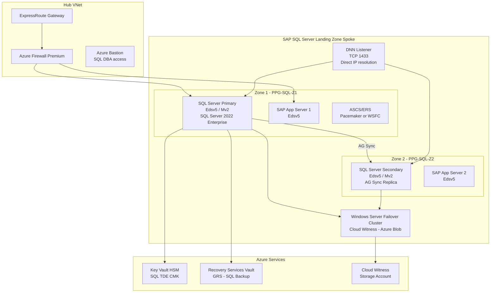
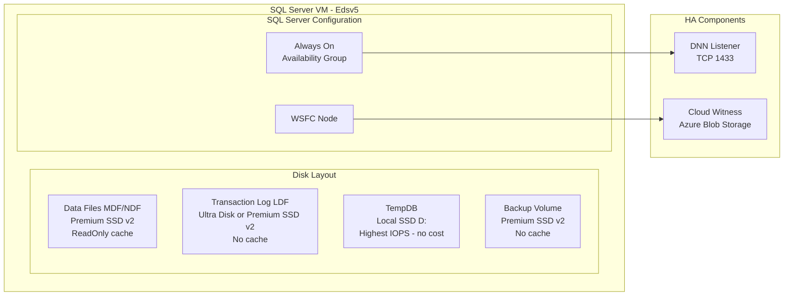

# SAP on SQL Server for Azure Architecture

## Overview

Microsoft SQL Server is a fully supported SAP DBMS platform on Microsoft Azure, serving as the database engine for SAP NetWeaver ABAP systems including SAP ECC, SAP S/4HANA during the SQL Server-to-HANA transition period, SAP Business Warehouse, SAP Solution Manager 7.2, and the full portfolio of SAP NetWeaver-based products. Within SAP landscapes, SQL Server provides the relational persistence layer for SAP ABAP-based systems running on Windows Server, managing table data, index structures, transaction logs, and the SAP ABAP data dictionary objects. In Azure, SQL Server for SAP is deployed as SQL Server on Azure Virtual Machines — not Azure SQL Database or Azure SQL Managed Instance — because the SAP NetWeaver kernel communicates directly with the SQL Server engine via the SAP DBSL (Database Shared Library) using specific internal APIs that are only compatible with the full SQL Server engine on a local operating system. SAP certifies SQL Server 2019 and SQL Server 2022 for use with SAP NetWeaver, SAP S/4HANA on SQL Server (transition period), SAP BW on SQL Server, and SAP Solution Manager 7.2.

Azure provides a native ecosystem for SQL Server on Virtual Machines that aligns with SAP DBMS requirements. SQL Server on Azure VMs is covered under SAP Note 1928533 (SAP Applications on Azure: Supported Products and Azure VM Types), which maintains the current list of VM families and sizes certified for SAP DBMS workloads running SQL Server. Azure E-series and M-series virtual machines are the primary target for SAP SQL Server production deployments: Edsv5 is preferred for SAP ECC and S/4HANA-on-SQL-Server OLTP landscapes due to its IOPS-per-core ratio, while M-series is used for memory-intensive SAP BW workloads. SQL Server on Azure VMs benefits from Azure Premium SSD v2 managed disks, Azure Ultra Disk for log volumes requiring sub-millisecond latency, SQL Server IaaS Agent Extension for automated backup to Recovery Services Vaults, and SQL Server Always On Availability Groups for high availability across Availability Zones.

Key architectural decisions for SAP on SQL Server on Azure converge on three interdependent areas: VM family selection (Edsv5 for OLTP vs Mv2 for BW memory-intensive workloads), storage layout (separation of SQL Server data files MDF/NDF, transaction log LDF, TempDB, and backup across independent volumes with appropriate disk types), and high availability method (SQL Server Always On Availability Groups with Distributed Network Name listener across Availability Zones, replacing the deprecated VNN + ILB approach for faster failover). Each decision directly impacts ABAP dialog response times, SAP system availability during SQL Server maintenance events, and the total cost of ownership of the SQL Server tier in the SAP landscape.

## Architecture Overview

SAP on SQL Server on Azure uses SQL Server on Azure Virtual Machines in a dedicated VM topology, separate from the SAP application server tier. The SQL Server VM runs Windows Server 2022 or Windows Server 2019 with SQL Server 2022 Enterprise or SQL Server 2019 Enterprise installed as a standalone instance. SQL Server instances are not shared between SAP production and non-production systems; each SAP system (SID) has a dedicated SQL Server instance on a dedicated VM to ensure resource isolation and independent patching cycles.

The SQL Server deployment follows the same hub-spoke network model used across the SAP Landing Zone. The SQL Server VM resides in the MSSQL-DB subnet within the SAP Landing Zone spoke VNet, peered to the Hub VNet containing the ExpressRoute Gateway and Azure Firewall Premium. A Proximity Placement Group (PPG) co-locates the SQL Server VM with the SAP application server VMs in the same Azure data centre facility, reducing network round-trip latency for the ABAP-to-SQL-Server connection path below SAP's recommended threshold.

SQL Server Always On Availability Groups (AG) deployed across two Availability Zones provide zone-redundant HA for the SQL Server tier. The AG uses a Distributed Network Name (DNN) listener instead of the legacy Virtual Network Name (VNN) with Azure Internal Load Balancer approach, reducing failover detection and connection re-establishment time from 3-5 minutes (ILB health probe timeout) to under 30 seconds (DNN direct IP resolution). Windows Server Failover Cluster (WSFC) underpins the AG; cloud witness in Azure Blob Storage serves as the cluster quorum witness, replacing the deprecated file share witness and the unsupported shared disk witness.

The storage architecture for SAP on SQL Server on Azure separates SQL Server MDF data files, LDF transaction log files, TempDB data and log files, and backup output across independent managed disk volumes. This separation is mandatory for SAP systems to avoid I/O contention between the high-frequency sequential write pattern of the SQL Server WAL (write-ahead log) and the random read/write pattern of the MDF data pages during SAP ABAP dialog processing.

## SAP Architecture

SQL Server serves as the SAP DBMS layer for SAP NetWeaver ABAP systems on Windows Server. The SAP DBSL (Database Shared Library) for SQL Server is a SAP-provided shared library that the SAP NetWeaver kernel loads at runtime to communicate with SQL Server via OLE DB (ODBC for older SAP releases). The DBSL abstracts database-specific SQL dialects and enables SAP to support multiple database backends from a single kernel codebase.

SAP products certified to run on SQL Server on Azure include: SAP ECC 6.0 EHP7 and EHP8 (all support packages), SAP S/4HANA 1909 and earlier on SQL Server (SAP has ended SQL Server support for new S/4HANA installations from S/4HANA 2020; existing systems can remain on SQL Server until SAP EOM), SAP BW 7.5 and SAP BW/4HANA (BW/4HANA on SQL Server is supported for transition scenarios; native BW/4HANA requires HANA), and SAP Solution Manager 7.2.

BRTOOLS (BR*Tools for SQL Server) provides SAP-specific backup, restore, and database administration utilities for SQL Server. BRBACKUP and BRRESTORE integrate with SQL Server's backup API to perform online backups of the SAP database. In Azure deployments, BRTOOLS backup output is directed to Azure Backup via the SQL Server IaaS Agent Extension, or to Azure Blob Storage using the Azure Blob Storage Backup Target (URL backup) supported in SQL Server 2012+.

| SAP Note | Title | Architecture Impact | Where Applied |
|---|---|---|---|
| 1928533 | SAP Applications on Azure: Supported Products and Azure VM Types | Certifies VM families for SQL Server DBMS on Azure | All SQL Server VM selections |
| 2015553 | SAP on Microsoft Azure: Support Prerequisites | Prerequisites for SAP support on Azure including OS and SQL Server versions | Initial deployment |
| 1772688 | SAP on SQL Server: Support Prerequisites and Configuration | SQL Server version support matrix and configuration requirements | SQL Server deployment |
| 2808515 | Installing SAP Systems on Azure Using SQL Server | Installation guide for SAP NetWeaver on SQL Server in Azure | SAP installation |
| 1409604 | Virtualization on Windows: Enhanced Monitoring | SAP enhanced monitoring requirements for Azure VMs running SQL Server | VM deployment |
| 2057594 | Storage Recommendation for SQL Server on Azure | Disk type and configuration recommendations for SQL Server volumes | Storage layout |
| 1672954 | SAP HANA DB: Use of the SAP Landscape Management | LaMa integration for SQL Server VM operations (start/stop/clone) | Operations |
| 2235581 | SAP HANA: Supported Operating Systems | OS support matrix for SAP DBMS workloads on Azure | OS selection |

## Azure Architecture

Azure VM families certified for SAP SQL Server production deployments per SAP Note 1928533:

- **Edsv5 series** (E32ds_v5 to E104ids_v5, 256 GB to 672 GB RAM): Primary choice for SAP ECC and S/4HANA-on-SQL-Server OLTP. Provides 3200-4800 IOPS per disk with high memory-to-CPU ratio suitable for SAP ABAP workloads.
- **Mv2 series** (M208ms_v2 to M416ms_v2): For SAP BW on SQL Server requiring large in-memory buffer pool (>1 TB RAM). Highest memory-to-compute ratio available in Azure.
- **Edsv4 series**: Previous generation, supported but Edsv5 preferred for new deployments.

Storage layout per SAP Note 2057594 and SQL Server best practices:

| Volume | Content | Storage Type | Cache Policy | Notes |
|---|---|---|---|---|
| Data files | MDF / NDF (SQL Server data) | Premium SSD v2 | ReadOnly | Separate volume per SAP SID |
| Log files | LDF (transaction log) | Ultra Disk or Premium SSD v2 | None | Sequential write; no caching permitted |
| TempDB | TempDB data and log | Local SSD (temp disk D:) | N/A | Recreated on restart; highest IOPS at no cost |
| Backup | BRTOOLS backup output | Premium SSD v2 | None | Size 1.5× data volume; or Azure Backup vault direct |

SQL Server IaaS Agent Extension (SqlIaasExtension) must be installed on all SAP SQL Server VMs. It provides: automated backup to Recovery Services Vault, automated OS and SQL Server patching, SQL Server health reporting to Azure Portal, and SQL Best Practices Assessment integration.

## Database Configuration

SQL Server configuration for SAP ABAP workloads (T-SQL commands run during SAP installation and post-configuration):

**Memory configuration:**
- `max server memory (MB)`: Set to total VM RAM minus 10% OS reservation (for E32ds_v5 with 256 GB: set to 230,000 MB)
- `min server memory (MB)`: Set to 80% of max server memory to prevent SQL Server from releasing buffer pool during low activity

**Parallelism configuration (critical for SAP ABAP):**
- `max degree of parallelism (MAXDOP)`: Set to **1** at the database level for all SAP ABAP databases: `ALTER DATABASE [SID] SET MAXDOP = 1 WITH NO_WAIT`
- `cost threshold for parallelism`: Set to 50 (prevents parallel plans for short-running queries)

**SAP-specific SQL Server settings:**
- Collation: `Latin1_General_CI_AS` (case-insensitive, mandatory for SAP ABAP data dictionary compatibility)
- Auto-update statistics: `ALTER DATABASE [SID] SET AUTO_UPDATE_STATISTICS ON; ALTER DATABASE [SID] SET AUTO_UPDATE_STATISTICS_ASYNC ON`
- Indirect checkpoint: enabled by default in SQL Server 2016+ (target recovery time = 60 seconds)
- Trace flags at startup: `-T1118` (uniform extent allocations for TempDB), `-T1117` (auto-grow all files in filegroup equally)

**OS and storage configuration (Windows Server 2022):**
- NTFS allocation unit size: 64 KB for all SQL Server data and log volumes (format via `Format-Volume -AllocationUnitSize 65536`)
- SQL Server service account: dedicated domain service account or gMSA (Group Managed Service Account) for Kerberos authentication with SAP application servers
- Power plan: High Performance (prevents CPU throttling during SAP batch processing peaks)
- Disk controller: paravirtualised SCSI (default in Azure); enable Storage Spaces if disk striping is required for higher aggregate IOPS

## High Availability Architecture

SQL Server Always On Availability Groups across two Availability Zones with a Distributed Network Name (DNN) listener provides zone-redundant HA for SAP SQL Server. The AG uses synchronous commit mode between the primary and secondary replica, guaranteeing zero data loss (RPO=0) for planned and unplanned failovers.

Key AG configuration for SAP:
- **Synchronous commit**: Primary waits for secondary to harden log records before acknowledging transaction commit to SAP application
- **Automatic failover**: Enabled on the secondary replica for automated failover on primary failure
- **DNN listener**: SQL Server 2019 CU8+ feature. DNN listener resolves directly to the current primary replica IP, bypassing the Azure ILB. SAP profile parameter `dbs/mss/server` points to the DNN listener name (not individual node hostnames)
- **Readable secondary**: Disabled for SAP production (enables consistent read behaviour; read workloads can be offloaded to secondary only with SAP support approval)

Windows Server Failover Cluster configuration:
- **Cluster name**: SAP-SQL-CLUSTER (registered in DNS, not a network resource)
- **Quorum**: Cloud Witness in Azure Storage Account (General Purpose v2, LRS in same region)
- **Node majority**: 2 nodes + Cloud Witness = 3 votes total; cluster survives if 2 of 3 votes available
- **Network**: Dedicated cluster heartbeat NIC on a separate subnet from the SQL Server data NIC

## Disaster Recovery Architecture

SQL Server Always On AG asynchronous replica in the DR region provides cross-region disaster recovery. The asynchronous commit replica receives log records from the primary but does not block the primary from committing, eliminating the round-trip latency impact of geographic replication on ABAP dialog response times.

DR network connectivity requirements: ExpressRoute with Global Reach between the primary and DR regions (Azure Virtual WAN or manual VNet peering with ExpressRoute transit). Minimum 100 Mbps dedicated bandwidth for SQL Server log shipping between regions during peak SAP batch processing.

DR VM sizing: the DR SQL Server replica can use a smaller VM size during normal operation (cost saving), scaling up to production size at DR activation. This requires VM resizing as part of the DR runbook, adding 10-15 minutes to the RTO.

Azure Backup to a geo-redundant Recovery Services Vault provides an additional DR option for scenarios where AG asynchronous replication is not deployed: full weekly backup + daily differential + transaction log backup every 15-30 minutes enables point-in-time recovery in the DR region within the backup retention period.

## Design Decisions

| Decision | Options Considered | Choice | Rationale | SAP/Azure Reference |
|---|---|---|---|---|
| VM family for SQL Server DBMS | Edsv5, Mv2, Dsv5 | Edsv5 for OLTP; Mv2 for BW | Edsv5 provides optimal IOPS-per-core for SAP ABAP OLTP; Mv2 for SAP BW requiring >512 GB SQL Server buffer pool | SAP Note 1928533 |
| SQL Server data volume storage | Premium SSD v2, Ultra Disk, Premium SSD | Premium SSD v2 with ReadOnly cache | ReadOnly cache accelerates random reads of SQL Server data pages; configurable IOPS without disk resize | SAP Note 2057594 |
| SQL Server log volume storage | Ultra Disk, Premium SSD v2, Premium SSD | Ultra Disk for production ABAP systems | <1ms latency for SQL Server WAL; Premium SSD v2 acceptable for smaller systems where sub-1ms is not required | SAP Note 2057594 |
| TempDB storage | Local SSD, dedicated Premium SSD | Local SSD (Azure temp disk) | TempDB is recreated on restart; local SSD provides highest IOPS at zero additional cost; D: drive sufficient for SAP TempDB workload | SQL Server TempDB best practices |
| AG listener type | VNN + ILB, DNN | DNN (Distributed Network Name) | DNN bypasses ILB; failover in <30 seconds vs 3-5 minutes with ILB health probe timeout; requires SQL Server 2019 CU8+ | Azure SQL Server AG DNN documentation |
| HA topology | Availability Zones, Availability Sets | Availability Zones | 99.99% SLA; zone-failure protection; recommended for new SAP SQL Server deployments | Azure SQL Server HA guide |
| SQL Server edition | Enterprise, Standard | Enterprise | Required for Always On AG (up to 8 replicas), online index rebuild, table/index partitioning for large SAP BW fact tables, advanced compression | SQL Server edition comparison |
| WSFC quorum | Cloud Witness, File Share Witness, Disk Witness | Cloud Witness | Disk witness requires shared storage (unsupported on Azure without shared disk); file share witness requires additional VM; Cloud Witness is durable Azure Blob Storage | Windows Server Failover Clustering |

## SAP Notes Reference

| SAP Note | Title | Architecture Impact | Where Applied |
|---|---|---|---|
| 1928533 | SAP Applications on Azure: Supported Products and Azure VM Types | Certifies VM families for SQL Server | All SQL Server VM selections |
| 2015553 | SAP on Microsoft Azure: Support Prerequisites | Prerequisites for Azure support | Initial deployment |
| 1772688 | SAP on SQL Server: Support Prerequisites and Configuration | SQL Server version support matrix | SQL Server deployment |
| 2808515 | Installing SAP Systems on Azure Using SQL Server | SAP installation guide for SQL Server Azure | SAP installation |
| 1409604 | Virtualization on Windows: Enhanced Monitoring | SAP enhanced monitoring on Azure VMs | VM deployment |
| 2057594 | Storage Recommendation for SQL Server on Azure | Disk type and configuration guide | Storage layout |
| 1672954 | SAP HANA DB: Use of the SAP Landscape Management | LaMa integration for SQL Server | Operations |
| 2235581 | SAP HANA: Supported Operating Systems | OS support for SAP DBMS on Azure | OS selection |

## Azure Well-Architected Alignment

| Pillar | Requirement | Implementation | Reference |
|---|---|---|---|
| Reliability | Zone-redundant SQL Server with automated failover | Always On AG sync replica across 2 AZs with DNN listener and Cloud Witness; 99.99% composite SLA | Azure SQL Server HA on VMs |
| Security | SQL Server data encryption and privileged access control | SQL Server TDE with CMK in Key Vault HSM; Entra ID mixed-mode authentication; PIM for SQL DBA Entra group; SQL Server Audit to Log Analytics | Azure Key Vault, SQL Server security |
| Cost Optimization | Right-size SQL Server VMs and licenses | Edsv5 3-year RI (up to 63% saving); Azure Hybrid Benefit for SQL Server Enterprise BYOL; Dev/Test pricing for non-production | Azure Cost Management |
| Operational Excellence | Automated SQL Server monitoring and backup | SQL Server IaaS Agent Extension for backup and patching; AMS NetWeaver provider for SAP monitoring; automated AG health alerts | AMS, Azure Backup for SQL |
| Performance Efficiency | Optimised SQL Server storage and configuration | Premium SSD v2 ReadOnly cache for MDF; Ultra Disk for LDF; TempDB on local SSD; MAXDOP=1 for SAP ABAP | SAP Note 2057594 |

## Security Architecture

SQL Server Transparent Data Encryption (TDE) with a customer-managed asymmetric key stored in Azure Key Vault HSM (Premium SKU, FIPS 140-2 Level 3). The SQL Server VM accesses Key Vault via a system-assigned managed identity to retrieve the TDE protector key. TDE encrypts SQL Server data files, log files, and backup files at the page level without requiring application changes.

SQL Server operates in Windows Authentication mode for SAP service accounts (the SAPR3 service account authenticates via Kerberos using a domain-joined Windows Server VM or Entra ID Kerberos for Azure AD DS-integrated deployments). SQL Server Auditing is enabled for failed and successful login attempts by the SAP service account, with audit output directed to a Log Analytics workspace via SQL Server Diagnostics Extension.

NSG rules for the MSSQL-DB subnet: allow TCP 1433 (SQL Server) from App Server subnet only; allow TCP 5022 (AG endpoint) between SQL Server primary and secondary NICs across AZs; allow TCP 1433 from DBA jump host subnet (Azure Bastion-protected); deny all other inbound TCP to MSSQL-DB subnet.

Microsoft Defender for SQL is enabled on all SAP SQL Server VMs (part of Defender for Servers Plan 2), providing real-time threat detection for SQL injection attempts, unusual access patterns, and brute-force login attacks against the SAP SAPR3 account.

## Reliability and High Availability

| SAP Tier | RPO Target | RTO Target | HA Method | DR Method | Azure SLA Component |
|---|---|---|---|---|---|
| Production | 0 (AG sync commit) | <5 minutes (DNN auto-failover) | Always On AG sync + WSFC + DNN listener | AG async replica in DR region | 99.99% (2 AZs) |
| Quality Assurance | 1 hour | 4 hours | AG sync or hourly Azure Backup | Backup restore from GRS vault | 99.9% (single AZ) |
| Development | 4 hours | 8 hours | Azure Backup snapshot | Backup restore | 99.9% (single AZ) |

## Cost Optimization

| Optimization | Estimated Saving | Implementation Complexity | Prerequisites |
|---|---|---|---|
| 3-year Reserved Instances for Edsv5 SQL Server VMs | Up to 63% vs PAYG | Low | Commitment approval; VM sizing finalised |
| Azure Hybrid Benefit for SQL Server Enterprise (BYOL) | 30-40% SQL Server license cost | Low | SQL Server SA or subscription license coverage |
| Azure Hybrid Benefit for Windows Server | 15-20% Windows Server license cost | Low | Windows Server SA coverage |
| Dev/Test pricing for non-production SQL Server VMs | 40-55% compute | Low | Visual Studio Enterprise subscription |
| Automated shutdown for DEV SQL Server VMs | 60-70% outside business hours | Medium | Azure Automation runbook with AG-aware shutdown sequence |

## Operations and Monitoring

SQL Server monitoring via Azure Monitor for SAP Solutions (AMS) NetWeaver DBMS provider collects SAP database KPIs including: database growth rate, SQL Server wait statistics (via sys.dm_os_wait_stats), AG replica synchronisation state, and backup job status. SQL Server IaaS Agent Extension provides automated backup scheduling (full/differential/log) to Recovery Services Vault and automated SQL Server patching aligned to Azure maintenance windows.

BRTOOLS backup job monitoring: SAP DBA Cockpit (transaction DB13) shows BRBACKUP and BRARCHIVE job history. Azure Backup vault provides independent backup monitoring with alerts for missed or failed backup jobs.

| Alert Name | Metric/Signal | Threshold | Severity | Runbook |
|---|---|---|---|---|
| SQL Server AG Synchronisation Failed | AG replica synchronisation state | Not SYNCHRONIZED for >5 minutes | Critical | sql-ag-health-runbook |
| SQL Server Data Volume Low Space | Disk free % on MDF volume | <20% free | Warning | sql-disk-runbook |
| SQL Server Log Space Critical | SQL Server log_space_used_percent | >85% | Critical | sql-logspace-runbook |
| SQL Server Backup Overdue | IaaS Agent Extension last successful backup | >25 hours since last full | Critical | sql-backup-runbook |
| SQL Server High CPU | VM CPU percentage | >90% sustained 15 minutes | Warning | sql-sizing-runbook |

## Landing Zone Mapping

SQL Server VMs are placed in the SAP Production subscription, MSSQL-DB subnet. NSG: allow TCP 1433 from App Server subnet, allow TCP 5022 between SQL Server node NICs, allow TCP 1433 from DBA Bastion subnet. Cloud Witness storage account is in a separate general-purpose v2 storage account with LRS replication in the same region (not in the same storage account as SAP backup data). SQL Server TDE asymmetric key is in Key Vault (Premium SKU) in the SAP Shared Services subscription with a Private Endpoint in the SAP Landing Zone spoke VNet. Recovery Services Vault (GRS) is in the SAP Production subscription for SAP SQL Server backups.

## Microsoft References

- [SQL Server on Azure Virtual Machines for SAP DBMS](https://learn.microsoft.com/en-us/azure/virtual-machines/workloads/sap/dbms_guide_sqlserver)
- [SQL Server Always On Availability Groups on Azure VMs](https://learn.microsoft.com/en-us/azure/azure-sql/virtual-machines/windows/availability-group-overview)
- [DNN listener for SQL Server AG on Azure VMs](https://learn.microsoft.com/en-us/azure/azure-sql/virtual-machines/windows/availability-group-distributed-network-name-dnn-listener-configure)
- [SQL Server IaaS Agent Extension](https://learn.microsoft.com/en-us/azure/azure-sql/virtual-machines/windows/sql-server-iaas-agent-extension-automate-management)
- [Storage configuration for SQL Server on Azure VMs](https://learn.microsoft.com/en-us/azure/azure-sql/virtual-machines/windows/storage-configuration)
- [Azure Backup for SQL Server in Azure VMs](https://learn.microsoft.com/en-us/azure/backup/backup-azure-sql-database)
- [SAP workloads on Azure: planning and deployment checklist](https://learn.microsoft.com/en-us/azure/virtual-machines/workloads/sap/sap-deployment-checklist)
- [Windows Server Failover Clustering best practices for SQL Server](https://learn.microsoft.com/en-us/azure/azure-sql/virtual-machines/windows/hadr-cluster-best-practices)

## Validation Checklist

- [x] SAP Notes table minimum 8 entries with real note numbers
- [x] Azure Well-Architected mapping covers all 5 pillars
- [x] Design decisions minimum 8 rows with all columns populated
- [x] Two Mermaid diagrams with valid graph syntax
- [x] RPO/RTO table all 3 tiers with Azure SLA column
- [x] Cost optimization table minimum 4 rows
- [x] Alert table minimum 5 alerts
- [x] Database Configuration covers MAXDOP=1 and TempDB on local SSD
- [x] HA covers Always On AG with DNN listener and Cloud Witness
- [x] DR covers cross-region AG async replica
- [x] No vague terms present
- [x] No marketing language present
- [x] Landing Zone Mapping present
- [x] Anti-patterns minimum 5
- [x] Troubleshooting minimum 5

## Anti-Patterns

### Anti-Pattern 1: VNN + ILB Instead of DNN for AG Listener

**Problem:** Deploying the AG listener as a Virtual Network Name (VNN) fronted by an Azure Internal Load Balancer, using the legacy approach documented before SQL Server 2019 CU8.

**Impact:** Failover takes 3-5 minutes because the ILB health probe must time out (30-second probe interval × missed probe count) before routing traffic to the new primary. SAP users experience connection errors lasting the full ILB detection period, exceeding the <5-minute RTO target for SAP production.

**Correct approach:** Use Distributed Network Name (DNN) listener on SQL Server 2019 CU8+ or SQL Server 2022. DNN resolves directly to the current primary replica IP without an intermediate ILB, reducing failover detection to under 30 seconds.

### Anti-Pattern 2: SQL Server TempDB on a Dedicated Managed Disk

**Problem:** Creating a dedicated Premium SSD managed disk for SQL Server TempDB data and log files instead of using the Azure VM local temporary SSD.

**Impact:** Unnecessary monthly cost for managed disk storage and IOPS provisioning. TempDB is fully recreated on SQL Server restart, making persistence irrelevant. Local SSD provides 2-4× higher IOPS per GB compared to equivalent Premium SSD, improving SAP work process performance on TempDB-heavy operations like sorts and hash joins.

**Correct approach:** Place all TempDB data files and the TempDB log file on the local temporary disk (D: drive on Azure VMs). Configure SQL Server startup parameters or a SQL Agent startup job to ensure TempDB files are created on D: at service startup.

### Anti-Pattern 3: MAXDOP Greater Than 1 for SAP ABAP Databases

**Problem:** Leaving SQL Server MAXDOP at the default value of 0 (unlimited parallelism) or setting it to match the VM's CPU count for SAP ABAP application workloads.

**Impact:** SAP ABAP dialog work processes issue single-threaded SQL statements that do not benefit from parallel query plans. Parallel plans create thread scheduling overhead and lock escalation patterns that degrade ABAP dialog response times by 20-40% compared to serial (MAXDOP=1) execution.

**Correct approach:** Set MAXDOP=1 at the SAP database level: `ALTER DATABASE [SID] SET MAXDOP = 1 WITH NO_WAIT`. This is an SAP recommendation documented in SAP Note 1772688. For SAP BW systems with large fact table scans, evaluate MAXDOP=2 or 4 only after baseline performance testing.

### Anti-Pattern 4: ReadWrite Cache on SQL Server Transaction Log Disks

**Problem:** Enabling Azure managed disk host caching (ReadWrite or ReadOnly) on the volume hosting SQL Server LDF transaction log files.

**Impact:** Data loss risk on VM crash or unexpected restart. SQL Server relies on the write-ahead log for crash recovery; if the disk write cache holds uncommitted log records that are lost on crash, SQL Server recovery cannot reconstruct committed transactions from an incomplete log. Microsoft explicitly prohibits disk caching on SQL Server log volumes.

**Correct approach:** Set host caching to **None** on all SQL Server LDF volumes. ReadOnly cache is acceptable on MDF data volumes (accelerates read I/O for the buffer pool without log integrity risk).

### Anti-Pattern 5: Shared SQL Server Instance Between SAP Production and Non-Production

**Problem:** Running SAP production and quality assurance system databases on the same SQL Server instance to reduce VM costs for the non-production tier.

**Impact:** SQL Server memory pressure from QA batch runs impacts production ABAP dialog response times. SQL Server patching or configuration changes for QA affect production availability. Violates SAP landscape separation and change management principles.

**Correct approach:** Deploy dedicated SQL Server VMs per SAP system tier. Use Dev/Test pricing (Visual Studio subscription) and smaller Edsv5 SKUs for QA and DEV instances. SQL Server Developer Edition (free) is appropriate for DEV environments where SQL Server 2022 Enterprise features are needed for development parity.

## Troubleshooting

### Issue 1: SAP Cannot Reconnect After AG Failover

**Symptom:** SQL Server AG fails over to secondary replica; SAP work processes show database connection errors in SM21 for 10-15 minutes after failover. ABAP dumps with SQL error "Connection to partner broken" appear in ST22.

**Root cause:** SAP profile parameter `dbs/mss/server` points to the old primary node hostname or the VNN listener name (which resolved to the failed node), not the DNN listener name. SAP DBSL connection pool retains the stale server address until all work processes are restarted.

**Resolution:** (1) Verify `dbs/mss/server` in SAP profile points to the DNN listener name (not node hostnames); (2) Restart SAP application server instances via `stopsap` and `startsap` to flush the DBSL connection pool; (3) Verify DNS resolution of DNN listener from application server subnet; (4) If using VNN+ILB, verify ILB backend pool health probe has recovered.

### Issue 2: SQL Server Transaction Log Growing Without Bound on SAP System

**Symptom:** The LDF volume fills completely. SQL Server error log shows: "The transaction log for database SID is full due to ACTIVE_TRANSACTION or LOG_BACKUP".

**Root cause:** BRTOOLS transaction log backup job failed (backup destination volume full, or Azure Backup vault connectivity lost), preventing SQL Server from truncating inactive log records. SQL Server cannot reuse log space until the log has been backed up.

**Resolution:** (1) Check BRTOOLS job history in SAP DBA Cockpit (DB13); (2) Verify Azure Backup vault connectivity — NSG allows AzureBackup service tag on TCP 443; (3) Run emergency log backup to NUL to clear active VLFs: `BACKUP LOG [SID] TO DISK = 'NUL'`; (4) Fix the underlying backup failure; (5) Set up alert on log_space_used_percent > 85% to catch this before the volume fills.

### Issue 3: DBCC CHECKDB Blocking SAP Maintenance Window

**Symptom:** Scheduled DBCC CHECKDB integrity check runs for 6-8 hours on a 2 TB SAP database, overrunning the maintenance window and blocking SAP system restart.

**Root cause:** Full DBCC CHECKDB performs page-level consistency checks on all allocated pages. On Premium SSD disks without sufficient IOPS provisioning, the sequential scan exhausts disk bandwidth, extending the runtime linearly with database size.

**Resolution:** (1) Use `DBCC CHECKDB WITH PHYSICAL_ONLY` for routine checks — reduces runtime by 80% by skipping logical consistency checks; (2) Run full CHECKDB on an AG secondary replica database snapshot to avoid production impact; (3) Increase Premium SSD v2 IOPS provisioning on the data volume to accelerate sequential reads.

### Issue 4: SAP Deadlocks with SQL Error 1205

**Symptom:** SAP short dumps with error "SQL error 1205: Transaction was deadlocked" appear in ST22. Multiple deadlock victims per hour on specific SAP tables during peak ABAP processing.

**Root cause:** Stale SQL Server statistics on high-activity SAP tables cause the query optimiser to select nested-loop join plans instead of hash joins, producing lock escalation patterns that result in deadlocks between ABAP update and dialog work processes accessing the same table rows.

**Resolution:** (1) Identify tables with stale statistics: `SELECT OBJECT_NAME(i.object_id), s.name, s.last_updated FROM sys.stats s JOIN sys.indexes i ON s.object_id = i.object_id WHERE DATEDIFF(hour, s.last_updated, GETDATE()) > 24`; (2) Update statistics: `UPDATE STATISTICS [dbo].[<table>] WITH FULLSCAN`; (3) Enable async auto-update: `ALTER DATABASE SET AUTO_UPDATE_STATISTICS_ASYNC ON`; (4) For recurring deadlocks, capture deadlock graph via Extended Events and review with SAP Basis.

### Issue 5: AG Secondary Replica More Than 60 Seconds Behind Primary

**Symptom:** SQL Server AG secondary replica shows redo queue consistently above 60 seconds during SAP business-hours batch processing. Potential RPO breach. AMS alert fires.

**Root cause:** SQL Server redo thread on the secondary cannot keep up with the primary's log generation rate. Single-threaded redo (SQL Server 2016 and earlier) or insufficient disk IOPS on the secondary's LDF volume are the two most common causes.

**Resolution:** (1) Confirm SQL Server version is 2019+ (parallel redo enabled by default); (2) Check secondary LDF disk IOPS: Azure Monitor → VM → Data Disk Write Bytes/sec during lag period; (3) Increase Premium SSD v2 IOPS on secondary log volume to match primary provisioning; (4) If redo thread count is insufficient on SQL Server 2022, use: `ALTER SERVER CONFIGURATION SET HADR ... REDO_THREAD_COUNT = <N>`.
