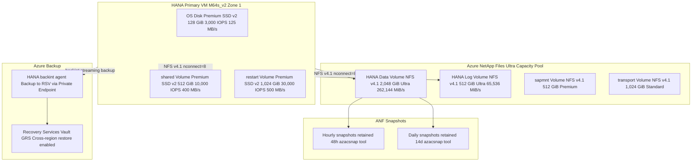
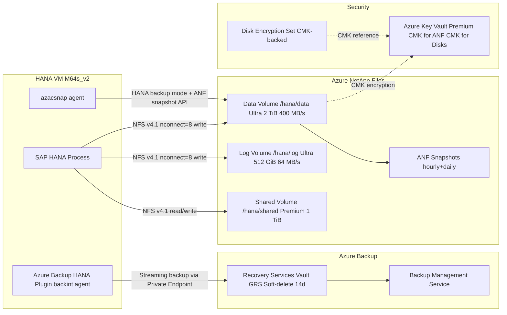

# SAP on Azure Storage Architecture

---

## Overview

This chapter defines the storage architecture for SAP workloads deployed on Microsoft Azure. The scope covers storage for SAP HANA data and log volumes, SAP application server OS disks and binary paths, the /sapmnt global file system, the SAP transport directory (/usr/sap/trans), SAP HANA backup and recovery, and Azure NetApp Files configuration for SAP-specific NFS v4.1 mounts. It addresses Premium SSD v2 configuration (independently configurable IOPS and throughput), Azure NetApp Files Ultra tier capacity pools, azacsnap (Azure Application-Consistent Snapshot Tool) for HANA snapshots, and Azure Backup with backint integration for HANA database backups.

Key architecture decisions: Azure NetApp Files Ultra tier with NFS v4.1 for SAP HANA data and log volumes (not managed disks); Premium SSD v2 for OS disks and HANA restart/shared volumes; Azure Backup with backint for HANA full and log backups; azacsnap for hourly storage snapshots for fast HANA point-in-time recovery; Customer Managed Keys (CMK) for all data-at-rest encryption; and no local SSD (ephemeral disk) for any SAP HANA persistent data.

---

## Architecture Overview

SAP HANA data and log volumes are hosted on Azure NetApp Files (ANF) Ultra tier capacity pools using NFS v4.1 with nconnect=8 mount option for parallel TCP connections. ANF Ultra tier delivers up to 128 MiB/s per TiB provisioned, which satisfies SAP HANA's maximum storage throughput requirement of 400 MB/s for data volumes and 250 MB/s for log volumes on a 2 TiB HANA memory footprint (see SAP Note 1943937 storage KPI table).

SAP application server OS disks use Premium SSD v2 with independently configured IOPS and throughput to match actual workload without overprovisioning to a larger disk size tier. The ASCS, ERS, and application server VMs all use Premium SSD v2 OS disks sized at 128 GiB with 3,000 IOPS and 125 MB/s throughput baseline, upgradeable without disk replacement.

### Architecture Diagram: SAP Storage Layout



---

## SAP Architecture

### SAP HANA Storage Requirements

SAP Note 1943937 (Hardware Configuration Check Tool) defines the minimum storage KPIs for SAP HANA. These are non-negotiable for production HANA certification:

| Volume | Mount Point | Minimum Read Throughput | Minimum Write Throughput | Minimum IOPS | Latency |
|---|---|---|---|---|---|
| HANA data volume | /hana/data | 400 MB/s | 250 MB/s | 7,000 (4 KiB random read) | Below 1 ms (p99) |
| HANA log volume | /hana/log | N/A | 250 MB/s sustained | 2,000 (write) | Below 1 ms (p99) |
| HANA shared | /hana/shared | 250 MB/s | N/A | 1,000 | Below 2 ms (p99) |
| HANA backup | /hana/backup | 100 MB/s | 100 MB/s | N/A | Not latency-sensitive |

The log volume latency requirement (below 1 ms p99) is the most critical: SAP HANA uses synchronous log writes (write-ahead log), and log write latency directly impacts HANA transaction commit latency. Azure NetApp Files Ultra tier delivers below 0.5 ms p99 for log writes in tested configurations, which provides margin below the 1 ms threshold.

### SAP HANA Volume Layout on Azure NetApp Files

Each SAP HANA SID gets dedicated ANF volumes (not shared volumes across SIDs) per SAP Note 3114876 recommendations:

| ANF Volume | Mount Point | Size | ANF Service Level | Throughput | HANA System |
|---|---|---|---|---|---|
| SID-data-mnt00001 | /hana/data/SID/mnt00001 | 2x HANA memory size | Ultra | 128 MiB/s per TiB | Primary + Secondary (separate volumes) |
| SID-log-mnt00001 | /hana/log/SID/mnt00001 | 0.5x HANA memory size | Ultra | 128 MiB/s per TiB | Primary + Secondary (separate volumes) |
| SID-shared | /hana/shared | 1x HANA memory size | Premium | 64 MiB/s per TiB | Shared between primary and secondary |
| sapmnt-SID | /sapmnt/SID | 512 GiB | Premium | 64 MiB/s per TiB | Shared between all app servers |
| trans | /usr/sap/trans | 1,024 GiB | Standard | 16 MiB/s per TiB | Shared between all SAP SIDs in landscape |

The data volume size = 2x HANA memory size ensures sufficient space for HANA delta store, column store compression overhead, HANA rowstore, and catalog files. The log volume size = 0.5x HANA memory size is the SAP recommendation based on typical HANA redo log write amplification ratios.

### NFS v4.1 Mount Options

All ANF volumes for SAP HANA are mounted with the following options per SAP Note 3114876 and Azure ANF documentation:

```
/etc/fstab entry format:
<anf-volume-ip>:/SID-data-mnt00001 /hana/data/SID/mnt00001 nfs4 \
  rw,hard,nointr,bg,timeo=600,retrans=2,proto=tcp, \
  nconnect=8,rsize=1048576,wsize=1048576,vers=4.1,minorversion=1 0 0
```

Key mount options:
- **nconnect=8**: Opens 8 parallel TCP connections to the ANF NFS endpoint, multiplying effective throughput from ~1,250 MB/s (single connection) to ~10,000 MB/s aggregate. Required for HANA data volumes to sustain the 400 MB/s read throughput requirement.
- **hard**: Mount retries indefinitely on NFS server unavailability. Required for HANA to prevent data corruption from partial write operations during ANF brief unavailability events.
- **rsize=1048576 wsize=1048576**: Maximum NFS read/write buffer size (1 MiB). ANF performs best with large I/O sizes; default 65536 (64 KiB) under-utilizes ANF throughput capability.
- **vers=4.1,minorversion=1**: NFS v4.1 with pNFS (parallel NFS) support. ANF requires NFS v4.1; NFS v3 is deprecated for new SAP HANA deployments on Azure.

### SAP Application Server Storage Layout

| Component | Disk Type | Size | IOPS | Throughput | Mount Point |
|---|---|---|---|---|---|
| OS disk (ASCS, ERS, PAS, AAS) | Premium SSD v2 | 128 GiB | 3,000 | 125 MB/s | / (root) |
| /usr/sap (SAP binaries, instance profiles) | NFS v4.1 from ANF | Shared SID-shared volume | — | — | /usr/sap/SID |
| /sapmnt (global SAP directory) | NFS v4.1 from ANF | sapmnt-SID volume | — | — | /sapmnt/SID |
| /usr/sap/trans (transport directory) | NFS v4.1 from ANF | trans volume | — | — | /usr/sap/trans |

SAP application server VMs do not have separate data disks beyond the OS disk. All SAP application data (profiles, work directory, log files) resides either on the OS disk or on ANF NFS mounts. This simplifies VM management: new AAS VMs can be provisioned, mounted to the shared ANF volumes, and registered as SAP application servers without any local data initialization.

### SAP HANA Backup Architecture

**Azure Backup with backint integration:**

SAP HANA integrates with Azure Backup via the SAP backint interface. The Azure Backup HANA Plugin acts as a backint agent on the HANA VM and streams backup data to the Azure Recovery Services Vault (RSV) via the Private Endpoint. No data traverses the public internet.

Backup schedule:
- **Full database backup**: Daily at 01:00 UTC; retention 35 days
- **Differential backup**: Not used (HANA backint supports full and log only; differential is available but not recommended for most SAP HANA landscapes due to full-to-differential restore complexity)
- **Log backup**: Every 15 minutes; retention 7 days; stored in RSV

Backup throughput sizing: For a 1 TiB HANA database with 60% compression ratio, the compressed full backup is approximately 400 GiB. At backint streaming throughput of 200 MB/s (limited by ANF data volume read throughput), the full backup completes in approximately 2,000 seconds (33 minutes). The backup must complete within the 4-hour maintenance window to avoid overlapping with the SAP production batch window.

**azacsnap (Azure Application-Consistent Snapshot Tool):**

azacsnap creates application-consistent ANF storage snapshots by:
1. Suspending HANA data area writes (HANA backup mode: hdbsql "BACKUP DATA CLOSE SNAPSHOT BACKUP_ID COMMENT").
2. Creating ANF volume snapshots via the Azure Resource Manager API.
3. Resuming HANA data area writes.

azacsnap schedule:
- Every 15 minutes: Data volume snapshot only (not log volume; log volume is backed up by backint log backup)
- Daily at 23:30 UTC: Data + log volume snapshots

azacsnap snapshots provide fast point-in-time recovery within the ANF snapshot retention window (48 hours for 15-minute snapshots, 14 days for daily snapshots) without requiring a full restore from the Azure Backup RSV. Recovery from an ANF snapshot is complete within seconds (ANF snapshot reverts the volume to the snapshot point instantly), compared to 30-60 minutes for a full Azure Backup restore. After reverting to an ANF snapshot, HANA applies log replays from the backint log backup to reach the desired recovery point.

### SAP Notes Reference Table

| SAP Note | Title | Architecture Impact | Where Applied |
|---|---|---|---|
| 1943937 | Hardware Configuration Check Tool: Azure Support | HANA storage KPIs: data volume 400 MB/s read, log volume 250 MB/s write, below 1 ms p99 latency; storage certification requirements | ANF volume sizing and service level selection; mount option validation |
| 3114876 | Azure NetApp Files for SAP HANA Scale-Up Systems | Recommended ANF volume sizes (data = 2x HANA memory, log = 0.5x); NFS v4.1 with nconnect=8; Ultra tier for data and log | ANF volume design; mount option configuration |
| 2854226 | Azure NetApp Files for SAP Applications | ANF configuration requirements; NFS v4.1 Kerberos; capacity pool service level selection | ANF capacity pool configuration |
| 1999351 | Troubleshooting Enhanced Azure Monitoring for SAP | Storage metric collection requirements for SAP Enhanced Monitoring; disk KPI thresholds | Azure Monitor for SAP Solutions storage provider |
| 2667869 | SAP on Azure: HANA Large Instance Storage Layout | Reference for HANA Large Instance storage layout (applicable as reference for Azure VM storage layout) | HANA volume hierarchy design reference |
| 2965811 | Troubleshooting SAP HANA Backup Failures on Azure | Azure Backup backint common failure modes; Recovery Services Vault configuration; Private Endpoint for backup | Azure Backup HANA backint configuration |
| 2772999 | Configuring Azure Disk Encryption for Linux SAP VMs | Azure Disk Encryption with dm-crypt on Linux SAP VMs; Key Vault CMK integration | OS disk encryption on ASCS and application server VMs |
| 3025468 | SAP HANA: azacsnap Installation and Configuration | azacsnap tool installation; snapshot schedule configuration; HANA backup mode commands | azacsnap deployment and configuration |
| 2080991 | SAP HANA on Azure: Network Requirements | Multi-NIC HANA VM design; management NIC for backup traffic to avoid bandwidth contention with HSR | HANA VM NIC assignment for backup traffic |
| 2580633 | Best Practices: SAP HANA Backup on Azure with Azure NetApp Files | ANF snapshot-based backup approach; integration with azacsnap; recovery procedures | azacsnap + backint hybrid backup strategy |

---

## Azure Architecture

### Azure NetApp Files Configuration

**ANF Account and Capacity Pool:**

```bicep
resource anfAccount 'Microsoft.NetApp/netAppAccounts@2023-05-01' = {
  name: 'anf-sap-prod'
  location: primaryRegion
  properties: {
    encryption: {
      keySource: 'Microsoft.KeyVault'
      keyVaultProperties: {
        keyVaultId: keyVaultId
        keyName: 'cmk-anf-prod'
        keyVaultResourceId: keyVaultResourceId
      }
    }
  }
}

resource anfUltraPool 'Microsoft.NetApp/netAppAccounts/capacityPools@2023-05-01' = {
  parent: anfAccount
  name: 'pool-hana-ultra'
  properties: {
    serviceLevel: 'Ultra'
    size: 8796093022208  // 8 TiB minimum capacity pool size
    qosType: 'Manual'    // Manual QoS allows per-volume throughput configuration
    encryptionType: 'Double'  // Double encryption at rest
  }
}
```

**ANF Volume for HANA Data (Manual QoS):**

```bicep
resource hanaDataVolume 'Microsoft.NetApp/netAppAccounts/capacityPools/volumes@2023-05-01' = {
  name: 'SID-data-mnt00001'
  properties: {
    subnetId: anfDelegatedSubnetId
    creationToken: 'SID-data-mnt00001'
    usageThreshold: 2199023255552  // 2 TiB (2 * HANA memory size)
    throughputMibps: 400            // Manually set to HANA requirement
    protocolTypes: ['NFSv4.1']
    exportPolicy: {
      rules: [{
        ruleIndex: 1
        unixReadOnly: false
        unixReadWrite: true
        nfsv3: false
        nfsv41: true
        allowedClients: '10.10.3.0/27'  // HANA subnet only
        kerberos5ReadWrite: false
      }]
    }
    snapshotDirectoryVisible: true
    dataProtection: {
      snapshot: {
        snapshotPolicyId: anfSnapshotPolicyId
      }
    }
  }
}
```

**ANF Snapshot Policy:**

```bicep
resource anfSnapshotPolicy 'Microsoft.NetApp/netAppAccounts/snapshotPolicies@2023-05-01' = {
  name: 'snap-policy-hana'
  properties: {
    hourlySchedule: {
      snapshotsToKeep: 48
      minute: 0
    }
    dailySchedule: {
      snapshotsToKeep: 14
      hour: 23
      minute: 30
    }
    weeklySchedule: {
      snapshotsToKeep: 4
      day: 'Sunday'
      hour: 0
      minute: 0
    }
    enabled: true
  }
}
```

**ANF Cross-Region Replication (for /sapmnt and transport volumes to DR region):**

```bicep
resource sapmntVolumeDR 'Microsoft.NetApp/netAppAccounts/capacityPools/volumes@2023-05-01' = {
  name: 'sapmnt-SID-dr'
  properties: {
    dataProtection: {
      replication: {
        endpointType: 'dst'
        remoteVolumeResourceId: sapmntVolumeIdPrimary
        replicationSchedule: '_10minutely'
      }
    }
  }
}
```

### Premium SSD v2 Configuration

Premium SSD v2 is used for HANA OS disks and the HANA restart/persistent memory volume. Unlike Premium SSD v1 (P-series), Premium SSD v2 allows IOPS and throughput to be set independently of disk size, eliminating the need to overprovision disk size to reach IOPS or throughput requirements.

**Premium SSD v2 creation with custom IOPS/throughput:**

```bash
az disk create \
  --resource-group rg-sap-prod \
  --name disk-hana01-os \
  --size-gb 128 \
  --sku PremiumV2_LRS \
  --disk-iops-read-write 3000 \
  --disk-mbps-read-write 125 \
  --zone 1 \
  --location eastus2
```

Premium SSD v2 constraints:
- Minimum size: 1 GiB; maximum: 65,536 GiB
- IOPS: up to 80,000 IOPS per disk (maximum 160,000 IOPS per VM depending on SKU)
- Throughput: up to 1,200 MB/s per disk
- Cannot be used as OS disk for VMs in Availability Sets (Availability Zones only; not supported for Classic deployments)
- Zone-pinned: Premium SSD v2 disk must be in the same zone as the VM it is attached to

**Storage Encryption with Customer Managed Keys:**

All SAP disks (Premium SSD v2 OS disks, HANA data disks) use Customer Managed Keys (CMK) stored in Azure Key Vault Premium. The Disk Encryption Set references the CMK in Key Vault and is assigned to all SAP disk resources:

```bicep
resource sapDiskEncryptionSet 'Microsoft.Compute/diskEncryptionSets@2023-04-02' = {
  name: 'des-sap-prod'
  identity: {
    type: 'SystemAssigned'
  }
  properties: {
    encryptionType: 'EncryptionAtRestWithCustomerKey'
    activeKey: {
      sourceVault: { id: keyVaultId }
      keyUrl: cmkKeyUrl
    }
  }
}
```

The Disk Encryption Set's system-assigned managed identity must have the `Key Vault Crypto User` role on the Key Vault to read the CMK. Key Vault must have soft delete enabled (90-day retention) and purge protection enabled to prevent accidental CMK deletion that would render all encrypted disks inaccessible.

### Azure Backup for SAP HANA

Azure Backup policy for SAP HANA backint:

```json
{
  "backupManagementType": "AzureWorkload",
  "workloadType": "SAPHanaDatabase",
  "schedulePolicy": {
    "schedulePolicyType": "SimpleSchedulePolicy",
    "scheduleRunFrequency": "Daily",
    "scheduleRunTimes": ["2026-01-01T01:00:00Z"]
  },
  "retentionPolicy": {
    "retentionPolicyType": "LongTermRetentionPolicy",
    "dailySchedule": {
      "retentionDuration": { "count": 35, "durationType": "Days" }
    }
  },
  "settings": {
    "isCompression": true,
    "isEncryption": true
  }
}
```

HANA log backup policy:
```json
{
  "workloadType": "SAPHanaDatabase",
  "logSchedulePolicy": {
    "scheduleFrequencyInMins": 15
  },
  "logRetentionPolicy": {
    "retentionDuration": { "count": 7, "durationType": "Days" }
  }
}
```

The Recovery Services Vault (RSV) is configured with:
- **Redundancy**: GRS (Geo-redundant storage) to enable cross-region restore to the DR region.
- **Cross-region restore**: Enabled on the RSV to allow HANA database restore in the secondary Azure region from primary region backups.
- **Soft delete**: Enabled with 14-day retention period after backup item deletion to prevent accidental data loss.
- **Immutability**: Unlocked immutability policy on the RSV with 35-day minimum retention to prevent backup data deletion (recommended for compliance requirements).

### Architecture Diagram: Storage Service Flow



---

## Design Decisions

| Decision | Options Considered | Choice | Rationale | Reference |
|---|---|---|---|---|
| HANA data and log volume storage | (1) Azure Managed Disks (Premium SSD v2) local to VM; (2) Azure NetApp Files NFS v4.1; (3) Azure Shared Disk | Azure NetApp Files Ultra tier with NFS v4.1 | ANF Ultra tier provides required HANA storage KPIs (400 MB/s data read, 250 MB/s log write, sub-1 ms p99 latency). ANF volumes are independent of VM lifecycle, enabling HANA data volume reuse across primary and secondary HANA VMs during HSR failover without data copy. Shared Disk is not supported for SAP HANA. | SAP Note 1943937; SAP Note 3114876 |
| HANA backup method | (1) Azure Backup backint only; (2) ANF snapshots only (azacsnap); (3) Hybrid: backint for full/log + azacsnap for fast recovery | Hybrid approach: Azure Backup backint for full and log backups (long-term retention); azacsnap for frequent storage snapshots (fast recovery) | Azure Backup backint provides long-term retention (35+ days), cross-region restore, and full RPO/RTO coverage for DR scenarios. ANF snapshots (azacsnap) provide near-instant recovery for point-in-time recovery within 48 hours without RSV restore overhead. The hybrid approach minimizes RTO for common recovery scenarios (operator error, data corruption within 48 hours) while providing full DR coverage. | SAP Note 2580633; SAP Note 3025468 |
| Disk encryption approach | (1) Platform Managed Keys (PMK); (2) Customer Managed Keys (CMK) in Azure Key Vault; (3) Azure Disk Encryption (ADE with BitLocker/dm-crypt) | CMK via Disk Encryption Set for managed disks; CMK via ANF encryption key source for ANF volumes | CMK provides customer control over encryption keys with Key Vault soft delete and purge protection preventing unauthorized key deletion. CMK satisfies ISO 27001, PCI-DSS, and SOC 2 requirements for encryption key ownership. ADE (BitLocker/dm-crypt) is used only for VMs in special compliance environments where HSM-backed keys are required at the volume level (not standard for SAP). | Azure Disk Encryption documentation; PCI-DSS requirement 3.5 |
| ANF service level for HANA data/log | (1) Standard tier (16 MiB/s per TiB); (2) Premium tier (64 MiB/s per TiB); (3) Ultra tier (128 MiB/s per TiB) | Ultra tier for HANA data and log volumes; Premium tier for /hana/shared and sapmnt; Standard tier for transport directory | HANA data volume requires 400 MB/s for a 2 TiB volume. At Ultra tier (128 MiB/s per TiB): 2 TiB * 128 MiB/s = 256 MiB/s minimum; enabling Manual QoS sets throughput to 400 MiB/s. Premium tier (64 MiB/s per TiB) cannot reach 400 MB/s without massively overprovisioning volume size. Standard tier is sufficient for transport directory which has no IOPS or throughput SLA requirement from SAP. | SAP Note 3114876; Azure ANF service levels documentation |
| ANF QoS type | (1) Auto QoS (throughput proportional to volume size); (2) Manual QoS (throughput set independently) | Manual QoS on Ultra capacity pool | Manual QoS allows setting HANA data volume throughput to exactly 400 MiB/s without overprovisioning volume size. Auto QoS at Ultra tier: to achieve 400 MiB/s Auto QoS throughput, the volume must be 3.125 TiB (400/128=3.125), whereas the actual data requirement is 2 TiB. Manual QoS saves 1.125 TiB of unnecessary provisioned capacity. | Azure ANF QoS documentation |
| HANA OS disk type | (1) Premium SSD v1 (P-series); (2) Premium SSD v2; (3) Ultra Disk | Premium SSD v2 for all SAP VM OS disks | Premium SSD v2 allows independently configuring IOPS (3,000 baseline) and throughput (125 MB/s baseline) without tying performance to disk size. Premium SSD v1 requires P30 (1,024 GiB) to reach 5,000 IOPS, wasting capacity for a 128 GiB OS disk. Ultra Disk has zonal restrictions and higher cost than needed for OS disks. | Azure Premium SSD v2 documentation |
| Backup retention for HANA full backups | (1) 7 days; (2) 14 days; (3) 35 days | 35 days daily full backup retention | SAP recommends minimum 35 days of backup retention to support month-end financial close recovery scenarios. 14-day retention may be insufficient if a data integrity issue is discovered during a monthly close period. 35-day retention satisfies most regulatory requirements for financial SAP systems. | SAP HANA backup documentation; Azure Backup HANA policy |

---

## Azure Well-Architected Alignment

| Pillar | Requirement | Implementation | Reference |
|---|---|---|---|
| Reliability | HANA storage must survive ANF zone failure | ANF volumes are zone-resilient within the provisioned region; ANF cross-region replication set to every 10 minutes for /sapmnt and transport volumes; HANA data/log volumes replicated via HANA HSR (not ANF replication) | Azure ANF reliability documentation |
| Reliability | HANA backup must be verified monthly | Azure Backup HANA backint restore test performed monthly to a separate sandbox HANA instance in the non-production subscription; restore completion time documented; backint log backup chain integrity verified with hdbsql "backup catalog" | Azure Backup restore testing; SAP HANA backup documentation |
| Security | All storage data must be encrypted at rest with customer-managed keys | CMK via Disk Encryption Set for Premium SSD v2 disks; CMK via ANF encryption key source for ANF capacity pool; CMK stored in Azure Key Vault Premium with soft delete 90 days and purge protection enabled | Azure CMK documentation; Key Vault best practices |
| Security | Backup data must be protected from deletion | Recovery Services Vault with soft delete 14 days and unlocked immutability policy (35-day minimum retention); Azure Policy prevents RSV soft delete disabling | Azure Backup security features |
| Security | Storage access must be restricted to SAP subnets | ANF export policy restricts NFS mount access to HANA subnet CIDR (10.10.3.0/27); ANF delegated subnet uses Private Link; Azure Backup Private Endpoint in sap-pe-subnet; no public access to RSV | ANF export policy; Azure Backup Private Endpoint |
| Cost Optimization | ANF capacity pool size must match actual usage | Monthly review of ANF capacity pool utilization via Azure Monitor; capacity pool size adjustable online without service interruption; alert when utilization below 70% for 30 days triggers right-sizing review | Azure Monitor ANF metrics; ANF capacity pool management |
| Cost Optimization | Backup storage cost must be minimized | Azure Backup RSV with GRS redundancy (not RA-GRS) for backup storage; LRS acceptable for non-production RSV; HANA backup compression enabled (isCompression: true) in backup policy reduces backup size by 40-60% for typical SAP HANA data | Azure Backup pricing; backup compression settings |
| Operational Excellence | Storage configuration must be in IaC | All ANF accounts, capacity pools, volumes, snapshot policies, and Disk Encryption Sets defined in Bicep modules under /bicep/storage/; no manual ANF configuration | Azure Bicep ANF resource documentation |
| Performance Efficiency | HANA storage throughput must be validated before go-live | hcmt (HANA Configuration and Migration Tool) storage performance test run before production cutover; validates ANF volume throughput against SAP Note 1943937 KPI table; results stored in Architecture Decision Record | SAP Note 1943937; SAP HANA hcmt tool |

---

## RPO/RTO Table

| Recovery Scenario | RPO | RTO | Method |
|---|---|---|---|
| HANA AZ failover (primary to secondary HANA VM) | 0 seconds (SYNC HSR) | 5 minutes (Pacemaker takeover) | HANA HSR SYNC; ANF data/log volumes remain mounted on secondary HANA VM (no data copy required) |
| HANA point-in-time recovery within 48 hours (data corruption) | 15 minutes (azacsnap snapshot interval) | 10 minutes (ANF snapshot revert) + log replay time | ANF snapshot revert via azacsnap; HANA log replay from backint log backups to reach desired recovery time |
| HANA full restore from Azure Backup (RSV) | 4 hours (last full backup + log backups) | 60-90 minutes (full restore from RSV to HANA VM) | Azure Backup backint full restore; HANA log replay from log backups to reach desired recovery time |
| HANA DR region failover | 5-15 seconds (ASYNC HSR lag) | 2-4 hours (HANA takeover in DR region + app server failover) | HANA HSR ASYNC takeover in DR region; app servers failed over via Azure Site Recovery |
| sapmnt / transport volume recovery | 10 minutes (ANF cross-region replication schedule) | 30 minutes (break ANF replication, remount) | ANF cross-region replication break + volume mount update on all app server VMs |
| SAP application server OS disk recovery | 24 hours (daily Azure Backup VM backup) | 30 minutes (restore from RSV) | Azure Backup VM restore from daily backup; HANA connection re-established automatically |
| Accidental Azure Backup backup item deletion | N/A (soft delete protects data for 14 days) | Minutes (re-enable backup item) | Azure Backup soft delete; undelete backup item in RSV portal or via CLI |

---

## Cost Optimization

| Optimization | Potential Saving | Implementation | Prerequisites |
|---|---|---|---|
| ANF Manual QoS vs. Auto QoS | 15-30% ANF capacity saving; saves provisioned TiB that would otherwise be needed to reach throughput at Auto QoS | Set Ultra capacity pool QoS to Manual; set HANA data volume throughput to 400 MiB/s on a 2 TiB volume instead of provisioning 3.125 TiB for Auto QoS | ANF capacity pool must be Manual QoS type; cannot be changed after pool creation |
| ANF capacity pool right-sizing | 15-25% saving; typical ANF Ultra capacity pool over-provisioned by 2-4 TiB; at ~$0.42/GiB/month Ultra: 2 TiB over-provisioning = ~$860/month saving | Monthly review of ANF capacity pool utilization; reduce pool size when average utilization below 70% for 30 days; minimum pool size is 4 TiB | Azure Monitor alert on ANF pool utilization below 70%; ANF pool size reduction can be done online |
| Azure Backup compression | 40-60% backup storage cost reduction; typical SAP HANA backup at 60% compression = 400 GiB compressed from 1 TiB uncompressed; saves ~$8/month per backup instance | Enable isCompression: true in Azure Backup HANA policy (default off); compression uses HANA VM CPU during backup window; schedule backup during off-peak hours | HANA VM CPU headroom during backup window (backup increases CPU by 10-15%); backup window must not overlap with SAP batch jobs |
| Non-production RSV with LRS redundancy | 35% RSV storage cost reduction for non-production; GRS is $0.036/GB vs. LRS $0.024/GB | Use LRS redundancy for non-production RSV; use GRS only for production RSV (required for cross-region restore) | Non-production systems do not require cross-region restore (cross-region restore requires GRS RSV) |
| ANF Standard tier for transport directory | ~60% cost saving vs. Premium tier; transport volume is read/write but not latency-sensitive; Standard tier ($0.104/GiB/month) vs. Premium ($0.242/GiB/month) | Assign transport directory ANF volume to Standard service level capacity pool; separate Standard capacity pool required as volumes cannot span service levels within a pool | ANF capacity pool per service level (Ultra pool for HANA data/log, Premium pool for sapmnt/shared, Standard pool for transport) |
| Snapshot-based restore reduces RSV restore frequency | Reduces RSV egress cost (~$0.02/GB for restore from RSV); ANF snapshot reverts are free | Use azacsnap hourly snapshots as primary recovery method for recent data corruption; escalate to RSV restore only when azacsnap retention window (48 hours) is exceeded | azacsnap tool deployed and running on schedule; HANA backup mode commands working |
| Premium SSD v2 right-sizing vs. v1 | Premium SSD v2 eliminates need to overprovision disk size for IOPS; saves 4-8 GiB per disk in typical OS disk scenarios; larger saving for data disks | Use Premium SSD v2 for all new SAP disk deployments; existing Premium SSD v1 disks migrated to v2 during planned maintenance | Premium SSD v2 requires Availability Zone deployment (not Availability Set); VM must support Premium SSD v2 attachment |

---

## Monitoring and Alerts

| Alert Name | Metric/Signal | Threshold | Severity | Action Group |
|---|---|---|---|---|
| ANF-DataVolume-Throughput-Saturation | ANF volume throughput consumed vs. provisioned | Above 95% of provisioned throughput (MiB/s) for 5 minutes | Sev 1 | sap-hana-dba-oncall |
| ANF-LogVolume-Latency-High | ANF volume average write latency | Above 1 ms for 5 minutes | Sev 1 | sap-hana-dba-oncall |
| ANF-CapacityPool-Full | ANF capacity pool consumed capacity % | Above 85% for 10 minutes | Sev 2 | sap-storage-ops |
| ANF-DataVolume-Full | ANF volume consumed capacity % | Above 80% for 30 minutes | Sev 2 | sap-storage-ops |
| Backup-HANA-FullBackup-Failed | Azure Backup job status | Full backup job Failed | Sev 1 | sap-hana-dba-oncall |
| Backup-HANA-LogBackup-Missed | Azure Backup HANA log backup gap | No log backup for more than 30 minutes | Sev 2 | sap-hana-dba-oncall |
| HANA-Disk-IOPS-Throttled | VM metric: Disk IOPS throttled count | Above 0 for 5 minutes on HANA VM | Sev 1 | sap-hana-dba-oncall |
| ANF-SnapshotPolicy-Failed | ANF snapshot policy execution failure | Any snapshot policy failure in 1-hour window | Sev 2 | sap-storage-ops |
| CMK-KeyVault-AccessDenied | Key Vault diagnostic logs: access denied to CMK key | Any access denied event | Sev 1 | sap-security-ops |
| RSV-BackupStorage-GrowthRate | RSV used backup storage growth rate | Above 20% month-over-month growth | Sev 3 | sap-storage-ops |

---

## Anti-Patterns

### Anti-Pattern 1: Using Premium SSD v1 (P-series) for SAP HANA OS Disks

Premium SSD v1 (P-series managed disks) ties IOPS and throughput to disk size. To achieve 5,000 IOPS on a Premium SSD v1, the disk must be at least P30 (1,024 GiB). Using a P30 as the HANA VM OS disk (which only needs 128 GiB) wastes 896 GiB of provisioned disk capacity at $0.136/GiB/month, costing approximately $122/month in wasted capacity per HANA VM. For two HANA VMs (primary + secondary), this is $244/month wasted.

**Correct approach:** Use Premium SSD v2 for all SAP VM OS disks. Premium SSD v2 allows configuring 3,000 IOPS and 125 MB/s throughput on a 128 GiB disk, which is sufficient for SAP OS disk requirements. Premium SSD v2 requires Availability Zone deployment (not Classic or Availability Set), which is already the recommended deployment model for SAP on Azure.

### Anti-Pattern 2: Mounting ANF Volumes with Soft Mount Option

Using soft NFS mount option on ANF volumes for SAP HANA data (/hana/data) and log (/hana/log) causes HANA to receive I/O errors and potentially panic if the ANF NFS endpoint is temporarily unavailable (for example, during Azure platform maintenance or ANF service brief interruption). Soft mounts return an I/O error to the application after timeo * retrans seconds without waiting for the NFS server to recover. A HANA panic triggered by NFS I/O errors requires HANA restart and can result in log replay time of 5-60 minutes.

**Correct approach:** Always use hard mount option for SAP HANA ANF volumes. Hard mounts retry NFS operations indefinitely until the NFS server responds. Add bg (background mount) to prevent the OS boot from hanging if ANF is not reachable at boot time. The complete recommended options are: rw,hard,nointr,bg,timeo=600,retrans=2,proto=tcp,nconnect=8,rsize=1048576,wsize=1048576,vers=4.1,minorversion=1.

### Anti-Pattern 3: Not Enabling nconnect on ANF HANA Data Volume Mounts

Mounting the ANF HANA data volume without nconnect=8 limits the NFS mount to a single TCP connection to the ANF endpoint. A single TCP connection caps throughput at approximately 1,200-1,500 MB/s due to TCP window size and round-trip latency constraints, which is below the required 400 MB/s on its own but becomes a bottleneck when HANA runs large table scans (BW/4HANA aggregation queries) that require sustained 2,000-4,000 MB/s data volume read throughput. The hcmt storage performance test will fail the SAP HANA storage KPI checks without nconnect.

**Correct approach:** Mount all HANA ANF volumes with nconnect=8. This opens 8 parallel TCP connections to the ANF endpoint, enabling aggregate throughput of up to 10,000 MB/s per mount (limited by ANF volume throughput and VM network bandwidth). Verify nconnect is applied after mounting: cat /proc/mounts | grep hana should show nconnect=8 in the mount options.

### Anti-Pattern 4: Running azacsnap Without HANA Backup Mode Coordination

Running ANF storage snapshots of the HANA data volume without first placing HANA in backup mode creates crash-consistent snapshots that may be unusable for HANA point-in-time recovery. HANA continuously writes to the data volume pages in a non-sequential, overlapping fashion. A storage snapshot taken mid-write captures a partially-written state that HANA cannot cleanly apply redo logs on top of during recovery. SAP support will reject incidents related to HANA recovery failures if the backup was created without proper HANA application quiescence.

**Correct approach:** Use azacsnap which coordinates with HANA via the HANA backup SQL API (BACKUP DATA CLOSE SNAPSHOT) before triggering the ANF snapshot. azacsnap ensures HANA flushes dirty pages to the data volume and enters a consistent state before the snapshot is taken. Verify azacsnap is logging successful HANA backup mode entry and exit in /var/log/azacsnap.

### Anti-Pattern 5: Disabling Recovery Services Vault Soft Delete to Save Storage Cost

RSV soft delete retains deleted backup items for 14 days after deletion, consuming backup storage. Some operations teams disable soft delete to immediately reclaim storage when decommissioning a SAP system backup. Disabling soft delete removes the protection against accidental backup deletion, leaving no recovery path if a backup is accidentally deleted during a SAP system decommission or RSV cleanup operation.

**Correct approach:** Keep RSV soft delete enabled with 14-day retention. For decommissioned SAP systems, stop protection with retain data first, which stops new backups but retains existing backup data in the RSV for the retention period. After confirming the system is permanently decommissioned, stop protection with delete data to initiate the soft delete period. The 14-day cost of soft-deleted backup data is minimal compared to the risk of unrecoverable data loss.

### Anti-Pattern 6: Using a Single ANF Capacity Pool for All SAP Volumes at Ultra Tier

Creating all ANF volumes (HANA data, HANA log, /hana/shared, /sapmnt, transport) in a single Ultra tier capacity pool overcharges for volumes that do not require Ultra tier performance. The transport directory volume (/usr/sap/trans) has no IOPS or latency requirement and is read/written only during SAP transport operations (STMS import queue). Placing the transport volume in an Ultra tier pool costs $0.42/GiB/month vs. $0.104/GiB/month in a Standard tier pool for the same 1 TiB volume — a $326/month premium with no performance benefit.

**Correct approach:** Create separate ANF capacity pools per service level tier: Ultra capacity pool for HANA data and log volumes; Premium capacity pool for /hana/shared and /sapmnt; Standard capacity pool for transport directory. Assign each volume to the appropriate capacity pool based on its actual performance requirement. ANF volumes cannot be moved between capacity pools after creation; this segregation must be designed before deployment.

---

## Troubleshooting

### Issue 1: SAP HANA hcmt Storage Test Fails: Data Volume Throughput Below 400 MB/s

**Symptom:** The SAP HANA hcmt (HANA Configuration and Migration Tool) storage performance test reports the HANA data volume read throughput at 280 MB/s, below the required 400 MB/s KPI from SAP Note 1943937. The hcmt test report flags the data volume as non-compliant.

**Root cause:** The ANF data volume is provisioned in Auto QoS mode at Ultra tier with a 2 TiB volume size. At Auto QoS, Ultra tier provides 128 MiB/s per TiB provisioned = 256 MiB/s maximum throughput for a 2 TiB volume. This is insufficient for the 400 MiB/s requirement.

**Resolution:** Convert the ANF capacity pool from Auto QoS to Manual QoS (this requires recreating the capacity pool — it cannot be changed on an existing pool; data must be migrated to a new Manual QoS pool). In the Manual QoS capacity pool, set the HANA data volume throughput explicitly to 400 MiB/s (or 512 MiB/s to provide 28% headroom). Verify after reconfiguration by re-running hcmt and checking that the volume throughput metric shows above 400 MiB/s. Reference: Azure ANF QoS documentation; SAP Note 3114876.

### Issue 2: Azure Backup HANA Log Backup Fails with Error: Cannot Connect to Vault

**Symptom:** Azure Backup HANA log backup fails with error message: BackupOperationFailed. The Azure Backup job log shows: Unable to connect to Recovery Services Vault. Connection to privatelink.backup.windowsazure.com refused.

**Root cause:** The Private Endpoint for Azure Backup (pe-backup-sap-prod) in the sap-pe-subnet was created, but the Private DNS Zone (privatelink.backup.windowsazure.com) was not linked to the SAP production spoke virtual network. The HANA VM resolves the RSV FQDN to the public IP of Azure Backup instead of the private endpoint IP, and the NSG on the HANA subnet blocks outbound traffic to public IPs.

**Resolution:** Link the Private DNS Zone privatelink.backup.windowsazure.com to the SAP production spoke VNet: az network private-dns link vnet create. Verify DNS resolution from the HANA VM: nslookup <rsv-name>.backup.windowsazure.com — the result must show a private IP in the PE subnet range (10.10.5.x). After linking, retry the Azure Backup log backup job. Reference: Azure Backup Private Endpoint documentation.

### Issue 3: azacsnap Snapshots Succeed but HANA Cannot Use Them for Recovery

**Symptom:** After a HANA data corruption event, the SAP basis team attempts to revert the HANA data volume to an ANF snapshot created by azacsnap. After reverting the snapshot and starting HANA, HANA reports: Snapshot has inconsistent state: snapshot was not created in HANA backup mode.

**Root cause:** azacsnap was configured with an incorrect HANA SYSTEMDB connection string and silently failed to execute the HANA BACKUP DATA CLOSE SNAPSHOT command before triggering the ANF snapshot. azacsnap proceeded to take the ANF snapshot without HANA backup mode coordination, resulting in crash-consistent (not application-consistent) snapshots.

**Resolution:** Check the azacsnap configuration file (/etc/opt/microsoft/azacsnap/azacsnap.json) for the correct HANA SYSTEMDB connection details (hostname, port 30013, backup user name and password). Test HANA connectivity: azacsnap --action testconnect. Review the azacsnap log (/var/log/azacsnap/azacsnap.log) for HANA backup mode coordination messages; a successful snapshot shows lines for "Set backup mode" and "Close snapshot". Fix the HANA connection configuration and re-enable azacsnap. For immediate recovery, fall back to Azure Backup backint restore. Reference: SAP Note 3025468.

### Issue 4: ANF Data Volume Runs Out of Space During HANA Delta Merge

**Symptom:** SAP HANA reports: disk full: cannot write to data volume. The ANF data volume shows 98% utilization in Azure Monitor. The HANA alert log shows ongoing delta merge operations that are failing due to insufficient space.

**Root cause:** The ANF data volume was sized as 1.5x HANA memory size instead of the recommended 2x HANA memory size per SAP Note 3114876. HANA column store delta merges temporarily require up to 2x the size of the table being merged, and during period-end SAP batch processing (month-end close), multiple large tables merge simultaneously, requiring additional temporary space on the data volume that exceeds the 1.5x provisioned size.

**Resolution:** Increase the ANF data volume size immediately: az netappfiles volume update --size-gb <new-size>. ANF volume resizing is online and does not require HANA downtime. Resize to 2x HANA memory size per SAP Note 3114876. Create an Azure Monitor alert on ANF data volume utilization above 80% to trigger size review before reaching 98%. After the immediate crisis, review HANA data volume fragmentation using HANA Studio -> Administration -> Volumes to identify if HANA data volume reclaim (RECLAIM DATAVOLUME) is needed.

### Issue 5: HANA Restart Volume (Persistent Memory) Not Reducing HANA Restart Time

**Symptom:** HANA restart time after a planned takeover remains 8-10 minutes despite configuring the HANA Fast Restart persistent memory volume (/hana/restart) on a Premium SSD v2 data disk.

**Root cause:** The /hana/restart volume is mounted with ext4 filesystem, but HANA Fast Restart requires the persistent memory volume to be mounted as a tmpfs (memory-backed filesystem) or as a direct mmap file for PMEM operation. Configuring /hana/restart as a block device with ext4 does not activate HANA Fast Restart; HANA only uses it if the path is configured as basepath_persistent_memory_volumes in global.ini AND the path is a tmpfs or PMEM device path.

**Resolution:** For VMs without NVMe SSD (non-Mdsv3 VMs), configure the HANA Fast Restart volume as a memory-mapped file (RAM-backed persistence) by creating a large file on a tmpfs mount: mount -t tmpfs -o size=1200g tmpfs /hana/restart; configure HANA global.ini [persistence] basepath_persistent_memory_volumes = /hana/restart. This stores the persistent memory data in the VM's RAM (which is why M-series VMs have large RAM: the HANA restart volume plus HANA active working set must fit within total VM RAM). For true PMEM benefit with NVMe, use Mdsv3 VMs. Reference: SAP HANA Fast Restart documentation; SAP Note on HANA persistent memory configuration.

### Issue 6: Premium SSD v2 Disk Cannot Be Attached After VM SKU Change

**Symptom:** After migrating the ASCS cluster VM from E4ds_v5 to E8ds_v5 for additional capacity, the Premium SSD v2 OS disk cannot be reattached. Azure portal shows error: The disk cannot be attached to a VM in an availability zone while the VM's zone is None.

**Root cause:** The VM was originally deployed in Availability Zone 1, and the Premium SSD v2 OS disk is zone-pinned to Zone 1. During the VM SKU change operation, the VM was accidentally stopped and restarted as a non-zonal VM (zone: None) rather than as a zone-1 VM. Premium SSD v2 disks are zone-specific and cannot be attached to non-zonal VMs.

**Resolution:** The VM must be re-deployed in the correct Availability Zone (Zone 1) to match the Premium SSD v2 disk zone. This requires: snapshot the existing OS disk, create a new VM with E8ds_v5 SKU in Zone 1 referencing the existing OS disk snapshot as the OS image, and delete the accidentally non-zonal VM. Prevent recurrence by using Azure Policy to deny VM creation with zone = None in the SAP production subscription.

---

## Landing Zone Mapping

| Resource | Subscription | Management Group | Justification |
|---|---|---|---|
| ANF Account, Ultra/Premium/Standard Capacity Pools, HANA data/log/shared volumes | SAP Production Subscription | Landing Zones > SAP | ANF volumes are VM-local services accessed via delegated subnet; must be in same subscription as HANA VMs to minimize network latency and avoid inter-subscription peering overhead |
| Recovery Services Vault (GRS) for HANA backups | SAP Production Subscription | Landing Zones > SAP | RSV must be in same subscription as protected HANA VMs for Azure Backup to register the workload; GRS RSV enables cross-region restore to DR subscription |
| Azure Key Vault Premium (CMK for disks and ANF) | Connectivity Subscription or SAP Production Subscription | Platform or Landing Zones > SAP | CMK Key Vault is typically in the same subscription as the resources using it to minimize cross-subscription Key Vault access latency; Key Vault Premium required for HSM-backed keys |
| Disk Encryption Sets | SAP Production Subscription | Landing Zones > SAP | DES must be in same subscription as the managed disks it encrypts |
| ANF Cross-Region Replication target volumes | SAP DR Subscription | Landing Zones > SAP | DR region ANF volumes in a dedicated DR subscription; ANF cross-region replication links source (production) to destination (DR) across subscription boundaries |

### Management Group Policy Assignments (SAP Management Group Scope)

| Policy | Effect | Purpose |
|---|---|---|
| Require-Managed-Disks | Deny | Prevents use of unmanaged disks on SAP VMs |
| Deny-Premium-SSD-Without-CMK | Deny (custom) | Ensures all Premium SSD v2 disks are created with a CMK-backed Disk Encryption Set |
| Audit-HANA-VM-Backup-Enabled | AuditIfNotExists | Audits that all HANA VMs in the HANA subnet are covered by an Azure Backup HANA policy in a GRS RSV |
| Require-RSV-SoftDelete | DeployIfNotExists | Ensures soft delete is enabled on all Recovery Services Vaults in SAP subscriptions |
| Deploy-ANF-DiagnosticSettings | DeployIfNotExists | Ensures ANF volume diagnostic metrics are sent to the Log Analytics workspace for AMS and alerting |

---

## Microsoft References

- [Azure NetApp Files for SAP HANA](https://learn.microsoft.com/en-us/azure/sap/workloads/hana-vm-operations-netapp)
- [Azure NetApp Files service levels](https://learn.microsoft.com/en-us/azure/azure-netapp-files/azure-netapp-files-service-levels)
- [Azure Backup for SAP HANA](https://learn.microsoft.com/en-us/azure/backup/sap-hana-db-about)
- [azacsnap: Azure Application-Consistent Snapshot Tool](https://learn.microsoft.com/en-us/azure/azure-netapp-files/azacsnap-introduction)
- [Premium SSD v2 managed disks](https://learn.microsoft.com/en-us/azure/virtual-machines/disks-types#premium-ssd-v2)
- [Azure Disk Encryption for Linux VMs](https://learn.microsoft.com/en-us/azure/virtual-machines/linux/disk-encryption-overview)
- [Customer-managed keys for Azure managed disks](https://learn.microsoft.com/en-us/azure/virtual-machines/disk-encryption)
- [Azure NetApp Files cross-region replication](https://learn.microsoft.com/en-us/azure/azure-netapp-files/cross-region-replication-introduction)
- [Azure Backup Private Endpoint configuration](https://learn.microsoft.com/en-us/azure/backup/private-endpoints)
