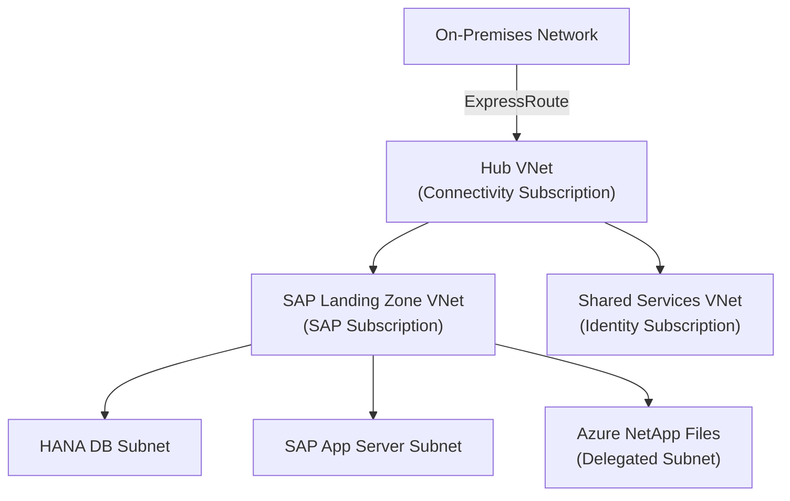

# Contributing to the SAP on Microsoft Azure Enterprise Architecture Handbook

## Overview

This handbook follows strict architectural and editorial standards aligned with Microsoft Learn, Azure Architecture Center, and SAP Enterprise Architecture documentation. Every contribution must meet the quality bar defined in this guide before merge.

---

## Local Development Setup

### Prerequisites

- Python 3.9 or later
- Git
- A GitHub account with repository access

### Install Dependencies

```bash
pip install mkdocs-material
pip install mkdocs-mermaid2-plugin
pip install mkdocs-git-revision-date-localized-plugin
pip install mkdocs-minify-plugin
```

### Serve Locally

```bash
mkdocs serve
```

The site will be available at `http://127.0.0.1:8000`. Live reload is enabled; changes to any `.md` file trigger an automatic browser refresh.

### Build Static Site

```bash
mkdocs build
```

Output is written to the `site/` directory. This directory is excluded from version control via `.gitignore`.

---

## Branch Naming Conventions

All branches must follow this pattern:

```
<type>/<scope>-<short-description>
```

| Type | When to Use |
|------|-------------|
| `feat` | New chapter or major new section |
| `update` | Revision to existing content |
| `fix` | Correction of factual error, broken link, or rendering issue |
| `diagram` | Mermaid diagram addition or update |
| `chore` | Repository configuration, dependency update, CI change |

Examples:

```
feat/networking-hub-spoke-chapter
update/hana-sap-notes-revision
fix/storage-broken-reference-link
diagram/disaster-recovery-failover-flow
chore/mkdocs-material-upgrade
```

---

## Commit Message Format

This repository uses [Conventional Commits](https://www.conventionalcommits.org/).

```
<type>(<scope>): <imperative short description>

[optional body]

[optional footer: breaking change, issue reference]
```

### Types

| Type | Purpose |
|------|---------|
| `feat` | New content or capability |
| `fix` | Correction of error |
| `docs` | Meta-documentation (README, CONTRIBUTING) |
| `style` | Formatting only, no content change |
| `refactor` | Restructure without content change |
| `chore` | Tooling, dependencies, CI |

### Examples

```
feat(networking): add hub-spoke topology chapter with ExpressRoute design decisions

fix(hana): correct SAP Note 2382421 architecture impact description

update(security): add Entra ID Conditional Access to design decisions table

diagram(disaster-recovery): add RPO/RTO failover sequence diagram
```

- Subject line: 72 characters maximum
- Use imperative mood: "add", "correct", "update", not "added", "corrected", "updated"
- Reference GitHub issues in footer: `Closes #42`

---

## How to Add a New Chapter

### Step 1: Claim the Chapter

Open a GitHub issue with the title `[Chapter] <Chapter Title>` before starting work. This prevents duplicate effort.

### Step 2: Create the File

Create a new Markdown file under `docs/chapters/`:

```
docs/chapters/<topic>.md
```

Use only lowercase letters, hyphens, and no spaces in the filename.

### Step 3: Apply the Chapter Template

Every chapter must include all sections defined in the chapter template (see [Chapter Template](#chapter-template) below). Do not omit sections. If a section does not apply, state explicitly why and what mitigates the gap.

### Step 4: Register in mkdocs.yml

Add the chapter to the `nav` section of `mkdocs.yml` under the appropriate group. Chapters must appear in logical dependency order within their group.

### Step 5: Validate

Run through the [PR Checklist](#pr-checklist) before opening a pull request.

---

## Chapter Template

Every chapter file must follow this structure. Copy this template as your starting point.

```markdown
# <Chapter Title>

## Architecture Overview

## SAP Architecture Mapping

## Azure Architecture Mapping

## Design Decisions

| Decision | Options Considered | Choice | Rationale | SAP/Azure Reference |
|----------|--------------------|--------|-----------|---------------------|

## SAP Notes Mapping

| Note ID | Purpose | Architecture Impact | Where Applied |
|---------|---------|---------------------|---------------|

## Microsoft References

## Azure Well-Architected Framework Mapping

### Reliability

### Security

### Cost Optimization

### Operational Excellence

### Performance Efficiency

## Landing Zone Alignment

## Security Considerations

## Operations Considerations

## Cost Considerations

## Performance Considerations

## Architecture Diagrams

```mermaid
...
```

## Validation Checklist

- [ ] ...

## Anti-Patterns

## Troubleshooting Notes
```

All sections are mandatory. The Design Decisions table and SAP Notes Mapping table must contain at least one substantive row; placeholder rows are not acceptable.

---

## SAP Notes Research Process

SAP Notes are the authoritative source for SAP-specific architectural constraints. Every architecture chapter must reference the relevant notes.

### Finding Relevant Notes

1. **SAP Support Portal** (`support.sap.com`): Search by component, product version, or known note ID. Requires an S-user account.
2. **SAP on Azure documentation**: Microsoft's SAP on Azure documentation cross-references critical notes. Start at [https://learn.microsoft.com/azure/sap/](https://learn.microsoft.com/azure/sap/).
3. **SAP Launchpad**: Use SAP ONE Support Launchpad for note details, attachments, and correction instructions.

### Required Fields Per Note

For every SAP Note cited in a chapter, document all four fields:

| Field | What to Record |
|-------|---------------|
| Note ID | Exact numeric ID, e.g., `2382421` |
| Purpose | One sentence: what the note addresses |
| Architecture Impact | How it constrains or shapes Azure architecture decisions |
| Where Applied | The specific section, service, or configuration in the chapter where the note applies |

### Validation

- Do not cite a note you have not read in full.
- Check the note's "Validity" section; expired or superseded notes must be flagged.
- If a note has been superseded, cite both the original and the replacement, and explain the delta.
- Notes that mandate specific kernel versions, patch levels, or certified configurations must be reflected in corresponding design decisions.

---

## Azure Service Validation Process

### Certification and Support Matrices

Before recommending any Azure service for an SAP workload:

1. Verify the VM SKU is listed in the [SAP Certified and Supported SAP HANA Hardware Directory](https://www.sap.com/dmc/exp/2014-09-02-hana-hardware/enEN/#/solutions?filters=iaas) or the relevant SAP certification matrix for the workload type.
2. Confirm the Azure region supports the required VM SKU, availability zone configuration, and paired region for disaster recovery.
3. Verify the service meets the SLA requirements for the workload tier (production, non-production, development).

### Azure Architecture Center Alignment

Every architectural recommendation must be traceable to at least one of:

- [Azure Architecture Center](https://learn.microsoft.com/azure/architecture/)
- [Azure Well-Architected Framework](https://learn.microsoft.com/azure/well-architected/)
- [Microsoft Cloud Adoption Framework](https://learn.microsoft.com/azure/cloud-adoption-framework/)
- [SAP on Azure documentation](https://learn.microsoft.com/azure/sap/)

Record the source URL in the Microsoft References section of the chapter.

### Landing Zone Alignment Verification

Every chapter must map its design decisions to the Azure Landing Zone accelerator for SAP:

- Confirm hub-spoke or Virtual WAN topology alignment
- Confirm Entra ID integration points
- Confirm private networking requirements (Private Endpoints, private DNS zones)
- Confirm Azure Monitor and Log Analytics workspace integration
- Confirm RBAC role assignments and least-privilege design

---

## Mermaid Diagram Guidelines

### When Diagrams Are Required

Every chapter must include at least one Mermaid diagram. Minimum requirements by chapter type:

| Chapter Type | Required Diagrams |
|-------------|-------------------|
| Architecture overview | High-level component topology |
| Networking | Network topology with traffic flows |
| Compute | VM placement and availability zone layout |
| Storage | Storage hierarchy and data paths |
| Security | Identity and access flow, network security boundaries |
| Disaster Recovery | Failover sequence, RPO/RTO timeline |
| High Availability | HA topology with fencing and quorum |

### Supported Diagram Types

Use the following Mermaid diagram types as appropriate:

- `graph TD` / `graph LR`: Component relationships, topology
- `sequenceDiagram`: Operational flows, failover sequences, authentication flows
- `flowchart`: Decision trees, runbook flows
- `classDiagram`: Data model relationships

Do not use diagram types not supported by the mkdocs-mermaid2-plugin version pinned in `requirements.txt`.

### Diagram Standards

- Every node must have a descriptive label. Single-letter node IDs are prohibited.
- Use consistent naming: Azure services use their official short names (e.g., `ANF` for Azure NetApp Files, `ASR` for Azure Site Recovery).
- Every diagram must have a `%%` comment block at the top identifying the diagram title and the chapter it belongs to.
- Direction arrows must reflect actual data flow or dependency direction, not aesthetic preference.
- Do not embed sensitive values, hostnames, IP addresses, or subscription IDs in diagrams.

### Diagram Syntax Example

```

```

### Validation

Run `mkdocs build` and verify the diagram renders without error. A Mermaid syntax error that silently produces a blank diagram is a blocking issue.

---

## PR Checklist

Every pull request must satisfy all items before requesting review. The PR description must include this checklist with each item explicitly checked or, if not applicable, explained.

### Content Completeness

- [ ] All mandatory chapter sections are present and populated (no placeholder text)
- [ ] Architecture Overview provides substantive description, not a list of Azure service names
- [ ] SAP Architecture Mapping covers the SAP layer (Basis, application, database) relevant to the chapter
- [ ] Azure Architecture Mapping covers the Azure service layer with service-specific constraints

### Design Decisions Table

- [ ] Every row in the Design Decisions table has all five columns populated
- [ ] Options Considered lists at least two alternatives for each decision
- [ ] Rationale is specific and technical, not marketing language
- [ ] SAP/Azure Reference column cites a verifiable source (SAP Note ID or URL)

### SAP Notes

- [ ] SAP Notes Mapping table contains at least one entry
- [ ] Every cited note has been verified as current and applicable
- [ ] Superseded notes are flagged with their replacement
- [ ] Architecture Impact reflects actual constraints from the note content

### Azure Alignment

- [ ] Landing Zone alignment section addresses hub-spoke or Virtual WAN topology
- [ ] Security Considerations covers Entra ID, private networking, and RBAC
- [ ] Operations Considerations covers Azure Monitor, Log Analytics, and alerting strategy
- [ ] Cost Considerations covers Reserved Instances, right-sizing, and any licensing impact
- [ ] All Azure service recommendations are traceable to Microsoft Learn or Azure Architecture Center

### Well-Architected Framework

- [ ] All five WAF pillars are addressed: Reliability, Security, Cost Optimization, Operational Excellence, Performance Efficiency
- [ ] Each pillar entry is specific to the chapter topic, not generic

### Diagrams

- [ ] At least one Mermaid diagram is present
- [ ] All diagrams render correctly via `mkdocs build`
- [ ] Diagrams use consistent naming conventions
- [ ] No sensitive values embedded in diagrams

### Anti-Patterns and Troubleshooting

- [ ] Anti-Patterns section lists at least two patterns with explanation of why they fail
- [ ] Troubleshooting Notes section includes at least two concrete diagnostic scenarios

### Validation Checklist in Chapter

- [ ] Chapter-level Validation Checklist is present and actionable
- [ ] Each checklist item is verifiable (not subjective)

### Technical Hygiene

- [ ] `mkdocs build` completes with zero warnings and zero errors
- [ ] All internal links resolve correctly
- [ ] All external URLs return HTTP 200 (verified at time of PR)
- [ ] Markdown renders correctly (no broken tables, no unclosed code fences)
- [ ] Chapter is registered in `mkdocs.yml` nav
- [ ] No trailing whitespace, no Windows line endings (CRLF)
- [ ] Commit messages follow Conventional Commits format

---

## Review Process

### Review Assignment

- All PRs require at least one approving review from a designated reviewer.
- PRs adding or significantly modifying SAP-specific content (SAP Notes, HANA, Basis architecture) require review from a contributor with documented SAP Basis or SAP architecture experience.
- PRs modifying Azure Landing Zone alignment, networking topology, or security architecture require review from a contributor with documented Azure architecture experience.

### Review Criteria

Reviewers evaluate against these criteria. Approval indicates the reviewer has verified each point:

1. **Factual accuracy**: Claims are verifiable against cited sources. No unsupported assertions.
2. **SAP Notes validity**: Cited notes are current, applicable, and correctly interpreted.
3. **Azure service correctness**: Service recommendations match current Azure capabilities and SLAs.
4. **Completeness**: All PR checklist items are satisfied.
5. **No marketing language**: Content is descriptive and prescriptive, not promotional.
6. **Diagram correctness**: Diagrams accurately represent the described architecture.

### Merge Criteria

- All PR checklist items checked
- At least one approving review
- All review comments resolved or explicitly deferred with a linked follow-up issue
- `mkdocs build` passes in CI
- Branch is up to date with `main`

### Post-Merge

After merge, the GitHub Pages deployment runs automatically via the configured GitHub Actions workflow. Verify the published page renders correctly within 5 minutes of merge.

---

## Reporting Issues

To report a factual error, outdated SAP Note reference, or broken Azure link, open a GitHub issue with:

- Label: `content-error`, `outdated-reference`, or `broken-link` as appropriate
- The exact file path and section heading
- The current incorrect content
- The correct content with a verifiable source

Do not use the issue tracker for general questions about SAP on Azure architecture. Use the repository Discussions for that purpose.
