# SAP on Microsoft Azure Enterprise Architecture Handbook

## Executive Summary

This handbook defines the enterprise architecture standards, design decisions, and operational patterns for deploying SAP workloads on Microsoft Azure. It is authored for enterprise architects, platform engineers, and SAP Basis teams responsible for designing, implementing, and operating SAP landscapes that meet the reliability, security, and performance requirements of production-grade enterprise environments. The guidance consolidates SAP-validated configurations, Microsoft Azure Well-Architected Framework principles, and Azure Landing Zone accelerators into a single authoritative reference.

The handbook addresses the full spectrum of SAP deployment scenarios on Azure, including SAP S/4HANA, SAP BTP, and legacy AnyDB platforms (SAP ASE, IBM Db2, Microsoft SQL Server, Oracle Database) on both Lift-and-Shift and Cloud-Native target architectures. Each chapter maps SAP architectural requirements to Azure service constructs, providing traceable design decisions, relevant SAP Notes, and Azure Architecture Center references. Architecture Decision Records (ADRs) and SAP Notes indexes are maintained as first-class artifacts.

This handbook is aligned to SAP's Enterprise Architecture methodology, Microsoft's Cloud Adoption Framework (CAF) and Well-Architected Framework (WAF), and the SAP on Azure Architecture Guide published on Microsoft Learn. All guidance is vendor-neutral within the Azure ecosystem and avoids prescriptive product lock-in beyond what SAP certification and Azure support boundaries require. Teams consuming this handbook are expected to adapt the patterns to their organizational context using the provided decision frameworks.

---

## Scope

### SAP Systems Covered

| SAP System | Deployment Model | Database | Azure Target | HA/DR Scope |
|---|---|---|---|---|
| SAP S/4HANA (Private Cloud) | IaaS VMs | SAP HANA | Azure VMs (M-series, Mv2) | Yes |
| SAP S/4HANA (Distributed) | IaaS VMs | SAP HANA | Azure VMs (M-series, Mv2) | Yes |
| SAP BW/4HANA | IaaS VMs | SAP HANA | Azure VMs (M-series) | Yes |
| SAP ECC 6.x (AnyDB) | IaaS VMs | SQL Server, Oracle, Db2 | Azure VMs (E-series, D-series) | Yes |
| SAP NetWeaver Application Server (ABAP/Java) | IaaS VMs | Any | Azure VMs | Yes |
| SAP HANA (standalone) | IaaS VMs | SAP HANA | Azure VMs (M-series, Mv2) | Yes |
| SAP BusinessObjects BI Platform | IaaS VMs | SQL Server, SAP HANA | Azure VMs | Partial |
| SAP Solution Manager / CALM | IaaS VMs | SAP HANA, AnyDB | Azure VMs | Yes |
| SAP BTP (Business Technology Platform) | PaaS | Managed | Azure-hosted BTP subaccounts | Limited |
| SAP Fiori (standalone gateway) | IaaS VMs | SAP HANA | Azure VMs | Yes |
| SAP PI/PO / Integration Suite | IaaS VMs / PaaS | Any | Azure VMs / BTP | Partial |
| SAP Data Intelligence | PaaS / Kubernetes | SAP HANA | AKS | Partial |

### Out of Scope

- SAP RISE with Microsoft Azure (governed separately by SAP's managed service agreements)
- SAP on non-Azure cloud providers
- On-premises SAP deployments without Azure connectivity
- SAP workloads hosted on Azure by third-party managed service providers under their own architectures

---

## How to Use This Handbook

This handbook is structured for multiple consumption patterns depending on the reader's role and task:

**For enterprise architects planning a new SAP on Azure deployment:**
Begin with [Architecture Principles](chapters/architecture-principles.md), then [Landing Zone](chapters/landing-zone.md), then [Networking](chapters/networking.md). These chapters establish the non-negotiable constraints that all subsequent design decisions inherit.

**For platform engineers implementing a specific SAP tier:**
Navigate directly to the relevant compute, storage, or database chapter. Each chapter is self-contained with its own design decision tables, SAP Notes references, and validation checklists.

**For security and compliance teams:**
The [Security](chapters/security.md) chapter covers the full control plane. Cross-chapter security considerations are also embedded in each chapter's dedicated security section.

**For operations teams:**
The [Operations](chapters/operations.md) chapter covers monitoring, patching, backup, and alerting. Database-specific operations guidance is in each database chapter.

**For architects reviewing an existing deployment:**
Use the validation checklists in each chapter and the [Governance](chapters/governance.md) chapter to assess conformance. The [ADR Index](chapters/adr-index.md) provides traceability for past decisions.

**For architects evaluating HA and DR:**
Read [High Availability](chapters/high-availability.md) and [Disaster Recovery](chapters/disaster-recovery.md) together, as they share availability zone and region pair dependencies.

### Navigating SAP Notes

All SAP Notes referenced in this handbook are indexed in the [SAP Notes Index](chapters/sap-notes-index.md) with cross-references to the chapters where they apply. SAP Notes require an SAP S-user ID for access via the SAP Support Portal or SAP ONE Support Launchpad.

### Navigating Architecture Decision Records

All ADRs are indexed in the [ADR Index](chapters/adr-index.md). ADRs follow the Markdown Architectural Decision Records (MADR) format and are embedded in the relevant chapter where the decision applies.

---

## Handbook Structure

The handbook is organized into six phases aligned to the SAP on Azure adoption lifecycle:

### Phase A — Foundation

Establishes the non-negotiable architectural constraints and Azure platform foundations that all SAP workloads inherit.

| Chapter | Purpose |
|---|---|
| [Architecture Principles](chapters/architecture-principles.md) | Governing design principles, constraints, and trade-off hierarchy |
| [Landing Zone](chapters/landing-zone.md) | Azure Landing Zone design for SAP, subscription topology, management group hierarchy |
| [Networking](chapters/networking.md) | Hub-spoke topology, ExpressRoute, private endpoints, DNS, NSG design |

### Phase B — Compute and Storage

Defines the infrastructure layer for SAP application servers, databases, and ancillary systems.

| Chapter | Purpose |
|---|---|
| [Compute](chapters/compute.md) | VM SKU selection, proximity placement groups, accelerated networking, OS configuration |
| [Storage](chapters/storage.md) | Azure Managed Disks, ANF, Blob storage, storage layout for SAP HANA and AnyDB |

### Phase C — Database Platforms

Covers each supported SAP database platform with its specific Azure architecture requirements.

| Chapter | Purpose |
|---|---|
| [SAP HANA](chapters/hana.md) | SAP HANA on Azure: M-series sizing, HSR, HANA-specific storage, backup |
| [SQL Server](chapters/sql-server.md) | SQL Server for SAP on Azure: AG, FCI, storage layout, licensing |
| [Oracle Database](chapters/oracle.md) | Oracle for SAP on Azure: ASM, Data Guard, Oracle licensing on Azure |
| [IBM Db2](chapters/db2.md) | IBM Db2 HADR for SAP on Azure, HADR topology, storage layout |

### Phase D — Cross-Cutting Concerns

Addresses security, operations, governance, and cost management as platform-wide concerns.

| Chapter | Purpose |
|---|---|
| [Security](chapters/security.md) | Entra ID, RBAC, key management, network security, SAP security integration |
| [Operations](chapters/operations.md) | Azure Monitor, SAP workload monitoring, patching, backup, alerting |
| [Governance](chapters/governance.md) | Azure Policy, tagging, cost management, naming conventions, RBAC governance |
| [Cost Optimization](chapters/cost-optimization.md) | Reserved Instances, Azure Hybrid Benefit, right-sizing, cost allocation |

### Phase E — Quality Attributes

Covers performance, reliability, and availability patterns specific to SAP workloads on Azure.

| Chapter | Purpose |
|---|---|
| [Performance](chapters/performance.md) | IOPS, throughput, latency benchmarking, performance patterns for SAP |
| [High Availability](chapters/high-availability.md) | Availability zones, Pacemaker, Azure Load Balancer, HA patterns per tier |
| [Disaster Recovery](chapters/disaster-recovery.md) | Azure Site Recovery, cross-region DR, RTO/RPO targets, DR testing |

### Phase F — Reference Material

Provides traceability artifacts and external references.

| Chapter | Purpose |
|---|---|
| [SAP Notes Index](chapters/sap-notes-index.md) | Cross-reference index of all SAP Notes cited in this handbook |
| [ADR Index](chapters/adr-index.md) | Index of all Architecture Decision Records with status and supersession links |
| [References](chapters/references.md) | Microsoft Learn, SAP Help Portal, Azure Architecture Center, and standards references |

---

## Architecture Principles Summary

The following principles govern all design decisions in this handbook. Each principle is elaborated in the [Architecture Principles](chapters/architecture-principles.md) chapter with rationale, trade-offs, and Azure/SAP references.

- **SAP certification is a hard constraint.** No Azure configuration that invalidates SAP's certification for a given component is permitted, regardless of cost or operational benefit.
- **Azure Landing Zone is the deployment boundary.** All SAP workloads deploy into an Azure Landing Zone-aligned subscription topology. Deviations require an ADR.
- **Private networking by default.** All SAP workload traffic traverses private networks. Public endpoints are prohibited unless explicitly justified and compensated with WAF and DDoS protection.
- **Hub-spoke with ExpressRoute.** SAP landscapes connect to on-premises via ExpressRoute in a hub-spoke topology. VPN is a fallback for non-production environments only.
- **Availability Zones for HA.** Production SAP systems use Availability Zone-aware deployments with cross-zone replication or synchronous database replication.
- **Managed identities over service principals.** All Azure resource authentication uses managed identities where supported.
- **Infrastructure as Code is mandatory.** All production infrastructure is deployed and managed via Bicep or Terraform. Manual portal deployments are prohibited in production.
- **Defense in depth.** Security controls are applied at every layer: network, identity, compute, data, and application. No single control is treated as sufficient.
- **Cost allocation is an architectural concern.** Resource tagging for cost allocation is defined at architecture time, not retrospectively.
- **Observability is built in, not bolted on.** Azure Monitor, Log Analytics, and SAP-specific monitoring agents are provisioned as part of the deployment, not post-deployment.
- **DR is tested, not assumed.** Disaster recovery capability is validated through scheduled failover tests. RPO/RTO targets are contractually defined and architecture-traceable.
- **Azure Well-Architected Framework governs quality trade-offs.** Design decisions explicitly map to one or more WAF pillars (Reliability, Security, Cost Optimization, Operational Excellence, Performance Efficiency).

---

## Quick Navigation

!!! tip "Starting a new SAP on Azure project?"
    Begin with [Architecture Principles](chapters/architecture-principles.md) and [Landing Zone](chapters/landing-zone.md). These chapters define the non-negotiable constraints before any compute or database design begins.

!!! info "Deploying SAP HANA?"
    The [SAP HANA](chapters/hana.md) chapter covers M-series VM selection, HANA System Replication topology, ANF storage layout, and HANA-specific backup strategies including Backint integration with Azure Backup.

!!! info "Deploying SAP on SQL Server, Oracle, or Db2?"
    See the dedicated database chapters: [SQL Server](chapters/sql-server.md), [Oracle](chapters/oracle.md), [Db2](chapters/db2.md). Each chapter covers Azure-specific HA topology, storage layout, licensing considerations, and relevant SAP Notes.

!!! warning "Security and compliance requirements?"
    The [Security](chapters/security.md) chapter is the authoritative source for control plane design. Every other chapter also contains a dedicated security considerations section. Review both.

!!! example "Designing for High Availability or Disaster Recovery?"
    Read [High Availability](chapters/high-availability.md) and [Disaster Recovery](chapters/disaster-recovery.md) together. HA uses Availability Zones within a region; DR uses paired regions with Azure Site Recovery or database-native replication.

!!! note "Looking for a specific SAP Note or ADR?"
    Use the [SAP Notes Index](chapters/sap-notes-index.md) and [ADR Index](chapters/adr-index.md) as cross-reference catalogs. Both are maintained as living documents updated with each handbook revision.

!!! abstract "Cost and governance review?"
    See [Cost Optimization](chapters/cost-optimization.md) and [Governance](chapters/governance.md) for Reserved Instance strategy, Azure Hybrid Benefit guidance, tagging taxonomy, and Azure Policy assignments.

---

## Prerequisites

### Technical Prerequisites

Before using this handbook to design an SAP on Azure architecture, the following platform foundations are assumed to be in place or planned:

| Prerequisite | Description | Reference |
|---|---|---|
| Azure Landing Zone | Enterprise-scale or SAP-specific Landing Zone subscription topology | [CAF Landing Zone](https://learn.microsoft.com/azure/cloud-adoption-framework/ready/landing-zone/) |
| Microsoft Entra ID tenant | Configured with hybrid identity (Entra Connect Sync or Cloud Sync) | [Entra ID documentation](https://learn.microsoft.com/entra/identity/) |
| ExpressRoute circuit | Dedicated circuit to on-premises SAP landscape with adequate bandwidth | [ExpressRoute for SAP](https://learn.microsoft.com/azure/expressroute/expressroute-introduction) |
| Azure Network topology | Hub-spoke VNet topology with Azure Firewall or NVA | [Hub-spoke topology](https://learn.microsoft.com/azure/architecture/reference-architectures/hybrid-networking/hub-spoke) |
| Azure Monitor workspace | Log Analytics workspace provisioned in management subscription | [Azure Monitor](https://learn.microsoft.com/azure/azure-monitor/overview) |
| Azure Key Vault | Deployed in management or security subscription for secret management | [Key Vault](https://learn.microsoft.com/azure/key-vault/general/overview) |
| SAP S-user ID | Required for SAP Notes access, SAP Support Portal, and SAP Certified Cloud and Service Provider validation | [SAP Support Portal](https://support.sap.com) |
| Azure subscription quotas | M-series and Mv2 VM quota approved in target regions | [Azure quotas](https://learn.microsoft.com/azure/quotas/view-quotas) |

### Knowledge Prerequisites

Readers of this handbook are expected to have working knowledge of:

- SAP NetWeaver or SAP HANA architecture fundamentals
- Azure core services: VMs, VNets, Storage, IAM, Azure Monitor
- Linux or Windows Server administration relevant to their SAP platform
- Infrastructure as Code (Bicep or Terraform) at an intermediate level
- Azure networking concepts: NSGs, route tables, private DNS, private endpoints

---

## Target Audience

| Audience | Relevant Chapters | Primary Use |
|---|---|---|
| Enterprise Architect | All | End-to-end architecture design and review |
| Cloud Platform Engineer | Landing Zone, Networking, Compute, Storage, Security | Infrastructure build and configuration |
| SAP Basis Administrator | HANA, SQL Server, Oracle, Db2, Operations | SAP platform deployment and operations |
| Security Architect | Security, Networking, Governance | Security control design and review |
| Database Administrator | HANA, SQL Server, Oracle, Db2, Storage | Database platform design and operations |
| FinOps / Cloud Economics | Cost Optimization, Governance | Cost modeling and optimization |
| Operations / SRE | Operations, High Availability, Disaster Recovery, Performance | Day-2 operations and incident response |
| Compliance / Audit | Security, Governance, ADR Index | Compliance evidence and traceability |

---

## SAP and Microsoft Alignment Statement

This handbook is authored in alignment with the following SAP and Microsoft reference programs and frameworks:

- **SAP Certified Infrastructure:** All Azure VM SKUs and storage configurations referenced in this handbook are either SAP-certified or within the parameters of SAP's Azure certification scope as documented in [SAP Note 1928533](https://launchpad.support.sap.com/#/notes/1928533) (SAP Applications on Azure: Supported Products and Azure VM Types) and [SAP Note 2015553](https://launchpad.support.sap.com/#/notes/2015553) (SAP on Microsoft Azure: Support Prerequisites).
- **Microsoft Azure Well-Architected Framework (WAF):** Each chapter maps design decisions to the five WAF pillars: Reliability, Security, Cost Optimization, Operational Excellence, and Performance Efficiency.
- **Microsoft Cloud Adoption Framework (CAF):** Landing Zone, governance, and subscription topology guidance follows CAF enterprise-scale patterns with SAP-specific adaptations from the [SAP on Azure Landing Zone Accelerator](https://learn.microsoft.com/azure/cloud-adoption-framework/scenarios/sap/).
- **Azure Architecture Center:** Patterns and reference architectures align to [SAP workloads on Azure](https://learn.microsoft.com/azure/architecture/reference-architectures/sap/) as published on the Azure Architecture Center.
- **SAP Enterprise Architecture Framework:** Design principles and governance patterns align to SAP's Enterprise Architecture methodology and the SAP TOGAF-aligned architecture approach.

Where this handbook deviates from or extends published Microsoft or SAP guidance, the deviation is documented in an Architecture Decision Record with explicit rationale.

---

## Handbook Structure Diagram

```mermaid
graph TD
    A["SAP on Azure Enterprise Architecture Handbook"] --> B["Phase A: Foundation"]
    A --> C["Phase B: Compute and Storage"]
    A --> D["Phase C: Database Platforms"]
    A --> E["Phase D: Cross-Cutting Concerns"]
    A --> F["Phase E: Quality Attributes"]
    A --> G["Phase F: Reference Material"]

    B --> B1["Architecture Principles"]
    B --> B2["Landing Zone"]
    B --> B3["Networking"]

    C --> C1["Compute"]
    C --> C2["Storage"]

    D --> D1["SAP HANA"]
    D --> D2["SQL Server"]
    D --> D3["Oracle"]
    D --> D4["IBM Db2"]

    E --> E1["Security"]
    E --> E2["Operations"]
    E --> E3["Governance"]
    E --> E4["Cost Optimization"]

    F --> F1["Performance"]
    F --> F2["High Availability"]
    F --> F3["Disaster Recovery"]

    G --> G1["SAP Notes Index"]
    G --> G2["ADR Index"]
    G --> G3["References"]

    style A fill:#0078d4,color:#fff,stroke:#005a9e
    style B fill:#106ebe,color:#fff,stroke:#005a9e
    style C fill:#106ebe,color:#fff,stroke:#005a9e
    style D fill:#106ebe,color:#fff,stroke:#005a9e
    style E fill:#106ebe,color:#fff,stroke:#005a9e
    style F fill:#106ebe,color:#fff,stroke:#005a9e
    style G fill:#106ebe,color:#fff,stroke:#005a9e
```

---

## Document Metadata

| Attribute | Value |
|---|---|
| Handbook version | 1.0.0 |
| Last reviewed | 2026-06-29 |
| Azure region scope | All Azure regions with M-series VM availability |
| SAP release scope | SAP HANA 2.0 SPS06+, SAP S/4HANA 2021+, SAP NetWeaver 7.4+ |
| Azure SDK / API baseline | Azure Resource Manager, 2024-01-01 API profile |
| MkDocs version | 1.5.x with Material theme 9.x |
| Diagram tooling | Mermaid 10.x |
| IaC tooling | Bicep (primary), Terraform (secondary) |
| Primary references | SAP Note 1928533, SAP Note 2015553, Azure Architecture Center, CAF, WAF |
