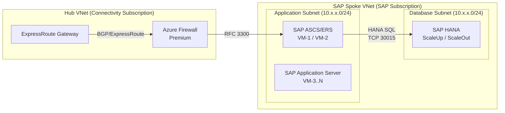

# Documentation Style Guide

This style guide governs all content in the SAP on Microsoft Azure Enterprise Architecture Handbook. Authors must follow these standards without exception. Deviations require a documented justification in the pull request.

---

## Writing Standards

### Tone and Register

Write in a direct, technical register. This handbook is a reference for enterprise architects, not a tutorial for beginners. Do not explain concepts that belong in SAP or Microsoft documentation; instead, reference them and explain the architectural decision or integration concern.

Avoid:

- Marketing language ("powerful", "seamless", "best-in-class", "industry-leading")
- Hedge words without substance ("generally", "typically", "usually") unless qualified with specific conditions
- Filler phrases ("It is worth noting that", "As mentioned above", "In today's modern enterprise")
- Passive constructions where an active voice is clearer

Prefer:

- Declarative statements: "Deploy the HANA database tier in a dedicated subnet."
- Conditional statements with explicit conditions: "If SAP HANA scale-out is required, use Azure NetApp Files with NFS 4.1."
- Imperative voice for design guidance: "Configure UltraDisk for HANA log volumes."

### Tense

Use present tense for architecture descriptions and design guidance. Use past tense only when describing a decision that was made and is being documented after the fact (in ADR entries). Use future tense only when describing migration phases or planned states.

### Person

Use second person ("you", "your") sparingly and only in validation checklists or procedural steps. Use third person or impersonal constructions everywhere else.

Correct: "The landing zone subscription must have diagnostic settings enabled."
Avoid: "You should enable diagnostic settings on your landing zone subscription."

### Precision

Every claim must be verifiable. If a statement references a specific SAP Note, Azure documentation page, or Well-Architected Framework pillar, cite it. Unsupported assertions will be rejected in review.

---

## Heading Hierarchy

Every chapter file uses the following heading levels. Do not skip levels.

```
# Chapter Title                          ← H1, one per file, matches nav entry
## Section Title                         ← H2, major sections within a chapter
### Subsection Title                     ← H3, subsections within a section
#### Detail Heading                      ← H4, used sparingly for tables/figures
```

H1 is reserved for the chapter title. There is exactly one H1 per file.

H2 sections must map to the required chapter structure defined in this handbook. The required H2 sections for every chapter are:

- Architecture Overview
- SAP Architecture Mapping
- Azure Architecture Mapping
- Design Decisions
- SAP Notes Mapping
- Microsoft References
- Azure Well-Architected Mapping
- Landing Zone Mapping
- Security Considerations
- Operations Considerations
- Cost Considerations
- Performance Considerations
- Mermaid Diagrams
- Validation Checklist
- Anti-Patterns
- Troubleshooting Notes

Do not reorder these sections. Do not rename them. Adding additional H2 sections between required sections is permitted when the content warrants it; document the addition in the pull request.

H3 and H4 headings must be sentence case, not title case.

Correct: `### Network security group rule design`
Avoid: `### Network Security Group Rule Design`

---

## Mermaid Diagram Standards

### When to Use Each Diagram Type

**`flowchart`** — Use for decision flows, traffic flows, deployment sequences, and component relationships where direction matters.

Use when:
- Showing data or traffic flow between components (left-right: `LR`)
- Showing a deployment or provisioning sequence (top-bottom: `TD`)
- Showing conditional logic in an architecture decision

**`sequenceDiagram`** — Use for protocol-level interactions, authentication flows, and time-ordered message exchanges between specific actors.

Use when:
- Documenting an Azure Active Directory / Entra ID authentication flow
- Documenting SAP RFC, IDOC, or API call sequences
- Documenting backup or replication sequences where order is critical

**`graph`** with C4-style conventions — Use for context and container diagrams when showing system boundaries, external actors, and the relationships between bounded systems.

Use when:
- Documenting a landing zone boundary and its integrations
- Showing the relationship between SAP systems (ECC, BW, PI/PO) in a landscape overview
- Showing hub-spoke network topology at a conceptual level

**`classDiagram`** — Use only for data model documentation. Not applicable to infrastructure chapters.

**`gantt`** — Use only for migration phase timelines. Not applicable to architecture chapters.

### Diagram Placement

Every diagram must be placed inside a fenced code block with the `mermaid` language identifier.

Every diagram must be preceded by an H4 heading that names the diagram.

Every diagram must be followed by a plain-text paragraph that describes what the diagram shows and calls out any non-obvious design element. Do not let a diagram stand without explanation.

### Diagram Naming Convention

Name diagrams using the pattern: `[chapter-topic]-[diagram-type]-[sequence]`

Examples:
- `hana-storage-layout-flowchart-01`
- `networking-hub-spoke-topology-graph-01`
- `security-entra-auth-sequence-01`

Reference the name in the caption paragraph: "Diagram `hana-storage-layout-flowchart-01` shows..."

### Diagram Quality Rules

- Use subgraphs to represent subnet or resource group boundaries.
- Label every edge in a flowchart with the protocol, port, or relationship type.
- Do not use default node shapes for every component; use cylinders for databases, rounded rectangles for services, rectangles for VMs, and parallelograms for external actors.
- Maximum diagram width: keep node count below 20 per diagram. Split complex architectures into multiple diagrams, each focused on one concern (network, compute, storage, identity).
- All node labels must use double quotes if they contain spaces or special characters.

### Mermaid Flowchart Template



---

## Table Formatting Rules

### General Rules

- Use Markdown pipe tables. Do not use HTML tables.
- Every table must have a header row.
- Align columns using consistent spacing.
- Table captions go above the table as bold text.
- Do not merge cells. If content requires merged cells, restructure the information.

### Required Table Formats

#### Design Decisions Table

Every chapter must include a Design Decisions table with the following columns. Column order is fixed.

| Decision | Options Considered | Choice | Rationale | SAP/Azure Reference |
|---|---|---|---|---|
| [Architecture decision being made] | [Comma-separated list of options evaluated] | [The selected option] | [Technical rationale, no marketing language] | [SAP Note ID or Azure doc URL] |

Rules:
- Each row documents exactly one decision.
- The Rationale column must state a technical reason, not a preference. "Preferred by Microsoft" is not a rationale. "Provides sub-millisecond latency required for HANA redo log writes" is.
- The SAP/Azure Reference column must contain a link or SAP Note ID. Empty cells are not permitted.

#### SAP Notes Mapping Table

Every architecture chapter must include a SAP Notes Mapping table with the following columns. Column order is fixed.

| SAP Note ID | Purpose | Architecture Impact | Where Applied |
|---|---|---|---|
| [Numeric SAP Note ID] | [One-sentence description of what the note addresses] | [How the note's guidance changes the architecture] | [Specific component, tier, or configuration where the note applies] |

Rules:
- Do not reference SAP Notes without describing their architecture impact.
- Do not include SAP Notes that are purely operational (patch instructions, GUI procedures) unless they have a direct architecture implication.
- SAP Note IDs must be plain integers in the ID column. Do not format them as links in this column; use the Where Applied column to reference the section of the document where the note's guidance is applied.

#### Azure Well-Architected Mapping Table

Every chapter must include an Azure Well-Architected Framework mapping with the following columns.

| Pillar | Relevant Guidance | Implementation in This Chapter |
|---|---|---|
| Reliability | [WAF reliability principle] | [How this chapter implements it] |
| Security | [WAF security principle] | [How this chapter implements it] |
| Cost Optimization | [WAF cost principle] | [How this chapter implements it] |
| Operational Excellence | [WAF operational principle] | [How this chapter implements it] |
| Performance Efficiency | [WAF performance principle] | [How this chapter implements it] |

All five pillars must appear. Empty rows are not permitted.

---

## SAP Notes Citation Format

SAP Notes are cited in two contexts: in tables and in prose.

### In Tables

In the SAP Notes Mapping table, place the numeric ID alone in the ID column.

```
| 2382421 | Network configuration for SAP HANA | Requires dedicated storage subnet with no internet routing | HANA subnet design |
```

### In Prose

In body text, cite a SAP Note as follows:

```
SAP Note 2382421 (Network Configuration for SAP HANA) requires that the storage network for HANA scale-out be isolated in a dedicated subnet.
```

Format: `SAP Note [ID] ([Title])` on first reference in a section. Subsequent references in the same section may use `SAP Note [ID]` without the title.

Do not hyperlink SAP Note IDs. SAP Note URLs require authentication and are not stable for external linking. Authors must verify Note availability in their SAP Support Portal.

Do not invent SAP Note IDs. Every SAP Note cited must be verified against the SAP Support Portal prior to merge.

---

## Azure Service Naming Conventions

Use official Azure service names as they appear in the Azure Portal and Microsoft Learn documentation. Do not use internal Microsoft codenames, deprecated names, or abbreviations that are not universally recognized.

| Correct | Avoid |
|---|---|
| Microsoft Entra ID | Azure Active Directory, AAD, Azure AD |
| Azure Virtual Network | VNet (in prose; acceptable as an abbreviation in diagrams) |
| Azure Monitor | OMS (deprecated), Log Analytics (use as a sub-service name only) |
| Azure Virtual Machines | Azure VMs (acceptable abbreviation after first use) |
| Azure NetApp Files | ANF (acceptable abbreviation after first use) |
| Azure ExpressRoute | ExpressRoute (without "Azure" after first use) |
| Azure Firewall Premium | Azure Firewall (specify SKU on first use) |
| Microsoft Defender for Cloud | Azure Security Center (deprecated) |
| Azure Private Endpoint | Private Link Endpoint (incorrect) |
| Azure Bastion | Bastion Host (informal) |

On first use of any Azure service in a chapter, use the full official name. Subsequent uses may use an established abbreviation if it is defined inline at first use.

Example: "Deploy Azure NetApp Files (ANF) for shared HANA storage. ANF supports NFS 4.1..."

SAP product names follow SAP's official naming conventions. Use "SAP HANA" not "HANA" in formal references. Use "SAP S/4HANA" not "S4HANA" or "S/4". Use "SAP NetWeaver" not "NetWeaver" on first reference.

---

## Code Block Standards

All code blocks must specify a language identifier. Never use a bare triple-backtick block for infrastructure code.

### Bicep

Language identifier: `bicep`

Rules:
- Include a comment block at the top of every Bicep snippet stating what the snippet deploys and where it is used in the architecture.
- Use symbolic names that reflect the resource's architectural role, not generic names.
- Include `@description` decorators on all parameters.
- Do not include hardcoded values that must be environment-specific (subscription IDs, tenant IDs, passwords). Use parameters with `@secure()` for secrets.

```bicep
// Deploys the HANA database subnet with NSG association
// Used in: HANA chapter, Database Subnet Design section

@description('Address prefix for the HANA database subnet')
param hanaSubnetPrefix string = '10.1.2.0/24'

@description('Resource ID of the NSG to associate with the HANA subnet')
param hanaSubnetNsgId string

resource hanaSubnet 'Microsoft.Network/virtualNetworks/subnets@2023-04-01' = {
  name: 'snet-hana-db-prod-001'
  parent: spokeVnet
  properties: {
    addressPrefix: hanaSubnetPrefix
    networkSecurityGroup: {
      id: hanaSubnetNsgId
    }
    privateEndpointNetworkPolicies: 'Disabled'
  }
}
```

### PowerShell

Language identifier: `powershell`

Rules:
- Use `#Requires -Modules` at the top of multi-command scripts.
- Use `[CmdletBinding()]` and parameter blocks for any reusable script.
- Include error handling with `try/catch` for any operation that could fail silently.
- Do not use aliases (`gci`, `%`, `?`) in documentation code; use full cmdlet names.

```powershell
# Validates that diagnostic settings are enabled on all SAP-related VMs
# Used in: Operations chapter, Monitoring Validation section

#Requires -Modules Az.Monitor, Az.Compute

[CmdletBinding()]
param(
    [Parameter(Mandatory)]
    [string]$ResourceGroupName
)

$vms = Get-AzVM -ResourceGroupName $ResourceGroupName

foreach ($vm in $vms) {
    $diagSettings = Get-AzDiagnosticSetting -ResourceId $vm.Id -ErrorAction SilentlyContinue
    if (-not $diagSettings) {
        Write-Warning "VM $($vm.Name) has no diagnostic settings configured."
    }
}
```

### Bash

Language identifier: `bash`

Rules:
- Begin every script with `#!/bin/bash` and `set -euo pipefail`.
- Use `readonly` for constants.
- Quote all variable expansions.
- Do not use bash scripts for Azure resource management; use Azure CLI with Bicep or PowerShell.

```bash
#!/bin/bash
set -euo pipefail

# Checks HANA volume mount options on the database VM
# Used in: HANA chapter, Storage Mount Validation section

readonly EXPECTED_MOUNT_OPTIONS="rw,vers=4.1,hard,timeo=600,rsize=262144,wsize=262144"

check_mount() {
    local mount_point="$1"
    local actual_options
    actual_options=$(grep "${mount_point}" /proc/mounts | awk '{print $4}')

    if [[ "${actual_options}" != *"vers=4.1"* ]]; then
        echo "ERROR: ${mount_point} is not mounted with NFS 4.1. Actual: ${actual_options}"
        exit 1
    fi
}

check_mount "/hana/data"
check_mount "/hana/log"
check_mount "/hana/shared"
```

### YAML

Language identifier: `yaml`

Rules:
- Include a comment at the top explaining the file's purpose and where it is used.
- Use 2-space indentation. Do not use tabs.
- Quote string values that contain special characters or could be misinterpreted as non-string types.

```yaml
# Azure Monitor alert rule for HANA memory utilization
# Used in: Operations chapter, HANA Alerting section
# Deploy via: az deployment group create

name: alert-hana-memory-high-prod
type: Microsoft.Insights/metricAlerts
properties:
  description: "Alert when HANA VM memory utilization exceeds 90% for 5 minutes"
  severity: 2
  enabled: true
  evaluationFrequency: PT1M
  windowSize: PT5M
  criteria:
    'odata.type': Microsoft.Azure.Monitor.SingleResourceMultipleMetricCriteria
    allOf:
      - name: HighMemoryUtilization
        metricName: "Percentage Memory"
        operator: GreaterThan
        threshold: 90
        timeAggregation: Average
```

---

## Admonition Usage

MkDocs Material supports admonitions with the `!!! type "Title"` syntax. Use admonitions sparingly and only when the content genuinely requires emphasis beyond normal prose.

### Types and When to Use Them

**`note`** — Supplementary information that clarifies a statement but is not critical to the architecture. Use for cross-references, clarifications, and context.

```
!!! note "SAP Note applicability"
    SAP Note 2382421 applies to HANA 2.0 SPS 04 and later. For earlier SPS levels, consult SAP Note 2235581.
```

**`tip`** — A proven practice or optimization that is not mandatory but significantly improves the architecture. Use sparingly.

```
!!! tip "ANF capacity pool sizing"
    Provision the ANF capacity pool at 20% above the calculated HANA data volume size to accommodate online HANA data backups without impacting performance.
```

**`warning`** — A configuration or design choice that will cause a verifiable problem if not followed. Must be specific. Do not use for general cautions.

```
!!! warning "NFS mount options for HANA log volumes"
    If `nconnect=4` is not set on the NFS mount for HANA log volumes, throughput will be limited to a single TCP connection. This causes HANA redo log write latency to exceed the 250 µs threshold required for production workloads.
```

**`danger`** — A configuration that will cause data loss, security breach, or production outage. Use only when the consequence is severe and the failure mode is direct.

```
!!! danger "Do not enable public endpoints on HANA VMs"
    Enabling a public IP on a HANA database VM bypasses all hub-spoke network controls and exposes the HANA SQL port (30015) directly to the internet. This violates the SAP security baseline and Azure landing zone policy.
```

**`info`** — Reference pointers to external documentation. Use when a section requires significant background that is documented elsewhere.

```
!!! info "Azure Well-Architected Framework: Reliability pillar"
    The reliability guidance in this section aligns with the Azure Well-Architected Framework Reliability pillar. See [Reliability design principles](https://learn.microsoft.com/azure/well-architected/reliability/principles) for the full framework.
```

### Admonition Rules

- Do not use admonitions as a substitute for writing clear prose. If a point can be made in a sentence, make it in a sentence.
- Do not stack multiple admonitions consecutively without prose between them.
- Admonition titles must be specific. Do not use generic titles like "Note", "Important", or "Warning" as the title text when the type already conveys that.
- Maximum one `danger` admonition per section. If a section has multiple danger-level concerns, consolidate them or restructure the section.

---

## Decision Table Format

The Design Decisions table is specified in the Table Formatting Rules section. Additional formatting rules for decision tables:

- Each decision row must be self-contained. A reader must understand the decision without reading the prose around it.
- The Options Considered column must list at least two options. A decision with only one option is not a decision; it is a constraint, and should be documented as such in prose.
- The Rationale column must address why the rejected options were not chosen, not only why the chosen option was selected.
- Decisions that reference a SAP Note must include the Note ID in the SAP/Azure Reference column. Decisions that reference an Azure architecture pattern must include the Microsoft Learn URL.
- Do not document implementation details in the Decision table. The table documents what was decided and why; implementation goes in the section body.

Example row:

| Storage type for HANA data and log volumes | Azure Managed Disk (Premium SSD v2), Azure NetApp Files with NFS 4.1, Azure Managed Disk (UltraDisk) | Azure NetApp Files with NFS 4.1 | ANF provides consistent sub-millisecond latency for HANA log I/O at all volume sizes without the per-VM IOPS ceiling imposed by Premium SSD v2. UltraDisk was rejected due to lack of shared volume support required for HANA scale-out. | SAP Note 2382421; [ANF HANA sizing guide](https://learn.microsoft.com/azure/azure-netapp-files/azure-netapp-files-solution-architectures) |

---

## Anti-Pattern Block Format

Every chapter must include an Anti-Patterns section. Anti-patterns are documented in a consistent format: a named anti-pattern, a description of the problematic configuration, the failure mode it produces, and the correct approach.

Use the following structure for each anti-pattern:

```markdown
### Anti-pattern: [Name of the anti-pattern]

**Configuration:** [Description of the incorrect configuration]

**Failure mode:** [The specific, verifiable problem this causes]

**Correct approach:** [The correct configuration and why it avoids the failure]

**Reference:** [SAP Note ID or Azure documentation URL]
```

Rules:
- The Failure mode must describe a concrete, observable problem: service disruption, latency breach, security exposure, compliance violation. "Not recommended" is not a failure mode.
- The Correct approach must be specific enough to act on.
- Every anti-pattern must have a reference.
- Anti-patterns are not the place to document general best practices. Document only configurations that architects or engineers have actually deployed incorrectly in SAP on Azure environments.

Example:

### Anti-pattern: Placing HANA data and log volumes on the same ANF capacity pool as SAP transport directories

**Configuration:** A single ANF capacity pool is used for HANA data volumes, HANA log volumes, and SAP transport directories (/usr/sap/trans).

**Failure mode:** Burst I/O from transport imports saturates the capacity pool throughput limit (which scales with pool size), causing HANA log write latency to exceed the 250 µs threshold. This triggers HANA savepoint stalls and can cause production system unavailability during transport windows.

**Correct approach:** Deploy HANA data and log volumes in a dedicated ANF capacity pool with a QoS type set to Manual. Provision transport directory volumes in a separate capacity pool. Manual QoS allows HANA log volumes to be allocated a guaranteed throughput independent of other volumes in the pool.

**Reference:** SAP Note 2382421; [ANF performance considerations for HANA](https://learn.microsoft.com/azure/azure-netapp-files/performance-benchmarks-linux)

---

## File Naming Conventions

### Chapter Files

Chapter files reside in `docs/chapters/`. File names use lowercase hyphenated identifiers that match the chapter topic exactly as it appears in `mkdocs.yml`.

Pattern: `docs/chapters/[topic].md`

Examples:
- `docs/chapters/landing-zone.md`
- `docs/chapters/high-availability.md`
- `docs/chapters/sap-notes-index.md`

Do not use underscores, camelCase, or abbreviations in file names.

### Asset Files

Images and diagrams exported as static files reside in `docs/assets/`. Images use the pattern:

`docs/assets/[chapter-topic]-[description]-[sequence].[ext]`

Examples:
- `docs/assets/networking-hub-spoke-topology-01.png`
- `docs/assets/hana-storage-layout-02.svg`

Prefer SVG for architecture diagrams. Use PNG only when SVG is not supported by the toolchain.

### ADR Files

Architecture Decision Records reside in `docs/adrs/`. ADR files use a zero-padded sequence number followed by a short title.

Pattern: `docs/adrs/[NNNN]-[short-title].md`

Examples:
- `docs/adrs/0001-storage-type-for-hana-volumes.md`
- `docs/adrs/0042-hub-spoke-vs-vwan.md`

### Configuration Files

MkDocs configuration: `mkdocs.yml` in the repository root.
Custom CSS: `docs/overrides/stylesheets/extra.css`
Custom hooks: `docs/hooks/`

---

## Cross-Reference Standards

Cross-references to other chapters use MkDocs relative link syntax.

```markdown
See [Landing Zone](../chapters/landing-zone.md) for subscription structure.
```

Cross-references to specific sections within a chapter append the anchor.

```markdown
See [HANA storage design](../chapters/hana.md#storage-considerations) for ANF capacity pool sizing guidance.
```

Anchors are derived from the heading text using MkDocs anchor generation rules: lowercase, spaces replaced with hyphens, special characters removed.

Do not use bare URLs for cross-references to internal content. Do not use absolute paths. Relative paths ensure link validity across deployment environments.

---

## Validation Checklist Format

Every chapter must end with a Validation Checklist section. The checklist contains verifiable binary items that confirm the architecture described in the chapter has been correctly implemented.

Rules:
- Each item must be verifiable by a command, a portal check, or an automated policy. Do not include items that require subjective judgment.
- Each item must be specific to the chapter's content. Do not include generic items ("Ensure monitoring is configured") without referencing the specific resource and metric.
- Items are formatted as Markdown task list items: `- [ ] [Item text]`
- The checklist must cover at minimum: network configuration, identity and access, monitoring and alerting, backup configuration, and compliance with the relevant SAP Notes cited in the chapter.

Example:

```markdown
## Validation Checklist

- [ ] ANF capacity pool for HANA volumes is provisioned with Manual QoS.
- [ ] HANA log volume throughput allocation is at minimum 250 MB/s per SAP Note 2382421.
- [ ] NFS mount options include `vers=4.1,nconnect=4,hard,timeo=600` on all HANA volume mount points.
- [ ] NSG on the HANA database subnet blocks all inbound traffic except from the application subnet on port 30015.
- [ ] Azure Monitor alert is active for HANA VM memory utilization exceeding 90%.
- [ ] HANA backup to Azure Blob Storage is configured and last backup timestamp is within the RPO window.
- [ ] Private Endpoint is used for all Azure storage accounts accessed by HANA backups; no public endpoint is enabled.
```

---

## Prohibited Patterns

The following patterns are prohibited in all handbook content and will be rejected in pull request review.

- Sentences that begin with "It is important to..."
- Use of "leverage" as a synonym for "use"
- Use of "utilize" when "use" is sufficient
- Use of "seamless", "powerful", "robust", "scalable", "enterprise-grade", "best-in-class"
- Unsourced performance claims ("HANA on Azure achieves X IOPS")
- References to specific pricing without a date and a link to the Azure pricing calculator
- Screenshots of the Azure Portal (use diagrams or code instead; screenshots become stale)
- Placeholder text of any kind ("TBD", "TODO", "Coming soon", "Under construction")
- External links to non-Microsoft, non-SAP sources without documented justification in the pull request
