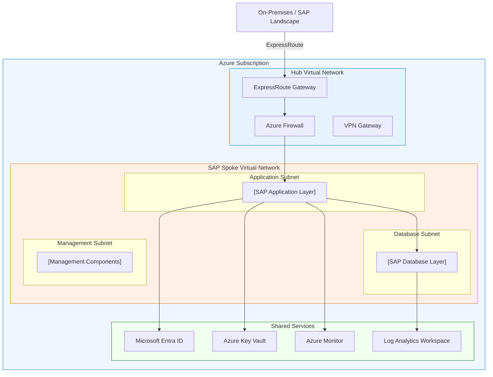

# [Chapter Title]: SAP on Microsoft Azure

<!-- TEMPLATE USAGE
     Replace all bracketed placeholders with chapter-specific content.
     Remove this comment block before publishing.
     Every section is required. Do not remove sections.
     Follow the SAP on Azure Enterprise Architecture Handbook standards.
-->

---

## Overview

<!-- Brief statement of scope: what SAP component or architecture domain this chapter covers,
     why it matters on Azure, and what decisions are addressed. 2-4 sentences. No marketing language. -->

[Replace with a concise description of the architecture domain covered by this chapter.
State the SAP workload scope, the Azure service boundaries, and the primary design decisions addressed.]

---

## Architecture Overview

<!-- Describe the end-to-end architecture for this domain. Cover:
     - Component roles and responsibilities
     - Integration points between SAP layers and Azure services
     - Key constraints from SAP certification requirements
     - Dependencies on other architecture domains -->

[Replace with architecture overview text. Include component descriptions, integration points,
and certification constraints relevant to this chapter's domain.]

### Architecture Diagram



> **Note:** Replace the diagram above with a chapter-specific Mermaid diagram reflecting the actual
> component topology for this architecture domain. Use subgraphs to model Azure network boundaries,
> SAP layers, and shared services.

---

## SAP Architecture Mapping

<!-- Map this chapter's architecture to SAP concepts:
     - Relevant SAP components (ABAP stack, Java stack, HANA, NetWeaver, etc.)
     - SAP technical architecture recommendations (SAP Architecture Center references)
     - SAP certified configurations that apply
     - SAPS sizing considerations -->

| SAP Component | Role in Architecture | Certification Requirement | SAP Reference |
|---|---|---|---|
| [SAP Component Name] | [Role description] | [Certification requirement or constraint] | [SAP Note or SAP Architecture Center link] |
| [SAP Component Name] | [Role description] | [Certification requirement or constraint] | [SAP Note or SAP Architecture Center link] |
| [SAP Component Name] | [Role description] | [Certification requirement or constraint] | [SAP Note or SAP Architecture Center link] |

### SAP Sizing Principles

[Replace with sizing principles relevant to this chapter domain. Reference SAP Quick Sizer, SAPS
benchmarks, or SAP HANA sizing guidelines as applicable.]

### SAP Integration Dependencies

[Replace with descriptions of integration dependencies: RFC connections, IDoc flows, SOAP/REST APIs,
SAP Transport Management System, Solution Manager, or other SAP-to-SAP dependencies relevant to
this chapter.]

---

## Azure Architecture Mapping

<!-- Map SAP components to Azure services:
     - Primary Azure services used and their roles
     - Azure service constraints (regions, SKUs, availability zones)
     - Azure Landing Zone integration points
     - Connectivity model (hub-spoke, ExpressRoute, private endpoints) -->

| SAP Layer | Azure Service | SKU / Configuration | Availability Model | Notes |
|---|---|---|---|---|
| [SAP Layer] | [Azure Service] | [SKU or configuration detail] | [Zone redundant / Regional / Zonal] | [Additional notes] |
| [SAP Layer] | [Azure Service] | [SKU or configuration detail] | [Zone redundant / Regional / Zonal] | [Additional notes] |
| [SAP Layer] | [Azure Service] | [SKU or configuration detail] | [Zone redundant / Regional / Zonal] | [Additional notes] |

### Azure Landing Zone Integration

[Replace with description of how this chapter's architecture integrates with the Azure Landing Zone:
subscription model, management group placement, policy assignments, connectivity subscription
dependencies.]

### Hub-Spoke Network Integration

[Replace with description of hub-spoke integration: which subnets are required, NSG rules,
UDR requirements, private endpoint placement, DNS resolution path through hub.]

---

## Design Decisions

<!-- Document all significant architecture decisions for this chapter domain.
     Include only decisions with real tradeoffs. Do not pad with obvious choices. -->

| Decision | Options Considered | Choice | Rationale | SAP / Azure Reference |
|---|---|---|---|---|
| [Decision topic] | Option A: [description]; Option B: [description]; Option C: [description] | [Chosen option] | [Technical rationale referencing constraints, SAP requirements, or Azure service limits] | [SAP Note XXXXXXX or Azure docs URL] |
| [Decision topic] | Option A: [description]; Option B: [description] | [Chosen option] | [Technical rationale] | [Reference] |
| [Decision topic] | Option A: [description]; Option B: [description]; Option C: [description] | [Chosen option] | [Technical rationale] | [Reference] |
| [Decision topic] | Option A: [description]; Option B: [description] | [Chosen option] | [Technical rationale] | [Reference] |
| [Decision topic] | Option A: [description]; Option B: [description] | [Chosen option] | [Technical rationale] | [Reference] |

!!! note "Architecture Decision Records"
    Significant decisions from this table should be promoted to standalone ADR files under `adr/`.
    Use the ADR template at `adr/templates/adr-template.md`. Reference the ADR number in the
    SAP/Azure Reference column.

---

## SAP Notes Mapping

<!-- List all SAP Notes relevant to this chapter's architecture domain.
     Focus on notes that have direct architecture impact: sizing, HA, DR, OS configuration,
     Azure-specific guidance, network requirements, storage requirements. -->

!!! warning "SAP Notes Access"
    SAP Notes require an active SAP Support Portal account (S-user). Verify note applicability
    against your SAP product version and support package level before implementing.

| SAP Note ID | Title / Purpose | Architecture Impact | Where Applied | Last Verified |
|---|---|---|---|---|
| [Note ID] | [Note title and purpose description] | [How this note affects architecture decisions, sizing, or configuration] | [Chapter section, Azure service, or SAP component where this applies] | [YYYY-MM] |
| [Note ID] | [Note title and purpose description] | [Architecture impact] | [Where applied] | [YYYY-MM] |
| [Note ID] | [Note title and purpose description] | [Architecture impact] | [Where applied] | [YYYY-MM] |
| [Note ID] | [Note title and purpose description] | [Architecture impact] | [Where applied] | [YYYY-MM] |
| [Note ID] | [Note title and purpose description] | [Architecture impact] | [Where applied] | [YYYY-MM] |

### SAP Notes Review Process

[Replace with guidance on how these notes should be reviewed during implementation:
which notes require SAP basis team sign-off, which require Azure infrastructure team review,
and which affect Basis, security, or networking configurations.]

---

## Microsoft References

<!-- List primary Microsoft documentation sources used to validate this chapter.
     Include Azure Architecture Center, Microsoft Learn, and product documentation.
     Do not list marketing pages. -->

| Reference | URL | Relevance to This Chapter |
|---|---|---|
| [Reference title] | `https://learn.microsoft.com/...` | [How this reference applies to architecture decisions in this chapter] |
| [Reference title] | `https://learn.microsoft.com/...` | [Relevance] |
| [Reference title] | `https://learn.microsoft.com/...` | [Relevance] |
| [Reference title] | `https://learn.microsoft.com/...` | [Relevance] |
| [Reference title] | `https://learn.microsoft.com/...` | [Relevance] |

### Related Handbook Chapters

- [Link to related chapter](../chapters/architecture-principles.md) — [Brief description of relationship]
- [Link to related chapter](../chapters/landing-zone.md) — [Brief description of relationship]
- [Link to related chapter](../chapters/networking.md) — [Brief description of relationship]
- [Link to related chapter](../chapters/security.md) — [Brief description of relationship]

---

## Azure Well-Architected Framework Mapping

<!-- Map this chapter's architecture decisions to the five WAF pillars.
     Every row must reference a specific implementation, not a generic statement.
     Empty rows indicate a gap that must be addressed before chapter is complete. -->

| Pillar | Requirement | Implementation | Azure Service / Feature | Reference |
|---|---|---|---|---|
| **Reliability** | [Specific reliability requirement for this domain] | [How the architecture meets this requirement] | [Azure service or feature name] | [WAF reliability docs URL or SAP Note] |
| **Reliability** | [Specific reliability requirement] | [Implementation] | [Azure service] | [Reference] |
| **Security** | [Specific security requirement for this domain] | [How the architecture meets this requirement] | [Azure service or feature name] | [Reference] |
| **Security** | [Specific security requirement] | [Implementation] | [Azure service] | [Reference] |
| **Cost Optimization** | [Specific cost requirement for this domain] | [How the architecture meets this requirement] | [Azure service or feature name] | [Reference] |
| **Operational Excellence** | [Specific ops requirement for this domain] | [How the architecture meets this requirement] | [Azure service or feature name] | [Reference] |
| **Operational Excellence** | [Specific ops requirement] | [Implementation] | [Azure service] | [Reference] |
| **Performance Efficiency** | [Specific performance requirement for this domain] | [How the architecture meets this requirement] | [Azure service or feature name] | [Reference] |
| **Performance Efficiency** | [Specific performance requirement] | [Implementation] | [Azure service] | [Reference] |

---

## Landing Zone Mapping

<!-- Describe alignment with Azure Landing Zone architecture:
     - Management group placement
     - Subscription model
     - Policy assignments (built-in and custom)
     - RBAC model
     - Connectivity integration -->

### Management Group Placement

[Replace with description of where SAP workloads are placed in the management group hierarchy.
Reference the standard Landing Zone management group structure and any SAP-specific deviations.]

```
Root Management Group
└── [Platform MG]
    └── [Landing Zones MG]
        └── [SAP MG]                    ← SAP-specific management group
            ├── SAP Production          ← Production subscription
            ├── SAP Non-Production      ← Non-prod subscription
            └── SAP Connectivity        ← Connectivity subscription (if separate)
```

### Policy Assignments

| Policy | Assignment Scope | Effect | SAP Rationale |
|---|---|---|---|
| [Policy name] | [Management group or subscription] | [Deny / Audit / DeployIfNotExists] | [Why this policy is required for SAP workloads] |
| [Policy name] | [Scope] | [Effect] | [Rationale] |
| [Policy name] | [Scope] | [Effect] | [Rationale] |

### RBAC Model

| Role | Scope | Principal Type | Permissions Granted | SAP Workload Context |
|---|---|---|---|---|
| [Azure built-in or custom role] | [Subscription / Resource group / Resource] | [User / Group / Service principal / Managed identity] | [Key permissions summary] | [Why this role is needed for SAP] |
| [Role] | [Scope] | [Principal type] | [Permissions] | [Context] |
| [Role] | [Scope] | [Principal type] | [Permissions] | [Context] |

### Connectivity Integration

[Replace with description of how SAP workloads connect to the hub virtual network, ExpressRoute
circuits, on-premises SAP landscape, and internet egress. Cover VNet peering, private endpoints,
DNS forwarder configuration, and any NVA requirements.]

---

## Security Considerations

<!-- Security is non-negotiable. Cover all relevant security domains for this chapter.
     Reference Azure security baselines, SAP security guides, and Microsoft Entra integration. -->

### Identity and Access Management

[Replace with IAM requirements for this chapter domain: Entra ID integration, service principals,
managed identities, SAP SNC/SSO configuration, privileged access management.]

!!! danger "Privileged Access"
    [Replace with specific guidance on privileged account management for this chapter's components.
    Reference Azure PIM, SAP Emergency User process, or break-glass account requirements.]

### Network Security

[Replace with network security requirements: NSG rules required, Azure Firewall rule categories,
private endpoint requirements, service endpoint considerations, network flow inspection points.]

#### Required NSG Rules

| Direction | Source | Destination | Port / Protocol | Purpose | SAP Reference |
|---|---|---|---|---|---|
| Inbound | [Source CIDR or service tag] | [Destination subnet] | [Port/Protocol] | [Purpose] | [SAP Note or reference] |
| Outbound | [Source subnet] | [Destination CIDR or service tag] | [Port/Protocol] | [Purpose] | [Reference] |
| Inbound | [Source] | [Destination] | [Port/Protocol] | [Purpose] | [Reference] |

### Data Protection

[Replace with data protection requirements: encryption at rest (Azure Disk Encryption, SSE, CMK),
encryption in transit (TLS versions, SAP SNC), key management via Azure Key Vault, backup
encryption.]

### Microsoft Entra ID Integration

[Replace with Entra ID integration requirements: application registrations, enterprise applications,
conditional access policies, MFA requirements for SAP GUI or Fiori access, SAML/OAuth/OIDC
configuration for SAP systems.]

### Security Monitoring

[Replace with security monitoring requirements: Microsoft Defender for Cloud plans enabled,
Microsoft Sentinel workspace integration, SAP security audit log forwarding, alert rules.]

!!! tip "Microsoft Sentinel for SAP"
    [Replace with guidance on Microsoft Sentinel SAP integration if applicable to this chapter.
    Reference the Microsoft Sentinel solution for SAP applications.]

---

## Operations Considerations

<!-- Operations requirements must be concrete and implementable.
     Cover monitoring, alerting, backup, patching, and runbook requirements. -->

### Monitoring Strategy

[Replace with monitoring requirements: Azure Monitor metrics, log analytics queries, Application
Insights (if applicable), SAP Solution Manager integration, custom dashboards.]

#### Key Metrics

| Metric | Source | Alert Threshold | Alert Severity | Remediation Runbook |
|---|---|---|---|---|
| [Metric name] | [Azure Monitor / Log Analytics / SAP] | [Threshold value or condition] | [Critical / High / Medium / Low] | [Runbook name or link] |
| [Metric name] | [Source] | [Threshold] | [Severity] | [Runbook] |
| [Metric name] | [Source] | [Threshold] | [Severity] | [Runbook] |

### Log Analytics Strategy

[Replace with logging requirements: which logs to collect, Log Analytics workspace architecture
(centralized vs. dedicated), data retention requirements, log forwarding from SAP systems.]

| Log Source | Log Category | Retention Period | Workspace | Purpose |
|---|---|---|---|---|
| [Azure service or SAP component] | [Log category name] | [Days] | [Workspace name] | [Purpose for collecting this log] |
| [Log source] | [Category] | [Retention] | [Workspace] | [Purpose] |
| [Log source] | [Category] | [Retention] | [Workspace] | [Purpose] |

### Backup and Recovery

[Replace with backup requirements: Azure Backup configuration, backup frequency, retention periods,
cross-region backup, SAP HANA backup integration (Backint), restore procedures and RTO/RPO targets.]

| Component | Backup Solution | Frequency | Retention | RTO | RPO | Test Frequency |
|---|---|---|---|---|---|---|
| [Component] | [Azure Backup / Snapshot / Custom] | [Hourly / Daily / Weekly] | [Days/Weeks] | [Hours] | [Hours] | [Monthly / Quarterly] |
| [Component] | [Solution] | [Frequency] | [Retention] | [RTO] | [RPO] | [Test frequency] |

### Patch Management

[Replace with patch management requirements: Azure Update Manager integration, SAP patching
coordination, maintenance windows, reboot sequence for SAP layers, kernel update procedures.]

!!! warning "SAP Patching Sequence"
    [Replace with SAP-specific patching sequence requirements. SAP systems have strict patching
    order requirements: database layer must be patched and verified before application layer patching.]

### Change Management

[Replace with change management requirements: Azure DevOps or GitHub integration, SAP Transport
Management System alignment, infrastructure-as-code deployment pipeline, approval gates.]

---

## Cost Considerations

<!-- Cost guidance must be actionable. Include specific Azure service cost drivers,
     optimization levers, and governance mechanisms. -->

### Cost Drivers

[Replace with primary cost drivers for this chapter's architecture domain: compute (VM SKUs),
storage (disk types, capacity), networking (ExpressRoute, data transfer), licensing.]

| Cost Component | Estimated Monthly Range | Optimization Lever | Savings Potential |
|---|---|---|---|
| [Cost component] | [$ range or relative scale: Low/Med/High] | [Specific optimization action] | [Estimated % or $ savings] |
| [Cost component] | [Range] | [Optimization lever] | [Savings potential] |
| [Cost component] | [Range] | [Optimization lever] | [Savings potential] |

### Azure Reservations and Savings Plans

[Replace with guidance on Reserved Instance applicability, Savings Plan eligibility, and
Azure Hybrid Benefit for Windows Server or SQL Server licenses. Include SAP HANA-specific
considerations where applicable.]

### Cost Governance

[Replace with cost governance requirements: Azure Cost Management budgets and alerts, tagging
strategy for SAP cost allocation, showback/chargeback model, regular cost review cadence.]

#### Tagging Requirements

| Tag Key | Required / Optional | Example Value | Purpose |
|---|---|---|---|
| `sap-system-id` | Required | `PRD`, `QAS`, `DEV` | Identifies SAP system for cost allocation |
| `sap-component` | Required | `HANA`, `APP`, `ASCS` | Identifies SAP component layer |
| `environment` | Required | `production`, `non-production` | Environment classification |
| `cost-center` | Required | `[Cost center code]` | Finance cost allocation |
| [Tag key] | [Required/Optional] | [Example] | [Purpose] |

---

## Performance Considerations

<!-- Performance requirements must be grounded in SAP sizing and Azure service limits.
     Reference SAP Quick Sizer, SAPS benchmarks, and Azure VM performance characteristics. -->

### Performance Requirements

[Replace with performance requirements for this chapter domain: SAPS targets, IOPS requirements,
throughput requirements, latency requirements (especially for HANA and database workloads),
network bandwidth requirements.]

| Component | Performance Metric | Minimum Requirement | Target | SAP Reference |
|---|---|---|---|---|
| [Component] | [IOPS / Throughput / Latency / SAPS] | [Minimum value] | [Target value] | [SAP Note or sizing guide] |
| [Component] | [Metric] | [Minimum] | [Target] | [Reference] |
| [Component] | [Metric] | [Minimum] | [Target] | [Reference] |

### Azure Performance Configuration

[Replace with Azure-specific performance configuration requirements: VM SKU selection criteria,
Premium SSD vs. Ultra Disk selection, Accelerated Networking requirements, proximity placement
groups, write accelerator enablement, read cache configuration.]

!!! tip "Azure Write Accelerator"
    [Replace with Write Accelerator guidance if applicable to this chapter. Write Accelerator is
    required for SAP HANA log volumes on M-series VMs and has specific enablement requirements.]

### Performance Monitoring

[Replace with performance monitoring approach: Azure VM Insights, SAP early watch alerts, custom
performance counters, HANA performance views, OS-level performance monitoring.]

---

## Validation Checklist

<!-- Every item must be verifiable with a specific tool or command.
     Do not include checklist items that cannot be objectively validated.
     Group by phase: pre-deployment, post-deployment, ongoing. -->

### Pre-Deployment

- [ ] Azure subscription quotas verified for required VM families and cores in target region
- [ ] Azure Landing Zone subscription structure and management group placement confirmed
- [ ] ExpressRoute circuit capacity verified for SAP workload bandwidth requirements
- [ ] SAP hardware sizing completed using SAP Quick Sizer or partner sizing tool
- [ ] SAP Notes relevant to this chapter reviewed and implementation plan created
- [ ] Azure Availability Zone support confirmed for required VM SKUs in target region
- [ ] Hub virtual network peering and DNS configuration validated
- [ ] [Add chapter-specific pre-deployment checklist item]
- [ ] [Add chapter-specific pre-deployment checklist item]
- [ ] [Add chapter-specific pre-deployment checklist item]

### Post-Deployment

- [ ] NSG flow logs enabled and verified in Log Analytics workspace
- [ ] Azure Monitor diagnostic settings enabled on all deployed resources
- [ ] Backup policies applied and initial backup completed successfully
- [ ] Microsoft Defender for Cloud recommendations reviewed and addressed
- [ ] RBAC assignments validated against least-privilege requirements
- [ ] Private endpoints deployed and DNS resolution verified
- [ ] SAP system-specific configuration validated against applicable SAP Notes
- [ ] Performance baseline captured and compared against sizing targets
- [ ] [Add chapter-specific post-deployment checklist item]
- [ ] [Add chapter-specific post-deployment checklist item]

### Ongoing Operations

- [ ] Monthly review of Azure Advisor recommendations for this workload
- [ ] Quarterly SAP Notes review for new or updated notes affecting this domain
- [ ] Backup restore test completed per defined test frequency
- [ ] Azure Reservations utilization reviewed and right-sized
- [ ] Cost budget alerts reviewed and thresholds adjusted if needed
- [ ] Azure Update Manager patching compliance report reviewed
- [ ] [Add chapter-specific ongoing operations checklist item]
- [ ] [Add chapter-specific ongoing operations checklist item]

---

## Anti-Patterns

<!-- Document specific anti-patterns observed in SAP on Azure deployments.
     Each anti-pattern must include: what it is, why it fails, and what to do instead.
     Base on real SAP on Azure deployment failures, not generic cloud anti-patterns. -->

!!! danger "Anti-Pattern 1: [Anti-pattern name]"
    **What:** [Describe the incorrect architecture pattern or configuration.]

    **Why it fails:** [Explain the specific failure mode: performance degradation, availability
    risk, SAP certification violation, Azure service limit breach, or security gap.]

    **Correct approach:** [Describe the correct architecture or configuration. Reference the
    applicable SAP Note or Azure documentation that defines the correct approach.]

    **Reference:** [SAP Note ID or Azure docs URL]

!!! danger "Anti-Pattern 2: [Anti-pattern name]"
    **What:** [Description of incorrect pattern.]

    **Why it fails:** [Failure mode explanation.]

    **Correct approach:** [Correct architecture or configuration.]

    **Reference:** [Reference]

!!! danger "Anti-Pattern 3: [Anti-pattern name]"
    **What:** [Description.]

    **Why it fails:** [Failure mode.]

    **Correct approach:** [Correct approach.]

    **Reference:** [Reference]

!!! danger "Anti-Pattern 4: [Anti-pattern name]"
    **What:** [Description.]

    **Why it fails:** [Failure mode.]

    **Correct approach:** [Correct approach.]

    **Reference:** [Reference]

---

## Troubleshooting

<!-- Troubleshooting entries must be based on real SAP on Azure issues.
     Each entry: symptom, root cause, diagnostic steps, resolution.
     Include Azure CLI or PowerShell commands where applicable. -->

### [Issue Category 1]: [Issue name]

**Symptom:** [Describe observable symptoms: error messages, performance degradation, connectivity
failures, SAP system behavior.]

**Root Cause:** [Describe the underlying cause. Be specific about Azure service behavior, SAP
component behavior, or configuration error.]

**Diagnostic Steps:**

1. [First diagnostic step with specific command or tool]

    ```bash
    # [Replace with actual Azure CLI command for diagnosis]
    az [command] --[parameters]
    ```

2. [Second diagnostic step]

    ```bash
    # [Replace with actual command]
    az [command] --[parameters]
    ```

3. [Third diagnostic step — may reference SAP transaction or log location]

**Resolution:**

[Replace with specific resolution steps. Reference applicable SAP Note if a SAP-side configuration
change is required. Reference Azure documentation if an Azure service configuration change is needed.]

**Prevention:** [Replace with configuration or monitoring change that prevents recurrence.]

---

### [Issue Category 2]: [Issue name]

**Symptom:** [Observable symptoms.]

**Root Cause:** [Underlying cause.]

**Diagnostic Steps:**

1. [Diagnostic step with command]

    ```bash
    az [command] --[parameters]
    ```

2. [Diagnostic step]

**Resolution:**

[Resolution steps.]

**Prevention:** [Prevention guidance.]

---

### [Issue Category 3]: [Issue name]

**Symptom:** [Observable symptoms.]

**Root Cause:** [Underlying cause.]

**Diagnostic Steps:**

1. [Diagnostic step]

**Resolution:**

[Resolution steps.]

**Prevention:** [Prevention guidance.]

---

## Chapter Metadata

<!-- Do not remove. Required for handbook index and cross-reference generation. -->

| Field | Value |
|---|---|
| **Chapter Status** | Draft / Review / Approved |
| **SAP Products Covered** | [SAP S/4HANA / SAP ECC / SAP HANA / SAP BW/4HANA / SAP NetWeaver / Other] |
| **Azure Services Covered** | [List primary Azure services covered in this chapter] |
| **Last Updated** | YYYY-MM-DD |
| **Reviewed By** | [Name, Role] |
| **SAP Notes Verified** | YYYY-MM-DD |
| **Azure Docs Verified** | YYYY-MM-DD |
| **ADR References** | [ADR-XXXX, ADR-XXXX] |
| **Related Chapters** | [List related chapter file names] |
